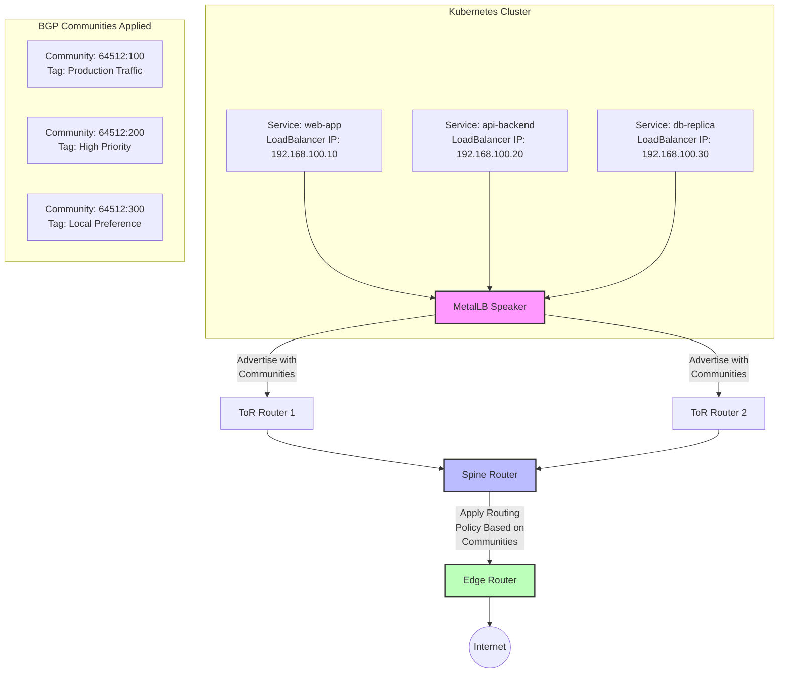
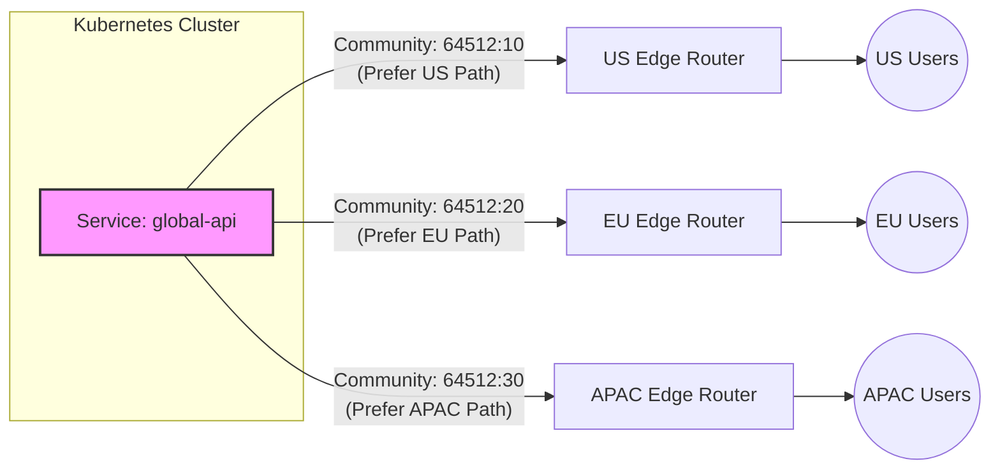
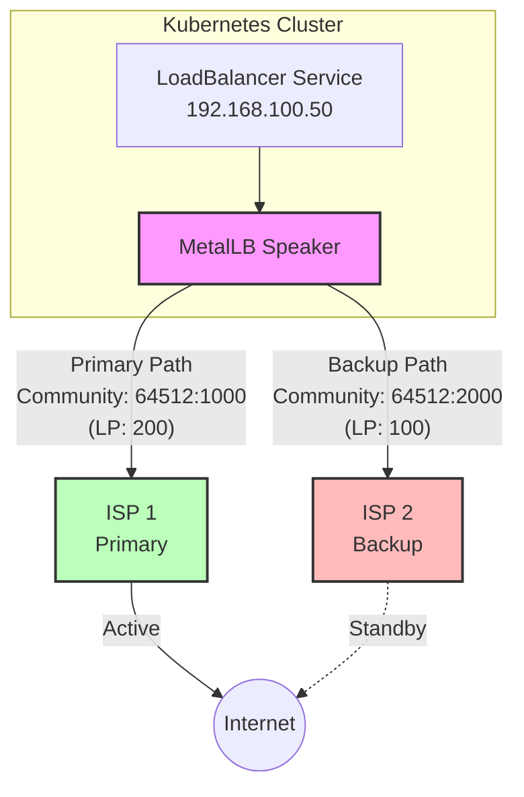
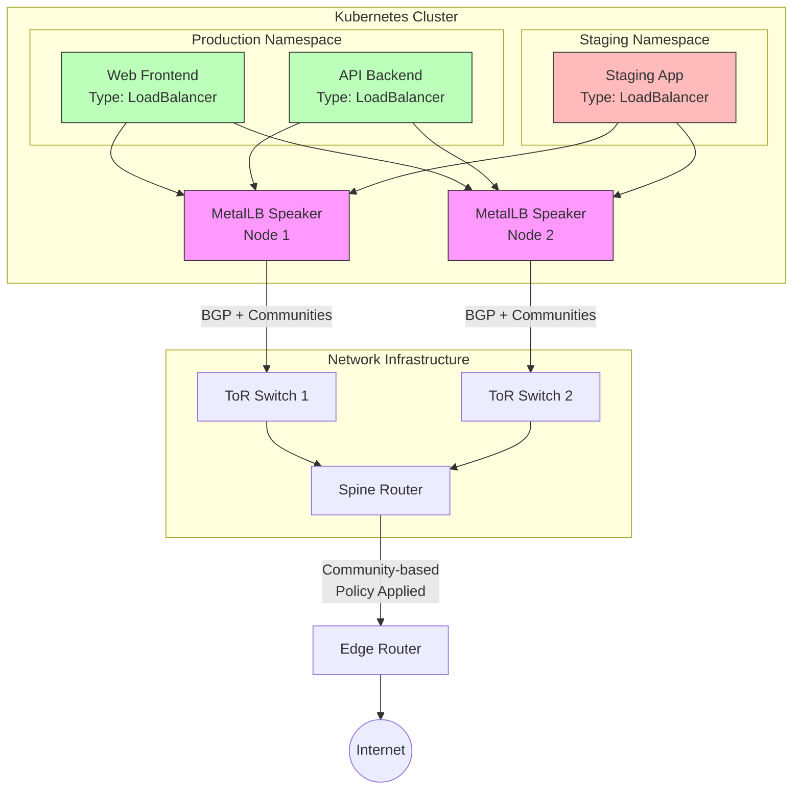

# How to Use BGP Communities with MetalLB

Author: [nawazdhandala](https://github.com/nawazdhandala)

Tags: MetalLB, BGP, Communities, Routing, Kubernetes, Networking

Description: Learn how to use BGP communities in MetalLB for advanced route control.

---

BGP communities are powerful attributes that allow network engineers to tag routes with metadata, enabling sophisticated traffic engineering and routing policy decisions. When combined with MetalLB in Kubernetes environments, BGP communities provide a flexible mechanism to influence how your service IPs are advertised and treated by upstream routers. This comprehensive guide covers everything from basic community configuration to advanced traffic engineering patterns.

## What Are BGP Communities?

BGP communities are 32-bit values attached to route advertisements that act as labels or tags. They enable routers to apply routing policies based on these tags rather than matching specific prefixes. Communities follow the format `ASN:VALUE`, where ASN is the Autonomous System Number and VALUE is a locally defined identifier.

### Types of BGP Communities

There are three main types of BGP communities supported in modern networking:

1. **Standard Communities**: 32-bit values in `ASN:VALUE` format (e.g., `64512:100`)
2. **Extended Communities**: 64-bit values for additional functionality
3. **Large Communities**: 96-bit values in `GlobalAdmin:LocalData1:LocalData2` format, designed for 32-bit ASNs

## Architecture Overview

The following diagram illustrates how BGP communities flow from MetalLB through your network infrastructure:



## Prerequisites

Before configuring BGP communities with MetalLB, ensure you have:

- A Kubernetes cluster with MetalLB installed (version 0.13.0 or later recommended)
- BGP mode enabled in MetalLB
- Access to configure your upstream routers
- Understanding of your network's ASN topology

## Basic BGP Community Configuration

### Step 1: Define the BGP Community

First, create a BGPCommunity resource that defines the community values you want to use. This resource acts as a reusable reference for your BGP advertisements.

```yaml
# BGPCommunity resource defines a named set of community values
# These communities will be attached to route advertisements
apiVersion: metallb.io/v1beta1
kind: Community
metadata:
  # Name used to reference this community in BGPAdvertisement resources
  name: production-communities
  # MetalLB resources should be in the metallb-system namespace
  namespace: metallb-system
spec:
  communities:
    # Define a community for production traffic
    # Format: name -> value mapping
    - name: production
      # Standard community format: ASN:VALUE
      # 64512 is a private ASN, 100 is our local identifier for production
      value: "64512:100"

    # Define a community for high-priority services
    - name: high-priority
      # This community signals upstream routers to prefer these routes
      value: "64512:200"

    # Define a community for backup routes
    - name: backup-route
      # Upstream routers can use this to set lower local preference
      value: "64512:999"
```

Apply this configuration to your cluster:

```bash
# Apply the community definitions to your Kubernetes cluster
# This makes the communities available for use in BGPAdvertisement resources
kubectl apply -f bgp-communities.yaml
```

### Step 2: Create IP Address Pool

Define an IP address pool that MetalLB will use to allocate addresses to LoadBalancer services.

```yaml
# IPAddressPool defines the range of IPs available for LoadBalancer services
# Multiple pools can be created for different purposes (production, staging, etc.)
apiVersion: metallb.io/v1beta1
kind: IPAddressPool
metadata:
  name: production-pool
  namespace: metallb-system
spec:
  # List of IP ranges available for allocation
  # Can be CIDR notation or explicit ranges
  addresses:
    # Production IP range - adjust to match your network
    - 192.168.100.0/24

  # Optionally prevent automatic allocation - require explicit IP requests
  # autoAssign: false
```

### Step 3: Configure BGP Advertisement with Communities

Link the IP pool to BGP advertisements and attach the communities defined earlier.

```yaml
# BGPAdvertisement controls how IPs from address pools are advertised via BGP
# This is where communities are attached to route advertisements
apiVersion: metallb.io/v1beta1
kind: BGPAdvertisement
metadata:
  name: production-advertisement
  namespace: metallb-system
spec:
  # Reference the IP pools whose addresses should be advertised with these settings
  ipAddressPools:
    - production-pool

  # Attach communities to all routes advertised from this pool
  # References the Community resource created earlier
  communities:
    - production-communities

  # Optional: Specify which peers should receive this advertisement
  # If omitted, advertises to all configured BGP peers
  # peers:
  #   - peer-router-1
  #   - peer-router-2

  # Optional: Aggregate routes to reduce BGP table size
  # aggregationLength: 24
  # aggregationLengthV6: 64
```

## Using Large Communities

Large communities (RFC 8092) provide a 96-bit format ideal for networks using 32-bit ASNs or requiring more complex tagging schemes. MetalLB supports large communities through the same Community resource.

### Large Community Configuration

```yaml
# Community resource with large community support
# Large communities use a three-part format for greater flexibility
apiVersion: metallb.io/v1beta1
kind: Community
metadata:
  name: large-communities
  namespace: metallb-system
spec:
  communities:
    # Large community format: GlobalAdmin:LocalData1:LocalData2
    # GlobalAdmin is typically your ASN (supports 32-bit ASNs)
    # LocalData1 and LocalData2 provide additional classification

    - name: region-us-east
      # Format: large:ASN:Region:DataCenter
      # ASN 4200000001 (32-bit private ASN)
      # Region code 1 = US-East
      # Datacenter code 100 = Primary DC
      value: "large:4200000001:1:100"

    - name: region-us-west
      # Same ASN, different region and datacenter codes
      value: "large:4200000001:2:200"

    - name: service-tier-premium
      # Use LocalData1 for service classification
      # LocalData2 for tier level
      value: "large:4200000001:1000:1"

    - name: service-tier-standard
      value: "large:4200000001:1000:2"
```

### Combining Standard and Large Communities

You can use both standard and large communities together for maximum flexibility:

```yaml
# Advertisement using both standard and large communities
# This allows compatibility with legacy routers while using modern features
apiVersion: metallb.io/v1beta1
kind: BGPAdvertisement
metadata:
  name: multi-community-advertisement
  namespace: metallb-system
spec:
  ipAddressPools:
    - production-pool

  # Reference multiple community resources
  # All communities from referenced resources are attached to routes
  communities:
    - production-communities    # Standard communities
    - large-communities         # Large communities
```

## Traffic Engineering Use Cases

BGP communities enable sophisticated traffic engineering patterns. The following sections demonstrate common use cases with complete configurations.

### Use Case 1: Geographic Traffic Steering

Steer traffic through specific geographic paths based on service requirements.



Configuration for geographic steering:

```yaml
# Community definitions for geographic traffic steering
# Each community signals preference for a specific geographic path
apiVersion: metallb.io/v1beta1
kind: Community
metadata:
  name: geo-steering-communities
  namespace: metallb-system
spec:
  communities:
    # Community to signal US path preference
    - name: prefer-us-path
      value: "64512:10"

    # Community to signal EU path preference
    - name: prefer-eu-path
      value: "64512:20"

    # Community to signal APAC path preference
    - name: prefer-apac-path
      value: "64512:30"

    # Community for anycast services (no geographic preference)
    - name: anycast-global
      value: "64512:1"
---
# IP pool for US-preferred services
apiVersion: metallb.io/v1beta1
kind: IPAddressPool
metadata:
  name: us-preferred-pool
  namespace: metallb-system
spec:
  addresses:
    - 192.168.100.0/26
---
# Advertisement for US-preferred services
apiVersion: metallb.io/v1beta1
kind: BGPAdvertisement
metadata:
  name: us-preferred-advertisement
  namespace: metallb-system
spec:
  ipAddressPools:
    - us-preferred-pool
  communities:
    - geo-steering-communities
  # Only advertise the prefer-us-path community
  # This is achieved by creating separate Community resources per geo
```

### Use Case 2: Traffic Prioritization with Local Preference

Use communities to influence local preference on upstream routers, controlling which paths are preferred for return traffic.

```yaml
# Communities for traffic prioritization
# Upstream routers interpret these to set local preference values
apiVersion: metallb.io/v1beta1
kind: Community
metadata:
  name: priority-communities
  namespace: metallb-system
spec:
  communities:
    # Critical services - highest priority
    # Upstream sets local preference to 300
    - name: critical-priority
      value: "64512:300"

    # Standard production services
    # Upstream sets local preference to 200
    - name: standard-priority
      value: "64512:200"

    # Development/testing services - lowest priority
    # Upstream sets local preference to 100
    - name: low-priority
      value: "64512:100"
---
# Pool for critical services
apiVersion: metallb.io/v1beta1
kind: IPAddressPool
metadata:
  name: critical-services-pool
  namespace: metallb-system
spec:
  addresses:
    - 192.168.101.0/28
---
# Pool for standard services
apiVersion: metallb.io/v1beta1
kind: IPAddressPool
metadata:
  name: standard-services-pool
  namespace: metallb-system
spec:
  addresses:
    - 192.168.101.16/28
---
# Advertisement for critical services with high priority community
apiVersion: metallb.io/v1beta1
kind: BGPAdvertisement
metadata:
  name: critical-services-ad
  namespace: metallb-system
spec:
  ipAddressPools:
    - critical-services-pool
  communities:
    - priority-communities
```

### Use Case 3: Multi-Homed Failover Configuration

Configure primary and backup paths using communities to control failover behavior.



```yaml
# Communities for multi-homed failover configuration
# Primary path gets higher local preference than backup
apiVersion: metallb.io/v1beta1
kind: Community
metadata:
  name: failover-communities
  namespace: metallb-system
spec:
  communities:
    # Primary path - advertise to ISP1 with high priority
    - name: primary-path
      value: "64512:1000"

    # Backup path - advertise to ISP2 with lower priority
    - name: backup-path
      value: "64512:2000"

    # No-export community - prevent routes from being advertised further
    # Useful for keeping backup routes local to the immediate peer
    - name: no-export-backup
      value: "65535:65281"
---
# BGP Peer configuration for primary ISP
apiVersion: metallb.io/v1beta1
kind: BGPPeer
metadata:
  name: isp1-primary
  namespace: metallb-system
spec:
  # Primary ISP router IP
  peerAddress: 10.0.0.1
  # Primary ISP ASN
  peerASN: 65001
  # Our local ASN
  myASN: 64512
  # Source address for BGP session
  sourceAddress: 10.0.0.2
  # Optional: BFD for fast failure detection
  bfdProfile: production-bfd
---
# BGP Peer configuration for backup ISP
apiVersion: metallb.io/v1beta1
kind: BGPPeer
metadata:
  name: isp2-backup
  namespace: metallb-system
spec:
  peerAddress: 10.1.0.1
  peerASN: 65002
  myASN: 64512
  sourceAddress: 10.1.0.2
```

### Use Case 4: Blackhole Routing for DDoS Mitigation

Communities can trigger upstream blackhole routing to mitigate DDoS attacks.

```yaml
# Communities for blackhole/RTBH (Remote Triggered Blackhole) routing
# WARNING: Use with extreme caution - these will drop all traffic to the prefix
apiVersion: metallb.io/v1beta1
kind: Community
metadata:
  name: blackhole-communities
  namespace: metallb-system
spec:
  communities:
    # Standard blackhole community (RFC 7999)
    # Signals upstream to null-route this prefix
    - name: blackhole
      value: "65535:666"

    # ISP-specific blackhole community (example)
    # Check with your ISP for their specific community values
    - name: isp-blackhole
      value: "65001:666"
---
# Separate pool for blackhole-able addresses
# Only use this pool for IPs you may need to blackhole
apiVersion: metallb.io/v1beta1
kind: IPAddressPool
metadata:
  name: blackhole-capable-pool
  namespace: metallb-system
spec:
  addresses:
    - 192.168.200.0/24
  # Require explicit IP assignment - don't auto-allocate
  autoAssign: false
```

## Router-Side Configuration Examples

For communities to be effective, upstream routers must be configured to interpret and act on them. Below are configuration examples for common router platforms.

### Cisco IOS-XE Configuration

```cisco
! Define community lists to match MetalLB communities
! These lists are used in route-maps to apply policies

! Match production traffic community
ip community-list standard METALLB-PRODUCTION permit 64512:100

! Match high-priority community
ip community-list standard METALLB-HIGH-PRIORITY permit 64512:200

! Match backup route community
ip community-list standard METALLB-BACKUP permit 64512:999

! Match blackhole community (RFC 7999)
ip community-list standard METALLB-BLACKHOLE permit 65535:666

! Route-map to process incoming MetalLB advertisements
route-map METALLB-INBOUND permit 10
 description Set high local preference for high-priority services
 match community METALLB-HIGH-PRIORITY
 set local-preference 300
!
route-map METALLB-INBOUND permit 20
 description Set normal local preference for production services
 match community METALLB-PRODUCTION
 set local-preference 200
!
route-map METALLB-INBOUND permit 30
 description Set low local preference for backup routes
 match community METALLB-BACKUP
 set local-preference 50
!
route-map METALLB-INBOUND permit 40
 description Blackhole matching routes for DDoS mitigation
 match community METALLB-BLACKHOLE
 set ip next-hop 192.0.2.1
 set local-preference 500
 set origin igp
!
route-map METALLB-INBOUND permit 100
 description Allow all other routes with default preference

! Apply route-map to BGP neighbor (MetalLB speaker)
router bgp 65001
 neighbor 10.0.0.2 remote-as 64512
 neighbor 10.0.0.2 description MetalLB-Speaker
 neighbor 10.0.0.2 route-map METALLB-INBOUND in
 !
 ! Null route for blackhole traffic
 ip route 192.0.2.1 255.255.255.255 Null0
```

### Juniper Junos Configuration

```junos
# Define community definitions for MetalLB
# These are referenced in routing policies

policy-options {
    # Community definitions matching MetalLB advertisements
    community metallb-production members 64512:100;
    community metallb-high-priority members 64512:200;
    community metallb-backup members 64512:999;
    community metallb-blackhole members 65535:666;

    # Large community example
    community metallb-region-us members large:4200000001:1:*;

    # Policy to process MetalLB route advertisements
    policy-statement metallb-import {
        # High priority services get highest local preference
        term high-priority {
            from community metallb-high-priority;
            then {
                local-preference 300;
                accept;
            }
        }
        # Production services get standard local preference
        term production {
            from community metallb-production;
            then {
                local-preference 200;
                accept;
            }
        }
        # Backup routes get low local preference
        term backup {
            from community metallb-backup;
            then {
                local-preference 50;
                accept;
            }
        }
        # Blackhole routes for DDoS mitigation
        term blackhole {
            from community metallb-blackhole;
            then {
                local-preference 500;
                next-hop 192.0.2.1;
                accept;
            }
        }
        # Accept remaining routes with defaults
        term default {
            then accept;
        }
    }
}

# Configure static discard route for blackhole
routing-options {
    static {
        route 192.0.2.1/32 discard;
    }
}

# Apply policy to BGP neighbor
protocols {
    bgp {
        group metallb-speakers {
            type external;
            peer-as 64512;
            neighbor 10.0.0.2 {
                description "MetalLB Speaker Node 1";
                import metallb-import;
            }
        }
    }
}
```

### FRRouting (FRR) Configuration

FRR is commonly used in software-defined networking and is compatible with many Linux-based routers.

```frr
! FRRouting configuration for MetalLB community handling
! This configuration goes in /etc/frr/frr.conf

! Define community lists
bgp community-list standard metallb-production permit 64512:100
bgp community-list standard metallb-high-priority permit 64512:200
bgp community-list standard metallb-backup permit 64512:999
bgp community-list standard metallb-blackhole permit 65535:666

! Define large community list for 32-bit ASN support
bgp large-community-list standard metallb-us-region permit 4200000001:1:*

! Route-map for inbound policy from MetalLB
route-map metallb-in permit 10
 description High priority services
 match community metallb-high-priority
 set local-preference 300
!
route-map metallb-in permit 20
 description Production services
 match community metallb-production
 set local-preference 200
!
route-map metallb-in permit 30
 description Backup routes
 match community metallb-backup
 set local-preference 50
!
route-map metallb-in permit 40
 description Blackhole for DDoS mitigation
 match community metallb-blackhole
 set ip next-hop 192.0.2.1
 set local-preference 500
!
route-map metallb-in permit 100
 description Accept remaining routes

! BGP configuration
router bgp 65001
 bgp router-id 10.0.0.1

 ! MetalLB speaker neighbor
 neighbor 10.0.0.2 remote-as 64512
 neighbor 10.0.0.2 description MetalLB-Speaker-1

 address-family ipv4 unicast
  neighbor 10.0.0.2 route-map metallb-in in
  neighbor 10.0.0.2 send-community both
 exit-address-family

! Static null route for blackhole destination
ip route 192.0.2.1/32 blackhole
```

## Complete End-to-End Example

Here is a complete configuration demonstrating all concepts together:



```yaml
# Complete MetalLB BGP Communities Configuration
# This example demonstrates a production-ready setup

---
# 1. Community Definitions
# Organize communities by purpose for clarity
apiVersion: metallb.io/v1beta1
kind: Community
metadata:
  name: traffic-class-communities
  namespace: metallb-system
spec:
  communities:
    # Production traffic - high priority
    - name: production-critical
      value: "64512:100"
    - name: production-standard
      value: "64512:101"

    # Staging traffic - lower priority
    - name: staging
      value: "64512:200"

    # Geographic hints
    - name: datacenter-east
      value: "64512:1001"
    - name: datacenter-west
      value: "64512:1002"

---
# Large communities for extended classification
apiVersion: metallb.io/v1beta1
kind: Community
metadata:
  name: service-tier-communities
  namespace: metallb-system
spec:
  communities:
    # Large community format for detailed classification
    # Format: large:ASN:ServiceType:Priority
    - name: tier1-web
      value: "large:64512:1:100"
    - name: tier2-api
      value: "large:64512:2:100"
    - name: tier3-internal
      value: "large:64512:3:50"

---
# 2. IP Address Pools
# Separate pools for different service classes

apiVersion: metallb.io/v1beta1
kind: IPAddressPool
metadata:
  name: production-critical-pool
  namespace: metallb-system
spec:
  addresses:
    # Reserve a small pool for critical services
    - 192.168.100.0/28
  # Prevent auto-allocation - require explicit requests
  autoAssign: false

---
apiVersion: metallb.io/v1beta1
kind: IPAddressPool
metadata:
  name: production-standard-pool
  namespace: metallb-system
spec:
  addresses:
    # Larger pool for standard production services
    - 192.168.100.16/28
    - 192.168.100.32/28

---
apiVersion: metallb.io/v1beta1
kind: IPAddressPool
metadata:
  name: staging-pool
  namespace: metallb-system
spec:
  addresses:
    # Separate range for staging
    - 192.168.200.0/24

---
# 3. BGP Peer Configuration
# Define connections to upstream routers

apiVersion: metallb.io/v1beta1
kind: BGPPeer
metadata:
  name: tor-switch-1
  namespace: metallb-system
spec:
  # Upstream router address
  peerAddress: 10.0.1.1
  # Upstream router ASN
  peerASN: 65001
  # Our ASN
  myASN: 64512
  # Optional: specify source address for BGP session
  sourceAddress: 10.0.1.2
  # Node selector - only specific nodes peer with this router
  nodeSelectors:
    - matchLabels:
        rack: rack-1
  # Enable BFD for fast failure detection
  bfdProfile: fast-failover
  # Password for BGP session (use Kubernetes secret in production)
  # password: secretref:metallb-bgp-password

---
apiVersion: metallb.io/v1beta1
kind: BGPPeer
metadata:
  name: tor-switch-2
  namespace: metallb-system
spec:
  peerAddress: 10.0.2.1
  peerASN: 65001
  myASN: 64512
  sourceAddress: 10.0.2.2
  nodeSelectors:
    - matchLabels:
        rack: rack-2
  bfdProfile: fast-failover

---
# 4. BFD Profile for Fast Failover
apiVersion: metallb.io/v1beta1
kind: BFDProfile
metadata:
  name: fast-failover
  namespace: metallb-system
spec:
  # BFD timers for sub-second failover
  receiveInterval: 300
  transmitInterval: 300
  detectMultiplier: 3
  # Echo mode for even faster detection
  echoMode: true
  echoInterval: 50

---
# 5. BGP Advertisements
# Link pools to communities and control advertisement behavior

apiVersion: metallb.io/v1beta1
kind: BGPAdvertisement
metadata:
  name: critical-production-ad
  namespace: metallb-system
spec:
  ipAddressPools:
    - production-critical-pool
  # Attach traffic class and service tier communities
  communities:
    - traffic-class-communities
    - service-tier-communities
  # Advertise to all peers
  # Could restrict with: peers: [tor-switch-1, tor-switch-2]

  # Optional: aggregate to reduce BGP table size
  # aggregationLength: 28

---
apiVersion: metallb.io/v1beta1
kind: BGPAdvertisement
metadata:
  name: standard-production-ad
  namespace: metallb-system
spec:
  ipAddressPools:
    - production-standard-pool
  communities:
    - traffic-class-communities
  # Local preference hint via community
  # Upstream router interprets 64512:101 as standard priority

---
apiVersion: metallb.io/v1beta1
kind: BGPAdvertisement
metadata:
  name: staging-ad
  namespace: metallb-system
spec:
  ipAddressPools:
    - staging-pool
  communities:
    - traffic-class-communities
  # Only advertise to specific peers if needed
  # Useful for keeping staging traffic on specific paths
```

### Deploying a Service with Specific Communities

Once the infrastructure is configured, deploy services that use specific pools:

```yaml
# Example: Critical production service requesting specific IP pool
apiVersion: v1
kind: Service
metadata:
  name: payment-gateway
  namespace: production
  annotations:
    # Request IP from the critical pool (inherits its communities)
    metallb.universe.tf/address-pool: production-critical-pool
    # Optionally request a specific IP
    # metallb.universe.tf/loadBalancerIPs: 192.168.100.1
spec:
  type: LoadBalancer
  selector:
    app: payment-gateway
  ports:
    - name: https
      port: 443
      targetPort: 8443
      protocol: TCP
```

## Verifying BGP Community Configuration

After deploying your configuration, verify that communities are being advertised correctly.

### Check MetalLB Status

```bash
# View MetalLB speaker logs for BGP session status and advertisements
# Look for community information in route announcements
kubectl logs -n metallb-system -l app=metallb,component=speaker -f

# Check the status of BGP peers
kubectl get bgppeers -n metallb-system -o wide

# View configured communities
kubectl get communities -n metallb-system -o yaml

# Check IP address allocations
kubectl get ipaddresspools -n metallb-system
kubectl get services -A -o wide | grep LoadBalancer
```

### Verify on Upstream Router

Check that communities are received on your upstream router:

```cisco
! Cisco IOS - View received routes with communities
show ip bgp neighbors 10.0.0.2 received-routes
show ip bgp community 64512:100

! View detailed BGP entry with communities
show ip bgp 192.168.100.1/32
```

```junos
# Juniper Junos - View received routes with communities
show route receive-protocol bgp 10.0.0.2 detail
show route community 64512:100

# View routing table entries with community info
show route 192.168.100.1/32 extensive
```

```bash
# FRRouting - View received routes with communities
vtysh -c "show ip bgp neighbors 10.0.0.2 received-routes"
vtysh -c "show ip bgp community 64512:100"
vtysh -c "show ip bgp 192.168.100.1/32"
```

## Troubleshooting Common Issues

### Communities Not Being Advertised

If communities are not appearing on upstream routers:

```bash
# 1. Verify the Community resource is created correctly
kubectl get community -n metallb-system -o yaml

# 2. Check BGPAdvertisement references the correct community
kubectl get bgpadvertisement -n metallb-system -o yaml

# 3. Verify the service is using the correct address pool
kubectl get svc <service-name> -o yaml | grep -A5 annotations

# 4. Check MetalLB speaker logs for errors
kubectl logs -n metallb-system -l component=speaker | grep -i community

# 5. Verify BGP session is established
kubectl logs -n metallb-system -l component=speaker | grep -i "session established"
```

### Wrong Community Values Applied

If incorrect community values are being advertised:

```yaml
# Verify community format is correct
# Standard: "ASN:VALUE" where both are 16-bit (0-65535)
# Large: "large:GA:LD1:LD2" where GA is 32-bit, LD1/LD2 are 32-bit

# CORRECT formats:
value: "64512:100"           # Standard community
value: "large:4200000001:1:100"  # Large community

# INCORRECT formats:
value: "64512-100"           # Wrong separator
value: "4200000001:1:100"    # Missing 'large:' prefix for large community
```

### BGP Session Not Establishing

```bash
# Check BGP peer configuration
kubectl get bgppeer -n metallb-system -o yaml

# Verify network connectivity to peer
kubectl exec -n metallb-system <speaker-pod> -- ping -c 3 <peer-address>

# Check for BGP errors in logs
kubectl logs -n metallb-system -l component=speaker | grep -iE "bgp|peer|error"

# Verify ASN configuration matches on both sides
# MetalLB myASN should match what upstream expects
# peerASN should match the upstream router's ASN
```

## Best Practices

When implementing BGP communities with MetalLB, follow these best practices:

1. **Document Your Community Scheme**: Maintain a registry of community values and their meanings. This prevents conflicts and aids troubleshooting.

2. **Use Private ASNs**: For internal use, stick to private ASN ranges (64512-65534 for 16-bit, 4200000000-4294967294 for 32-bit).

3. **Test in Staging First**: Always validate community behavior in a non-production environment before deploying to production.

4. **Coordinate with Network Team**: Ensure upstream router configurations match your MetalLB community definitions.

5. **Monitor Community Propagation**: Set up monitoring to verify communities are being correctly propagated through your network.

6. **Use Large Communities for Future-Proofing**: If you anticipate growth or use 32-bit ASNs, prefer large communities for new deployments.

7. **Implement Gradually**: Start with basic communities and add complexity as needed. It's easier to add communities than to remove dependencies on them.

## Conclusion

BGP communities provide a powerful mechanism for controlling how MetalLB advertises Kubernetes service IPs to your network infrastructure. By properly configuring communities, you can implement sophisticated traffic engineering patterns including geographic steering, prioritization, multi-homed failover, and DDoS mitigation.

The key to success is careful planning of your community scheme, coordination with your network team, and thorough testing before production deployment. With the configurations and patterns shown in this guide, you have the foundation to implement enterprise-grade BGP routing policies for your Kubernetes services.

**Related Reading:**

- [How to configure MetalLB with Kubernetes (Microk8s)](https://oneuptime.com/blog/post/2023-11-06-configure-metallb-with-kubernetes-microk8s/view)
- [How moving from AWS to Bare-Metal saved us $230,000 /yr.](https://oneuptime.com/blog/post/2023-10-30-moving-from-aws-to-bare-metal/view)
- [MetalLB Official Documentation](https://metallb.universe.tf/)
