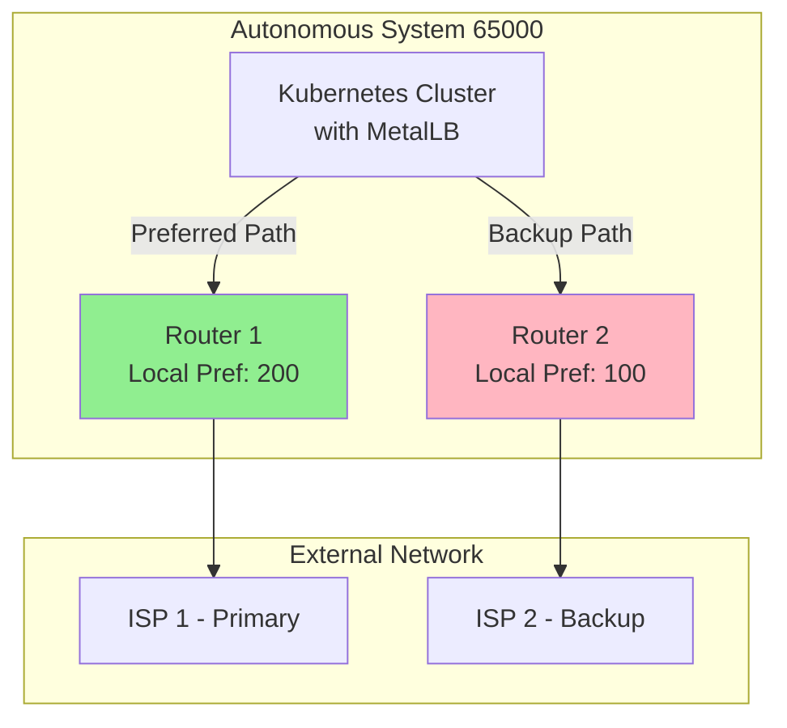
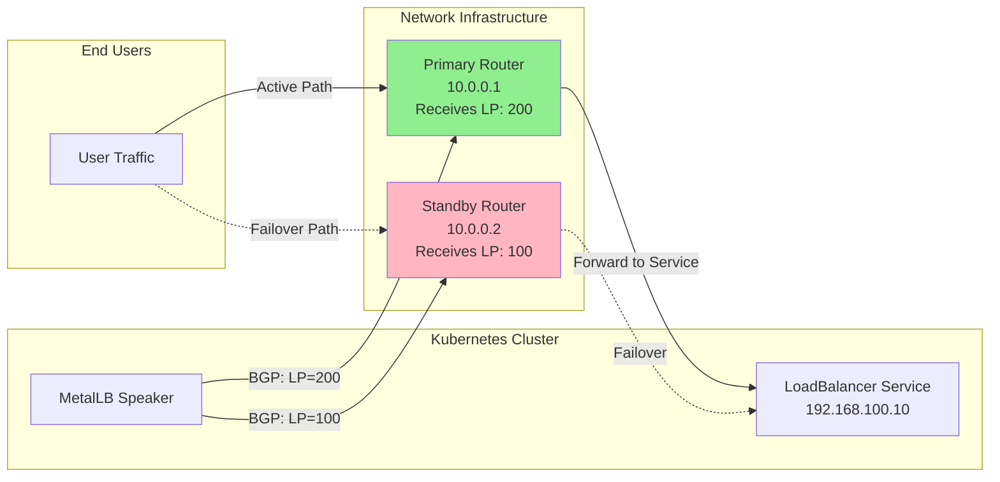
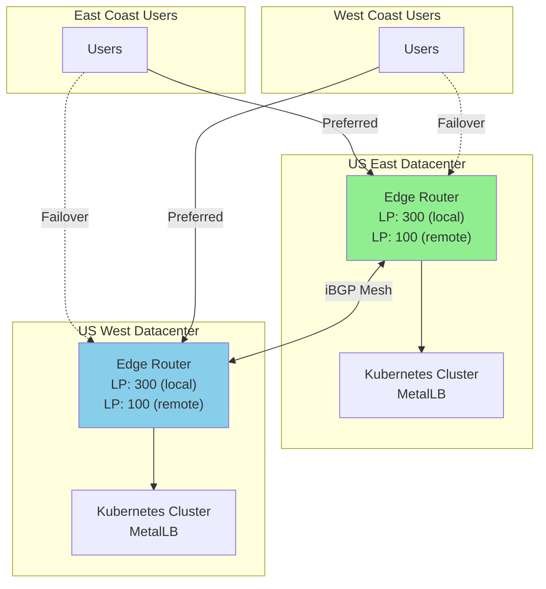
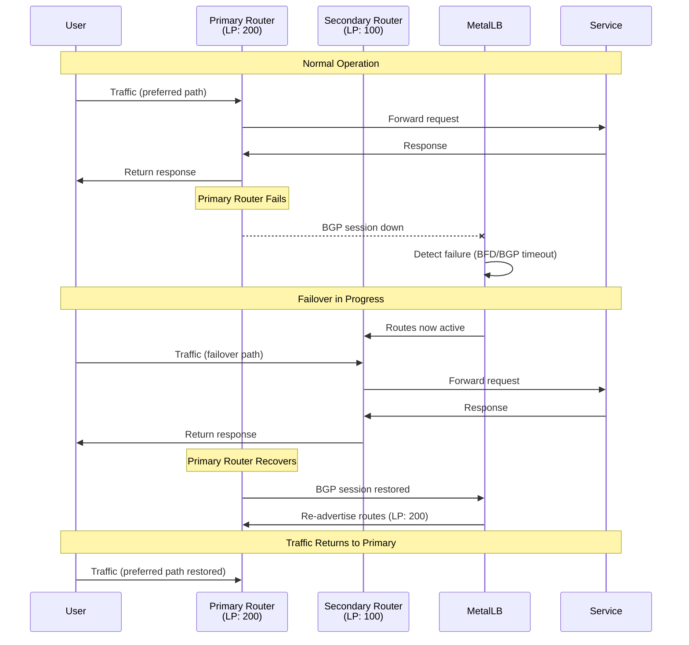

# How to Configure BGP Local Preference in MetalLB

Author: [nawazdhandala](https://github.com/nawazdhandala)

Tags: MetalLB, BGP, Local Preference, Traffic Engineering, Kubernetes

Description: A guide to using BGP local preference for traffic engineering with MetalLB.

---

## Introduction

BGP Local Preference is one of the most powerful attributes for controlling outbound traffic paths in your network. When running MetalLB in BGP mode on Kubernetes, understanding and properly configuring local preference can help you implement sophisticated traffic engineering patterns such as active-standby setups, geographic routing, and graceful failover mechanisms.

In this comprehensive guide, we will explore how to configure BGP local preference in MetalLB, covering everything from basic concepts to advanced multi-datacenter deployment patterns.

## Understanding BGP Local Preference

Local preference is a BGP attribute that influences the path selection for outbound traffic. Unlike other BGP attributes, local preference is only exchanged between iBGP peers within the same Autonomous System (AS). The higher the local preference value, the more preferred the route.

The following diagram illustrates how local preference affects route selection:



## Prerequisites

Before configuring BGP local preference in MetalLB, ensure you have:

- A Kubernetes cluster (v1.20 or later)
- MetalLB installed in BGP mode (v0.13.0 or later)
- BGP-capable routers or network infrastructure
- Understanding of your network topology and AS numbers

## Basic Local Preference Configuration

MetalLB supports setting local preference through the BGPPeer and BGPAdvertisement custom resources. Let's start with a basic configuration.

### Step 1: Define BGP Peers with Local Preference

The following configuration creates two BGP peers with different local preference values. The primary peer has a higher local preference (200) making it the preferred path, while the secondary peer has a lower value (100) serving as a backup.

```yaml
# bgp-peers.yaml
# This configuration establishes BGP peering with two routers
# Local preference determines which path is preferred for outbound traffic
apiVersion: metallb.io/v1beta2
kind: BGPPeer
metadata:
  name: primary-router
  namespace: metallb-system
spec:
  # The IP address of the primary router
  peerAddress: 10.0.0.1
  # The AS number of the peer (external AS for eBGP)
  peerASN: 65001
  # Our local AS number
  myASN: 65000
  # Higher local preference means this path is preferred
  # Default is 100, we set 200 to make this the primary path
  routerID: 10.0.0.10
  # Optional: specify source address for BGP sessions
  sourceAddress: 10.0.0.10
  # BGP session parameters
  holdTime: 90s
  keepaliveTime: 30s
---
apiVersion: metallb.io/v1beta2
kind: BGPPeer
metadata:
  name: secondary-router
  namespace: metallb-system
spec:
  peerAddress: 10.0.0.2
  peerASN: 65002
  myASN: 65000
  routerID: 10.0.0.10
  sourceAddress: 10.0.0.10
  holdTime: 90s
  keepaliveTime: 30s
```

### Step 2: Configure IP Address Pools

Create an IP address pool that MetalLB will use to assign external IPs to LoadBalancer services.

```yaml
# ip-address-pool.yaml
# Define the pool of IP addresses available for LoadBalancer services
apiVersion: metallb.io/v1beta1
kind: IPAddressPool
metadata:
  name: production-pool
  namespace: metallb-system
spec:
  # The range of IP addresses to allocate
  # These should be routable from your network
  addresses:
    - 192.168.100.0/24
  # Automatically assign IPs to services without annotation
  autoAssign: true
  # Avoid allocating .0 and .255 addresses
  avoidBuggyIPs: true
```

### Step 3: Create BGP Advertisements with Local Preference

The BGPAdvertisement resource allows you to control how routes are advertised and set the local preference for each advertisement.

```yaml
# bgp-advertisements.yaml
# This configuration advertises routes with different local preferences
# to implement active-standby routing
apiVersion: metallb.io/v1beta1
kind: BGPAdvertisement
metadata:
  name: primary-advertisement
  namespace: metallb-system
spec:
  # Reference to the IP address pools to advertise
  ipAddressPools:
    - production-pool
  # Only advertise to the primary peer
  peers:
    - primary-router
  # Set high local preference for the primary path
  # Routes with higher local preference are preferred
  localPref: 200
  # Optional: aggregate routes to reduce routing table size
  aggregationLength: 32
  # Optional: add BGP communities for additional routing policies
  communities:
    - primary-path
---
apiVersion: metallb.io/v1beta1
kind: BGPAdvertisement
metadata:
  name: secondary-advertisement
  namespace: metallb-system
spec:
  ipAddressPools:
    - production-pool
  peers:
    - secondary-router
  # Lower local preference makes this the backup path
  localPref: 100
  aggregationLength: 32
  communities:
    - backup-path
```

## Active-Standby Pattern Implementation

The active-standby pattern ensures that traffic primarily flows through one path while maintaining a backup path for failover. This is crucial for high availability deployments.

### Architecture Overview



### Complete Active-Standby Configuration

The following comprehensive configuration implements a full active-standby setup with health checking and graceful failover.

```yaml
# active-standby-complete.yaml
# Complete active-standby configuration for MetalLB BGP
# This setup ensures high availability with automatic failover

---
# Primary BGP Peer - Active path
apiVersion: metallb.io/v1beta2
kind: BGPPeer
metadata:
  name: active-peer
  namespace: metallb-system
  labels:
    role: active
spec:
  peerAddress: 10.0.0.1
  peerASN: 65001
  myASN: 65000
  # Enable BFD for faster failure detection
  # BFD can detect failures in milliseconds vs seconds for BGP
  bfdProfile: fast-failover
  # Node selector to control which nodes peer with this router
  nodeSelectors:
    - matchLabels:
        node-role.kubernetes.io/worker: "true"
  # Optional: password for BGP session authentication
  # password: <secret-reference>
  holdTime: 90s
  keepaliveTime: 30s
---
# Secondary BGP Peer - Standby path
apiVersion: metallb.io/v1beta2
kind: BGPPeer
metadata:
  name: standby-peer
  namespace: metallb-system
  labels:
    role: standby
spec:
  peerAddress: 10.0.0.2
  peerASN: 65002
  myASN: 65000
  bfdProfile: fast-failover
  nodeSelectors:
    - matchLabels:
        node-role.kubernetes.io/worker: "true"
  holdTime: 90s
  keepaliveTime: 30s
---
# BFD Profile for fast failure detection
# BFD runs independently of BGP and can detect link failures much faster
apiVersion: metallb.io/v1beta1
kind: BFDProfile
metadata:
  name: fast-failover
  namespace: metallb-system
spec:
  # Interval between BFD packets (in milliseconds)
  receiveInterval: 300
  transmitInterval: 300
  # Number of missed packets before declaring failure
  detectMultiplier: 3
  # Echo mode for even faster detection (if supported)
  echoMode: false
  # Passive mode - wait for peer to initiate
  passiveMode: false
  # Minimum TTL for BFD packets (security feature)
  minimumTtl: 254
---
# IP Address Pool for the active-standby setup
apiVersion: metallb.io/v1beta1
kind: IPAddressPool
metadata:
  name: ha-pool
  namespace: metallb-system
spec:
  addresses:
    - 192.168.100.0/24
  autoAssign: true
---
# BGP Communities for traffic engineering
# Communities allow routers to apply policies based on route tags
apiVersion: metallb.io/v1beta1
kind: Community
metadata:
  name: routing-communities
  namespace: metallb-system
spec:
  communities:
    # Community for primary path traffic
    - name: primary-path
      # Format: ASN:value
      value: "65000:100"
    # Community for backup path traffic
    - name: backup-path
      value: "65000:200"
    # Community to signal graceful maintenance
    - name: maintenance-mode
      value: "65000:666"
---
# Advertisement for the active path with high local preference
apiVersion: metallb.io/v1beta1
kind: BGPAdvertisement
metadata:
  name: active-path-advertisement
  namespace: metallb-system
spec:
  ipAddressPools:
    - ha-pool
  peers:
    - active-peer
  # High local preference makes this the preferred path
  localPref: 200
  communities:
    - primary-path
  # Aggregate routes for cleaner routing tables
  aggregationLength: 32
---
# Advertisement for the standby path with low local preference
apiVersion: metallb.io/v1beta1
kind: BGPAdvertisement
metadata:
  name: standby-path-advertisement
  namespace: metallb-system
spec:
  ipAddressPools:
    - ha-pool
  peers:
    - standby-peer
  # Lower local preference - only used when active path fails
  localPref: 100
  communities:
    - backup-path
  aggregationLength: 32
```

## Geographic Routing Configuration

For multi-datacenter deployments, you can use local preference to implement geographic routing, ensuring traffic is routed to the nearest datacenter while maintaining cross-datacenter failover capability.

### Multi-Datacenter Architecture



### Geographic Routing Configuration

The following configuration implements geographic routing for a US East datacenter. A similar configuration would be applied to the US West datacenter with adjusted local preference values.

```yaml
# geo-routing-east.yaml
# Geographic routing configuration for US East datacenter
# Traffic from East Coast users is preferred to stay local
# Cross-datacenter failover is available with lower preference

---
# Local router in US East datacenter
apiVersion: metallb.io/v1beta2
kind: BGPPeer
metadata:
  name: east-local-router
  namespace: metallb-system
  labels:
    datacenter: us-east
    type: local
spec:
  peerAddress: 10.1.0.1
  peerASN: 65001
  myASN: 65000
  # Use router ID unique to this datacenter
  routerID: 10.1.0.10
  bfdProfile: datacenter-bfd
  holdTime: 90s
  keepaliveTime: 30s
---
# Remote router connecting to US West datacenter
apiVersion: metallb.io/v1beta2
kind: BGPPeer
metadata:
  name: east-remote-router
  namespace: metallb-system
  labels:
    datacenter: us-east
    type: remote
spec:
  peerAddress: 10.1.0.2
  peerASN: 65002
  myASN: 65000
  routerID: 10.1.0.10
  bfdProfile: datacenter-bfd
  holdTime: 90s
  keepaliveTime: 30s
---
# BFD Profile optimized for datacenter environment
apiVersion: metallb.io/v1beta1
kind: BFDProfile
metadata:
  name: datacenter-bfd
  namespace: metallb-system
spec:
  # Slightly longer intervals for WAN links
  receiveInterval: 500
  transmitInterval: 500
  detectMultiplier: 3
  echoMode: false
  passiveMode: false
  minimumTtl: 254
---
# IP Pool for US East services
apiVersion: metallb.io/v1beta1
kind: IPAddressPool
metadata:
  name: east-pool
  namespace: metallb-system
  labels:
    datacenter: us-east
spec:
  addresses:
    # Anycast range - same IPs in both datacenters
    - 192.168.200.0/24
  autoAssign: true
---
# Communities for geographic routing
apiVersion: metallb.io/v1beta1
kind: Community
metadata:
  name: geo-communities
  namespace: metallb-system
spec:
  communities:
    # Indicates route originated in US East
    - name: origin-us-east
      value: "65000:1001"
    # Indicates route originated in US West
    - name: origin-us-west
      value: "65000:1002"
    # High preference community
    - name: prefer-local
      value: "65000:2000"
    # Low preference community
    - name: prefer-remote
      value: "65000:2001"
---
# Advertisement for local traffic in US East
# High local preference ensures East Coast traffic stays local
apiVersion: metallb.io/v1beta1
kind: BGPAdvertisement
metadata:
  name: east-local-advertisement
  namespace: metallb-system
spec:
  ipAddressPools:
    - east-pool
  peers:
    - east-local-router
  # Highest preference for local datacenter traffic
  localPref: 300
  communities:
    - origin-us-east
    - prefer-local
  aggregationLength: 32
---
# Advertisement for cross-datacenter failover
# Lower local preference ensures this is only used when local path fails
apiVersion: metallb.io/v1beta1
kind: BGPAdvertisement
metadata:
  name: east-remote-advertisement
  namespace: metallb-system
spec:
  ipAddressPools:
    - east-pool
  peers:
    - east-remote-router
  # Lower preference for cross-datacenter traffic
  localPref: 100
  communities:
    - origin-us-east
    - prefer-remote
  aggregationLength: 32
```

### US West Datacenter Configuration

```yaml
# geo-routing-west.yaml
# Geographic routing configuration for US West datacenter
# Mirror of East configuration with appropriate adjustments

---
apiVersion: metallb.io/v1beta2
kind: BGPPeer
metadata:
  name: west-local-router
  namespace: metallb-system
  labels:
    datacenter: us-west
    type: local
spec:
  peerAddress: 10.2.0.1
  peerASN: 65003
  myASN: 65000
  routerID: 10.2.0.10
  bfdProfile: datacenter-bfd
  holdTime: 90s
  keepaliveTime: 30s
---
apiVersion: metallb.io/v1beta2
kind: BGPPeer
metadata:
  name: west-remote-router
  namespace: metallb-system
  labels:
    datacenter: us-west
    type: remote
spec:
  peerAddress: 10.2.0.2
  peerASN: 65004
  myASN: 65000
  routerID: 10.2.0.10
  bfdProfile: datacenter-bfd
  holdTime: 90s
  keepaliveTime: 30s
---
# IP Pool for US West services
apiVersion: metallb.io/v1beta1
kind: IPAddressPool
metadata:
  name: west-pool
  namespace: metallb-system
  labels:
    datacenter: us-west
spec:
  addresses:
    # Same anycast range as East for seamless failover
    - 192.168.200.0/24
  autoAssign: true
---
# Local advertisement for US West
apiVersion: metallb.io/v1beta1
kind: BGPAdvertisement
metadata:
  name: west-local-advertisement
  namespace: metallb-system
spec:
  ipAddressPools:
    - west-pool
  peers:
    - west-local-router
  localPref: 300
  communities:
    - origin-us-west
    - prefer-local
  aggregationLength: 32
---
# Remote advertisement for cross-datacenter failover
apiVersion: metallb.io/v1beta1
kind: BGPAdvertisement
metadata:
  name: west-remote-advertisement
  namespace: metallb-system
spec:
  ipAddressPools:
    - west-pool
  peers:
    - west-remote-router
  localPref: 100
  communities:
    - origin-us-west
    - prefer-remote
  aggregationLength: 32
```

## Failover Behavior and Testing

Understanding and testing failover behavior is critical for production deployments. This section covers how MetalLB handles failures and how to verify your configuration.

### Failover Timeline



### Testing Failover

Use the following commands and procedures to test your failover configuration.

```bash
#!/bin/bash
# failover-test.sh
# Script to test MetalLB BGP failover behavior
# Run this from a machine with access to your Kubernetes cluster

# Set your service IP for testing
SERVICE_IP="192.168.100.10"

# Function to continuously ping the service
test_connectivity() {
    echo "Starting connectivity test to $SERVICE_IP"
    echo "Press Ctrl+C to stop"

    # Ping with timestamps to observe failover timing
    ping -D "$SERVICE_IP" | while read line; do
        echo "$(date '+%Y-%m-%d %H:%M:%S.%3N') $line"
    done
}

# Function to monitor BGP session status
monitor_bgp_sessions() {
    echo "Monitoring MetalLB BGP sessions..."

    # Watch MetalLB speaker logs for BGP events
    kubectl logs -n metallb-system -l app=metallb,component=speaker -f | \
        grep -E "(BGP|session|peer|established|down)"
}

# Function to check current route advertisements
check_routes() {
    echo "Checking current BGP advertisements..."

    # List all BGP peers and their status
    kubectl get bgppeers -n metallb-system -o wide

    echo ""
    echo "Current BGP advertisements:"
    kubectl get bgpadvertisements -n metallb-system -o wide

    echo ""
    echo "IP Address Pool status:"
    kubectl get ipaddresspools -n metallb-system -o wide
}

# Function to simulate primary router failure
simulate_failure() {
    echo "To simulate primary router failure, you can:"
    echo "1. Disable the BGP session on the primary router"
    echo "2. Block the BGP port (179) with iptables"
    echo "3. Shut down the interface connecting to the primary router"
    echo ""
    echo "Example iptables rule to block primary peer:"
    echo "iptables -A OUTPUT -d 10.0.0.1 -p tcp --dport 179 -j DROP"
}

# Main menu
echo "MetalLB BGP Failover Test Utility"
echo "================================="
echo "1. Test connectivity"
echo "2. Monitor BGP sessions"
echo "3. Check routes"
echo "4. Simulate failure instructions"
echo ""
echo "Usage: $0 [1|2|3|4]"

case "$1" in
    1) test_connectivity ;;
    2) monitor_bgp_sessions ;;
    3) check_routes ;;
    4) simulate_failure ;;
    *) echo "Please specify an option (1-4)" ;;
esac
```

### Verifying Local Preference Settings

You can verify that your local preference settings are being applied correctly by checking the BGP table on your routers.

```bash
# On Cisco IOS router, check BGP table for the advertised prefix
show ip bgp 192.168.100.0/24

# Expected output should show local preference values:
# Network          Next Hop            Metric LocPrf Weight Path
# *> 192.168.100.0/24  10.0.0.10              0    200      0 65000 i
# *  192.168.100.0/24  10.0.0.10              0    100      0 65000 i

# On FRRouting/Quagga, use:
show bgp ipv4 unicast 192.168.100.0/24

# On Juniper, use:
show route 192.168.100.0/24 detail
```

## Advanced Configurations

### Weighted Load Balancing with Local Preference

While local preference typically creates an active-standby pattern, you can combine it with ECMP (Equal-Cost Multi-Path) for weighted load balancing.

```yaml
# weighted-load-balancing.yaml
# Configuration for weighted traffic distribution
# Using multiple advertisements with same local preference for ECMP
# and different preferences for tiered routing

---
# Tier 1 Routers - Primary traffic handlers (80% of traffic)
apiVersion: metallb.io/v1beta2
kind: BGPPeer
metadata:
  name: tier1-router-1
  namespace: metallb-system
spec:
  peerAddress: 10.0.1.1
  peerASN: 65001
  myASN: 65000
  routerID: 10.0.0.10
---
apiVersion: metallb.io/v1beta2
kind: BGPPeer
metadata:
  name: tier1-router-2
  namespace: metallb-system
spec:
  peerAddress: 10.0.1.2
  peerASN: 65001
  myASN: 65000
  routerID: 10.0.0.10
---
# Tier 2 Routers - Overflow and backup (20% of traffic normally)
apiVersion: metallb.io/v1beta2
kind: BGPPeer
metadata:
  name: tier2-router-1
  namespace: metallb-system
spec:
  peerAddress: 10.0.2.1
  peerASN: 65002
  myASN: 65000
  routerID: 10.0.0.10
---
# IP Pool
apiVersion: metallb.io/v1beta1
kind: IPAddressPool
metadata:
  name: weighted-pool
  namespace: metallb-system
spec:
  addresses:
    - 192.168.100.0/24
---
# Tier 1 Advertisement - High local preference
# Both tier1 routers receive same LP, enabling ECMP between them
apiVersion: metallb.io/v1beta1
kind: BGPAdvertisement
metadata:
  name: tier1-advertisement
  namespace: metallb-system
spec:
  ipAddressPools:
    - weighted-pool
  peers:
    - tier1-router-1
    - tier1-router-2
  # Same high local preference enables ECMP
  localPref: 200
  aggregationLength: 32
---
# Tier 2 Advertisement - Lower local preference
# Only receives traffic when tier1 is saturated or down
apiVersion: metallb.io/v1beta1
kind: BGPAdvertisement
metadata:
  name: tier2-advertisement
  namespace: metallb-system
spec:
  ipAddressPools:
    - weighted-pool
  peers:
    - tier2-router-1
  localPref: 100
  aggregationLength: 32
```

### Maintenance Mode Configuration

When performing maintenance on your primary path, you can gracefully shift traffic to the backup path by adjusting local preference.

```yaml
# maintenance-mode.yaml
# Configuration to gracefully drain traffic during maintenance
# Apply this configuration to shift traffic to backup path

---
# During maintenance, advertise primary path with lower preference
# This causes traffic to shift to the backup path gracefully
apiVersion: metallb.io/v1beta1
kind: BGPAdvertisement
metadata:
  name: primary-maintenance-mode
  namespace: metallb-system
  annotations:
    description: "Apply during maintenance to drain primary path"
spec:
  ipAddressPools:
    - production-pool
  peers:
    - primary-router
  # Lower than backup path to drain traffic
  # Backup path has LP 100, so use 50 to force traffic away
  localPref: 50
  communities:
    - maintenance-mode
  aggregationLength: 32
```

### Per-Service Local Preference

You can configure different local preference values for different services using IP pool selectors.

```yaml
# per-service-lp.yaml
# Different services can have different routing preferences
# Critical services get primary path, non-critical use backup

---
# Pool for critical services
apiVersion: metallb.io/v1beta1
kind: IPAddressPool
metadata:
  name: critical-services-pool
  namespace: metallb-system
spec:
  addresses:
    - 192.168.100.0/26
  autoAssign: false
---
# Pool for standard services
apiVersion: metallb.io/v1beta1
kind: IPAddressPool
metadata:
  name: standard-services-pool
  namespace: metallb-system
spec:
  addresses:
    - 192.168.100.64/26
  autoAssign: true
---
# Critical services always use primary path
apiVersion: metallb.io/v1beta1
kind: BGPAdvertisement
metadata:
  name: critical-primary
  namespace: metallb-system
spec:
  ipAddressPools:
    - critical-services-pool
  peers:
    - primary-router
  # Very high preference ensures critical services always use primary
  localPref: 500
  aggregationLength: 32
---
# Critical services backup path
apiVersion: metallb.io/v1beta1
kind: BGPAdvertisement
metadata:
  name: critical-backup
  namespace: metallb-system
spec:
  ipAddressPools:
    - critical-services-pool
  peers:
    - secondary-router
  localPref: 400
  aggregationLength: 32
---
# Standard services primary path
apiVersion: metallb.io/v1beta1
kind: BGPAdvertisement
metadata:
  name: standard-primary
  namespace: metallb-system
spec:
  ipAddressPools:
    - standard-services-pool
  peers:
    - primary-router
  localPref: 200
  aggregationLength: 32
---
# Standard services backup path
apiVersion: metallb.io/v1beta1
kind: BGPAdvertisement
metadata:
  name: standard-backup
  namespace: metallb-system
spec:
  ipAddressPools:
    - standard-services-pool
  peers:
    - secondary-router
  localPref: 100
  aggregationLength: 32
```

## Troubleshooting

### Common Issues and Solutions

#### Issue 1: Local Preference Not Being Applied

If your local preference settings are not being applied, check the following:

```bash
# Check if MetalLB speaker pods are running
kubectl get pods -n metallb-system -l component=speaker

# Check MetalLB speaker logs for configuration errors
kubectl logs -n metallb-system -l component=speaker | grep -i "error\|warning\|local"

# Verify the BGPAdvertisement resources are correctly configured
kubectl describe bgpadvertisement -n metallb-system

# Check if the BGP sessions are established
kubectl logs -n metallb-system -l component=speaker | grep -i "session\|established"
```

#### Issue 2: Failover Not Working

If failover is not working as expected:

```bash
# Check BFD profile configuration
kubectl get bfdprofiles -n metallb-system -o yaml

# Verify BGP peer status
kubectl get bgppeers -n metallb-system -o wide

# Check if routes are being advertised to both peers
kubectl logs -n metallb-system -l component=speaker | grep -i "advertis"

# Verify the backup peer is receiving routes
# On the backup router, check BGP table
# show ip bgp summary
# show ip bgp 192.168.100.0/24
```

#### Issue 3: Traffic Not Following Expected Path

```bash
# Verify local preference values on routers
# The higher LP should be preferred

# Check for route filtering on routers
# Some routers may filter or modify LP values

# Verify there are no conflicting routes
# Check for static routes or other BGP advertisements

# Use traceroute to verify actual path
traceroute 192.168.100.10
```

### Debugging Commands Reference

```bash
# Complete debugging command set for MetalLB BGP local preference issues

# 1. Check overall MetalLB status
kubectl get all -n metallb-system

# 2. Describe all BGP-related resources
kubectl describe bgppeers -n metallb-system
kubectl describe bgpadvertisements -n metallb-system
kubectl describe ipaddresspools -n metallb-system
kubectl describe bfdprofiles -n metallb-system

# 3. Check MetalLB controller logs
kubectl logs -n metallb-system -l component=controller --tail=100

# 4. Check MetalLB speaker logs (where BGP runs)
kubectl logs -n metallb-system -l component=speaker --tail=100

# 5. Get detailed speaker pod information
kubectl describe pod -n metallb-system -l component=speaker

# 6. Check service to see assigned IP
kubectl get svc -A | grep LoadBalancer

# 7. Verify configuration is valid
kubectl get bgpadvertisements -n metallb-system -o yaml | grep -A5 localPref
```

## Best Practices

1. **Always Configure BFD**: Use BFD (Bidirectional Forwarding Detection) alongside BGP for faster failure detection. BGP alone can take 90+ seconds to detect failures.

2. **Use Meaningful Local Preference Values**: Establish a standard for local preference values across your organization:
   - 500+: Critical services, primary path
   - 300-499: Standard services, primary path
   - 100-299: Backup paths
   - 50-99: Maintenance mode / drain

3. **Document Your Routing Policy**: Keep clear documentation of your local preference scheme and what each value means.

4. **Test Failover Regularly**: Perform regular failover tests to ensure your backup paths work correctly.

5. **Monitor BGP Sessions**: Set up monitoring for BGP session state changes and route count anomalies.

6. **Use Communities**: Combine local preference with BGP communities for more flexible routing policies.

7. **Consider Aggregation**: Use route aggregation to reduce the number of routes in your network.

## Conclusion

BGP local preference is a powerful tool for traffic engineering in MetalLB deployments. By properly configuring local preference values, you can implement sophisticated routing patterns such as active-standby setups, geographic routing, and graceful failover mechanisms.

Key takeaways from this guide:

- Higher local preference values indicate more preferred paths
- Use BGPAdvertisement resources to set local preference for different peers
- Combine with BFD for faster failure detection
- Test your failover configuration regularly
- Document your routing policy for operational clarity

With the configurations and patterns covered in this guide, you should be well-equipped to implement robust traffic engineering for your Kubernetes services using MetalLB and BGP local preference.

## Additional Resources

- [MetalLB Official Documentation](https://metallb.universe.tf/)
- [BGP RFC 4271](https://datatracker.ietf.org/doc/html/rfc4271)
- [BFD RFC 5880](https://datatracker.ietf.org/doc/html/rfc5880)
- [Kubernetes Service LoadBalancer](https://kubernetes.io/docs/concepts/services-networking/service/#loadbalancer)
