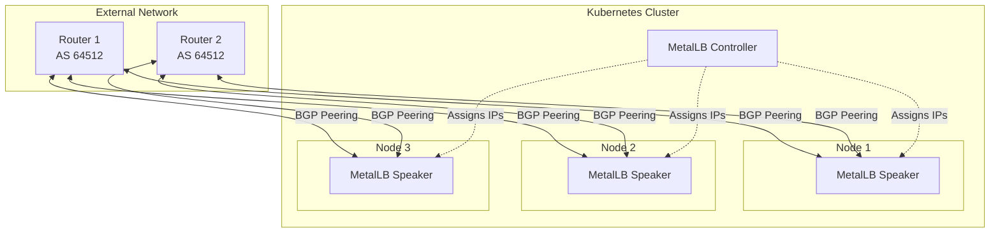
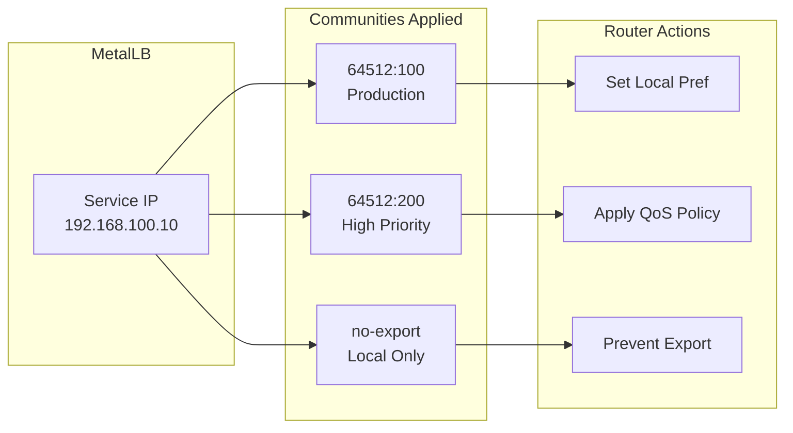
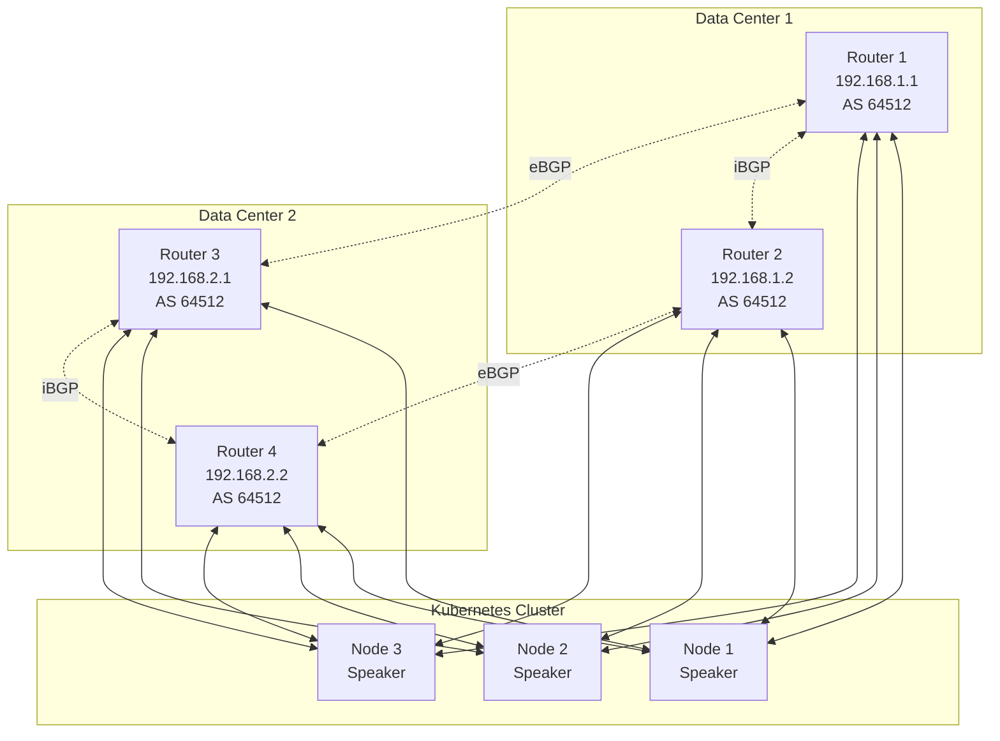

# How to Configure MetalLB BGP Mode for Production Networks

Author: [nawazdhandala](https://github.com/nawazdhandala)

Tags: MetalLB, Kubernetes, BGP, Routing, Networking, Load Balancing

Description: A guide to configuring MetalLB BGP mode for scalable load balancing in production environments.

---

MetalLB is a load balancer implementation for bare metal Kubernetes clusters that provides network load balancing capabilities typically only available in cloud environments. While MetalLB supports both Layer 2 and BGP modes, BGP (Border Gateway Protocol) mode is the preferred choice for production networks due to its scalability, redundancy, and integration with existing network infrastructure.

In this comprehensive guide, we will explore how to configure MetalLB BGP mode for production environments, including router peering, BGP communities, local preferences, and multi-router setups.

## Understanding MetalLB BGP Mode

BGP mode allows MetalLB to peer with your network routers and announce service IP addresses dynamically. This approach provides several advantages over Layer 2 mode:

- **True load balancing**: Traffic is distributed across all nodes advertising the service
- **No single point of failure**: Multiple nodes can announce the same IP
- **Scalability**: Works across network subnets and scales to large clusters
- **Network integration**: Leverages existing BGP infrastructure

## BGP Architecture Overview

Before diving into configuration, let's understand the BGP architecture with MetalLB:



The diagram above illustrates how MetalLB speakers on each Kubernetes node establish BGP peering sessions with upstream routers. The MetalLB controller assigns IP addresses to services, and the speakers announce these IPs via BGP.

## Prerequisites

Before configuring MetalLB BGP mode, ensure you have:

1. A Kubernetes cluster running on bare metal or virtual machines
2. Network routers that support BGP (e.g., Cisco, Juniper, FRRouting, or VyOS)
3. An allocated IP address range for LoadBalancer services
4. kubectl access to your cluster
5. MetalLB installed (version 0.13.0 or later recommended)

## Installing MetalLB

If you haven't installed MetalLB yet, use the following commands to deploy it:

The installation applies the MetalLB namespace and deployment manifests from the official repository.

```bash
# Apply the MetalLB native manifests
kubectl apply -f https://raw.githubusercontent.com/metallb/metallb/v0.14.5/config/manifests/metallb-native.yaml

# Wait for MetalLB pods to be ready
kubectl wait --namespace metallb-system \
  --for=condition=ready pod \
  --selector=app=metallb \
  --timeout=90s
```

## Configuring IP Address Pools

The first step in BGP configuration is defining the IP address pools that MetalLB will use for LoadBalancer services.

This IPAddressPool resource defines the range of IPs available for allocation. The `autoAssign` field controls whether IPs from this pool are automatically assigned to services.

```yaml
# ip-address-pool.yaml
# This configuration defines the IP address pool for production services.
# The IP range should be routable from your network and not overlap with
# any existing allocations.
apiVersion: metallb.io/v1beta1
kind: IPAddressPool
metadata:
  name: production-pool
  namespace: metallb-system
spec:
  # Define the IP range for LoadBalancer services
  # This range should be allocated specifically for Kubernetes services
  addresses:
    - 192.168.100.0/24

  # autoAssign controls whether this pool is used for automatic IP allocation
  # Set to true for general-purpose pools
  autoAssign: true

  # avoidBuggyIPs skips .0 and .255 addresses which can cause issues
  # with some network equipment
  avoidBuggyIPs: true
```

You can also define multiple pools for different purposes:

This example shows how to create separate pools for production and development environments with different IP ranges.

```yaml
# multi-pool-config.yaml
# Multiple IP pools allow you to segregate IPs by environment or purpose.
# Services can request specific pools using annotations.
apiVersion: metallb.io/v1beta1
kind: IPAddressPool
metadata:
  name: production-pool
  namespace: metallb-system
spec:
  addresses:
    # Primary production range
    - 192.168.100.0/25
  autoAssign: false  # Require explicit pool selection for production
  avoidBuggyIPs: true

---
apiVersion: metallb.io/v1beta1
kind: IPAddressPool
metadata:
  name: development-pool
  namespace: metallb-system
spec:
  addresses:
    # Development range - separate from production
    - 192.168.100.128/25
  autoAssign: true  # Auto-assign for development workloads
  avoidBuggyIPs: true
```

## Configuring BGP Peers

BGP peers define the routers that MetalLB will establish BGP sessions with. This is where you configure the connection parameters for your network infrastructure.

### Basic BGP Peer Configuration

The BGPPeer resource establishes a BGP session with an upstream router. Each peer requires the router's IP address and AS number.

```yaml
# bgp-peer.yaml
# This BGPPeer configuration establishes a BGP session with your
# upstream router. The AS numbers must match your network topology.
apiVersion: metallb.io/v1beta2
kind: BGPPeer
metadata:
  name: router-primary
  namespace: metallb-system
spec:
  # myASN is the Autonomous System Number for the Kubernetes cluster
  # Use a private ASN range (64512-65534) for internal networks
  myASN: 64513

  # peerASN is the AS number of your upstream router
  # This should match the router's BGP configuration
  peerASN: 64512

  # peerAddress is the IP address of the router's BGP endpoint
  peerAddress: 192.168.1.1

  # peerPort specifies the BGP port (default is 179)
  peerPort: 179

  # sourceAddress specifies which IP on the node to use for BGP
  # Leave empty to use the node's default route interface
  # sourceAddress: 192.168.1.10

  # holdTime is the BGP hold time in seconds
  # If no keepalive is received within this time, the session is considered down
  holdTime: 90s

  # keepaliveTime is the interval between BGP keepalive messages
  keepaliveTime: 30s

  # routerID can be set to override the default (node IP)
  # routerID: 192.168.1.10
```

### BGP Peer with Authentication

For production networks, always use MD5 authentication to secure BGP sessions:

MD5 authentication prevents unauthorized BGP session establishment and route injection attacks. The password must match on both the MetalLB peer and the router.

```yaml
# bgp-peer-authenticated.yaml
# Secured BGP peer configuration using MD5 authentication.
# The password is stored in a Kubernetes Secret for security.
apiVersion: metallb.io/v1beta2
kind: BGPPeer
metadata:
  name: router-primary-secure
  namespace: metallb-system
spec:
  myASN: 64513
  peerASN: 64512
  peerAddress: 192.168.1.1

  # Reference to a Secret containing the MD5 password
  # The Secret must be in the metallb-system namespace
  password: bgp-auth-secret

  holdTime: 90s
  keepaliveTime: 30s
```

Create the authentication secret:

The secret stores the MD5 password used for BGP session authentication. Ensure this matches the password configured on your router.

```yaml
# bgp-auth-secret.yaml
# Secret containing the BGP MD5 authentication password.
# Store this securely and limit access to the metallb-system namespace.
apiVersion: v1
kind: Secret
metadata:
  name: bgp-auth-secret
  namespace: metallb-system
type: Opaque
data:
  # Base64 encoded password - replace with your actual password
  # echo -n 'your-secure-password' | base64
  password: eW91ci1zZWN1cmUtcGFzc3dvcmQ=
```

### Node Selectors for BGP Peers

In larger clusters, you may want to limit which nodes establish BGP sessions:

Node selectors allow you to control which nodes participate in BGP peering, useful for dedicated network nodes or when only certain nodes have connectivity to routers.

```yaml
# bgp-peer-node-selector.yaml
# This configuration limits BGP peering to nodes with specific labels.
# Useful for clusters with dedicated network/edge nodes.
apiVersion: metallb.io/v1beta2
kind: BGPPeer
metadata:
  name: router-edge-nodes
  namespace: metallb-system
spec:
  myASN: 64513
  peerASN: 64512
  peerAddress: 192.168.1.1

  # nodeSelectors restricts which nodes establish BGP sessions
  # Only nodes matching ALL selectors will peer with this router
  nodeSelectors:
    - matchLabels:
        # Only nodes labeled as network nodes will peer
        node-role.kubernetes.io/network: "true"
    - matchExpressions:
        - key: kubernetes.io/os
          operator: In
          values:
            - linux
```

## Configuring BGP Advertisements

BGPAdvertisement resources control how IP addresses are announced to BGP peers. This includes route aggregation, communities, and local preferences.

### Basic BGP Advertisement

The BGPAdvertisement resource links IP pools to BGP peers and controls announcement behavior.

```yaml
# bgp-advertisement.yaml
# This advertisement configuration announces IPs from the production
# pool to all configured BGP peers.
apiVersion: metallb.io/v1beta1
kind: BGPAdvertisement
metadata:
  name: production-advertisement
  namespace: metallb-system
spec:
  # ipAddressPools lists which pools this advertisement applies to
  ipAddressPools:
    - production-pool

  # peers lists which BGP peers receive these advertisements
  # If empty, all peers receive the advertisements
  peers:
    - router-primary

  # aggregationLength controls route aggregation
  # 32 means individual /32 routes (one per service IP)
  aggregationLength: 32

  # aggregationLengthV6 is the same for IPv6 addresses
  aggregationLengthV6: 128

  # localPref sets the BGP LOCAL_PREF attribute
  # Higher values are preferred for route selection
  localPref: 100
```

### Route Aggregation

Route aggregation reduces the number of routes advertised by combining multiple service IPs into larger prefixes:

Aggregation is useful when you have many services and want to reduce the routing table size on your network equipment. However, it may affect traffic distribution.

```yaml
# bgp-advertisement-aggregated.yaml
# This configuration aggregates service IPs into /27 prefixes.
# Reduces routing table size but may affect ECMP load balancing.
apiVersion: metallb.io/v1beta1
kind: BGPAdvertisement
metadata:
  name: aggregated-advertisement
  namespace: metallb-system
spec:
  ipAddressPools:
    - production-pool

  # aggregationLength of 27 means MetalLB will advertise /27 prefixes
  # containing up to 32 service IPs each
  aggregationLength: 27

  # This reduces routes but means traffic for all IPs in a /27
  # will be routed the same way
  localPref: 100
```

## BGP Communities Configuration

BGP communities are tags attached to routes that allow network operators to apply routing policies. They're essential for production networks with complex routing requirements.

### Understanding BGP Communities



### Configuring Communities

Communities are defined in the BGPAdvertisement and allow routers to apply policies based on the community values.

```yaml
# bgp-advertisement-communities.yaml
# This configuration applies BGP communities to route advertisements.
# Communities allow routers to apply specific policies to MetalLB routes.
apiVersion: metallb.io/v1beta1
kind: BGPAdvertisement
metadata:
  name: production-with-communities
  namespace: metallb-system
spec:
  ipAddressPools:
    - production-pool

  # communities applies BGP community attributes to advertised routes
  # Format can be standard (ASN:value) or well-known names
  communities:
    # Reference to Community resources defined below
    - production-community
    - high-priority-community

  localPref: 150
  aggregationLength: 32
```

Define the community values:

Community resources define reusable community values that can be referenced by multiple advertisements.

```yaml
# bgp-communities.yaml
# Community definitions for production MetalLB routes.
# These communities are referenced by BGPAdvertisement resources.
apiVersion: metallb.io/v1beta1
kind: Community
metadata:
  name: production-community
  namespace: metallb-system
spec:
  communities:
    # Standard community format: ASN:value
    # 64512:100 indicates production traffic in our network
    - name: production
      value: "64512:100"

---
apiVersion: metallb.io/v1beta1
kind: Community
metadata:
  name: high-priority-community
  namespace: metallb-system
spec:
  communities:
    # High priority traffic - routers may apply QoS policies
    - name: high-priority
      value: "64512:200"

    # Well-known community: no-export prevents routes from being
    # advertised to external BGP peers
    - name: local-only
      value: "no-export"

---
apiVersion: metallb.io/v1beta1
kind: Community
metadata:
  name: backup-community
  namespace: metallb-system
spec:
  communities:
    # Lower priority for backup paths
    - name: backup-path
      value: "64512:50"

    # no-advertise prevents the route from being advertised to any peer
    - name: do-not-advertise
      value: "no-advertise"
```

### Environment-Specific Communities

Use different communities for different environments:

This pattern allows network teams to apply different policies (QoS, firewall rules, monitoring) based on the environment.

```yaml
# environment-communities.yaml
# Separate communities for production, staging, and development.
# Allows network policies to differ by environment.
apiVersion: metallb.io/v1beta1
kind: Community
metadata:
  name: env-communities
  namespace: metallb-system
spec:
  communities:
    # Production: highest priority, full redundancy
    - name: prod
      value: "64512:1000"

    # Staging: medium priority, limited redundancy
    - name: staging
      value: "64512:2000"

    # Development: lowest priority, best-effort
    - name: dev
      value: "64512:3000"
```

## Local Preference Configuration

Local preference is a BGP attribute that influences path selection within an AS. Higher values are preferred.

### Primary and Backup Path Configuration

This configuration creates primary and backup routing paths by using different local preferences.

```yaml
# primary-backup-advertisements.yaml
# Configure primary and backup paths using local preference.
# Primary paths have higher local_pref and are preferred.
apiVersion: metallb.io/v1beta1
kind: BGPAdvertisement
metadata:
  name: primary-path
  namespace: metallb-system
spec:
  ipAddressPools:
    - production-pool

  # Advertise only to primary router
  peers:
    - router-primary

  # Higher local preference = preferred path
  # Traffic will use this path when available
  localPref: 200

  communities:
    - production-community

  aggregationLength: 32

---
apiVersion: metallb.io/v1beta1
kind: BGPAdvertisement
metadata:
  name: backup-path
  namespace: metallb-system
spec:
  ipAddressPools:
    - production-pool

  # Advertise to backup router
  peers:
    - router-backup

  # Lower local preference = backup path
  # Only used when primary is unavailable
  localPref: 100

  communities:
    - backup-community

  aggregationLength: 32
```

## Multi-Router Peering

Production environments should always use multiple routers for redundancy. Here's a complete multi-router configuration:

### Multi-Router Architecture



### Complete Multi-Router Configuration

This comprehensive configuration provides full redundancy with multiple routers across data centers.

```yaml
# multi-router-config.yaml
# Complete multi-router BGP configuration for production.
# Provides redundancy across multiple data centers.

# IP Address Pool
apiVersion: metallb.io/v1beta1
kind: IPAddressPool
metadata:
  name: production-pool
  namespace: metallb-system
spec:
  addresses:
    - 10.100.0.0/24
  autoAssign: true
  avoidBuggyIPs: true

---
# Primary Router - Data Center 1
apiVersion: metallb.io/v1beta2
kind: BGPPeer
metadata:
  name: dc1-router-primary
  namespace: metallb-system
spec:
  myASN: 64513
  peerASN: 64512
  peerAddress: 192.168.1.1
  password: bgp-dc1-secret
  holdTime: 90s
  keepaliveTime: 30s
  # Enable BFD for faster failure detection
  bfdProfile: production-bfd

---
# Secondary Router - Data Center 1
apiVersion: metallb.io/v1beta2
kind: BGPPeer
metadata:
  name: dc1-router-secondary
  namespace: metallb-system
spec:
  myASN: 64513
  peerASN: 64512
  peerAddress: 192.168.1.2
  password: bgp-dc1-secret
  holdTime: 90s
  keepaliveTime: 30s
  bfdProfile: production-bfd

---
# Primary Router - Data Center 2
apiVersion: metallb.io/v1beta2
kind: BGPPeer
metadata:
  name: dc2-router-primary
  namespace: metallb-system
spec:
  myASN: 64513
  peerASN: 64512
  peerAddress: 192.168.2.1
  password: bgp-dc2-secret
  holdTime: 90s
  keepaliveTime: 30s
  bfdProfile: production-bfd

---
# Secondary Router - Data Center 2
apiVersion: metallb.io/v1beta2
kind: BGPPeer
metadata:
  name: dc2-router-secondary
  namespace: metallb-system
spec:
  myASN: 64513
  peerASN: 64512
  peerAddress: 192.168.2.2
  password: bgp-dc2-secret
  holdTime: 90s
  keepaliveTime: 30s
  bfdProfile: production-bfd

---
# BFD Profile for fast failure detection
apiVersion: metallb.io/v1beta1
kind: BFDProfile
metadata:
  name: production-bfd
  namespace: metallb-system
spec:
  # Interval between BFD packets in milliseconds
  receiveInterval: 300
  transmitInterval: 300

  # Number of missed packets before declaring peer down
  detectMultiplier: 3

  # Echo mode for faster detection (if supported by router)
  echoMode: false

  # Passive mode - wait for peer to initiate
  passiveMode: false

  # Minimum TTL for BFD packets (security measure)
  minimumTtl: 254

---
# Primary DC1 Advertisement - Highest Priority
apiVersion: metallb.io/v1beta1
kind: BGPAdvertisement
metadata:
  name: dc1-primary-advertisement
  namespace: metallb-system
spec:
  ipAddressPools:
    - production-pool
  peers:
    - dc1-router-primary
  localPref: 200
  communities:
    - dc1-primary-community
  aggregationLength: 32

---
# Secondary DC1 Advertisement
apiVersion: metallb.io/v1beta1
kind: BGPAdvertisement
metadata:
  name: dc1-secondary-advertisement
  namespace: metallb-system
spec:
  ipAddressPools:
    - production-pool
  peers:
    - dc1-router-secondary
  localPref: 190
  communities:
    - dc1-secondary-community
  aggregationLength: 32

---
# Primary DC2 Advertisement - DR Site
apiVersion: metallb.io/v1beta1
kind: BGPAdvertisement
metadata:
  name: dc2-primary-advertisement
  namespace: metallb-system
spec:
  ipAddressPools:
    - production-pool
  peers:
    - dc2-router-primary
  localPref: 150
  communities:
    - dc2-primary-community
  aggregationLength: 32

---
# Secondary DC2 Advertisement - DR Backup
apiVersion: metallb.io/v1beta1
kind: BGPAdvertisement
metadata:
  name: dc2-secondary-advertisement
  namespace: metallb-system
spec:
  ipAddressPools:
    - production-pool
  peers:
    - dc2-router-secondary
  localPref: 140
  communities:
    - dc2-secondary-community
  aggregationLength: 32

---
# Communities for each path
apiVersion: metallb.io/v1beta1
kind: Community
metadata:
  name: dc1-primary-community
  namespace: metallb-system
spec:
  communities:
    - name: dc1-primary
      value: "64512:1100"

---
apiVersion: metallb.io/v1beta1
kind: Community
metadata:
  name: dc1-secondary-community
  namespace: metallb-system
spec:
  communities:
    - name: dc1-secondary
      value: "64512:1200"

---
apiVersion: metallb.io/v1beta1
kind: Community
metadata:
  name: dc2-primary-community
  namespace: metallb-system
spec:
  communities:
    - name: dc2-primary
      value: "64512:2100"

---
apiVersion: metallb.io/v1beta1
kind: Community
metadata:
  name: dc2-secondary-community
  namespace: metallb-system
spec:
  communities:
    - name: dc2-secondary
      value: "64512:2200"
```

## Router Configuration Examples

To complete the BGP setup, you need to configure your network routers. Here are examples for common router platforms:

### FRRouting (FRR) Configuration

FRRouting is a popular open-source routing suite. This configuration peers with MetalLB nodes.

```bash
# /etc/frr/frr.conf
# FRRouting configuration for MetalLB BGP peering

# Enable BGP daemon
router bgp 64512
  # Router ID should be unique in your network
  bgp router-id 192.168.1.1

  # Log neighbor state changes for troubleshooting
  bgp log-neighbor-changes

  # Disable EBGP requirement for directly connected peers
  no bgp ebgp-requires-policy

  # Configure each Kubernetes node as a BGP neighbor
  # Node 1
  neighbor 192.168.1.10 remote-as 64513
  neighbor 192.168.1.10 description "K8s Node 1"
  neighbor 192.168.1.10 password your-secure-password

  # Node 2
  neighbor 192.168.1.11 remote-as 64513
  neighbor 192.168.1.11 description "K8s Node 2"
  neighbor 192.168.1.11 password your-secure-password

  # Node 3
  neighbor 192.168.1.12 remote-as 64513
  neighbor 192.168.1.12 description "K8s Node 3"
  neighbor 192.168.1.12 password your-secure-password

  # Address family configuration for IPv4
  address-family ipv4 unicast
    # Accept routes from all neighbors
    neighbor 192.168.1.10 activate
    neighbor 192.168.1.11 activate
    neighbor 192.168.1.12 activate

    # Optional: Apply route-map for policy control
    neighbor 192.168.1.10 route-map METALLB-IN in
    neighbor 192.168.1.11 route-map METALLB-IN in
    neighbor 192.168.1.12 route-map METALLB-IN in
  exit-address-family

# Route map for MetalLB routes
route-map METALLB-IN permit 10
  # Match MetalLB service IP range
  match ip address prefix-list METALLB-PREFIXES
  # Set local preference based on community
  set local-preference 100

# Prefix list for MetalLB IPs
ip prefix-list METALLB-PREFIXES seq 10 permit 10.100.0.0/24 le 32
```

### Cisco IOS-XE Configuration

For Cisco routers running IOS-XE:

```cisco
! Cisco IOS-XE BGP configuration for MetalLB peering

! Configure BGP
router bgp 64512
  bgp router-id 192.168.1.1
  bgp log-neighbor-changes

  ! Neighbor configuration for Kubernetes nodes
  neighbor METALLB-PEERS peer-group
  neighbor METALLB-PEERS remote-as 64513
  neighbor METALLB-PEERS password 7 your-encrypted-password
  neighbor METALLB-PEERS timers 30 90

  ! Add each node to the peer group
  neighbor 192.168.1.10 peer-group METALLB-PEERS
  neighbor 192.168.1.10 description K8s-Node-1
  neighbor 192.168.1.11 peer-group METALLB-PEERS
  neighbor 192.168.1.11 description K8s-Node-2
  neighbor 192.168.1.12 peer-group METALLB-PEERS
  neighbor 192.168.1.12 description K8s-Node-3

  ! Address family configuration
  address-family ipv4 unicast
    neighbor METALLB-PEERS activate
    neighbor METALLB-PEERS soft-reconfiguration inbound
    neighbor METALLB-PEERS route-map METALLB-IN in
  exit-address-family

! Route map for incoming MetalLB routes
route-map METALLB-IN permit 10
  match ip address prefix-list METALLB-NETS
  set local-preference 100

! Prefix list for MetalLB networks
ip prefix-list METALLB-NETS seq 10 permit 10.100.0.0/24 le 32
```

### VyOS Configuration

VyOS is a popular open-source network OS:

```bash
# VyOS BGP configuration for MetalLB

configure

# Set BGP AS number
set protocols bgp 64512

# Set router ID
set protocols bgp 64512 parameters router-id 192.168.1.1

# Configure neighbor group
set protocols bgp 64512 peer-group METALLB
set protocols bgp 64512 peer-group METALLB remote-as 64513
set protocols bgp 64512 peer-group METALLB password 'your-secure-password'
set protocols bgp 64512 peer-group METALLB timers holdtime 90
set protocols bgp 64512 peer-group METALLB timers keepalive 30

# Add Kubernetes nodes as neighbors
set protocols bgp 64512 neighbor 192.168.1.10 peer-group METALLB
set protocols bgp 64512 neighbor 192.168.1.10 description 'K8s-Node-1'
set protocols bgp 64512 neighbor 192.168.1.11 peer-group METALLB
set protocols bgp 64512 neighbor 192.168.1.11 description 'K8s-Node-2'
set protocols bgp 64512 neighbor 192.168.1.12 peer-group METALLB
set protocols bgp 64512 neighbor 192.168.1.12 description 'K8s-Node-3'

# Configure address family
set protocols bgp 64512 address-family ipv4-unicast
set protocols bgp 64512 neighbor 192.168.1.10 address-family ipv4-unicast
set protocols bgp 64512 neighbor 192.168.1.11 address-family ipv4-unicast
set protocols bgp 64512 neighbor 192.168.1.12 address-family ipv4-unicast

# Apply route-map for MetalLB routes
set policy route-map METALLB-IN rule 10 action permit
set policy route-map METALLB-IN rule 10 match ip address prefix-list METALLB-NETS
set policy route-map METALLB-IN rule 10 set local-preference 100

# Define prefix list
set policy prefix-list METALLB-NETS rule 10 action permit
set policy prefix-list METALLB-NETS rule 10 prefix 10.100.0.0/24
set policy prefix-list METALLB-NETS rule 10 le 32

commit
save
```

## Testing and Verification

After applying your configuration, verify the BGP sessions and route advertisements:

### Verify MetalLB Components

These commands check the status of MetalLB pods and configuration resources.

```bash
# Check MetalLB pod status
kubectl get pods -n metallb-system

# Verify IP address pools
kubectl get ipaddresspools -n metallb-system

# Check BGP peer configuration
kubectl get bgppeers -n metallb-system

# Verify BGP advertisements
kubectl get bgpadvertisements -n metallb-system

# Check communities
kubectl get communities -n metallb-system
```

### Check BGP Session Status

View the MetalLB speaker logs to verify BGP session establishment.

```bash
# View speaker logs for BGP session status
kubectl logs -n metallb-system -l component=speaker --tail=100

# Look for session establishment messages
kubectl logs -n metallb-system -l component=speaker | grep -i "session"
```

### Verify Route Advertisement

Check that routes are being advertised correctly on your routers.

```bash
# On FRRouting router
vtysh -c "show bgp summary"
vtysh -c "show bgp ipv4 unicast"
vtysh -c "show bgp neighbors 192.168.1.10 received-routes"

# On Cisco router
show ip bgp summary
show ip bgp
show ip bgp neighbors 192.168.1.10 received-routes

# On VyOS router
show ip bgp summary
show ip bgp
show ip bgp neighbors 192.168.1.10 received-routes
```

### Create a Test Service

Create a LoadBalancer service to test IP allocation and route advertisement.

```yaml
# test-service.yaml
# Test service to verify MetalLB BGP functionality.
# This creates a simple nginx deployment with a LoadBalancer service.
apiVersion: apps/v1
kind: Deployment
metadata:
  name: nginx-test
  namespace: default
spec:
  replicas: 3
  selector:
    matchLabels:
      app: nginx-test
  template:
    metadata:
      labels:
        app: nginx-test
    spec:
      containers:
        - name: nginx
          image: nginx:alpine
          ports:
            - containerPort: 80

---
apiVersion: v1
kind: Service
metadata:
  name: nginx-lb
  namespace: default
  annotations:
    # Optionally specify which pool to use
    metallb.universe.tf/address-pool: production-pool
spec:
  type: LoadBalancer
  selector:
    app: nginx-test
  ports:
    - port: 80
      targetPort: 80
      protocol: TCP
```

Verify the service received an external IP:

```bash
# Check service status
kubectl get svc nginx-lb

# Expected output:
# NAME       TYPE           CLUSTER-IP     EXTERNAL-IP    PORT(S)        AGE
# nginx-lb   LoadBalancer   10.96.100.10   10.100.0.1     80:31234/TCP   1m

# Test connectivity from external network
curl http://10.100.0.1
```

## Troubleshooting

### Common Issues and Solutions

#### BGP Session Not Establishing

If BGP sessions aren't coming up, check these common issues:

```bash
# Check speaker logs for errors
kubectl logs -n metallb-system -l component=speaker | grep -i error

# Verify network connectivity to router
kubectl exec -n metallb-system -it $(kubectl get pods -n metallb-system -l component=speaker -o jsonpath='{.items[0].metadata.name}') -- ping -c 3 192.168.1.1

# Check if TCP port 179 is reachable
kubectl exec -n metallb-system -it $(kubectl get pods -n metallb-system -l component=speaker -o jsonpath='{.items[0].metadata.name}') -- nc -zv 192.168.1.1 179
```

#### Routes Not Being Advertised

If routes aren't appearing on routers:

```bash
# Verify IP address pool has available IPs
kubectl get ipaddresspools -n metallb-system -o yaml

# Check if advertisement is configured correctly
kubectl get bgpadvertisements -n metallb-system -o yaml

# Verify service has an external IP assigned
kubectl get svc -A | grep LoadBalancer
```

#### Authentication Failures

If you see authentication errors in logs:

```bash
# Verify secret exists and has correct format
kubectl get secret bgp-auth-secret -n metallb-system -o yaml

# Decode and verify password
kubectl get secret bgp-auth-secret -n metallb-system -o jsonpath='{.data.password}' | base64 -d

# Check router logs for authentication failures
# On FRR: show log | include BGP
```

### Debugging Commands Summary

A collection of useful debugging commands for MetalLB BGP issues:

```bash
# Get detailed speaker status
kubectl describe pods -n metallb-system -l component=speaker

# Check events for MetalLB namespace
kubectl get events -n metallb-system --sort-by='.lastTimestamp'

# View MetalLB controller logs
kubectl logs -n metallb-system -l component=controller

# Get all MetalLB resources
kubectl get all -n metallb-system

# Describe a specific BGP peer
kubectl describe bgppeer router-primary -n metallb-system

# Check for CRD issues
kubectl get crd | grep metallb
```

## Production Best Practices

When deploying MetalLB BGP mode in production, follow these best practices:

### 1. Use Multiple BGP Peers

Always configure at least two BGP peers for redundancy. Ideally, use peers in different network segments or data centers.

### 2. Enable BFD

Bidirectional Forwarding Detection (BFD) provides sub-second failure detection, improving failover times significantly compared to BGP holdtime alone.

### 3. Implement Proper Security

- Use MD5 authentication for all BGP sessions
- Apply prefix filters on routers to only accept expected routes
- Use maximum-prefix limits to prevent route table overflow
- Consider using TTL security (GTSM) where supported

### 4. Monitor BGP Sessions

Set up monitoring for BGP session state, route counts, and traffic patterns:

```yaml
# prometheus-servicemonitor.yaml
# ServiceMonitor for MetalLB metrics.
# Requires Prometheus Operator to be installed.
apiVersion: monitoring.coreos.com/v1
kind: ServiceMonitor
metadata:
  name: metallb
  namespace: monitoring
spec:
  selector:
    matchLabels:
      app.kubernetes.io/name: metallb
  namespaceSelector:
    matchNames:
      - metallb-system
  endpoints:
    - port: monitoring
      interval: 30s
```

### 5. Document Your Configuration

Maintain documentation of:
- AS numbers and their purpose
- IP address allocations
- Community values and their meaning
- Router peering details
- Failover procedures

### 6. Test Failover Regularly

Periodically test failover by:
- Shutting down individual routers
- Draining Kubernetes nodes
- Simulating network partitions

## Conclusion

MetalLB BGP mode provides a robust, scalable solution for load balancing in bare metal Kubernetes clusters. By properly configuring BGP peers, advertisements, communities, and local preferences, you can achieve production-grade load balancing that integrates seamlessly with your existing network infrastructure.

Key takeaways:

1. **Use BGP mode for production**: It provides true load balancing and better redundancy than Layer 2 mode
2. **Configure multiple routers**: Always have redundant paths for high availability
3. **Use communities wisely**: They enable sophisticated routing policies
4. **Implement BFD**: For fast failure detection and recovery
5. **Monitor and document**: Keep track of your BGP configuration and session health

With the configurations and best practices outlined in this guide, you should be well-equipped to deploy MetalLB BGP mode in your production environment.

## Additional Resources

- [MetalLB Official Documentation](https://metallb.universe.tf/)
- [BGP RFC 4271](https://tools.ietf.org/html/rfc4271)
- [FRRouting Documentation](https://docs.frrouting.org/)
- [Kubernetes LoadBalancer Services](https://kubernetes.io/docs/concepts/services-networking/service/#loadbalancer)
