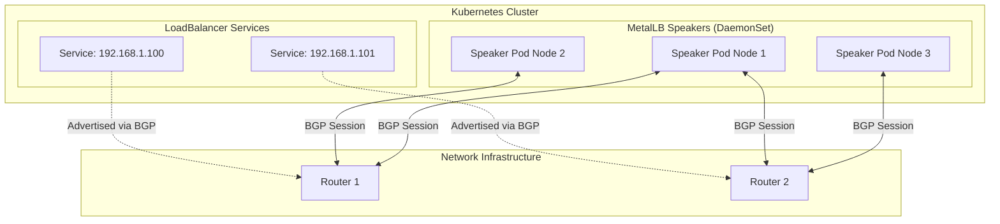
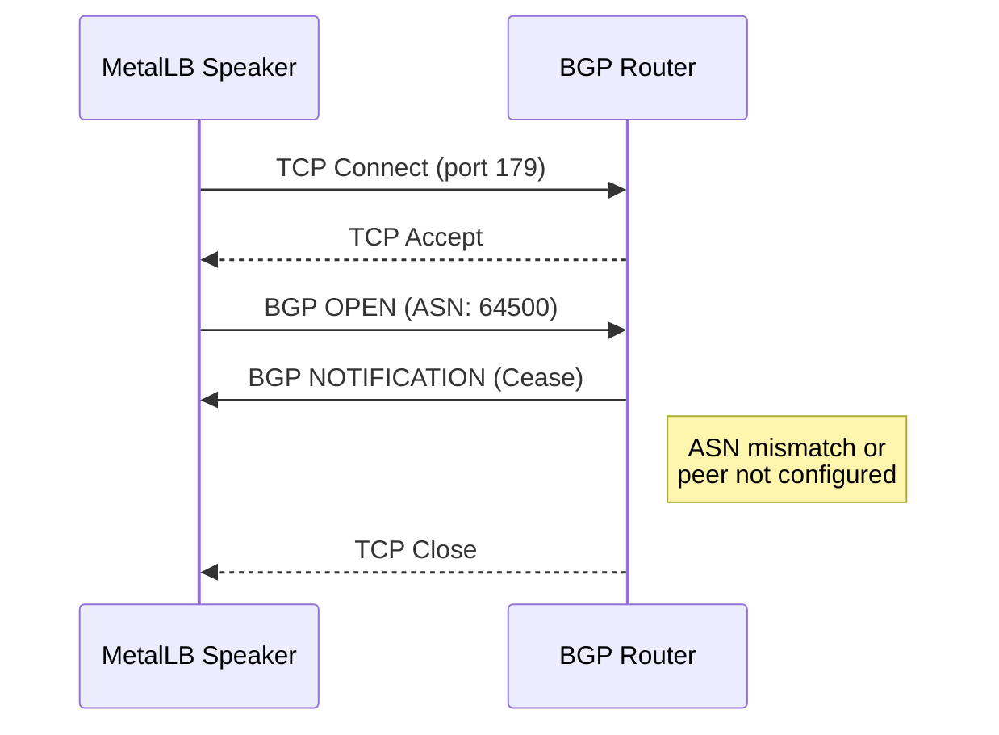
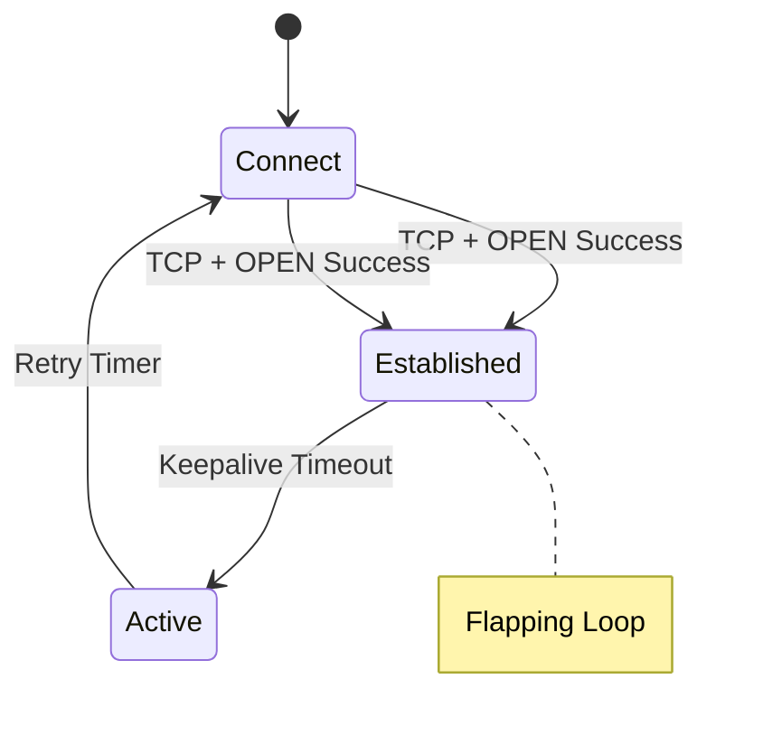
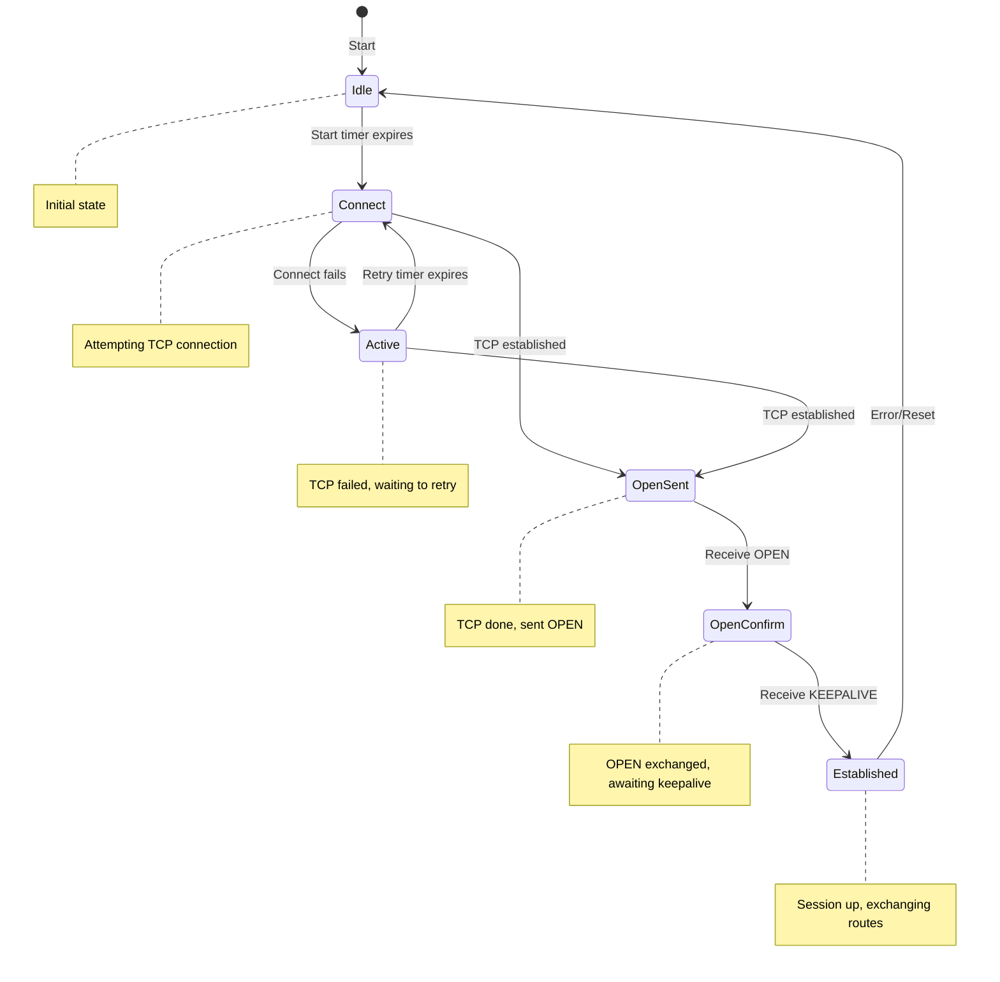

# How to Debug MetalLB BGP Session Failures

Author: [nawazdhandala](https://github.com/nawazdhandala)

Tags: MetalLB, BGP, Kubernetes, Troubleshooting, Networking, Load Balancing, Debugging

Description: Learn how to debug MetalLB BGP session failures including common peering issues and resolution steps.

---

MetalLB's BGP mode is powerful for production Kubernetes clusters, but when BGP sessions fail to establish, your LoadBalancer services become unreachable. This guide covers systematic debugging approaches for the most common BGP peering issues.

## Understanding MetalLB BGP Architecture

Before debugging, understand how MetalLB's BGP mode works.



### Key Components

- **Speaker Pods**: Run on each node, establish BGP sessions with external routers
- **BGPPeer**: CRD defining router connection parameters
- **BGPAdvertisement**: CRD controlling route advertisement behavior
- **IPAddressPool**: CRD defining IP ranges for LoadBalancer services

## Quick Diagnostic Commands

Start with these commands to assess BGP session health.

Check MetalLB speaker pod status:

```bash
kubectl get pods -n metallb-system -l app=metallb,component=speaker
```

View speaker logs for BGP session info:

```bash
kubectl logs -n metallb-system -l component=speaker --tail=100 | grep -i bgp
```

Check BGPPeer configuration:

```bash
kubectl get bgppeers -A -o wide
```

Describe BGPPeer for detailed status:

```bash
kubectl describe bgppeer <peer-name>
```

View current BGP session state from speaker:

```bash
kubectl logs -n metallb-system <speaker-pod> | grep -E "(session|established|connect)"
```

## Common BGP Session Failures

### Issue 1: Session Never Establishes (Connect Timeout)

Symptoms in speaker logs:

```
level=info msg="BGP session to 10.0.0.1:179 failed to establish"
level=error msg="failed to connect: dial tcp 10.0.0.1:179: i/o timeout"
```

The session cannot reach the router's BGP port.

**Root Causes and Solutions**

**A. Firewall blocking TCP port 179**

Verify connectivity from a speaker pod:

```bash
kubectl exec -n metallb-system <speaker-pod> -- nc -zv 10.0.0.1 179
```

Check if your nodes have firewall rules blocking outbound 179:

```bash
iptables -L OUTPUT -n | grep 179
```

Solution - Allow BGP traffic in your firewall. Example for iptables:

```bash
iptables -A OUTPUT -p tcp --dport 179 -j ACCEPT
iptables -A INPUT -p tcp --sport 179 -j ACCEPT
```

**B. Incorrect router IP in BGPPeer**

Verify the router IP is correct and reachable:

```bash
kubectl exec -n metallb-system <speaker-pod> -- ping -c 3 10.0.0.1
```

Check your BGPPeer configuration:

```yaml
apiVersion: metallb.io/v1beta2
kind: BGPPeer
metadata:
  name: router-peer
  namespace: metallb-system
spec:
  myASN: 64500
  peerASN: 64501
  peerAddress: 10.0.0.1    # Verify this IP
  peerPort: 179            # Standard BGP port
```

**C. Node not in same network segment**

If your nodes are on a different subnet, ensure routing exists:

```bash
kubectl exec -n metallb-system <speaker-pod> -- ip route get 10.0.0.1
```

### Issue 2: Session Drops Immediately After Connect

Symptoms:

```
level=info msg="BGP session established" peer=10.0.0.1
level=error msg="BGP session reset" reason="notification received" code=6 subcode=2
```

The session establishes but the router immediately closes it.



**Root Causes and Solutions**

**A. ASN Mismatch**

Your ASN configuration must match what the router expects:

```yaml
apiVersion: metallb.io/v1beta2
kind: BGPPeer
metadata:
  name: router-peer
  namespace: metallb-system
spec:
  myASN: 64500      # Your cluster's ASN - must match router's neighbor config
  peerASN: 64501    # Router's ASN - must match router's actual ASN
  peerAddress: 10.0.0.1
```

On Cisco router, verify configuration:

```
router# show running-config | section router bgp
router bgp 64501
  neighbor 10.0.1.10 remote-as 64500   ! Must match MetalLB's myASN
```

**B. Router not configured to accept this peer**

The router must have your node IPs as allowed BGP neighbors.

Cisco IOS example - Add each Kubernetes node:

```
router bgp 64501
  neighbor 10.0.1.10 remote-as 64500
  neighbor 10.0.1.11 remote-as 64500
  neighbor 10.0.1.12 remote-as 64500
```

For dynamic peers (peer groups), configure on Cisco:

```
router bgp 64501
  neighbor metallb-peers peer-group
  neighbor metallb-peers remote-as 64500
  bgp listen range 10.0.1.0/24 peer-group metallb-peers
```

### Issue 3: Session Established But Routes Not Advertised

Symptoms:

```
level=info msg="BGP session established" peer=10.0.0.1
```

But the router shows no routes from MetalLB:

```
router# show ip bgp neighbors 10.0.1.10 received-routes
! Empty output
```

**Root Causes and Solutions**

**A. Missing or misconfigured IPAddressPool**

Verify IPAddressPool exists:

```bash
kubectl get ipaddresspools -n metallb-system
```

Check the pool configuration:

```yaml
apiVersion: metallb.io/v1beta1
kind: IPAddressPool
metadata:
  name: production-pool
  namespace: metallb-system
spec:
  addresses:
    - 192.168.100.0/24    # Range for LoadBalancer IPs
```

**B. Missing BGPAdvertisement**

You need a BGPAdvertisement to link pools to peers:

```yaml
apiVersion: metallb.io/v1beta1
kind: BGPAdvertisement
metadata:
  name: production-advertisement
  namespace: metallb-system
spec:
  ipAddressPools:
    - production-pool      # Must match IPAddressPool name
  peers:
    - router-peer          # Must match BGPPeer name
  aggregationLength: 32    # Advertise /32 for each service
```

**C. No LoadBalancer services requesting IPs**

Routes only advertise when services exist:

```bash
kubectl get svc -A | grep LoadBalancer
```

Create a test service:

```yaml
apiVersion: v1
kind: Service
metadata:
  name: test-lb
spec:
  type: LoadBalancer
  ports:
    - port: 80
  selector:
    app: test
```

**D. Service has no endpoints**

MetalLB won't advertise services without healthy endpoints:

```bash
kubectl get endpoints test-lb
```

### Issue 4: BGP Session Flapping

Symptoms in logs:

```
level=info msg="BGP session established" peer=10.0.0.1
level=error msg="BGP session reset" peer=10.0.0.1
level=info msg="BGP session established" peer=10.0.0.1
level=error msg="BGP session reset" peer=10.0.0.1
```

The session repeatedly connects and disconnects.



**Root Causes and Solutions**

**A. Hold timer mismatch**

MetalLB and router must agree on timers. Configure in BGPPeer:

```yaml
apiVersion: metallb.io/v1beta2
kind: BGPPeer
metadata:
  name: router-peer
  namespace: metallb-system
spec:
  myASN: 64500
  peerASN: 64501
  peerAddress: 10.0.0.1
  holdTime: 90s        # Default is 90s, match with router
  keepaliveTime: 30s   # Should be 1/3 of holdTime
```

On Cisco, verify timers match:

```
router# show ip bgp neighbors 10.0.1.10 | include hold time
  Hold time is 90, keepalive interval is 30 seconds
```

**B. Network instability or packet loss**

Test for packet loss:

```bash
kubectl exec -n metallb-system <speaker-pod> -- ping -c 100 10.0.0.1 | grep loss
```

If loss exceeds 1-2%, investigate network path.

**C. Speaker pod getting OOMKilled or restarted**

Check for pod restarts:

```bash
kubectl get pods -n metallb-system -l component=speaker -o wide
kubectl describe pod -n metallb-system <speaker-pod> | grep -A5 "Last State"
```

Increase resources if needed:

```yaml
apiVersion: apps/v1
kind: DaemonSet
metadata:
  name: speaker
  namespace: metallb-system
spec:
  template:
    spec:
      containers:
        - name: speaker
          resources:
            requests:
              cpu: 100m
              memory: 128Mi
            limits:
              cpu: 500m
              memory: 256Mi
```

### Issue 5: Only Some Nodes Establish Sessions

Symptoms - Some speaker pods connect, others don't:

```bash
kubectl logs -n metallb-system speaker-node1 | grep established
# Shows: BGP session established

kubectl logs -n metallb-system speaker-node2 | grep established
# Shows nothing
```

**Root Causes and Solutions**

**A. Node selector limiting speakers**

Check if BGPPeer has node selectors:

```yaml
apiVersion: metallb.io/v1beta2
kind: BGPPeer
metadata:
  name: router-peer
spec:
  myASN: 64500
  peerASN: 64501
  peerAddress: 10.0.0.1
  nodeSelectors:
    - matchLabels:
        node-role.kubernetes.io/worker: ""   # Only workers peer
```

Verify node labels:

```bash
kubectl get nodes --show-labels | grep worker
```

**B. Different network configuration per node**

Some nodes may be on different VLANs or have different routes:

```bash
for pod in $(kubectl get pods -n metallb-system -l component=speaker -o name); do
  echo "=== $pod ==="
  kubectl exec -n metallb-system $pod -- ip route get 10.0.0.1
done
```

**C. Source address binding issues**

MetalLB needs to bind to the correct source IP. Check sourceAddress:

```yaml
apiVersion: metallb.io/v1beta2
kind: BGPPeer
metadata:
  name: router-peer
spec:
  myASN: 64500
  peerASN: 64501
  peerAddress: 10.0.0.1
  sourceAddress: 10.0.1.10    # Explicitly set if auto-detection fails
```

Or use per-node configuration:

```yaml
apiVersion: metallb.io/v1beta2
kind: BGPPeer
metadata:
  name: router-peer-node1
spec:
  myASN: 64500
  peerASN: 64501
  peerAddress: 10.0.0.1
  sourceAddress: 10.0.1.10
  nodeSelectors:
    - matchLabels:
        kubernetes.io/hostname: node1
---
apiVersion: metallb.io/v1beta2
kind: BGPPeer
metadata:
  name: router-peer-node2
spec:
  myASN: 64500
  peerASN: 64501
  peerAddress: 10.0.0.1
  sourceAddress: 10.0.1.11
  nodeSelectors:
    - matchLabels:
        kubernetes.io/hostname: node2
```

### Issue 6: eBGP Multi-Hop Failures

When your router is not directly connected (multiple hops away).

Symptoms:

```
level=error msg="BGP OPEN message error" error="eBGP peer not directly connected"
```

**Solution: Configure eBGP Multihop**

```yaml
apiVersion: metallb.io/v1beta2
kind: BGPPeer
metadata:
  name: router-peer
  namespace: metallb-system
spec:
  myASN: 64500
  peerASN: 64501
  peerAddress: 10.0.0.1
  ebgpMultiHop: true     # Enable multi-hop
```

On the router side (Cisco):

```
router bgp 64501
  neighbor 10.0.1.10 remote-as 64500
  neighbor 10.0.1.10 ebgp-multihop 2    ! Adjust hop count as needed
```

### Issue 7: MD5 Authentication Failures

Symptoms:

```
level=error msg="BGP session failed" error="TCP MD5 signature mismatch"
```

**Solution: Verify MD5 Password Configuration**

Create a secret for the password:

```bash
kubectl create secret generic bgp-password \
  -n metallb-system \
  --from-literal=password='your-secure-password'
```

Reference it in BGPPeer:

```yaml
apiVersion: metallb.io/v1beta2
kind: BGPPeer
metadata:
  name: router-peer
  namespace: metallb-system
spec:
  myASN: 64500
  peerASN: 64501
  peerAddress: 10.0.0.1
  password: bgp-password    # Secret name
```

Verify router has matching password (Cisco):

```
router bgp 64501
  neighbor 10.0.1.10 password your-secure-password
```

## Comprehensive Debugging Script

Use this script to gather all relevant debugging information:

```bash
#!/bin/bash

echo "============================================"
echo "MetalLB BGP Debugging Report"
echo "Generated: $(date)"
echo "============================================"

echo -e "\n=== MetalLB Namespace Resources ==="
kubectl get all -n metallb-system

echo -e "\n=== BGPPeer Configurations ==="
kubectl get bgppeers -n metallb-system -o yaml

echo -e "\n=== IPAddressPools ==="
kubectl get ipaddresspools -n metallb-system -o yaml

echo -e "\n=== BGPAdvertisements ==="
kubectl get bgpadvertisements -n metallb-system -o yaml

echo -e "\n=== LoadBalancer Services ==="
kubectl get svc -A --field-selector spec.type=LoadBalancer

echo -e "\n=== Speaker Pod Status ==="
kubectl get pods -n metallb-system -l component=speaker -o wide

echo -e "\n=== Recent Speaker Logs (last 50 lines per pod) ==="
for pod in $(kubectl get pods -n metallb-system -l component=speaker -o jsonpath='{.items[*].metadata.name}'); do
  echo "--- $pod ---"
  kubectl logs -n metallb-system $pod --tail=50 2>&1
done

echo -e "\n=== BGP Session Status from Logs ==="
kubectl logs -n metallb-system -l component=speaker | grep -E "(session|established|failed|reset|notification)" | tail -100

echo -e "\n=== Network Connectivity Tests ==="
ROUTER_IP=$(kubectl get bgppeers -n metallb-system -o jsonpath='{.items[0].spec.peerAddress}')
if [ -n "$ROUTER_IP" ]; then
  SPEAKER_POD=$(kubectl get pods -n metallb-system -l component=speaker -o jsonpath='{.items[0].metadata.name}')
  echo "Testing connectivity to router $ROUTER_IP from $SPEAKER_POD"
  kubectl exec -n metallb-system $SPEAKER_POD -- ping -c 3 $ROUTER_IP 2>&1 || echo "Ping failed"
  kubectl exec -n metallb-system $SPEAKER_POD -- nc -zv $ROUTER_IP 179 2>&1 || echo "Port 179 unreachable"
fi

echo -e "\n=== Node Labels (for nodeSelector debugging) ==="
kubectl get nodes --show-labels

echo -e "\n============================================"
echo "End of Report"
echo "============================================"
```

Save and run:

```bash
chmod +x metallb-bgp-debug.sh
./metallb-bgp-debug.sh > bgp-debug-report.txt
```

## Router-Side Verification Commands

### Cisco IOS/IOS-XE

Show BGP summary:

```
router# show ip bgp summary
BGP router identifier 10.0.0.1, local AS number 64501
Neighbor        V    AS MsgRcvd MsgSent   TblVer  InQ OutQ Up/Down  State/PfxRcd
10.0.1.10       4 64500     123     125        5    0    0 01:15:30        3
10.0.1.11       4 64500     120     122        5    0    0 01:14:25        3
```

Show routes received from MetalLB:

```
router# show ip bgp neighbors 10.0.1.10 received-routes
```

Show detailed neighbor info:

```
router# show ip bgp neighbors 10.0.1.10
```

### Juniper JunOS

Show BGP summary:

```
user@router> show bgp summary
```

Show received routes:

```
user@router> show route receive-protocol bgp 10.0.1.10
```

Show neighbor details:

```
user@router> show bgp neighbor 10.0.1.10
```

### FRRouting (Linux-based routers)

Show BGP summary:

```bash
vtysh -c "show ip bgp summary"
```

Show received routes:

```bash
vtysh -c "show ip bgp neighbors 10.0.1.10 received-routes"
```

## BGP Session State Reference

Understanding BGP states helps identify where sessions fail:



| State | Meaning | Common Issues |
|-------|---------|---------------|
| Idle | Not attempting connection | Peer disabled or initial state |
| Connect | TCP handshake in progress | Firewall, wrong IP, port blocked |
| Active | TCP failed, will retry | Network unreachable, connection refused |
| OpenSent | TCP connected, OPEN sent | Waiting for router response |
| OpenConfirm | OPEN received, verifying | ASN mismatch, capability mismatch |
| Established | Session fully operational | Routes should be exchanging |

## Preventive Best Practices

**1. Always configure BFD for faster failure detection:**

```yaml
apiVersion: metallb.io/v1beta2
kind: BGPPeer
metadata:
  name: router-peer
spec:
  myASN: 64500
  peerASN: 64501
  peerAddress: 10.0.0.1
  bfdProfile: production-bfd
---
apiVersion: metallb.io/v1beta1
kind: BFDProfile
metadata:
  name: production-bfd
  namespace: metallb-system
spec:
  detectMultiplier: 3
  receiveInterval: 300
  transmitInterval: 300
```

**2. Use multiple routers for redundancy:**

```yaml
apiVersion: metallb.io/v1beta2
kind: BGPPeer
metadata:
  name: router1
spec:
  myASN: 64500
  peerASN: 64501
  peerAddress: 10.0.0.1
---
apiVersion: metallb.io/v1beta2
kind: BGPPeer
metadata:
  name: router2
spec:
  myASN: 64500
  peerASN: 64501
  peerAddress: 10.0.0.2
```

**3. Monitor BGP session metrics:**

MetalLB exposes Prometheus metrics. Check session state:

```bash
kubectl port-forward -n metallb-system svc/metallb-speaker-monitor 7472:7472
curl localhost:7472/metrics | grep metallb_bgp
```

Key metrics to alert on:
- `metallb_bgp_session_up` - 1 if session established, 0 otherwise
- `metallb_bgp_updates_total` - BGP update message count
- `metallb_bgp_announced_prefixes_total` - Number of advertised routes

**4. Document your configuration:**

Keep your BGP configuration documented with your router configs and MetalLB CRDs version controlled together.

---

BGP debugging requires understanding both sides of the peering relationship. When sessions fail, systematically check: network connectivity, ASN configuration, timer settings, and authentication. Use the diagnostic commands and script in this guide to quickly identify root causes. Remember that most BGP issues stem from configuration mismatches between MetalLB and the network router - always verify both sides match.
