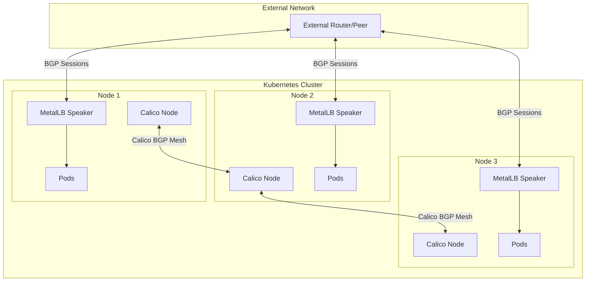
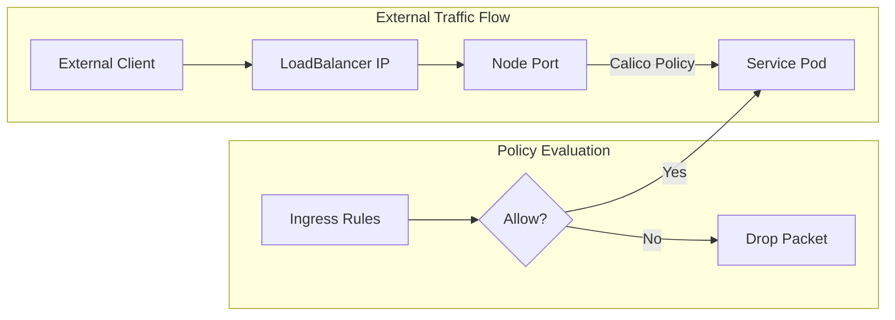
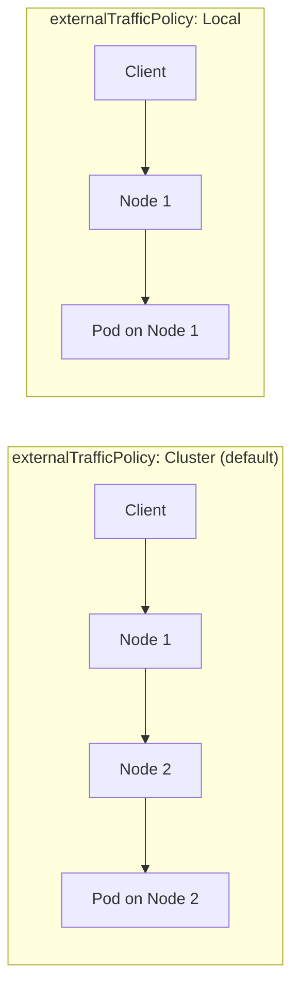

# How to Configure MetalLB with Calico for Advanced Network Policies

Author: [nawazdhandala](https://github.com/nawazdhandala)

Tags: MetalLB, Calico, Kubernetes, Network Policies, BGP, Load Balancing, Networking

Description: Learn how to configure MetalLB with Calico for advanced network policies combining MetalLB announcements with Calico BGP.

---

## Introduction

When running Kubernetes on bare-metal infrastructure, you need a solution for load balancing external traffic to your services. MetalLB provides this capability, while Calico offers powerful networking and network policy features. Combining these two tools gives you enterprise-grade networking with fine-grained traffic control.

This comprehensive guide walks you through integrating MetalLB with Calico, covering BGP configuration, network policies, and advanced scenarios for production environments.

## Architecture Overview

Before diving into configuration, let's understand how MetalLB and Calico work together:



**Key Components:**

- **MetalLB**: Announces LoadBalancer service IPs to external routers via BGP or Layer 2
- **Calico**: Provides pod networking, BGP peering for pod networks, and network policies
- **BGP Peering**: Both can use BGP, but they serve different purposes and can coexist

## Prerequisites

Before starting, ensure you have:

- A Kubernetes cluster (v1.25+) running on bare-metal or VMs
- kubectl configured with cluster admin access
- Helm v3 installed
- Access to configure your network router for BGP peering
- IP address ranges allocated for:
  - Pod network (managed by Calico)
  - LoadBalancer services (managed by MetalLB)

## Step 1: Install Calico

First, install Calico as your Container Network Interface (CNI) provider.

### Option A: Install Calico using the Tigera Operator (Recommended)

Create the Tigera operator and custom resource definitions:

```bash
kubectl create -f https://raw.githubusercontent.com/projectcalico/calico/v3.27.0/manifests/tigera-operator.yaml
```

Create a custom Installation resource to configure Calico. This configuration enables BGP and sets up the pod CIDR:

```yaml
apiVersion: operator.tigera.io/v1
kind: Installation
metadata:
  name: default
spec:
  calicoNetwork:
    bgp: Enabled
    ipPools:
    - blockSize: 26
      cidr: 10.244.0.0/16
      encapsulation: None
      natOutgoing: Enabled
      nodeSelector: all()
  controlPlaneReplicas: 2
---
apiVersion: operator.tigera.io/v1
kind: APIServer
metadata:
  name: default
spec: {}
```

Save the above as `calico-installation.yaml` and apply it:

```bash
kubectl apply -f calico-installation.yaml
```

### Option B: Install Calico using Helm

Add the Calico Helm repository and install:

```bash
helm repo add projectcalico https://docs.tigera.io/calico/charts
helm repo update
```

Install Calico with BGP enabled:

```bash
helm install calico projectcalico/tigera-operator \
  --version v3.27.0 \
  --namespace tigera-operator \
  --create-namespace \
  --set installation.calicoNetwork.bgp=Enabled \
  --set installation.calicoNetwork.ipPools[0].cidr=10.244.0.0/16 \
  --set installation.calicoNetwork.ipPools[0].encapsulation=None
```

### Verify Calico Installation

Wait for all Calico pods to be running:

```bash
kubectl get pods -n calico-system -w
```

Check Calico node status:

```bash
kubectl get nodes -o wide
calicoctl node status
```

## Step 2: Configure Calico BGP

Now configure Calico's BGP settings to peer with your network infrastructure.

### Configure BGP Global Settings

Create the BGP configuration resource. This sets the global AS number for your cluster:

```yaml
apiVersion: projectcalico.org/v3
kind: BGPConfiguration
metadata:
  name: default
spec:
  logSeverityScreen: Info
  nodeToNodeMeshEnabled: true
  asNumber: 64512
  serviceClusterIPs:
  - cidr: 10.96.0.0/12
  serviceExternalIPs:
  - cidr: 192.168.100.0/24
  listenPort: 179
  bindMode: NodeIP
  communities:
  - name: bgp-large-community
    value: "64512:100:1"
  prefixAdvertisements:
  - cidr: 10.244.0.0/16
    communities:
    - bgp-large-community
```

Save as `calico-bgp-config.yaml` and apply:

```bash
kubectl apply -f calico-bgp-config.yaml
```

### Configure BGP Peers

Configure Calico to peer with your external router. Replace the IP address and AS number with your router's details:

```yaml
apiVersion: projectcalico.org/v3
kind: BGPPeer
metadata:
  name: router-peer
spec:
  peerIP: 10.0.0.1
  asNumber: 64513
  keepAliveTime: 30s
  nodeSelector: all()
```

For rack-level topology where different nodes peer with different routers:

```yaml
apiVersion: projectcalico.org/v3
kind: BGPPeer
metadata:
  name: rack1-router
spec:
  peerIP: 10.0.1.1
  asNumber: 64513
  nodeSelector: rack == 'rack1'
---
apiVersion: projectcalico.org/v3
kind: BGPPeer
metadata:
  name: rack2-router
spec:
  peerIP: 10.0.2.1
  asNumber: 64513
  nodeSelector: rack == 'rack2'
```

Apply the BGP peer configuration:

```bash
kubectl apply -f calico-bgp-peers.yaml
```

### Verify BGP Peering

Check BGP peer status using calicoctl:

```bash
calicoctl node status
```

Expected output showing established BGP sessions:

```
Calico process is running.

IPv4 BGP status
+--------------+-------------------+-------+----------+-------------+
| PEER ADDRESS |     PEER TYPE     | STATE |  SINCE   |    INFO     |
+--------------+-------------------+-------+----------+-------------+
| 10.0.0.1     | global            | up    | 09:15:22 | Established |
| 10.0.0.2     | node-to-node mesh | up    | 09:15:20 | Established |
| 10.0.0.3     | node-to-node mesh | up    | 09:15:21 | Established |
+--------------+-------------------+-------+----------+-------------+
```

## Step 3: Install MetalLB

With Calico configured, now install MetalLB for LoadBalancer services.

### Install MetalLB using Helm

Add the MetalLB Helm repository:

```bash
helm repo add metallb https://metallb.github.io/metallb
helm repo update
```

Create a namespace and install MetalLB:

```bash
kubectl create namespace metallb-system
```

Install MetalLB with specific configuration for Calico compatibility:

```bash
helm install metallb metallb/metallb \
  --namespace metallb-system \
  --set speaker.frr.enabled=true \
  --set speaker.frr.image.tag=9.0.2
```

### Wait for MetalLB Components

Verify all MetalLB pods are running:

```bash
kubectl get pods -n metallb-system -w
```

Wait until you see the controller and speaker pods in Running state:

```
NAME                                  READY   STATUS    RESTARTS   AGE
metallb-controller-7d9c8c8b9f-xxxxx   1/1     Running   0          2m
metallb-speaker-xxxxx                 4/4     Running   0          2m
metallb-speaker-yyyyy                 4/4     Running   0          2m
metallb-speaker-zzzzz                 4/4     Running   0          2m
```

## Step 4: Configure MetalLB BGP Mode

Configure MetalLB to announce LoadBalancer IPs via BGP. This is where MetalLB and Calico integration becomes important.

### Define IP Address Pools

Create an IPAddressPool for your LoadBalancer services:

```yaml
apiVersion: metallb.io/v1beta1
kind: IPAddressPool
metadata:
  name: production-pool
  namespace: metallb-system
spec:
  addresses:
  - 192.168.100.100-192.168.100.200
  autoAssign: true
  avoidBuggyIPs: true
---
apiVersion: metallb.io/v1beta1
kind: IPAddressPool
metadata:
  name: staging-pool
  namespace: metallb-system
spec:
  addresses:
  - 192.168.100.201-192.168.100.250
  autoAssign: false
```

Apply the IP address pools:

```bash
kubectl apply -f metallb-ip-pools.yaml
```

### Configure BGP Advertisement

Create a BGPAdvertisement resource to control how MetalLB announces IPs:

```yaml
apiVersion: metallb.io/v1beta1
kind: BGPAdvertisement
metadata:
  name: production-advertisement
  namespace: metallb-system
spec:
  ipAddressPools:
  - production-pool
  aggregationLength: 32
  aggregationLengthV6: 128
  localPref: 100
  communities:
  - 64512:100
  peers:
  - router-peer
---
apiVersion: metallb.io/v1beta1
kind: BGPAdvertisement
metadata:
  name: staging-advertisement
  namespace: metallb-system
spec:
  ipAddressPools:
  - staging-pool
  aggregationLength: 32
  localPref: 50
  peers:
  - router-peer
```

Apply the BGP advertisements:

```bash
kubectl apply -f metallb-bgp-advertisement.yaml
```

### Configure MetalLB BGP Peers

Configure MetalLB to peer with the same router as Calico. Note that MetalLB and Calico use different ports by default:

```yaml
apiVersion: metallb.io/v1beta2
kind: BGPPeer
metadata:
  name: router-peer
  namespace: metallb-system
spec:
  myASN: 64512
  peerASN: 64513
  peerAddress: 10.0.0.1
  peerPort: 179
  holdTime: 90s
  keepaliveTime: 30s
  routerID: 10.0.0.10
  nodeSelectors:
  - matchLabels:
      node-role.kubernetes.io/worker: ""
  bfdProfile: production-bfd
---
apiVersion: metallb.io/v1beta1
kind: BFDProfile
metadata:
  name: production-bfd
  namespace: metallb-system
spec:
  receiveInterval: 300
  transmitInterval: 300
  detectMultiplier: 3
  echoInterval: 50
  echoMode: false
  passiveMode: false
  minimumTtl: 254
```

Apply the MetalLB BGP peer configuration:

```bash
kubectl apply -f metallb-bgp-peers.yaml
```

## Step 5: Avoiding BGP Port Conflicts

Since both Calico and MetalLB can use BGP, you need to configure them to avoid conflicts.

### Option A: Use Different BGP Ports

Configure MetalLB to use a non-standard port for BGP:

```yaml
apiVersion: metallb.io/v1beta2
kind: BGPPeer
metadata:
  name: router-peer-alt-port
  namespace: metallb-system
spec:
  myASN: 64512
  peerASN: 64513
  peerAddress: 10.0.0.1
  peerPort: 1179
  holdTime: 90s
  sourceAddress: 10.0.0.10
```

Configure your router to accept connections on port 1179 from MetalLB speakers.

### Option B: Use Calico for All BGP (Recommended)

A cleaner approach is to let Calico handle all BGP and use MetalLB in Layer 2 mode or integrate with Calico's BGP.

Disable MetalLB BGP and configure Calico to advertise service IPs. First, update Calico's BGP configuration:

```yaml
apiVersion: projectcalico.org/v3
kind: BGPConfiguration
metadata:
  name: default
spec:
  logSeverityScreen: Info
  nodeToNodeMeshEnabled: true
  asNumber: 64512
  serviceClusterIPs:
  - cidr: 10.96.0.0/12
  serviceExternalIPs:
  - cidr: 192.168.100.0/24
  serviceLoadBalancerIPs:
  - cidr: 192.168.100.100/25
```

Then configure MetalLB in Layer 2 mode only:

```yaml
apiVersion: metallb.io/v1beta1
kind: L2Advertisement
metadata:
  name: l2-advertisement
  namespace: metallb-system
spec:
  ipAddressPools:
  - production-pool
  interfaces:
  - eth0
```

## Step 6: Implement Advanced Network Policies

With both MetalLB and Calico configured, implement network policies to secure your services.

### Calico Network Policy Architecture



### Default Deny Policy

Start with a default deny policy to ensure only explicitly allowed traffic can reach your pods:

```yaml
apiVersion: projectcalico.org/v3
kind: GlobalNetworkPolicy
metadata:
  name: default-deny
spec:
  namespaceSelector: has(projectcalico.org/name)
  types:
  - Ingress
  - Egress
  egress:
  - action: Allow
    protocol: UDP
    destination:
      ports:
      - 53
      selector: k8s-app == 'kube-dns'
```

Apply the default deny policy:

```bash
kubectl apply -f default-deny-policy.yaml
```

### Allow Traffic to LoadBalancer Services

Create a policy that allows external traffic to reach your LoadBalancer services:

```yaml
apiVersion: projectcalico.org/v3
kind: GlobalNetworkPolicy
metadata:
  name: allow-loadbalancer-ingress
spec:
  selector: exposed-to-internet == 'true'
  types:
  - Ingress
  ingress:
  - action: Allow
    protocol: TCP
    source:
      nets:
      - 0.0.0.0/0
    destination:
      ports:
      - 80
      - 443
```

For more granular control, restrict to specific source networks:

```yaml
apiVersion: projectcalico.org/v3
kind: GlobalNetworkPolicy
metadata:
  name: allow-corporate-network
spec:
  selector: app == 'internal-api'
  types:
  - Ingress
  ingress:
  - action: Allow
    protocol: TCP
    source:
      nets:
      - 10.0.0.0/8
      - 172.16.0.0/12
      - 192.168.0.0/16
    destination:
      ports:
      - 8080
```

### Namespace-Scoped Policies

Create policies specific to namespaces for multi-tenant environments:

```yaml
apiVersion: projectcalico.org/v3
kind: NetworkPolicy
metadata:
  name: production-web-policy
  namespace: production
spec:
  selector: app == 'web'
  types:
  - Ingress
  - Egress
  ingress:
  - action: Allow
    protocol: TCP
    source:
      selector: app == 'nginx-ingress'
    destination:
      ports:
      - 8080
  - action: Allow
    protocol: TCP
    source:
      selector: app == 'prometheus'
      namespaceSelector: name == 'monitoring'
    destination:
      ports:
      - 9090
  egress:
  - action: Allow
    protocol: TCP
    destination:
      selector: app == 'database'
      namespaceSelector: name == 'production'
    destination:
      ports:
      - 5432
  - action: Allow
    protocol: TCP
    destination:
      nets:
      - 10.96.0.0/12
```

### Host Endpoint Policies

Protect the nodes themselves with host endpoint policies:

```yaml
apiVersion: projectcalico.org/v3
kind: HostEndpoint
metadata:
  name: node1-eth0
  labels:
    node: node1
    interface: eth0
spec:
  interfaceName: eth0
  node: node1
  expectedIPs:
  - 10.0.0.10
---
apiVersion: projectcalico.org/v3
kind: GlobalNetworkPolicy
metadata:
  name: allow-bgp
spec:
  selector: interface == 'eth0'
  types:
  - Ingress
  - Egress
  ingress:
  - action: Allow
    protocol: TCP
    source:
      nets:
      - 10.0.0.1/32
    destination:
      ports:
      - 179
  egress:
  - action: Allow
    protocol: TCP
    destination:
      nets:
      - 10.0.0.1/32
      ports:
      - 179
```

Apply host endpoint policies:

```bash
kubectl apply -f host-endpoint-policies.yaml
```

## Step 7: Service Configuration

Now create services that utilize MetalLB with Calico network policies.

### Create a LoadBalancer Service

Deploy an application with LoadBalancer service:

```yaml
apiVersion: apps/v1
kind: Deployment
metadata:
  name: web-app
  namespace: production
  labels:
    app: web
    exposed-to-internet: "true"
spec:
  replicas: 3
  selector:
    matchLabels:
      app: web
  template:
    metadata:
      labels:
        app: web
        exposed-to-internet: "true"
    spec:
      containers:
      - name: nginx
        image: nginx:1.25
        ports:
        - containerPort: 80
        resources:
          requests:
            memory: "64Mi"
            cpu: "100m"
          limits:
            memory: "128Mi"
            cpu: "200m"
---
apiVersion: v1
kind: Service
metadata:
  name: web-app
  namespace: production
  annotations:
    metallb.universe.tf/address-pool: production-pool
    metallb.universe.tf/loadBalancerIPs: 192.168.100.100
spec:
  type: LoadBalancer
  externalTrafficPolicy: Local
  selector:
    app: web
  ports:
  - port: 80
    targetPort: 80
    protocol: TCP
```

Apply the deployment and service:

```bash
kubectl apply -f web-app.yaml
```

### Configure Traffic Policy

The `externalTrafficPolicy: Local` setting preserves the client source IP and prevents unnecessary hops:



### Multi-Port Service with Different Pools

For services requiring multiple ports with different IP pools:

```yaml
apiVersion: v1
kind: Service
metadata:
  name: multi-port-service
  namespace: production
  annotations:
    metallb.universe.tf/address-pool: production-pool
spec:
  type: LoadBalancer
  selector:
    app: multi-port-app
  ports:
  - name: http
    port: 80
    targetPort: 8080
  - name: https
    port: 443
    targetPort: 8443
  - name: metrics
    port: 9090
    targetPort: 9090
```

## Step 8: Advanced BGP Configuration

### BGP Communities for Traffic Engineering

Use BGP communities to influence routing decisions on your upstream routers:

```yaml
apiVersion: metallb.io/v1beta1
kind: Community
metadata:
  name: production-communities
  namespace: metallb-system
spec:
  communities:
  - name: high-priority
    value: "64512:100"
  - name: low-priority
    value: "64512:200"
  - name: do-not-advertise
    value: "65535:65282"
---
apiVersion: metallb.io/v1beta1
kind: BGPAdvertisement
metadata:
  name: high-priority-services
  namespace: metallb-system
spec:
  ipAddressPools:
  - production-pool
  communities:
  - high-priority
  peers:
  - router-peer
```

### Multiple Router Peering

For high availability, peer with multiple routers:

```yaml
apiVersion: metallb.io/v1beta2
kind: BGPPeer
metadata:
  name: router1
  namespace: metallb-system
spec:
  myASN: 64512
  peerASN: 64513
  peerAddress: 10.0.0.1
  holdTime: 90s
  password: "secure-bgp-password-1"
  ebgpMultiHop: true
  nodeSelectors:
  - matchExpressions:
    - key: node-role.kubernetes.io/worker
      operator: Exists
---
apiVersion: metallb.io/v1beta2
kind: BGPPeer
metadata:
  name: router2
  namespace: metallb-system
spec:
  myASN: 64512
  peerASN: 64513
  peerAddress: 10.0.0.2
  holdTime: 90s
  password: "secure-bgp-password-2"
  ebgpMultiHop: true
  nodeSelectors:
  - matchExpressions:
    - key: node-role.kubernetes.io/worker
      operator: Exists
```

### Node-Specific BGP Configuration

Configure different BGP settings per node for rack-aware deployments:

```yaml
apiVersion: metallb.io/v1beta2
kind: BGPPeer
metadata:
  name: rack1-tor
  namespace: metallb-system
spec:
  myASN: 64512
  peerASN: 64513
  peerAddress: 10.1.0.1
  nodeSelectors:
  - matchLabels:
      topology.kubernetes.io/rack: rack1
---
apiVersion: metallb.io/v1beta2
kind: BGPPeer
metadata:
  name: rack2-tor
  namespace: metallb-system
spec:
  myASN: 64512
  peerASN: 64514
  peerAddress: 10.2.0.1
  nodeSelectors:
  - matchLabels:
      topology.kubernetes.io/rack: rack2
```

## Step 9: Monitoring and Troubleshooting

### MetalLB Monitoring

Enable Prometheus metrics for MetalLB:

```yaml
apiVersion: v1
kind: Service
metadata:
  name: metallb-metrics
  namespace: metallb-system
  labels:
    app: metallb
  annotations:
    prometheus.io/scrape: "true"
    prometheus.io/port: "7472"
spec:
  selector:
    app: metallb
    component: speaker
  ports:
  - name: metrics
    port: 7472
    targetPort: 7472
```

Create a ServiceMonitor for Prometheus Operator:

```yaml
apiVersion: monitoring.coreos.com/v1
kind: ServiceMonitor
metadata:
  name: metallb-monitor
  namespace: monitoring
spec:
  selector:
    matchLabels:
      app: metallb
  namespaceSelector:
    matchNames:
    - metallb-system
  endpoints:
  - port: metrics
    interval: 30s
```

### Calico Monitoring

Enable Prometheus metrics for Calico:

```yaml
apiVersion: operator.tigera.io/v1
kind: Installation
metadata:
  name: default
spec:
  nodeMetricsPort: 9091
  typhaMetricsPort: 9093
```

Create a ServiceMonitor for Calico:

```yaml
apiVersion: monitoring.coreos.com/v1
kind: ServiceMonitor
metadata:
  name: calico-node-monitor
  namespace: monitoring
spec:
  selector:
    matchLabels:
      k8s-app: calico-node
  namespaceSelector:
    matchNames:
    - calico-system
  endpoints:
  - port: metrics
    interval: 30s
```

### Debugging Commands

Check MetalLB speaker logs:

```bash
kubectl logs -n metallb-system -l component=speaker -f
```

Check BGP session status:

```bash
kubectl exec -n metallb-system -it $(kubectl get pods -n metallb-system -l component=speaker -o jsonpath='{.items[0].metadata.name}') -- vtysh -c "show bgp summary"
```

Verify IP address assignments:

```bash
kubectl get services -A -o wide | grep LoadBalancer
```

Check Calico BGP status:

```bash
calicoctl node status
calicoctl get bgppeers -o wide
calicoctl get bgpconfigurations -o yaml
```

View network policies in effect:

```bash
calicoctl get networkpolicies -A -o wide
calicoctl get globalnetworkpolicies -o wide
```

### Common Issues and Solutions

**Issue: MetalLB not assigning IPs**

Check if IP pools are configured correctly:

```bash
kubectl get ipaddresspools -n metallb-system -o yaml
```

Verify speaker pods are running on all nodes:

```bash
kubectl get pods -n metallb-system -o wide
```

**Issue: BGP sessions not establishing**

Verify network connectivity to the router:

```bash
kubectl exec -n metallb-system -it <speaker-pod> -- nc -zv 10.0.0.1 179
```

Check firewall rules allow BGP traffic (TCP port 179):

```bash
iptables -L -n | grep 179
```

**Issue: Network policies blocking traffic**

Check which policies apply to a pod:

```bash
calicoctl get workloadendpoint -n production --selector="app==web" -o yaml
```

Temporarily enable policy logging:

```yaml
apiVersion: projectcalico.org/v3
kind: GlobalNetworkPolicy
metadata:
  name: log-dropped-traffic
spec:
  tier: default
  order: 9999
  selector: all()
  types:
  - Ingress
  - Egress
  ingress:
  - action: Log
  - action: Deny
  egress:
  - action: Log
  - action: Deny
```

## Step 10: Production Best Practices

### High Availability Configuration

Ensure MetalLB speakers run on multiple nodes:

```yaml
apiVersion: apps/v1
kind: DaemonSet
metadata:
  name: metallb-speaker
  namespace: metallb-system
spec:
  template:
    spec:
      affinity:
        nodeAffinity:
          requiredDuringSchedulingIgnoredDuringExecution:
            nodeSelectorTerms:
            - matchExpressions:
              - key: node-role.kubernetes.io/worker
                operator: Exists
```

Configure BFD for faster failover:

```yaml
apiVersion: metallb.io/v1beta1
kind: BFDProfile
metadata:
  name: fast-failover
  namespace: metallb-system
spec:
  receiveInterval: 100
  transmitInterval: 100
  detectMultiplier: 3
```

### Security Hardening

Enable BGP authentication:

```yaml
apiVersion: metallb.io/v1beta2
kind: BGPPeer
metadata:
  name: secure-peer
  namespace: metallb-system
spec:
  myASN: 64512
  peerASN: 64513
  peerAddress: 10.0.0.1
  password: "your-secure-bgp-password"
  passwordSecret:
    name: bgp-password
    key: password
```

Create the secret:

```bash
kubectl create secret generic bgp-password \
  --from-literal=password='your-secure-bgp-password' \
  -n metallb-system
```

Implement strict network policies:

```yaml
apiVersion: projectcalico.org/v3
kind: GlobalNetworkPolicy
metadata:
  name: deny-all-ingress
spec:
  selector: all()
  types:
  - Ingress
  ingress:
  - action: Deny
```

### Resource Management

Set resource limits for MetalLB:

```yaml
apiVersion: apps/v1
kind: Deployment
metadata:
  name: metallb-controller
  namespace: metallb-system
spec:
  template:
    spec:
      containers:
      - name: controller
        resources:
          requests:
            cpu: 100m
            memory: 100Mi
          limits:
            cpu: 500m
            memory: 200Mi
```

### Backup and Recovery

Export current configurations:

```bash
kubectl get ipaddresspools,bgppeers,bgpadvertisements,communities -n metallb-system -o yaml > metallb-backup.yaml

calicoctl get bgpconfigurations,bgppeers,networkpolicies,globalnetworkpolicies -o yaml > calico-backup.yaml
```

## Complete Configuration Example

Here's a complete example combining all components:

```yaml
apiVersion: v1
kind: Namespace
metadata:
  name: production
  labels:
    name: production
---
apiVersion: metallb.io/v1beta1
kind: IPAddressPool
metadata:
  name: production-pool
  namespace: metallb-system
spec:
  addresses:
  - 192.168.100.100-192.168.100.200
---
apiVersion: metallb.io/v1beta2
kind: BGPPeer
metadata:
  name: router-peer
  namespace: metallb-system
spec:
  myASN: 64512
  peerASN: 64513
  peerAddress: 10.0.0.1
  holdTime: 90s
  bfdProfile: production-bfd
---
apiVersion: metallb.io/v1beta1
kind: BFDProfile
metadata:
  name: production-bfd
  namespace: metallb-system
spec:
  receiveInterval: 300
  transmitInterval: 300
  detectMultiplier: 3
---
apiVersion: metallb.io/v1beta1
kind: BGPAdvertisement
metadata:
  name: production-advertisement
  namespace: metallb-system
spec:
  ipAddressPools:
  - production-pool
  peers:
  - router-peer
---
apiVersion: projectcalico.org/v3
kind: GlobalNetworkPolicy
metadata:
  name: default-deny
spec:
  namespaceSelector: has(projectcalico.org/name)
  types:
  - Ingress
  - Egress
  egress:
  - action: Allow
    protocol: UDP
    destination:
      ports:
      - 53
---
apiVersion: projectcalico.org/v3
kind: NetworkPolicy
metadata:
  name: allow-web-ingress
  namespace: production
spec:
  selector: app == 'web'
  types:
  - Ingress
  ingress:
  - action: Allow
    protocol: TCP
    destination:
      ports:
      - 80
      - 443
---
apiVersion: apps/v1
kind: Deployment
metadata:
  name: web-app
  namespace: production
spec:
  replicas: 3
  selector:
    matchLabels:
      app: web
  template:
    metadata:
      labels:
        app: web
    spec:
      containers:
      - name: nginx
        image: nginx:1.25
        ports:
        - containerPort: 80
---
apiVersion: v1
kind: Service
metadata:
  name: web-app
  namespace: production
  annotations:
    metallb.universe.tf/address-pool: production-pool
spec:
  type: LoadBalancer
  externalTrafficPolicy: Local
  selector:
    app: web
  ports:
  - port: 80
    targetPort: 80
```

## Conclusion

Combining MetalLB with Calico provides a powerful networking solution for bare-metal Kubernetes clusters. MetalLB handles external load balancing and IP advertisement, while Calico provides robust pod networking and fine-grained network policies.

Key takeaways:

1. **Plan your IP allocation carefully**: Separate ranges for pods, services, and LoadBalancer IPs
2. **Consider BGP topology**: Decide whether to use MetalLB BGP, Calico BGP, or both
3. **Implement defense in depth**: Start with default deny policies and explicitly allow needed traffic
4. **Monitor everything**: Set up metrics and alerting for both MetalLB and Calico
5. **Test failover scenarios**: Verify your BGP configuration handles node failures gracefully

With this configuration, you have enterprise-grade networking with the flexibility and control needed for production Kubernetes deployments.

## Further Reading

- [MetalLB Official Documentation](https://metallb.universe.tf/)
- [Calico Documentation](https://docs.tigera.io/calico/latest/about/)
- [Kubernetes Network Policies](https://kubernetes.io/docs/concepts/services-networking/network-policies/)
- [BGP Best Practices](https://www.rfc-editor.org/rfc/rfc7454)
