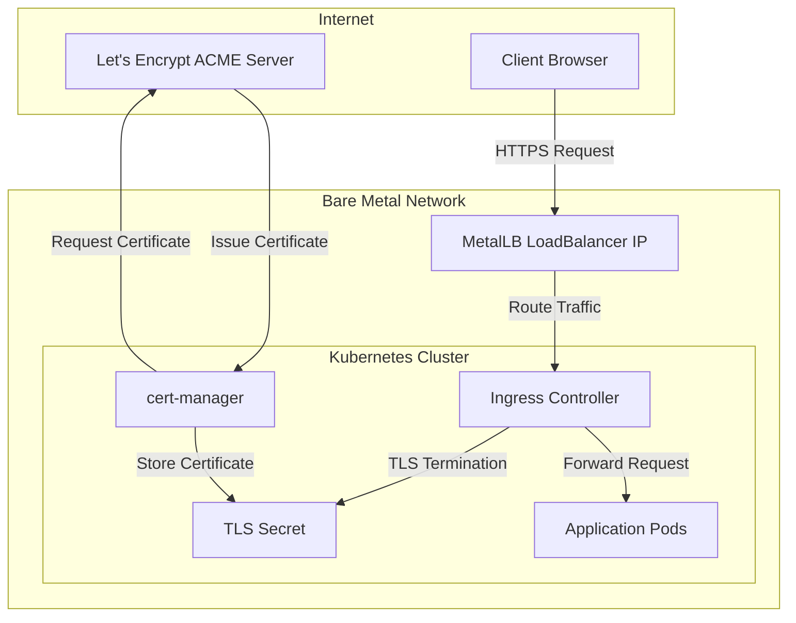
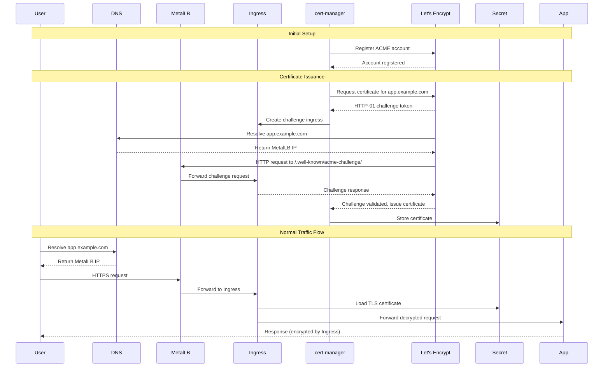

# How to Use MetalLB with cert-manager for Automated TLS

Author: [nawazdhandala](https://github.com/nawazdhandala)

Tags: MetalLB, cert-manager, TLS, Kubernetes, SSL, Load Balancing, Security, Automation

Description: Learn how to use MetalLB with cert-manager for automated TLS certificate management on bare-metal Kubernetes services.

---

Running Kubernetes on bare metal gives you full control over your infrastructure, but it also means you're responsible for load balancing and TLS certificate management. MetalLB provides load balancer capabilities for bare-metal clusters, while cert-manager automates the process of obtaining and renewing TLS certificates. Together, they create a production-ready setup for secure, externally accessible services.

This guide walks you through setting up end-to-end TLS for bare-metal Kubernetes services using MetalLB and cert-manager.

## Architecture Overview

Before diving into the implementation, let's understand how these components work together to provide automated TLS for your bare-metal services.



The flow works as follows:

1. MetalLB assigns an external IP address to your Ingress controller
2. cert-manager requests TLS certificates from Let's Encrypt (or another ACME provider)
3. The ACME server validates domain ownership through HTTP-01 or DNS-01 challenges
4. cert-manager stores the issued certificate in a Kubernetes Secret
5. The Ingress controller uses the certificate for TLS termination
6. Clients connect securely to your services via HTTPS

## Prerequisites

Before starting, ensure you have:

- A bare-metal Kubernetes cluster (v1.19+)
- kubectl configured to access your cluster
- Helm v3 installed
- A domain name with DNS records pointing to your cluster's external IP range
- Network access from your cluster to Let's Encrypt servers (port 443 outbound)

## Step 1: Install MetalLB

MetalLB provides load balancer implementation for bare-metal clusters. We'll use Layer 2 mode, which works without any special network configuration.

First, install MetalLB using the official manifests. The native installation method deploys MetalLB into the metallb-system namespace:

```bash
kubectl apply -f https://raw.githubusercontent.com/metallb/metallb/v0.14.5/config/manifests/metallb-native.yaml
```

Wait for the MetalLB pods to be ready before proceeding:

```bash
kubectl wait --namespace metallb-system \
  --for=condition=ready pod \
  --selector=app=metallb \
  --timeout=90s
```

Now configure MetalLB with an IP address pool. Replace the IP range with addresses available on your bare-metal network. These should be addresses in the same subnet as your nodes that aren't used by other devices:

`metallb-config.yaml`

```yaml
apiVersion: metallb.io/v1beta1
kind: IPAddressPool
metadata:
  name: production-pool
  namespace: metallb-system
spec:
  # Replace with your available IP range
  # These IPs must be routable on your network
  addresses:
    - 192.168.1.240-192.168.1.250
---
apiVersion: metallb.io/v1beta1
kind: L2Advertisement
metadata:
  name: production-l2
  namespace: metallb-system
spec:
  ipAddressPools:
    - production-pool
  # Optional: limit announcements to specific interfaces
  # interfaces:
  #   - eth0
```

Apply the MetalLB configuration:

```bash
kubectl apply -f metallb-config.yaml
```

## Step 2: Install an Ingress Controller

The Ingress controller handles TLS termination and routes traffic to your services. We'll use NGINX Ingress Controller, which works well with cert-manager.

Add the NGINX Ingress Helm repository and install the controller. The controller will automatically receive an external IP from MetalLB:

```bash
helm repo add ingress-nginx https://kubernetes.github.io/ingress-nginx
helm repo update

helm install ingress-nginx ingress-nginx/ingress-nginx \
  --namespace ingress-nginx \
  --create-namespace \
  --set controller.service.type=LoadBalancer
```

Verify that MetalLB assigned an external IP to the Ingress controller. The EXTERNAL-IP column should show an IP from your configured pool:

```bash
kubectl get svc -n ingress-nginx ingress-nginx-controller
```

Expected output:

```
NAME                       TYPE           CLUSTER-IP     EXTERNAL-IP     PORT(S)
ingress-nginx-controller   LoadBalancer   10.96.45.123   192.168.1.240   80:31080/TCP,443:31443/TCP
```

Note the external IP address - you'll need to configure your DNS records to point to this IP.

## Step 3: Install cert-manager

cert-manager automates TLS certificate management in Kubernetes. It handles certificate issuance, renewal, and storage.

Install cert-manager using Helm. The installCRDs flag ensures the Custom Resource Definitions are created:

```bash
helm repo add jetstack https://charts.jetstack.io
helm repo update

helm install cert-manager jetstack/cert-manager \
  --namespace cert-manager \
  --create-namespace \
  --set installCRDs=true
```

Verify all cert-manager pods are running before proceeding:

```bash
kubectl get pods -n cert-manager
```

All three pods (cert-manager, cert-manager-cainjector, and cert-manager-webhook) should be in Running status.

## Step 4: Configure a ClusterIssuer

A ClusterIssuer tells cert-manager how to obtain certificates. We'll configure Let's Encrypt with HTTP-01 challenge validation, which is the most straightforward method for services accessible from the internet.

Create a staging ClusterIssuer first for testing. Let's Encrypt staging environment has higher rate limits and issues test certificates that browsers won't trust:

`letsencrypt-staging.yaml`

```yaml
apiVersion: cert-manager.io/v1
kind: ClusterIssuer
metadata:
  name: letsencrypt-staging
spec:
  acme:
    # Let's Encrypt staging server for testing
    server: https://acme-staging-v02.api.letsencrypt.org/directory
    # Replace with your email address for certificate expiration notices
    email: your-email@example.com
    # Secret to store the ACME account private key
    privateKeySecretRef:
      name: letsencrypt-staging-account-key
    solvers:
      # HTTP-01 challenge solver using the ingress controller
      - http01:
          ingress:
            ingressClassName: nginx
```

Create a production ClusterIssuer for real certificates. Production certificates are trusted by browsers but have stricter rate limits:

`letsencrypt-production.yaml`

```yaml
apiVersion: cert-manager.io/v1
kind: ClusterIssuer
metadata:
  name: letsencrypt-production
spec:
  acme:
    # Let's Encrypt production server for real certificates
    server: https://acme-v02.api.letsencrypt.org/directory
    # Replace with your email address
    email: your-email@example.com
    privateKeySecretRef:
      name: letsencrypt-production-account-key
    solvers:
      - http01:
          ingress:
            ingressClassName: nginx
```

Apply both ClusterIssuers:

```bash
kubectl apply -f letsencrypt-staging.yaml
kubectl apply -f letsencrypt-production.yaml
```

Verify the ClusterIssuers are ready:

```bash
kubectl get clusterissuer
```

Both issuers should show `Ready: True` in the output.

## Step 5: Configure DNS

Before requesting certificates, your domain must resolve to the MetalLB-assigned IP address. Create an A record pointing to your Ingress controller's external IP.

Example DNS configuration:

```
app.example.com    A    192.168.1.240
```

For wildcard certificates, you'll need to use DNS-01 challenge validation instead of HTTP-01. Verify DNS propagation before proceeding:

```bash
dig +short app.example.com
```

The output should show your MetalLB external IP.

## Step 6: Deploy an Application with TLS

Now let's deploy a sample application with automatic TLS certificate provisioning. We'll create a Deployment, Service, and Ingress that work together.

This example deploys a simple web application. The Ingress resource includes annotations that tell cert-manager to automatically provision a certificate:

`app-with-tls.yaml`

```yaml
apiVersion: apps/v1
kind: Deployment
metadata:
  name: web-app
  namespace: default
spec:
  replicas: 2
  selector:
    matchLabels:
      app: web-app
  template:
    metadata:
      labels:
        app: web-app
    spec:
      containers:
        - name: web
          image: nginx:alpine
          ports:
            - containerPort: 80
          resources:
            limits:
              memory: "128Mi"
              cpu: "250m"
            requests:
              memory: "64Mi"
              cpu: "100m"
---
apiVersion: v1
kind: Service
metadata:
  name: web-app
  namespace: default
spec:
  selector:
    app: web-app
  ports:
    - port: 80
      targetPort: 80
      protocol: TCP
---
apiVersion: networking.k8s.io/v1
kind: Ingress
metadata:
  name: web-app
  namespace: default
  annotations:
    # Tell cert-manager which issuer to use
    # Use letsencrypt-staging for testing, then switch to production
    cert-manager.io/cluster-issuer: "letsencrypt-staging"
    # Force HTTPS redirect
    nginx.ingress.kubernetes.io/ssl-redirect: "true"
spec:
  ingressClassName: nginx
  tls:
    # cert-manager creates this secret automatically
    - hosts:
        - app.example.com
      secretName: web-app-tls
  rules:
    - host: app.example.com
      http:
        paths:
          - path: /
            pathType: Prefix
            backend:
              service:
                name: web-app
                port:
                  number: 80
```

Deploy the application:

```bash
kubectl apply -f app-with-tls.yaml
```

## Step 7: Monitor Certificate Issuance

cert-manager creates Certificate and CertificateRequest resources to track the issuance process. Monitor the progress to ensure everything works correctly.

Check the Certificate status. It should progress through Pending to Ready:

```bash
kubectl get certificate web-app-tls
```

For more details on the certificate request process, check the CertificateRequest:

```bash
kubectl get certificaterequest
```

If the certificate isn't being issued, check the cert-manager logs for errors:

```bash
kubectl logs -n cert-manager -l app=cert-manager --tail=100
```

Check the challenge status if the certificate is stuck in Pending:

```bash
kubectl get challenges
```

Common issues include:
- DNS not resolving to the correct IP
- Firewall blocking HTTP-01 challenge (port 80)
- Rate limits exceeded on Let's Encrypt

Once the certificate is ready, verify the TLS secret was created:

```bash
kubectl get secret web-app-tls
```

## Step 8: Switch to Production Certificates

After verifying the setup works with staging certificates, switch to production. Update the Ingress annotation to use the production issuer:

```bash
kubectl annotate ingress web-app \
  cert-manager.io/cluster-issuer=letsencrypt-production \
  --overwrite
```

Delete the staging certificate secret to trigger a new certificate request:

```bash
kubectl delete secret web-app-tls
```

cert-manager will automatically request a new certificate from the production issuer. Monitor the new certificate:

```bash
kubectl get certificate web-app-tls -w
```

## Step 9: Verify TLS Configuration

Test the complete setup by making HTTPS requests to your application. First, verify the certificate chain:

```bash
curl -vI https://app.example.com 2>&1 | grep -E "(SSL|subject|issuer|expire)"
```

Check that the certificate is valid and issued by Let's Encrypt:

```bash
openssl s_client -connect app.example.com:443 -servername app.example.com </dev/null 2>/dev/null | openssl x509 -noout -dates -issuer
```

Test that HTTP requests are redirected to HTTPS:

```bash
curl -I http://app.example.com
```

You should see a 308 Permanent Redirect to the HTTPS URL.

## Advanced Configuration: DNS-01 Challenge

For services behind firewalls or when you need wildcard certificates, use DNS-01 challenge validation. This requires configuring a DNS provider.

Example ClusterIssuer with Cloudflare DNS-01 solver. You'll need to create a Cloudflare API token with DNS edit permissions:

`letsencrypt-dns.yaml`

```yaml
apiVersion: v1
kind: Secret
metadata:
  name: cloudflare-api-token
  namespace: cert-manager
type: Opaque
stringData:
  # Replace with your Cloudflare API token
  api-token: "your-cloudflare-api-token"
---
apiVersion: cert-manager.io/v1
kind: ClusterIssuer
metadata:
  name: letsencrypt-dns
spec:
  acme:
    server: https://acme-v02.api.letsencrypt.org/directory
    email: your-email@example.com
    privateKeySecretRef:
      name: letsencrypt-dns-account-key
    solvers:
      - dns01:
          cloudflare:
            # Cloudflare API token with Zone:DNS:Edit permission
            apiTokenSecretRef:
              name: cloudflare-api-token
              key: api-token
```

With DNS-01 validation, you can request wildcard certificates. Update your Ingress to use a wildcard:

`wildcard-ingress.yaml`

```yaml
apiVersion: networking.k8s.io/v1
kind: Ingress
metadata:
  name: wildcard-app
  namespace: default
  annotations:
    cert-manager.io/cluster-issuer: "letsencrypt-dns"
    nginx.ingress.kubernetes.io/ssl-redirect: "true"
spec:
  ingressClassName: nginx
  tls:
    - hosts:
        - "*.example.com"
      secretName: wildcard-tls
  rules:
    - host: "*.example.com"
      http:
        paths:
          - path: /
            pathType: Prefix
            backend:
              service:
                name: web-app
                port:
                  number: 80
```

## Certificate Renewal

cert-manager automatically renews certificates before they expire. By default, renewal begins 30 days before expiration for Let's Encrypt certificates (which are valid for 90 days).

Monitor upcoming renewals:

```bash
kubectl get certificates --all-namespaces -o custom-columns=\
NAME:.metadata.name,\
NAMESPACE:.metadata.namespace,\
READY:.status.conditions[0].status,\
EXPIRY:.status.notAfter
```

Set up alerting for certificate expiration. The following Prometheus alerting rule fires when a certificate expires within 14 days:

`certificate-alerts.yaml`

```yaml
apiVersion: monitoring.coreos.com/v1
kind: PrometheusRule
metadata:
  name: cert-manager-alerts
  namespace: monitoring
spec:
  groups:
    - name: cert-manager
      rules:
        - alert: CertificateExpiringSoon
          # Fire when certificate expires in less than 14 days
          expr: certmanager_certificate_expiration_timestamp_seconds - time() < 1209600
          for: 1h
          labels:
            severity: warning
          annotations:
            summary: "Certificate {{ $labels.name }} expiring soon"
            description: "Certificate {{ $labels.name }} in namespace {{ $labels.namespace }} expires in less than 14 days"
        - alert: CertificateNotReady
          # Fire when certificate is not ready for more than 15 minutes
          expr: certmanager_certificate_ready_status{condition="True"} == 0
          for: 15m
          labels:
            severity: critical
          annotations:
            summary: "Certificate {{ $labels.name }} not ready"
            description: "Certificate {{ $labels.name }} in namespace {{ $labels.namespace }} has been not ready for more than 15 minutes"
```

## Troubleshooting

When things don't work as expected, follow this systematic troubleshooting approach.

Check MetalLB is assigning IPs correctly:

```bash
kubectl get svc --all-namespaces | grep LoadBalancer
```

Services should have external IPs from your configured pool.

Verify the Ingress controller can receive traffic:

```bash
curl -I http://192.168.1.240
```

Check cert-manager resources in order of the issuance pipeline:

```bash
kubectl describe certificate web-app-tls
kubectl describe certificaterequest -l certificate=web-app-tls
kubectl describe order -l certificate=web-app-tls
kubectl describe challenge -l certificate=web-app-tls
```

Common issues and solutions:

| Issue | Cause | Solution |
|-------|-------|----------|
| Certificate stuck in Pending | HTTP-01 challenge failing | Verify DNS resolves correctly, port 80 is accessible |
| No external IP assigned | MetalLB misconfiguration | Check IPAddressPool and L2Advertisement resources |
| TLS handshake failure | Wrong certificate or missing secret | Verify secret exists and contains valid certificate |
| Challenge timeout | Firewall blocking port 80 | Allow inbound HTTP traffic or use DNS-01 |

View cert-manager controller logs for detailed error messages:

```bash
kubectl logs -n cert-manager deployment/cert-manager -f
```

## Security Best Practices

Follow these practices to maintain a secure TLS configuration.

Use strong TLS configuration on your Ingress controller. Configure minimum TLS version and secure cipher suites:

`ingress-tls-config.yaml`

```yaml
apiVersion: v1
kind: ConfigMap
metadata:
  name: ingress-nginx-controller
  namespace: ingress-nginx
data:
  # Minimum TLS 1.2, prefer TLS 1.3
  ssl-protocols: "TLSv1.2 TLSv1.3"
  # Modern cipher suite configuration
  ssl-ciphers: "ECDHE-ECDSA-AES128-GCM-SHA256:ECDHE-RSA-AES128-GCM-SHA256:ECDHE-ECDSA-AES256-GCM-SHA384:ECDHE-RSA-AES256-GCM-SHA384"
  # Enable HSTS with 1-year duration
  hsts: "true"
  hsts-max-age: "31536000"
  hsts-include-subdomains: "true"
```

Store sensitive data securely. Never commit API tokens or certificates to version control. Use Kubernetes Secrets or external secret management:

```bash
kubectl create secret generic cloudflare-api-token \
  --namespace cert-manager \
  --from-literal=api-token="${CLOUDFLARE_API_TOKEN}"
```

Regularly rotate the ACME account key if compromised:

```bash
kubectl delete secret letsencrypt-production-account-key -n cert-manager
```

cert-manager will automatically create a new account key on the next certificate request.

## Complete Architecture Diagram

Here's the complete flow showing how all components interact in a production setup:



---

With MetalLB and cert-manager working together, your bare-metal Kubernetes cluster can automatically provision and renew TLS certificates just like managed cloud platforms. This setup eliminates manual certificate management, reduces the risk of certificate expiration outages, and provides a foundation for secure service exposure.

The combination of MetalLB's load balancing capabilities and cert-manager's automation creates a production-ready infrastructure that scales from a single service to hundreds, all with minimal operational overhead.
