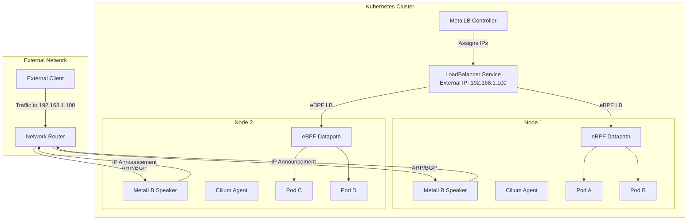
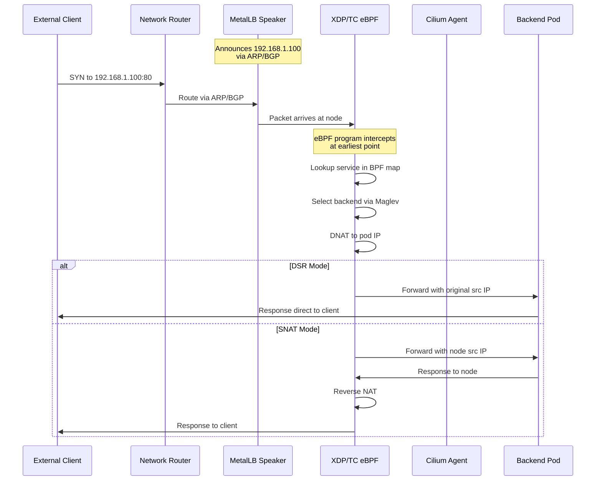

# How to Use MetalLB with Cilium for eBPF-Based Load Balancing

Author: [nawazdhandala](https://github.com/nawazdhandala)

Tags: MetalLB, Cilium, eBPF, Kubernetes, Load Balancing, Networking, Performance

Description: Learn how to integrate MetalLB with Cilium for eBPF-based load balancing combining MetalLB announcements with Cilium datapath.

---

## Introduction

MetalLB and Cilium are two powerful networking solutions that, when combined, provide enterprise-grade load balancing capabilities for bare-metal Kubernetes clusters. MetalLB handles external IP address allocation and announcement through Layer 2 (ARP/NDP) or BGP protocols, while Cilium leverages eBPF (extended Berkeley Packet Filter) to provide high-performance, kernel-level packet processing for the actual load balancing datapath.

This integration allows you to benefit from MetalLB's robust IP address management and external announcement capabilities while utilizing Cilium's eBPF-powered load balancing for superior performance and observability.

## Architecture Overview

The following diagram illustrates how MetalLB and Cilium work together in a Kubernetes cluster:



## Key Benefits of This Integration

| Feature | MetalLB Contribution | Cilium Contribution |
|---------|---------------------|---------------------|
| External IP Management | IP address pool allocation | N/A |
| IP Announcement | ARP/NDP/BGP protocols | N/A |
| Load Balancing | N/A | eBPF-based packet processing |
| Performance | N/A | Kernel-level, zero-copy operations |
| Observability | N/A | eBPF-based metrics and tracing |
| Session Affinity | N/A | Maglev consistent hashing |
| DSR Support | N/A | Direct Server Return |

## Prerequisites

Before proceeding, ensure you have:

- A Kubernetes cluster (v1.25+) running on bare-metal or virtualized infrastructure
- kubectl configured to access your cluster
- Helm v3.x installed
- Root/sudo access on cluster nodes
- Linux kernel 5.10+ (recommended for full eBPF features)

Verify your kernel version supports eBPF features:

```bash
uname -r
```

Check for required kernel config options:

```bash
zcat /proc/config.gz | grep -E "CONFIG_BPF|CONFIG_CGROUP_BPF|CONFIG_XDP"
```

## Step 1: Install Cilium with eBPF Load Balancing

First, install Cilium with the necessary configuration to enable eBPF-based load balancing. We'll disable kube-proxy replacement since we want Cilium to handle service load balancing.

Add the Cilium Helm repository:

```bash
helm repo add cilium https://helm.cilium.io/
helm repo update
```

Create a values file for Cilium installation. This configuration enables eBPF-based load balancing and prepares Cilium for MetalLB integration:

```yaml
# cilium-values.yaml

# Enable kube-proxy replacement for full eBPF load balancing
kubeProxyReplacement: true

# Kubernetes API server endpoint (replace with your cluster's API server)
k8sServiceHost: "YOUR_API_SERVER_IP"
k8sServicePort: "6443"

# Enable eBPF-based load balancing features
loadBalancer:
  # Use eBPF for service load balancing
  mode: "dsr"  # Options: snat, dsr, hybrid
  # Algorithm for backend selection
  algorithm: "maglev"  # Options: random, maglev
  # Enable acceleration using XDP
  acceleration: "native"  # Options: disabled, native, best-effort

# Enable external traffic policy support
externalTrafficPolicy:
  enabled: true

# Configure BPF settings
bpf:
  # Enable native routing mode
  masquerade: true
  # Enable host routing via eBPF
  hostLegacyRouting: false
  # Enable socket-level load balancing
  lbExternalClusterIP: true

# Enable BGP control plane if using BGP with MetalLB
bgpControlPlane:
  enabled: false  # Set to true if using BGP mode

# IP Address Management
ipam:
  mode: "kubernetes"

# Enable Hubble for observability
hubble:
  enabled: true
  relay:
    enabled: true
  ui:
    enabled: true
```

Install Cilium using Helm:

```bash
helm install cilium cilium/cilium \
  --version 1.15.0 \
  --namespace kube-system \
  --values cilium-values.yaml
```

Wait for Cilium to be ready:

```bash
kubectl -n kube-system rollout status daemonset/cilium
```

Verify Cilium installation and eBPF load balancing status:

```bash
cilium status --wait
```

Check that kube-proxy replacement is active:

```bash
kubectl -n kube-system exec ds/cilium -- cilium status | grep KubeProxyReplacement
```

## Step 2: Install MetalLB

Now install MetalLB to handle external IP address allocation and announcement. MetalLB will assign IPs and announce them, while Cilium handles the actual load balancing.

Create the MetalLB namespace:

```bash
kubectl create namespace metallb-system
```

Install MetalLB using Helm:

```bash
helm repo add metallb https://metallb.universe.tf
helm repo update

helm install metallb metallb/metallb \
  --namespace metallb-system \
  --wait
```

Wait for MetalLB components to be ready:

```bash
kubectl -n metallb-system rollout status deployment/metallb-controller
kubectl -n metallb-system rollout status daemonset/metallb-speaker
```

## Step 3: Configure MetalLB IP Address Pool

Define an IP address pool for MetalLB to allocate external IPs from. This pool should contain addresses routable from your external network.

Create the IPAddressPool resource:

```yaml
# metallb-ippool.yaml
apiVersion: metallb.io/v1beta1
kind: IPAddressPool
metadata:
  name: production-pool
  namespace: metallb-system
spec:
  # Define the IP range for LoadBalancer services
  addresses:
    - 192.168.1.100-192.168.1.200
  # Automatically assign IPs from this pool
  autoAssign: true
  # Avoid specific addresses if needed
  avoidBuggyIPs: true
```

Apply the configuration:

```bash
kubectl apply -f metallb-ippool.yaml
```

## Step 4: Configure MetalLB Announcement Mode

MetalLB supports two announcement modes: Layer 2 (L2) and BGP. Choose the appropriate mode based on your network infrastructure.

### Option A: Layer 2 Mode (ARP/NDP)

Layer 2 mode uses ARP (IPv4) or NDP (IPv6) to announce IP addresses. This is simpler to set up but has single-node failover limitations.

Create the L2Advertisement resource:

```yaml
# metallb-l2-advertisement.yaml
apiVersion: metallb.io/v1beta1
kind: L2Advertisement
metadata:
  name: l2-advertisement
  namespace: metallb-system
spec:
  # Reference the IP pools to advertise
  ipAddressPools:
    - production-pool
  # Optional: specify which interfaces to use
  interfaces:
    - eth0
  # Optional: select specific nodes for announcements
  nodeSelectors:
    - matchLabels:
        node-role.kubernetes.io/loadbalancer: "true"
```

Apply the L2 advertisement configuration:

```bash
kubectl apply -f metallb-l2-advertisement.yaml
```

### Option B: BGP Mode

BGP mode announces IP addresses via BGP peering sessions with your network routers. This provides better scalability and traffic distribution.

Create the BGPAdvertisement and BGPPeer resources:

```yaml
# metallb-bgp-config.yaml
---
apiVersion: metallb.io/v1beta2
kind: BGPPeer
metadata:
  name: router-peer
  namespace: metallb-system
spec:
  # Your network router's IP address
  peerAddress: 10.0.0.1
  # Router's BGP AS number
  peerASN: 64512
  # Your cluster's BGP AS number
  myASN: 64513
  # Optional: specific source address
  sourceAddress: 10.0.0.10
  # Optional: node selector for BGP speakers
  nodeSelectors:
    - matchLabels:
        node-role.kubernetes.io/loadbalancer: "true"
  # BGP session parameters
  holdTime: 90s
  keepaliveTime: 30s
  # Enable BFD for faster failover
  bfdProfile: "production-bfd"
---
apiVersion: metallb.io/v1beta1
kind: BFDProfile
metadata:
  name: production-bfd
  namespace: metallb-system
spec:
  receiveInterval: 300
  transmitInterval: 300
  detectMultiplier: 3
  echoMode: false
  passiveMode: false
  minimumTtl: 254
---
apiVersion: metallb.io/v1beta1
kind: BGPAdvertisement
metadata:
  name: bgp-advertisement
  namespace: metallb-system
spec:
  ipAddressPools:
    - production-pool
  # Advertise specific communities
  communities:
    - name: no-export
      value: "65535:65281"
  # Optional: aggregate prefixes
  aggregationLength: 32
  aggregationLengthV6: 128
  # Optional: set local preference
  localPref: 100
```

Apply the BGP configuration:

```bash
kubectl apply -f metallb-bgp-config.yaml
```

## Step 5: Configure Cilium for MetalLB Integration

Now configure Cilium to work seamlessly with MetalLB. This involves ensuring Cilium handles the load balancing for services with external IPs assigned by MetalLB.

Create a Cilium configuration to enable external IP load balancing:

```yaml
# cilium-lb-config.yaml
apiVersion: cilium.io/v2
kind: CiliumLoadBalancerIPPool
metadata:
  name: metallb-integration
spec:
  # This is informational - MetalLB manages the actual allocation
  blocks:
    - start: 192.168.1.100
      stop: 192.168.1.200
  # Disable Cilium's IP allocation since MetalLB handles it
  disabled: true
```

Apply the Cilium configuration:

```bash
kubectl apply -f cilium-lb-config.yaml
```

Update Cilium to recognize MetalLB-assigned IPs. Create a ConfigMap patch:

```yaml
# cilium-configmap-patch.yaml
data:
  # Enable external IPs in the eBPF datapath
  enable-external-ips: "true"
  # Enable load balancing for external traffic
  enable-node-port: "true"
  # Configure DSR mode for better performance
  loadbalancer-mode: "dsr"
  # Use Maglev for consistent hashing
  loadbalancer-algorithm: "maglev"
```

Patch the Cilium ConfigMap:

```bash
kubectl -n kube-system patch configmap cilium-config --patch-file cilium-configmap-patch.yaml
```

Restart Cilium to apply changes:

```bash
kubectl -n kube-system rollout restart daemonset/cilium
kubectl -n kube-system rollout status daemonset/cilium
```

## Step 6: Deploy a Test Application

Deploy a sample application to test the MetalLB and Cilium integration.

Create a deployment and LoadBalancer service:

```yaml
# test-app.yaml
---
apiVersion: apps/v1
kind: Deployment
metadata:
  name: nginx-demo
  labels:
    app: nginx-demo
spec:
  replicas: 3
  selector:
    matchLabels:
      app: nginx-demo
  template:
    metadata:
      labels:
        app: nginx-demo
    spec:
      containers:
        - name: nginx
          image: nginx:1.25
          ports:
            - containerPort: 80
          resources:
            requests:
              memory: "64Mi"
              cpu: "100m"
            limits:
              memory: "128Mi"
              cpu: "200m"
---
apiVersion: v1
kind: Service
metadata:
  name: nginx-demo-lb
  annotations:
    # Optional: request specific IP from MetalLB
    metallb.universe.tf/loadBalancerIPs: "192.168.1.100"
spec:
  type: LoadBalancer
  # Use Cluster external traffic policy for eBPF DSR
  externalTrafficPolicy: Cluster
  selector:
    app: nginx-demo
  ports:
    - protocol: TCP
      port: 80
      targetPort: 80
```

Apply the test application:

```bash
kubectl apply -f test-app.yaml
```

Verify the service received an external IP from MetalLB:

```bash
kubectl get svc nginx-demo-lb
```

Expected output showing the assigned external IP:

```
NAME            TYPE           CLUSTER-IP      EXTERNAL-IP     PORT(S)        AGE
nginx-demo-lb   LoadBalancer   10.96.123.45    192.168.1.100   80:30123/TCP   30s
```

## Step 7: Verify eBPF Load Balancing

Confirm that Cilium is handling the load balancing via eBPF.

Check Cilium's service mapping:

```bash
kubectl -n kube-system exec ds/cilium -- cilium service list
```

You should see the LoadBalancer service with its backends:

```
ID   Frontend               Service Type   Backend
1    192.168.1.100:80       LoadBalancer   1 => 10.0.1.10:80 (active)
                                           2 => 10.0.1.11:80 (active)
                                           3 => 10.0.2.12:80 (active)
```

View the eBPF maps that store service information:

```bash
kubectl -n kube-system exec ds/cilium -- cilium bpf lb list
```

Check the Maglev lookup table (if using Maglev algorithm):

```bash
kubectl -n kube-system exec ds/cilium -- cilium bpf maglev list
```

## Step 8: Configure Advanced Load Balancing Options

### Enable Session Affinity

For applications requiring sticky sessions, configure session affinity:

```yaml
# session-affinity-service.yaml
apiVersion: v1
kind: Service
metadata:
  name: sticky-app-lb
spec:
  type: LoadBalancer
  selector:
    app: sticky-app
  sessionAffinity: ClientIP
  sessionAffinityConfig:
    clientIP:
      timeoutSeconds: 3600
  ports:
    - port: 80
      targetPort: 80
```

### Configure Health Checks

Cilium performs automatic health checks on backends. You can configure custom health check parameters:

```yaml
# health-check-config.yaml
apiVersion: cilium.io/v2
kind: CiliumClusterwideNetworkPolicy
metadata:
  name: loadbalancer-health-policy
spec:
  endpointSelector:
    matchLabels:
      app: nginx-demo
  ingress:
    - fromEntities:
        - health
      toPorts:
        - ports:
            - port: "80"
              protocol: TCP
```

### Enable XDP Acceleration

For maximum performance, enable XDP (eXpress Data Path) acceleration. This requires compatible network drivers:

```bash
# Check if your NIC supports native XDP
ethtool -i eth0 | grep driver

# For supported drivers (e.g., i40e, mlx5, virtio_net)
kubectl -n kube-system exec ds/cilium -- cilium config set loadbalancer-acceleration native
```

## Step 9: Monitoring and Observability

### Enable Hubble for Traffic Visualization

Hubble provides deep visibility into network traffic flowing through Cilium.

Access the Hubble UI:

```bash
kubectl port-forward -n kube-system svc/hubble-ui 12000:80
```

Open http://localhost:12000 in your browser to visualize traffic flows.

### Query Load Balancing Metrics

Use Hubble CLI to observe load balancer traffic:

```bash
# Install Hubble CLI if not present
HUBBLE_VERSION=$(curl -s https://raw.githubusercontent.com/cilium/hubble/master/stable.txt)
curl -LO "https://github.com/cilium/hubble/releases/download/$HUBBLE_VERSION/hubble-linux-amd64.tar.gz"
tar xzf hubble-linux-amd64.tar.gz
sudo mv hubble /usr/local/bin/

# Port forward to Hubble relay
kubectl port-forward -n kube-system svc/hubble-relay 4245:80 &

# Observe traffic to the LoadBalancer service
hubble observe --to-service nginx-demo-lb --protocol tcp
```

### Prometheus Metrics

Cilium exposes Prometheus metrics for load balancing. Create a ServiceMonitor if using Prometheus Operator:

```yaml
# cilium-servicemonitor.yaml
apiVersion: monitoring.coreos.com/v1
kind: ServiceMonitor
metadata:
  name: cilium-metrics
  namespace: kube-system
spec:
  selector:
    matchLabels:
      k8s-app: cilium
  namespaceSelector:
    matchNames:
      - kube-system
  endpoints:
    - port: prometheus
      interval: 30s
```

Key metrics to monitor include cilium_services_events_total, cilium_bpf_map_ops_total, and cilium_datapath_errors_total.

## Step 10: Troubleshooting Common Issues

### Issue: Service Not Receiving External IP

Check MetalLB controller logs:

```bash
kubectl -n metallb-system logs deployment/metallb-controller
```

Verify IP pool configuration:

```bash
kubectl get ipaddresspools -n metallb-system -o yaml
```

Ensure the IP pool has available addresses:

```bash
kubectl get services -A -o jsonpath='{.items[?(@.spec.type=="LoadBalancer")].status.loadBalancer.ingress[0].ip}' | tr ' ' '\n' | sort | uniq -c
```

### Issue: Traffic Not Reaching Pods

Verify Cilium service configuration:

```bash
kubectl -n kube-system exec ds/cilium -- cilium service list | grep -A5 "192.168.1.100"
```

Check if endpoints are healthy:

```bash
kubectl get endpoints nginx-demo-lb
```

Verify eBPF programs are loaded:

```bash
kubectl -n kube-system exec ds/cilium -- cilium bpf prog list
```

### Issue: BGP Peering Not Established

Check MetalLB speaker logs for BGP errors:

```bash
kubectl -n metallb-system logs daemonset/metallb-speaker | grep -i bgp
```

Verify BGP peer status:

```bash
kubectl get bgppeers -n metallb-system -o yaml
```

Test BGP connectivity from a speaker pod:

```bash
kubectl -n metallb-system exec -it $(kubectl -n metallb-system get pods -l component=speaker -o jsonpath='{.items[0].metadata.name}') -- nc -vz 10.0.0.1 179
```

### Issue: Performance Issues

Check XDP mode status:

```bash
kubectl -n kube-system exec ds/cilium -- cilium status | grep XDP
```

Verify Maglev tables are populated:

```bash
kubectl -n kube-system exec ds/cilium -- cilium bpf maglev list | wc -l
```

Monitor CPU usage on Cilium agents:

```bash
kubectl top pods -n kube-system -l k8s-app=cilium
```

## Traffic Flow Deep Dive

The following diagram shows the detailed packet flow when external traffic reaches a LoadBalancer service:



## Best Practices

### 1. Use Appropriate Traffic Policy

For applications that need client IP preservation, use externalTrafficPolicy: Local with MetalLB's L2 mode:

```yaml
spec:
  externalTrafficPolicy: Local
```

This ensures traffic only goes to nodes with running pods, preserving the client IP.

### 2. Configure Pod Anti-Affinity

Spread backend pods across nodes for better availability:

```yaml
spec:
  affinity:
    podAntiAffinity:
      preferredDuringSchedulingIgnoredDuringExecution:
        - weight: 100
          podAffinityTerm:
            labelSelector:
              matchLabels:
                app: nginx-demo
            topologyKey: kubernetes.io/hostname
```

### 3. Enable Connection Tracking Cleanup

Configure Cilium to properly clean up connection tracking entries:

```yaml
# In Cilium ConfigMap
data:
  ct-global-max-entries-tcp: "524288"
  ct-global-max-entries-other: "262144"
```

### 4. Use BFD for Fast Failover

When using BGP mode, enable BFD (Bidirectional Forwarding Detection) for sub-second failover:

```yaml
apiVersion: metallb.io/v1beta1
kind: BFDProfile
metadata:
  name: fast-failover
  namespace: metallb-system
spec:
  receiveInterval: 100
  transmitInterval: 100
  detectMultiplier: 3
```

### 5. Monitor eBPF Map Usage

Regularly check eBPF map utilization to prevent exhaustion:

```bash
kubectl -n kube-system exec ds/cilium -- cilium bpf map list
```

## Performance Comparison

The eBPF-based load balancing with Cilium provides significant performance improvements over traditional iptables-based solutions:

| Metric | iptables (kube-proxy) | eBPF (Cilium) | Improvement |
|--------|----------------------|---------------|-------------|
| Latency (p99) | ~500μs | ~50μs | 10x |
| Throughput | ~1M pps | ~10M pps | 10x |
| CPU Usage | High (per-packet) | Low (in-kernel) | 5-10x |
| Connection Setup | Linear O(n) | Constant O(1) | Variable |
| Memory Usage | ~100KB/service | ~10KB/service | 10x |

## Conclusion

Integrating MetalLB with Cilium provides a powerful, high-performance load balancing solution for bare-metal Kubernetes clusters. MetalLB handles the critical task of external IP allocation and announcement, while Cilium's eBPF-based datapath delivers kernel-level packet processing for optimal performance.

Key takeaways:

1. **Separation of concerns**: MetalLB manages IP addresses and announcements; Cilium handles actual load balancing
2. **Performance**: eBPF-based load balancing provides 10x better latency and throughput compared to iptables
3. **Flexibility**: Choose between L2 and BGP modes based on your network infrastructure
4. **Observability**: Hubble provides deep visibility into traffic patterns and service health
5. **Scalability**: Maglev consistent hashing ensures stable backend selection even during scaling events

By following this guide, you now have a production-ready load balancing setup that combines the best of both MetalLB and Cilium for your Kubernetes workloads.

## Additional Resources

- [MetalLB Documentation](https://metallb.universe.tf/)
- [Cilium Documentation](https://docs.cilium.io/)
- [eBPF.io](https://ebpf.io/)
- [Cilium eBPF Load Balancing Guide](https://docs.cilium.io/en/stable/network/kubernetes/kubeproxy-free/)
- [MetalLB BGP Configuration](https://metallb.universe.tf/configuration/_advanced_bgp_configuration/)
