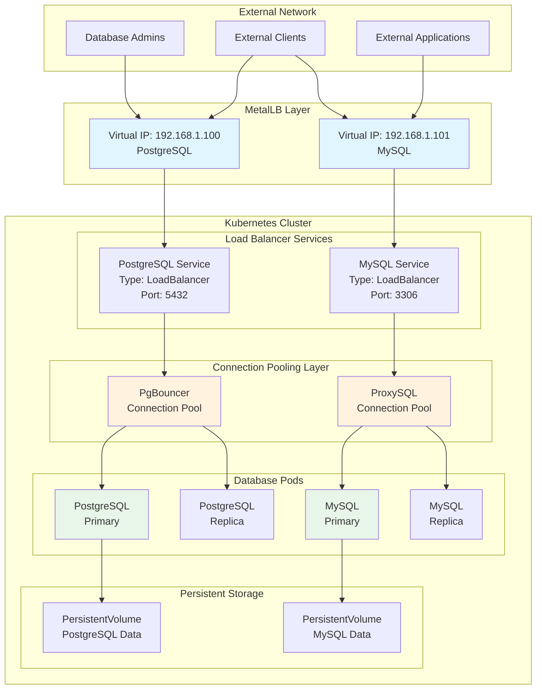
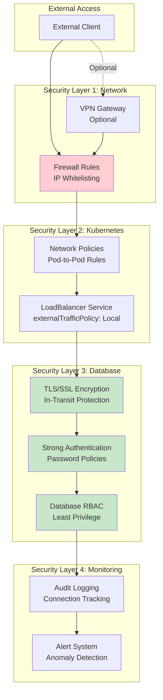
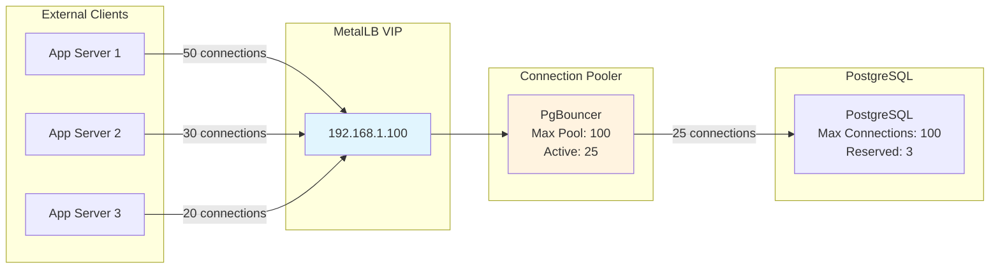
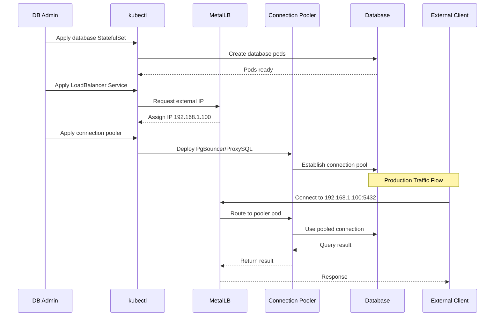

# How to Expose Database Services with MetalLB

Author: [nawazdhandala](https://github.com/nawazdhandala)

Tags: MetalLB, Database, PostgreSQL, MySQL, Kubernetes, Load Balancing

Description: Learn how to safely expose database services externally using MetalLB.

---

## Introduction

Exposing database services in Kubernetes presents unique challenges compared to typical web applications. Databases require stable connections, specific protocols, and robust security measures. MetalLB provides a way to assign external IP addresses to your database services, making them accessible from outside the cluster while maintaining the benefits of Kubernetes orchestration.

This comprehensive guide covers how to safely expose PostgreSQL and MySQL databases using MetalLB, including security best practices, connection pooling integration, and production-ready configurations.

## Architecture Overview

Before diving into configurations, let's understand how MetalLB integrates with database services in Kubernetes.

The following diagram illustrates the architecture of database exposure using MetalLB:



## Prerequisites

Before proceeding, ensure you have:

- A Kubernetes cluster (v1.19+)
- MetalLB installed and configured
- kubectl configured to access your cluster
- Helm v3 (optional, for easier deployments)

## MetalLB Configuration for Database Services

First, let's configure MetalLB with IP address pools dedicated to database services. This separation allows for better network security and management.

The following configuration creates a dedicated IP pool for database services:

```yaml
# metallb-database-config.yaml
# This configuration creates a dedicated IP address pool for database services
# Using a separate pool allows for targeted firewall rules and network policies
apiVersion: metallb.io/v1beta1
kind: IPAddressPool
metadata:
  name: database-pool
  namespace: metallb-system
spec:
  # Define a range of IP addresses reserved for database services
  # Ensure these IPs are not used by DHCP or other services in your network
  addresses:
  - 192.168.1.100-192.168.1.110
  # autoAssign: false prevents MetalLB from automatically using these IPs
  # This ensures only explicitly configured database services get these addresses
  autoAssign: false
---
# L2Advertisement enables MetalLB to respond to ARP requests for the assigned IPs
# This is the simplest mode and works in most network environments
apiVersion: metallb.io/v1beta1
kind: L2Advertisement
metadata:
  name: database-l2-advertisement
  namespace: metallb-system
spec:
  # Reference the database pool to advertise only those IPs
  ipAddressPools:
  - database-pool
  # Optionally specify which interfaces to use for advertisement
  # Uncomment and modify if you need to restrict to specific interfaces
  # interfaces:
  # - eth0
```

Apply the configuration:

```bash
kubectl apply -f metallb-database-config.yaml
```

## Exposing PostgreSQL with MetalLB

### PostgreSQL StatefulSet Deployment

StatefulSets are essential for databases as they provide stable network identities and persistent storage.

The following manifest deploys a PostgreSQL instance with persistent storage:

```yaml
# postgresql-statefulset.yaml
# PostgreSQL deployment using StatefulSet for stable identity and storage
apiVersion: apps/v1
kind: StatefulSet
metadata:
  name: postgresql
  namespace: databases
  labels:
    app: postgresql
    tier: database
spec:
  # serviceName must match the headless service name for DNS resolution
  serviceName: postgresql-headless
  replicas: 1
  selector:
    matchLabels:
      app: postgresql
  template:
    metadata:
      labels:
        app: postgresql
        tier: database
      annotations:
        # Enable Prometheus metrics scraping
        prometheus.io/scrape: "true"
        prometheus.io/port: "9187"
    spec:
      # Security context for the pod - run as non-root user
      securityContext:
        runAsUser: 999
        runAsGroup: 999
        fsGroup: 999
      containers:
      - name: postgresql
        image: postgres:15-alpine
        ports:
        - containerPort: 5432
          name: postgresql
          protocol: TCP
        # Environment variables for PostgreSQL configuration
        env:
        # Reference password from a Kubernetes Secret for security
        - name: POSTGRES_PASSWORD
          valueFrom:
            secretKeyRef:
              name: postgresql-secrets
              key: postgres-password
        - name: POSTGRES_USER
          value: "postgres"
        - name: POSTGRES_DB
          value: "appdb"
        # PostgreSQL data directory location
        - name: PGDATA
          value: "/var/lib/postgresql/data/pgdata"
        # Resource limits ensure predictable performance
        resources:
          requests:
            memory: "512Mi"
            cpu: "250m"
          limits:
            memory: "2Gi"
            cpu: "1000m"
        # Volume mount for persistent data
        volumeMounts:
        - name: postgresql-data
          mountPath: /var/lib/postgresql/data
        # Liveness probe to detect if PostgreSQL is running
        livenessProbe:
          exec:
            command:
            - pg_isready
            - -U
            - postgres
          initialDelaySeconds: 30
          periodSeconds: 10
          timeoutSeconds: 5
          failureThreshold: 3
        # Readiness probe to determine if PostgreSQL can accept connections
        readinessProbe:
          exec:
            command:
            - pg_isready
            - -U
            - postgres
          initialDelaySeconds: 5
          periodSeconds: 5
          timeoutSeconds: 3
          failureThreshold: 3
  # VolumeClaimTemplate creates a PVC for each pod in the StatefulSet
  volumeClaimTemplates:
  - metadata:
      name: postgresql-data
    spec:
      accessModes: ["ReadWriteOnce"]
      # Specify your storage class - adjust based on your cluster
      storageClassName: fast-ssd
      resources:
        requests:
          storage: 50Gi
```

### PostgreSQL Secrets

Create the secrets file for PostgreSQL credentials:

```yaml
# postgresql-secrets.yaml
# Store sensitive PostgreSQL credentials securely
# In production, consider using external secrets management (Vault, AWS Secrets Manager)
apiVersion: v1
kind: Secret
metadata:
  name: postgresql-secrets
  namespace: databases
type: Opaque
# Note: In production, use proper secret management tools
# Values here should be base64 encoded
stringData:
  postgres-password: "YourSecurePassword123!"
  replication-password: "ReplicationPass456!"
```

### PostgreSQL LoadBalancer Service

Now create the LoadBalancer service to expose PostgreSQL through MetalLB:

```yaml
# postgresql-loadbalancer.yaml
# LoadBalancer service to expose PostgreSQL externally via MetalLB
apiVersion: v1
kind: Service
metadata:
  name: postgresql-external
  namespace: databases
  labels:
    app: postgresql
    exposure: external
  annotations:
    # Request a specific IP from the database pool
    # This ensures consistent IP assignment across service recreations
    metallb.universe.tf/address-pool: database-pool
    # Optionally request a specific IP address
    metallb.universe.tf/loadBalancerIPs: "192.168.1.100"
    # Add description for documentation
    description: "External PostgreSQL access via MetalLB"
spec:
  type: LoadBalancer
  # externalTrafficPolicy: Local preserves client source IP
  # This is important for connection logging and IP-based access control
  externalTrafficPolicy: Local
  # Session affinity ensures a client connects to the same pod
  # Critical for database connections to maintain transaction state
  sessionAffinity: ClientIP
  sessionAffinityConfig:
    clientIP:
      # Timeout for session affinity (10800 seconds = 3 hours)
      timeoutSeconds: 10800
  selector:
    app: postgresql
  ports:
  - name: postgresql
    port: 5432
    targetPort: 5432
    protocol: TCP
```

### Headless Service for Internal Communication

Create a headless service for internal cluster communication:

```yaml
# postgresql-headless.yaml
# Headless service for StatefulSet DNS resolution and internal communication
apiVersion: v1
kind: Service
metadata:
  name: postgresql-headless
  namespace: databases
  labels:
    app: postgresql
spec:
  # clusterIP: None creates a headless service
  # This enables direct pod DNS resolution (postgresql-0.postgresql-headless)
  clusterIP: None
  selector:
    app: postgresql
  ports:
  - name: postgresql
    port: 5432
    targetPort: 5432
```

## Exposing MySQL with MetalLB

### MySQL StatefulSet Deployment

The following manifest deploys MySQL with proper configuration for external access:

```yaml
# mysql-statefulset.yaml
# MySQL deployment using StatefulSet for production workloads
apiVersion: apps/v1
kind: StatefulSet
metadata:
  name: mysql
  namespace: databases
  labels:
    app: mysql
    tier: database
spec:
  serviceName: mysql-headless
  replicas: 1
  selector:
    matchLabels:
      app: mysql
  template:
    metadata:
      labels:
        app: mysql
        tier: database
    spec:
      # Termination grace period allows MySQL to complete transactions
      terminationGracePeriodSeconds: 60
      # Security context for running as non-root
      securityContext:
        runAsUser: 999
        runAsGroup: 999
        fsGroup: 999
      containers:
      - name: mysql
        image: mysql:8.0
        ports:
        - containerPort: 3306
          name: mysql
          protocol: TCP
        env:
        # Root password from secret
        - name: MYSQL_ROOT_PASSWORD
          valueFrom:
            secretKeyRef:
              name: mysql-secrets
              key: root-password
        # Create a default database
        - name: MYSQL_DATABASE
          value: "appdb"
        # Create a non-root user for application access
        - name: MYSQL_USER
          value: "appuser"
        - name: MYSQL_PASSWORD
          valueFrom:
            secretKeyRef:
              name: mysql-secrets
              key: user-password
        # MySQL arguments for production configuration
        args:
        - "--default-authentication-plugin=mysql_native_password"
        - "--character-set-server=utf8mb4"
        - "--collation-server=utf8mb4_unicode_ci"
        - "--max-connections=500"
        - "--innodb-buffer-pool-size=1G"
        resources:
          requests:
            memory: "1Gi"
            cpu: "500m"
          limits:
            memory: "4Gi"
            cpu: "2000m"
        volumeMounts:
        - name: mysql-data
          mountPath: /var/lib/mysql
        # Custom MySQL configuration
        - name: mysql-config
          mountPath: /etc/mysql/conf.d
        livenessProbe:
          exec:
            command:
            - mysqladmin
            - ping
            - -h
            - localhost
          initialDelaySeconds: 30
          periodSeconds: 10
          timeoutSeconds: 5
        readinessProbe:
          exec:
            command:
            - mysql
            - -h
            - localhost
            - -e
            - "SELECT 1"
          initialDelaySeconds: 10
          periodSeconds: 5
          timeoutSeconds: 3
      volumes:
      - name: mysql-config
        configMap:
          name: mysql-config
  volumeClaimTemplates:
  - metadata:
      name: mysql-data
    spec:
      accessModes: ["ReadWriteOnce"]
      storageClassName: fast-ssd
      resources:
        requests:
          storage: 100Gi
```

### MySQL Configuration ConfigMap

Create a ConfigMap for MySQL server configuration:

```yaml
# mysql-config.yaml
# MySQL server configuration for production use
apiVersion: v1
kind: ConfigMap
metadata:
  name: mysql-config
  namespace: databases
data:
  # Custom MySQL configuration file
  custom.cnf: |
    [mysqld]
    # Performance settings
    innodb_buffer_pool_size = 1G
    innodb_log_file_size = 256M
    innodb_flush_log_at_trx_commit = 2
    innodb_flush_method = O_DIRECT

    # Connection settings
    max_connections = 500
    max_connect_errors = 1000
    wait_timeout = 28800
    interactive_timeout = 28800

    # Security settings
    # Require secure transport for all connections
    require_secure_transport = ON

    # Logging
    slow_query_log = ON
    slow_query_log_file = /var/lib/mysql/slow-query.log
    long_query_time = 2

    # Character set
    character-set-server = utf8mb4
    collation-server = utf8mb4_unicode_ci

    # Binary logging for replication
    log_bin = mysql-bin
    binlog_format = ROW
    binlog_expire_logs_seconds = 604800
```

### MySQL Secrets

```yaml
# mysql-secrets.yaml
# MySQL credentials - use external secret management in production
apiVersion: v1
kind: Secret
metadata:
  name: mysql-secrets
  namespace: databases
type: Opaque
stringData:
  root-password: "MySQLRootPass123!"
  user-password: "AppUserPass456!"
  replication-password: "ReplPass789!"
```

### MySQL LoadBalancer Service

```yaml
# mysql-loadbalancer.yaml
# LoadBalancer service to expose MySQL externally via MetalLB
apiVersion: v1
kind: Service
metadata:
  name: mysql-external
  namespace: databases
  labels:
    app: mysql
    exposure: external
  annotations:
    # Use the dedicated database IP pool
    metallb.universe.tf/address-pool: database-pool
    # Assign specific IP for MySQL
    metallb.universe.tf/loadBalancerIPs: "192.168.1.101"
spec:
  type: LoadBalancer
  # Preserve source IP for audit logging
  externalTrafficPolicy: Local
  # Session affinity for connection stability
  sessionAffinity: ClientIP
  sessionAffinityConfig:
    clientIP:
      timeoutSeconds: 10800
  selector:
    app: mysql
  ports:
  - name: mysql
    port: 3306
    targetPort: 3306
    protocol: TCP
```

## Security Considerations

Security is paramount when exposing databases externally. The following diagram shows the security layers:



### Network Policies

Implement Kubernetes Network Policies to restrict database access:

```yaml
# database-network-policy.yaml
# Network policy to restrict access to database pods
apiVersion: networking.k8s.io/v1
kind: NetworkPolicy
metadata:
  name: database-network-policy
  namespace: databases
spec:
  # Apply this policy to all database pods
  podSelector:
    matchLabels:
      tier: database
  policyTypes:
  - Ingress
  - Egress
  ingress:
  # Allow traffic from the MetalLB speaker pods
  # This is necessary for LoadBalancer health checks
  - from:
    - namespaceSelector:
        matchLabels:
          app.kubernetes.io/name: metallb
      podSelector:
        matchLabels:
          component: speaker
  # Allow traffic from specific application namespaces
  - from:
    - namespaceSelector:
        matchLabels:
          database-access: allowed
    ports:
    - protocol: TCP
      port: 5432
    - protocol: TCP
      port: 3306
  # Allow traffic from monitoring namespace
  - from:
    - namespaceSelector:
        matchLabels:
          name: monitoring
    ports:
    - protocol: TCP
      port: 9187  # PostgreSQL exporter
    - protocol: TCP
      port: 9104  # MySQL exporter
  egress:
  # Allow DNS resolution
  - to:
    - namespaceSelector: {}
      podSelector:
        matchLabels:
          k8s-app: kube-dns
    ports:
    - protocol: UDP
      port: 53
  # Allow communication between database pods (for replication)
  - to:
    - podSelector:
        matchLabels:
          tier: database
    ports:
    - protocol: TCP
      port: 5432
    - protocol: TCP
      port: 3306
```

### TLS Configuration for PostgreSQL

Enable SSL/TLS for PostgreSQL connections:

```yaml
# postgresql-tls-config.yaml
# ConfigMap containing TLS configuration for PostgreSQL
apiVersion: v1
kind: ConfigMap
metadata:
  name: postgresql-tls-config
  namespace: databases
data:
  # PostgreSQL configuration to enable SSL
  postgresql.conf: |
    # SSL Configuration
    ssl = on
    ssl_cert_file = '/etc/postgresql/ssl/tls.crt'
    ssl_key_file = '/etc/postgresql/ssl/tls.key'
    ssl_ca_file = '/etc/postgresql/ssl/ca.crt'

    # Require SSL for all connections
    # Options: disable, allow, prefer, require, verify-ca, verify-full
    ssl_min_protocol_version = 'TLSv1.2'
    ssl_ciphers = 'HIGH:MEDIUM:+3DES:!aNULL'

    # Connection settings
    listen_addresses = '*'
    max_connections = 200

    # Logging
    log_connections = on
    log_disconnections = on
    log_hostname = on

  # pg_hba.conf controls client authentication
  pg_hba.conf: |
    # TYPE  DATABASE        USER            ADDRESS                 METHOD
    # Local connections (within the pod)
    local   all             all                                     trust

    # Require SSL for all remote connections
    # hostssl requires SSL connection
    hostssl all             all             0.0.0.0/0               scram-sha-256
    hostssl all             all             ::/0                    scram-sha-256

    # Replication connections
    hostssl replication     replicator      0.0.0.0/0               scram-sha-256
```

### TLS Certificate Secret

Create a secret for TLS certificates:

```yaml
# database-tls-secret.yaml
# TLS certificates for database encryption
# In production, use cert-manager to automatically manage certificates
apiVersion: v1
kind: Secret
metadata:
  name: database-tls
  namespace: databases
type: kubernetes.io/tls
data:
  # Base64-encoded certificate and key
  # Generate using: openssl req -x509 -nodes -days 365 -newkey rsa:2048 \
  #   -keyout tls.key -out tls.crt -subj "/CN=postgresql.databases.svc.cluster.local"
  tls.crt: <base64-encoded-certificate>
  tls.key: <base64-encoded-key>
  ca.crt: <base64-encoded-ca-certificate>
```

### IP Whitelisting with Firewall Rules

Create firewall rules to restrict database access:

```yaml
# calico-global-network-policy.yaml
# Calico GlobalNetworkPolicy for IP whitelisting
# This restricts database access to specific external IP ranges
apiVersion: crd.projectcalico.org/v1
kind: GlobalNetworkPolicy
metadata:
  name: database-ip-whitelist
spec:
  # Apply to database services
  selector: app in {'postgresql', 'mysql'}
  types:
  - Ingress
  ingress:
  # Allow from corporate network
  - action: Allow
    protocol: TCP
    source:
      nets:
      - "10.0.0.0/8"      # Internal corporate network
      - "172.16.0.0/12"   # VPN clients
      - "203.0.113.0/24"  # Office public IP range
    destination:
      ports:
      - 5432
      - 3306
  # Allow from specific external IPs (e.g., CI/CD servers)
  - action: Allow
    protocol: TCP
    source:
      nets:
      - "198.51.100.10/32"  # CI/CD server
      - "198.51.100.20/32"  # Backup server
    destination:
      ports:
      - 5432
      - 3306
  # Deny all other external access
  - action: Deny
    protocol: TCP
    destination:
      ports:
      - 5432
      - 3306
```

## Connection Pooling Integration

Connection pooling is essential for production database deployments. It reduces connection overhead and improves performance.

The following diagram shows the connection pooling architecture:



### PgBouncer for PostgreSQL

Deploy PgBouncer as a connection pooler in front of PostgreSQL:

```yaml
# pgbouncer-deployment.yaml
# PgBouncer connection pooler for PostgreSQL
apiVersion: apps/v1
kind: Deployment
metadata:
  name: pgbouncer
  namespace: databases
  labels:
    app: pgbouncer
spec:
  replicas: 2
  selector:
    matchLabels:
      app: pgbouncer
  template:
    metadata:
      labels:
        app: pgbouncer
    spec:
      containers:
      - name: pgbouncer
        image: bitnami/pgbouncer:1.21.0
        ports:
        - containerPort: 6432
          name: pgbouncer
        env:
        # PostgreSQL connection details
        - name: POSTGRESQL_HOST
          value: "postgresql-headless"
        - name: POSTGRESQL_PORT
          value: "5432"
        - name: POSTGRESQL_DATABASE
          value: "appdb"
        - name: POSTGRESQL_USERNAME
          value: "postgres"
        - name: POSTGRESQL_PASSWORD
          valueFrom:
            secretKeyRef:
              name: postgresql-secrets
              key: postgres-password
        # PgBouncer configuration
        - name: PGBOUNCER_PORT
          value: "6432"
        - name: PGBOUNCER_DATABASE
          value: "appdb"
        # Pool mode: session, transaction, or statement
        # transaction mode is recommended for most applications
        - name: PGBOUNCER_POOL_MODE
          value: "transaction"
        # Maximum number of client connections
        - name: PGBOUNCER_MAX_CLIENT_CONN
          value: "1000"
        # Default pool size per user/database pair
        - name: PGBOUNCER_DEFAULT_POOL_SIZE
          value: "25"
        # Minimum pool size to maintain
        - name: PGBOUNCER_MIN_POOL_SIZE
          value: "5"
        # Reserve pool for emergency connections
        - name: PGBOUNCER_RESERVE_POOL_SIZE
          value: "5"
        # Connection timeout
        - name: PGBOUNCER_SERVER_IDLE_TIMEOUT
          value: "600"
        resources:
          requests:
            memory: "128Mi"
            cpu: "100m"
          limits:
            memory: "256Mi"
            cpu: "500m"
        livenessProbe:
          tcpSocket:
            port: 6432
          initialDelaySeconds: 10
          periodSeconds: 10
        readinessProbe:
          tcpSocket:
            port: 6432
          initialDelaySeconds: 5
          periodSeconds: 5
---
# PgBouncer LoadBalancer service exposed via MetalLB
apiVersion: v1
kind: Service
metadata:
  name: pgbouncer-external
  namespace: databases
  annotations:
    metallb.universe.tf/address-pool: database-pool
    metallb.universe.tf/loadBalancerIPs: "192.168.1.102"
spec:
  type: LoadBalancer
  externalTrafficPolicy: Local
  sessionAffinity: ClientIP
  selector:
    app: pgbouncer
  ports:
  - name: pgbouncer
    port: 5432
    targetPort: 6432
```

### ProxySQL for MySQL

Deploy ProxySQL as a connection pooler and query router for MySQL:

```yaml
# proxysql-deployment.yaml
# ProxySQL for MySQL connection pooling and query routing
apiVersion: apps/v1
kind: Deployment
metadata:
  name: proxysql
  namespace: databases
  labels:
    app: proxysql
spec:
  replicas: 2
  selector:
    matchLabels:
      app: proxysql
  template:
    metadata:
      labels:
        app: proxysql
    spec:
      containers:
      - name: proxysql
        image: proxysql/proxysql:2.5.5
        ports:
        - containerPort: 6033
          name: mysql
        - containerPort: 6032
          name: admin
        volumeMounts:
        - name: proxysql-config
          mountPath: /etc/proxysql.cnf
          subPath: proxysql.cnf
        resources:
          requests:
            memory: "256Mi"
            cpu: "200m"
          limits:
            memory: "512Mi"
            cpu: "1000m"
        livenessProbe:
          tcpSocket:
            port: 6033
          initialDelaySeconds: 10
          periodSeconds: 10
        readinessProbe:
          tcpSocket:
            port: 6033
          initialDelaySeconds: 5
          periodSeconds: 5
      volumes:
      - name: proxysql-config
        configMap:
          name: proxysql-config
---
# ProxySQL ConfigMap
apiVersion: v1
kind: ConfigMap
metadata:
  name: proxysql-config
  namespace: databases
data:
  proxysql.cnf: |
    # ProxySQL Configuration
    datadir="/var/lib/proxysql"

    # Admin interface configuration
    admin_variables=
    {
        admin_credentials="admin:adminpassword"
        mysql_ifaces="0.0.0.0:6032"
    }

    # MySQL interface for client connections
    mysql_variables=
    {
        threads=4
        max_connections=2000
        default_query_delay=0
        default_query_timeout=36000000
        have_compress=true
        poll_timeout=2000
        interfaces="0.0.0.0:6033"
        default_schema="information_schema"
        stacksize=1048576
        server_version="8.0.32"
        connect_timeout_server=3000
        monitor_username="monitor"
        monitor_password="monitorpassword"
        monitor_history=600000
        monitor_connect_interval=60000
        monitor_ping_interval=10000
        monitor_read_only_interval=1500
        monitor_read_only_timeout=500
        ping_interval_server_msec=120000
        ping_timeout_server=500
        commands_stats=true
        sessions_sort=true
        connect_retries_on_failure=10
    }

    # MySQL server configuration
    mysql_servers =
    (
        {
            # Primary MySQL server
            address="mysql-headless"
            port=3306
            hostgroup=0
            max_connections=100
            weight=1000
            comment="Primary"
        }
    )

    # User configuration
    mysql_users =
    (
        {
            username = "appuser"
            password = "AppUserPass456!"
            default_hostgroup = 0
            max_connections = 200
            transaction_persistent = 1
        }
    )

    # Query rules for routing
    mysql_query_rules =
    (
        {
            rule_id=1
            active=1
            match_digest="^SELECT.*FOR UPDATE$"
            destination_hostgroup=0
            apply=1
        },
        {
            rule_id=2
            active=1
            match_digest="^SELECT"
            destination_hostgroup=1
            apply=1
        }
    )
---
# ProxySQL LoadBalancer service
apiVersion: v1
kind: Service
metadata:
  name: proxysql-external
  namespace: databases
  annotations:
    metallb.universe.tf/address-pool: database-pool
    metallb.universe.tf/loadBalancerIPs: "192.168.1.103"
spec:
  type: LoadBalancer
  externalTrafficPolicy: Local
  sessionAffinity: ClientIP
  selector:
    app: proxysql
  ports:
  - name: mysql
    port: 3306
    targetPort: 6033
```

## Complete Deployment Flow

The following diagram illustrates the complete deployment and connection flow:



## Monitoring and Observability

Deploy monitoring exporters for database metrics:

```yaml
# database-monitoring.yaml
# PostgreSQL Prometheus exporter
apiVersion: apps/v1
kind: Deployment
metadata:
  name: postgres-exporter
  namespace: databases
spec:
  replicas: 1
  selector:
    matchLabels:
      app: postgres-exporter
  template:
    metadata:
      labels:
        app: postgres-exporter
      annotations:
        prometheus.io/scrape: "true"
        prometheus.io/port: "9187"
    spec:
      containers:
      - name: postgres-exporter
        image: prometheuscommunity/postgres-exporter:v0.15.0
        ports:
        - containerPort: 9187
          name: metrics
        env:
        # Connection string for PostgreSQL
        - name: DATA_SOURCE_NAME
          valueFrom:
            secretKeyRef:
              name: postgres-exporter-secrets
              key: connection-string
        # Additional flags for extended metrics
        args:
        - "--auto-discover-databases"
        - "--extend.query-path=/etc/postgres_exporter/queries.yaml"
        resources:
          requests:
            memory: "64Mi"
            cpu: "50m"
          limits:
            memory: "128Mi"
            cpu: "200m"
---
# MySQL Prometheus exporter
apiVersion: apps/v1
kind: Deployment
metadata:
  name: mysql-exporter
  namespace: databases
spec:
  replicas: 1
  selector:
    matchLabels:
      app: mysql-exporter
  template:
    metadata:
      labels:
        app: mysql-exporter
      annotations:
        prometheus.io/scrape: "true"
        prometheus.io/port: "9104"
    spec:
      containers:
      - name: mysql-exporter
        image: prom/mysqld-exporter:v0.15.0
        ports:
        - containerPort: 9104
          name: metrics
        env:
        - name: MYSQLD_EXPORTER_PASSWORD
          valueFrom:
            secretKeyRef:
              name: mysql-secrets
              key: exporter-password
        args:
        - "--mysqld.address=mysql-headless:3306"
        - "--mysqld.username=exporter"
        resources:
          requests:
            memory: "64Mi"
            cpu: "50m"
          limits:
            memory: "128Mi"
            cpu: "200m"
```

## Testing External Connectivity

Verify your database services are accessible:

Test PostgreSQL connection from outside the cluster:

```bash
# Test PostgreSQL connection
# Replace with your MetalLB assigned IP
psql -h 192.168.1.100 -U postgres -d appdb -c "SELECT version();"

# Test with SSL
psql "host=192.168.1.100 port=5432 dbname=appdb user=postgres sslmode=require"
```

Test MySQL connection:

```bash
# Test MySQL connection
# Replace with your MetalLB assigned IP
mysql -h 192.168.1.101 -u appuser -p appdb -e "SELECT VERSION();"

# Test with SSL
mysql -h 192.168.1.101 -u appuser -p appdb --ssl-mode=REQUIRED -e "SHOW STATUS LIKE 'Ssl_cipher';"
```

Verify MetalLB service status:

```bash
# Check LoadBalancer service status
kubectl get svc -n databases

# Expected output:
# NAME                 TYPE           CLUSTER-IP      EXTERNAL-IP      PORT(S)          AGE
# postgresql-external  LoadBalancer   10.96.100.10    192.168.1.100    5432:31234/TCP   5m
# mysql-external       LoadBalancer   10.96.100.11    192.168.1.101    3306:31235/TCP   5m

# Check MetalLB IP allocation
kubectl get ipaddresspool -n metallb-system
kubectl get l2advertisement -n metallb-system
```

## Best Practices Summary

1. **Use Dedicated IP Pools**: Create separate IP address pools for databases to enable targeted security rules.

2. **Enable Session Affinity**: Configure `sessionAffinity: ClientIP` to maintain connection consistency.

3. **Preserve Source IP**: Use `externalTrafficPolicy: Local` for accurate audit logging and IP-based access control.

4. **Implement TLS**: Always encrypt database connections in transit using SSL/TLS certificates.

5. **Deploy Connection Poolers**: Use PgBouncer for PostgreSQL or ProxySQL for MySQL to reduce connection overhead.

6. **Apply Network Policies**: Restrict database access using Kubernetes Network Policies.

7. **Monitor Continuously**: Deploy Prometheus exporters and set up alerts for connection issues.

8. **Use StatefulSets**: Deploy databases using StatefulSets for stable network identities and persistent storage.

9. **Implement IP Whitelisting**: Restrict database access to known IP ranges using firewall rules.

10. **Regular Security Audits**: Periodically review access logs and security configurations.

## Conclusion

Exposing database services with MetalLB requires careful consideration of security, performance, and reliability. By following this guide, you can safely expose PostgreSQL and MySQL databases to external clients while maintaining the benefits of Kubernetes orchestration.

Key takeaways:
- MetalLB provides stable external IPs for database services
- Connection pooling is essential for production deployments
- Multiple layers of security (network policies, TLS, authentication) are necessary
- Monitoring and observability help maintain database health

Remember that exposing databases externally should be done only when necessary, and always with proper security measures in place. Consider using VPN or private connectivity options when possible for additional security.
