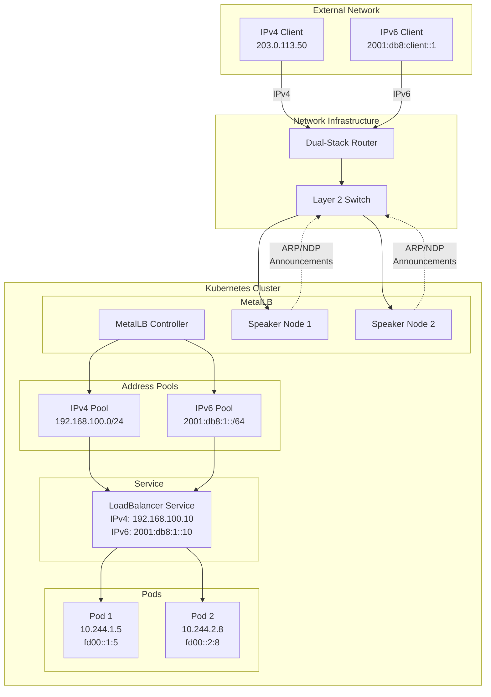
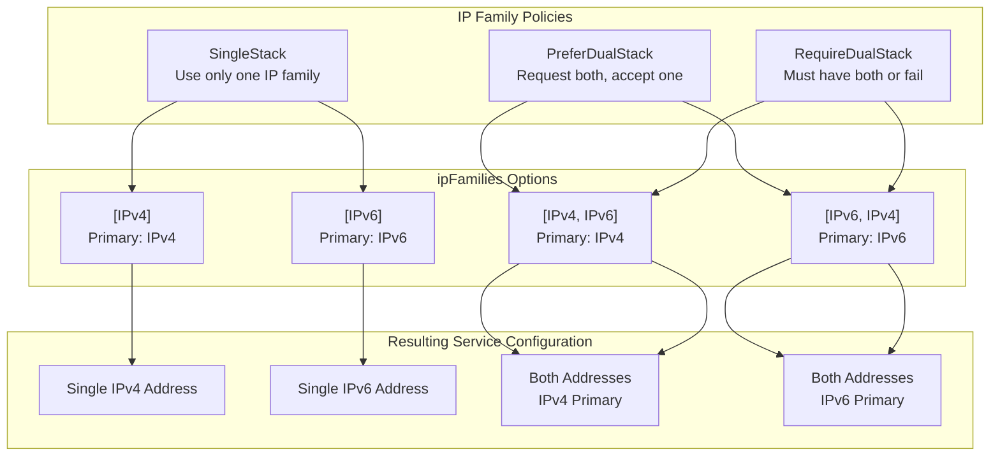
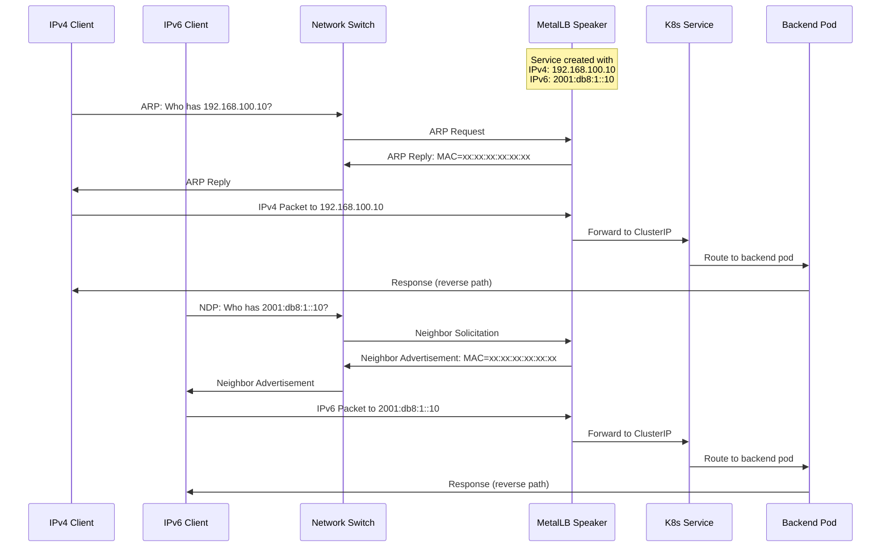
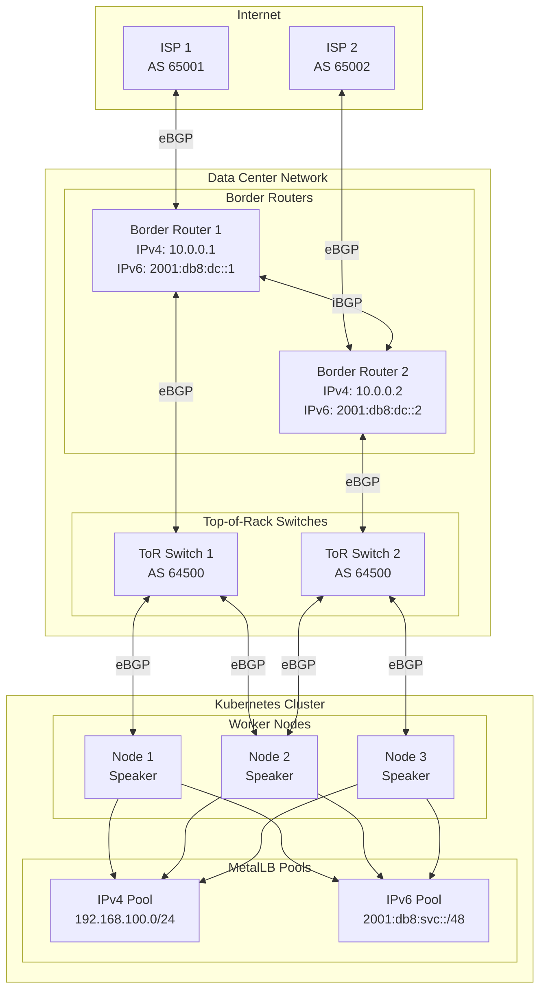
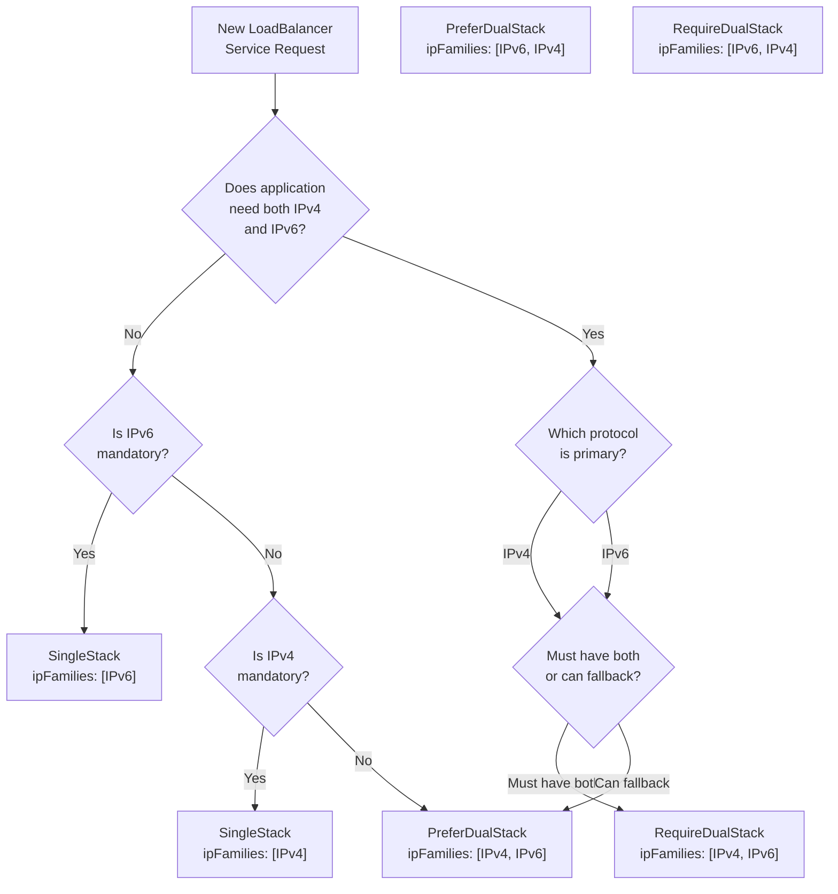

# How to Configure MetalLB for Dual-Stack IPv4/IPv6 Networks

Author: [nawazdhandala](https://github.com/nawazdhandala)

Tags: MetalLB, IPv6, Dual-Stack, Kubernetes, Networking

Description: A guide to configuring MetalLB for dual-stack IPv4 and IPv6 service exposure.

---

As organizations modernize their infrastructure, dual-stack networking has become essential for supporting both IPv4 and IPv6 connectivity. MetalLB, the popular bare-metal load balancer for Kubernetes, fully supports dual-stack configurations, allowing you to expose services with both IPv4 and IPv6 addresses simultaneously. This comprehensive guide walks you through configuring MetalLB for dual-stack networks, covering Layer 2 and BGP modes, address pool management, and best practices.

## Table of Contents

1. [Understanding Dual-Stack Networking](#understanding-dual-stack-networking)
2. [Prerequisites](#prerequisites)
3. [Dual-Stack Architecture Overview](#dual-stack-architecture-overview)
4. [Configuring IPv6 Address Pools](#configuring-ipv6-address-pools)
5. [Dual-Stack Service Configuration](#dual-stack-service-configuration)
6. [Layer 2 Mode for Dual-Stack](#layer-2-mode-for-dual-stack)
7. [BGP Mode for IPv6](#bgp-mode-for-ipv6)
8. [Advanced BGP Dual-Stack Configuration](#advanced-bgp-dual-stack-configuration)
9. [Service IP Family Policies](#service-ip-family-policies)
10. [Testing and Validation](#testing-and-validation)
11. [Troubleshooting](#troubleshooting)
12. [Best Practices](#best-practices)
13. [Conclusion](#conclusion)

## Understanding Dual-Stack Networking

Dual-stack networking allows Kubernetes clusters to operate with both IPv4 and IPv6 addresses simultaneously. This is crucial for:

- **Gradual IPv6 migration**: Organizations can transition to IPv6 while maintaining IPv4 compatibility
- **Compliance requirements**: Some regulations mandate IPv6 support
- **Future-proofing**: IPv4 address exhaustion makes IPv6 adoption inevitable
- **Global reach**: IPv6-only networks are becoming more common, especially in mobile carriers

MetalLB supports dual-stack by allowing you to configure separate address pools for IPv4 and IPv6, and services can request addresses from both pools.

## Prerequisites

Before configuring MetalLB for dual-stack, ensure your environment meets these requirements:

### Kubernetes Cluster Requirements

Your cluster must have dual-stack networking enabled. Verify with:

```bash
# Check if your cluster supports dual-stack by examining the kube-apiserver configuration
# The following flags should be present:
# --service-cluster-ip-range=10.96.0.0/16,fd00:10:96::/112
# --feature-gates=IPv6DualStack=true (for versions < 1.23)
kubectl get nodes -o jsonpath='{.items[*].status.addresses}' | jq .
```

### Network Infrastructure Requirements

Verify your network supports IPv6:

```bash
# Check IPv6 connectivity on your nodes
# This command verifies that the node has a valid IPv6 address configured
ip -6 addr show

# Test IPv6 routing
# Ensures your network can route IPv6 traffic properly
ip -6 route show
```

### MetalLB Installation

Install MetalLB version 0.13.0 or later (dual-stack support is fully mature in these versions):

```bash
# Install MetalLB using the official manifests
# Version 0.14.x and above have the best dual-stack support
kubectl apply -f https://raw.githubusercontent.com/metallb/metallb/v0.14.5/config/manifests/metallb-native.yaml

# Wait for MetalLB pods to be ready
# This ensures the controller and speakers are running before configuration
kubectl wait --namespace metallb-system \
  --for=condition=ready pod \
  --selector=app=metallb \
  --timeout=90s
```

## Dual-Stack Architecture Overview

The following diagram illustrates how MetalLB handles dual-stack networking:



This architecture shows:
- External IPv4 and IPv6 clients connecting through a dual-stack router
- MetalLB speakers announcing addresses via ARP (IPv4) and NDP (IPv6)
- A LoadBalancer service with both IPv4 and IPv6 addresses
- Backend pods with dual-stack addressing

## Configuring IPv6 Address Pools

MetalLB uses `IPAddressPool` custom resources to define available addresses. For dual-stack, you need separate pools for IPv4 and IPv6.

### Basic IPv6 Pool Configuration

Create an IPv6 address pool alongside your IPv4 pool:

```yaml
# ipaddresspools.yaml
# This configuration defines both IPv4 and IPv6 address pools for MetalLB
# Each pool contains a range of addresses that can be assigned to LoadBalancer services
apiVersion: metallb.io/v1beta1
kind: IPAddressPool
metadata:
  name: ipv4-pool
  namespace: metallb-system
spec:
  # Define the IPv4 address range available for LoadBalancer services
  # Use CIDR notation or explicit ranges (start-end)
  addresses:
  - 192.168.100.0/24
  # autoAssign controls whether this pool is used for automatic IP assignment
  # Set to true to allow MetalLB to automatically assign IPs from this pool
  autoAssign: true
---
apiVersion: metallb.io/v1beta1
kind: IPAddressPool
metadata:
  name: ipv6-pool
  namespace: metallb-system
spec:
  # Define the IPv6 address range for LoadBalancer services
  # Use a /64 or smaller subnet from your allocated IPv6 block
  addresses:
  - 2001:db8:1::/64
  # Enable automatic assignment for IPv6 addresses
  autoAssign: true
```

Apply the configuration:

```bash
# Apply the address pool configuration to your cluster
# This creates both IPv4 and IPv6 pools that MetalLB can use
kubectl apply -f ipaddresspools.yaml

# Verify the pools were created successfully
kubectl get ipaddresspools -n metallb-system
```

### Combined Dual-Stack Pool

You can also define a single pool containing both IPv4 and IPv6 ranges:

```yaml
# combined-pool.yaml
# A single pool containing both IPv4 and IPv6 addresses
# Useful when you want unified management of all addresses
apiVersion: metallb.io/v1beta1
kind: IPAddressPool
metadata:
  name: dual-stack-pool
  namespace: metallb-system
spec:
  addresses:
  # IPv4 range: 50 addresses from 192.168.100.100 to 192.168.100.150
  - 192.168.100.100-192.168.100.150
  # IPv6 range: Full /112 subnet providing 65,536 addresses
  # Using a smaller subnet than /64 to conserve IPv6 space if needed
  - 2001:db8:1::100-2001:db8:1::1ff
  autoAssign: true
```

### Segmented Pools for Different Environments

For production environments, consider segmenting pools by purpose:

```yaml
# segmented-pools.yaml
# Separate pools for different environments or service tiers
# This allows fine-grained control over IP allocation
apiVersion: metallb.io/v1beta1
kind: IPAddressPool
metadata:
  name: production-ipv4
  namespace: metallb-system
  labels:
    # Labels help identify and select pools
    environment: production
    ip-version: ipv4
spec:
  addresses:
  - 192.168.100.0/25  # First half of /24 for production
  autoAssign: false   # Require explicit pool selection
---
apiVersion: metallb.io/v1beta1
kind: IPAddressPool
metadata:
  name: production-ipv6
  namespace: metallb-system
  labels:
    environment: production
    ip-version: ipv6
spec:
  addresses:
  - 2001:db8:1::/65   # First half of /64 for production
  autoAssign: false
---
apiVersion: metallb.io/v1beta1
kind: IPAddressPool
metadata:
  name: staging-ipv4
  namespace: metallb-system
  labels:
    environment: staging
    ip-version: ipv4
spec:
  addresses:
  - 192.168.100.128/25  # Second half for staging
  autoAssign: false
---
apiVersion: metallb.io/v1beta1
kind: IPAddressPool
metadata:
  name: staging-ipv6
  namespace: metallb-system
  labels:
    environment: staging
    ip-version: ipv6
spec:
  addresses:
  - "2001:db8:1:0:8000::/65"  # Second half of /64 for staging
  autoAssign: false
```

## Dual-Stack Service Configuration

Kubernetes services can be configured to request IPv4-only, IPv6-only, or dual-stack addresses.

### Understanding IP Family Policies

Kubernetes provides two fields to control service IP allocation:

- **ipFamilies**: Specifies which IP families (IPv4, IPv6) the service should use
- **ipFamilyPolicy**: Defines the behavior for IP family assignment

The following diagram explains the relationship:



### Basic Dual-Stack Service

Create a LoadBalancer service that requests both IPv4 and IPv6 addresses:

```yaml
# dual-stack-service.yaml
# A LoadBalancer service configured for dual-stack operation
# This service will receive both IPv4 and IPv6 external addresses from MetalLB
apiVersion: v1
kind: Service
metadata:
  name: my-dual-stack-service
  namespace: default
  annotations:
    # Optional: Specify which pools to use for address allocation
    # This annotation tells MetalLB to use our dual-stack pool
    metallb.universe.tf/address-pool: dual-stack-pool
spec:
  type: LoadBalancer
  # ipFamilyPolicy determines dual-stack behavior
  # PreferDualStack: Request both IPv4 and IPv6, but accept single-stack if necessary
  ipFamilyPolicy: PreferDualStack
  # ipFamilies specifies the order of IP families
  # The first family listed becomes the "primary" and is used for .spec.clusterIP
  ipFamilies:
  - IPv4  # Primary family - used for ClusterIP
  - IPv6  # Secondary family
  selector:
    app: my-app
  ports:
  - name: http
    port: 80
    targetPort: 8080
    protocol: TCP
  - name: https
    port: 443
    targetPort: 8443
    protocol: TCP
```

### RequireDualStack Service

When dual-stack is mandatory, use RequireDualStack:

```yaml
# require-dual-stack-service.yaml
# This service REQUIRES both IPv4 and IPv6 addresses
# The service will fail to create if dual-stack addresses cannot be assigned
apiVersion: v1
kind: Service
metadata:
  name: critical-dual-stack-service
  namespace: default
  annotations:
    # Use specific pools for each IP family
    metallb.universe.tf/address-pool: production-ipv4,production-ipv6
spec:
  type: LoadBalancer
  # RequireDualStack ensures the service only succeeds with both IP families
  # Use this when your application MUST be accessible via both IPv4 and IPv6
  ipFamilyPolicy: RequireDualStack
  ipFamilies:
  - IPv4
  - IPv6
  selector:
    app: critical-app
  ports:
  - port: 443
    targetPort: 8443
```

### IPv6-Primary Dual-Stack Service

Configure a service where IPv6 is the primary address:

```yaml
# ipv6-primary-service.yaml
# Dual-stack service with IPv6 as the primary address family
# Useful when transitioning to IPv6-first architecture
apiVersion: v1
kind: Service
metadata:
  name: ipv6-primary-service
  namespace: default
spec:
  type: LoadBalancer
  ipFamilyPolicy: PreferDualStack
  # IPv6 listed first makes it the primary family
  # The ClusterIP will be an IPv6 address
  ipFamilies:
  - IPv6  # Primary - used for ClusterIP and preferred by clients
  - IPv4  # Secondary - fallback for IPv4-only clients
  selector:
    app: modern-app
  ports:
  - port: 80
    targetPort: 8080
```

### Requesting Specific IP Addresses

You can request specific IPv4 and IPv6 addresses:

```yaml
# specific-ips-service.yaml
# Request specific IP addresses from MetalLB pools
# Useful for DNS records or firewall rules that expect fixed IPs
apiVersion: v1
kind: Service
metadata:
  name: fixed-ip-service
  namespace: default
  annotations:
    # Request specific IP addresses from MetalLB
    # Both addresses must be within configured address pools
    metallb.universe.tf/loadBalancerIPs: 192.168.100.50,2001:db8:1::50
spec:
  type: LoadBalancer
  ipFamilyPolicy: RequireDualStack
  ipFamilies:
  - IPv4
  - IPv6
  selector:
    app: static-app
  ports:
  - port: 80
    targetPort: 8080
```

## Layer 2 Mode for Dual-Stack

Layer 2 mode works by responding to ARP requests for IPv4 and NDP (Neighbor Discovery Protocol) requests for IPv6.

### Layer 2 Advertisement Configuration

Configure L2 advertisements for dual-stack:

```yaml
# l2-advertisements.yaml
# Layer 2 advertisement configuration for dual-stack MetalLB
# L2 mode uses ARP for IPv4 and NDP for IPv6 to announce service addresses
apiVersion: metallb.io/v1beta1
kind: L2Advertisement
metadata:
  name: dual-stack-l2
  namespace: metallb-system
spec:
  # Specify which address pools this advertisement applies to
  # Include both IPv4 and IPv6 pools for dual-stack operation
  ipAddressPools:
  - ipv4-pool
  - ipv6-pool
  # Optional: Limit which nodes can announce addresses
  # Useful for nodes with specific network connectivity
  # nodeSelectors:
  # - matchLabels:
  #     node-role.kubernetes.io/loadbalancer: "true"
```

### Understanding L2 Dual-Stack Traffic Flow



### Interface-Specific L2 Advertisement

Configure L2 advertisements for specific network interfaces:

```yaml
# interface-specific-l2.yaml
# L2 advertisement with interface selection
# Useful when nodes have multiple network interfaces
apiVersion: metallb.io/v1beta1
kind: L2Advertisement
metadata:
  name: external-network-l2
  namespace: metallb-system
spec:
  ipAddressPools:
  - ipv4-pool
  - ipv6-pool
  # Specify network interfaces for announcements
  # MetalLB will only respond to ARP/NDP on these interfaces
  interfaces:
  - eth0      # Primary external interface
  - bond0     # Bonded interface for redundancy
```

## BGP Mode for IPv6

BGP mode provides more scalable and flexible address announcement, especially important for large-scale deployments.

### BGP Peer Configuration for Dual-Stack

Configure BGP peers with both IPv4 and IPv6 support:

```yaml
# bgp-peers.yaml
# BGP peer configuration for dual-stack MetalLB
# Separate peers are needed for IPv4 and IPv6 address families
apiVersion: metallb.io/v1beta2
kind: BGPPeer
metadata:
  name: router-ipv4
  namespace: metallb-system
spec:
  # IPv4 BGP peer configuration
  # Connect to your upstream router's IPv4 address
  myASN: 64500        # Your cluster's Autonomous System Number
  peerASN: 64501      # Router's ASN
  peerAddress: 192.168.1.1  # Router's IPv4 address
  # Optional: Specify source address for BGP connection
  # Useful when nodes have multiple IPs
  # sourceAddress: 192.168.1.10
  # Optional: Require specific router ID
  # routerID: 192.168.1.10
---
apiVersion: metallb.io/v1beta2
kind: BGPPeer
metadata:
  name: router-ipv6
  namespace: metallb-system
spec:
  # IPv6 BGP peer configuration
  # Separate peer entry for IPv6 BGP sessions
  myASN: 64500
  peerASN: 64501
  peerAddress: "2001:db8::1"  # Router's IPv6 address
  # For IPv6 BGP, you may need to specify the source address
  # to ensure proper connection establishment
  # sourceAddress: "2001:db8::10"
```

### BGP Advertisement Configuration

Create BGP advertisements for dual-stack:

```yaml
# bgp-advertisements.yaml
# BGP advertisement configuration for dual-stack
# Controls how addresses are announced to BGP peers
apiVersion: metallb.io/v1beta1
kind: BGPAdvertisement
metadata:
  name: dual-stack-bgp-advertisement
  namespace: metallb-system
spec:
  # Specify which address pools to advertise
  ipAddressPools:
  - ipv4-pool
  - ipv6-pool
  # Peers to advertise to (references BGPPeer resources)
  peers:
  - router-ipv4
  - router-ipv6
  # Optional: Aggregate routes into larger prefixes
  # Reduces the number of routes advertised to peers
  aggregationLength: 32    # For IPv4: advertise /32 routes
  aggregationLengthV6: 128 # For IPv6: advertise /128 routes
  # Optional: Add BGP communities to advertised routes
  # Communities can be used for traffic engineering
  communities:
  - 64500:100  # Custom community for identification
```

### IPv6-Specific BGP Configuration

Configure advanced BGP settings for IPv6:

```yaml
# ipv6-bgp-advanced.yaml
# Advanced IPv6 BGP configuration with additional options
apiVersion: metallb.io/v1beta2
kind: BGPPeer
metadata:
  name: router-ipv6-advanced
  namespace: metallb-system
spec:
  myASN: 64500
  peerASN: 64501
  peerAddress: "2001:db8::1"
  # Hold time in seconds - how long to wait before declaring peer dead
  # Shorter values mean faster failover but more sensitivity to network issues
  holdTime: 90s
  # Keepalive time - how often to send keepalive messages
  # Should be approximately 1/3 of hold time
  keepaliveTime: 30s
  # Enable BFD (Bidirectional Forwarding Detection) for faster failover
  # BFD can detect link failures in milliseconds rather than seconds
  bfdProfile: fast-detection
  # Node selectors - only nodes matching these labels will peer
  nodeSelectors:
  - matchLabels:
      bgp-capable: "true"
  # Password for BGP session authentication (MD5)
  # Reference to a secret containing the password
  password: bgp-auth-secret
---
# BFD Profile for fast failover detection
apiVersion: metallb.io/v1beta1
kind: BFDProfile
metadata:
  name: fast-detection
  namespace: metallb-system
spec:
  # Minimum interval between BFD packets (milliseconds)
  receiveInterval: 300
  transmitInterval: 300
  # Number of missed packets before declaring session down
  detectMultiplier: 3
  # Echo mode for even faster detection (requires hardware support)
  echoMode: false
  # Passive mode - wait for peer to initiate
  passiveMode: false
  # Minimum echo interval
  minimumTtl: 254
```

## Advanced BGP Dual-Stack Configuration

For enterprise environments, you may need more sophisticated BGP configurations.

### BGP Architecture for Dual-Stack



### Multi-Peer BGP Configuration

Configure multiple BGP peers for redundancy:

```yaml
# multi-peer-bgp.yaml
# Production-grade multi-peer BGP configuration
# Provides redundancy through multiple ToR switches
apiVersion: metallb.io/v1beta2
kind: BGPPeer
metadata:
  name: tor1-ipv4
  namespace: metallb-system
spec:
  myASN: 64500
  peerASN: 64510
  peerAddress: 10.0.1.1
  # eBGP multihop allows BGP peering across multiple network hops
  # Set to 2 or higher if the peer is not directly connected
  ebgpMultiHop: true
  # Source address ensures consistent BGP session establishment
  sourceAddress: 10.0.1.10
---
apiVersion: metallb.io/v1beta2
kind: BGPPeer
metadata:
  name: tor1-ipv6
  namespace: metallb-system
spec:
  myASN: 64500
  peerASN: 64510
  peerAddress: "2001:db8:tor1::1"
  ebgpMultiHop: true
  sourceAddress: "2001:db8:tor1::10"
---
apiVersion: metallb.io/v1beta2
kind: BGPPeer
metadata:
  name: tor2-ipv4
  namespace: metallb-system
spec:
  myASN: 64500
  peerASN: 64520
  peerAddress: 10.0.2.1
  ebgpMultiHop: true
  sourceAddress: 10.0.2.10
---
apiVersion: metallb.io/v1beta2
kind: BGPPeer
metadata:
  name: tor2-ipv6
  namespace: metallb-system
spec:
  myASN: 64500
  peerASN: 64520
  peerAddress: "2001:db8:tor2::1"
  ebgpMultiHop: true
  sourceAddress: "2001:db8:tor2::10"
```

### BGP Communities for Traffic Engineering

Use BGP communities to influence routing decisions:

```yaml
# bgp-communities.yaml
# Define BGP communities for traffic engineering
# Communities allow routers to make routing decisions based on metadata
apiVersion: metallb.io/v1beta1
kind: Community
metadata:
  name: traffic-engineering
  namespace: metallb-system
spec:
  communities:
  # Standard community format: ASN:value
  # Use these to signal routing preferences to upstream routers
  - name: primary-path
    value: "64500:100"
  - name: backup-path
    value: "64500:200"
  - name: no-export
    # Well-known community that prevents route export to eBGP peers
    value: "65535:65281"
  - name: local-preference-high
    # Custom community that upstream routers can use to set local preference
    value: "64500:1000"
---
# BGP advertisement using communities
apiVersion: metallb.io/v1beta1
kind: BGPAdvertisement
metadata:
  name: primary-advertisement
  namespace: metallb-system
spec:
  ipAddressPools:
  - production-ipv4
  - production-ipv6
  peers:
  - tor1-ipv4
  - tor1-ipv6
  # Apply communities to advertised routes
  # These communities tell upstream routers this is the primary path
  communities:
  - primary-path
  - local-preference-high
  # Local preference affects route selection within your AS
  # Higher values are preferred
  localPref: 200
---
apiVersion: metallb.io/v1beta1
kind: BGPAdvertisement
metadata:
  name: backup-advertisement
  namespace: metallb-system
spec:
  ipAddressPools:
  - production-ipv4
  - production-ipv6
  peers:
  - tor2-ipv4
  - tor2-ipv6
  communities:
  - backup-path
  # Lower local preference makes this the backup path
  localPref: 100
```

### Route Aggregation for IPv6

Aggregate IPv6 routes to reduce routing table size:

```yaml
# ipv6-aggregation.yaml
# IPv6 route aggregation configuration
# Reduces the number of routes announced to BGP peers
apiVersion: metallb.io/v1beta1
kind: BGPAdvertisement
metadata:
  name: aggregated-ipv6
  namespace: metallb-system
spec:
  ipAddressPools:
  - ipv6-pool
  peers:
  - tor1-ipv6
  - tor2-ipv6
  # Aggregate IPv6 service addresses into larger prefixes
  # aggregationLengthV6: 64 would advertise /64 routes
  # This aggregates all addresses in the pool into a single announcement
  aggregationLengthV6: 64
---
# For more granular control, create separate advertisements
apiVersion: metallb.io/v1beta1
kind: BGPAdvertisement
metadata:
  name: specific-ipv6
  namespace: metallb-system
spec:
  ipAddressPools:
  - critical-ipv6-pool
  peers:
  - tor1-ipv6
  - tor2-ipv6
  # Advertise specific /128 routes for critical services
  # Ensures precise routing for important workloads
  aggregationLengthV6: 128
```

## Service IP Family Policies

Understanding and correctly using IP family policies is crucial for dual-stack success.

### Complete Policy Reference

```yaml
# policy-examples.yaml
# Comprehensive examples of all IP family policy options
---
# SingleStack with IPv4 only
# Use when service only needs IPv4 connectivity
apiVersion: v1
kind: Service
metadata:
  name: ipv4-only-service
spec:
  type: LoadBalancer
  ipFamilyPolicy: SingleStack
  ipFamilies:
  - IPv4
  selector:
    app: legacy-app
  ports:
  - port: 80
---
# SingleStack with IPv6 only
# Use for IPv6-native applications or testing
apiVersion: v1
kind: Service
metadata:
  name: ipv6-only-service
spec:
  type: LoadBalancer
  ipFamilyPolicy: SingleStack
  ipFamilies:
  - IPv6
  selector:
    app: ipv6-native-app
  ports:
  - port: 80
---
# PreferDualStack with IPv4 primary
# Requests dual-stack but accepts single-stack if necessary
# Best for gradual IPv6 adoption
apiVersion: v1
kind: Service
metadata:
  name: prefer-dual-ipv4-primary
spec:
  type: LoadBalancer
  ipFamilyPolicy: PreferDualStack
  ipFamilies:
  - IPv4  # Primary family
  - IPv6  # Secondary family
  selector:
    app: transitioning-app
  ports:
  - port: 80
---
# PreferDualStack with IPv6 primary
# IPv6-first approach while maintaining IPv4 compatibility
apiVersion: v1
kind: Service
metadata:
  name: prefer-dual-ipv6-primary
spec:
  type: LoadBalancer
  ipFamilyPolicy: PreferDualStack
  ipFamilies:
  - IPv6  # Primary family
  - IPv4  # Secondary family
  selector:
    app: modern-app
  ports:
  - port: 80
---
# RequireDualStack
# Service fails if both families cannot be assigned
# Use for applications that must be accessible via both protocols
apiVersion: v1
kind: Service
metadata:
  name: require-dual-stack
spec:
  type: LoadBalancer
  ipFamilyPolicy: RequireDualStack
  ipFamilies:
  - IPv4
  - IPv6
  selector:
    app: dual-stack-required-app
  ports:
  - port: 80
```

### Policy Decision Flowchart



## Testing and Validation

After configuring MetalLB for dual-stack, thorough testing is essential.

### Verification Commands

```bash
# Verify MetalLB pods are running
# All speakers and the controller should be in Running state
kubectl get pods -n metallb-system

# Check address pool status
# Verify both IPv4 and IPv6 pools exist and have available addresses
kubectl get ipaddresspools -n metallb-system -o yaml

# List all BGP peers and their status
# Established state indicates successful peering
kubectl get bgppeers -n metallb-system

# Check L2 advertisements
kubectl get l2advertisements -n metallb-system

# Check BGP advertisements
kubectl get bgpadvertisements -n metallb-system
```

### Testing Dual-Stack Services

Create a test deployment and service:

```yaml
# test-deployment.yaml
# Test application for validating dual-stack configuration
apiVersion: apps/v1
kind: Deployment
metadata:
  name: dual-stack-test
  namespace: default
spec:
  replicas: 2
  selector:
    matchLabels:
      app: dual-stack-test
  template:
    metadata:
      labels:
        app: dual-stack-test
    spec:
      containers:
      - name: nginx
        image: nginx:alpine
        ports:
        - containerPort: 80
        # Add a simple health check
        readinessProbe:
          httpGet:
            path: /
            port: 80
          initialDelaySeconds: 5
          periodSeconds: 5
---
apiVersion: v1
kind: Service
metadata:
  name: dual-stack-test-svc
  namespace: default
spec:
  type: LoadBalancer
  ipFamilyPolicy: RequireDualStack
  ipFamilies:
  - IPv4
  - IPv6
  selector:
    app: dual-stack-test
  ports:
  - port: 80
    targetPort: 80
```

### Validation Script

```bash
#!/bin/bash
# dual-stack-validation.sh
# Comprehensive validation script for MetalLB dual-stack configuration

set -e

echo "=== MetalLB Dual-Stack Validation ==="
echo ""

# Check service external IPs
echo "1. Checking service external IPs..."
kubectl get svc dual-stack-test-svc -o jsonpath='{.status.loadBalancer.ingress[*].ip}' | tr ' ' '\n'
echo ""

# Get both IP addresses
IPV4=$(kubectl get svc dual-stack-test-svc -o jsonpath='{.status.loadBalancer.ingress[0].ip}')
IPV6=$(kubectl get svc dual-stack-test-svc -o jsonpath='{.status.loadBalancer.ingress[1].ip}')

echo "IPv4 Address: $IPV4"
echo "IPv6 Address: $IPV6"
echo ""

# Test IPv4 connectivity
echo "2. Testing IPv4 connectivity..."
if curl -4 -s -o /dev/null -w "%{http_code}" "http://$IPV4/" | grep -q "200"; then
    echo "   IPv4: SUCCESS"
else
    echo "   IPv4: FAILED"
fi

# Test IPv6 connectivity (note the brackets for IPv6 in URLs)
echo "3. Testing IPv6 connectivity..."
if curl -6 -s -o /dev/null -w "%{http_code}" "http://[$IPV6]/" | grep -q "200"; then
    echo "   IPv6: SUCCESS"
else
    echo "   IPv6: FAILED"
fi

# Check speaker logs for any issues
echo ""
echo "4. Checking MetalLB speaker logs for errors..."
kubectl logs -n metallb-system -l component=speaker --tail=20 | grep -i error || echo "   No errors found"

# Verify BGP sessions (if using BGP mode)
echo ""
echo "5. Checking BGP peer status..."
kubectl get bgppeers -n metallb-system -o custom-columns=NAME:.metadata.name,PEER:.spec.peerAddress,ASN:.spec.peerASN

echo ""
echo "=== Validation Complete ==="
```

### Testing with Different Clients

```bash
# Test from an IPv4-only client
# This should connect via the IPv4 address
curl -4 http://192.168.100.10/

# Test from an IPv6-only client
# This should connect via the IPv6 address
curl -6 http://[2001:db8:1::10]/

# Test DNS resolution (requires proper DNS setup)
# A records should return IPv4, AAAA records should return IPv6
dig myservice.example.com A
dig myservice.example.com AAAA

# Test with wget specifying IP version
wget -4 http://myservice.example.com/
wget -6 http://myservice.example.com/
```

## Troubleshooting

Common issues and their solutions when configuring dual-stack MetalLB.

### Issue: IPv6 Address Not Assigned

```bash
# Check if IPv6 pool has available addresses
kubectl get ipaddresspool ipv6-pool -n metallb-system -o yaml

# Verify service configuration
kubectl get svc <service-name> -o yaml | grep -A5 ipFamil

# Check MetalLB controller logs for allocation issues
kubectl logs -n metallb-system -l component=controller | grep -i ipv6

# Ensure the cluster supports dual-stack
kubectl get nodes -o jsonpath='{.items[0].status.addresses}' | jq .
```

### Issue: BGP Session Not Establishing for IPv6

```bash
# Check BGP peer status
kubectl get bgppeers -n metallb-system -o yaml

# Verify speaker can reach the peer
kubectl exec -n metallb-system <speaker-pod> -- ping6 -c 3 2001:db8::1

# Check for firewall rules blocking BGP (TCP port 179)
kubectl exec -n metallb-system <speaker-pod> -- nc -zv6 2001:db8::1 179

# Review speaker logs for BGP errors
kubectl logs -n metallb-system <speaker-pod> | grep -i bgp
```

### Issue: NDP Not Working in L2 Mode

```bash
# Verify the speaker is responding to neighbor solicitations
# Run tcpdump on the node to see NDP traffic
tcpdump -i eth0 icmp6 and 'ip6[40] == 135 or ip6[40] == 136'

# Check if the node has IPv6 forwarding enabled
sysctl net.ipv6.conf.all.forwarding

# Verify the service IPv6 address is in the correct subnet
kubectl get svc <service-name> -o jsonpath='{.status.loadBalancer.ingress}'

# Check speaker logs for L2 advertisement issues
kubectl logs -n metallb-system -l component=speaker | grep -i neighbor
```

### Issue: Traffic Only Works for One IP Family

```bash
# Verify both addresses are properly announced
# For L2 mode, check ARP and NDP tables on your router
arp -a | grep <ipv4-address>
ip -6 neigh show | grep <ipv6-address>

# For BGP mode, check routing tables on your router
# Routes for both address families should be present
show ip route bgp
show ipv6 route bgp

# Ensure pod has dual-stack networking
kubectl exec <pod-name> -- ip addr show

# Check kube-proxy is configured for dual-stack
kubectl get configmap kube-proxy -n kube-system -o yaml | grep -i ipfamily
```

### Diagnostic Commands Summary

```bash
# Comprehensive diagnostic script
echo "=== MetalLB Dual-Stack Diagnostics ==="

echo "--- Pods Status ---"
kubectl get pods -n metallb-system -o wide

echo "--- Address Pools ---"
kubectl get ipaddresspools -n metallb-system

echo "--- BGP Peers ---"
kubectl get bgppeers -n metallb-system

echo "--- L2 Advertisements ---"
kubectl get l2advertisements -n metallb-system

echo "--- BGP Advertisements ---"
kubectl get bgpadvertisements -n metallb-system

echo "--- LoadBalancer Services ---"
kubectl get svc --all-namespaces -o wide | grep LoadBalancer

echo "--- Recent Controller Events ---"
kubectl logs -n metallb-system -l component=controller --tail=50

echo "--- Recent Speaker Events ---"
kubectl logs -n metallb-system -l component=speaker --tail=50
```

## Best Practices

Follow these best practices for a robust dual-stack MetalLB deployment.

### Address Pool Management

```yaml
# best-practices-pools.yaml
# Production-ready address pool configuration
apiVersion: metallb.io/v1beta1
kind: IPAddressPool
metadata:
  name: production-pool
  namespace: metallb-system
  labels:
    environment: production
spec:
  addresses:
  # Use separate, well-documented ranges
  # Document the purpose and allocation in comments or annotations
  - 192.168.100.0/25    # Production IPv4: 126 usable addresses
  - 2001:db8:prod::/64  # Production IPv6: Large pool for growth
  # Disable auto-assign for production to require explicit pool selection
  autoAssign: false
  # Avoid automatically assigning these addresses
  # Useful to reserve addresses for specific purposes
  avoidBuggyIPs: true
```

### High Availability Considerations

```yaml
# ha-configuration.yaml
# High availability BGP configuration with redundancy
apiVersion: metallb.io/v1beta2
kind: BGPPeer
metadata:
  name: primary-router-ipv4
  namespace: metallb-system
spec:
  myASN: 64500
  peerASN: 64510
  peerAddress: 10.0.1.1
  # Enable BFD for fast failure detection
  bfdProfile: production-bfd
  # Set higher priority for this peer
  # Note: This is handled through local preference in advertisements
---
apiVersion: metallb.io/v1beta2
kind: BGPPeer
metadata:
  name: backup-router-ipv4
  namespace: metallb-system
spec:
  myASN: 64500
  peerASN: 64520
  peerAddress: 10.0.2.1
  bfdProfile: production-bfd
---
# Repeat for IPv6 peers
apiVersion: metallb.io/v1beta2
kind: BGPPeer
metadata:
  name: primary-router-ipv6
  namespace: metallb-system
spec:
  myASN: 64500
  peerASN: 64510
  peerAddress: "2001:db8:1::1"
  bfdProfile: production-bfd
---
apiVersion: metallb.io/v1beta2
kind: BGPPeer
metadata:
  name: backup-router-ipv6
  namespace: metallb-system
spec:
  myASN: 64500
  peerASN: 64520
  peerAddress: "2001:db8:2::1"
  bfdProfile: production-bfd
---
apiVersion: metallb.io/v1beta1
kind: BFDProfile
metadata:
  name: production-bfd
  namespace: metallb-system
spec:
  # 300ms detection time (100ms * 3)
  receiveInterval: 100
  transmitInterval: 100
  detectMultiplier: 3
  echoMode: false
  passiveMode: false
```

### Monitoring and Alerting

```yaml
# monitoring.yaml
# ServiceMonitor for Prometheus integration
apiVersion: monitoring.coreos.com/v1
kind: ServiceMonitor
metadata:
  name: metallb
  namespace: metallb-system
  labels:
    app: metallb
spec:
  selector:
    matchLabels:
      app.kubernetes.io/name: metallb
  endpoints:
  - port: monitoring
    interval: 30s
---
# PrometheusRule for alerting on dual-stack issues
apiVersion: monitoring.coreos.com/v1
kind: PrometheusRule
metadata:
  name: metallb-dual-stack-alerts
  namespace: metallb-system
spec:
  groups:
  - name: metallb-dual-stack
    rules:
    # Alert if BGP session is down
    - alert: MetalLBBGPSessionDown
      expr: metallb_bgp_session_up == 0
      for: 5m
      labels:
        severity: critical
      annotations:
        summary: "MetalLB BGP session is down"
        description: "BGP session {{ $labels.peer }} has been down for more than 5 minutes"

    # Alert if IPv6 pool is exhausted
    - alert: MetalLBIPv6PoolExhausted
      expr: metallb_allocator_addresses_in_use_total{pool=~".*ipv6.*"} >= metallb_allocator_addresses_total{pool=~".*ipv6.*"}
      for: 1m
      labels:
        severity: warning
      annotations:
        summary: "MetalLB IPv6 address pool exhausted"
        description: "IPv6 address pool {{ $labels.pool }} has no available addresses"

    # Alert if IPv4 pool is exhausted
    - alert: MetalLBIPv4PoolExhausted
      expr: metallb_allocator_addresses_in_use_total{pool=~".*ipv4.*"} >= metallb_allocator_addresses_total{pool=~".*ipv4.*"}
      for: 1m
      labels:
        severity: warning
      annotations:
        summary: "MetalLB IPv4 address pool exhausted"
        description: "IPv4 address pool {{ $labels.pool }} has no available addresses"
```

### Security Best Practices

```yaml
# security-best-practices.yaml
# Secure BGP configuration with authentication
apiVersion: v1
kind: Secret
metadata:
  name: bgp-auth-secret
  namespace: metallb-system
type: Opaque
data:
  # Base64 encoded BGP MD5 password
  # Generate with: echo -n 'your-secure-password' | base64
  password: eW91ci1zZWN1cmUtcGFzc3dvcmQ=
---
apiVersion: metallb.io/v1beta2
kind: BGPPeer
metadata:
  name: secure-peer
  namespace: metallb-system
spec:
  myASN: 64500
  peerASN: 64510
  peerAddress: 10.0.1.1
  # Reference the secret for BGP MD5 authentication
  # This prevents BGP session hijacking
  passwordSecret:
    name: bgp-auth-secret
    key: password
---
# Network policy to restrict MetalLB speaker traffic
apiVersion: networking.k8s.io/v1
kind: NetworkPolicy
metadata:
  name: metallb-speaker-policy
  namespace: metallb-system
spec:
  podSelector:
    matchLabels:
      component: speaker
  policyTypes:
  - Ingress
  - Egress
  ingress:
  # Allow BGP from routers
  - from:
    - ipBlock:
        cidr: 10.0.0.0/8
    - ipBlock:
        cidr: 2001:db8::/32
    ports:
    - protocol: TCP
      port: 179
  egress:
  # Allow BGP to routers
  - to:
    - ipBlock:
        cidr: 10.0.0.0/8
    - ipBlock:
        cidr: 2001:db8::/32
    ports:
    - protocol: TCP
      port: 179
  # Allow DNS
  - to:
    ports:
    - protocol: UDP
      port: 53
```

## Conclusion

Configuring MetalLB for dual-stack IPv4/IPv6 networks enables your Kubernetes services to be accessible via both IP families, supporting the transition to IPv6 while maintaining IPv4 compatibility. Key takeaways from this guide:

1. **Plan your address pools carefully**: Allocate sufficient IPv4 and IPv6 addresses, and consider segmenting pools by environment or purpose.

2. **Choose the right IP family policy**: Use `PreferDualStack` for flexible deployments and `RequireDualStack` when both protocols are mandatory.

3. **Configure both L2 and BGP appropriately**: L2 mode uses ARP for IPv4 and NDP for IPv6, while BGP requires separate peer configurations for each address family.

4. **Implement proper monitoring**: Track both IPv4 and IPv6 pool utilization and BGP session health to prevent outages.

5. **Follow security best practices**: Use BGP MD5 authentication and network policies to secure your MetalLB deployment.

6. **Test thoroughly**: Validate connectivity from both IPv4 and IPv6 clients before deploying to production.

With dual-stack MetalLB, your bare-metal Kubernetes clusters are ready for the IPv6 future while remaining fully compatible with IPv4 networks. This flexibility ensures your infrastructure can serve all clients, regardless of their network configuration.

## Further Reading

- [MetalLB Official Documentation](https://metallb.universe.tf/)
- [Kubernetes Dual-Stack Documentation](https://kubernetes.io/docs/concepts/services-networking/dual-stack/)
- [RFC 8200 - IPv6 Specification](https://tools.ietf.org/html/rfc8200)
- [BGP for IPv6 (RFC 2545)](https://tools.ietf.org/html/rfc2545)
