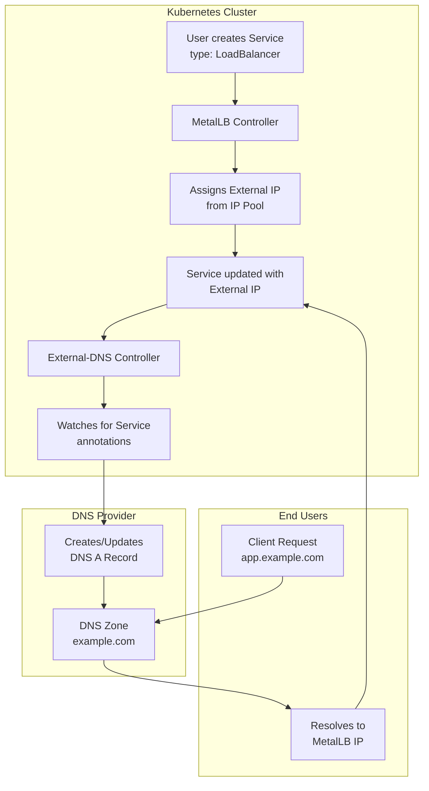
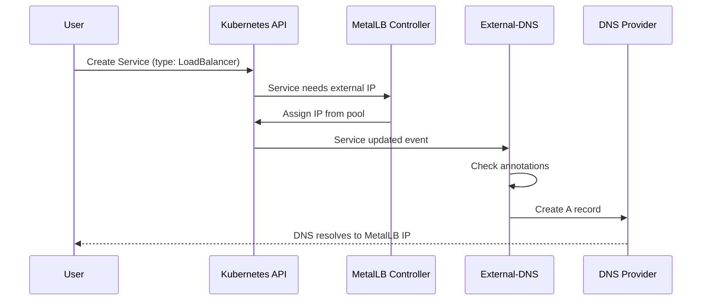
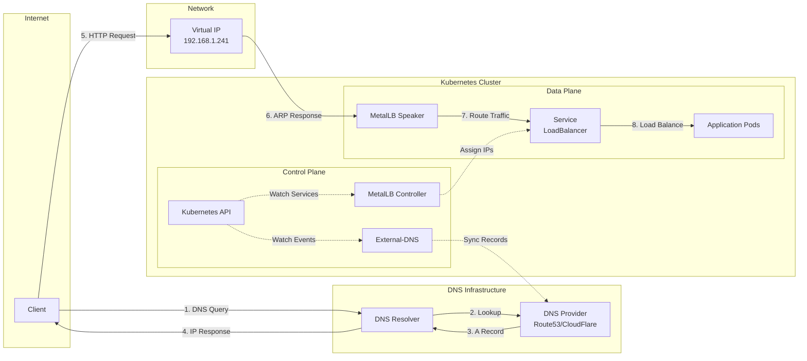

# How to Integrate MetalLB with External-DNS

Author: [nawazdhandala](https://github.com/nawazdhandala)

Tags: MetalLB, External-DNS, DNS, Kubernetes, Automation

Description: A guide to automatically managing DNS records for MetalLB load balancers with External-DNS.

---

## Introduction

Managing DNS records manually for Kubernetes services can be tedious and error-prone, especially in dynamic environments where services are frequently created, updated, or deleted. External-DNS bridges this gap by automatically synchronizing Kubernetes resources with DNS providers. When combined with MetalLB, which provides load balancer IP addresses in bare-metal environments, you get a powerful solution for automatic DNS management.

This guide walks you through integrating MetalLB with External-DNS to automatically create and manage DNS records for your services.

## Understanding the Architecture

Before diving into the implementation, let's understand how MetalLB and External-DNS work together.

The following diagram illustrates the DNS flow when a service is created:



The workflow is as follows:



## Prerequisites

Before starting, ensure you have:

- A running Kubernetes cluster (v1.21+)
- MetalLB installed and configured with an IP address pool
- kubectl configured to access your cluster
- Access to a DNS provider (AWS Route53, CloudFlare, Google Cloud DNS, etc.)
- Helm v3 installed (optional, but recommended)

## Step 1: Verify MetalLB Installation

First, let's verify that MetalLB is properly installed and configured with an IP pool.

This command checks if MetalLB pods are running in the metallb-system namespace:

```bash
# Check MetalLB pods are running
kubectl get pods -n metallb-system
```

Expected output:

```
NAME                          READY   STATUS    RESTARTS   AGE
controller-64f8f5b5f4-xxxxx   1/1     Running   0          1d
speaker-xxxxx                 1/1     Running   0          1d
speaker-yyyyy                 1/1     Running   0          1d
```

Verify that an IP address pool is configured. This is essential for MetalLB to assign IPs to LoadBalancer services:

```bash
# Verify IP address pool configuration
kubectl get ipaddresspools -n metallb-system
```

## Step 2: Deploy External-DNS

External-DNS can be deployed using Helm or plain Kubernetes manifests. We'll cover both methods.

### Method 1: Using Helm (Recommended)

Helm simplifies the deployment and makes it easier to manage configuration. First, add the External-DNS Helm repository:

```bash
# Add the External-DNS Helm repository
helm repo add external-dns https://kubernetes-sigs.github.io/external-dns/

# Update your local Helm chart repository cache
helm repo update
```

### Method 2: Using Kubernetes Manifests

If you prefer not to use Helm, you can deploy External-DNS using raw Kubernetes manifests. We'll show this in the provider-specific sections below.

## Step 3: Configure External-DNS for Your DNS Provider

External-DNS supports many DNS providers. Below are configurations for the most common ones.

### AWS Route53 Configuration

For AWS Route53, External-DNS needs IAM permissions to manage DNS records.

#### Create IAM Policy

This IAM policy grants the minimum permissions required for External-DNS to manage Route53 records. It allows listing hosted zones and modifying record sets:

```json
{
    "Version": "2012-10-17",
    "Statement": [
        {
            "Effect": "Allow",
            "Action": [
                "route53:ChangeResourceRecordSets"
            ],
            "Resource": [
                "arn:aws:route53:::hostedzone/*"
            ]
        },
        {
            "Effect": "Allow",
            "Action": [
                "route53:ListHostedZones",
                "route53:ListResourceRecordSets",
                "route53:ListTagsForResource"
            ],
            "Resource": [
                "*"
            ]
        }
    ]
}
```

#### Deploy External-DNS for Route53

This Helm values file configures External-DNS for AWS Route53. Key settings include the provider type, domain filter to restrict which zones can be modified, and the policy for managing records:

```yaml
# values-route53.yaml
# External-DNS configuration for AWS Route53

# Set the DNS provider to AWS Route53
provider:
  name: aws

# Restrict External-DNS to only manage records in specified domains
# This prevents accidental modifications to other hosted zones
domainFilters:
  - example.com

# Policy determines how External-DNS handles DNS records
# "upsert-only" creates and updates records but never deletes them
# Use "sync" if you want External-DNS to also delete orphaned records
policy: upsert-only

# Sources tell External-DNS which Kubernetes resources to watch
# "service" watches LoadBalancer and NodePort services
# "ingress" watches Ingress resources for hostname annotations
sources:
  - service
  - ingress

# Registry configuration prevents multiple External-DNS instances
# from conflicting with each other using TXT record ownership
registry: txt
txtOwnerId: "external-dns"

# AWS-specific configuration
env:
  # The AWS region where your Route53 hosted zone exists
  - name: AWS_DEFAULT_REGION
    value: "us-east-1"

# If using IAM Roles for Service Accounts (IRSA), specify the role ARN
serviceAccount:
  annotations:
    eks.amazonaws.com/role-arn: arn:aws:iam::ACCOUNT_ID:role/external-dns
```

Install External-DNS using Helm with the Route53 configuration:

```bash
# Create a dedicated namespace for External-DNS
kubectl create namespace external-dns

# Install External-DNS with Route53 configuration
# The -f flag specifies the values file we created above
helm install external-dns external-dns/external-dns \
  -n external-dns \
  -f values-route53.yaml
```

### CloudFlare Configuration

CloudFlare is a popular choice due to its generous free tier and excellent API.

#### Create CloudFlare API Token

First, create a CloudFlare API token with the following permissions:
- Zone:Read (to list zones)
- DNS:Edit (to manage records)

#### Deploy External-DNS for CloudFlare

This configuration sets up External-DNS for CloudFlare. The API token is stored in a Kubernetes secret for security:

```yaml
# values-cloudflare.yaml
# External-DNS configuration for CloudFlare

# Set the DNS provider to CloudFlare
provider:
  name: cloudflare

# Restrict to specific domains to prevent managing unwanted zones
domainFilters:
  - example.com

# Sync policy will create, update, and delete records
# to match the current state of Kubernetes resources
policy: sync

# Watch both Services and Ingress resources
sources:
  - service
  - ingress

# TXT record registry for ownership tracking
registry: txt
txtOwnerId: "k8s-external-dns"

# CloudFlare-specific environment variables
env:
  # Enable proxy by default (CloudFlare's CDN/DDoS protection)
  # Set to "false" if you want DNS-only mode
  - name: CF_API_TOKEN
    valueFrom:
      secretKeyRef:
        name: cloudflare-api-token
        key: api-token
```

Create the CloudFlare API token secret before installing External-DNS:

```bash
# Create secret for CloudFlare API token
# Replace YOUR_API_TOKEN with your actual CloudFlare API token
kubectl create secret generic cloudflare-api-token \
  -n external-dns \
  --from-literal=api-token=YOUR_API_TOKEN

# Install External-DNS with CloudFlare configuration
helm install external-dns external-dns/external-dns \
  -n external-dns \
  -f values-cloudflare.yaml
```

### Google Cloud DNS Configuration

For GKE clusters or those using Google Cloud DNS.

This configuration uses Workload Identity for GKE, which is the recommended way to authenticate with Google Cloud services:

```yaml
# values-google.yaml
# External-DNS configuration for Google Cloud DNS

# Set the DNS provider to Google Cloud DNS
provider:
  name: google

# Your Google Cloud project ID where the DNS zone exists
extraArgs:
  - --google-project=my-gcp-project
  # Batch changes for better performance
  - --google-batch-change-size=1000
  # Interval between batches in case of rate limiting
  - --google-batch-change-interval=1s

# Filter to specific domains
domainFilters:
  - example.com

# Use sync policy for bidirectional synchronization
policy: sync

sources:
  - service
  - ingress

# Ownership tracking using TXT records
registry: txt
txtOwnerId: "external-dns"

# For GKE with Workload Identity
serviceAccount:
  annotations:
    iam.gke.io/gcp-service-account: external-dns@my-gcp-project.iam.gserviceaccount.com
```

Deploy External-DNS for Google Cloud DNS:

```bash
# Install External-DNS with Google Cloud DNS configuration
helm install external-dns external-dns/external-dns \
  -n external-dns \
  -f values-google.yaml
```

### Azure DNS Configuration

For AKS clusters or those using Azure DNS.

This configuration uses Azure AD Workload Identity for authentication, which is the modern approach replacing pod identity:

```yaml
# values-azure.yaml
# External-DNS configuration for Azure DNS

# Set the DNS provider to Azure
provider:
  name: azure

# Restrict to specific domains
domainFilters:
  - example.com

policy: sync

sources:
  - service
  - ingress

registry: txt
txtOwnerId: "external-dns"

# Azure-specific configuration
extraArgs:
  # Resource group containing the DNS zone
  - --azure-resource-group=my-dns-resource-group
  # Subscription ID where the DNS zone exists
  - --azure-subscription-id=xxxxxxxx-xxxx-xxxx-xxxx-xxxxxxxxxxxx

# Mount Azure credentials
extraVolumes:
  - name: azure-config
    secret:
      secretName: azure-dns-config

extraVolumeMounts:
  - name: azure-config
    mountPath: /etc/kubernetes
    readOnly: true

env:
  - name: AZURE_AUTH_LOCATION
    value: /etc/kubernetes/azure.json
```

Create the Azure configuration secret:

```bash
# Create azure.json with your credentials
# This file contains Azure service principal credentials
cat <<EOF > azure.json
{
  "tenantId": "your-tenant-id",
  "subscriptionId": "your-subscription-id",
  "resourceGroup": "your-dns-resource-group",
  "aadClientId": "your-client-id",
  "aadClientSecret": "your-client-secret"
}
EOF

# Create the secret from the azure.json file
kubectl create secret generic azure-dns-config \
  -n external-dns \
  --from-file=azure.json

# Clean up the local file for security
rm azure.json

# Install External-DNS with Azure DNS configuration
helm install external-dns external-dns/external-dns \
  -n external-dns \
  -f values-azure.yaml
```

## Step 4: Configure Annotations for DNS Records

External-DNS uses annotations to determine which DNS records to create. Here are the key annotations you'll use.

### Basic Service Annotation

The most basic annotation specifies the hostname for the DNS record. When External-DNS sees this annotation, it creates an A record pointing to the service's external IP:

```yaml
# service-basic.yaml
# A simple LoadBalancer service with External-DNS annotation
apiVersion: v1
kind: Service
metadata:
  name: my-app
  annotations:
    # This annotation tells External-DNS to create a DNS record
    # The value is the fully qualified domain name (FQDN)
    external-dns.alpha.kubernetes.io/hostname: myapp.example.com
spec:
  type: LoadBalancer
  ports:
    - port: 80
      targetPort: 8080
      protocol: TCP
  selector:
    app: my-app
```

### Multiple Hostnames

You can specify multiple hostnames for a single service by separating them with commas. This is useful when you want the same service accessible via multiple domain names:

```yaml
# service-multi-hostname.yaml
# Service accessible via multiple DNS names
apiVersion: v1
kind: Service
metadata:
  name: my-app
  annotations:
    # Multiple hostnames separated by commas
    # External-DNS will create A records for each hostname
    external-dns.alpha.kubernetes.io/hostname: myapp.example.com,api.example.com,www.example.com
spec:
  type: LoadBalancer
  ports:
    - port: 80
      targetPort: 8080
  selector:
    app: my-app
```

### Setting TTL (Time To Live)

TTL controls how long DNS records are cached by resolvers. Lower TTL means faster propagation of changes but more DNS queries:

```yaml
# service-with-ttl.yaml
# Service with custom TTL for DNS records
apiVersion: v1
kind: Service
metadata:
  name: my-app
  annotations:
    external-dns.alpha.kubernetes.io/hostname: myapp.example.com
    # TTL in seconds - this sets how long the record is cached
    # Lower values (60-300) for frequently changing services
    # Higher values (3600+) for stable services to reduce DNS queries
    external-dns.alpha.kubernetes.io/ttl: "300"
spec:
  type: LoadBalancer
  ports:
    - port: 80
      targetPort: 8080
  selector:
    app: my-app
```

### DNS Record Types

External-DNS primarily creates A records (for IPv4) and AAAA records (for IPv6). Here's how to work with different record types:

```yaml
# service-a-record.yaml
# Standard A record configuration
apiVersion: v1
kind: Service
metadata:
  name: my-app
  annotations:
    external-dns.alpha.kubernetes.io/hostname: myapp.example.com
    # Specify A record explicitly (this is the default)
    external-dns.alpha.kubernetes.io/target: ""
spec:
  type: LoadBalancer
  ports:
    - port: 80
      targetPort: 8080
  selector:
    app: my-app
```

### CNAME Records via Target Override

You can create CNAME records by specifying a target. This is useful for pointing to external services or creating aliases:

```yaml
# service-cname.yaml
# Service with CNAME target override
apiVersion: v1
kind: Service
metadata:
  name: my-app
  annotations:
    external-dns.alpha.kubernetes.io/hostname: myapp.example.com
    # Instead of an A record pointing to the LoadBalancer IP,
    # create a CNAME record pointing to this target
    external-dns.alpha.kubernetes.io/target: cdn.example.com
spec:
  type: LoadBalancer
  ports:
    - port: 80
      targetPort: 8080
  selector:
    app: my-app
```

### CloudFlare Proxy Mode

When using CloudFlare, you can enable or disable their proxy (CDN/DDoS protection) per service:

```yaml
# service-cloudflare-proxy.yaml
# Service with CloudFlare proxy enabled
apiVersion: v1
kind: Service
metadata:
  name: my-app
  annotations:
    external-dns.alpha.kubernetes.io/hostname: myapp.example.com
    # Enable CloudFlare proxy (orange cloud)
    # "true" = proxied through CloudFlare CDN
    # "false" = DNS-only mode (grey cloud)
    external-dns.alpha.kubernetes.io/cloudflare-proxied: "true"
spec:
  type: LoadBalancer
  ports:
    - port: 443
      targetPort: 8443
  selector:
    app: my-app
```

### AWS Route53 Specific Annotations

Route53 supports additional features like alias records and health checks:

```yaml
# service-route53.yaml
# Service with Route53-specific configuration
apiVersion: v1
kind: Service
metadata:
  name: my-app
  annotations:
    external-dns.alpha.kubernetes.io/hostname: myapp.example.com
    # Use Route53 alias records (recommended for AWS resources)
    # Alias records don't incur DNS query charges
    external-dns.alpha.kubernetes.io/alias: "true"
    # Set record set identifier for routing policies
    external-dns.alpha.kubernetes.io/set-identifier: "us-west-2-primary"
    # AWS region for latency-based routing
    external-dns.alpha.kubernetes.io/aws-region: "us-west-2"
    # Weight for weighted routing (0-255)
    external-dns.alpha.kubernetes.io/aws-weight: "100"
    # Enable Route53 health check
    external-dns.alpha.kubernetes.io/aws-health-check-id: "health-check-id"
spec:
  type: LoadBalancer
  ports:
    - port: 80
      targetPort: 8080
  selector:
    app: my-app
```

## Step 5: Complete Integration Example

Let's put everything together with a complete example that includes MetalLB IP pool configuration and a service with External-DNS annotations.

### MetalLB IP Address Pool

First, configure MetalLB with an IP address pool. This pool defines which IP addresses MetalLB can assign to LoadBalancer services:

```yaml
# metallb-config.yaml
# MetalLB IP address pool configuration
apiVersion: metallb.io/v1beta1
kind: IPAddressPool
metadata:
  name: production-pool
  namespace: metallb-system
spec:
  # Define the IP ranges that MetalLB can use
  # These should be IPs that are routable in your network
  addresses:
    # Single IP addresses
    - 192.168.1.240/32
    # IP ranges
    - 192.168.1.241-192.168.1.250
---
# L2Advertisement tells MetalLB to announce IPs via ARP/NDP
apiVersion: metallb.io/v1beta1
kind: L2Advertisement
metadata:
  name: production-l2
  namespace: metallb-system
spec:
  # Specify which IP pools to advertise
  ipAddressPools:
    - production-pool
  # Optionally restrict to specific interfaces
  # interfaces:
  #   - eth0
```

### Application Deployment

This is a complete application deployment with deployment, service, and proper annotations for both MetalLB and External-DNS:

```yaml
# app-complete.yaml
# Complete application deployment with MetalLB and External-DNS integration
apiVersion: apps/v1
kind: Deployment
metadata:
  name: web-application
  namespace: production
  labels:
    app: web-application
    version: v1
spec:
  replicas: 3
  selector:
    matchLabels:
      app: web-application
  template:
    metadata:
      labels:
        app: web-application
        version: v1
    spec:
      containers:
        - name: web
          image: nginx:1.25
          ports:
            - containerPort: 80
              name: http
          resources:
            requests:
              memory: "64Mi"
              cpu: "100m"
            limits:
              memory: "128Mi"
              cpu: "200m"
          # Health checks for the application
          livenessProbe:
            httpGet:
              path: /health
              port: 80
            initialDelaySeconds: 10
            periodSeconds: 10
          readinessProbe:
            httpGet:
              path: /ready
              port: 80
            initialDelaySeconds: 5
            periodSeconds: 5
---
apiVersion: v1
kind: Service
metadata:
  name: web-application
  namespace: production
  labels:
    app: web-application
  annotations:
    # External-DNS annotations for automatic DNS management

    # Primary hostname - this creates the main A record
    external-dns.alpha.kubernetes.io/hostname: webapp.example.com

    # TTL of 5 minutes provides a good balance between
    # caching efficiency and update speed
    external-dns.alpha.kubernetes.io/ttl: "300"

    # MetalLB annotations for IP assignment

    # Request a specific IP from the pool (optional)
    # If not specified, MetalLB assigns the next available IP
    metallb.universe.tf/loadBalancerIPs: 192.168.1.241

    # Address pool selection (optional if you have multiple pools)
    metallb.universe.tf/address-pool: production-pool
spec:
  type: LoadBalancer
  # External traffic policy "Local" preserves client source IP
  # but requires pods to be on nodes receiving traffic
  externalTrafficPolicy: Local
  ports:
    - port: 80
      targetPort: 80
      protocol: TCP
      name: http
    - port: 443
      targetPort: 443
      protocol: TCP
      name: https
  selector:
    app: web-application
```

### Multi-Environment Example

Here's an example showing how to configure DNS for multiple environments using the same base configuration:

```yaml
# environments/staging.yaml
# Staging environment service configuration
apiVersion: v1
kind: Service
metadata:
  name: api-service
  namespace: staging
  annotations:
    # Staging subdomain for testing
    external-dns.alpha.kubernetes.io/hostname: api.staging.example.com
    # Short TTL for faster updates during testing
    external-dns.alpha.kubernetes.io/ttl: "60"
    # Use staging IP pool
    metallb.universe.tf/address-pool: staging-pool
spec:
  type: LoadBalancer
  ports:
    - port: 80
      targetPort: 8080
  selector:
    app: api-service
    environment: staging
---
# environments/production.yaml
# Production environment service configuration
apiVersion: v1
kind: Service
metadata:
  name: api-service
  namespace: production
  annotations:
    # Production domain
    external-dns.alpha.kubernetes.io/hostname: api.example.com
    # Longer TTL for stability and reduced DNS queries
    external-dns.alpha.kubernetes.io/ttl: "3600"
    # Use production IP pool
    metallb.universe.tf/address-pool: production-pool
spec:
  type: LoadBalancer
  ports:
    - port: 80
      targetPort: 8080
  selector:
    app: api-service
    environment: production
```

## Step 6: Verify the Integration

After deploying your service, verify that both MetalLB and External-DNS are working correctly.

### Check MetalLB IP Assignment

Verify that MetalLB has assigned an external IP to your service:

```bash
# Check if the service has an external IP assigned
kubectl get svc web-application -n production

# Expected output shows EXTERNAL-IP is assigned (not <pending>)
# NAME              TYPE           CLUSTER-IP     EXTERNAL-IP     PORT(S)
# web-application   LoadBalancer   10.96.100.50   192.168.1.241   80:31234/TCP
```

### Check External-DNS Logs

External-DNS logs show what DNS records it's creating or updating:

```bash
# View External-DNS logs to see DNS record operations
kubectl logs -n external-dns -l app.kubernetes.io/name=external-dns --tail=100

# Look for messages like:
# "Creating record" or "Updating record"
# msg="Desired change: CREATE webapp.example.com A [Id: /hostedzone/Z...]"
```

### Verify DNS Resolution

Test that DNS resolution works correctly:

```bash
# Query DNS to verify the record exists
# Use your DNS provider's nameservers or wait for propagation
dig webapp.example.com

# Or use nslookup
nslookup webapp.example.com

# Expected output should show the MetalLB IP
# webapp.example.com.    300    IN    A    192.168.1.241
```

### Check TXT Ownership Records

External-DNS creates TXT records to track ownership. Verify these exist:

```bash
# Check for TXT ownership records
dig TXT webapp.example.com

# Or check for the prefixed version (depends on configuration)
dig TXT external-dns-webapp.example.com
```

## Advanced Configuration

### Filtering by Namespace

You can restrict External-DNS to specific namespaces for multi-tenant clusters:

```yaml
# values-namespace-filter.yaml
# External-DNS configuration with namespace filtering
extraArgs:
  # Only watch resources in these namespaces
  - --namespace=production
  - --namespace=staging
  # Alternatively, use label selector
  # - --namespace-selector=external-dns=enabled
```

### Source Filtering by Annotations

Configure External-DNS to only process services with specific annotations:

```yaml
# values-annotation-filter.yaml
# External-DNS configuration with annotation filtering
extraArgs:
  # Only process services that have this annotation set to "true"
  - --annotation-filter=external-dns.alpha.kubernetes.io/enabled in (true)
```

Services must then include the annotation:

```yaml
apiVersion: v1
kind: Service
metadata:
  name: my-app
  annotations:
    # Enable External-DNS for this service
    external-dns.alpha.kubernetes.io/enabled: "true"
    external-dns.alpha.kubernetes.io/hostname: myapp.example.com
spec:
  type: LoadBalancer
  ports:
    - port: 80
      targetPort: 8080
  selector:
    app: my-app
```

### Interval and Rate Limiting

Configure how often External-DNS syncs and API rate limits:

```yaml
# values-performance.yaml
# External-DNS performance tuning configuration
# How often External-DNS checks for changes
interval: 1m

extraArgs:
  # Minimum interval between DNS API calls
  - --min-event-sync-interval=5s
  # AWS-specific rate limiting
  - --aws-batch-change-size=1000
  - --aws-batch-change-interval=10s
```

### High Availability Setup

For production environments, run multiple External-DNS replicas with leader election:

```yaml
# values-ha.yaml
# High Availability External-DNS configuration
replicaCount: 2

# Enable leader election to prevent conflicts
extraArgs:
  - --leader-elect=true

# Pod anti-affinity to spread replicas across nodes
affinity:
  podAntiAffinity:
    preferredDuringSchedulingIgnoredDuringExecution:
      - weight: 100
        podAffinityTerm:
          labelSelector:
            matchLabels:
              app.kubernetes.io/name: external-dns
          topologyKey: kubernetes.io/hostname

# Resource limits for production
resources:
  requests:
    memory: 128Mi
    cpu: 100m
  limits:
    memory: 256Mi
    cpu: 200m
```

## DNS Flow Visualization

The complete flow of DNS resolution in a MetalLB + External-DNS setup:



## Troubleshooting

### Common Issues and Solutions

#### DNS Record Not Created

If DNS records aren't being created, check the following:

```bash
# 1. Verify External-DNS is running
kubectl get pods -n external-dns

# 2. Check External-DNS logs for errors
kubectl logs -n external-dns -l app.kubernetes.io/name=external-dns

# 3. Verify service has an external IP (not <pending>)
kubectl get svc -A | grep LoadBalancer

# 4. Check service annotations are correct
kubectl get svc my-service -o jsonpath='{.metadata.annotations}'
```

#### Service Stuck in Pending State

If the service external IP shows as `<pending>`:

```bash
# 1. Check MetalLB controller logs
kubectl logs -n metallb-system -l app=metallb,component=controller

# 2. Verify IP address pool has available IPs
kubectl get ipaddresspools -n metallb-system -o yaml

# 3. Check if speaker pods are running on all nodes
kubectl get pods -n metallb-system -l app=metallb,component=speaker -o wide
```

#### DNS Propagation Issues

If DNS queries return old or incorrect results:

```bash
# 1. Check TTL values - lower TTL means faster updates
dig webapp.example.com | grep -i ttl

# 2. Query authoritative nameservers directly
dig @ns1.cloudflare.com webapp.example.com

# 3. Flush local DNS cache
# macOS
sudo dscacheutil -flushcache

# Linux (systemd-resolved)
sudo systemd-resolve --flush-caches
```

#### Permission Errors

If External-DNS can't update DNS records:

```bash
# 1. Check service account and RBAC
kubectl get serviceaccount -n external-dns
kubectl get clusterrolebinding | grep external-dns

# 2. For AWS, verify IAM role permissions
aws iam get-role-policy --role-name external-dns --policy-name ExternalDNSPolicy

# 3. For CloudFlare, verify API token has correct permissions
curl -X GET "https://api.cloudflare.com/client/v4/user/tokens/verify" \
  -H "Authorization: Bearer YOUR_TOKEN"
```

## Security Best Practices

When integrating MetalLB with External-DNS, follow these security practices:

1. **Limit Domain Filters**: Always use `domainFilters` to restrict which DNS zones External-DNS can modify
2. **Use Namespace Restrictions**: Limit External-DNS to specific namespaces in multi-tenant environments
3. **Secure Credentials**: Use Kubernetes secrets or cloud IAM roles instead of hardcoded credentials
4. **Enable TXT Ownership**: Always use TXT record registry to prevent conflicts and unauthorized modifications
5. **Audit Logging**: Enable audit logging on your DNS provider to track changes
6. **Network Policies**: Implement network policies to restrict which pods can communicate with External-DNS

Example network policy for External-DNS:

```yaml
# network-policy-external-dns.yaml
# Restrict network access for External-DNS
apiVersion: networking.k8s.io/v1
kind: NetworkPolicy
metadata:
  name: external-dns
  namespace: external-dns
spec:
  podSelector:
    matchLabels:
      app.kubernetes.io/name: external-dns
  policyTypes:
    - Ingress
    - Egress
  # No ingress needed - External-DNS only makes outbound calls
  ingress: []
  egress:
    # Allow DNS resolution
    - to: []
      ports:
        - protocol: UDP
          port: 53
        - protocol: TCP
          port: 53
    # Allow HTTPS to DNS provider APIs
    - to: []
      ports:
        - protocol: TCP
          port: 443
    # Allow access to Kubernetes API server
    - to:
        - namespaceSelector: {}
          podSelector:
            matchLabels:
              component: kube-apiserver
      ports:
        - protocol: TCP
          port: 443
```

## Conclusion

Integrating MetalLB with External-DNS provides a powerful solution for automatic DNS management in bare-metal Kubernetes environments. By following this guide, you can:

- Automatically create and update DNS records when services are deployed
- Configure TTL and record types to match your requirements
- Support multiple DNS providers (AWS Route53, CloudFlare, Google Cloud DNS, Azure DNS)
- Implement secure and production-ready configurations

Key takeaways:

1. MetalLB provides external IPs for LoadBalancer services in bare-metal environments
2. External-DNS watches Kubernetes resources and syncs DNS records with your provider
3. Annotations on services control DNS record properties (hostname, TTL, record type)
4. TXT record ownership tracking prevents conflicts between multiple External-DNS instances
5. Proper filtering (domain, namespace, annotation) is essential for security and control

With this integration in place, your development and operations teams can focus on building applications while DNS management happens automatically in the background.

## Additional Resources

- [MetalLB Documentation](https://metallb.universe.tf/)
- [External-DNS GitHub Repository](https://github.com/kubernetes-sigs/external-dns)
- [External-DNS Tutorials](https://github.com/kubernetes-sigs/external-dns/tree/master/docs/tutorials)
- [CloudFlare API Documentation](https://developers.cloudflare.com/api/)
- [AWS Route53 Developer Guide](https://docs.aws.amazon.com/Route53/latest/DeveloperGuide/)
- [Kubernetes Service Documentation](https://kubernetes.io/docs/concepts/services-networking/service/)
