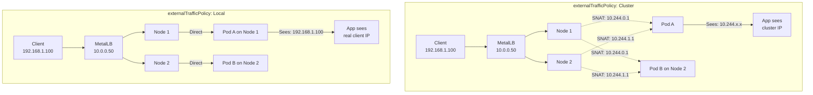
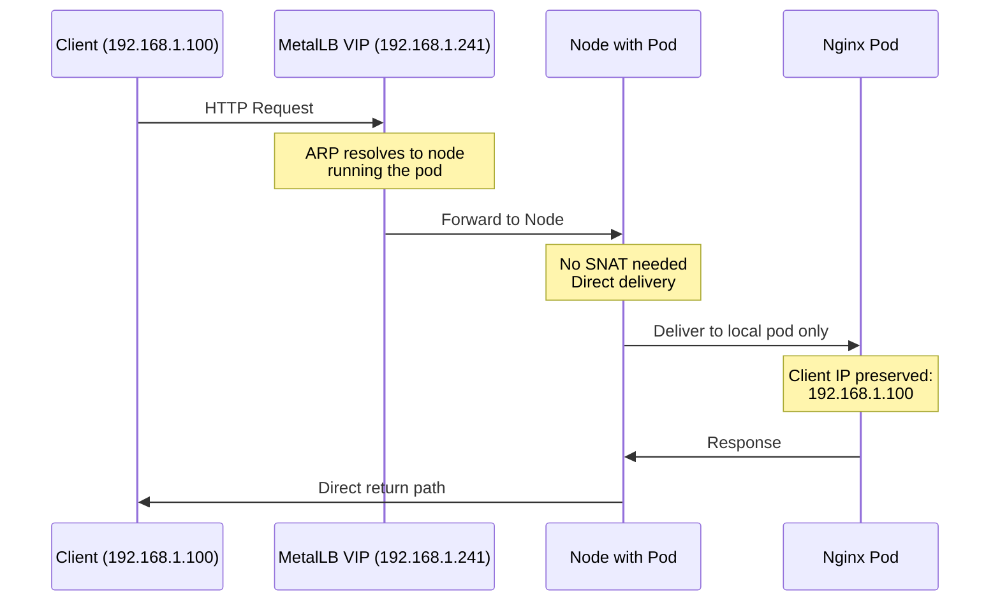

# How to Set Up MetalLB with External Traffic Policy Local

Author: [nawazdhandala](https://github.com/nawazdhandala)

Tags: MetalLB, Kubernetes, Networking, Load Balancing, Traffic Policy, Client IP, Performance

Description: Learn how to configure MetalLB with external traffic policy local to preserve client IP addresses and avoid extra network hops.

---

## Introduction

When running applications in Kubernetes that need to know the original client IP address, such as web servers for logging, security applications for IP-based access control, or analytics platforms, the default behavior of Kubernetes services can be problematic. By default, Kubernetes uses `externalTrafficPolicy: Cluster`, which load balances traffic across all nodes in the cluster, but in doing so, it performs Source Network Address Translation (SNAT), replacing the original client IP with an internal cluster IP.

MetalLB, combined with `externalTrafficPolicy: Local`, provides a solution that preserves the original client IP addresses while also reducing network latency by avoiding unnecessary hops between nodes.

## Understanding External Traffic Policy

Kubernetes LoadBalancer and NodePort services support two external traffic policies:

**Cluster (default)**: Traffic is distributed to all nodes, and any node can handle any traffic. This provides better load distribution but loses the client's original IP address due to SNAT.

**Local**: Traffic is only routed to pods running on the node that received the traffic. This preserves the client IP but may result in uneven load distribution if pods are not evenly distributed across nodes.

The following diagram illustrates the difference between these two policies:



## Prerequisites

Before proceeding, ensure you have:

- A Kubernetes cluster (v1.20 or later recommended)
- MetalLB installed and configured
- kubectl configured to access your cluster
- Basic understanding of Kubernetes services and networking

## Step 1: Verify MetalLB Installation

First, confirm that MetalLB is installed and running in your cluster:

```bash
kubectl get pods -n metallb-system
```

You should see output similar to:

```
NAME                          READY   STATUS    RESTARTS   AGE
controller-7dcc8764f4-k8xzp   1/1     Running   0          2d
speaker-8xk7j                 1/1     Running   0          2d
speaker-f9hkl                 1/1     Running   0          2d
speaker-n2xpt                 1/1     Running   0          2d
```

If MetalLB is not installed, you can install it using:

```bash
kubectl apply -f https://raw.githubusercontent.com/metallb/metallb/v0.14.8/config/manifests/metallb-native.yaml
```

## Step 2: Configure MetalLB IP Address Pool

Create an IP address pool that MetalLB will use to assign external IPs. This configuration defines the range of IP addresses available for LoadBalancer services:

```yaml
apiVersion: metallb.io/v1beta1
kind: IPAddressPool
metadata:
  name: production-pool
  namespace: metallb-system
spec:
  addresses:
  - 192.168.1.240-192.168.1.250
  autoAssign: true
```

Apply the configuration:

```bash
kubectl apply -f ipaddresspool.yaml
```

## Step 3: Configure L2 Advertisement

For Layer 2 mode, create an L2Advertisement resource. This tells MetalLB to announce the IP addresses using ARP (for IPv4) or NDP (for IPv6):

```yaml
apiVersion: metallb.io/v1beta1
kind: L2Advertisement
metadata:
  name: l2-advertisement
  namespace: metallb-system
spec:
  ipAddressPools:
  - production-pool
```

Apply the configuration:

```bash
kubectl apply -f l2advertisement.yaml
```

## Step 4: Deploy a Sample Application

Let's deploy a simple nginx application that will log client IP addresses. First, create the deployment:

```yaml
apiVersion: apps/v1
kind: Deployment
metadata:
  name: nginx-deployment
  labels:
    app: nginx
spec:
  replicas: 3
  selector:
    matchLabels:
      app: nginx
  template:
    metadata:
      labels:
        app: nginx
    spec:
      containers:
      - name: nginx
        image: nginx:1.25
        ports:
        - containerPort: 80
        resources:
          requests:
            memory: "64Mi"
            cpu: "100m"
          limits:
            memory: "128Mi"
            cpu: "200m"
```

Apply the deployment:

```bash
kubectl apply -f nginx-deployment.yaml
```

## Step 5: Create a Service with External Traffic Policy Local

Now, create a LoadBalancer service with `externalTrafficPolicy: Local`. This is the key configuration that preserves client IP addresses:

```yaml
apiVersion: v1
kind: Service
metadata:
  name: nginx-service
  annotations:
    metallb.universe.tf/loadBalancerIPs: "192.168.1.241"
spec:
  selector:
    app: nginx
  ports:
  - protocol: TCP
    port: 80
    targetPort: 80
  type: LoadBalancer
  externalTrafficPolicy: Local
```

Apply the service:

```bash
kubectl apply -f nginx-service.yaml
```

Verify the service has been assigned an external IP:

```bash
kubectl get svc nginx-service
```

Expected output:

```
NAME            TYPE           CLUSTER-IP      EXTERNAL-IP     PORT(S)        AGE
nginx-service   LoadBalancer   10.96.123.45    192.168.1.241   80:32000/TCP   30s
```

## Step 6: Understanding the Traffic Flow

With `externalTrafficPolicy: Local`, the traffic flow changes significantly. Here's what happens:



Key benefits of this configuration:

1. **Client IP Preservation**: The pod sees the actual client IP (192.168.1.100) instead of an internal cluster IP
2. **Reduced Latency**: Traffic doesn't hop between nodes unnecessarily
3. **Simplified Debugging**: Logs show real client IPs for troubleshooting
4. **Security**: IP-based access controls work correctly

## Step 7: Verify Client IP Preservation

Test the configuration by making a request to your service and checking the nginx logs:

```bash
curl http://192.168.1.241
```

Check the nginx pod logs to verify the client IP is preserved:

```bash
kubectl logs -l app=nginx --tail=10
```

You should see log entries with your actual client IP address:

```
192.168.1.100 - - [07/Jan/2026:10:30:45 +0000] "GET / HTTP/1.1" 200 615 "-" "curl/8.1.2"
```

If you were using `externalTrafficPolicy: Cluster`, you would instead see an internal cluster IP like `10.244.0.1`.

## Step 8: Handle Pod Distribution Considerations

With `externalTrafficPolicy: Local`, traffic is only sent to nodes that have pods running. This means:

1. **Nodes without pods receive no traffic**: MetalLB will only advertise the service from nodes running matching pods
2. **Potential load imbalance**: If pods are not evenly distributed, some nodes may receive more traffic than others

To ensure even distribution, use pod anti-affinity rules:

```yaml
apiVersion: apps/v1
kind: Deployment
metadata:
  name: nginx-deployment
spec:
  replicas: 3
  selector:
    matchLabels:
      app: nginx
  template:
    metadata:
      labels:
        app: nginx
    spec:
      affinity:
        podAntiAffinity:
          preferredDuringSchedulingIgnoredDuringExecution:
          - weight: 100
            podAffinityTerm:
              labelSelector:
                matchExpressions:
                - key: app
                  operator: In
                  values:
                  - nginx
              topologyKey: kubernetes.io/hostname
      containers:
      - name: nginx
        image: nginx:1.25
        ports:
        - containerPort: 80
```

This configuration encourages Kubernetes to spread pods across different nodes.

## Step 9: Configure Health Checks

With `externalTrafficPolicy: Local`, proper health checks become crucial. The service automatically uses health checks to determine which nodes have healthy pods. Configure readiness probes to ensure accurate health reporting:

```yaml
apiVersion: apps/v1
kind: Deployment
metadata:
  name: nginx-deployment
spec:
  replicas: 3
  selector:
    matchLabels:
      app: nginx
  template:
    metadata:
      labels:
        app: nginx
    spec:
      containers:
      - name: nginx
        image: nginx:1.25
        ports:
        - containerPort: 80
        readinessProbe:
          httpGet:
            path: /
            port: 80
          initialDelaySeconds: 5
          periodSeconds: 10
          timeoutSeconds: 5
          successThreshold: 1
          failureThreshold: 3
        livenessProbe:
          httpGet:
            path: /
            port: 80
          initialDelaySeconds: 15
          periodSeconds: 20
          timeoutSeconds: 5
          failureThreshold: 3
```

## Step 10: Monitor Traffic Distribution

To monitor how traffic is distributed across your pods, you can use various tools. Here's a simple way to check connection counts:

```bash
kubectl get endpoints nginx-service -o yaml
```

This shows which pod IPs are registered as endpoints. For more detailed monitoring, consider using metrics from kube-proxy:

```bash
kubectl get pods -o wide -l app=nginx
```

This shows which nodes are running your pods and helps identify potential load distribution issues.

## Troubleshooting Common Issues

### Issue 1: Service Not Receiving Traffic

If your service is not receiving traffic, check if pods are running on the node that MetalLB is advertising:

```bash
kubectl get pods -o wide -l app=nginx
kubectl describe svc nginx-service
```

Look for the "Endpoints" field in the service description.

### Issue 2: Uneven Load Distribution

If you notice uneven load distribution:

1. Check pod distribution across nodes
2. Verify anti-affinity rules are in place
3. Consider using a DaemonSet instead of Deployment for services that need to run on all nodes

### Issue 3: Client IP Still Not Preserved

If client IPs are still being masked:

1. Verify the service has `externalTrafficPolicy: Local` set
2. Check if there are any intermediate proxies or load balancers in front of MetalLB
3. Ensure you're not accessing the service through NodePort

Check the service configuration:

```bash
kubectl get svc nginx-service -o yaml | grep externalTrafficPolicy
```

## Complete Configuration Example

Here's a complete example that brings together all the configurations discussed:

The following manifest creates an IP address pool, L2 advertisement, deployment with anti-affinity and health checks, and a service with external traffic policy local:

```yaml
---
apiVersion: metallb.io/v1beta1
kind: IPAddressPool
metadata:
  name: production-pool
  namespace: metallb-system
spec:
  addresses:
  - 192.168.1.240-192.168.1.250
---
apiVersion: metallb.io/v1beta1
kind: L2Advertisement
metadata:
  name: l2-advertisement
  namespace: metallb-system
spec:
  ipAddressPools:
  - production-pool
---
apiVersion: apps/v1
kind: Deployment
metadata:
  name: web-app
  labels:
    app: web-app
spec:
  replicas: 3
  selector:
    matchLabels:
      app: web-app
  template:
    metadata:
      labels:
        app: web-app
    spec:
      affinity:
        podAntiAffinity:
          preferredDuringSchedulingIgnoredDuringExecution:
          - weight: 100
            podAffinityTerm:
              labelSelector:
                matchExpressions:
                - key: app
                  operator: In
                  values:
                  - web-app
              topologyKey: kubernetes.io/hostname
      containers:
      - name: nginx
        image: nginx:1.25
        ports:
        - containerPort: 80
        readinessProbe:
          httpGet:
            path: /
            port: 80
          initialDelaySeconds: 5
          periodSeconds: 10
        livenessProbe:
          httpGet:
            path: /
            port: 80
          initialDelaySeconds: 15
          periodSeconds: 20
        resources:
          requests:
            memory: "64Mi"
            cpu: "100m"
          limits:
            memory: "128Mi"
            cpu: "200m"
---
apiVersion: v1
kind: Service
metadata:
  name: web-app-service
  annotations:
    metallb.universe.tf/loadBalancerIPs: "192.168.1.241"
spec:
  selector:
    app: web-app
  ports:
  - protocol: TCP
    port: 80
    targetPort: 80
  type: LoadBalancer
  externalTrafficPolicy: Local
```

Apply the complete configuration:

```bash
kubectl apply -f complete-metallb-local-policy.yaml
```

## Performance Comparison

The following table summarizes the key differences between the two traffic policies:

| Aspect | Cluster Policy | Local Policy |
|--------|---------------|--------------|
| Client IP | Lost (SNAT) | Preserved |
| Network Hops | May cross nodes | Direct to pod |
| Load Distribution | Even | Depends on pod placement |
| Failover | Automatic | Node-specific |
| Use Case | General workloads | IP-sensitive apps |

## Best Practices

1. **Use Pod Anti-Affinity**: Always configure pod anti-affinity when using `externalTrafficPolicy: Local` to ensure pods are distributed across nodes

2. **Monitor Endpoint Distribution**: Regularly check that endpoints are distributed across nodes to prevent traffic concentration

3. **Configure Proper Health Checks**: Readiness probes ensure that only healthy pods receive traffic

4. **Consider DaemonSets**: For services that need to handle traffic on every node, consider using DaemonSets instead of Deployments

5. **Document IP Requirements**: Clearly document which services require client IP preservation for future reference

6. **Test Failover Scenarios**: Regularly test what happens when pods are evicted or nodes fail

## Conclusion

Configuring MetalLB with `externalTrafficPolicy: Local` is essential for applications that need to know the original client IP address. While this configuration requires careful attention to pod distribution and health checks, the benefits of preserved client IPs and reduced network latency make it worthwhile for many production workloads.

By following this guide, you have learned how to:

- Configure MetalLB with appropriate IP pools
- Create services with external traffic policy local
- Handle pod distribution considerations
- Troubleshoot common issues

Remember that the choice between Cluster and Local policies depends on your specific requirements. Use Local when client IP preservation is critical, and Cluster when even load distribution is more important than knowing the original client IP.
