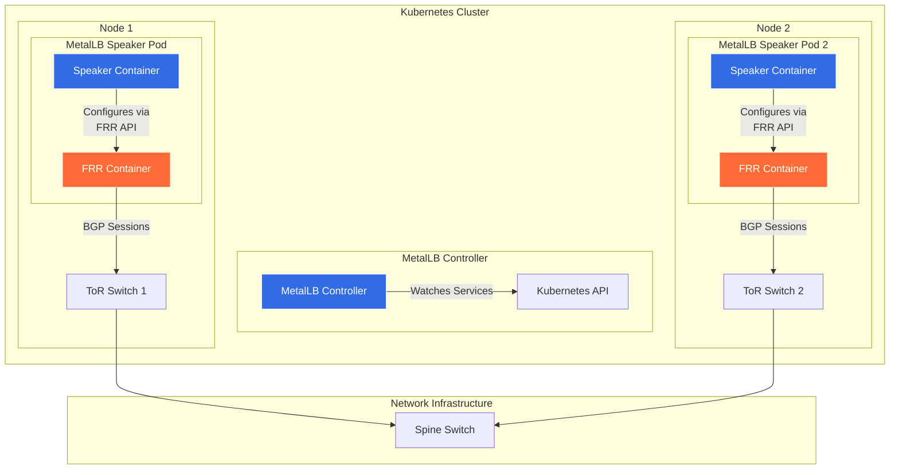
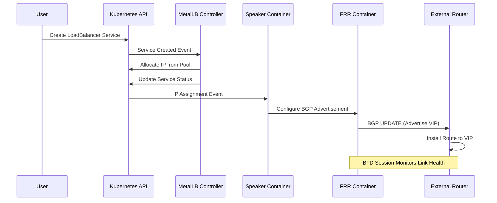
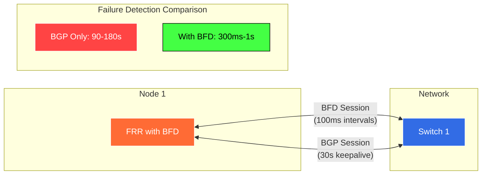
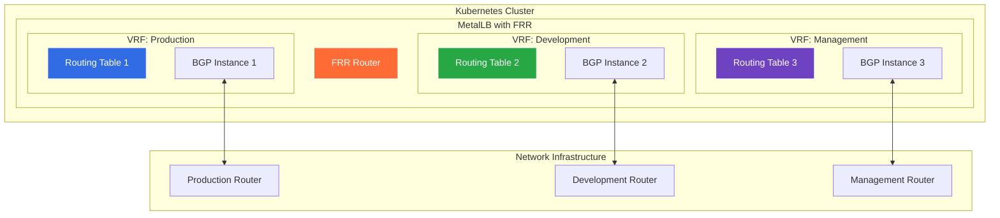
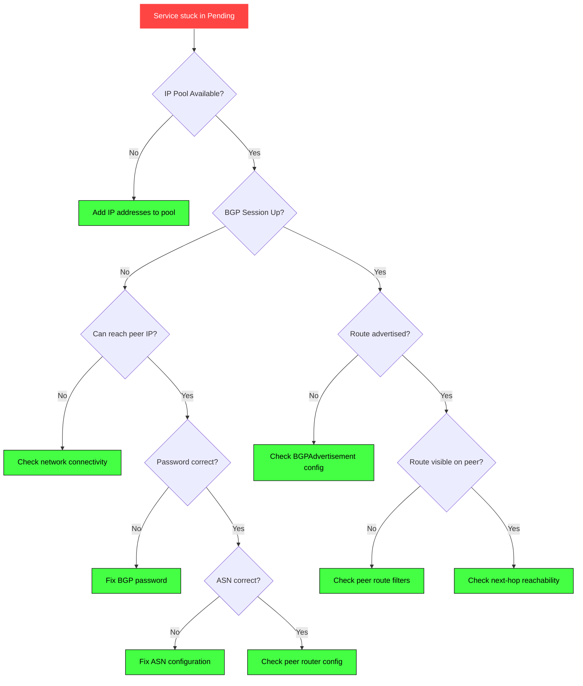

# How to Configure MetalLB with FRR for Advanced BGP

Author: [nawazdhandala](https://github.com/nawazdhandala)

Tags: MetalLB, Kubernetes, FRR, BGP, Routing, Networking

Description: Learn how to use MetalLB with FRRouting for advanced BGP routing capabilities.

---

MetalLB is the de facto standard for providing load balancer services in bare-metal Kubernetes clusters. While its native BGP implementation works well for basic scenarios, complex network environments often require advanced routing features. This is where FRRouting (FRR) mode comes in, offering enterprise-grade BGP capabilities including BFD (Bidirectional Forwarding Detection), VRF support, route policies, and more.

In this comprehensive guide, we will explore how to configure MetalLB with FRR mode for advanced BGP routing scenarios.

## Table of Contents

1. [Understanding MetalLB FRR Mode](#understanding-metallb-frr-mode)
2. [FRR Architecture Overview](#frr-architecture-overview)
3. [Prerequisites](#prerequisites)
4. [Installing MetalLB with FRR Mode](#installing-metallb-with-frr-mode)
5. [Basic BGP Configuration](#basic-bgp-configuration)
6. [Advanced BGP Features](#advanced-bgp-features)
7. [BFD Integration](#bfd-integration)
8. [VRF Support](#vrf-support)
9. [Route Policies and Filtering](#route-policies-and-filtering)
10. [Monitoring and Troubleshooting](#monitoring-and-troubleshooting)
11. [Best Practices](#best-practices)

## Understanding MetalLB FRR Mode

MetalLB traditionally uses its own native BGP speaker implementation. While functional, it lacks many advanced features that enterprise networks require. FRR mode replaces the native speaker with FRRouting, a production-proven routing suite used by major network operators worldwide.

### Key Benefits of FRR Mode

- **Full BGP feature set**: Access to all BGP capabilities including route reflectors, confederations, and extended communities
- **BFD support**: Sub-second failure detection for faster failover
- **VRF awareness**: Network segmentation and multi-tenancy support
- **Route policies**: Fine-grained control over route advertisement and acceptance
- **IPv6 support**: Full dual-stack networking capabilities
- **Community support**: Leverage the extensive FRR community and documentation

## FRR Architecture Overview

The following diagram illustrates how MetalLB integrates with FRR in a Kubernetes cluster:



### Component Interaction Flow



## Prerequisites

Before configuring MetalLB with FRR mode, ensure you have:

- Kubernetes cluster version 1.20 or later
- Helm 3.x installed
- Network access between cluster nodes and BGP peers
- BGP-capable routers or switches in your network
- Understanding of your network's ASN and IP addressing scheme

## Installing MetalLB with FRR Mode

### Step 1: Add the MetalLB Helm Repository

The following commands add the official MetalLB Helm repository and update your local cache:

```bash
# Add the MetalLB Helm repository to your Helm installation
helm repo add metallb https://metallb.github.io/metallb

# Update the Helm repository cache to fetch the latest chart versions
helm repo update
```

### Step 2: Create the MetalLB Namespace

We create a dedicated namespace to isolate MetalLB components from other workloads:

```bash
# Create a dedicated namespace for MetalLB components
# Using a separate namespace provides better resource isolation and RBAC control
kubectl create namespace metallb-system
```

### Step 3: Configure Helm Values for FRR Mode

Create a values file that enables FRR mode and configures essential settings. The speaker.frr.enabled flag is the key setting that switches from native BGP to FRR mode:

```yaml
# metallb-values.yaml
# This configuration enables FRR mode for advanced BGP features

# Controller configuration - manages IP allocation and pool assignments
controller:
  # Enable Prometheus metrics for monitoring IP pool usage
  metrics:
    enabled: true
    serviceMonitor:
      enabled: true
  # Resource limits ensure the controller doesn't consume excessive resources
  resources:
    limits:
      cpu: 200m
      memory: 256Mi
    requests:
      cpu: 100m
      memory: 128Mi

# Speaker configuration - runs on each node and handles BGP peering
speaker:
  # Enable FRR mode - this is the critical setting for advanced BGP features
  frr:
    enabled: true
    # FRR image configuration - use a specific version for production stability
    image:
      repository: quay.io/frrouting/frr
      tag: 9.1.0
    # Resource allocation for the FRR container
    resources:
      limits:
        cpu: 500m
        memory: 512Mi
      requests:
        cpu: 200m
        memory: 256Mi
  # Speaker container resources
  resources:
    limits:
      cpu: 200m
      memory: 256Mi
    requests:
      cpu: 100m
      memory: 128Mi
  # Node selector to control which nodes run the speaker
  # In production, you might want to limit this to specific node pools
  nodeSelector: {}
  # Tolerations allow the speaker to run on tainted nodes (e.g., control plane)
  tolerations:
    - key: node-role.kubernetes.io/control-plane
      operator: Exists
      effect: NoSchedule
  # Log level for debugging - set to 'debug' when troubleshooting
  logLevel: info
```

### Step 4: Install MetalLB with FRR Mode

Deploy MetalLB using the Helm chart with our custom values:

```bash
# Install MetalLB with FRR mode enabled using the custom values file
# The --wait flag ensures the command doesn't return until all pods are ready
helm install metallb metallb/metallb \
  --namespace metallb-system \
  --values metallb-values.yaml \
  --wait
```

### Step 5: Verify the Installation

Confirm that all MetalLB components are running correctly, including the FRR containers:

```bash
# Verify all pods are running in the metallb-system namespace
# You should see controller and speaker pods with READY status
kubectl get pods -n metallb-system

# Check that the speaker pods have both speaker and frr containers
# The READY column should show 2/2 for each speaker pod
kubectl get pods -n metallb-system -l app=metallb,component=speaker -o wide

# Examine the FRR container logs to verify FRR is starting correctly
# Look for "FRR starting" and successful daemon initialization messages
kubectl logs -n metallb-system -l component=speaker -c frr --tail=50
```

## Basic BGP Configuration

### IP Address Pool Configuration

Define the IP address pool that MetalLB will use for LoadBalancer services. This pool should contain routable IPs that your network infrastructure can direct traffic to:

```yaml
# ipaddresspool.yaml
# Defines the pool of IP addresses available for LoadBalancer services
apiVersion: metallb.io/v1beta1
kind: IPAddressPool
metadata:
  name: production-pool
  namespace: metallb-system
spec:
  # Address ranges that MetalLB can assign to services
  # These IPs must be routable in your network and not used elsewhere
  addresses:
    # CIDR notation for a /24 network
    - 192.168.100.0/24
    # You can also specify individual ranges
    - 192.168.101.10-192.168.101.50
  # autoAssign controls whether this pool is used for automatic assignment
  # Set to false if you want explicit pool selection via annotations
  autoAssign: true
  # avoidBuggyIPs skips .0 and .255 addresses which some clients handle incorrectly
  avoidBuggyIPs: true
```

### BGP Advertisement Configuration

Configure how MetalLB advertises routes to BGP peers. This resource links the IP pool to BGP peers and controls advertisement behavior:

```yaml
# bgpadvertisement.yaml
# Controls how IP addresses from pools are advertised via BGP
apiVersion: metallb.io/v1beta1
kind: BGPAdvertisement
metadata:
  name: production-advertisement
  namespace: metallb-system
spec:
  # Reference to the IP address pools to advertise
  ipAddressPools:
    - production-pool
  # aggregationLength controls route aggregation
  # /32 means each IP is advertised individually (no aggregation)
  # Setting this to /24 would aggregate all IPs in a /24 range into one route
  aggregationLength: 32
  # aggregationLengthV6 is the same for IPv6 addresses
  aggregationLengthV6: 128
  # localPref sets the BGP LOCAL_PREF attribute
  # Higher values are preferred when multiple paths exist
  localPref: 100
  # communities attaches BGP communities to advertised routes
  # Communities can be used for traffic engineering in your network
  communities:
    - 65535:65281  # NO_EXPORT - prevents routes from leaving your AS
  # nodeSelectors limits which nodes advertise which pools
  # Useful for location-aware routing in multi-site deployments
  nodeSelectors:
    - matchLabels:
        node-role.kubernetes.io/worker: "true"
```

### BGP Peer Configuration

Define the BGP peers (routers) that MetalLB will establish sessions with. In FRR mode, this configuration is translated to FRR's BGP configuration:

```yaml
# bgppeer.yaml
# Defines BGP peer relationships with external routers
apiVersion: metallb.io/v1beta1
kind: BGPPeer
metadata:
  name: tor-switch-1
  namespace: metallb-system
spec:
  # myASN is your cluster's Autonomous System Number
  # Use a private ASN (64512-65534) unless you have a registered ASN
  myASN: 64512
  # peerASN is the AS number of the router you're peering with
  peerASN: 64513
  # peerAddress is the IP address of the BGP peer
  peerAddress: 10.0.0.1
  # peerPort defaults to 179 (standard BGP port)
  peerPort: 179
  # sourceAddress specifies which local IP to use for the BGP session
  # If not set, the system will choose based on routing table
  # sourceAddress: 10.0.0.10
  # holdTime is the BGP hold timer in seconds
  # The session is considered dead if no messages arrive within this time
  holdTime: 90s
  # keepaliveTime is how often keepalive messages are sent
  # Should be 1/3 of holdTime per BGP best practices
  keepaliveTime: 30s
  # routerID optionally sets the BGP router ID
  # If not set, FRR will automatically select one
  # routerID: 10.0.0.10
  # password enables MD5 authentication for the BGP session
  # Highly recommended for production environments
  password: "BGP-Secret-Key-123"
  # nodeSelectors controls which nodes peer with this router
  # Use this for rack-aware or zone-aware BGP peering
  nodeSelectors:
    - matchLabels:
        topology.kubernetes.io/zone: "zone-a"
  # ebgpMultiHop sets the TTL for EBGP sessions
  # Required when the peer is not directly connected
  ebgpMultiHop: true
  # bfdProfile references a BFD profile for fast failure detection
  # We'll configure this in the BFD section below
  bfdProfile: production-bfd
```

### Apply Basic Configuration

Apply all the configuration resources to establish basic BGP peering:

```bash
# Apply the IP address pool configuration
kubectl apply -f ipaddresspool.yaml

# Apply the BGP advertisement configuration
kubectl apply -f bgpadvertisement.yaml

# Apply the BGP peer configuration
kubectl apply -f bgppeer.yaml

# Verify the BGP session status using FRR's vtysh command
# This connects to the FRR container and shows BGP neighbor status
kubectl exec -n metallb-system -it $(kubectl get pods -n metallb-system -l component=speaker -o jsonpath='{.items[0].metadata.name}') -c frr -- vtysh -c "show bgp summary"
```

## Advanced BGP Features

### BGP Communities

BGP communities are tags attached to routes that influence routing decisions. They are essential for traffic engineering in enterprise networks:

```yaml
# bgp-communities.yaml
# Define reusable BGP community values for route tagging
apiVersion: metallb.io/v1beta1
kind: Community
metadata:
  name: production-communities
  namespace: metallb-system
spec:
  communities:
    # NO_EXPORT prevents routes from being advertised to external BGP peers
    # Useful for keeping routes within your network
    - name: no-export
      value: 65535:65281
    # NO_ADVERTISE prevents routes from being advertised to any BGP peer
    # Including internal peers - use with caution
    - name: no-advertise
      value: 65535:65282
    # Custom community for high-priority traffic
    # Your network equipment can use this for QoS decisions
    - name: high-priority
      value: 64512:100
    # Custom community for low-priority/bulk traffic
    - name: low-priority
      value: 64512:200
    # Geographic communities for multi-region deployments
    - name: region-us-east
      value: 64512:1001
    - name: region-us-west
      value: 64512:1002
    - name: region-eu-west
      value: 64512:1003
```

### Using Communities in Advertisements

Apply communities to specific advertisements to control how routes are handled by upstream routers:

```yaml
# bgpadvertisement-with-communities.yaml
# Advertisement configuration that uses BGP communities for traffic engineering
apiVersion: metallb.io/v1beta1
kind: BGPAdvertisement
metadata:
  name: production-with-communities
  namespace: metallb-system
spec:
  ipAddressPools:
    - production-pool
  aggregationLength: 32
  localPref: 100
  # Reference communities defined in the Community resource
  # Routes will carry these community tags
  communities:
    - no-export          # Keep routes within our AS
    - high-priority      # Mark as high-priority traffic
    - region-us-east     # Indicate geographic origin
  # peers limits which BGP peers receive this advertisement
  # If empty, all peers receive the advertisement
  peers:
    - tor-switch-1
    - tor-switch-2
```

### Multi-Path BGP Configuration

Configure ECMP (Equal-Cost Multi-Path) routing to load balance traffic across multiple paths:

```yaml
# bgppeer-multipath.yaml
# Configuration for multiple BGP peers with ECMP support
# Note: FRR handles ECMP automatically when multiple equal-cost paths exist
---
apiVersion: metallb.io/v1beta1
kind: BGPPeer
metadata:
  name: tor-switch-primary
  namespace: metallb-system
spec:
  myASN: 64512
  peerASN: 64513
  peerAddress: 10.0.0.1
  holdTime: 90s
  keepaliveTime: 30s
  password: "BGP-Secret-Key-123"
  # Primary path with higher local preference
  bfdProfile: production-bfd
---
apiVersion: metallb.io/v1beta1
kind: BGPPeer
metadata:
  name: tor-switch-secondary
  namespace: metallb-system
spec:
  myASN: 64512
  peerASN: 64513
  peerAddress: 10.0.0.2
  holdTime: 90s
  keepaliveTime: 30s
  password: "BGP-Secret-Key-123"
  # Secondary path - ECMP will balance across both when equal
  bfdProfile: production-bfd
```

### Route Aggregation

Configure route aggregation to reduce the number of routes advertised to peers:

```yaml
# bgpadvertisement-aggregated.yaml
# Aggregate individual /32 routes into larger prefixes
# This reduces routing table size on upstream routers
apiVersion: metallb.io/v1beta1
kind: BGPAdvertisement
metadata:
  name: aggregated-advertisement
  namespace: metallb-system
spec:
  ipAddressPools:
    - production-pool
  # aggregationLength of /24 means all IPs in a /24 range
  # are advertised as a single /24 route instead of individual /32s
  # This only works when you have contiguous allocations
  aggregationLength: 24
  aggregationLengthV6: 64
  # When aggregating, you can still advertise specific routes
  # for traffic engineering using multiple BGPAdvertisement resources
  localPref: 100
```

## BFD Integration

Bidirectional Forwarding Detection (BFD) provides sub-second failure detection, dramatically reducing failover time compared to relying on BGP hold timers alone.

### BFD Architecture



### BFD Profile Configuration

Define BFD profiles with timing parameters appropriate for your network:

```yaml
# bfdprofile.yaml
# BFD (Bidirectional Forwarding Detection) profile for fast failure detection
apiVersion: metallb.io/v1beta1
kind: BFDProfile
metadata:
  name: production-bfd
  namespace: metallb-system
spec:
  # receiveInterval is how often we expect to receive BFD packets (milliseconds)
  # Lower values = faster detection but more CPU and network overhead
  receiveInterval: 300
  # transmitInterval is how often we send BFD packets (milliseconds)
  transmitInterval: 300
  # detectMultiplier is the number of missed packets before declaring failure
  # Detection time = transmitInterval * detectMultiplier
  # With 300ms interval and multiplier of 3, detection takes ~900ms
  detectMultiplier: 3
  # echoMode enables BFD echo function for sub-100ms detection
  # Requires hardware support on the peer
  echoMode: false
  # passiveMode means we wait for the peer to initiate the BFD session
  # Set to false for active mode where we initiate
  passiveMode: false
  # minimumTtl sets the minimum TTL for received BFD packets
  # Security feature to prevent BFD spoofing from distant sources
  minimumTtl: 254
---
# Aggressive BFD profile for critical services requiring fastest failover
apiVersion: metallb.io/v1beta1
kind: BFDProfile
metadata:
  name: critical-bfd
  namespace: metallb-system
spec:
  # 100ms intervals for sub-second detection
  receiveInterval: 100
  transmitInterval: 100
  # Multiplier of 3 gives ~300ms detection time
  detectMultiplier: 3
  echoMode: false
  passiveMode: false
  minimumTtl: 254
---
# Conservative BFD profile for less critical services
# Uses less resources and is more tolerant of network jitter
apiVersion: metallb.io/v1beta1
kind: BFDProfile
metadata:
  name: standard-bfd
  namespace: metallb-system
spec:
  receiveInterval: 1000
  transmitInterval: 1000
  detectMultiplier: 5
  echoMode: false
  passiveMode: false
  minimumTtl: 254
```

### Linking BFD to BGP Peers

Update your BGP peer configuration to reference the BFD profile:

```yaml
# bgppeer-with-bfd.yaml
# BGP peer configuration with BFD enabled for fast failover
apiVersion: metallb.io/v1beta1
kind: BGPPeer
metadata:
  name: tor-switch-1-bfd
  namespace: metallb-system
spec:
  myASN: 64512
  peerASN: 64513
  peerAddress: 10.0.0.1
  holdTime: 90s
  keepaliveTime: 30s
  password: "BGP-Secret-Key-123"
  # Reference the BFD profile - this enables BFD for this peer
  # When BFD detects a failure, BGP session is immediately torn down
  # This bypasses the need to wait for BGP hold timer expiration
  bfdProfile: production-bfd
  nodeSelectors:
    - matchLabels:
        topology.kubernetes.io/zone: "zone-a"
```

### Verify BFD Status

Check that BFD sessions are established and functioning:

```bash
# Connect to FRR and check BFD peer status
# Look for "Status: up" for each configured peer
kubectl exec -n metallb-system -it $(kubectl get pods -n metallb-system -l component=speaker -o jsonpath='{.items[0].metadata.name}') -c frr -- vtysh -c "show bfd peers"

# Detailed BFD peer information including packet counters
kubectl exec -n metallb-system -it $(kubectl get pods -n metallb-system -l component=speaker -o jsonpath='{.items[0].metadata.name}') -c frr -- vtysh -c "show bfd peers counters"

# Check BFD session state in JSON format for scripting
kubectl exec -n metallb-system -it $(kubectl get pods -n metallb-system -l component=speaker -o jsonpath='{.items[0].metadata.name}') -c frr -- vtysh -c "show bfd peers json"
```

## VRF Support

Virtual Routing and Forwarding (VRF) enables network segmentation within your Kubernetes cluster, allowing different services to use isolated routing tables.

### VRF Architecture



### VRF Configuration

Configure VRF-aware BGP peering for network isolation:

```yaml
# Note: VRF support in MetalLB requires careful network configuration
# The underlying node networking must have VRF interfaces configured

# bgppeer-vrf.yaml
# BGP peer configuration within a specific VRF
apiVersion: metallb.io/v1beta1
kind: BGPPeer
metadata:
  name: production-vrf-peer
  namespace: metallb-system
spec:
  myASN: 64512
  peerASN: 64520
  peerAddress: 10.100.0.1
  holdTime: 90s
  keepaliveTime: 30s
  # vrf specifies the VRF name for this BGP session
  # The VRF must exist on the node's network configuration
  vrf: production
  password: "Production-BGP-Key"
  bfdProfile: production-bfd
---
apiVersion: metallb.io/v1beta1
kind: BGPPeer
metadata:
  name: development-vrf-peer
  namespace: metallb-system
spec:
  myASN: 64512
  peerASN: 64521
  peerAddress: 10.200.0.1
  holdTime: 90s
  keepaliveTime: 30s
  vrf: development
  password: "Development-BGP-Key"
  bfdProfile: standard-bfd
```

### VRF-Aware IP Address Pools

Create separate IP pools for each VRF to ensure proper traffic isolation:

```yaml
# ipaddresspool-vrf.yaml
# Separate IP pools for different VRFs
---
apiVersion: metallb.io/v1beta1
kind: IPAddressPool
metadata:
  name: production-vrf-pool
  namespace: metallb-system
spec:
  addresses:
    - 10.100.100.0/24
  autoAssign: false  # Require explicit pool selection
  avoidBuggyIPs: true
---
apiVersion: metallb.io/v1beta1
kind: IPAddressPool
metadata:
  name: development-vrf-pool
  namespace: metallb-system
spec:
  addresses:
    - 10.200.100.0/24
  autoAssign: false
  avoidBuggyIPs: true
```

### VRF-Aware Advertisements

Configure advertisements that are scoped to specific VRFs:

```yaml
# bgpadvertisement-vrf.yaml
# Advertisements scoped to specific VRFs
---
apiVersion: metallb.io/v1beta1
kind: BGPAdvertisement
metadata:
  name: production-vrf-advertisement
  namespace: metallb-system
spec:
  ipAddressPools:
    - production-vrf-pool
  aggregationLength: 32
  localPref: 100
  peers:
    - production-vrf-peer
---
apiVersion: metallb.io/v1beta1
kind: BGPAdvertisement
metadata:
  name: development-vrf-advertisement
  namespace: metallb-system
spec:
  ipAddressPools:
    - development-vrf-pool
  aggregationLength: 32
  localPref: 100
  peers:
    - development-vrf-peer
```

### Service Configuration for VRF Pools

When creating services, specify the VRF pool using annotations:

```yaml
# service-with-vrf.yaml
# LoadBalancer service using a specific VRF pool
apiVersion: v1
kind: Service
metadata:
  name: production-api
  namespace: production
  annotations:
    # Specify which IP pool to use for this service
    metallb.universe.tf/address-pool: production-vrf-pool
    # Optionally request a specific IP from the pool
    # metallb.universe.tf/loadBalancerIPs: 10.100.100.50
spec:
  type: LoadBalancer
  selector:
    app: api
  ports:
    - port: 443
      targetPort: 8443
      protocol: TCP
```

## Route Policies and Filtering

FRR mode enables sophisticated route policies using prefix lists, route maps, and AS path filters.

### Configuring Route Policies via FRR

For advanced route policies, you can inject custom FRR configuration. This requires creating a ConfigMap with FRR configuration snippets:

```yaml
# frr-config-override.yaml
# Custom FRR configuration for advanced route policies
# This ConfigMap is mounted into the FRR container
apiVersion: v1
kind: ConfigMap
metadata:
  name: frr-config-override
  namespace: metallb-system
data:
  # Custom prefix list to filter which routes are accepted from peers
  prefix-lists.conf: |
    ! Prefix list to accept only specific networks from peers
    ip prefix-list ALLOW-FROM-PEER seq 10 permit 10.0.0.0/8 le 24
    ip prefix-list ALLOW-FROM-PEER seq 20 permit 172.16.0.0/12 le 24
    ip prefix-list ALLOW-FROM-PEER seq 100 deny any

    ! Prefix list to control which routes we advertise
    ip prefix-list ADVERTISE-TO-PEER seq 10 permit 192.168.100.0/24 le 32
    ip prefix-list ADVERTISE-TO-PEER seq 20 permit 192.168.101.0/24 le 32
    ip prefix-list ADVERTISE-TO-PEER seq 100 deny any

  # Route maps for complex policy decisions
  route-maps.conf: |
    ! Route map for incoming routes - apply filtering and set attributes
    route-map IMPORT-POLICY permit 10
      match ip address prefix-list ALLOW-FROM-PEER
      set local-preference 100
    route-map IMPORT-POLICY deny 100

    ! Route map for outgoing routes - control what we advertise
    route-map EXPORT-POLICY permit 10
      match ip address prefix-list ADVERTISE-TO-PEER
      set community 64512:100 additive
    route-map EXPORT-POLICY deny 100

    ! Route map for backup path - lower local preference
    route-map BACKUP-PATH permit 10
      match ip address prefix-list ALLOW-FROM-PEER
      set local-preference 50
    route-map BACKUP-PATH deny 100

  # AS path access lists for filtering by AS path
  as-path-filters.conf: |
    ! Only accept routes originating from specific ASes
    bgp as-path access-list TRUSTED-AS permit ^64513$
    bgp as-path access-list TRUSTED-AS permit ^64514$
    bgp as-path access-list TRUSTED-AS deny .*
```

### Advanced BGP Peer with Route Policies

Configure peers to use the custom route policies. Note that route map application is done through FRR configuration:

```yaml
# bgppeer-with-policies.yaml
# BGP peer configuration referencing route policies
# The actual route-map configuration is in the FRR config override
apiVersion: metallb.io/v1beta1
kind: BGPPeer
metadata:
  name: tor-switch-with-policy
  namespace: metallb-system
spec:
  myASN: 64512
  peerASN: 64513
  peerAddress: 10.0.0.1
  holdTime: 90s
  keepaliveTime: 30s
  password: "BGP-Secret-Key-123"
  bfdProfile: production-bfd
  # Note: For route-map application, you need to configure
  # the FRR container directly using the ConfigMap override
  # MetalLB CRDs don't directly support route-map references
```

## Monitoring and Troubleshooting

### FRR Command Reference

Access FRR's vtysh shell for detailed BGP diagnostics:

```bash
# Enter interactive vtysh session
kubectl exec -n metallb-system -it $(kubectl get pods -n metallb-system -l component=speaker -o jsonpath='{.items[0].metadata.name}') -c frr -- vtysh

# Or run individual commands directly:

# Show BGP summary - overview of all BGP peers and their state
kubectl exec -n metallb-system -it $(kubectl get pods -n metallb-system -l component=speaker -o jsonpath='{.items[0].metadata.name}') -c frr -- vtysh -c "show bgp summary"

# Show detailed neighbor information including capabilities negotiated
kubectl exec -n metallb-system -it $(kubectl get pods -n metallb-system -l component=speaker -o jsonpath='{.items[0].metadata.name}') -c frr -- vtysh -c "show bgp neighbors"

# Show routes received from a specific peer
kubectl exec -n metallb-system -it $(kubectl get pods -n metallb-system -l component=speaker -o jsonpath='{.items[0].metadata.name}') -c frr -- vtysh -c "show bgp neighbors 10.0.0.1 received-routes"

# Show routes advertised to a specific peer
kubectl exec -n metallb-system -it $(kubectl get pods -n metallb-system -l component=speaker -o jsonpath='{.items[0].metadata.name}') -c frr -- vtysh -c "show bgp neighbors 10.0.0.1 advertised-routes"

# Show the BGP routing table
kubectl exec -n metallb-system -it $(kubectl get pods -n metallb-system -l component=speaker -o jsonpath='{.items[0].metadata.name}') -c frr -- vtysh -c "show bgp ipv4 unicast"

# Show BFD peer status
kubectl exec -n metallb-system -it $(kubectl get pods -n metallb-system -l component=speaker -o jsonpath='{.items[0].metadata.name}') -c frr -- vtysh -c "show bfd peers"

# Show the running FRR configuration
kubectl exec -n metallb-system -it $(kubectl get pods -n metallb-system -l component=speaker -o jsonpath='{.items[0].metadata.name}') -c frr -- vtysh -c "show running-config"
```

### MetalLB Status Commands

Check MetalLB-specific status using kubectl:

```bash
# List all IP address pools and their status
kubectl get ipaddresspools -n metallb-system -o wide

# List all BGP peers and their status
kubectl get bgppeers -n metallb-system -o wide

# List all BGP advertisements
kubectl get bgpadvertisements -n metallb-system -o wide

# List all BFD profiles
kubectl get bfdprofiles -n metallb-system -o wide

# Check MetalLB controller logs for IP allocation events
kubectl logs -n metallb-system -l component=controller --tail=100

# Check speaker logs for BGP session events
kubectl logs -n metallb-system -l component=speaker -c speaker --tail=100

# Check FRR logs for routing protocol events
kubectl logs -n metallb-system -l component=speaker -c frr --tail=100
```

### Prometheus Metrics

MetalLB exposes Prometheus metrics for monitoring. Key metrics to watch:

```bash
# Example PromQL queries for MetalLB monitoring

# Number of allocated IPs per pool
metallb_allocator_addresses_in_use_total{pool="production-pool"}

# BGP session state (1=established, 0=down)
metallb_bgp_session_up{peer="10.0.0.1"}

# Number of prefixes advertised
metallb_bgp_announced_prefixes_total{peer="10.0.0.1"}

# BFD session state
metallb_bfd_session_up{peer="10.0.0.1"}

# BFD packet counters for troubleshooting
metallb_bfd_control_packet_input{peer="10.0.0.1"}
metallb_bfd_control_packet_output{peer="10.0.0.1"}
```

### Troubleshooting Common Issues

Here is a troubleshooting flowchart for common MetalLB FRR issues:



Common issues and solutions:

```bash
# Issue: BGP session not establishing
# Check 1: Verify network connectivity to peer
kubectl exec -n metallb-system -it $(kubectl get pods -n metallb-system -l component=speaker -o jsonpath='{.items[0].metadata.name}') -c frr -- ping -c 3 10.0.0.1

# Check 2: Verify BGP port is not blocked
kubectl exec -n metallb-system -it $(kubectl get pods -n metallb-system -l component=speaker -o jsonpath='{.items[0].metadata.name}') -c frr -- nc -zv 10.0.0.1 179

# Check 3: Look for BGP errors in FRR logs
kubectl logs -n metallb-system -l component=speaker -c frr | grep -i "bgp\|error\|failed"

# Issue: Routes not being advertised
# Check 1: Verify service has an IP assigned
kubectl get svc -A | grep LoadBalancer

# Check 2: Check if IP is from the correct pool
kubectl get svc <service-name> -o yaml | grep -A5 status

# Check 3: Verify BGPAdvertisement matches the pool
kubectl get bgpadvertisements -n metallb-system -o yaml

# Issue: BFD session flapping
# Check 1: Review BFD timers - they might be too aggressive
kubectl get bfdprofiles -n metallb-system -o yaml

# Check 2: Check for packet loss or high latency
kubectl exec -n metallb-system -it $(kubectl get pods -n metallb-system -l component=speaker -o jsonpath='{.items[0].metadata.name}') -c frr -- vtysh -c "show bfd peers counters"
```

## Best Practices

### Security Best Practices

1. **Always use BGP authentication**: MD5 passwords prevent BGP session hijacking

```yaml
# Always set a strong password on BGP peers
spec:
  password: "Complex-Password-With-Numbers-123!"
```

2. **Use BFD with minimum TTL**: Prevents BFD spoofing from remote sources

```yaml
# Set minimumTtl to 254 to ensure BFD packets are from directly connected peers
spec:
  minimumTtl: 254
```

3. **Implement prefix filtering**: Never accept or advertise more than necessary

4. **Use separate pools for different security zones**: Leverage VRF for network isolation

### Reliability Best Practices

1. **Enable BFD on all BGP peers**: Sub-second failover is critical for high availability

2. **Configure multiple BGP peers**: Avoid single points of failure

```yaml
# Deploy peers to multiple ToR switches or routers
# Use rack-aware node selectors for proper redundancy
```

3. **Set appropriate hold and keepalive timers**: Balance between fast detection and stability

```yaml
# Recommended: holdTime 3x keepaliveTime
holdTime: 90s
keepaliveTime: 30s
```

4. **Monitor BGP and BFD sessions**: Set up alerts for session state changes

### Performance Best Practices

1. **Use route aggregation**: Reduce routing table size on upstream routers

2. **Tune BFD intervals based on network quality**:
   - Stable networks: 100-300ms intervals
   - Less stable networks: 500-1000ms intervals

3. **Allocate adequate resources to FRR containers**: Especially important with many peers

```yaml
# Scale resources based on number of peers and routes
resources:
  limits:
    cpu: 500m
    memory: 512Mi
```

### Operational Best Practices

1. **Document your BGP topology**: Keep network diagrams updated

2. **Use meaningful community values**: Create a community allocation plan

3. **Test configuration changes in non-production first**: BGP misconfigurations can cause outages

4. **Keep FRR version updated**: Security patches and bug fixes are important

5. **Back up your MetalLB configuration**: Export all CRDs regularly

```bash
# Backup all MetalLB configuration
kubectl get ipaddresspools,bgppeers,bgpadvertisements,bfdprofiles,communities -n metallb-system -o yaml > metallb-backup.yaml
```

## Conclusion

MetalLB with FRR mode provides enterprise-grade BGP capabilities for bare-metal Kubernetes clusters. By leveraging FRRouting's mature BGP implementation, you gain access to advanced features like BFD for fast failover, VRF for network segmentation, and sophisticated route policies for traffic engineering.

Key takeaways from this guide:

- **FRR mode** unlocks the full power of BGP with production-proven routing software
- **BFD integration** is essential for sub-second failure detection and high availability
- **VRF support** enables network isolation for multi-tenant environments
- **Route policies** provide fine-grained control over route advertisement and acceptance
- **Proper monitoring** using FRR's vtysh and Prometheus metrics is critical for operations

With the configurations and best practices outlined in this guide, you are well-equipped to deploy MetalLB with FRR in production environments requiring advanced BGP capabilities.

## Additional Resources

- [MetalLB Official Documentation](https://metallb.universe.tf/)
- [FRRouting Documentation](https://docs.frrouting.org/)
- [BGP RFC 4271](https://www.rfc-editor.org/rfc/rfc4271)
- [BFD RFC 5880](https://www.rfc-editor.org/rfc/rfc5880)
- [Kubernetes Networking Concepts](https://kubernetes.io/docs/concepts/cluster-administration/networking/)
