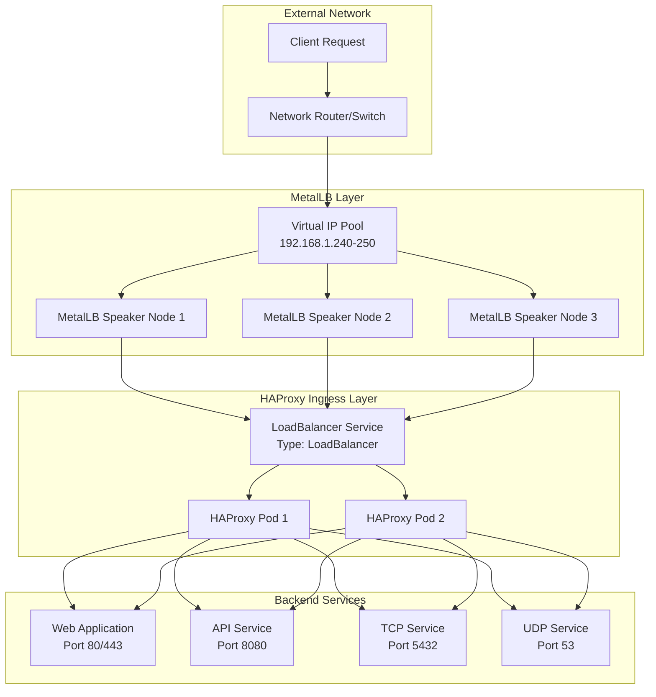
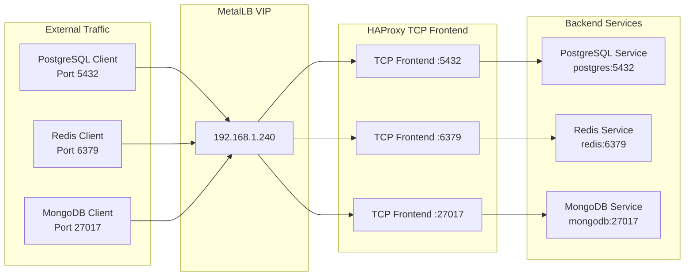
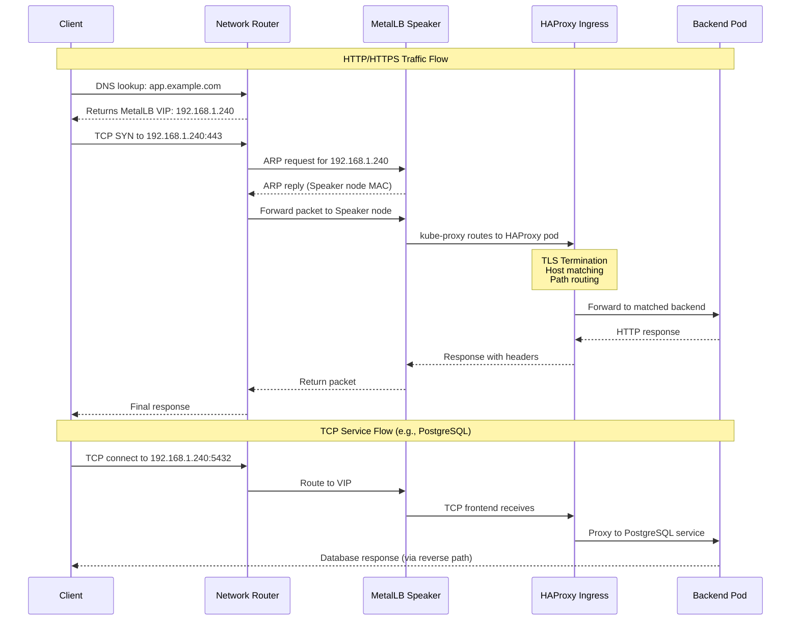

# How to Configure MetalLB with HAProxy Ingress

Author: [nawazdhandala](https://github.com/nawazdhandala)

Tags: MetalLB, HAProxy, Ingress, Kubernetes, Load Balancing

Description: Learn how to use MetalLB with HAProxy Ingress Controller for advanced load balancing.

---

## Introduction

When running Kubernetes in bare-metal environments, you lack the luxury of cloud provider load balancers. This is where MetalLB comes in, providing a network load balancer implementation that integrates with standard network equipment. Paired with HAProxy Ingress Controller, you get a powerful, production-ready solution for routing external traffic to your services.

HAProxy Ingress Controller offers advanced features like TCP/UDP load balancing, connection draining, rate limiting, and sophisticated health checking that make it an excellent choice for demanding workloads.

## Architecture Overview

Before diving into the configuration, let's understand how MetalLB and HAProxy Ingress work together:



## Prerequisites

Before starting, ensure you have:

- A Kubernetes cluster (v1.25+) running on bare-metal or in an environment without cloud load balancer support
- `kubectl` configured with cluster admin access
- Helm v3 installed
- MetalLB already installed and configured (see our MetalLB installation guide)

## Step 1: Configure MetalLB IP Address Pool

First, we need to define an IP address pool that MetalLB will use to assign external IPs to LoadBalancer services. This pool should be from a range that your network can route to.

The following configuration creates an IP pool and an L2 advertisement policy. L2 mode works by responding to ARP requests on the local network.

```yaml
# metallb-config.yaml
# This configuration sets up MetalLB with a pool of IP addresses
# for LoadBalancer services. The L2Advertisement tells MetalLB
# to use Layer 2 mode (ARP/NDP) to advertise these IPs.
apiVersion: metallb.io/v1beta1
kind: IPAddressPool
metadata:
  name: haproxy-pool
  namespace: metallb-system
spec:
  # Define the IP range available for LoadBalancer services
  # Adjust this range to match your network configuration
  addresses:
  - 192.168.1.240-192.168.1.250
  # autoAssign defaults to true, allowing automatic IP assignment
  autoAssign: true
---
apiVersion: metallb.io/v1beta1
kind: L2Advertisement
metadata:
  name: haproxy-l2-advertisement
  namespace: metallb-system
spec:
  # Reference the IP pool we created above
  ipAddressPools:
  - haproxy-pool
  # Optional: specify which interfaces to advertise on
  # interfaces:
  # - eth0
```

Apply the MetalLB configuration:

```bash
# Apply the MetalLB IP pool and L2 advertisement configuration
kubectl apply -f metallb-config.yaml
```

## Step 2: Install HAProxy Ingress Controller

We'll use Helm to deploy HAProxy Ingress Controller. First, add the HAProxy Helm repository:

```bash
# Add the HAProxy Ingress Controller Helm repository
helm repo add haproxytech https://haproxytech.github.io/helm-charts

# Update local Helm repository cache to get the latest charts
helm repo update
```

Now create a custom values file for HAProxy Ingress. This configuration is optimized for use with MetalLB:

```yaml
# haproxy-values.yaml
# This values file configures HAProxy Ingress Controller
# for production use with MetalLB load balancing.

controller:
  # Set the service type to LoadBalancer so MetalLB assigns an external IP
  service:
    type: LoadBalancer

    # Annotations for MetalLB to select the correct IP pool
    annotations:
      metallb.universe.tf/address-pool: haproxy-pool
      # Optional: request a specific IP from the pool
      # metallb.universe.tf/loadBalancerIPs: 192.168.1.240

    # Enable externalTrafficPolicy: Local to preserve client source IP
    # This prevents additional network hops and maintains client IP visibility
    externalTrafficPolicy: Local

    # Define the ports HAProxy will listen on
    # HTTP port 80 and HTTPS port 443 are standard
    ports:
      http: 80
      https: 443
      # Stats port for HAProxy statistics page
      stat: 1024

  # Run multiple replicas for high availability
  replicaCount: 2

  # Resource requests and limits for the HAProxy pods
  # Adjust these based on your expected traffic load
  resources:
    requests:
      cpu: 500m
      memory: 512Mi
    limits:
      cpu: 2000m
      memory: 2Gi

  # Pod anti-affinity to spread replicas across nodes
  # This ensures high availability if a node fails
  affinity:
    podAntiAffinity:
      preferredDuringSchedulingIgnoredDuringExecution:
      - weight: 100
        podAffinityTerm:
          labelSelector:
            matchLabels:
              app.kubernetes.io/name: haproxy-ingress
          topologyKey: kubernetes.io/hostname

  # Enable the default backend for handling unmatched requests
  defaultBackendService: default/default-backend

  # Logging configuration for troubleshooting and monitoring
  logging:
    level: info
    # Enable access logs for debugging traffic issues
    traffic: true

  # Ingress class configuration
  # This allows multiple ingress controllers in the same cluster
  ingressClass: haproxy
  ingressClassResource:
    name: haproxy
    enabled: true
    default: false
    controllerValue: haproxy.org/ingress-controller
```

Install HAProxy Ingress Controller using Helm:

```bash
# Create a dedicated namespace for the ingress controller
kubectl create namespace haproxy-ingress

# Install HAProxy Ingress Controller with our custom configuration
# The --wait flag ensures Helm waits for pods to be ready
helm install haproxy-ingress haproxytech/kubernetes-ingress \
  --namespace haproxy-ingress \
  --values haproxy-values.yaml \
  --wait
```

Verify the installation and check that MetalLB has assigned an external IP:

```bash
# Check the HAProxy Ingress service status
# The EXTERNAL-IP column should show an IP from the MetalLB pool
kubectl get svc -n haproxy-ingress

# Expected output:
# NAME                        TYPE           CLUSTER-IP      EXTERNAL-IP     PORT(S)
# haproxy-ingress-controller  LoadBalancer   10.96.x.x       192.168.1.240   80:3xxxx/TCP,443:3xxxx/TCP

# Verify the pods are running
kubectl get pods -n haproxy-ingress
```

## Step 3: Configure Backend Services

Let's deploy a sample application to demonstrate HAProxy Ingress routing. We'll create a simple web application with multiple backends:

```yaml
# sample-app.yaml
# This deploys a sample web application with multiple replicas
# to demonstrate HAProxy Ingress load balancing capabilities.
apiVersion: apps/v1
kind: Deployment
metadata:
  name: web-app
  namespace: default
  labels:
    app: web-app
spec:
  # Run 3 replicas for load distribution
  replicas: 3
  selector:
    matchLabels:
      app: web-app
  template:
    metadata:
      labels:
        app: web-app
    spec:
      containers:
      - name: web-app
        # Using nginx as a simple web server
        image: nginx:1.25-alpine
        ports:
        - containerPort: 80
          name: http
        # Resource limits to prevent runaway containers
        resources:
          requests:
            cpu: 100m
            memory: 128Mi
          limits:
            cpu: 500m
            memory: 256Mi
        # Liveness probe to detect container health
        livenessProbe:
          httpGet:
            path: /
            port: 80
          initialDelaySeconds: 10
          periodSeconds: 10
        # Readiness probe to control when pod receives traffic
        readinessProbe:
          httpGet:
            path: /
            port: 80
          initialDelaySeconds: 5
          periodSeconds: 5
---
# ClusterIP service to expose the deployment internally
# HAProxy Ingress will route traffic to this service
apiVersion: v1
kind: Service
metadata:
  name: web-app
  namespace: default
spec:
  type: ClusterIP
  selector:
    app: web-app
  ports:
  - port: 80
    targetPort: 80
    protocol: TCP
    name: http
```

Now create an Ingress resource to expose the application through HAProxy:

```yaml
# web-ingress.yaml
# This Ingress resource configures HAProxy to route traffic
# to our web-app service based on hostname matching.
apiVersion: networking.k8s.io/v1
kind: Ingress
metadata:
  name: web-app-ingress
  namespace: default
  annotations:
    # Specify which ingress controller should handle this resource
    kubernetes.io/ingress.class: haproxy

    # HAProxy-specific annotations for fine-tuned control
    # Enable SSL redirect for security
    haproxy.org/ssl-redirect: "true"

    # Set backend server timeout (in seconds)
    haproxy.org/timeout-server: "60s"

    # Set client timeout for slow clients
    haproxy.org/timeout-client: "60s"

    # Enable request rate limiting (10 requests per second)
    haproxy.org/rate-limit-requests: "10"

    # Configure health check path for backend servers
    haproxy.org/check: "true"
    haproxy.org/check-http: "/health"
    haproxy.org/check-interval: "5s"

    # Enable access logging for this ingress
    haproxy.org/access-log: "true"
spec:
  ingressClassName: haproxy
  # TLS configuration for HTTPS
  tls:
  - hosts:
    - app.example.com
    secretName: app-tls-secret
  rules:
  # Route based on hostname
  - host: app.example.com
    http:
      paths:
      # Root path routes to web-app service
      - path: /
        pathType: Prefix
        backend:
          service:
            name: web-app
            port:
              number: 80
```

Apply the backend configuration:

```bash
# Deploy the sample application
kubectl apply -f sample-app.yaml

# Create the ingress routing rules
kubectl apply -f web-ingress.yaml

# Verify the ingress is configured correctly
kubectl get ingress web-app-ingress
```

## Step 4: Configure TCP/UDP Services

HAProxy Ingress supports TCP and UDP load balancing through ConfigMaps. This is essential for services like databases, message queues, or DNS servers.

### TCP Services Configuration

The following diagram shows how TCP traffic flows through the system:



First, deploy the TCP services (PostgreSQL and Redis as examples):

```yaml
# tcp-services.yaml
# Deploy PostgreSQL and Redis for TCP load balancing demonstration.
# These services will be exposed through HAProxy TCP frontends.
apiVersion: apps/v1
kind: Deployment
metadata:
  name: postgresql
  namespace: default
spec:
  replicas: 1
  selector:
    matchLabels:
      app: postgresql
  template:
    metadata:
      labels:
        app: postgresql
    spec:
      containers:
      - name: postgresql
        image: postgres:15-alpine
        ports:
        - containerPort: 5432
        env:
        # Set PostgreSQL password via environment variable
        - name: POSTGRES_PASSWORD
          valueFrom:
            secretKeyRef:
              name: postgres-secret
              key: password
        resources:
          requests:
            cpu: 250m
            memory: 512Mi
          limits:
            cpu: 1000m
            memory: 1Gi
---
apiVersion: v1
kind: Service
metadata:
  name: postgresql
  namespace: default
spec:
  type: ClusterIP
  selector:
    app: postgresql
  ports:
  - port: 5432
    targetPort: 5432
    protocol: TCP
---
apiVersion: apps/v1
kind: Deployment
metadata:
  name: redis
  namespace: default
spec:
  replicas: 1
  selector:
    matchLabels:
      app: redis
  template:
    metadata:
      labels:
        app: redis
    spec:
      containers:
      - name: redis
        image: redis:7-alpine
        ports:
        - containerPort: 6379
        resources:
          requests:
            cpu: 100m
            memory: 128Mi
          limits:
            cpu: 500m
            memory: 256Mi
---
apiVersion: v1
kind: Service
metadata:
  name: redis
  namespace: default
spec:
  type: ClusterIP
  selector:
    app: redis
  ports:
  - port: 6379
    targetPort: 6379
    protocol: TCP
```

Create the TCP services ConfigMap for HAProxy:

```yaml
# haproxy-tcp-configmap.yaml
# This ConfigMap configures HAProxy to load balance TCP services.
# Format: <external-port>: <namespace>/<service-name>:<service-port>
apiVersion: v1
kind: ConfigMap
metadata:
  name: haproxy-ingress-tcp
  namespace: haproxy-ingress
data:
  # PostgreSQL: External port 5432 maps to postgresql service
  "5432": "default/postgresql:5432"
  # Redis: External port 6379 maps to redis service
  "6379": "default/redis:6379"
```

### UDP Services Configuration

For UDP services (like DNS), create a separate ConfigMap:

```yaml
# udp-service.yaml
# Deploy CoreDNS as a UDP service demonstration.
apiVersion: apps/v1
kind: Deployment
metadata:
  name: coredns-custom
  namespace: default
spec:
  replicas: 2
  selector:
    matchLabels:
      app: coredns-custom
  template:
    metadata:
      labels:
        app: coredns-custom
    spec:
      containers:
      - name: coredns
        image: coredns/coredns:1.11.1
        args: ["-conf", "/etc/coredns/Corefile"]
        ports:
        - containerPort: 53
          protocol: UDP
          name: dns-udp
        - containerPort: 53
          protocol: TCP
          name: dns-tcp
        volumeMounts:
        - name: config-volume
          mountPath: /etc/coredns
        resources:
          requests:
            cpu: 100m
            memory: 70Mi
          limits:
            cpu: 200m
            memory: 170Mi
      volumes:
      - name: config-volume
        configMap:
          name: coredns-custom-config
---
apiVersion: v1
kind: ConfigMap
metadata:
  name: coredns-custom-config
  namespace: default
data:
  Corefile: |
    .:53 {
        # Forward DNS queries to upstream servers
        forward . 8.8.8.8 8.8.4.4
        # Enable logging
        log
        # Handle errors
        errors
        # Enable caching
        cache 30
    }
---
apiVersion: v1
kind: Service
metadata:
  name: coredns-custom
  namespace: default
spec:
  type: ClusterIP
  selector:
    app: coredns-custom
  ports:
  - port: 53
    targetPort: 53
    protocol: UDP
    name: dns-udp
  - port: 53
    targetPort: 53
    protocol: TCP
    name: dns-tcp
```

Create the UDP services ConfigMap:

```yaml
# haproxy-udp-configmap.yaml
# This ConfigMap configures HAProxy to load balance UDP services.
# Note: UDP support requires HAProxy 2.3+ and specific configuration.
apiVersion: v1
kind: ConfigMap
metadata:
  name: haproxy-ingress-udp
  namespace: haproxy-ingress
data:
  # DNS: External port 53 maps to coredns-custom service
  "53": "default/coredns-custom:53"
```

Update the HAProxy Ingress Helm values to include TCP/UDP ConfigMaps:

```yaml
# haproxy-values-tcp-udp.yaml
# Extended values file with TCP and UDP service support.
controller:
  service:
    type: LoadBalancer
    annotations:
      metallb.universe.tf/address-pool: haproxy-pool
    externalTrafficPolicy: Local

    # Additional ports for TCP services
    tcpPorts:
      - name: postgresql
        port: 5432
        targetPort: 5432
      - name: redis
        port: 6379
        targetPort: 6379

    # Additional ports for UDP services
    udpPorts:
      - name: dns
        port: 53
        targetPort: 53

  # Reference the TCP/UDP ConfigMaps
  tcpServices:
    configMapName: haproxy-ingress-tcp
  udpServices:
    configMapName: haproxy-ingress-udp

  replicaCount: 2
  resources:
    requests:
      cpu: 500m
      memory: 512Mi
    limits:
      cpu: 2000m
      memory: 2Gi
```

Apply all TCP/UDP configurations:

```bash
# Deploy TCP services
kubectl apply -f tcp-services.yaml

# Deploy UDP service
kubectl apply -f udp-service.yaml

# Create TCP ConfigMap
kubectl apply -f haproxy-tcp-configmap.yaml

# Create UDP ConfigMap
kubectl apply -f haproxy-udp-configmap.yaml

# Upgrade HAProxy Ingress with TCP/UDP support
helm upgrade haproxy-ingress haproxytech/kubernetes-ingress \
  --namespace haproxy-ingress \
  --values haproxy-values-tcp-udp.yaml \
  --wait
```

## Step 5: Performance Tuning

HAProxy is highly configurable for performance. Here's a comprehensive configuration for production workloads:

```yaml
# haproxy-performance-values.yaml
# Production-grade HAProxy configuration with performance tuning.
controller:
  service:
    type: LoadBalancer
    annotations:
      metallb.universe.tf/address-pool: haproxy-pool
    externalTrafficPolicy: Local

  replicaCount: 3

  # Production resource allocation
  resources:
    requests:
      cpu: 1000m
      memory: 1Gi
    limits:
      cpu: 4000m
      memory: 4Gi

  # Custom HAProxy configuration for performance
  config:
    # Global settings for HAProxy performance
    # Maximum concurrent connections per process
    maxconn: "100000"

    # Number of threads (match to CPU cores)
    nbthread: "4"

    # Timeout configurations (in milliseconds)
    # Client connection timeout
    timeout-connect: "5000"
    # Client inactivity timeout
    timeout-client: "50000"
    # Server response timeout
    timeout-server: "50000"
    # Keep-alive timeout for persistent connections
    timeout-http-keep-alive: "60000"
    # HTTP request timeout
    timeout-http-request: "10000"
    # Queue timeout for requests waiting for a server
    timeout-queue: "30000"

    # Connection settings
    # Enable TCP keep-alive for long-lived connections
    syslog-server: "address:stdout, format:raw, facility:daemon"

    # Load balancing algorithm
    # roundrobin: Equal distribution (default)
    # leastconn: Prefer servers with fewer connections
    # source: Hash based on client IP (sticky sessions)
    load-balance: "leastconn"

    # Enable connection reuse for backend efficiency
    http-reuse: "safe"

    # Enable HTTP/2 for improved performance
    ssl-options: "no-sslv3 no-tlsv10 no-tlsv11"
    ssl-redirect: "true"

    # Enable HSTS for security
    hsts: "true"
    hsts-max-age: "31536000"
    hsts-include-subdomains: "true"

    # Compression settings to reduce bandwidth
    compression-algo: "gzip"
    compression-type: "text/html text/plain text/css application/javascript application/json"

    # Backend health check settings
    backend-check-interval: "5000"
    health-check-rise: "2"
    health-check-fall: "3"

  # Pod disruption budget for high availability
  podDisruptionBudget:
    enabled: true
    minAvailable: 2

  # Horizontal Pod Autoscaler for dynamic scaling
  autoscaling:
    enabled: true
    minReplicas: 3
    maxReplicas: 10
    targetCPUUtilizationPercentage: 70
    targetMemoryUtilizationPercentage: 80

  # Pod anti-affinity for spreading across nodes
  affinity:
    podAntiAffinity:
      requiredDuringSchedulingIgnoredDuringExecution:
      - labelSelector:
          matchLabels:
            app.kubernetes.io/name: haproxy-ingress
        topologyKey: kubernetes.io/hostname

  # Topology spread constraints for zone awareness
  topologySpreadConstraints:
  - maxSkew: 1
    topologyKey: topology.kubernetes.io/zone
    whenUnsatisfiable: DoNotSchedule
    labelSelector:
      matchLabels:
        app.kubernetes.io/name: haproxy-ingress
```

### Advanced Backend Configuration with Annotations

For fine-grained control over individual backends, use HAProxy Ingress annotations:

```yaml
# advanced-ingress.yaml
# Advanced Ingress configuration with performance-tuned annotations.
apiVersion: networking.k8s.io/v1
kind: Ingress
metadata:
  name: advanced-web-ingress
  namespace: default
  annotations:
    kubernetes.io/ingress.class: haproxy

    # Connection and timeout tuning
    # Maximum connections to backend
    haproxy.org/backend-config-snippet: |
      # Limit concurrent connections per backend server
      default-server maxconn 100
      # Enable HTTP connection reuse
      http-reuse safe
      # Set queue timeout
      timeout queue 30s

    # Load balancing configuration
    # Use least connections algorithm for better distribution
    haproxy.org/load-balance: "leastconn"

    # Sticky sessions using cookies
    # Useful for stateful applications
    haproxy.org/cookie-persistence: "mycookie"
    haproxy.org/cookie-indirect: "true"
    haproxy.org/cookie-nocache: "true"

    # Rate limiting for DDoS protection
    # Limit to 100 requests per 10 seconds per IP
    haproxy.org/rate-limit-requests: "100"
    haproxy.org/rate-limit-period: "10s"

    # Connection limits
    haproxy.org/maxconn: "5000"

    # Backend server health checks
    haproxy.org/check: "true"
    haproxy.org/check-interval: "3s"
    haproxy.org/check-fall: "3"
    haproxy.org/check-rise: "2"

    # Enable gzip compression
    haproxy.org/response-compress: "true"

    # Request buffering for large uploads
    haproxy.org/request-buffer-size: "16384"

    # Whitelist trusted IPs (optional)
    # haproxy.org/whitelist: "10.0.0.0/8, 192.168.0.0/16"

    # Custom headers for security
    haproxy.org/headers: |
      X-Frame-Options: DENY
      X-Content-Type-Options: nosniff
      X-XSS-Protection: 1; mode=block
spec:
  ingressClassName: haproxy
  tls:
  - hosts:
    - advanced.example.com
    secretName: advanced-tls-secret
  rules:
  - host: advanced.example.com
    http:
      paths:
      - path: /
        pathType: Prefix
        backend:
          service:
            name: web-app
            port:
              number: 80
```

Apply the performance configuration:

```bash
# Upgrade HAProxy with performance tuning
helm upgrade haproxy-ingress haproxytech/kubernetes-ingress \
  --namespace haproxy-ingress \
  --values haproxy-performance-values.yaml \
  --wait

# Apply the advanced ingress configuration
kubectl apply -f advanced-ingress.yaml
```

## Step 6: Monitoring and Observability

Enable HAProxy stats page and Prometheus metrics for monitoring:

```yaml
# haproxy-monitoring-values.yaml
# Enable monitoring capabilities for HAProxy Ingress.
controller:
  service:
    type: LoadBalancer
    annotations:
      metallb.universe.tf/address-pool: haproxy-pool

  # Enable the HAProxy stats page
  stats:
    enabled: true
    port: 1024
    # Optional: Enable authentication for stats page
    # auth:
    #   username: admin
    #   password: admin123

  # Enable Prometheus metrics endpoint
  metrics:
    enabled: true
    service:
      # Create a separate service for metrics scraping
      enabled: true
      port: 9101
      annotations:
        prometheus.io/scrape: "true"
        prometheus.io/port: "9101"

  # ServiceMonitor for Prometheus Operator
  serviceMonitor:
    enabled: true
    namespace: monitoring
    labels:
      release: prometheus
    interval: 30s
    scrapeTimeout: 10s
```

Create a Grafana dashboard ConfigMap for HAProxy metrics visualization:

```yaml
# haproxy-dashboard-configmap.yaml
# Grafana dashboard configuration for HAProxy metrics.
apiVersion: v1
kind: ConfigMap
metadata:
  name: haproxy-grafana-dashboard
  namespace: monitoring
  labels:
    grafana_dashboard: "1"
data:
  haproxy-dashboard.json: |
    {
      "title": "HAProxy Ingress Dashboard",
      "description": "HAProxy Ingress Controller metrics",
      "panels": [
        {
          "title": "Requests per Second",
          "type": "graph",
          "targets": [
            {
              "expr": "rate(haproxy_frontend_http_requests_total[5m])",
              "legendFormat": "{{frontend}}"
            }
          ]
        },
        {
          "title": "Active Connections",
          "type": "gauge",
          "targets": [
            {
              "expr": "haproxy_frontend_current_sessions",
              "legendFormat": "{{frontend}}"
            }
          ]
        },
        {
          "title": "Backend Response Time",
          "type": "graph",
          "targets": [
            {
              "expr": "haproxy_backend_http_response_time_average_seconds",
              "legendFormat": "{{backend}}"
            }
          ]
        },
        {
          "title": "Error Rate",
          "type": "graph",
          "targets": [
            {
              "expr": "rate(haproxy_backend_http_responses_total{code=~\"5..\"}[5m])",
              "legendFormat": "{{backend}} 5xx"
            }
          ]
        }
      ]
    }
```

## Complete Traffic Flow

The following diagram shows the complete traffic flow from external clients through MetalLB and HAProxy to backend services:



## Troubleshooting

### Common Issues and Solutions

**Issue 1: MetalLB not assigning external IP**

```bash
# Check MetalLB speaker logs for errors
kubectl logs -n metallb-system -l app=metallb-speaker

# Verify IP address pool configuration
kubectl get ipaddresspool -n metallb-system -o yaml

# Check if the pool has available addresses
kubectl get svc -A | grep LoadBalancer | grep pending
```

**Issue 2: HAProxy not routing traffic correctly**

```bash
# Check HAProxy Ingress controller logs
kubectl logs -n haproxy-ingress -l app.kubernetes.io/name=haproxy-ingress

# Verify the Ingress resource is created correctly
kubectl describe ingress <ingress-name>

# Check HAProxy configuration
kubectl exec -n haproxy-ingress <pod-name> -- cat /etc/haproxy/haproxy.cfg
```

**Issue 3: TCP/UDP services not accessible**

```bash
# Verify the ConfigMaps are created
kubectl get configmap -n haproxy-ingress

# Check that ports are exposed on the LoadBalancer service
kubectl get svc -n haproxy-ingress -o yaml

# Test TCP connectivity
nc -zv <external-ip> <port>
```

## Best Practices

1. **High Availability**: Always run at least 2-3 HAProxy replicas with pod anti-affinity rules

2. **Resource Allocation**: Set appropriate resource requests and limits based on expected traffic

3. **Health Checks**: Configure proper health check endpoints for all backend services

4. **TLS**: Always use TLS termination at the ingress level for external traffic

5. **Monitoring**: Enable Prometheus metrics and set up alerts for key metrics

6. **Rate Limiting**: Implement rate limiting to protect against DDoS attacks

7. **Connection Timeouts**: Configure appropriate timeouts to handle slow clients and backends

8. **IP Preservation**: Use `externalTrafficPolicy: Local` to preserve client source IPs

## Conclusion

Combining MetalLB with HAProxy Ingress provides a robust, production-ready solution for exposing Kubernetes services in bare-metal environments. MetalLB handles the Layer 4 load balancing and IP advertisement, while HAProxy Ingress provides advanced Layer 7 routing, TCP/UDP load balancing, and extensive performance tuning options.

This setup gives you:
- External IP management without cloud provider dependency
- Advanced HTTP routing with host and path-based rules
- TCP and UDP service exposure for databases and DNS
- Fine-grained performance tuning
- High availability through multiple replicas
- Comprehensive monitoring capabilities

For production deployments, ensure you follow the best practices outlined above and regularly monitor your ingress controller performance to maintain optimal service delivery.

## Additional Resources

- [MetalLB Documentation](https://metallb.universe.tf/)
- [HAProxy Ingress Controller Documentation](https://www.haproxy.com/documentation/kubernetes-ingress/)
- [HAProxy Configuration Manual](https://www.haproxy.com/documentation/haproxy-configuration-manual/)
- [Kubernetes Ingress Documentation](https://kubernetes.io/docs/concepts/services-networking/ingress/)
