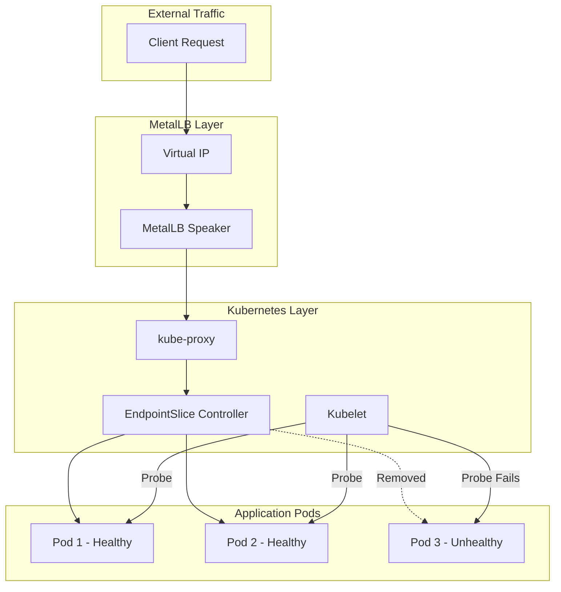

# How to Configure Health Checks for MetalLB-Exposed Services

Author: [nawazdhandala](https://github.com/nawazdhandala)

Tags: MetalLB, Kubernetes, Health Checks, Load Balancing, Reliability, Monitoring, High Availability

Description: Learn how to configure health checks for MetalLB-exposed services to ensure traffic only reaches healthy endpoints.

---

MetalLB provides load balancer services for bare-metal Kubernetes clusters, but it does not perform health checks on backend pods itself. Instead, it relies on Kubernetes' built-in health checking mechanisms to ensure traffic only reaches healthy endpoints. This guide covers how to properly configure liveness probes, readiness probes, and external health check solutions to create a robust, self-healing service architecture with MetalLB.

---

## Understanding the Health Check Architecture

MetalLB operates at Layer 2 (ARP) or Layer 4 (BGP) of the network stack, announcing IP addresses for LoadBalancer services. The actual traffic routing to healthy pods happens through kube-proxy, which uses the endpoints maintained by the Kubernetes control plane.

The following diagram illustrates how health checks flow through the system:



When a pod fails its readiness probe, the EndpointSlice controller removes it from the service endpoints. kube-proxy then updates its routing rules, and traffic stops flowing to the unhealthy pod. MetalLB continues announcing the service IP, but the unhealthy pod is automatically excluded from the backend pool.

---

## Configuring Kubernetes Health Probes

### Readiness Probes for Traffic Management

Readiness probes determine whether a pod should receive traffic. When a readiness probe fails, the pod is removed from service endpoints but continues running. This is the primary mechanism for ensuring MetalLB-exposed services only route to healthy backends.

This deployment configuration shows a complete readiness probe setup for a web application:

```yaml
apiVersion: apps/v1
kind: Deployment
metadata:
  name: web-application
  namespace: production
spec:
  replicas: 3
  selector:
    matchLabels:
      app: web-application
  template:
    metadata:
      labels:
        app: web-application
    spec:
      containers:
      - name: app
        image: myapp:v1.0.0
        ports:
        - containerPort: 8080
          name: http
        readinessProbe:
          httpGet:
            path: /health/ready
            port: 8080
            httpHeaders:
            - name: X-Health-Check
              value: "kubernetes"
          initialDelaySeconds: 10
          periodSeconds: 5
          timeoutSeconds: 3
          successThreshold: 1
          failureThreshold: 3
```

The readiness probe configuration parameters control the health check behavior:
- `initialDelaySeconds`: Wait time before the first probe (10 seconds allows for application startup)
- `periodSeconds`: Frequency of health checks (5 seconds provides quick detection)
- `timeoutSeconds`: Maximum time to wait for a response (3 seconds prevents hung connections)
- `successThreshold`: Consecutive successes required to mark as ready (1 success is sufficient)
- `failureThreshold`: Consecutive failures before marking as not ready (3 failures prevents flapping)

### Liveness Probes for Container Recovery

Liveness probes determine whether a container should be restarted. While readiness probes control traffic routing, liveness probes handle container lifecycle management.

This configuration adds a liveness probe alongside the readiness probe:

```yaml
apiVersion: apps/v1
kind: Deployment
metadata:
  name: web-application
  namespace: production
spec:
  replicas: 3
  selector:
    matchLabels:
      app: web-application
  template:
    metadata:
      labels:
        app: web-application
    spec:
      containers:
      - name: app
        image: myapp:v1.0.0
        ports:
        - containerPort: 8080
          name: http
        livenessProbe:
          httpGet:
            path: /health/live
            port: 8080
          initialDelaySeconds: 30
          periodSeconds: 10
          timeoutSeconds: 5
          failureThreshold: 3
        readinessProbe:
          httpGet:
            path: /health/ready
            port: 8080
          initialDelaySeconds: 10
          periodSeconds: 5
          timeoutSeconds: 3
          failureThreshold: 3
```

The liveness probe has different timing because restarting a container is more disruptive than removing it from traffic:
- Longer `initialDelaySeconds` (30 seconds) prevents premature restarts during startup
- Longer `periodSeconds` (10 seconds) reduces unnecessary restarts
- Higher `timeoutSeconds` (5 seconds) accommodates slower health endpoints

### Startup Probes for Slow-Starting Applications

For applications with variable startup times, startup probes prevent liveness probes from killing containers before they are ready.

This configuration uses a startup probe to protect slow-starting applications:

```yaml
apiVersion: apps/v1
kind: Deployment
metadata:
  name: java-application
  namespace: production
spec:
  replicas: 3
  selector:
    matchLabels:
      app: java-application
  template:
    metadata:
      labels:
        app: java-application
    spec:
      containers:
      - name: app
        image: java-app:v2.0.0
        ports:
        - containerPort: 8080
          name: http
        startupProbe:
          httpGet:
            path: /health/started
            port: 8080
          initialDelaySeconds: 0
          periodSeconds: 5
          timeoutSeconds: 3
          failureThreshold: 60
        livenessProbe:
          httpGet:
            path: /health/live
            port: 8080
          periodSeconds: 10
          timeoutSeconds: 5
          failureThreshold: 3
        readinessProbe:
          httpGet:
            path: /health/ready
            port: 8080
          periodSeconds: 5
          timeoutSeconds: 3
          failureThreshold: 3
```

The startup probe configuration allows up to 5 minutes (60 failures * 5 seconds) for the application to start. Once the startup probe succeeds, liveness and readiness probes take over.

---

## Creating the MetalLB LoadBalancer Service

The service definition connects your deployment to MetalLB and configures how traffic is distributed to healthy pods.

This service configuration exposes the application through MetalLB:

```yaml
apiVersion: v1
kind: Service
metadata:
  name: web-application
  namespace: production
  annotations:
    metallb.universe.tf/loadBalancerIPs: 192.168.1.100
spec:
  type: LoadBalancer
  selector:
    app: web-application
  ports:
  - name: http
    port: 80
    targetPort: 8080
    protocol: TCP
  sessionAffinity: None
  externalTrafficPolicy: Local
```

The `externalTrafficPolicy: Local` setting is important for health checking:
- With `Local`, traffic only goes to pods on the same node as the receiving endpoint
- This preserves the client source IP and enables node-level health checks
- Nodes without healthy pods will not receive traffic

---

## Implementing Application Health Endpoints

### Basic Health Endpoint Implementation

Your application must expose health endpoints that accurately reflect its operational status.

This Node.js example implements separate liveness and readiness endpoints:

```javascript
const express = require('express');
const app = express();

let isReady = false;
let dbConnection = null;
let cacheConnection = null;

app.get('/health/live', (req, res) => {
  res.status(200).json({ status: 'alive', timestamp: new Date().toISOString() });
});

app.get('/health/ready', async (req, res) => {
  const checks = {
    database: false,
    cache: false,
    initialized: isReady
  };

  try {
    await dbConnection.query('SELECT 1');
    checks.database = true;
  } catch (err) {
    console.error('Database health check failed:', err.message);
  }

  try {
    await cacheConnection.ping();
    checks.cache = true;
  } catch (err) {
    console.error('Cache health check failed:', err.message);
  }

  const allHealthy = Object.values(checks).every(status => status === true);

  if (allHealthy) {
    res.status(200).json({ status: 'ready', checks });
  } else {
    res.status(503).json({ status: 'not ready', checks });
  }
});

app.get('/health/started', (req, res) => {
  if (isReady) {
    res.status(200).json({ status: 'started' });
  } else {
    res.status(503).json({ status: 'starting' });
  }
});
```

### Go Health Endpoint Implementation

This Go implementation provides a structured approach to health checking with dependency verification:

```go
package main

import (
    "context"
    "encoding/json"
    "net/http"
    "sync"
    "time"
)

type HealthChecker struct {
    db    *sql.DB
    redis *redis.Client
    ready bool
    mu    sync.RWMutex
}

type HealthStatus struct {
    Status    string            `json:"status"`
    Checks    map[string]bool   `json:"checks,omitempty"`
    Timestamp string            `json:"timestamp"`
}

func (h *HealthChecker) LivenessHandler(w http.ResponseWriter, r *http.Request) {
    status := HealthStatus{
        Status:    "alive",
        Timestamp: time.Now().UTC().Format(time.RFC3339),
    }
    w.Header().Set("Content-Type", "application/json")
    json.NewEncoder(w).Encode(status)
}

func (h *HealthChecker) ReadinessHandler(w http.ResponseWriter, r *http.Request) {
    ctx, cancel := context.WithTimeout(r.Context(), 2*time.Second)
    defer cancel()

    checks := make(map[string]bool)

    h.mu.RLock()
    checks["initialized"] = h.ready
    h.mu.RUnlock()

    if err := h.db.PingContext(ctx); err == nil {
        checks["database"] = true
    } else {
        checks["database"] = false
    }

    if err := h.redis.Ping(ctx).Err(); err == nil {
        checks["cache"] = true
    } else {
        checks["cache"] = false
    }

    allHealthy := true
    for _, healthy := range checks {
        if !healthy {
            allHealthy = false
            break
        }
    }

    status := HealthStatus{
        Checks:    checks,
        Timestamp: time.Now().UTC().Format(time.RFC3339),
    }

    w.Header().Set("Content-Type", "application/json")
    if allHealthy {
        status.Status = "ready"
        w.WriteHeader(http.StatusOK)
    } else {
        status.Status = "not ready"
        w.WriteHeader(http.StatusServiceUnavailable)
    }
    json.NewEncoder(w).Encode(status)
}
```

### Python FastAPI Health Endpoints

This FastAPI implementation shows async health checking with connection pooling awareness:

```python
from fastapi import FastAPI, Response
from datetime import datetime
import asyncio
from typing import Dict, Any

app = FastAPI()

class HealthChecker:
    def __init__(self, db_pool, redis_client):
        self.db_pool = db_pool
        self.redis_client = redis_client
        self.is_ready = False

    async def check_database(self) -> bool:
        try:
            async with self.db_pool.acquire() as conn:
                await conn.fetchval('SELECT 1')
            return True
        except Exception:
            return False

    async def check_redis(self) -> bool:
        try:
            await self.redis_client.ping()
            return True
        except Exception:
            return False

health_checker: HealthChecker = None

@app.get("/health/live")
async def liveness():
    return {"status": "alive", "timestamp": datetime.utcnow().isoformat()}

@app.get("/health/ready")
async def readiness(response: Response):
    checks = {
        "initialized": health_checker.is_ready,
        "database": await health_checker.check_database(),
        "cache": await health_checker.check_redis()
    }

    all_healthy = all(checks.values())

    result = {
        "status": "ready" if all_healthy else "not ready",
        "checks": checks,
        "timestamp": datetime.utcnow().isoformat()
    }

    if not all_healthy:
        response.status_code = 503

    return result

@app.get("/health/started")
async def startup_check(response: Response):
    if health_checker and health_checker.is_ready:
        return {"status": "started"}
    response.status_code = 503
    return {"status": "starting"}
```

---

## Advanced Health Check Patterns

### Graceful Shutdown with Health Checks

When a pod is terminating, it should immediately fail health checks to stop receiving new traffic while processing existing requests.

This deployment adds lifecycle hooks and a preStop handler for graceful shutdown:

```yaml
apiVersion: apps/v1
kind: Deployment
metadata:
  name: graceful-app
  namespace: production
spec:
  replicas: 3
  selector:
    matchLabels:
      app: graceful-app
  template:
    metadata:
      labels:
        app: graceful-app
    spec:
      terminationGracePeriodSeconds: 60
      containers:
      - name: app
        image: myapp:v1.0.0
        ports:
        - containerPort: 8080
        lifecycle:
          preStop:
            httpGet:
              path: /shutdown
              port: 8080
        readinessProbe:
          httpGet:
            path: /health/ready
            port: 8080
          periodSeconds: 2
          failureThreshold: 1
```

The application should handle the shutdown signal appropriately:

```javascript
let isShuttingDown = false;

app.get('/shutdown', (req, res) => {
  console.log('Received shutdown signal');
  isShuttingDown = true;
  res.status(200).send('Shutting down');
});

app.get('/health/ready', (req, res) => {
  if (isShuttingDown) {
    return res.status(503).json({ status: 'shutting down' });
  }
  res.status(200).json({ status: 'ready' });
});

process.on('SIGTERM', async () => {
  console.log('SIGTERM received, starting graceful shutdown');
  isShuttingDown = true;

  await new Promise(resolve => setTimeout(resolve, 5000));

  await server.close();
  await dbConnection.end();

  process.exit(0);
});
```

### Circuit Breaker Pattern with Health Checks

Implement circuit breakers to prevent cascading failures when dependencies are unhealthy:

```javascript
const CircuitBreaker = require('opossum');

const dbCircuit = new CircuitBreaker(async () => {
  return await dbConnection.query('SELECT 1');
}, {
  timeout: 3000,
  errorThresholdPercentage: 50,
  resetTimeout: 30000
});

const cacheCircuit = new CircuitBreaker(async () => {
  return await cacheConnection.ping();
}, {
  timeout: 1000,
  errorThresholdPercentage: 50,
  resetTimeout: 10000
});

app.get('/health/ready', async (req, res) => {
  const checks = {
    database: {
      healthy: false,
      circuitState: dbCircuit.status.stats
    },
    cache: {
      healthy: false,
      circuitState: cacheCircuit.status.stats
    }
  };

  if (!dbCircuit.opened) {
    try {
      await dbCircuit.fire();
      checks.database.healthy = true;
    } catch (err) {
      console.error('Database check failed:', err.message);
    }
  }

  if (!cacheCircuit.opened) {
    try {
      await cacheCircuit.fire();
      checks.cache.healthy = true;
    } catch (err) {
      console.error('Cache check failed:', err.message);
    }
  }

  const degraded = !checks.database.healthy || !checks.cache.healthy;
  const status = degraded ? 'degraded' : 'ready';
  const statusCode = checks.database.healthy ? 200 : 503;

  res.status(statusCode).json({ status, checks });
});
```

---

## Monitoring Health Check Status

### Prometheus Metrics for Health Probes

Export health check metrics to Prometheus for monitoring and alerting.

This configuration creates a ServiceMonitor to scrape health metrics:

```yaml
apiVersion: monitoring.coreos.com/v1
kind: ServiceMonitor
metadata:
  name: web-application
  namespace: production
  labels:
    app: web-application
spec:
  selector:
    matchLabels:
      app: web-application
  endpoints:
  - port: http
    path: /metrics
    interval: 15s
```

Add a Prometheus metrics endpoint to your application:

```javascript
const promClient = require('prom-client');

const healthCheckGauge = new promClient.Gauge({
  name: 'app_health_check_status',
  help: 'Health check status (1 = healthy, 0 = unhealthy)',
  labelNames: ['check_type', 'dependency']
});

const healthCheckDuration = new promClient.Histogram({
  name: 'app_health_check_duration_seconds',
  help: 'Health check duration in seconds',
  labelNames: ['check_type'],
  buckets: [0.001, 0.005, 0.01, 0.05, 0.1, 0.5, 1]
});

app.get('/health/ready', async (req, res) => {
  const timer = healthCheckDuration.startTimer({ check_type: 'readiness' });

  const checks = {};

  try {
    await dbConnection.query('SELECT 1');
    checks.database = true;
    healthCheckGauge.set({ check_type: 'readiness', dependency: 'database' }, 1);
  } catch (err) {
    checks.database = false;
    healthCheckGauge.set({ check_type: 'readiness', dependency: 'database' }, 0);
  }

  try {
    await cacheConnection.ping();
    checks.cache = true;
    healthCheckGauge.set({ check_type: 'readiness', dependency: 'cache' }, 1);
  } catch (err) {
    checks.cache = false;
    healthCheckGauge.set({ check_type: 'readiness', dependency: 'cache' }, 0);
  }

  timer();

  const allHealthy = Object.values(checks).every(v => v);
  res.status(allHealthy ? 200 : 503).json({ status: allHealthy ? 'ready' : 'not ready', checks });
});

app.get('/metrics', async (req, res) => {
  res.set('Content-Type', promClient.register.contentType);
  res.send(await promClient.register.metrics());
});
```

### PrometheusRule for Health Check Alerts

Create alerting rules for health check failures:

```yaml
apiVersion: monitoring.coreos.com/v1
kind: PrometheusRule
metadata:
  name: health-check-alerts
  namespace: monitoring
spec:
  groups:
  - name: health-checks
    rules:
    - alert: PodNotReady
      expr: |
        kube_pod_status_ready{condition="true"} == 0
        and on(pod, namespace) kube_pod_status_phase{phase="Running"} == 1
      for: 5m
      labels:
        severity: warning
      annotations:
        summary: "Pod {{ $labels.pod }} is not ready"
        description: "Pod {{ $labels.pod }} in namespace {{ $labels.namespace }} has been not ready for more than 5 minutes."

    - alert: HighPodRestartRate
      expr: |
        increase(kube_pod_container_status_restarts_total[1h]) > 5
      for: 0m
      labels:
        severity: warning
      annotations:
        summary: "High pod restart rate for {{ $labels.pod }}"
        description: "Pod {{ $labels.pod }} has restarted {{ $value }} times in the last hour."

    - alert: ServiceEndpointsDown
      expr: |
        kube_endpoint_address_available == 0
      for: 2m
      labels:
        severity: critical
      annotations:
        summary: "No endpoints available for service {{ $labels.endpoint }}"
        description: "Service {{ $labels.endpoint }} in namespace {{ $labels.namespace }} has no available endpoints."

    - alert: HealthCheckDependencyDown
      expr: |
        app_health_check_status{check_type="readiness"} == 0
      for: 3m
      labels:
        severity: warning
      annotations:
        summary: "Health check dependency {{ $labels.dependency }} is down"
        description: "The {{ $labels.dependency }} dependency has been failing health checks for more than 3 minutes."
```

---

## Using External Health Check Solutions

### ExternalDNS Health Check Integration

When using ExternalDNS with MetalLB, configure health checks at the DNS level to prevent routing to unhealthy clusters or regions:

```yaml
apiVersion: v1
kind: Service
metadata:
  name: web-application
  namespace: production
  annotations:
    metallb.universe.tf/loadBalancerIPs: 192.168.1.100
    external-dns.alpha.kubernetes.io/hostname: app.example.com
    external-dns.alpha.kubernetes.io/ttl: "60"
spec:
  type: LoadBalancer
  selector:
    app: web-application
  ports:
  - name: http
    port: 80
    targetPort: 8080
```

### Integrating with External Load Balancers

When MetalLB sits behind an external load balancer (like HAProxy or F5), configure health checks at both layers.

HAProxy configuration for health checking MetalLB endpoints:

```haproxy
# HAProxy configuration for health checking MetalLB services
frontend http_front
    bind *:80
    default_backend web_servers

backend web_servers
    balance roundrobin
    option httpchk GET /health/ready
    http-check expect status 200

    server metallb1 192.168.1.100:80 check inter 5000 fall 3 rise 2
    server metallb2 192.168.1.101:80 check inter 5000 fall 3 rise 2
    server metallb3 192.168.1.102:80 check inter 5000 fall 3 rise 2
```

---

## TCP and gRPC Health Checks

### TCP Health Probes

For services that do not speak HTTP, use TCP socket probes:

```yaml
apiVersion: apps/v1
kind: Deployment
metadata:
  name: database-proxy
  namespace: production
spec:
  replicas: 2
  selector:
    matchLabels:
      app: database-proxy
  template:
    metadata:
      labels:
        app: database-proxy
    spec:
      containers:
      - name: proxy
        image: database-proxy:v1.0.0
        ports:
        - containerPort: 5432
          name: postgres
        readinessProbe:
          tcpSocket:
            port: 5432
          initialDelaySeconds: 5
          periodSeconds: 10
          timeoutSeconds: 5
          failureThreshold: 3
        livenessProbe:
          tcpSocket:
            port: 5432
          initialDelaySeconds: 15
          periodSeconds: 20
          timeoutSeconds: 5
          failureThreshold: 3
```

### gRPC Health Checks

For gRPC services, use the gRPC health checking protocol:

```yaml
apiVersion: apps/v1
kind: Deployment
metadata:
  name: grpc-service
  namespace: production
spec:
  replicas: 3
  selector:
    matchLabels:
      app: grpc-service
  template:
    metadata:
      labels:
        app: grpc-service
    spec:
      containers:
      - name: app
        image: grpc-service:v1.0.0
        ports:
        - containerPort: 50051
          name: grpc
        readinessProbe:
          grpc:
            port: 50051
            service: "myservice"
          initialDelaySeconds: 5
          periodSeconds: 10
        livenessProbe:
          grpc:
            port: 50051
          initialDelaySeconds: 10
          periodSeconds: 20
```

Implement the gRPC health check service in your application:

```go
package main

import (
    "context"
    "google.golang.org/grpc"
    "google.golang.org/grpc/health"
    "google.golang.org/grpc/health/grpc_health_v1"
)

func main() {
    server := grpc.NewServer()

    healthServer := health.NewServer()
    grpc_health_v1.RegisterHealthServer(server, healthServer)

    healthServer.SetServingStatus("myservice", grpc_health_v1.HealthCheckResponse_SERVING)

    healthServer.SetServingStatus("myservice", grpc_health_v1.HealthCheckResponse_NOT_SERVING)
}
```

---

## Pod Disruption Budgets for High Availability

Combine health checks with Pod Disruption Budgets to ensure minimum availability during maintenance:

```yaml
apiVersion: policy/v1
kind: PodDisruptionBudget
metadata:
  name: web-application-pdb
  namespace: production
spec:
  minAvailable: 2
  selector:
    matchLabels:
      app: web-application
```

Or use percentage-based availability:

```yaml
apiVersion: policy/v1
kind: PodDisruptionBudget
metadata:
  name: web-application-pdb
  namespace: production
spec:
  maxUnavailable: 25%
  selector:
    matchLabels:
      app: web-application
```

---

## Debugging Health Check Issues

### Viewing Pod Health Status

Use kubectl to inspect health probe status and failures:

```bash
kubectl describe pod <pod-name> -n production
```

Look for the Events section which shows probe failures:

```
Events:
  Type     Reason     Age   From     Message
  ----     ------     ----  ----     -------
  Warning  Unhealthy  10s   kubelet  Readiness probe failed: HTTP probe failed with statuscode: 503
  Warning  Unhealthy  5s    kubelet  Liveness probe failed: HTTP probe failed with statuscode: 500
```

### Testing Health Endpoints Manually

Execute commands inside the pod to test health endpoints:

```bash
kubectl exec -it <pod-name> -n production -- curl -v http://localhost:8080/health/ready
```

Or use port forwarding to test from your local machine:

```bash
kubectl port-forward pod/<pod-name> -n production 8080:8080

curl -v http://localhost:8080/health/ready
```

### Checking Endpoint Status

Verify which pods are included in service endpoints:

```bash
kubectl get endpoints web-application -n production -o yaml
```

The output shows which pod IPs are currently receiving traffic:

```yaml
apiVersion: v1
kind: Endpoints
metadata:
  name: web-application
  namespace: production
subsets:
- addresses:
  - ip: 10.244.1.10
    nodeName: node-1
    targetRef:
      kind: Pod
      name: web-application-abc123
  - ip: 10.244.2.15
    nodeName: node-2
    targetRef:
      kind: Pod
      name: web-application-def456
  notReadyAddresses:
  - ip: 10.244.3.20
    nodeName: node-3
    targetRef:
      kind: Pod
      name: web-application-ghi789
  ports:
  - name: http
    port: 8080
    protocol: TCP
```

Pods listed under `notReadyAddresses` have failed their readiness probes and are not receiving traffic.

---

## Complete Example: Production-Ready Configuration

This complete example brings together all the health check concepts for a production deployment:

```yaml
apiVersion: v1
kind: Namespace
metadata:
  name: production
---
apiVersion: apps/v1
kind: Deployment
metadata:
  name: api-service
  namespace: production
  labels:
    app: api-service
spec:
  replicas: 3
  selector:
    matchLabels:
      app: api-service
  strategy:
    type: RollingUpdate
    rollingUpdate:
      maxUnavailable: 1
      maxSurge: 1
  template:
    metadata:
      labels:
        app: api-service
      annotations:
        prometheus.io/scrape: "true"
        prometheus.io/port: "8080"
        prometheus.io/path: "/metrics"
    spec:
      terminationGracePeriodSeconds: 60
      affinity:
        podAntiAffinity:
          preferredDuringSchedulingIgnoredDuringExecution:
          - weight: 100
            podAffinityTerm:
              labelSelector:
                matchLabels:
                  app: api-service
              topologyKey: kubernetes.io/hostname
      containers:
      - name: api
        image: api-service:v2.0.0
        ports:
        - containerPort: 8080
          name: http
        env:
        - name: POD_NAME
          valueFrom:
            fieldRef:
              fieldPath: metadata.name
        - name: POD_NAMESPACE
          valueFrom:
            fieldRef:
              fieldPath: metadata.namespace
        resources:
          requests:
            cpu: 100m
            memory: 128Mi
          limits:
            cpu: 500m
            memory: 512Mi
        startupProbe:
          httpGet:
            path: /health/started
            port: 8080
          initialDelaySeconds: 0
          periodSeconds: 5
          timeoutSeconds: 3
          failureThreshold: 30
        livenessProbe:
          httpGet:
            path: /health/live
            port: 8080
          initialDelaySeconds: 0
          periodSeconds: 10
          timeoutSeconds: 5
          failureThreshold: 3
        readinessProbe:
          httpGet:
            path: /health/ready
            port: 8080
          initialDelaySeconds: 0
          periodSeconds: 5
          timeoutSeconds: 3
          successThreshold: 1
          failureThreshold: 3
        lifecycle:
          preStop:
            httpGet:
              path: /shutdown
              port: 8080
---
apiVersion: v1
kind: Service
metadata:
  name: api-service
  namespace: production
  labels:
    app: api-service
  annotations:
    metallb.universe.tf/loadBalancerIPs: 192.168.1.100
spec:
  type: LoadBalancer
  externalTrafficPolicy: Local
  selector:
    app: api-service
  ports:
  - name: http
    port: 80
    targetPort: 8080
    protocol: TCP
---
apiVersion: policy/v1
kind: PodDisruptionBudget
metadata:
  name: api-service-pdb
  namespace: production
spec:
  minAvailable: 2
  selector:
    matchLabels:
      app: api-service
```

---

## Summary

Configuring health checks for MetalLB-exposed services requires understanding the layered architecture:

1. **MetalLB** announces service IPs but does not perform health checks
2. **Kubernetes probes** (liveness, readiness, startup) control pod lifecycle and endpoint membership
3. **kube-proxy** routes traffic only to pods that pass readiness probes
4. **EndpointSlices** automatically exclude unhealthy pods from service backends

Key best practices:
- Use readiness probes to control traffic routing to healthy pods
- Use liveness probes to restart containers that are stuck or deadlocked
- Use startup probes for applications with variable initialization times
- Implement graceful shutdown to drain connections before pod termination
- Set `externalTrafficPolicy: Local` to preserve client IPs and enable node-level health awareness
- Export health check metrics for monitoring and alerting
- Use Pod Disruption Budgets to maintain minimum availability during updates

With properly configured health checks, your MetalLB-exposed services will automatically route traffic only to healthy endpoints, providing reliable and resilient service delivery.
