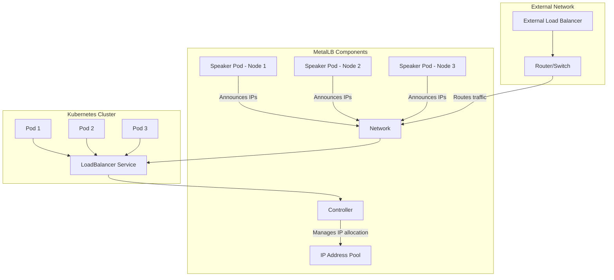
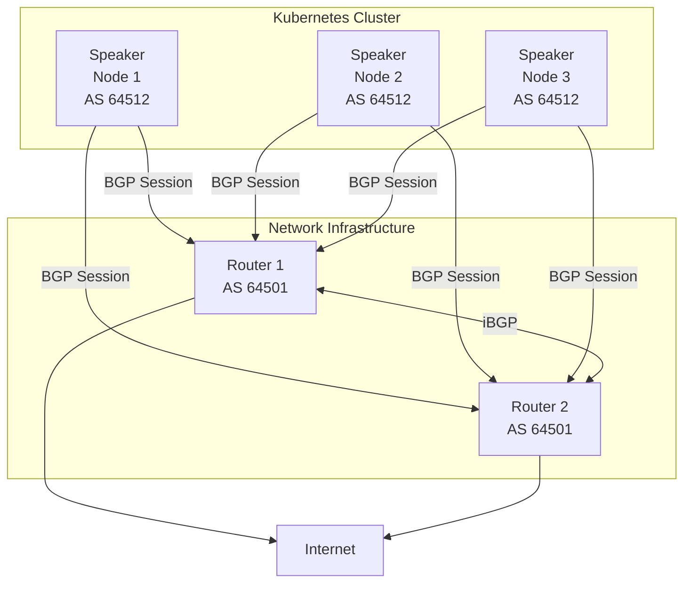
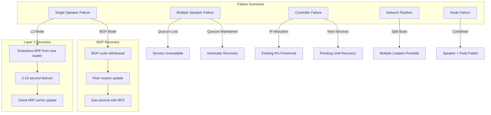

# How to Configure MetalLB for High Availability

Author: [nawazdhandala](https://github.com/nawazdhandala)

Tags: MetalLB, Kubernetes, High Availability, Load Balancing, Redundancy

Description: Learn how to deploy MetalLB in a highly available configuration for production workloads.

---

## Introduction

MetalLB is a load-balancer implementation for bare metal Kubernetes clusters. Unlike cloud providers that offer native load balancing, on-premises clusters need a solution like MetalLB to expose services externally. However, for production workloads, a basic MetalLB installation is not enough. You need to configure it for high availability (HA) to ensure your services remain accessible even when nodes fail.

This comprehensive guide covers everything you need to know about configuring MetalLB for high availability, including speaker redundancy, controller HA, node affinity, failure scenarios, and recovery procedures.

## Understanding MetalLB Architecture

Before diving into HA configuration, let's understand MetalLB's core components:



**Key Components:**

1. **Controller**: A Deployment that watches Kubernetes Services and allocates IP addresses from configured pools
2. **Speaker**: A DaemonSet running on every node that announces allocated IPs using either Layer 2 (ARP/NDP) or BGP

## Prerequisites

Before configuring MetalLB for high availability, ensure you have:

- A Kubernetes cluster with at least 3 worker nodes
- kubectl configured to communicate with your cluster
- Helm 3.x installed (optional, for Helm-based installation)
- Network access between all nodes (Layer 2) or BGP peering capability (Layer 3)

## Installing MetalLB with High Availability

### Step 1: Create the MetalLB Namespace

First, we create a dedicated namespace for MetalLB components. This helps with resource isolation and management.

```yaml
# metallb-namespace.yaml
# Creates a dedicated namespace for MetalLB components
# This enables better resource management and RBAC isolation
apiVersion: v1
kind: Namespace
metadata:
  name: metallb-system
  labels:
    # Label for identifying MetalLB resources
    app: metallb
    # Pod security admission labels for security compliance
    pod-security.kubernetes.io/enforce: privileged
    pod-security.kubernetes.io/audit: privileged
    pod-security.kubernetes.io/warn: privileged
```

Apply the namespace configuration:

```bash
# Apply the namespace configuration to your cluster
kubectl apply -f metallb-namespace.yaml
```

### Step 2: Deploy MetalLB with HA Controller Configuration

The following manifest deploys MetalLB with high availability settings for the controller. We use multiple replicas and pod anti-affinity to ensure the controller survives node failures.

```yaml
# metallb-ha-controller.yaml
# This configuration deploys the MetalLB controller with high availability settings
# The controller is responsible for IP address allocation and service watching
apiVersion: apps/v1
kind: Deployment
metadata:
  name: controller
  namespace: metallb-system
  labels:
    app: metallb
    component: controller
spec:
  # Running 3 replicas ensures HA - cluster can survive up to 2 controller failures
  replicas: 3
  # RevisionHistoryLimit keeps last 3 deployments for rollback capability
  revisionHistoryLimit: 3
  selector:
    matchLabels:
      app: metallb
      component: controller
  # Strategy ensures zero-downtime during updates
  strategy:
    type: RollingUpdate
    rollingUpdate:
      # maxUnavailable: 1 means at least 2 controllers remain during updates
      maxUnavailable: 1
      # maxSurge: 1 allows one extra pod during rolling updates
      maxSurge: 1
  template:
    metadata:
      labels:
        app: metallb
        component: controller
      annotations:
        # Prometheus annotations for metrics scraping
        prometheus.io/scrape: "true"
        prometheus.io/port: "7472"
    spec:
      # Service account for controller RBAC permissions
      serviceAccountName: controller
      # Graceful termination period for clean shutdown
      terminationGracePeriodSeconds: 30
      # Security context for the pod
      securityContext:
        runAsNonRoot: true
        runAsUser: 65534
        fsGroup: 65534
      # Node selector ensures controllers run on dedicated infra nodes if available
      nodeSelector:
        kubernetes.io/os: linux
      # Pod anti-affinity ensures controllers spread across different nodes
      # This is CRITICAL for high availability
      affinity:
        podAntiAffinity:
          # requiredDuringSchedulingIgnoredDuringExecution is a hard requirement
          # Controllers MUST be on different nodes
          requiredDuringSchedulingIgnoredDuringExecution:
            - labelSelector:
                matchExpressions:
                  - key: app
                    operator: In
                    values:
                      - metallb
                  - key: component
                    operator: In
                    values:
                      - controller
              # topologyKey: hostname ensures one controller per node
              topologyKey: kubernetes.io/hostname
        # Node affinity prefers nodes labeled for infrastructure workloads
        nodeAffinity:
          preferredDuringSchedulingIgnoredDuringExecution:
            - weight: 100
              preference:
                matchExpressions:
                  - key: node-role.kubernetes.io/infra
                    operator: Exists
      # Tolerations allow controllers to run on tainted nodes if needed
      tolerations:
        - key: "node-role.kubernetes.io/master"
          operator: "Exists"
          effect: "NoSchedule"
        - key: "node-role.kubernetes.io/control-plane"
          operator: "Exists"
          effect: "NoSchedule"
      containers:
        - name: controller
          image: quay.io/metallb/controller:v0.14.8
          args:
            # Log level 'info' provides useful operational information
            - --log-level=info
            # Port for metrics and health endpoints
            - --port=7472
            # Webhook server port for validating configurations
            - --webhook-mode=enabled
          ports:
            - name: monitoring
              containerPort: 7472
            - name: webhook
              containerPort: 9443
          # Liveness probe ensures unhealthy controllers are restarted
          livenessProbe:
            httpGet:
              path: /metrics
              port: monitoring
            initialDelaySeconds: 10
            periodSeconds: 10
            timeoutSeconds: 5
            failureThreshold: 3
          # Readiness probe ensures traffic only goes to ready controllers
          readinessProbe:
            httpGet:
              path: /metrics
              port: monitoring
            initialDelaySeconds: 5
            periodSeconds: 5
            timeoutSeconds: 3
            failureThreshold: 3
          # Resource limits prevent runaway resource consumption
          resources:
            limits:
              cpu: 200m
              memory: 256Mi
            requests:
              cpu: 50m
              memory: 64Mi
          securityContext:
            allowPrivilegeEscalation: false
            readOnlyRootFilesystem: true
            capabilities:
              drop:
                - ALL
```

### Step 3: Configure Speaker DaemonSet for Redundancy

The speaker component runs on every node and is responsible for announcing IP addresses. For high availability, we need to ensure speakers are properly distributed and resilient.

```yaml
# metallb-ha-speaker.yaml
# The speaker DaemonSet runs on every node and announces allocated IPs
# Speaker redundancy is crucial for HA - if one speaker fails, others take over
apiVersion: apps/v1
kind: DaemonSet
metadata:
  name: speaker
  namespace: metallb-system
  labels:
    app: metallb
    component: speaker
spec:
  selector:
    matchLabels:
      app: metallb
      component: speaker
  # updateStrategy controls how speaker pods are updated
  updateStrategy:
    type: RollingUpdate
    rollingUpdate:
      # maxUnavailable: 1 ensures gradual updates, maintaining availability
      maxUnavailable: 1
      # maxSurge: 0 is default for DaemonSets (not applicable)
  template:
    metadata:
      labels:
        app: metallb
        component: speaker
      annotations:
        prometheus.io/scrape: "true"
        prometheus.io/port: "7472"
    spec:
      serviceAccountName: speaker
      terminationGracePeriodSeconds: 30
      # hostNetwork: true is required for Layer 2 mode (ARP/NDP announcements)
      # and for BGP mode to establish peer connections
      hostNetwork: true
      # Node selector ensures speakers only run on Linux nodes
      nodeSelector:
        kubernetes.io/os: linux
      # Tolerations allow speakers to run on all nodes including masters
      # This maximizes redundancy across the cluster
      tolerations:
        - key: "node-role.kubernetes.io/master"
          operator: "Exists"
          effect: "NoSchedule"
        - key: "node-role.kubernetes.io/control-plane"
          operator: "Exists"
          effect: "NoSchedule"
        # Tolerate node not ready to maintain announcements during issues
        - key: "node.kubernetes.io/not-ready"
          operator: "Exists"
          effect: "NoSchedule"
        # Tolerate unreachable nodes temporarily
        - key: "node.kubernetes.io/unreachable"
          operator: "Exists"
          effect: "NoSchedule"
      containers:
        - name: speaker
          image: quay.io/metallb/speaker:v0.14.8
          args:
            - --log-level=info
            - --port=7472
          env:
            # METALLB_NODE_NAME is used for memberlist and leader election
            - name: METALLB_NODE_NAME
              valueFrom:
                fieldRef:
                  fieldPath: spec.nodeName
            # METALLB_HOST is used for binding the speaker
            - name: METALLB_HOST
              valueFrom:
                fieldRef:
                  fieldPath: status.hostIP
            # METALLB_ML_BIND_ADDR is the memberlist bind address for peer discovery
            - name: METALLB_ML_BIND_ADDR
              valueFrom:
                fieldRef:
                  fieldPath: status.podIP
            # METALLB_ML_LABELS are used for memberlist peer discovery
            - name: METALLB_ML_LABELS
              value: "app=metallb,component=speaker"
            # METALLB_ML_SECRET_KEY_PATH points to the shared secret for memberlist
            - name: METALLB_ML_SECRET_KEY_PATH
              value: "/etc/ml_secret_key"
          ports:
            - name: monitoring
              containerPort: 7472
              hostPort: 7472
            # Memberlist port for speaker communication
            - name: memberlist-tcp
              containerPort: 7946
              hostPort: 7946
              protocol: TCP
            - name: memberlist-udp
              containerPort: 7946
              hostPort: 7946
              protocol: UDP
          # Liveness probe restarts unhealthy speakers
          livenessProbe:
            httpGet:
              path: /metrics
              port: monitoring
            initialDelaySeconds: 10
            periodSeconds: 10
            timeoutSeconds: 5
            failureThreshold: 3
          # Readiness probe for traffic routing
          readinessProbe:
            httpGet:
              path: /metrics
              port: monitoring
            initialDelaySeconds: 5
            periodSeconds: 5
            timeoutSeconds: 3
            failureThreshold: 3
          resources:
            limits:
              cpu: 200m
              memory: 128Mi
            requests:
              cpu: 50m
              memory: 32Mi
          securityContext:
            allowPrivilegeEscalation: false
            readOnlyRootFilesystem: true
            capabilities:
              drop:
                - ALL
              add:
                # NET_RAW is required for Layer 2 mode (ARP/NDP)
                - NET_RAW
          volumeMounts:
            # Mount the memberlist secret for cluster communication
            - name: memberlist
              mountPath: /etc/ml_secret_key
              readOnly: true
      volumes:
        - name: memberlist
          secret:
            secretName: memberlist
            defaultMode: 0400
```

### Step 4: Create the Memberlist Secret

The memberlist secret is used by speakers to authenticate with each other. This is essential for the speaker election process.

```bash
# Generate a random 256-bit key for memberlist authentication
# This key must be the same across all speakers for them to communicate
kubectl create secret generic memberlist \
  --from-literal=secretkey="$(openssl rand -base64 32)" \
  -n metallb-system
```

## Configuring IP Address Pools for High Availability

### Layer 2 Mode with Multiple Pools

Layer 2 mode uses ARP (IPv4) or NDP (IPv6) to announce IP addresses. For HA, we configure multiple pools and ensure proper speaker election.

```yaml
# metallb-l2-ha-config.yaml
# IP Address Pool configuration for Layer 2 mode with high availability
# Multiple pools provide redundancy and flexibility in IP allocation
apiVersion: metallb.io/v1beta1
kind: IPAddressPool
metadata:
  name: primary-pool
  namespace: metallb-system
spec:
  # Primary address range for production services
  addresses:
    - 192.168.1.100-192.168.1.150
  # autoAssign: true means IPs from this pool are auto-assigned to services
  # Set to false if you want explicit pool selection via annotations
  autoAssign: true
  # avoidBuggyIPs: true skips .0 and .255 addresses which can cause issues
  avoidBuggyIPs: true
---
apiVersion: metallb.io/v1beta1
kind: IPAddressPool
metadata:
  name: secondary-pool
  namespace: metallb-system
spec:
  # Secondary range for overflow or specific workloads
  addresses:
    - 192.168.1.160-192.168.1.200
  # autoAssign: false requires explicit annotation to use this pool
  autoAssign: false
  avoidBuggyIPs: true
---
# L2Advertisement configures how IPs are announced in Layer 2 mode
# This is where speaker redundancy is configured
apiVersion: metallb.io/v1beta1
kind: L2Advertisement
metadata:
  name: primary-l2-advertisement
  namespace: metallb-system
spec:
  # Reference to the IP pools this advertisement applies to
  ipAddressPools:
    - primary-pool
  # nodeSelectors limit which nodes can announce IPs from this pool
  # This is important for network topology-aware HA configurations
  nodeSelectors:
    - matchLabels:
        # Only nodes with this label will announce IPs
        metallb.universe.tf/speaker: "true"
    - matchExpressions:
        # Exclude nodes marked for maintenance
        - key: node.kubernetes.io/exclude-from-metallb
          operator: DoesNotExist
  # interfaces limits which network interfaces are used for announcements
  # Leave empty to use all interfaces, or specify for more control
  interfaces:
    - eth0
    - ens192
---
apiVersion: metallb.io/v1beta1
kind: L2Advertisement
metadata:
  name: secondary-l2-advertisement
  namespace: metallb-system
spec:
  ipAddressPools:
    - secondary-pool
  nodeSelectors:
    - matchLabels:
        metallb.universe.tf/speaker: "true"
```

### BGP Mode with Redundant Peers

BGP mode provides better scalability and faster failover compared to Layer 2. Here's how to configure BGP for high availability:



```yaml
# metallb-bgp-ha-config.yaml
# BGP configuration for high availability with multiple peers
# BGP mode provides ECMP (Equal-Cost Multi-Path) load balancing and fast failover
apiVersion: metallb.io/v1beta2
kind: BGPPeer
metadata:
  name: router-1
  namespace: metallb-system
spec:
  # myASN is the AS number for the MetalLB speakers
  myASN: 64512
  # peerASN is the AS number of the upstream router
  peerASN: 64501
  # peerAddress is the IP of the BGP peer (router)
  peerAddress: 192.168.1.1
  # peerPort is the BGP port (default 179)
  peerPort: 179
  # holdTime is how long to wait before declaring peer dead
  # Lower values = faster failover but more sensitivity to network blips
  holdTime: 90s
  # keepaliveTime is the interval between keepalive messages
  keepaliveTime: 30s
  # routerID is optional - MetalLB will use node IP if not set
  # password for MD5 authentication (optional but recommended)
  password: "bgp-secret-1"
  # nodeSelectors specify which nodes establish BGP sessions with this peer
  nodeSelectors:
    - matchLabels:
        metallb.universe.tf/speaker: "true"
  # bfdProfile enables BFD for sub-second failover detection
  bfdProfile: bfd-fast
---
apiVersion: metallb.io/v1beta2
kind: BGPPeer
metadata:
  name: router-2
  namespace: metallb-system
spec:
  myASN: 64512
  peerASN: 64501
  peerAddress: 192.168.1.2
  peerPort: 179
  holdTime: 90s
  keepaliveTime: 30s
  password: "bgp-secret-2"
  nodeSelectors:
    - matchLabels:
        metallb.universe.tf/speaker: "true"
  bfdProfile: bfd-fast
---
# BFD Profile for fast failure detection
# BFD (Bidirectional Forwarding Detection) enables sub-second failover
apiVersion: metallb.io/v1beta1
kind: BFDProfile
metadata:
  name: bfd-fast
  namespace: metallb-system
spec:
  # receiveInterval is how often to expect BFD packets (milliseconds)
  receiveInterval: 300
  # transmitInterval is how often to send BFD packets (milliseconds)
  transmitInterval: 300
  # detectMultiplier * transmitInterval = failure detection time
  # 3 * 300ms = 900ms for failure detection
  detectMultiplier: 3
  # echoMode enables BFD echo for faster detection
  echoMode: false
  # passiveMode means MetalLB waits for peer to initiate BFD
  passiveMode: false
  # minimumTtl is the minimum TTL for received BFD packets
  minimumTtl: 254
---
# IP Address Pool for BGP mode
apiVersion: metallb.io/v1beta1
kind: IPAddressPool
metadata:
  name: bgp-pool
  namespace: metallb-system
spec:
  addresses:
    - 10.0.100.0/24
  autoAssign: true
  avoidBuggyIPs: true
---
# BGP Advertisement configuration
apiVersion: metallb.io/v1beta1
kind: BGPAdvertisement
metadata:
  name: bgp-advertisement
  namespace: metallb-system
spec:
  ipAddressPools:
    - bgp-pool
  # aggregationLength controls route aggregation
  # /32 means each IP is advertised individually (most specific)
  aggregationLength: 32
  # aggregationLengthV6 for IPv6 addresses
  aggregationLengthV6: 128
  # localPref sets BGP local preference (higher = preferred)
  localPref: 100
  # communities adds BGP community strings for traffic engineering
  communities:
    - "64512:100"
  # peers limits which BGP peers receive this advertisement
  # Empty means all peers
  peers:
    - router-1
    - router-2
```

## Node Affinity Configuration

Proper node affinity ensures MetalLB components are distributed optimally across your cluster.

### Labeling Nodes for MetalLB

```bash
# Label nodes that should participate in MetalLB speaker announcements
# This is essential for controlling which nodes announce IPs
kubectl label node worker-1 metallb.universe.tf/speaker=true
kubectl label node worker-2 metallb.universe.tf/speaker=true
kubectl label node worker-3 metallb.universe.tf/speaker=true

# Label infrastructure nodes for controller placement
kubectl label node infra-1 node-role.kubernetes.io/infra=
kubectl label node infra-2 node-role.kubernetes.io/infra=
kubectl label node infra-3 node-role.kubernetes.io/infra=

# Exclude a node from MetalLB (e.g., during maintenance)
kubectl label node worker-4 node.kubernetes.io/exclude-from-metallb=true
```

### Advanced Node Affinity for Speakers

```yaml
# metallb-speaker-affinity.yaml
# Advanced speaker configuration with zone-aware affinity
# This ensures speakers are distributed across failure domains
apiVersion: apps/v1
kind: DaemonSet
metadata:
  name: speaker
  namespace: metallb-system
spec:
  selector:
    matchLabels:
      app: metallb
      component: speaker
  template:
    metadata:
      labels:
        app: metallb
        component: speaker
    spec:
      affinity:
        # nodeAffinity controls which nodes run speakers
        nodeAffinity:
          # Required affinity - speakers MUST run on labeled nodes only
          requiredDuringSchedulingIgnoredDuringExecution:
            nodeSelectorTerms:
              - matchExpressions:
                  # Only nodes labeled as speakers
                  - key: metallb.universe.tf/speaker
                    operator: In
                    values:
                      - "true"
                  # Exclude nodes in maintenance
                  - key: node.kubernetes.io/exclude-from-metallb
                    operator: DoesNotExist
          # Preferred affinity - try to spread across zones
          preferredDuringSchedulingIgnoredDuringExecution:
            - weight: 100
              preference:
                matchExpressions:
                  # Prefer nodes in production zone
                  - key: topology.kubernetes.io/zone
                    operator: In
                    values:
                      - zone-a
                      - zone-b
                      - zone-c
        # podAntiAffinity is N/A for DaemonSets (one per node by design)
      # Topology spread constraints for even distribution (redundant for DaemonSet but shown for reference)
      topologySpreadConstraints:
        - maxSkew: 1
          topologyKey: topology.kubernetes.io/zone
          whenUnsatisfiable: ScheduleAnyway
          labelSelector:
            matchLabels:
              app: metallb
              component: speaker
      # ... rest of speaker spec
```

## Failure Scenarios and Recovery

Understanding failure scenarios is crucial for operating MetalLB in production. Here's a comprehensive overview:



### Scenario 1: Single Speaker Node Failure (Layer 2)

When a speaker node fails in Layer 2 mode, the remaining speakers elect a new leader:

```yaml
# Test single speaker failure with this configuration
# Create a service to test failover behavior
apiVersion: v1
kind: Service
metadata:
  name: test-lb-service
  namespace: default
  annotations:
    # Specify which pool to use
    metallb.universe.tf/address-pool: primary-pool
spec:
  type: LoadBalancer
  selector:
    app: test-app
  ports:
    - port: 80
      targetPort: 8080
```

```bash
# Simulate speaker failure by cordoning and draining a node
# First, identify which speaker is the leader for your service IP
kubectl logs -n metallb-system -l component=speaker | grep "leader"

# Cordon the leader node to prevent new pods
kubectl cordon worker-1

# Drain the node (this will stop the speaker pod)
kubectl drain worker-1 --ignore-daemonsets --delete-emptydir-data

# Monitor failover (should complete in 2-10 seconds for L2)
# Watch for gratuitous ARP from new leader
kubectl logs -n metallb-system -l component=speaker -f | grep -E "leader|announce"

# Verify service is still accessible
curl -v http://<EXTERNAL-IP>

# Restore the node
kubectl uncordon worker-1
```

### Scenario 2: Controller Failure

Controller failures affect IP allocation but not existing announcements:

```bash
# Simulate controller failure by scaling to 0
kubectl scale deployment controller -n metallb-system --replicas=0

# Verify existing services continue working
# The speakers maintain their announcements
kubectl get svc -A | grep LoadBalancer

# New services will be pending until controller recovers
kubectl apply -f test-new-service.yaml
kubectl get svc test-new-service
# STATUS: Pending (External IP)

# Restore controller
kubectl scale deployment controller -n metallb-system --replicas=3

# New service should get an IP
kubectl get svc test-new-service
# STATUS: <EXTERNAL-IP>
```

### Scenario 3: Network Partition (Split Brain)

Network partitions can cause split-brain scenarios where multiple speakers think they're the leader:

```yaml
# Network policy to simulate partition (for testing only)
# This blocks memberlist communication between speakers
apiVersion: networking.k8s.io/v1
kind: NetworkPolicy
metadata:
  name: simulate-partition
  namespace: metallb-system
spec:
  podSelector:
    matchLabels:
      component: speaker
  policyTypes:
    - Ingress
    - Egress
  ingress:
    - from:
        - podSelector:
            matchLabels:
              component: speaker
      ports:
        - port: 7946
          protocol: TCP
        - port: 7946
          protocol: UDP
```

**Prevention and mitigation:**

```yaml
# Configure memberlist with appropriate timeouts
# These environment variables tune the speaker's cluster membership behavior
apiVersion: apps/v1
kind: DaemonSet
metadata:
  name: speaker
  namespace: metallb-system
spec:
  template:
    spec:
      containers:
        - name: speaker
          env:
            # METALLB_ML_BIND_PORT for memberlist communication
            - name: METALLB_ML_BIND_PORT
              value: "7946"
            # Timeout settings for memberlist
            - name: MEMBERLIST_TCP_TIMEOUT
              value: "10s"
            - name: MEMBERLIST_PUSH_PULL_INTERVAL
              value: "30s"
            - name: MEMBERLIST_GOSSIP_INTERVAL
              value: "200ms"
            # Suspicion multiplier affects how quickly dead nodes are detected
            - name: MEMBERLIST_SUSPICION_MULT
              value: "4"
```

### Scenario 4: BGP Peer Failure

When a BGP peer fails, routes are withdrawn and traffic shifts to remaining peers:

```bash
# Monitor BGP session status
kubectl logs -n metallb-system -l component=speaker | grep -E "BGP|peer|session"

# Check BGP peer status via metrics
kubectl port-forward -n metallb-system svc/speaker 7472:7472 &
curl http://localhost:7472/metrics | grep metallb_bgp

# Expected metrics:
# metallb_bgp_session_up{peer="192.168.1.1"} 1
# metallb_bgp_session_up{peer="192.168.1.2"} 1

# If using BFD, check BFD status
curl http://localhost:7472/metrics | grep metallb_bfd
```

## Monitoring and Alerting

Proper monitoring is essential for maintaining HA. Here's a comprehensive monitoring setup:

### Prometheus ServiceMonitor

```yaml
# metallb-servicemonitor.yaml
# ServiceMonitor for Prometheus Operator to scrape MetalLB metrics
apiVersion: monitoring.coreos.com/v1
kind: ServiceMonitor
metadata:
  name: metallb
  namespace: monitoring
  labels:
    app: metallb
spec:
  # jobLabel is added to metrics for identification
  jobLabel: app
  # namespaceSelector specifies which namespace to find the service
  namespaceSelector:
    matchNames:
      - metallb-system
  # selector identifies the service to monitor
  selector:
    matchLabels:
      app: metallb
  # endpoints defines how to scrape metrics
  endpoints:
    - port: monitoring
      interval: 30s
      path: /metrics
      # honorLabels preserves labels from the source
      honorLabels: true
```

### Prometheus Alerts for MetalLB

```yaml
# metallb-alerts.yaml
# PrometheusRule defining alerts for MetalLB high availability
apiVersion: monitoring.coreos.com/v1
kind: PrometheusRule
metadata:
  name: metallb-alerts
  namespace: monitoring
  labels:
    app: metallb
    prometheus: k8s
    role: alert-rules
spec:
  groups:
    - name: metallb.rules
      rules:
        # Alert when controller replicas are below desired count
        - alert: MetalLBControllerDown
          # Expression checks if running replicas < desired replicas
          expr: |
            kube_deployment_status_replicas_available{deployment="controller", namespace="metallb-system"}
            <
            kube_deployment_spec_replicas{deployment="controller", namespace="metallb-system"}
          for: 5m
          labels:
            severity: warning
          annotations:
            summary: "MetalLB controller has degraded availability"
            description: "MetalLB controller has {{ $value }} available replicas, expected {{ $labels.replicas }}"

        # Critical alert when all controllers are down
        - alert: MetalLBControllerCritical
          expr: |
            kube_deployment_status_replicas_available{deployment="controller", namespace="metallb-system"} == 0
          for: 1m
          labels:
            severity: critical
          annotations:
            summary: "MetalLB controller is completely down"
            description: "No MetalLB controller replicas are available. New services cannot get IPs."

        # Alert when speaker pods are missing from nodes
        - alert: MetalLBSpeakerDown
          expr: |
            kube_daemonset_status_number_unavailable{daemonset="speaker", namespace="metallb-system"} > 0
          for: 5m
          labels:
            severity: warning
          annotations:
            summary: "MetalLB speaker pods are unavailable"
            description: "{{ $value }} MetalLB speaker pods are unavailable"

        # Alert when BGP sessions are down
        - alert: MetalLBBGPSessionDown
          expr: |
            metallb_bgp_session_up == 0
          for: 2m
          labels:
            severity: critical
          annotations:
            summary: "MetalLB BGP session is down"
            description: "BGP session to peer {{ $labels.peer }} is down"

        # Alert when BFD sessions are down (if using BFD)
        - alert: MetalLBBFDSessionDown
          expr: |
            metallb_bfd_session_up == 0
          for: 1m
          labels:
            severity: critical
          annotations:
            summary: "MetalLB BFD session is down"
            description: "BFD session to peer {{ $labels.peer }} is down"

        # Alert when IP pool is running low
        - alert: MetalLBPoolExhaustion
          expr: |
            metallb_allocator_addresses_in_use_total / metallb_allocator_addresses_total * 100 > 80
          for: 10m
          labels:
            severity: warning
          annotations:
            summary: "MetalLB IP pool is running low"
            description: "IP pool {{ $labels.pool }} is {{ $value }}% utilized"

        # Alert for address allocation failures
        - alert: MetalLBAllocationFailure
          expr: |
            increase(metallb_allocator_allocation_failures_total[5m]) > 0
          for: 5m
          labels:
            severity: warning
          annotations:
            summary: "MetalLB is failing to allocate addresses"
            description: "MetalLB has had {{ $value }} allocation failures in the last 5 minutes"
```

### Grafana Dashboard

```json
{
  "dashboard": {
    "title": "MetalLB High Availability",
    "panels": [
      {
        "title": "Controller Replicas",
        "type": "gauge",
        "targets": [
          {
            "expr": "kube_deployment_status_replicas_available{deployment='controller', namespace='metallb-system'}",
            "legendFormat": "Available"
          }
        ],
        "fieldConfig": {
          "defaults": {
            "thresholds": {
              "steps": [
                {"color": "red", "value": 0},
                {"color": "yellow", "value": 1},
                {"color": "green", "value": 3}
              ]
            },
            "max": 3
          }
        }
      },
      {
        "title": "Speaker Pods Status",
        "type": "stat",
        "targets": [
          {
            "expr": "kube_daemonset_status_number_ready{daemonset='speaker', namespace='metallb-system'}",
            "legendFormat": "Ready"
          },
          {
            "expr": "kube_daemonset_status_desired_number_scheduled{daemonset='speaker', namespace='metallb-system'}",
            "legendFormat": "Desired"
          }
        ]
      },
      {
        "title": "BGP Session Status",
        "type": "table",
        "targets": [
          {
            "expr": "metallb_bgp_session_up",
            "legendFormat": "{{peer}}"
          }
        ]
      },
      {
        "title": "IP Pool Utilization",
        "type": "bargauge",
        "targets": [
          {
            "expr": "metallb_allocator_addresses_in_use_total / metallb_allocator_addresses_total * 100",
            "legendFormat": "{{pool}}"
          }
        ]
      }
    ]
  }
}
```

## Best Practices for Production

### 1. Use Dedicated Infrastructure Nodes

```yaml
# Taint infrastructure nodes and add tolerations
# This ensures MetalLB components run on dedicated nodes
apiVersion: v1
kind: Node
metadata:
  name: infra-1
  labels:
    node-role.kubernetes.io/infra: ""
spec:
  taints:
    - key: "node-role.kubernetes.io/infra"
      value: ""
      effect: "NoSchedule"
```

### 2. Implement Pod Disruption Budgets

```yaml
# metallb-pdb.yaml
# Pod Disruption Budget ensures minimum availability during voluntary disruptions
apiVersion: policy/v1
kind: PodDisruptionBudget
metadata:
  name: controller-pdb
  namespace: metallb-system
spec:
  # minAvailable ensures at least 2 controllers are always running
  minAvailable: 2
  selector:
    matchLabels:
      app: metallb
      component: controller
---
apiVersion: policy/v1
kind: PodDisruptionBudget
metadata:
  name: speaker-pdb
  namespace: metallb-system
spec:
  # maxUnavailable limits how many speakers can be disrupted at once
  maxUnavailable: 1
  selector:
    matchLabels:
      app: metallb
      component: speaker
```

### 3. Configure Resource Limits and Requests

```yaml
# Resource configuration ensures predictable performance
resources:
  # Controller resources - adjust based on cluster size
  controller:
    limits:
      cpu: 200m
      memory: 256Mi
    requests:
      cpu: 50m
      memory: 64Mi
  # Speaker resources - adjust based on number of services
  speaker:
    limits:
      cpu: 200m
      memory: 128Mi
    requests:
      cpu: 50m
      memory: 32Mi
```

### 4. Regular Health Checks

```bash
#!/bin/bash
# metallb-healthcheck.sh
# Regular health check script for MetalLB HA

# Check controller replicas
CONTROLLER_READY=$(kubectl get deployment controller -n metallb-system -o jsonpath='{.status.readyReplicas}')
CONTROLLER_DESIRED=$(kubectl get deployment controller -n metallb-system -o jsonpath='{.spec.replicas}')

if [ "$CONTROLLER_READY" -lt "$CONTROLLER_DESIRED" ]; then
    echo "WARNING: Controller has $CONTROLLER_READY/$CONTROLLER_DESIRED replicas ready"
fi

# Check speaker pods
SPEAKER_READY=$(kubectl get daemonset speaker -n metallb-system -o jsonpath='{.status.numberReady}')
SPEAKER_DESIRED=$(kubectl get daemonset speaker -n metallb-system -o jsonpath='{.status.desiredNumberScheduled}')

if [ "$SPEAKER_READY" -lt "$SPEAKER_DESIRED" ]; then
    echo "WARNING: Speaker has $SPEAKER_READY/$SPEAKER_DESIRED pods ready"
fi

# Check for services without IPs
PENDING_SERVICES=$(kubectl get svc -A -o jsonpath='{.items[?(@.spec.type=="LoadBalancer")].metadata.name}' | wc -w)
PENDING_IPS=$(kubectl get svc -A -o jsonpath='{.items[?(@.status.loadBalancer.ingress==null)].metadata.name}' | wc -w)

if [ "$PENDING_IPS" -gt 0 ]; then
    echo "WARNING: $PENDING_IPS LoadBalancer services are pending external IPs"
fi

# Check BGP sessions (if using BGP mode)
kubectl logs -n metallb-system -l component=speaker --tail=100 | grep -E "session (up|down)" | tail -5

echo "Health check completed at $(date)"
```

## Troubleshooting Guide

### Common Issues and Solutions

| Issue | Symptoms | Solution |
|-------|----------|----------|
| No external IP assigned | Service stuck in `Pending` state | Check IP pool configuration, verify controller is running |
| Slow failover | Traffic interruption > 10s | Enable BFD for BGP, check ARP cache timeout |
| Split brain | Multiple leaders announcing same IP | Check network connectivity, verify memberlist configuration |
| BGP session flapping | Intermittent connectivity | Adjust hold time, check network stability |
| IP pool exhausted | New services cannot get IPs | Add new IP ranges, reclaim unused IPs |

### Debug Commands

```bash
# View MetalLB controller logs
kubectl logs -n metallb-system -l component=controller --tail=100

# View speaker logs with leader election info
kubectl logs -n metallb-system -l component=speaker --tail=100 | grep -E "leader|announce|arp"

# Check IP allocations
kubectl get ipaddresspools.metallb.io -n metallb-system -o yaml

# View current service IP assignments
kubectl get svc -A -o wide | grep LoadBalancer

# Check speaker memberlist status
kubectl exec -n metallb-system -it $(kubectl get pod -n metallb-system -l component=speaker -o jsonpath='{.items[0].metadata.name}') -- /speaker --memberlist-debug

# Verify BGP configuration (if using BGP)
kubectl get bgppeers.metallb.io -n metallb-system -o yaml
kubectl get bgpadvertisements.metallb.io -n metallb-system -o yaml

# Check L2 advertisements
kubectl get l2advertisements.metallb.io -n metallb-system -o yaml
```

## Conclusion

Configuring MetalLB for high availability requires careful attention to several aspects:

1. **Controller Redundancy**: Deploy multiple controller replicas with pod anti-affinity to survive node failures
2. **Speaker Distribution**: Ensure speakers run on appropriate nodes with proper tolerations and affinity rules
3. **Network Mode Selection**: Choose between Layer 2 (simpler, slower failover) and BGP (complex, faster failover with BFD)
4. **Monitoring**: Implement comprehensive monitoring and alerting to detect issues before they impact services
5. **Failure Planning**: Understand failure scenarios and test recovery procedures regularly

By following this guide, you can deploy MetalLB in a production-ready, highly available configuration that provides reliable load balancing for your bare metal Kubernetes cluster.

## Additional Resources

- [MetalLB Official Documentation](https://metallb.universe.tf/)
- [MetalLB GitHub Repository](https://github.com/metallb/metallb)
- [Kubernetes High Availability Best Practices](https://kubernetes.io/docs/setup/production-environment/tools/kubeadm/high-availability/)
- [BGP Configuration Guide](https://metallb.universe.tf/configuration/_advanced_bgp_configuration/)
