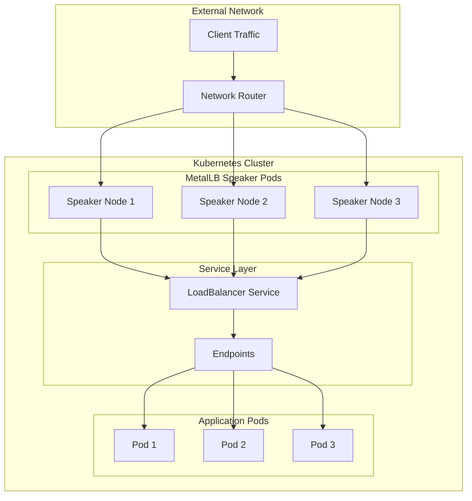
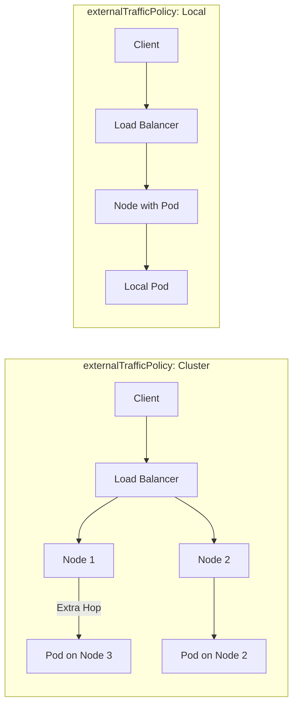
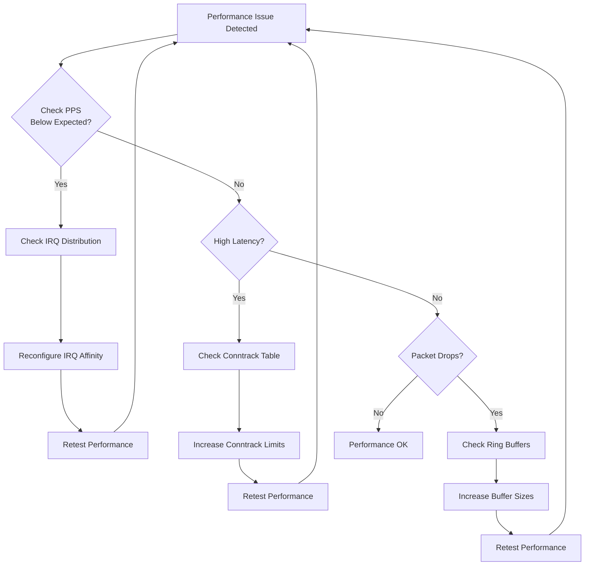

# How to Optimize MetalLB for High-Throughput Workloads

Author: [nawazdhandala](https://github.com/nawazdhandala)

Tags: MetalLB, Kubernetes, Performance, Optimization, Load Balancing, Networking, High Throughput

Description: Learn how to optimize MetalLB for high-throughput workloads with tuning for maximum packets per second.

---

MetalLB provides bare-metal Kubernetes clusters with load balancer capabilities typically reserved for cloud environments. When dealing with high-throughput workloads requiring maximum packets per second (PPS), proper tuning becomes essential for achieving optimal network performance. This comprehensive guide covers advanced optimization techniques to squeeze every bit of performance from your MetalLB deployment.

## Understanding MetalLB Performance Characteristics

Before diving into optimizations, it is important to understand how MetalLB handles traffic and where bottlenecks can occur.

The following diagram illustrates the MetalLB traffic flow architecture:



### Key Performance Factors

MetalLB performance depends on several factors:

1. **Mode Selection**: L2 mode vs BGP mode have different performance characteristics
2. **Kernel Network Stack**: Linux kernel tuning significantly impacts PPS
3. **NIC Configuration**: Hardware offloading and queue settings
4. **Speaker Pod Resources**: CPU and memory allocation for MetalLB speakers
5. **Network Policy Overhead**: iptables rules and connection tracking

## Choosing the Right MetalLB Mode for High Throughput

### L2 Mode Performance Considerations

L2 mode uses ARP/NDP for address resolution and has a single-node failover model. While simpler to configure, it creates a single point of traffic ingress.

L2Advertisement configuration for high-throughput scenarios:

```yaml
apiVersion: metallb.io/v1beta1
kind: L2Advertisement
metadata:
  name: high-throughput-l2
  namespace: metallb-system
spec:
  ipAddressPools:
    - high-throughput-pool
  interfaces:
    - eth0
  nodeSelectors:
    - matchLabels:
        metallb-role: high-performance
```

### BGP Mode for Maximum Throughput

BGP mode enables true load distribution across multiple nodes using ECMP (Equal-Cost Multi-Path) routing. This is the recommended mode for high-throughput workloads.

BGP configuration optimized for high PPS:

```yaml
apiVersion: metallb.io/v1beta2
kind: BGPPeer
metadata:
  name: high-throughput-peer
  namespace: metallb-system
spec:
  myASN: 64500
  peerASN: 64501
  peerAddress: 10.0.0.1
  holdTime: 90s
  keepaliveTime: 30s
  routerID: 10.0.0.100
  bfdProfile: high-throughput-bfd
```

BFD (Bidirectional Forwarding Detection) profile for faster failover:

```yaml
apiVersion: metallb.io/v1beta1
kind: BFDProfile
metadata:
  name: high-throughput-bfd
  namespace: metallb-system
spec:
  receiveInterval: 100
  transmitInterval: 100
  detectMultiplier: 3
  echoMode: true
  passiveMode: false
  minimumTtl: 254
```

## Linux Kernel Tuning for Maximum PPS

Kernel-level optimizations are crucial for achieving high packets per second. Apply these settings to all nodes running MetalLB speakers.

### Network Stack Optimization

Create a sysctl configuration file with the following optimizations. These settings increase buffer sizes, optimize connection tracking, and tune the network stack for high throughput:

```bash
# /etc/sysctl.d/99-metallb-high-throughput.conf

# Increase network buffer sizes
net.core.rmem_max = 134217728
net.core.wmem_max = 134217728
net.core.rmem_default = 16777216
net.core.wmem_default = 16777216
net.core.optmem_max = 40960
net.ipv4.tcp_rmem = 4096 87380 134217728
net.ipv4.tcp_wmem = 4096 65536 134217728

# Increase the maximum number of packets queued
net.core.netdev_max_backlog = 250000
net.core.netdev_budget = 50000
net.core.netdev_budget_usecs = 5000

# Connection tracking optimization
net.netfilter.nf_conntrack_max = 2097152
net.netfilter.nf_conntrack_buckets = 524288
net.netfilter.nf_conntrack_tcp_timeout_established = 86400
net.netfilter.nf_conntrack_tcp_timeout_time_wait = 30

# TCP optimization
net.ipv4.tcp_max_syn_backlog = 65536
net.ipv4.tcp_max_tw_buckets = 2000000
net.ipv4.tcp_tw_reuse = 1
net.ipv4.tcp_fin_timeout = 10
net.ipv4.tcp_slow_start_after_idle = 0
net.ipv4.tcp_mtu_probing = 1

# IP forwarding and routing
net.ipv4.ip_forward = 1
net.ipv4.conf.all.forwarding = 1
net.ipv4.conf.default.rp_filter = 0
net.ipv4.conf.all.rp_filter = 0

# Increase local port range
net.ipv4.ip_local_port_range = 1024 65535

# ARP table settings for large clusters
net.ipv4.neigh.default.gc_thresh1 = 8192
net.ipv4.neigh.default.gc_thresh2 = 32768
net.ipv4.neigh.default.gc_thresh3 = 65536

# Reduce swappiness for network-intensive workloads
vm.swappiness = 10
```

Apply the sysctl settings:

```bash
sudo sysctl --system
```

### IRQ Affinity and CPU Pinning

Proper IRQ distribution across CPU cores prevents bottlenecks. This script sets up optimal IRQ affinity for network interfaces:

```bash
#!/bin/bash
# /usr/local/bin/set-irq-affinity.sh
# Script to distribute network IRQs across CPU cores

INTERFACE=${1:-eth0}
NUM_CPUS=$(nproc)

# Get IRQs for the interface
IRQS=$(grep $INTERFACE /proc/interrupts | awk '{print $1}' | tr -d ':')

# Counter for round-robin CPU assignment
CPU=0

for IRQ in $IRQS; do
    # Calculate CPU mask (hexadecimal)
    MASK=$(printf '%x' $((1 << CPU)))

    echo "Setting IRQ $IRQ to CPU $CPU (mask: $MASK)"
    echo $MASK > /proc/irq/$IRQ/smp_affinity

    # Move to next CPU
    CPU=$(( (CPU + 1) % NUM_CPUS ))
done

echo "IRQ affinity configured for $INTERFACE"
```

Create a systemd service to apply IRQ affinity at boot:

```ini
# /etc/systemd/system/irq-affinity.service
[Unit]
Description=Set IRQ Affinity for Network Interfaces
After=network.target

[Service]
Type=oneshot
ExecStart=/usr/local/bin/set-irq-affinity.sh eth0
RemainAfterExit=yes

[Install]
WantedBy=multi-user.target
```

## NIC Hardware Optimization

### Enable Hardware Offloading

Modern NICs support various offloading features that significantly improve PPS. Use ethtool to enable these features:

```bash
#!/bin/bash
# /usr/local/bin/optimize-nic.sh
# Script to optimize NIC settings for high throughput

INTERFACE=${1:-eth0}

echo "Optimizing NIC settings for $INTERFACE"

# Enable hardware offloading features
ethtool -K $INTERFACE rx on tx on
ethtool -K $INTERFACE gso on gro on
ethtool -K $INTERFACE tso on
ethtool -K $INTERFACE sg on
ethtool -K $INTERFACE rxvlan on txvlan on
ethtool -K $INTERFACE ntuple on

# Increase ring buffer sizes (adjust based on NIC capabilities)
ethtool -G $INTERFACE rx 4096 tx 4096

# Enable adaptive interrupt coalescing for balanced latency/throughput
ethtool -C $INTERFACE adaptive-rx on adaptive-tx on

# For maximum throughput, use static coalescing (uncomment if needed)
# ethtool -C $INTERFACE rx-usecs 50 tx-usecs 50

# Increase number of RX/TX queues to match CPU cores
NUM_CPUS=$(nproc)
ethtool -L $INTERFACE combined $NUM_CPUS 2>/dev/null || \
ethtool -L $INTERFACE rx $NUM_CPUS tx $NUM_CPUS 2>/dev/null

# Display current settings
echo "Current settings for $INTERFACE:"
ethtool -k $INTERFACE | grep -E "^(tcp|generic|scatter|rx-vlan|tx-vlan)"
ethtool -g $INTERFACE
ethtool -c $INTERFACE
```

### Receive Packet Steering (RPS) Configuration

For NICs without multi-queue support, RPS provides software-based packet distribution. This script configures RPS for optimal load distribution:

```bash
#!/bin/bash
# /usr/local/bin/configure-rps.sh
# Configure Receive Packet Steering for software-based load distribution

INTERFACE=${1:-eth0}
NUM_CPUS=$(nproc)

# Calculate RPS mask (all CPUs)
RPS_MASK=$(printf '%x' $((2**NUM_CPUS - 1)))

# Configure RPS for each queue
for QUEUE in /sys/class/net/$INTERFACE/queues/rx-*; do
    echo $RPS_MASK > $QUEUE/rps_cpus
    echo 32768 > $QUEUE/rps_flow_cnt
done

# Configure XPS (Transmit Packet Steering)
QUEUE_NUM=0
for QUEUE in /sys/class/net/$INTERFACE/queues/tx-*; do
    CPU_MASK=$(printf '%x' $((1 << (QUEUE_NUM % NUM_CPUS))))
    echo $CPU_MASK > $QUEUE/xps_cpus
    QUEUE_NUM=$((QUEUE_NUM + 1))
done

# Enable RPS flow table
echo 65536 > /proc/sys/net/core/rps_sock_flow_entries

echo "RPS/XPS configured for $INTERFACE with mask $RPS_MASK"
```

## MetalLB Speaker Pod Optimization

### Resource Allocation for Speaker Pods

High-throughput environments require adequate resources for MetalLB speakers. Create a custom values file for Helm deployment:

```yaml
# metallb-high-throughput-values.yaml
speaker:
  resources:
    requests:
      cpu: "500m"
      memory: "256Mi"
    limits:
      cpu: "2000m"
      memory: "512Mi"

  tolerations:
    - key: "node-role.kubernetes.io/master"
      operator: "Exists"
      effect: "NoSchedule"

  nodeSelector:
    metallb-role: high-performance

  affinity:
    podAntiAffinity:
      requiredDuringSchedulingIgnoredDuringExecution:
        - labelSelector:
            matchExpressions:
              - key: app
                operator: In
                values:
                  - metallb
          topologyKey: kubernetes.io/hostname

  priorityClassName: system-node-critical

  # Enable host networking for better performance
  hostNetwork: true

  # Security context for performance features
  securityContext:
    capabilities:
      add:
        - NET_ADMIN
        - NET_RAW
        - SYS_ADMIN

controller:
  resources:
    requests:
      cpu: "100m"
      memory: "128Mi"
    limits:
      cpu: "500m"
      memory: "256Mi"

  priorityClassName: system-cluster-critical
```

Install MetalLB with the optimized configuration:

```bash
helm install metallb metallb/metallb \
  -n metallb-system \
  --create-namespace \
  -f metallb-high-throughput-values.yaml
```

### Node Labeling for High-Performance Nodes

Label nodes designated for high-throughput MetalLB operations:

```bash
# Label nodes with high-performance network hardware
kubectl label nodes worker-1 metallb-role=high-performance
kubectl label nodes worker-2 metallb-role=high-performance
kubectl label nodes worker-3 metallb-role=high-performance

# Verify labels
kubectl get nodes -l metallb-role=high-performance
```

## IP Address Pool Configuration

### Optimized IP Pool for High Throughput

Configure IP address pools with settings optimized for high-throughput services:

```yaml
apiVersion: metallb.io/v1beta1
kind: IPAddressPool
metadata:
  name: high-throughput-pool
  namespace: metallb-system
spec:
  addresses:
    - 192.168.1.100-192.168.1.150
  autoAssign: false
  avoidBuggyIPs: true
```

### BGP Advertisement with ECMP

Configure BGP advertisements to enable ECMP load balancing across multiple nodes:

```yaml
apiVersion: metallb.io/v1beta1
kind: BGPAdvertisement
metadata:
  name: high-throughput-bgp-advert
  namespace: metallb-system
spec:
  ipAddressPools:
    - high-throughput-pool
  aggregationLength: 32
  localPref: 100
  communities:
    - 65535:65282
  peers:
    - high-throughput-peer
```

## Service Configuration for High Throughput

### LoadBalancer Service with Performance Annotations

Create services with annotations optimized for high throughput:

```yaml
apiVersion: v1
kind: Service
metadata:
  name: high-throughput-service
  namespace: production
  annotations:
    metallb.universe.tf/address-pool: high-throughput-pool
    metallb.universe.tf/allow-shared-ip: "high-throughput-group"
    metallb.universe.tf/loadBalancerIPs: "192.168.1.100"
spec:
  type: LoadBalancer
  externalTrafficPolicy: Local
  sessionAffinity: None
  ports:
    - name: http
      port: 80
      targetPort: 8080
      protocol: TCP
    - name: https
      port: 443
      targetPort: 8443
      protocol: TCP
  selector:
    app: high-throughput-app
```

### External Traffic Policy Considerations

The following diagram illustrates the difference between Cluster and Local external traffic policies:



For maximum PPS, use `externalTrafficPolicy: Local` to avoid extra network hops. However, be aware that this requires pods to be present on all receiving nodes:

```yaml
apiVersion: v1
kind: Service
metadata:
  name: max-throughput-service
spec:
  type: LoadBalancer
  # Local policy avoids extra hops but requires careful pod placement
  externalTrafficPolicy: Local
  # Health check settings for local policy
  healthCheckNodePort: 32000
  ports:
    - port: 80
      targetPort: 8080
  selector:
    app: distributed-app
```

## Kube-Proxy Optimization

### Switching to IPVS Mode

IPVS mode provides better performance than iptables for high-throughput scenarios. Update kube-proxy configuration:

```yaml
apiVersion: kubeproxy.config.k8s.io/v1alpha1
kind: KubeProxyConfiguration
mode: "ipvs"
ipvs:
  scheduler: "rr"
  syncPeriod: "30s"
  minSyncPeriod: "2s"
  tcpTimeout: "900s"
  tcpFinTimeout: "120s"
  udpTimeout: "300s"
conntrack:
  maxPerCore: 65536
  min: 131072
  tcpEstablishedTimeout: "86400s"
  tcpCloseWaitTimeout: "3600s"
```

Apply the configuration using a ConfigMap:

```bash
kubectl edit configmap kube-proxy -n kube-system
```

Restart kube-proxy pods to apply changes:

```bash
kubectl rollout restart daemonset kube-proxy -n kube-system
```

### Install IPVS Kernel Modules

Ensure IPVS modules are loaded on all nodes:

```bash
#!/bin/bash
# /etc/modules-load.d/ipvs.conf
# Required kernel modules for IPVS

cat << EOF | sudo tee /etc/modules-load.d/ipvs.conf
ip_vs
ip_vs_rr
ip_vs_wrr
ip_vs_sh
nf_conntrack
EOF

# Load modules immediately
for module in ip_vs ip_vs_rr ip_vs_wrr ip_vs_sh nf_conntrack; do
    sudo modprobe $module
done

# Verify modules are loaded
lsmod | grep ip_vs
```

## Monitoring High-Throughput Performance

### Prometheus Metrics for MetalLB

Deploy ServiceMonitor for MetalLB metrics collection:

```yaml
apiVersion: monitoring.coreos.com/v1
kind: ServiceMonitor
metadata:
  name: metallb-monitor
  namespace: metallb-system
spec:
  selector:
    matchLabels:
      app.kubernetes.io/name: metallb
  endpoints:
    - port: monitoring
      interval: 15s
      path: /metrics
```

### Key Metrics to Monitor

Create a PrometheusRule for high-throughput alerting:

```yaml
apiVersion: monitoring.coreos.com/v1
kind: PrometheusRule
metadata:
  name: metallb-high-throughput-alerts
  namespace: metallb-system
spec:
  groups:
    - name: metallb-performance
      rules:
        - alert: MetalLBHighPacketDropRate
          expr: |
            rate(node_netstat_IpExt_InNoRoutes[5m]) > 100
          for: 5m
          labels:
            severity: warning
          annotations:
            summary: "High packet drop rate detected"
            description: "Node {{ $labels.instance }} is dropping packets at {{ $value }}/s"

        - alert: MetalLBSpeakerHighCPU
          expr: |
            rate(container_cpu_usage_seconds_total{container="speaker"}[5m]) > 0.8
          for: 5m
          labels:
            severity: warning
          annotations:
            summary: "MetalLB speaker CPU usage high"
            description: "Speaker on {{ $labels.node }} using {{ $value | humanizePercentage }} CPU"

        - alert: MetalLBConntrackNearLimit
          expr: |
            node_nf_conntrack_entries / node_nf_conntrack_entries_limit > 0.8
          for: 5m
          labels:
            severity: critical
          annotations:
            summary: "Connection tracking table near limit"
            description: "Node {{ $labels.instance }} conntrack at {{ $value | humanizePercentage }}"
```

### Grafana Dashboard Configuration

JSON configuration for a high-throughput monitoring dashboard:

```json
{
  "dashboard": {
    "title": "MetalLB High-Throughput Performance",
    "panels": [
      {
        "title": "Packets Per Second (Ingress)",
        "type": "graph",
        "targets": [
          {
            "expr": "sum(rate(node_network_receive_packets_total{device=~\"eth.*\"}[1m])) by (instance)",
            "legendFormat": "{{ instance }}"
          }
        ]
      },
      {
        "title": "Packets Per Second (Egress)",
        "type": "graph",
        "targets": [
          {
            "expr": "sum(rate(node_network_transmit_packets_total{device=~\"eth.*\"}[1m])) by (instance)",
            "legendFormat": "{{ instance }}"
          }
        ]
      },
      {
        "title": "Connection Tracking Usage",
        "type": "gauge",
        "targets": [
          {
            "expr": "node_nf_conntrack_entries / node_nf_conntrack_entries_limit * 100",
            "legendFormat": "{{ instance }}"
          }
        ]
      },
      {
        "title": "Network Errors",
        "type": "graph",
        "targets": [
          {
            "expr": "rate(node_network_receive_errs_total[5m])",
            "legendFormat": "RX Errors - {{ instance }}"
          },
          {
            "expr": "rate(node_network_transmit_errs_total[5m])",
            "legendFormat": "TX Errors - {{ instance }}"
          }
        ]
      }
    ]
  }
}
```

## Benchmarking and Validation

### Load Testing with iperf3

Deploy iperf3 server for bandwidth testing:

```yaml
apiVersion: apps/v1
kind: Deployment
metadata:
  name: iperf3-server
  namespace: benchmark
spec:
  replicas: 3
  selector:
    matchLabels:
      app: iperf3-server
  template:
    metadata:
      labels:
        app: iperf3-server
    spec:
      containers:
        - name: iperf3
          image: networkstatic/iperf3
          args: ["-s"]
          ports:
            - containerPort: 5201
          resources:
            requests:
              cpu: "1000m"
              memory: "256Mi"
            limits:
              cpu: "2000m"
              memory: "512Mi"
---
apiVersion: v1
kind: Service
metadata:
  name: iperf3-lb
  namespace: benchmark
  annotations:
    metallb.universe.tf/address-pool: high-throughput-pool
spec:
  type: LoadBalancer
  externalTrafficPolicy: Local
  ports:
    - port: 5201
      targetPort: 5201
  selector:
    app: iperf3-server
```

Run bandwidth tests from an external client:

```bash
# Basic throughput test
iperf3 -c <METALLB_IP> -t 60 -P 8

# UDP test for PPS measurement
iperf3 -c <METALLB_IP> -u -b 10G -l 64 -t 60

# Bidirectional test
iperf3 -c <METALLB_IP> -t 60 -P 8 --bidir
```

### Packet Rate Testing with hping3

Synthetic packet rate testing with hping3:

```bash
# Install hping3
sudo apt-get install hping3

# TCP SYN flood test (use in controlled environment only)
sudo hping3 -S --flood -V -p 80 <METALLB_IP>

# Measure actual PPS with timing
sudo hping3 -S -p 80 -i u100 -c 10000 <METALLB_IP>
```

### Network Performance Validation Script

Comprehensive validation script for testing MetalLB performance:

```bash
#!/bin/bash
# /usr/local/bin/metallb-perf-test.sh
# MetalLB Performance Validation Script

METALLB_IP=$1
DURATION=${2:-60}

if [ -z "$METALLB_IP" ]; then
    echo "Usage: $0 <metallb-ip> [duration]"
    exit 1
fi

echo "=== MetalLB High-Throughput Performance Test ==="
echo "Target IP: $METALLB_IP"
echo "Test Duration: ${DURATION}s"
echo ""

# Test 1: TCP throughput
echo "--- Test 1: TCP Throughput ---"
iperf3 -c $METALLB_IP -t $DURATION -P 4 -J > /tmp/tcp-test.json
TCP_BPS=$(jq '.end.sum_received.bits_per_second' /tmp/tcp-test.json)
echo "TCP Throughput: $(echo "scale=2; $TCP_BPS / 1000000000" | bc) Gbps"

# Test 2: UDP PPS with small packets
echo ""
echo "--- Test 2: UDP PPS (64-byte packets) ---"
iperf3 -c $METALLB_IP -u -b 10G -l 64 -t $DURATION -J > /tmp/udp-pps.json
UDP_PPS=$(jq '.end.sum.packets' /tmp/udp-pps.json)
echo "UDP Packets: $UDP_PPS in ${DURATION}s"
echo "Packets Per Second: $(echo "scale=0; $UDP_PPS / $DURATION" | bc)"

# Test 3: Connection rate
echo ""
echo "--- Test 3: TCP Connection Rate ---"
START=$(date +%s.%N)
for i in $(seq 1 1000); do
    nc -z -w1 $METALLB_IP 80 2>/dev/null &
done
wait
END=$(date +%s.%N)
CONN_TIME=$(echo "$END - $START" | bc)
CONN_RATE=$(echo "scale=0; 1000 / $CONN_TIME" | bc)
echo "Connection Rate: $CONN_RATE connections/second"

# Test 4: Latency
echo ""
echo "--- Test 4: Network Latency ---"
ping -c 100 -i 0.01 $METALLB_IP | tail -1

echo ""
echo "=== Performance Test Complete ==="
```

## Advanced Tuning Techniques

### NUMA-Aware Configuration

For multi-socket systems, NUMA awareness improves performance. Create a DaemonSet for NUMA optimization:

```yaml
apiVersion: apps/v1
kind: DaemonSet
metadata:
  name: numa-optimizer
  namespace: kube-system
spec:
  selector:
    matchLabels:
      app: numa-optimizer
  template:
    metadata:
      labels:
        app: numa-optimizer
    spec:
      hostNetwork: true
      hostPID: true
      containers:
        - name: numa-tuner
          image: alpine
          command:
            - /bin/sh
            - -c
            - |
              apk add --no-cache numactl
              # Pin network IRQs to local NUMA node
              for cpu in $(numactl --hardware | grep "node 0 cpus" | cut -d: -f2); do
                echo "Configuring CPU $cpu for network processing"
              done
              sleep infinity
          securityContext:
            privileged: true
          volumeMounts:
            - name: proc
              mountPath: /host/proc
      volumes:
        - name: proc
          hostPath:
            path: /proc
```

### Jumbo Frames Configuration

Enable jumbo frames for reduced packet overhead. Note: All network devices in the path must support jumbo frames:

```bash
#!/bin/bash
# /usr/local/bin/enable-jumbo-frames.sh
# Enable jumbo frames on network interface

INTERFACE=${1:-eth0}
MTU=${2:-9000}

# Check current MTU
CURRENT_MTU=$(ip link show $INTERFACE | grep mtu | awk '{print $5}')
echo "Current MTU: $CURRENT_MTU"

# Set new MTU
ip link set $INTERFACE mtu $MTU

# Verify change
NEW_MTU=$(ip link show $INTERFACE | grep mtu | awk '{print $5}')
echo "New MTU: $NEW_MTU"

# Test path MTU
echo "Testing path MTU..."
ping -M do -s $((MTU - 28)) -c 3 8.8.8.8
```

Persist MTU settings in netplan (Ubuntu):

```yaml
# /etc/netplan/01-netcfg.yaml
network:
  version: 2
  ethernets:
    eth0:
      mtu: 9000
      addresses:
        - 192.168.1.10/24
      gateway4: 192.168.1.1
```

### Busy Polling Configuration

Enable busy polling for reduced latency at the cost of CPU usage:

```bash
# Enable busy polling
echo 50 | sudo tee /proc/sys/net/core/busy_poll
echo 50 | sudo tee /proc/sys/net/core/busy_read

# Per-socket busy polling (set in application)
# setsockopt(fd, SOL_SOCKET, SO_BUSY_POLL, &timeout, sizeof(timeout));
```

## Troubleshooting High-Throughput Issues

### Common Performance Bottlenecks

The following diagram shows a decision tree for troubleshooting performance issues:



### Diagnostic Commands

Essential commands for diagnosing performance issues:

```bash
#!/bin/bash
# /usr/local/bin/metallb-diagnostics.sh
# MetalLB Performance Diagnostics Script

echo "=== MetalLB Performance Diagnostics ==="
echo ""

echo "--- Network Interface Statistics ---"
ip -s link show eth0

echo ""
echo "--- IRQ Distribution ---"
grep eth0 /proc/interrupts

echo ""
echo "--- Connection Tracking ---"
echo "Current entries: $(cat /proc/sys/net/netfilter/nf_conntrack_count)"
echo "Maximum entries: $(cat /proc/sys/net/netfilter/nf_conntrack_max)"

echo ""
echo "--- Softnet Statistics ---"
cat /proc/net/softnet_stat | head -5

echo ""
echo "--- Network Stack Errors ---"
netstat -s | grep -i "dropped\|error\|overflow"

echo ""
echo "--- MetalLB Speaker Logs ---"
kubectl logs -n metallb-system -l app=metallb,component=speaker --tail=20

echo ""
echo "--- IPVS Connections (if using IPVS mode) ---"
ipvsadm -L -n --stats 2>/dev/null || echo "IPVS not enabled"

echo ""
echo "--- Current Network Sockets ---"
ss -s

echo "=== Diagnostics Complete ==="
```

### Resolving Packet Drops

When experiencing packet drops, investigate and resolve using these steps:

```bash
# Check for drops in network interface
ethtool -S eth0 | grep -i drop

# Monitor real-time drops
watch -n 1 'cat /proc/net/softnet_stat'

# Increase netdev budget if softirq is overwhelmed
sysctl -w net.core.netdev_budget=100000
sysctl -w net.core.netdev_budget_usecs=8000

# Check and increase ring buffer if hardware drops
ethtool -g eth0
ethtool -G eth0 rx 8192 tx 8192
```

## Production Deployment Checklist

Before deploying MetalLB for high-throughput workloads in production, verify the following:

1. **Infrastructure**
   - [ ] High-performance NICs with hardware offloading support
   - [ ] Sufficient CPU cores dedicated to network processing
   - [ ] Low-latency network switches with adequate buffers
   - [ ] Jumbo frames enabled end-to-end (if applicable)

2. **Kernel Tuning**
   - [ ] Sysctl optimizations applied and persisted
   - [ ] IRQ affinity configured for network interfaces
   - [ ] IPVS mode enabled for kube-proxy
   - [ ] Connection tracking limits increased

3. **MetalLB Configuration**
   - [ ] BGP mode configured for ECMP distribution
   - [ ] BFD enabled for fast failover
   - [ ] Speaker pods have adequate resources
   - [ ] High-performance nodes labeled and selected

4. **Monitoring**
   - [ ] Prometheus metrics collection enabled
   - [ ] Alerting rules configured for performance degradation
   - [ ] Grafana dashboards for visualization
   - [ ] Regular performance baseline measurements

5. **Testing**
   - [ ] Throughput benchmarks completed
   - [ ] PPS measurements meet requirements
   - [ ] Failover scenarios validated
   - [ ] Load testing under production-like conditions

## Conclusion

Optimizing MetalLB for high-throughput workloads requires a holistic approach encompassing kernel tuning, hardware configuration, and proper MetalLB settings. By implementing the techniques covered in this guide, you can achieve significant improvements in packets per second and overall network performance.

Key takeaways:

1. **Choose BGP mode** for true load distribution and ECMP support
2. **Tune the Linux kernel** with appropriate network buffer sizes and connection tracking limits
3. **Optimize NIC settings** including hardware offloading, ring buffers, and interrupt coalescing
4. **Use IPVS mode** for kube-proxy in high-throughput environments
5. **Monitor continuously** with Prometheus and set up alerting for performance degradation
6. **Test thoroughly** with realistic workloads before production deployment

Remember that every environment is unique, and the optimal settings may vary based on your specific hardware, network topology, and workload characteristics. Always benchmark before and after changes to quantify improvements and identify any regressions.
