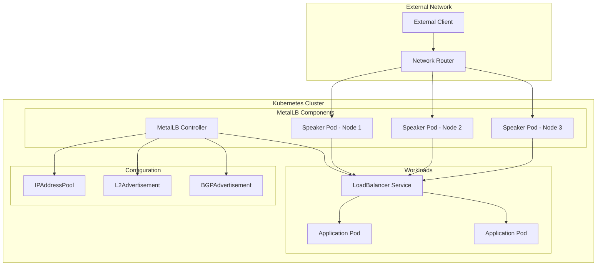
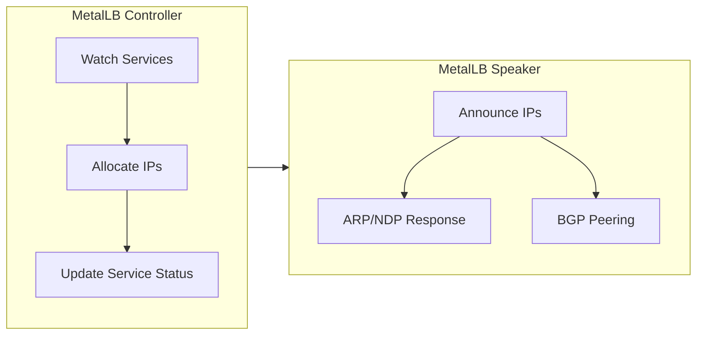
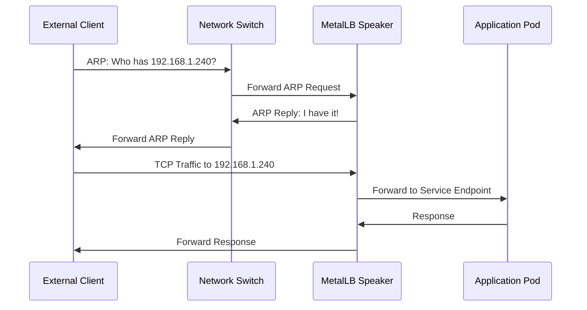
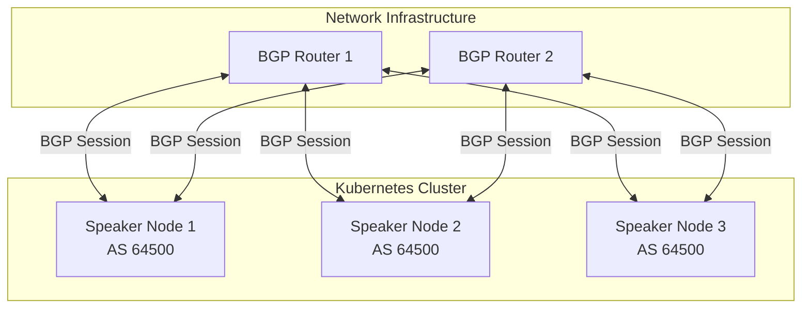

# How to Install MetalLB on Bare-Metal Kubernetes

Author: [nawazdhandala](https://github.com/nawazdhandala)

Tags: MetalLB, Kubernetes, Bare Metal, Load Balancing, Cloud Native

Description: A complete guide to installing and configuring MetalLB for bare-metal Kubernetes clusters.

---

When running Kubernetes in cloud environments like AWS, GCP, or Azure, load balancer services are automatically provisioned through the cloud provider's native load balancing infrastructure. However, bare-metal Kubernetes clusters lack this capability out of the box. This is where MetalLB comes in - a load-balancer implementation specifically designed for bare-metal Kubernetes clusters.

In this comprehensive guide, we will walk through the complete process of installing MetalLB on your bare-metal Kubernetes cluster, covering multiple installation methods, configuration options, and verification steps.

## What is MetalLB?

MetalLB is a load-balancer implementation for bare-metal Kubernetes clusters, using standard network protocols. It provides a network load-balancer implementation that integrates with standard network equipment, so that external services on bare-metal clusters can work as seamlessly as they do in cloud environments.

MetalLB operates in two modes:

1. **Layer 2 Mode (ARP/NDP)**: Uses Address Resolution Protocol (ARP) for IPv4 or Neighbor Discovery Protocol (NDP) for IPv6 to announce IP addresses on the local network.

2. **BGP Mode**: Uses Border Gateway Protocol to advertise IP addresses to network routers for more advanced routing scenarios.

## MetalLB Architecture

The following diagram illustrates how MetalLB integrates with your Kubernetes cluster:



### Component Responsibilities



**Controller**: A cluster-wide controller that watches for services of type LoadBalancer and allocates IP addresses from configured pools.

**Speaker**: A DaemonSet that runs on every node in the cluster. It announces allocated IP addresses using either Layer 2 (ARP/NDP) or BGP protocols.

## Prerequisites

Before installing MetalLB, ensure you have the following:

- A Kubernetes cluster (version 1.13.0 or later) running on bare-metal infrastructure
- `kubectl` installed and configured to communicate with your cluster
- Cluster admin access to create namespaces, deployments, and RBAC resources
- A range of IP addresses that MetalLB can allocate (must be routable on your network)
- If using BGP mode: access to configure your network router for BGP peering

### Network Requirements

Verify your network configuration meets these requirements:

This command checks your Kubernetes version and cluster connectivity:

```bash
# Verify Kubernetes version (must be 1.13.0 or later)
kubectl version --short

# Check cluster nodes are ready
kubectl get nodes -o wide

# Verify you have cluster admin privileges
kubectl auth can-i create namespace --all-namespaces
```

### Strict ARP Mode for kube-proxy

If you are using kube-proxy in IPVS mode, you need to enable strict ARP mode. This is required for MetalLB to work correctly in Layer 2 mode.

This command checks and configures strict ARP mode in kube-proxy:

```bash
# Check if kube-proxy is running in IPVS mode
kubectl get configmap kube-proxy -n kube-system -o yaml | grep mode

# If mode is "ipvs", enable strict ARP by editing the configmap
kubectl edit configmap kube-proxy -n kube-system
```

In the kube-proxy ConfigMap, set the following values:

```yaml
# kube-proxy configuration for IPVS mode with MetalLB
apiVersion: kubeproxy.config.k8s.io/v1alpha1
kind: KubeProxyConfiguration
mode: "ipvs"
ipvs:
  # Enable strict ARP mode - required for MetalLB Layer 2 mode
  # This prevents kube-proxy from responding to ARP requests for LoadBalancer IPs
  strictARP: true
```

After modifying the ConfigMap, restart kube-proxy pods:

```bash
# Restart kube-proxy pods to apply the configuration change
kubectl rollout restart daemonset kube-proxy -n kube-system

# Verify the rollout completed successfully
kubectl rollout status daemonset kube-proxy -n kube-system
```

## Installation Method 1: Using Kubernetes Manifests

The simplest way to install MetalLB is using the official Kubernetes manifests. This method is straightforward and doesn't require additional tools.

### Step 1: Create the MetalLB Namespace and Apply Manifests

First, apply the official MetalLB manifests from the stable release:

```bash
# Apply the MetalLB namespace, CRDs, and controller/speaker deployments
# This single command installs all required components
kubectl apply -f https://raw.githubusercontent.com/metallb/metallb/v0.14.9/config/manifests/metallb-native.yaml
```

### Step 2: Verify the Installation

Wait for MetalLB pods to be ready before proceeding with configuration:

```bash
# Wait for MetalLB controller to be ready
# The controller manages IP allocation for LoadBalancer services
kubectl wait --namespace metallb-system \
  --for=condition=ready pod \
  --selector=app=metallb \
  --timeout=90s

# Check all MetalLB pods are running
kubectl get pods -n metallb-system

# Verify the speaker DaemonSet is deployed on all nodes
kubectl get daemonset -n metallb-system
```

Expected output should show the controller deployment and speaker DaemonSet running:

```
NAME                          READY   STATUS    RESTARTS   AGE
controller-5f784dd8f9-xxxxx   1/1     Running   0          60s
speaker-xxxxx                 1/1     Running   0          60s
speaker-yyyyy                 1/1     Running   0          60s
speaker-zzzzz                 1/1     Running   0          60s
```

## Installation Method 2: Using Helm

Helm provides a more flexible installation method with easy customization through values files.

### Step 1: Add the MetalLB Helm Repository

Add and update the official MetalLB Helm repository:

```bash
# Add the MetalLB Helm repository
# This repository contains the official MetalLB Helm chart
helm repo add metallb https://metallb.github.io/metallb

# Update local Helm repository cache
helm repo update

# Search for available MetalLB versions
helm search repo metallb
```

### Step 2: Create a Values File (Optional)

Create a custom values file to configure MetalLB installation:

```yaml
# metallb-values.yaml
# Custom Helm values for MetalLB installation

# Controller configuration
controller:
  # Enable Prometheus metrics endpoint
  metrics:
    enabled: true
    # Port for Prometheus to scrape metrics
    port: 7472

  # Resource limits and requests for the controller pod
  resources:
    limits:
      cpu: 100m
      memory: 100Mi
    requests:
      cpu: 25m
      memory: 50Mi

# Speaker configuration (runs on every node)
speaker:
  # Enable FRR (Free Range Routing) mode for advanced BGP features
  frr:
    enabled: false

  # Tolerate all taints so speaker runs on all nodes including masters
  tolerations:
    - effect: NoSchedule
      operator: Exists

  # Resource limits for speaker pods
  resources:
    limits:
      cpu: 100m
      memory: 100Mi
    requests:
      cpu: 25m
      memory: 50Mi

# Prometheus ServiceMonitor configuration (if using Prometheus Operator)
prometheus:
  serviceMonitor:
    enabled: false
```

### Step 3: Install MetalLB with Helm

Install MetalLB using the Helm chart with your custom values:

```bash
# Create the metallb-system namespace
kubectl create namespace metallb-system

# Install MetalLB using Helm
# The --wait flag ensures the installation completes before returning
helm install metallb metallb/metallb \
  --namespace metallb-system \
  --values metallb-values.yaml \
  --wait

# Alternative: Install with default values (no custom values file)
# helm install metallb metallb/metallb --namespace metallb-system --wait
```

### Step 4: Verify Helm Installation

Confirm the Helm release was installed correctly:

```bash
# List Helm releases in the metallb-system namespace
helm list -n metallb-system

# Get detailed information about the MetalLB release
helm status metallb -n metallb-system

# Verify all pods are running
kubectl get pods -n metallb-system -o wide
```

## Configuration: IP Address Pools

After installation, MetalLB needs to know which IP addresses it can allocate to LoadBalancer services. This is done by creating an IPAddressPool resource.

### Layer 2 Mode Configuration

Layer 2 mode is the simplest to configure and works on any network. MetalLB responds to ARP requests for allocated IPs.



Create an IPAddressPool for Layer 2 mode:

```yaml
# metallb-config.yaml
# MetalLB IP Address Pool and L2 Advertisement configuration

---
# IPAddressPool defines the range of IP addresses available for allocation
apiVersion: metallb.io/v1beta1
kind: IPAddressPool
metadata:
  # Name used to reference this pool in service annotations
  name: default-pool
  # All MetalLB resources must be in metallb-system namespace
  namespace: metallb-system
spec:
  # Define IP ranges that MetalLB can allocate
  # Ensure these IPs are routable on your network and not used elsewhere
  addresses:
    # CIDR notation: allocate IPs from 192.168.1.240 to 192.168.1.250
    - 192.168.1.240-192.168.1.250
    # You can also use CIDR notation for IP ranges
    # - 192.168.1.0/28
    # Or specify individual IPs
    # - 10.0.0.100/32

  # Automatically assign IPs from this pool (set to false for manual assignment)
  autoAssign: true

---
# L2Advertisement makes MetalLB announce IPs via ARP/NDP
apiVersion: metallb.io/v1beta1
kind: L2Advertisement
metadata:
  name: default-l2-advertisement
  namespace: metallb-system
spec:
  # Reference the IP pool(s) to advertise via Layer 2
  ipAddressPools:
    - default-pool

  # Optional: Restrict which nodes can announce IPs
  # nodeSelectors:
  #   - matchLabels:
  #       node-role.kubernetes.io/worker: ""

  # Optional: Restrict which network interfaces to use for ARP
  # interfaces:
  #   - eth0
```

Apply the configuration:

```bash
# Apply the IPAddressPool and L2Advertisement configuration
kubectl apply -f metallb-config.yaml

# Verify the IPAddressPool was created
kubectl get ipaddresspools -n metallb-system

# Verify the L2Advertisement was created
kubectl get l2advertisements -n metallb-system
```

### BGP Mode Configuration

BGP mode is more advanced and requires router configuration but provides better scalability and load distribution.



Create BGP configuration:

```yaml
# metallb-bgp-config.yaml
# MetalLB BGP Configuration for advanced routing scenarios

---
# IPAddressPool for BGP mode
apiVersion: metallb.io/v1beta1
kind: IPAddressPool
metadata:
  name: bgp-pool
  namespace: metallb-system
spec:
  addresses:
    # IP range to advertise via BGP
    # These should be IPs that your router can route to your cluster
    - 10.0.0.0/24

---
# BGPPeer defines the router to establish BGP session with
apiVersion: metallb.io/v1beta2
kind: BGPPeer
metadata:
  name: router-peer
  namespace: metallb-system
spec:
  # Your router's IP address
  peerAddress: 10.0.0.1
  # Your router's BGP Autonomous System number
  peerASN: 64501
  # MetalLB's ASN (your cluster's ASN)
  myASN: 64500
  # Optional: Restrict which nodes establish BGP sessions
  # nodeSelectors:
  #   - matchLabels:
  #       node-role.kubernetes.io/worker: ""

  # Optional: BGP password for authentication
  # password: "your-bgp-password"

  # Optional: BFD (Bidirectional Forwarding Detection) for faster failover
  # bfdProfile: "fast-failover"

  # Optional: Source address for BGP session
  # sourceAddress: 10.0.0.10

---
# BGPAdvertisement configures how IPs are advertised via BGP
apiVersion: metallb.io/v1beta1
kind: BGPAdvertisement
metadata:
  name: bgp-advertisement
  namespace: metallb-system
spec:
  # Reference the IP pool to advertise
  ipAddressPools:
    - bgp-pool

  # Optional: Aggregate routes to reduce routing table size
  # aggregationLength: 32

  # Optional: Add BGP communities to advertised routes
  # communities:
  #   - 64500:100

  # Optional: Set local preference for route selection
  # localPref: 100
```

Apply the BGP configuration:

```bash
# Apply the BGP configuration
kubectl apply -f metallb-bgp-config.yaml

# Verify BGP peer configuration
kubectl get bgppeers -n metallb-system

# Verify BGP advertisement configuration
kubectl get bgpadvertisements -n metallb-system

# Check speaker logs for BGP session status
kubectl logs -n metallb-system -l component=speaker --tail=50
```

### Multiple IP Pools

You can create multiple IP pools for different use cases:

```yaml
# metallb-multiple-pools.yaml
# Multiple IP Address Pools for different service tiers

---
# Production pool with premium IP addresses
apiVersion: metallb.io/v1beta1
kind: IPAddressPool
metadata:
  name: production-pool
  namespace: metallb-system
spec:
  addresses:
    - 192.168.1.100-192.168.1.120
  # Only allow explicit assignment to production pool
  autoAssign: false

---
# Development pool with auto-assignment enabled
apiVersion: metallb.io/v1beta1
kind: IPAddressPool
metadata:
  name: development-pool
  namespace: metallb-system
spec:
  addresses:
    - 192.168.1.200-192.168.1.220
  # Automatically assign from this pool
  autoAssign: true

---
# L2Advertisement for both pools
apiVersion: metallb.io/v1beta1
kind: L2Advertisement
metadata:
  name: multi-pool-l2
  namespace: metallb-system
spec:
  ipAddressPools:
    - production-pool
    - development-pool
```

## Testing MetalLB Installation

Create a test deployment and service to verify MetalLB is working:

```yaml
# test-metallb.yaml
# Test deployment to verify MetalLB installation

---
# Simple nginx deployment for testing
apiVersion: apps/v1
kind: Deployment
metadata:
  name: nginx-test
  namespace: default
spec:
  replicas: 2
  selector:
    matchLabels:
      app: nginx-test
  template:
    metadata:
      labels:
        app: nginx-test
    spec:
      containers:
        - name: nginx
          image: nginx:alpine
          ports:
            - containerPort: 80

---
# LoadBalancer service to test MetalLB IP allocation
apiVersion: v1
kind: Service
metadata:
  name: nginx-lb
  namespace: default
  annotations:
    # Optional: Request IP from specific pool
    # metallb.universe.tf/address-pool: production-pool

    # Optional: Request specific IP address
    # metallb.universe.tf/loadBalancerIPs: 192.168.1.100
spec:
  type: LoadBalancer
  selector:
    app: nginx-test
  ports:
    - protocol: TCP
      port: 80
      targetPort: 80
```

Apply and verify the test resources:

```bash
# Deploy the test application
kubectl apply -f test-metallb.yaml

# Wait for the deployment to be ready
kubectl wait --for=condition=available deployment/nginx-test --timeout=60s

# Check if MetalLB assigned an external IP to the service
# The EXTERNAL-IP column should show an IP from your configured pool
kubectl get service nginx-lb

# Watch the service until an external IP is assigned
kubectl get service nginx-lb -w
```

Expected output:

```
NAME       TYPE           CLUSTER-IP      EXTERNAL-IP     PORT(S)        AGE
nginx-lb   LoadBalancer   10.96.123.456   192.168.1.240   80:31234/TCP   30s
```

### Verify External Access

Test that you can access the service from outside the cluster:

```bash
# Get the external IP assigned by MetalLB
EXTERNAL_IP=$(kubectl get service nginx-lb -o jsonpath='{.status.loadBalancer.ingress[0].ip}')

# Test HTTP access to the LoadBalancer IP
curl http://$EXTERNAL_IP

# Alternative: Use wget if curl is not available
# wget -qO- http://$EXTERNAL_IP

# Check that all pods are receiving traffic (optional)
# Run multiple requests and check nginx logs
for i in {1..10}; do curl -s http://$EXTERNAL_IP > /dev/null; done
kubectl logs -l app=nginx-test --tail=20
```

## Troubleshooting

If MetalLB is not working as expected, follow these troubleshooting steps:

### Check MetalLB Component Status

Verify all MetalLB components are running correctly:

```bash
# Check controller and speaker pod status
kubectl get pods -n metallb-system -o wide

# Check for any events or errors
kubectl get events -n metallb-system --sort-by='.lastTimestamp'

# View controller logs for IP allocation issues
kubectl logs -n metallb-system -l component=controller --tail=100

# View speaker logs for announcement issues
kubectl logs -n metallb-system -l component=speaker --tail=100
```

### Verify Configuration Resources

Ensure your IP pools and advertisements are configured correctly:

```bash
# List all MetalLB CRDs
kubectl get ipaddresspools,l2advertisements,bgppeers,bgpadvertisements -n metallb-system

# Describe IP pool for detailed status
kubectl describe ipaddresspool -n metallb-system

# Check for configuration errors in MetalLB resources
kubectl get events -n metallb-system | grep -i error
```

### Common Issues and Solutions

**Issue: Service stuck in Pending state with no External IP**

```bash
# Check if IPAddressPool has available IPs
kubectl describe ipaddresspool -n metallb-system

# Check speaker logs for ARP/NDP issues
kubectl logs -n metallb-system -l component=speaker | grep -i error

# Verify L2Advertisement is configured
kubectl get l2advertisements -n metallb-system
```

**Issue: IP assigned but service not reachable**

```bash
# Verify the node running the speaker can reach the network
kubectl get pods -n metallb-system -o wide

# Check if strict ARP is enabled (for IPVS mode)
kubectl get configmap kube-proxy -n kube-system -o yaml | grep strictARP

# Test ARP from another machine on the network
# (run from an external machine)
# arping -I eth0 192.168.1.240
```

### Clean Up Test Resources

After testing, clean up the test deployment:

```bash
# Delete test resources
kubectl delete -f test-metallb.yaml

# Verify cleanup
kubectl get deployment,service nginx-test nginx-lb 2>/dev/null || echo "Test resources cleaned up"
```

## Upgrading MetalLB

### Upgrade with Manifests

When upgrading MetalLB installed via manifests:

```bash
# Check current MetalLB version
kubectl get deployment controller -n metallb-system -o jsonpath='{.spec.template.spec.containers[0].image}'

# Apply the new version manifests (replace version number)
kubectl apply -f https://raw.githubusercontent.com/metallb/metallb/v0.14.9/config/manifests/metallb-native.yaml

# Wait for rollout to complete
kubectl rollout status deployment/controller -n metallb-system
kubectl rollout status daemonset/speaker -n metallb-system
```

### Upgrade with Helm

When upgrading MetalLB installed via Helm:

```bash
# Update Helm repositories
helm repo update

# Check available versions
helm search repo metallb --versions

# Upgrade to the latest version
helm upgrade metallb metallb/metallb \
  --namespace metallb-system \
  --values metallb-values.yaml \
  --wait

# Verify the upgrade
helm list -n metallb-system
kubectl get pods -n metallb-system
```

## Best Practices

1. **IP Address Planning**: Reserve a dedicated IP range for MetalLB that doesn't conflict with DHCP or other services on your network.

2. **Use Separate Pools**: Create separate IP pools for production and non-production workloads to ensure resource isolation.

3. **Monitor IP Usage**: Set up alerts when IP pools are running low on available addresses.

4. **Document Network Configuration**: Keep records of the IP ranges and any router configurations for BGP mode.

5. **Test Failover**: Regularly test node failover scenarios to ensure MetalLB properly migrates IP announcements.

6. **Enable Prometheus Metrics**: Use the built-in Prometheus metrics endpoint to monitor MetalLB health and performance.

## Conclusion

MetalLB provides essential LoadBalancer functionality for bare-metal Kubernetes clusters, bridging the gap between cloud and on-premises deployments. By following this guide, you have successfully installed and configured MetalLB using either Kubernetes manifests or Helm, set up IP address pools, and verified the installation with a test deployment.

Whether you choose Layer 2 mode for simplicity or BGP mode for advanced routing capabilities, MetalLB enables your bare-metal Kubernetes services to be accessible from outside the cluster, just like in cloud environments.

**Related Reading:**

- [How to configure MetalLB with Kubernetes (Microk8s)](https://oneuptime.com/blog/post/2023-11-06-configure-metallb-with-kubernetes-microk8s/view)
- [How moving from AWS to Bare-Metal saved us $230,000 /yr.](https://oneuptime.com/blog/post/2023-10-30-moving-from-aws-to-bare-metal/view)
- [Why build open-source DataDog?](https://oneuptime.com/blog/post/2024-08-14-why-build-open-source-datadog/view)
