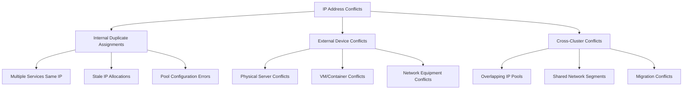
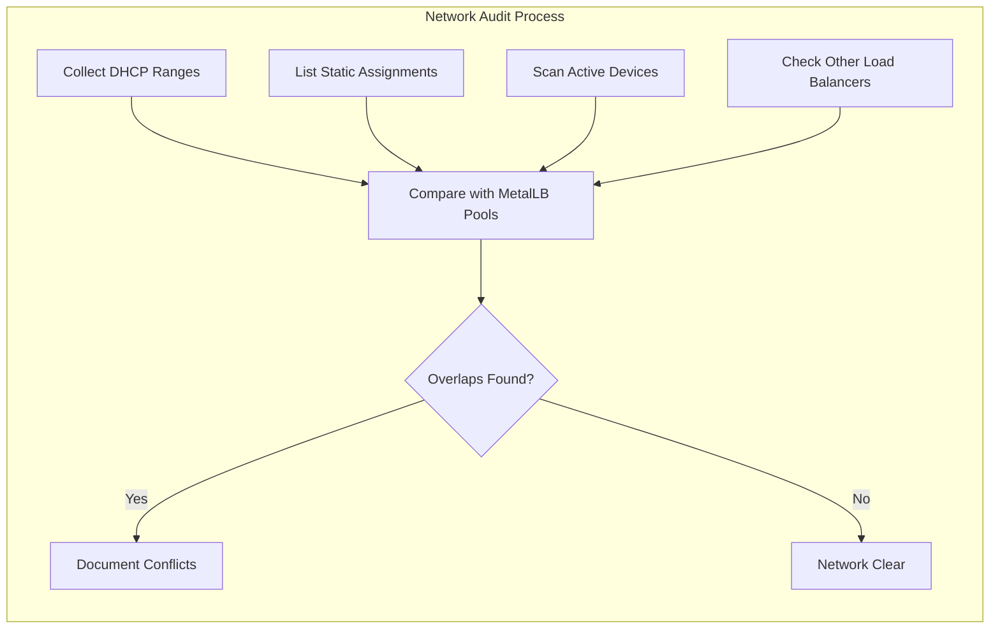
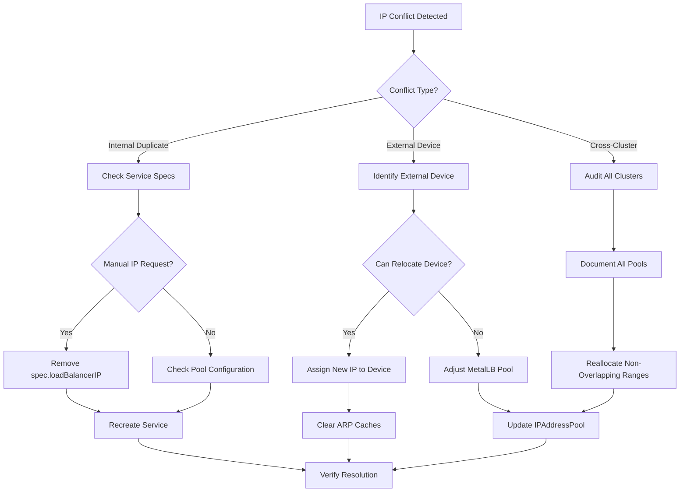
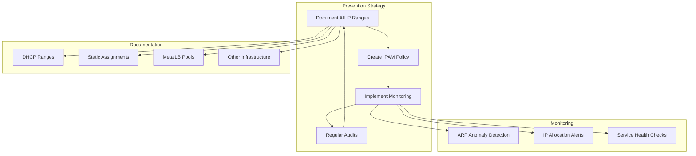

# How to Recover from MetalLB IP Address Conflicts

Author: [nawazdhandala](https://github.com/nawazdhandala)

Tags: MetalLB, Kubernetes, Troubleshooting, IP Management, Networking, Load Balancing, Conflicts

Description: Learn how to recover from MetalLB IP address conflicts including handling duplicate assignments and external conflicts.

---

IP address conflicts in MetalLB can cause serious disruptions to your Kubernetes services. When two devices claim the same IP address, network traffic becomes unpredictable, leading to intermittent connectivity issues, service outages, and frustrated users. This comprehensive guide walks you through identifying, diagnosing, and recovering from various types of MetalLB IP address conflicts.

## Understanding IP Address Conflicts in MetalLB

IP address conflicts occur when multiple network entities attempt to use the same IP address simultaneously. In MetalLB deployments, these conflicts typically fall into three categories:



### Why IP Conflicts Happen

Understanding the root causes helps prevent future conflicts:

1. **Overlapping IP pools** - MetalLB pool ranges overlap with DHCP ranges or static assignments
2. **Manual IP assignments** - Services requesting specific IPs already in use elsewhere
3. **Stale ARP entries** - Network devices caching outdated MAC-to-IP mappings
4. **Multi-cluster deployments** - Multiple Kubernetes clusters sharing network segments
5. **Infrastructure changes** - New servers or VMs assigned IPs from MetalLB ranges

## Detecting IP Address Conflicts

### Symptoms of IP Conflicts

Before diving into detection methods, recognize the common symptoms:

- Intermittent service connectivity
- Random connection timeouts
- Services accessible from some clients but not others
- ARP table inconsistencies across network devices
- Packet loss to specific IP addresses

### Using ARP to Detect Conflicts

The Address Resolution Protocol (ARP) is your primary tool for detecting IP conflicts. This command shows all MAC addresses claiming a specific IP:

```bash
# Check ARP entries for a specific IP
arp -a | grep "192.168.1.100"

# On Linux, use the ip command for more details
ip neigh show | grep "192.168.1.100"
```

### Detecting Conflicts with arping

The arping utility sends ARP requests and reports all responses. Multiple responses indicate a conflict:

```bash
# Send ARP requests and watch for multiple responses
# -D flag enables duplicate detection mode
sudo arping -D -I eth0 -c 5 192.168.1.100
```

### Network-Wide ARP Scan

Scan your entire network segment to identify all devices and their MAC addresses:

```bash
# Install arp-scan if not available
sudo apt-get install arp-scan

# Scan the local network segment
sudo arp-scan --localnet

# Scan a specific range
sudo arp-scan 192.168.1.0/24
```

### Checking MetalLB Service Allocations

Examine what IPs MetalLB has allocated to services:

```bash
# List all LoadBalancer services with their external IPs
kubectl get services --all-namespaces -o wide | grep LoadBalancer

# Get detailed IP allocation information
kubectl get services --all-namespaces -o jsonpath='{range .items[?(@.spec.type=="LoadBalancer")]}{.metadata.namespace}/{.metadata.name}: {.status.loadBalancer.ingress[0].ip}{"\n"}{end}'
```

### Checking MetalLB IPAddressPool Allocations

View the current state of MetalLB IP pools:

```bash
# List all IPAddressPools
kubectl get ipaddresspools -n metallb-system

# Get detailed pool information including allocated addresses
kubectl describe ipaddresspools -n metallb-system
```

## Diagnosing Internal Duplicate Assignments

### Identifying Duplicate Service IPs

Check if multiple services have been assigned the same IP:

```bash
# Find duplicate external IPs across all services
kubectl get services --all-namespaces -o jsonpath='{range .items[?(@.spec.type=="LoadBalancer")]}{.status.loadBalancer.ingress[0].ip}{"\n"}{end}' | sort | uniq -d
```

This script provides a comprehensive duplicate check:

```bash
#!/bin/bash
# duplicate-ip-check.sh - Find duplicate IP assignments in MetalLB

echo "Checking for duplicate IP assignments..."

# Get all LoadBalancer service IPs
kubectl get services --all-namespaces -o json | jq -r '
  .items[] |
  select(.spec.type == "LoadBalancer") |
  select(.status.loadBalancer.ingress != null) |
  "\(.status.loadBalancer.ingress[0].ip) \(.metadata.namespace)/\(.metadata.name)"
' | sort | while read ip svc; do
  count=$(kubectl get services --all-namespaces -o json | jq -r "
    .items[] |
    select(.spec.type == \"LoadBalancer\") |
    select(.status.loadBalancer.ingress != null) |
    select(.status.loadBalancer.ingress[0].ip == \"$ip\") |
    \"\(.metadata.namespace)/\(.metadata.name)\"
  " | wc -l)

  if [ "$count" -gt 1 ]; then
    echo "CONFLICT: IP $ip is assigned to multiple services:"
    kubectl get services --all-namespaces -o json | jq -r "
      .items[] |
      select(.spec.type == \"LoadBalancer\") |
      select(.status.loadBalancer.ingress != null) |
      select(.status.loadBalancer.ingress[0].ip == \"$ip\") |
      \"  - \(.metadata.namespace)/\(.metadata.name)\"
    "
  fi
done
```

### Examining MetalLB Speaker Logs

MetalLB speaker logs reveal IP announcement issues:

```bash
# Check speaker logs for conflict-related messages
kubectl logs -n metallb-system -l app=metallb,component=speaker --tail=100 | grep -i "conflict\|duplicate\|error"

# Follow logs in real-time during troubleshooting
kubectl logs -n metallb-system -l app=metallb,component=speaker -f
```

### Checking MetalLB Controller Events

The controller logs show allocation decisions:

```bash
# Check controller logs for allocation issues
kubectl logs -n metallb-system -l app=metallb,component=controller --tail=100

# Look for specific allocation events
kubectl get events -n metallb-system --sort-by='.lastTimestamp'
```

## Diagnosing External IP Conflicts

### Network Infrastructure Audit

Create an inventory of your network to identify external conflicts:



### DHCP Range Verification

Ensure MetalLB pools do not overlap with DHCP ranges:

```bash
# Example: Check DHCP server configuration (varies by server type)
# For ISC DHCP
cat /etc/dhcp/dhcpd.conf | grep -A 5 "range"

# For dnsmasq
cat /etc/dnsmasq.conf | grep "dhcp-range"
```

### Using tcpdump to Identify Conflicting Devices

Capture ARP traffic to identify which devices are claiming the conflicting IP:

```bash
# Capture ARP traffic for analysis
sudo tcpdump -i eth0 -n arp host 192.168.1.100 -w arp-capture.pcap

# Real-time ARP monitoring
sudo tcpdump -i eth0 -n arp host 192.168.1.100
```

### Analyzing ARP Responses

This script identifies all MAC addresses responding for an IP:

```bash
#!/bin/bash
# find-ip-owners.sh - Identify all devices claiming an IP

IP_ADDRESS=$1
INTERFACE=${2:-eth0}
TIMEOUT=${3:-30}

if [ -z "$IP_ADDRESS" ]; then
  echo "Usage: $0 <ip-address> [interface] [timeout-seconds]"
  exit 1
fi

echo "Monitoring ARP responses for $IP_ADDRESS on $INTERFACE for $TIMEOUT seconds..."
echo "Multiple MAC addresses indicate a conflict."
echo ""

# Capture and analyze ARP responses
sudo timeout $TIMEOUT tcpdump -i $INTERFACE -n -e arp host $IP_ADDRESS 2>/dev/null | \
  grep "is-at" | \
  awk '{print $NF}' | \
  sort -u | \
  while read mac; do
    echo "MAC Address: $mac"
    # Try to identify the vendor
    prefix=$(echo $mac | sed 's/:/-/g' | cut -c1-8 | tr '[:lower:]' '[:upper:]')
    echo "  OUI Prefix: $prefix"
  done
```

## Recovery Procedures

### Recovery Decision Tree

Use this decision tree to determine the appropriate recovery action:



### Procedure 1: Resolving Internal Duplicate Assignments

When multiple services have the same IP, follow these steps:

Step 1: Identify the conflicting services

```bash
# Find services with the conflicting IP
CONFLICT_IP="192.168.1.100"
kubectl get services --all-namespaces -o json | jq -r "
  .items[] |
  select(.spec.type == \"LoadBalancer\") |
  select(.status.loadBalancer.ingress[0].ip == \"$CONFLICT_IP\") |
  \"\(.metadata.namespace) \(.metadata.name)\"
"
```

Step 2: Determine which service should keep the IP

```bash
# Check if either service has a specific IP request
kubectl get service -n <namespace> <service-name> -o jsonpath='{.spec.loadBalancerIP}'
```

Step 3: Remove the conflicting service and let MetalLB reassign

```bash
# Delete and recreate the service that should get a new IP
kubectl get service -n <namespace> <service-name> -o yaml > service-backup.yaml

# Remove the loadBalancerIP if it was manually specified
kubectl patch service -n <namespace> <service-name> --type='json' \
  -p='[{"op": "remove", "path": "/spec/loadBalancerIP"}]'

# Delete and recreate to force new IP assignment
kubectl delete service -n <namespace> <service-name>
kubectl apply -f service-backup.yaml
```

### Procedure 2: Resolving External Device Conflicts

When an external device conflicts with a MetalLB IP:

Step 1: Identify the external device

```bash
# Get the MAC address of the external device
sudo arping -c 5 192.168.1.100

# Look up the device in your network inventory or use nmap
sudo nmap -sn 192.168.1.100
```

Step 2: Choose a resolution strategy

Option A - Relocate the external device to a different IP:

```bash
# After changing the device's IP, clear ARP caches
# On Linux
sudo ip neigh flush dev eth0

# On network switches (varies by vendor)
# Cisco: clear arp-cache
# Juniper: clear arp
```

Option B - Exclude the IP from MetalLB's pool:

```yaml
# Update the IPAddressPool to exclude the conflicting IP
apiVersion: metallb.io/v1beta1
kind: IPAddressPool
metadata:
  name: production-pool
  namespace: metallb-system
spec:
  addresses:
  # Split the range to exclude 192.168.1.100
  - 192.168.1.50-192.168.1.99
  - 192.168.1.101-192.168.1.150
```

Step 3: Force MetalLB to release the IP

```bash
# Delete the service using the conflicting IP
kubectl delete service -n <namespace> <service-name>

# Clear the ARP cache on MetalLB speaker nodes
for pod in $(kubectl get pods -n metallb-system -l component=speaker -o name); do
  kubectl exec -n metallb-system $pod -- ip neigh flush all
done

# Recreate the service
kubectl apply -f service.yaml
```

### Procedure 3: Resolving Cross-Cluster Conflicts

When multiple Kubernetes clusters have overlapping MetalLB pools:

Step 1: Audit all clusters

```bash
#!/bin/bash
# audit-metallb-pools.sh - Audit MetalLB pools across clusters

CLUSTERS=("cluster1" "cluster2" "cluster3")

for cluster in "${CLUSTERS[@]}"; do
  echo "=== $cluster ==="
  kubectl --context=$cluster get ipaddresspools -n metallb-system -o yaml | \
    grep -A 10 "addresses:"
  echo ""
done
```

Step 2: Plan non-overlapping ranges

```mermaid
gantt
    title IP Range Allocation Plan
    dateFormat X
    axisFormat %s

    section Cluster 1
    192.168.1.50-99    :a1, 50, 99

    section Cluster 2
    192.168.1.100-149  :a2, 100, 149

    section Cluster 3
    192.168.1.150-199  :a3, 150, 199

    section Reserved
    192.168.1.200-254  :a4, 200, 254
```



Step 3: Update each cluster's IPAddressPool

Example for cluster reorganization:

```yaml
# cluster1-pool.yaml
apiVersion: metallb.io/v1beta1
kind: IPAddressPool
metadata:
  name: production-pool
  namespace: metallb-system
  labels:
    cluster: cluster1
spec:
  addresses:
  - 192.168.1.50-192.168.1.99
  autoAssign: true
---
# cluster2-pool.yaml
apiVersion: metallb.io/v1beta1
kind: IPAddressPool
metadata:
  name: production-pool
  namespace: metallb-system
  labels:
    cluster: cluster2
spec:
  addresses:
  - 192.168.1.100-192.168.1.149
  autoAssign: true
---
# cluster3-pool.yaml
apiVersion: metallb.io/v1beta1
kind: IPAddressPool
metadata:
  name: production-pool
  namespace: metallb-system
  labels:
    cluster: cluster3
spec:
  addresses:
  - 192.168.1.150-192.168.1.199
  autoAssign: true
```

## Clearing ARP Caches After Resolution

After resolving conflicts, clear ARP caches to ensure immediate effect:

### On Kubernetes Nodes

```bash
# Clear ARP cache on all nodes
kubectl get nodes -o name | while read node; do
  node_name=${node#node/}
  echo "Clearing ARP cache on $node_name"
  kubectl debug node/$node_name -it --image=busybox -- ip neigh flush all
done
```

### On MetalLB Speaker Pods

```bash
# Execute ARP flush on all speaker pods
for pod in $(kubectl get pods -n metallb-system -l component=speaker -o name); do
  echo "Clearing ARP cache in $pod"
  kubectl exec -n metallb-system ${pod#pod/} -- sh -c "ip neigh flush all" 2>/dev/null || true
done
```

### On Network Infrastructure

This varies by vendor. Common examples:

```bash
# Cisco IOS
clear arp-cache

# Cisco NX-OS
clear ip arp force-delete

# Juniper
clear arp

# Arista
clear arp-cache
```

### On Client Machines

```bash
# Linux
sudo ip neigh flush all

# macOS
sudo arp -d -a

# Windows (Run as Administrator)
netsh interface ip delete arpcache
```

## Forcing MetalLB IP Reallocation

Sometimes you need to force MetalLB to completely reallocate IPs:

### Graceful Service Migration

Migrate services to new IPs without downtime:

```bash
#!/bin/bash
# graceful-ip-migration.sh - Migrate service to new IP

NAMESPACE=$1
SERVICE=$2
NEW_IP=$3

if [ -z "$SERVICE" ]; then
  echo "Usage: $0 <namespace> <service> [new-ip]"
  exit 1
fi

echo "Step 1: Creating backup of current service..."
kubectl get service -n $NAMESPACE $SERVICE -o yaml > ${SERVICE}-backup.yaml

echo "Step 2: Creating temporary service for traffic handling..."
kubectl get service -n $NAMESPACE $SERVICE -o yaml | \
  sed "s/name: $SERVICE/name: ${SERVICE}-temp/" | \
  kubectl apply -f -

echo "Step 3: Waiting for temporary service to get IP..."
sleep 10
TEMP_IP=$(kubectl get service -n $NAMESPACE ${SERVICE}-temp -o jsonpath='{.status.loadBalancer.ingress[0].ip}')
echo "Temporary service IP: $TEMP_IP"

echo "Step 4: Deleting original service..."
kubectl delete service -n $NAMESPACE $SERVICE

echo "Step 5: Recreating service with new configuration..."
if [ -n "$NEW_IP" ]; then
  kubectl get service -n $NAMESPACE ${SERVICE}-temp -o yaml | \
    sed "s/name: ${SERVICE}-temp/name: $SERVICE/" | \
    sed "s/loadBalancerIP:.*/loadBalancerIP: $NEW_IP/" | \
    kubectl apply -f -
else
  kubectl get service -n $NAMESPACE ${SERVICE}-temp -o yaml | \
    sed "s/name: ${SERVICE}-temp/name: $SERVICE/" | \
    kubectl apply -f -
fi

echo "Step 6: Verifying new IP assignment..."
sleep 5
NEW_ASSIGNED_IP=$(kubectl get service -n $NAMESPACE $SERVICE -o jsonpath='{.status.loadBalancer.ingress[0].ip}')
echo "New service IP: $NEW_ASSIGNED_IP"

echo "Step 7: Cleaning up temporary service..."
kubectl delete service -n $NAMESPACE ${SERVICE}-temp

echo "Migration complete!"
```

### Force Complete Pool Reallocation

In severe cases, force all services to get new IPs:

```bash
#!/bin/bash
# force-reallocation.sh - Force complete IP reallocation

echo "WARNING: This will cause temporary service disruption!"
read -p "Continue? (yes/no): " confirm
if [ "$confirm" != "yes" ]; then
  echo "Aborted."
  exit 0
fi

# Backup all LoadBalancer services
echo "Creating backups..."
kubectl get services --all-namespaces -o json | jq '.items[] | select(.spec.type=="LoadBalancer")' > lb-services-backup.json

# Delete and recreate MetalLB configuration
echo "Restarting MetalLB controller..."
kubectl rollout restart deployment/controller -n metallb-system

# Wait for controller to be ready
kubectl rollout status deployment/controller -n metallb-system

# Restart all speaker pods
echo "Restarting MetalLB speakers..."
kubectl rollout restart daemonset/speaker -n metallb-system
kubectl rollout status daemonset/speaker -n metallb-system

echo "MetalLB has been restarted. Services will be reallocated."
```

## Preventing Future Conflicts

### IP Address Management Best Practices

Implement these practices to prevent conflicts:



### Implementing IP Address Pool Reservations

Reserve IPs for specific purposes to prevent conflicts:

```yaml
# Reserved IP pools for different purposes
apiVersion: metallb.io/v1beta1
kind: IPAddressPool
metadata:
  name: infrastructure-reserved
  namespace: metallb-system
spec:
  addresses:
  # Reserved for network infrastructure (switches, routers)
  - 192.168.1.1-192.168.1.10
  autoAssign: false
---
apiVersion: metallb.io/v1beta1
kind: IPAddressPool
metadata:
  name: dhcp-excluded
  namespace: metallb-system
spec:
  addresses:
  # Range explicitly excluded - matches DHCP range
  - 192.168.1.11-192.168.1.49
  autoAssign: false
---
apiVersion: metallb.io/v1beta1
kind: IPAddressPool
metadata:
  name: production-services
  namespace: metallb-system
spec:
  addresses:
  # Available for MetalLB allocation
  - 192.168.1.50-192.168.1.99
  autoAssign: true
---
apiVersion: metallb.io/v1beta1
kind: IPAddressPool
metadata:
  name: development-services
  namespace: metallb-system
spec:
  addresses:
  - 192.168.1.100-192.168.1.149
  autoAssign: true
```

### Monitoring for IP Conflicts

Set up proactive monitoring to detect conflicts early:

Create a monitoring script that runs periodically:

```bash
#!/bin/bash
# monitor-ip-conflicts.sh - Detect IP conflicts proactively

LOG_FILE="/var/log/metallb-ip-monitor.log"
ALERT_WEBHOOK="${ALERT_WEBHOOK:-}"

log_message() {
  echo "$(date '+%Y-%m-%d %H:%M:%S') - $1" | tee -a $LOG_FILE
}

send_alert() {
  local message=$1
  log_message "ALERT: $message"

  if [ -n "$ALERT_WEBHOOK" ]; then
    curl -s -X POST -H 'Content-type: application/json' \
      --data "{\"text\":\"MetalLB IP Conflict Alert: $message\"}" \
      $ALERT_WEBHOOK
  fi
}

# Get all MetalLB assigned IPs
metallb_ips=$(kubectl get services --all-namespaces -o jsonpath='{range .items[?(@.spec.type=="LoadBalancer")]}{.status.loadBalancer.ingress[0].ip}{"\n"}{end}' | sort -u)

for ip in $metallb_ips; do
  if [ -z "$ip" ]; then
    continue
  fi

  # Count unique MAC addresses responding to ARP
  mac_count=$(sudo timeout 5 arping -c 3 $ip 2>/dev/null | grep "reply from" | awk '{print $5}' | sort -u | wc -l)

  if [ "$mac_count" -gt 1 ]; then
    send_alert "Multiple devices responding for IP $ip (count: $mac_count)"
  fi

  # Check if IP is responding at all
  if [ "$mac_count" -eq 0 ]; then
    log_message "WARNING: No ARP response for $ip - service may be down"
  fi
done

log_message "IP conflict check completed"
```

### Prometheus Alerts for IP Issues

Configure Prometheus alerts for MetalLB IP problems:

```yaml
# prometheus-metallb-alerts.yaml
apiVersion: monitoring.coreos.com/v1
kind: PrometheusRule
metadata:
  name: metallb-ip-alerts
  namespace: monitoring
spec:
  groups:
  - name: metallb-ip-conflicts
    rules:
    - alert: MetalLBDuplicateIPAssignment
      expr: |
        count by (ip) (
          metallb_allocator_addresses_in_use_total
        ) > 1
      for: 5m
      labels:
        severity: critical
      annotations:
        summary: "Duplicate IP assignment detected"
        description: "IP {{ $labels.ip }} is assigned to multiple services"

    - alert: MetalLBPoolExhausted
      expr: |
        metallb_allocator_addresses_total - metallb_allocator_addresses_in_use_total < 5
      for: 10m
      labels:
        severity: warning
      annotations:
        summary: "MetalLB IP pool nearly exhausted"
        description: "Pool {{ $labels.pool }} has fewer than 5 IPs available"

    - alert: MetalLBSpeakerAnnounceFailure
      expr: |
        increase(metallb_speaker_announce_failed_total[5m]) > 0
      for: 5m
      labels:
        severity: warning
      annotations:
        summary: "MetalLB speaker announce failures"
        description: "Speaker on {{ $labels.node }} failing to announce IPs"
```

## Troubleshooting Common Scenarios

### Scenario 1: Service Gets Wrong IP After Node Failure

When a node fails and recovers, services might get unexpected IPs:

Diagnosis:

```bash
# Check service events
kubectl describe service -n <namespace> <service-name>

# Check speaker logs on all nodes
kubectl logs -n metallb-system -l component=speaker --all-containers
```

Resolution:

```bash
# Force service IP update
kubectl annotate service -n <namespace> <service-name> \
  metallb.universe.tf/address-pool- \
  metallb.universe.tf/address-pool=production-pool

# Or delete and recreate
kubectl delete service -n <namespace> <service-name>
kubectl apply -f service.yaml
```

### Scenario 2: IP Conflict After Network Segment Change

When network infrastructure changes cause conflicts:

```bash
# Full network scan to identify all devices
sudo nmap -sn 192.168.1.0/24 -oG - | grep "Up" | awk '{print $2}'

# Compare with MetalLB allocations
kubectl get services --all-namespaces -o jsonpath='{range .items[?(@.spec.type=="LoadBalancer")]}{.status.loadBalancer.ingress[0].ip}{"\n"}{end}'

# Identify the conflicts and update pools accordingly
```

### Scenario 3: Conflict with Cloud Provider Integration

When integrating MetalLB with cloud environments:

```yaml
# Ensure MetalLB only manages specific IP ranges
# Use avoid-buggy-ips annotation if needed
apiVersion: metallb.io/v1beta1
kind: IPAddressPool
metadata:
  name: on-prem-only
  namespace: metallb-system
spec:
  addresses:
  # Use ranges explicitly not used by cloud provider
  - 10.0.100.0/24
  avoidBuggyIPs: true
```

## Recovery Checklist

Use this checklist when recovering from IP conflicts:

```markdown
## IP Conflict Recovery Checklist

### Detection Phase
- [ ] Identify the conflicting IP address
- [ ] Determine conflict type (internal/external/cross-cluster)
- [ ] Document all devices/services claiming the IP
- [ ] Capture current ARP tables from key network devices

### Analysis Phase
- [ ] Review MetalLB logs for allocation history
- [ ] Check if IP was manually requested or auto-assigned
- [ ] Verify IPAddressPool configuration
- [ ] Audit network for overlapping ranges

### Resolution Phase
- [ ] Choose appropriate resolution strategy
- [ ] Notify affected service owners
- [ ] Execute resolution procedure
- [ ] Clear ARP caches on all relevant devices
- [ ] Verify IP is now unique

### Verification Phase
- [ ] Test service connectivity from multiple clients
- [ ] Verify ARP responses show single MAC
- [ ] Check MetalLB speaker announcements
- [ ] Monitor for conflict recurrence

### Prevention Phase
- [ ] Update documentation with lessons learned
- [ ] Adjust IP pools if necessary
- [ ] Implement/update monitoring
- [ ] Schedule regular audits
```

## Conclusion

IP address conflicts in MetalLB environments can be challenging but are entirely manageable with the right approach. Key takeaways include:

1. **Early detection is critical** - Implement monitoring and regular audits to catch conflicts before they cause outages
2. **Document everything** - Maintain clear records of all IP allocations across your infrastructure
3. **Plan pool ranges carefully** - Ensure MetalLB pools do not overlap with other network allocations
4. **Clear ARP caches** - Always flush ARP caches after resolving conflicts to ensure immediate effect
5. **Test thoroughly** - Verify resolution from multiple network locations before considering the issue resolved

By following the procedures in this guide and implementing preventive measures, you can maintain a stable and conflict-free MetalLB deployment. Remember that network issues often require coordination across teams, so establish clear communication channels with your network administrators and maintain up-to-date documentation of your IP address management strategy.
