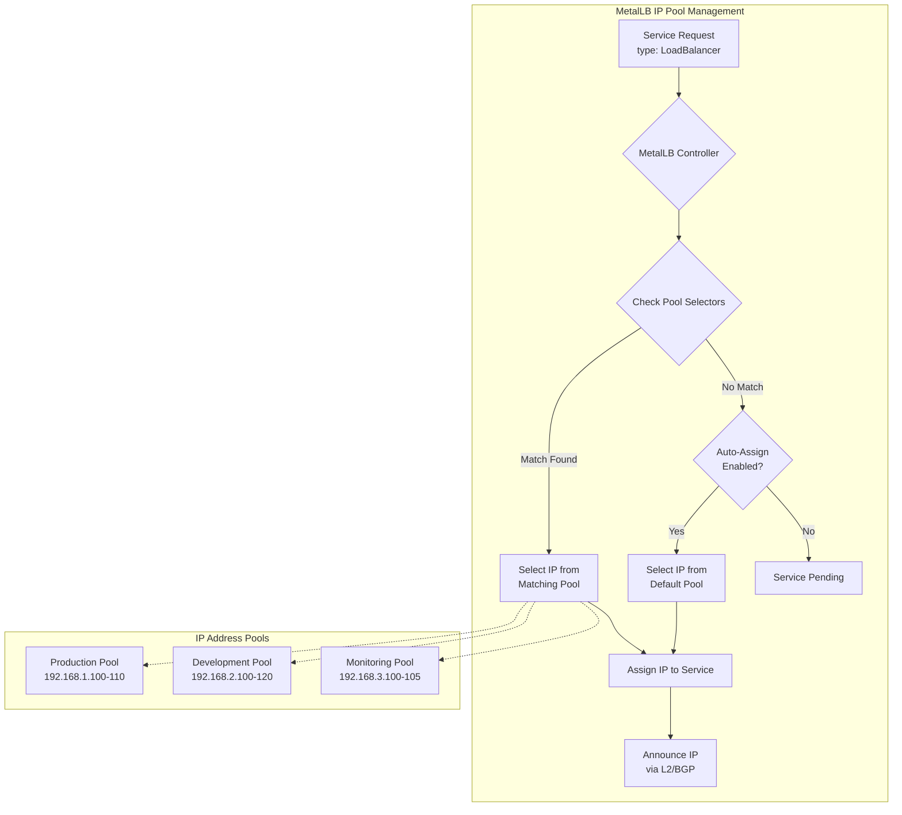
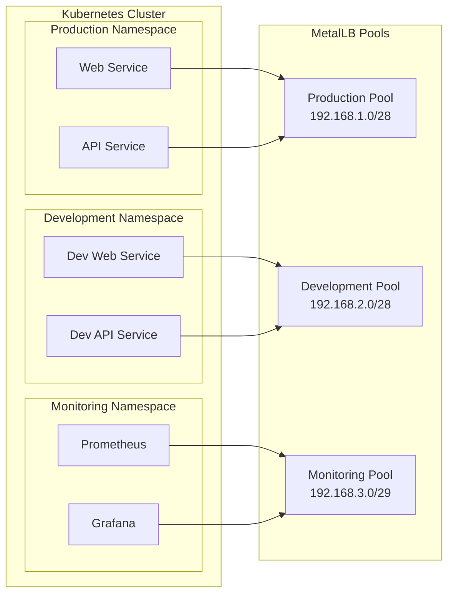
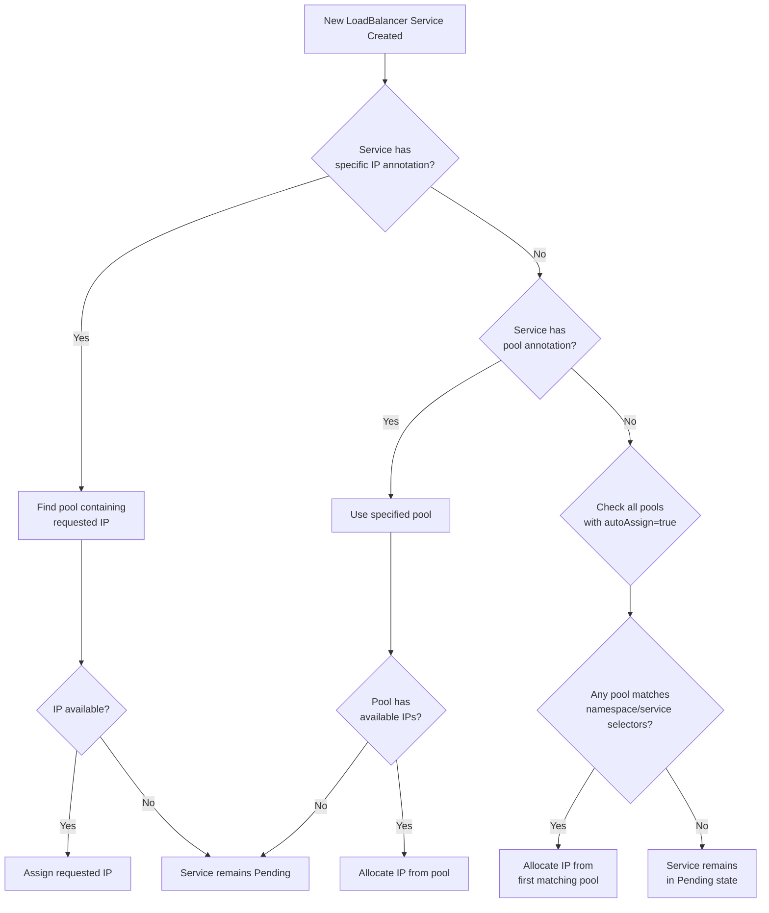

# How to Manage IP Address Pools in MetalLB

Author: [nawazdhandala](https://github.com/nawazdhandala)

Tags: MetalLB, Kubernetes, IP Management, Networking, Load Balancing

Description: Learn how to configure and manage IP address pools for MetalLB load balancers.

---

MetalLB is a powerful load balancer implementation for bare-metal Kubernetes clusters. One of its core features is the ability to manage IP address pools, which allows you to allocate external IP addresses to your LoadBalancer services. In this comprehensive guide, we will explore how to configure and manage IP address pools effectively using the IPAddressPool Custom Resource Definition (CRD).

## Understanding IP Address Pools in MetalLB

Before diving into configuration, let us understand what IP address pools are and how MetalLB uses them. An IP address pool is a range of IP addresses that MetalLB can assign to Kubernetes services of type LoadBalancer. When you create such a service, MetalLB selects an available IP from the configured pools and assigns it to the service.

The following diagram illustrates how MetalLB allocates IPs from pools to services:



## Prerequisites

Before configuring IP address pools, ensure you have:

- A running Kubernetes cluster (v1.20+)
- MetalLB installed (v0.13.0+ for IPAddressPool CRD)
- kubectl configured with cluster access
- Available IP addresses in your network

## The IPAddressPool CRD

MetalLB v0.13.0 introduced the IPAddressPool Custom Resource Definition, replacing the legacy ConfigMap-based configuration. This CRD provides a declarative way to define IP address pools with advanced features like selectors and avoid options.

### Basic IPAddressPool Configuration

Let us start with a simple IP address pool configuration. The following YAML defines a basic pool with a range of IP addresses.

This configuration creates a pool named "production-pool" with IP addresses from 192.168.1.100 to 192.168.1.110:

```yaml
# Basic IPAddressPool configuration
# This pool defines a range of 11 IP addresses for production services
apiVersion: metallb.io/v1beta1
kind: IPAddressPool
metadata:
  # Name used to reference this pool in service annotations
  name: production-pool
  # MetalLB resources must be in the metallb-system namespace
  namespace: metallb-system
spec:
  # Define one or more IP address ranges
  # Each range can be in CIDR notation or start-end format
  addresses:
    # Range format: defines IPs from .100 to .110 (11 addresses)
    - 192.168.1.100-192.168.1.110
```

### Using CIDR Notation

You can also define IP ranges using CIDR notation, which is useful for larger pools or when working with network subnets.

This example shows how to use CIDR notation to define a pool with 16 IP addresses:

```yaml
# IPAddressPool using CIDR notation
# CIDR notation is more compact for larger address ranges
apiVersion: metallb.io/v1beta1
kind: IPAddressPool
metadata:
  name: cidr-pool
  namespace: metallb-system
spec:
  addresses:
    # /28 CIDR block provides 16 addresses (14 usable)
    # Range: 10.0.0.0 - 10.0.0.15
    - 10.0.0.0/28
    # You can mix CIDR and range formats in the same pool
    - 10.0.1.50-10.0.1.60
```

## Configuring Multiple IP Address Pools

In production environments, you often need multiple IP pools for different purposes such as separating production, development, and monitoring traffic. MetalLB allows you to create multiple pools and control which services use which pool.

The following diagram shows a multi-pool architecture:



### Creating Multiple Pools

Here is a comprehensive example defining three separate pools for different environments:

```yaml
# Production pool - High-priority services
# This pool is designated for production workloads with critical SLAs
apiVersion: metallb.io/v1beta1
kind: IPAddressPool
metadata:
  name: production-pool
  namespace: metallb-system
  # Labels help organize and identify pools
  labels:
    environment: production
    tier: critical
spec:
  addresses:
    # 16 addresses reserved for production
    - 192.168.1.100-192.168.1.115
  # autoAssign controls whether this pool is used by default
  # Set to false to require explicit pool selection
  autoAssign: false
---
# Development pool - Lower priority, more addresses
# Used for development and testing environments
apiVersion: metallb.io/v1beta1
kind: IPAddressPool
metadata:
  name: development-pool
  namespace: metallb-system
  labels:
    environment: development
    tier: standard
spec:
  addresses:
    # Larger range for development flexibility
    - 192.168.2.100-192.168.2.150
  # autoAssign true means services without explicit pool selection
  # may receive IPs from this pool
  autoAssign: true
---
# Monitoring pool - Dedicated for observability stack
# Isolated pool for monitoring infrastructure
apiVersion: metallb.io/v1beta1
kind: IPAddressPool
metadata:
  name: monitoring-pool
  namespace: metallb-system
  labels:
    environment: monitoring
    tier: infrastructure
spec:
  addresses:
    # Small dedicated range for monitoring services
    - 192.168.3.100-192.168.3.105
  autoAssign: false
```

## Service Selector Usage

Service selectors allow you to control which services can use which IP pools. This is achieved through namespace selectors, service selectors, or both.

### Namespace-Based Selection

You can restrict a pool to services in specific namespaces using the `namespaceSelectors` field.

This configuration restricts the production pool to services in namespaces labeled with "environment: production":

```yaml
# IPAddressPool with namespace selector
# Only services in matching namespaces can use this pool
apiVersion: metallb.io/v1beta1
kind: IPAddressPool
metadata:
  name: production-pool
  namespace: metallb-system
spec:
  addresses:
    - 192.168.1.100-192.168.1.115
  # Namespace selectors restrict which namespaces can use this pool
  # Uses standard Kubernetes label selectors
  namespaceSelectors:
    # matchLabels requires exact match of all specified labels
    - matchLabels:
        environment: production
```

To use this pool, ensure your namespace has the required label:

```yaml
# Namespace configuration with required labels
# This namespace will be able to use the production-pool
apiVersion: v1
kind: Namespace
metadata:
  name: production-apps
  labels:
    # This label matches the pool's namespaceSelector
    environment: production
    # Additional labels for organization
    team: platform
```

### Service-Based Selection

For more granular control, you can use service selectors to match specific services based on their labels.

This example shows how to create a pool that only serves services with specific labels:

```yaml
# IPAddressPool with service selector
# Provides fine-grained control over which services use this pool
apiVersion: metallb.io/v1beta1
kind: IPAddressPool
metadata:
  name: external-api-pool
  namespace: metallb-system
spec:
  addresses:
    - 203.0.113.10-203.0.113.20
  # Service selectors match services based on their labels
  serviceSelectors:
    # matchExpressions provides more flexible matching
    - matchExpressions:
        # Service must have exposure: external label
        - key: exposure
          operator: In
          values:
            - external
            - public
        # Service must also have tier: api label
        - key: tier
          operator: In
          values:
            - api
            - gateway
```

Create a service that matches this selector:

```yaml
# Service configuration that matches the pool's serviceSelector
# This service will receive an IP from external-api-pool
apiVersion: v1
kind: Service
metadata:
  name: public-api
  namespace: production-apps
  labels:
    # These labels match the pool's serviceSelector
    exposure: external
    tier: api
    app: my-api
spec:
  type: LoadBalancer
  ports:
    - port: 443
      targetPort: 8443
      protocol: TCP
      name: https
  selector:
    app: my-api
```

### Combined Selectors

You can combine namespace and service selectors for maximum control:

```yaml
# IPAddressPool with combined selectors
# Both namespace AND service must match for IP allocation
apiVersion: metallb.io/v1beta1
kind: IPAddressPool
metadata:
  name: secure-external-pool
  namespace: metallb-system
spec:
  addresses:
    - 203.0.113.50-203.0.113.60
  # Both selectors must match for a service to use this pool
  namespaceSelectors:
    - matchLabels:
        security-level: high
  serviceSelectors:
    - matchLabels:
        external-access: "true"
  # Disable auto-assign to prevent accidental usage
  autoAssign: false
```

## Auto-Assign Configuration

The `autoAssign` field controls whether MetalLB automatically uses a pool for services that do not explicitly request a specific pool or IP.

### Understanding Auto-Assign Behavior

The following diagram explains the auto-assign decision process:



### Configuring Auto-Assign

Here are examples of pools with different auto-assign configurations:

```yaml
# Default pool with auto-assign enabled
# This pool will be used for services without explicit pool selection
apiVersion: metallb.io/v1beta1
kind: IPAddressPool
metadata:
  name: default-pool
  namespace: metallb-system
spec:
  addresses:
    - 192.168.10.0/28
  # autoAssign: true (default) means this pool can be used automatically
  # Services without annotations will receive IPs from auto-assign pools
  autoAssign: true
---
# Reserved pool with auto-assign disabled
# This pool requires explicit selection via annotations
apiVersion: metallb.io/v1beta1
kind: IPAddressPool
metadata:
  name: reserved-pool
  namespace: metallb-system
spec:
  addresses:
    # Reserved IPs for specific critical services
    - 192.168.20.10-192.168.20.15
  # autoAssign: false means services must explicitly request this pool
  # Use metallb.universe.tf/address-pool annotation to select
  autoAssign: false
```

### Requesting a Specific Pool

When auto-assign is disabled, services must explicitly request the pool using annotations:

```yaml
# Service requesting a specific IP pool
# Uses MetalLB annotation to select the reserved-pool
apiVersion: v1
kind: Service
metadata:
  name: critical-service
  namespace: production
  annotations:
    # This annotation tells MetalLB to use the reserved-pool
    # The pool name must match exactly
    metallb.universe.tf/address-pool: reserved-pool
spec:
  type: LoadBalancer
  ports:
    - port: 443
      targetPort: 8443
  selector:
    app: critical-app
```

### Requesting a Specific IP Address

You can also request a specific IP address from a pool:

```yaml
# Service requesting a specific IP address
# Useful when you need a predictable IP for DNS or firewall rules
apiVersion: v1
kind: Service
metadata:
  name: dns-critical-service
  namespace: production
  annotations:
    # Request a specific IP address
    # The IP must be within a configured pool's range
    metallb.universe.tf/loadBalancerIPs: 192.168.20.10
spec:
  type: LoadBalancer
  # Alternative method: use loadBalancerIP field (deprecated but still works)
  # loadBalancerIP: 192.168.20.10
  ports:
    - port: 53
      targetPort: 5353
      protocol: UDP
      name: dns
  selector:
    app: dns-server
```

## Avoid Options for IP Allocation

MetalLB provides options to avoid certain IP addresses within a range. This is useful when some IPs in your range are already in use or reserved for other purposes.

### Using avoidBuggyIPs

The `avoidBuggyIPs` option prevents allocation of IPs ending in .0 or .255, which can cause issues with some network equipment:

```yaml
# IPAddressPool with avoidBuggyIPs enabled
# Prevents allocation of potentially problematic IP addresses
apiVersion: metallb.io/v1beta1
kind: IPAddressPool
metadata:
  name: safe-pool
  namespace: metallb-system
spec:
  addresses:
    # Even though this range includes .0 and .255 addresses
    # avoidBuggyIPs will skip them during allocation
    - 192.168.5.0/24
  # avoidBuggyIPs prevents allocation of:
  # - IPs ending in .0 (often treated as network address)
  # - IPs ending in .255 (often treated as broadcast address)
  # This prevents issues with buggy network equipment
  avoidBuggyIPs: true
```

### Working Around Reserved IPs

When you have IPs within a range that are already in use, define your pool to exclude them:

```yaml
# IPAddressPool that works around reserved IPs
# Split ranges to avoid specific addresses
apiVersion: metallb.io/v1beta1
kind: IPAddressPool
metadata:
  name: workaround-pool
  namespace: metallb-system
spec:
  addresses:
    # Split the range to avoid reserved IPs
    # Skip 192.168.6.100 (used by legacy system)
    - 192.168.6.50-192.168.6.99
    - 192.168.6.101-192.168.6.150
    # Skip 192.168.6.120 (used by router)
    # Note: This requires careful planning of address ranges
```

## Advanced Pool Configuration

### IP Sharing Between Services

MetalLB supports IP sharing, allowing multiple services to share the same IP address if they use different ports:

```yaml
# IPAddressPool that allows IP sharing
# Useful for maximizing IP utilization
apiVersion: metallb.io/v1beta1
kind: IPAddressPool
metadata:
  name: shared-ip-pool
  namespace: metallb-system
spec:
  addresses:
    - 192.168.7.100-192.168.7.105
  # Note: IP sharing is controlled per-service via annotations
  # The pool itself just needs to have available IPs
```

Services that want to share an IP must have matching sharing keys:

```yaml
# First service sharing an IP
apiVersion: v1
kind: Service
metadata:
  name: web-http
  annotations:
    # allow-shared-ip enables IP sharing
    # Services with the same key value can share an IP
    metallb.universe.tf/allow-shared-ip: "web-services"
spec:
  type: LoadBalancer
  ports:
    - port: 80
      targetPort: 8080
  selector:
    app: web
---
# Second service sharing the same IP
apiVersion: v1
kind: Service
metadata:
  name: web-https
  annotations:
    # Same sharing key allows these services to share an IP
    metallb.universe.tf/allow-shared-ip: "web-services"
spec:
  type: LoadBalancer
  ports:
    # Different port allows sharing
    - port: 443
      targetPort: 8443
  selector:
    app: web
```

### Priority-Based Pool Selection

When multiple pools match a service, MetalLB uses the first matching pool. You can influence selection order through naming or selectors:

```yaml
# High-priority pool (processed first due to naming convention)
# Use naming conventions to establish implicit priority
apiVersion: metallb.io/v1beta1
kind: IPAddressPool
metadata:
  # Naming convention: 01- prefix for highest priority
  name: 01-premium-pool
  namespace: metallb-system
spec:
  addresses:
    - 10.0.1.0/28
  serviceSelectors:
    - matchLabels:
        tier: premium
  autoAssign: false
---
# Standard priority pool
apiVersion: metallb.io/v1beta1
kind: IPAddressPool
metadata:
  name: 50-standard-pool
  namespace: metallb-system
spec:
  addresses:
    - 10.0.2.0/24
  autoAssign: true
---
# Low-priority fallback pool
apiVersion: metallb.io/v1beta1
kind: IPAddressPool
metadata:
  name: 99-fallback-pool
  namespace: metallb-system
spec:
  addresses:
    - 10.0.3.0/24
  autoAssign: true
```

## Connecting Pools to L2 or BGP Advertisements

IP address pools must be connected to an advertisement configuration to actually announce the IPs to your network.

### L2 Advertisement Configuration

For Layer 2 mode, create an L2Advertisement that references your pools:

```yaml
# IPAddressPool for L2 mode
apiVersion: metallb.io/v1beta1
kind: IPAddressPool
metadata:
  name: l2-pool
  namespace: metallb-system
spec:
  addresses:
    - 192.168.100.0/28
---
# L2Advertisement connects the pool to L2 announcement
# This makes the IPs reachable via ARP/NDP
apiVersion: metallb.io/v1beta1
kind: L2Advertisement
metadata:
  name: l2-advertisement
  namespace: metallb-system
spec:
  # ipAddressPools specifies which pools to advertise
  # If empty, all pools are advertised
  ipAddressPools:
    - l2-pool
  # Optional: restrict to specific interfaces
  # interfaces:
  #   - eth0
```

### BGP Advertisement Configuration

For BGP mode, create a BGPAdvertisement:

```yaml
# IPAddressPool for BGP mode
apiVersion: metallb.io/v1beta1
kind: IPAddressPool
metadata:
  name: bgp-pool
  namespace: metallb-system
spec:
  addresses:
    - 203.0.113.0/28
---
# BGPAdvertisement configures how IPs are announced via BGP
apiVersion: metallb.io/v1beta1
kind: BGPAdvertisement
metadata:
  name: bgp-advertisement
  namespace: metallb-system
spec:
  # ipAddressPools specifies which pools to advertise via BGP
  ipAddressPools:
    - bgp-pool
  # aggregationLength controls route aggregation
  # /32 means each IP is advertised individually
  aggregationLength: 32
  # Optional: set BGP communities
  # communities:
  #   - 65535:65282
  # Optional: set local preference
  # localPref: 100
```

## Monitoring IP Pool Usage

Understanding your IP pool utilization is crucial for capacity planning. Here is how to monitor pool status:

Check allocated IPs using kubectl:

```bash
# View all IPAddressPool resources
# This shows the configured pools and their address ranges
kubectl get ipaddresspools -n metallb-system

# Get detailed information about a specific pool
# Includes events and status information
kubectl describe ipaddresspool production-pool -n metallb-system

# View services and their assigned external IPs
# The EXTERNAL-IP column shows the allocated IP from MetalLB
kubectl get services --all-namespaces -o wide | grep LoadBalancer

# Check MetalLB controller logs for allocation events
# Useful for debugging IP allocation issues
kubectl logs -n metallb-system -l app=metallb -c controller | grep -i "allocated\|assigned"
```

## Complete Example: Multi-Environment Setup

Here is a complete example bringing together all concepts for a production-ready multi-environment setup:

```yaml
# Complete multi-environment MetalLB configuration
# This setup provides isolated IP pools for different environments
# with appropriate selectors and auto-assign policies

---
# Production pool - Restricted, manual assignment only
apiVersion: metallb.io/v1beta1
kind: IPAddressPool
metadata:
  name: production-external
  namespace: metallb-system
  labels:
    environment: production
spec:
  addresses:
    # Public-facing production IPs
    - 203.0.113.10-203.0.113.30
  # Require explicit pool selection for production
  autoAssign: false
  # Avoid edge case IPs
  avoidBuggyIPs: true
  # Only production namespace can use this pool
  namespaceSelectors:
    - matchLabels:
        environment: production
  # Only services marked for external access
  serviceSelectors:
    - matchLabels:
        external-access: "true"

---
# Staging pool - Semi-restricted
apiVersion: metallb.io/v1beta1
kind: IPAddressPool
metadata:
  name: staging-external
  namespace: metallb-system
  labels:
    environment: staging
spec:
  addresses:
    # Staging environment IPs
    - 192.168.50.0/28
  autoAssign: false
  namespaceSelectors:
    - matchLabels:
        environment: staging

---
# Development pool - Open for auto-assignment
apiVersion: metallb.io/v1beta1
kind: IPAddressPool
metadata:
  name: development-pool
  namespace: metallb-system
  labels:
    environment: development
spec:
  addresses:
    # Large range for development flexibility
    - 192.168.100.0/24
  # Allow auto-assignment for developer convenience
  autoAssign: true
  # Only development namespaces
  namespaceSelectors:
    - matchExpressions:
        - key: environment
          operator: In
          values:
            - development
            - dev
            - sandbox

---
# Internal services pool - Cluster-internal load balancing
apiVersion: metallb.io/v1beta1
kind: IPAddressPool
metadata:
  name: internal-services
  namespace: metallb-system
  labels:
    exposure: internal
spec:
  addresses:
    - 10.10.0.0/24
  autoAssign: true
  serviceSelectors:
    - matchLabels:
        exposure: internal

---
# L2 Advertisement for all pools
apiVersion: metallb.io/v1beta1
kind: L2Advertisement
metadata:
  name: all-pools-l2
  namespace: metallb-system
spec:
  # Advertise all pools via L2
  # Remove this to advertise specific pools only
  ipAddressPools:
    - production-external
    - staging-external
    - development-pool
    - internal-services
```

## Troubleshooting Common Issues

### Service Stuck in Pending State

If a service remains in Pending state without an external IP:

```bash
# Check if any pools have available addresses
kubectl get ipaddresspools -n metallb-system -o yaml

# Verify the service matches pool selectors
kubectl get service <service-name> -o yaml

# Check MetalLB controller logs for errors
kubectl logs -n metallb-system deployment/controller | grep -i error

# Verify namespace labels match pool's namespaceSelectors
kubectl get namespace <namespace> --show-labels
```

### IP Not Being Announced

If an IP is assigned but not reachable:

```bash
# For L2 mode, check speaker logs
kubectl logs -n metallb-system -l component=speaker

# Verify L2Advertisement or BGPAdvertisement exists
kubectl get l2advertisements,bgpadvertisements -n metallb-system

# Check if the advertisement references the correct pool
kubectl describe l2advertisement <name> -n metallb-system
```

## Best Practices

1. **Use meaningful pool names**: Name pools based on their purpose (e.g., `production-external`, `internal-services`)

2. **Disable auto-assign for production**: Require explicit pool selection for critical workloads

3. **Document IP ranges**: Maintain documentation of which IP ranges are used for what purpose

4. **Plan for growth**: Allocate larger ranges than immediately needed to avoid reconfiguration

5. **Use selectors**: Implement namespace and service selectors to prevent accidental IP allocation

6. **Monitor utilization**: Regularly check pool usage to avoid exhaustion

7. **Separate internal and external**: Use different pools for internal and external-facing services

8. **Test in non-production**: Validate pool configurations in development before production deployment

## Conclusion

Managing IP address pools in MetalLB provides flexible and powerful control over how external IPs are allocated to your Kubernetes services. By understanding the IPAddressPool CRD, selectors, auto-assign behavior, and advertisement configurations, you can build a robust load balancing infrastructure for your bare-metal Kubernetes clusters.

The key takeaways are:

- Use the IPAddressPool CRD for declarative IP pool management
- Implement multiple pools for different environments and use cases
- Use namespace and service selectors for precise control
- Configure auto-assign based on your operational requirements
- Always connect pools to L2 or BGP advertisements for network reachability

With these configurations in place, MetalLB becomes a powerful tool for managing external access to your Kubernetes services in bare-metal environments.
