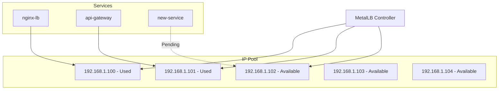
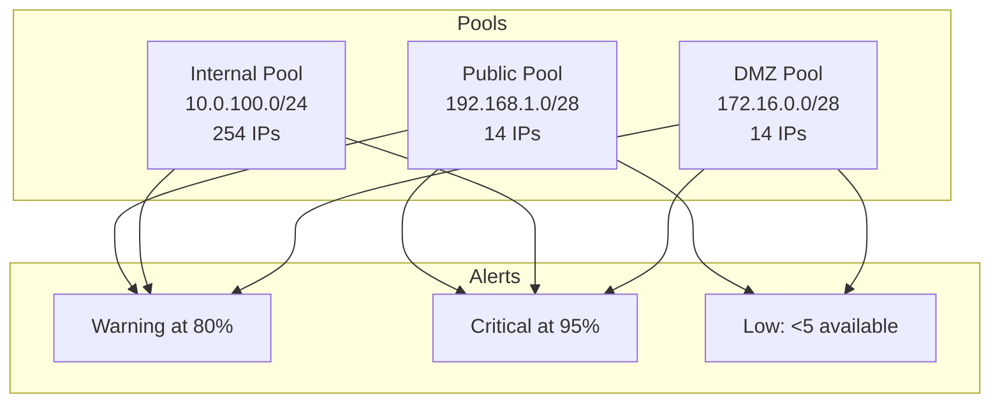

# How to Set Up Alerts for MetalLB IP Pool Exhaustion

Author: [nawazdhandala](https://github.com/nawazdhandala)

Tags: MetalLB, Kubernetes, Alerting, Monitoring, Prometheus, Load Balancing, Capacity Planning

Description: Learn how to set up proactive alerts for MetalLB IP pool exhaustion to ensure IP address availability.

---

Running out of IP addresses in your MetalLB pool can cause new LoadBalancer services to fail silently. By the time you notice, critical services may be unreachable. This guide shows you how to set up proactive monitoring and alerts before exhaustion happens.

## Understanding MetalLB IP Pool Architecture

MetalLB manages IP address pools for LoadBalancer services in bare-metal Kubernetes clusters. When a service requests an external IP, MetalLB allocates one from the configured pool.



**Why Pool Exhaustion Matters:**
- New LoadBalancer services will remain in `Pending` state
- No automatic notification when pool is exhausted
- Can block critical deployments unexpectedly
- Recovery requires either releasing IPs or expanding the pool

## Prerequisites

Before setting up alerts, ensure you have:
- MetalLB installed and configured in your cluster
- Prometheus deployed for metrics collection
- Alertmanager configured for notifications (optional but recommended)

## Enabling MetalLB Metrics

MetalLB exposes Prometheus metrics by default on port 7472. First, verify metrics are available.

Check if metrics are being exposed by the MetalLB speaker pods.

```bash
kubectl get pods -n metallb-system -l app=metallb,component=speaker -o wide
```

Test metrics endpoint from within the cluster.

```bash
kubectl run curl-test --image=curlimages/curl -it --rm -- \
  curl -s http://<speaker-pod-ip>:7472/metrics | grep metallb
```

### ServiceMonitor for Prometheus Operator

If you are using the Prometheus Operator, create a ServiceMonitor to automatically discover and scrape MetalLB metrics.

```yaml
apiVersion: monitoring.coreos.com/v1
kind: ServiceMonitor
metadata:
  name: metallb
  namespace: monitoring
  labels:
    app: metallb
spec:
  selector:
    matchLabels:
      app: metallb
  namespaceSelector:
    matchNames:
      - metallb-system
  endpoints:
    - port: monitoring
      interval: 30s
      path: /metrics
```

### Manual Prometheus Configuration

If you are not using the Prometheus Operator, add this job to your Prometheus configuration file.

```yaml
scrape_configs:
  - job_name: 'metallb'
    kubernetes_sd_configs:
      - role: pod
        namespaces:
          names:
            - metallb-system
    relabel_configs:
      - source_labels: [__meta_kubernetes_pod_label_app]
        action: keep
        regex: metallb
      - source_labels: [__meta_kubernetes_pod_container_port_number]
        action: keep
        regex: "7472"
      - source_labels: [__meta_kubernetes_namespace]
        target_label: namespace
      - source_labels: [__meta_kubernetes_pod_name]
        target_label: pod
```

## Key MetalLB Metrics

MetalLB exposes several metrics. Here are the most important ones for monitoring IP pool health.

| Metric | Description | Type |
|--------|-------------|------|
| `metallb_allocator_addresses_total` | Total addresses in each pool | Gauge |
| `metallb_allocator_addresses_in_use_total` | Addresses currently allocated | Gauge |
| `metallb_bgp_session_up` | BGP session status (BGP mode) | Gauge |
| `metallb_k8s_client_updates_total` | Kubernetes API updates processed | Counter |

## Calculating IP Pool Usage

The core calculation for IP pool usage is straightforward. This PromQL query calculates the percentage of IPs in use for each pool.

```promql
(metallb_allocator_addresses_in_use_total / metallb_allocator_addresses_total) * 100
```

For available IPs remaining per pool, use this query.

```promql
metallb_allocator_addresses_total - metallb_allocator_addresses_in_use_total
```

## Creating Alert Rules

### Basic Exhaustion Alert

This alert fires when 80% of the IP pool is consumed, giving you time to act before complete exhaustion.

```yaml
apiVersion: monitoring.coreos.com/v1
kind: PrometheusRule
metadata:
  name: metallb-ip-pool-alerts
  namespace: monitoring
  labels:
    prometheus: main
    role: alert-rules
spec:
  groups:
    - name: metallb.rules
      rules:
        - alert: MetalLBIPPoolNearExhaustion
          expr: |
            (
              metallb_allocator_addresses_in_use_total
              / metallb_allocator_addresses_total
            ) * 100 > 80
          for: 5m
          labels:
            severity: warning
          annotations:
            summary: "MetalLB IP pool {{ $labels.pool }} is {{ $value | printf \"%.1f\" }}% utilized"
            description: |
              IP pool {{ $labels.pool }} has {{ $value | printf "%.1f" }}% utilization.
              Consider expanding the pool or releasing unused LoadBalancer services.
            runbook_url: "https://wiki.example.com/runbooks/metallb-ip-exhaustion"
```

### Critical Exhaustion Alert

Fire a critical alert when the pool reaches 95% utilization or is completely exhausted.

```yaml
        - alert: MetalLBIPPoolExhausted
          expr: |
            (
              metallb_allocator_addresses_in_use_total
              / metallb_allocator_addresses_total
            ) * 100 >= 95
          for: 2m
          labels:
            severity: critical
            team: platform
          annotations:
            summary: "MetalLB IP pool {{ $labels.pool }} is critically exhausted"
            description: |
              IP pool {{ $labels.pool }} is at {{ $value | printf "%.1f" }}% utilization.
              New LoadBalancer services cannot be created.
              Immediate action required.
```

### Low Available IPs Alert

Sometimes percentage-based alerts are not granular enough. This alert triggers when fewer than 5 IPs remain.

```yaml
        - alert: MetalLBIPPoolLowAvailability
          expr: |
            (metallb_allocator_addresses_total - metallb_allocator_addresses_in_use_total) < 5
          for: 5m
          labels:
            severity: warning
          annotations:
            summary: "MetalLB IP pool {{ $labels.pool }} has only {{ $value }} IPs available"
            description: |
              Pool {{ $labels.pool }} has fewer than 5 available IP addresses.
              Total: {{ with printf "metallb_allocator_addresses_total{pool='%s'}" $labels.pool | query }}{{ . | first | value }}{{ end }}
              In Use: {{ with printf "metallb_allocator_addresses_in_use_total{pool='%s'}" $labels.pool | query }}{{ . | first | value }}{{ end }}
```

### Zero Available IPs Alert

This critical alert fires immediately when the pool is completely exhausted.

```yaml
        - alert: MetalLBIPPoolDepleted
          expr: |
            (metallb_allocator_addresses_total - metallb_allocator_addresses_in_use_total) == 0
          for: 1m
          labels:
            severity: critical
            pager: "true"
          annotations:
            summary: "MetalLB IP pool {{ $labels.pool }} has no available IPs"
            description: |
              Pool {{ $labels.pool }} is completely exhausted.
              All {{ with printf "metallb_allocator_addresses_total{pool='%s'}" $labels.pool | query }}{{ . | first | value }}{{ end }} IPs are in use.
              New LoadBalancer services will fail to get an external IP.
```

## Complete PrometheusRule Manifest

Here is a complete manifest with all recommended alerts for MetalLB IP pool monitoring.

```yaml
apiVersion: monitoring.coreos.com/v1
kind: PrometheusRule
metadata:
  name: metallb-ip-pool-alerts
  namespace: monitoring
  labels:
    prometheus: main
    role: alert-rules
spec:
  groups:
    - name: metallb.rules
      interval: 30s
      rules:
        - alert: MetalLBIPPoolNearExhaustion
          expr: |
            (
              metallb_allocator_addresses_in_use_total
              / metallb_allocator_addresses_total
            ) * 100 > 80
          for: 5m
          labels:
            severity: warning
          annotations:
            summary: "MetalLB IP pool {{ $labels.pool }} is {{ $value | printf \"%.1f\" }}% utilized"
            description: "IP pool utilization is high. Consider expanding the pool."

        - alert: MetalLBIPPoolExhausted
          expr: |
            (
              metallb_allocator_addresses_in_use_total
              / metallb_allocator_addresses_total
            ) * 100 >= 95
          for: 2m
          labels:
            severity: critical
          annotations:
            summary: "MetalLB IP pool {{ $labels.pool }} is critically exhausted at {{ $value | printf \"%.1f\" }}%"
            description: "New LoadBalancer services cannot be created. Immediate action required."

        - alert: MetalLBIPPoolLowAvailability
          expr: |
            (metallb_allocator_addresses_total - metallb_allocator_addresses_in_use_total) < 5
          for: 5m
          labels:
            severity: warning
          annotations:
            summary: "MetalLB IP pool {{ $labels.pool }} has only {{ $value }} IPs available"
            description: "Pool is running low on available IP addresses."

        - alert: MetalLBIPPoolDepleted
          expr: |
            (metallb_allocator_addresses_total - metallb_allocator_addresses_in_use_total) == 0
          for: 1m
          labels:
            severity: critical
          annotations:
            summary: "MetalLB IP pool {{ $labels.pool }} has no available IPs"
            description: "Pool is completely exhausted. New services will fail."

        - alert: MetalLBMetricsDown
          expr: |
            absent(metallb_allocator_addresses_total) == 1
          for: 5m
          labels:
            severity: warning
          annotations:
            summary: "MetalLB metrics are not available"
            description: "Cannot monitor IP pool status. Check MetalLB speaker pods."
```

## Alertmanager Configuration

Configure Alertmanager to route MetalLB alerts to appropriate channels. This example routes warnings to Slack and critical alerts to PagerDuty.

```yaml
apiVersion: v1
kind: Secret
metadata:
  name: alertmanager-main
  namespace: monitoring
type: Opaque
stringData:
  alertmanager.yaml: |
    global:
      slack_api_url: 'https://hooks.slack.com/services/YOUR/SLACK/WEBHOOK'
      pagerduty_url: 'https://events.pagerduty.com/v2/enqueue'

    route:
      receiver: 'default'
      group_by: ['alertname', 'pool']
      group_wait: 30s
      group_interval: 5m
      repeat_interval: 4h
      routes:
        - match:
            severity: critical
            alertname: MetalLBIPPoolExhausted
          receiver: 'pagerduty-critical'
          continue: true
        - match:
            severity: critical
            alertname: MetalLBIPPoolDepleted
          receiver: 'pagerduty-critical'
          continue: true
        - match_re:
            alertname: MetalLB.*
          receiver: 'slack-platform'

    receivers:
      - name: 'default'
        slack_configs:
          - channel: '#alerts'
            send_resolved: true

      - name: 'slack-platform'
        slack_configs:
          - channel: '#platform-alerts'
            send_resolved: true
            title: '{{ .Status | toUpper }}: {{ .CommonAnnotations.summary }}'
            text: '{{ .CommonAnnotations.description }}'

      - name: 'pagerduty-critical'
        pagerduty_configs:
          - routing_key: 'YOUR_PAGERDUTY_ROUTING_KEY'
            severity: critical
            description: '{{ .CommonAnnotations.summary }}'
            details:
              pool: '{{ .CommonLabels.pool }}'
              severity: '{{ .CommonLabels.severity }}'
```

## Grafana Dashboard

Create a Grafana dashboard to visualize IP pool usage. This JSON can be imported directly into Grafana.

```json
{
  "dashboard": {
    "title": "MetalLB IP Pool Status",
    "panels": [
      {
        "title": "IP Pool Utilization",
        "type": "gauge",
        "targets": [
          {
            "expr": "(metallb_allocator_addresses_in_use_total / metallb_allocator_addresses_total) * 100",
            "legendFormat": "{{ pool }}"
          }
        ],
        "fieldConfig": {
          "defaults": {
            "thresholds": {
              "steps": [
                { "color": "green", "value": 0 },
                { "color": "yellow", "value": 70 },
                { "color": "orange", "value": 80 },
                { "color": "red", "value": 95 }
              ]
            },
            "unit": "percent",
            "min": 0,
            "max": 100
          }
        }
      },
      {
        "title": "Available IPs per Pool",
        "type": "stat",
        "targets": [
          {
            "expr": "metallb_allocator_addresses_total - metallb_allocator_addresses_in_use_total",
            "legendFormat": "{{ pool }}"
          }
        ],
        "fieldConfig": {
          "defaults": {
            "thresholds": {
              "steps": [
                { "color": "red", "value": 0 },
                { "color": "orange", "value": 3 },
                { "color": "yellow", "value": 5 },
                { "color": "green", "value": 10 }
              ]
            }
          }
        }
      },
      {
        "title": "IP Usage Over Time",
        "type": "timeseries",
        "targets": [
          {
            "expr": "metallb_allocator_addresses_in_use_total",
            "legendFormat": "{{ pool }} - In Use"
          },
          {
            "expr": "metallb_allocator_addresses_total",
            "legendFormat": "{{ pool }} - Total"
          }
        ]
      }
    ]
  }
}
```

### Dashboard Query Details

For a more detailed dashboard, use these individual panel queries.

Total IPs in Pool visualization query.

```promql
metallb_allocator_addresses_total
```

Currently Allocated IPs visualization query.

```promql
metallb_allocator_addresses_in_use_total
```

Utilization Percentage over time visualization query.

```promql
(metallb_allocator_addresses_in_use_total / metallb_allocator_addresses_total) * 100
```

IP Allocation Rate to track how fast IPs are being consumed.

```promql
rate(metallb_allocator_addresses_in_use_total[1h])
```

## Monitoring Pending LoadBalancer Services

In addition to MetalLB metrics, monitor Kubernetes for services stuck in Pending state due to IP exhaustion.

This recording rule creates a metric for services without external IPs assigned.

```yaml
apiVersion: monitoring.coreos.com/v1
kind: PrometheusRule
metadata:
  name: metallb-service-alerts
  namespace: monitoring
spec:
  groups:
    - name: metallb.service.rules
      rules:
        - alert: LoadBalancerServicePending
          expr: |
            kube_service_status_load_balancer_ingress == 0
            and on(service, namespace)
            kube_service_spec_type{type="LoadBalancer"}
          for: 10m
          labels:
            severity: warning
          annotations:
            summary: "LoadBalancer service {{ $labels.namespace }}/{{ $labels.service }} has no external IP"
            description: |
              Service has been pending for more than 10 minutes.
              This may indicate MetalLB IP pool exhaustion.
```

## Multi-Pool Monitoring Strategy

If you have multiple IP pools for different purposes, monitor them individually with appropriate thresholds.



Pool-specific alerts with different thresholds based on pool size.

```yaml
apiVersion: monitoring.coreos.com/v1
kind: PrometheusRule
metadata:
  name: metallb-multipool-alerts
  namespace: monitoring
spec:
  groups:
    - name: metallb.multipool.rules
      rules:
        - alert: MetalLBPublicPoolNearExhaustion
          expr: |
            (
              metallb_allocator_addresses_in_use_total{pool="public"}
              / metallb_allocator_addresses_total{pool="public"}
            ) * 100 > 70
          for: 5m
          labels:
            severity: warning
            pool_type: public
          annotations:
            summary: "Public IP pool is {{ $value | printf \"%.1f\" }}% utilized"

        - alert: MetalLBInternalPoolNearExhaustion
          expr: |
            (
              metallb_allocator_addresses_in_use_total{pool="internal"}
              / metallb_allocator_addresses_total{pool="internal"}
            ) * 100 > 85
          for: 5m
          labels:
            severity: warning
            pool_type: internal
          annotations:
            summary: "Internal IP pool is {{ $value | printf \"%.1f\" }}% utilized"
```

## Capacity Planning Queries

Use these queries for long-term capacity planning.

Weekly IP usage trend to predict future needs.

```promql
predict_linear(metallb_allocator_addresses_in_use_total[7d], 30*24*60*60)
```

Average daily IP allocation rate.

```promql
avg_over_time(
  increase(metallb_allocator_addresses_in_use_total[1d])[7d:1d]
)
```

Days until pool exhaustion at current rate.

```promql
(metallb_allocator_addresses_total - metallb_allocator_addresses_in_use_total)
/
(rate(metallb_allocator_addresses_in_use_total[7d]) * 86400)
```

## Automated Remediation

While manual intervention is often needed, you can set up some automated responses.

### Webhook Receiver for Custom Actions

Deploy a webhook receiver that can trigger remediation actions.

```yaml
apiVersion: apps/v1
kind: Deployment
metadata:
  name: metallb-alert-receiver
  namespace: monitoring
spec:
  replicas: 1
  selector:
    matchLabels:
      app: metallb-alert-receiver
  template:
    metadata:
      labels:
        app: metallb-alert-receiver
    spec:
      containers:
        - name: receiver
          image: your-registry/alert-receiver:latest
          ports:
            - containerPort: 8080
          env:
            - name: SLACK_WEBHOOK_URL
              valueFrom:
                secretKeyRef:
                  name: alert-receiver-secrets
                  key: slack-webhook
---
apiVersion: v1
kind: Service
metadata:
  name: metallb-alert-receiver
  namespace: monitoring
spec:
  selector:
    app: metallb-alert-receiver
  ports:
    - port: 80
      targetPort: 8080
```

### Script to Find Unused LoadBalancer Services

This script helps identify LoadBalancer services that might be safe to clean up.

```bash
#!/bin/bash

echo "LoadBalancer services with no recent traffic:"
echo "============================================="

for ns in $(kubectl get namespaces -o jsonpath='{.items[*].metadata.name}'); do
  for svc in $(kubectl get services -n $ns -o jsonpath='{.items[?(@.spec.type=="LoadBalancer")].metadata.name}'); do
    ip=$(kubectl get svc $svc -n $ns -o jsonpath='{.status.loadBalancer.ingress[0].ip}')

    if [ -n "$ip" ]; then
      endpoints=$(kubectl get endpoints $svc -n $ns -o jsonpath='{.subsets[*].addresses[*].ip}' | wc -w)

      if [ "$endpoints" -eq 0 ]; then
        echo "No endpoints: $ns/$svc (IP: $ip)"
      fi
    fi
  done
done
```

## Testing Your Alerts

Verify that alerts fire correctly by creating test conditions.

Create a test pool with limited IPs to trigger alerts.

```yaml
apiVersion: metallb.io/v1beta1
kind: IPAddressPool
metadata:
  name: test-pool
  namespace: metallb-system
spec:
  addresses:
    - 192.168.200.100-192.168.200.102
---
apiVersion: metallb.io/v1beta1
kind: L2Advertisement
metadata:
  name: test-advertisement
  namespace: metallb-system
spec:
  ipAddressPools:
    - test-pool
```

Create services to consume the test pool IPs.

```bash
for i in 1 2 3; do
  kubectl create deployment test-$i --image=nginx
  kubectl expose deployment test-$i --type=LoadBalancer --port=80 \
    --annotation="metallb.universe.tf/address-pool=test-pool"
done
```

Watch for alerts to fire.

```bash
kubectl port-forward -n monitoring svc/alertmanager 9093:9093 &
curl -s http://localhost:9093/api/v2/alerts | jq '.[] | select(.labels.alertname | contains("MetalLB"))'
```

Clean up test resources after verification.

```bash
for i in 1 2 3; do
  kubectl delete deployment test-$i
  kubectl delete service test-$i
done
kubectl delete ipaddresspool test-pool -n metallb-system
kubectl delete l2advertisement test-advertisement -n metallb-system
```

## Troubleshooting Common Issues

### Metrics Not Appearing

If MetalLB metrics are not showing up in Prometheus, check these common issues.

Verify MetalLB pods are running.

```bash
kubectl get pods -n metallb-system
```

Check if metrics port is exposed.

```bash
kubectl get svc -n metallb-system
```

Test metrics endpoint directly.

```bash
kubectl exec -n metallb-system $(kubectl get pods -n metallb-system -l app=metallb,component=speaker -o jsonpath='{.items[0].metadata.name}') -- wget -q -O- http://localhost:7472/metrics | head -20
```

### Wrong Pool Names in Alerts

Pool names in metrics should match your IPAddressPool configuration.

```bash
kubectl get ipaddresspools -n metallb-system -o jsonpath='{.items[*].metadata.name}'
```

### Alerts Not Firing

Verify the PrometheusRule is loaded.

```bash
kubectl get prometheusrules -n monitoring
kubectl describe prometheusrule metallb-ip-pool-alerts -n monitoring
```

Check Prometheus rules page.

```bash
kubectl port-forward -n monitoring svc/prometheus 9090:9090 &
curl -s http://localhost:9090/api/v1/rules | jq '.data.groups[] | select(.name | contains("metallb"))'
```

## Best Practices Summary

1. **Set Warning Thresholds Early** - Alert at 80% to give time for response
2. **Use Multiple Alert Types** - Both percentage-based and absolute count alerts
3. **Include Runbook URLs** - Document remediation steps in alert annotations
4. **Monitor Metrics Availability** - Alert when MetalLB metrics disappear
5. **Test Alerts Regularly** - Verify alerts fire correctly with test pools
6. **Plan for Growth** - Use capacity planning queries for proactive expansion
7. **Document Pool Purposes** - Label pools clearly in alerts for faster triage

---

Proactive monitoring of MetalLB IP pools prevents service disruptions before they happen. Start with basic percentage alerts, then add more sophisticated monitoring as your infrastructure grows. Remember that IP pool exhaustion is silent by default, and your alerting system is the only way to know about it before it impacts production services.
