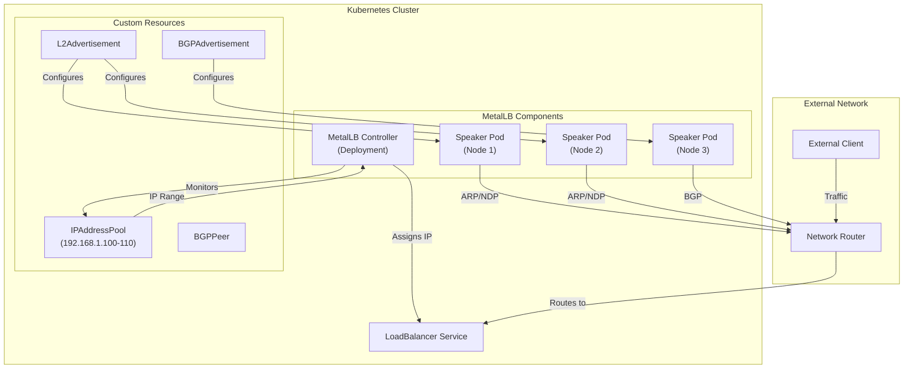
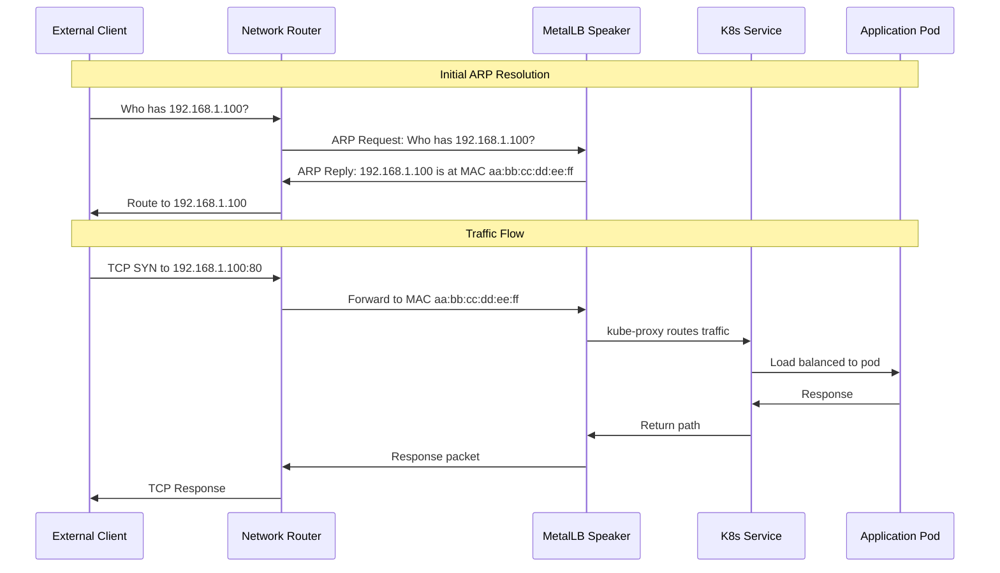
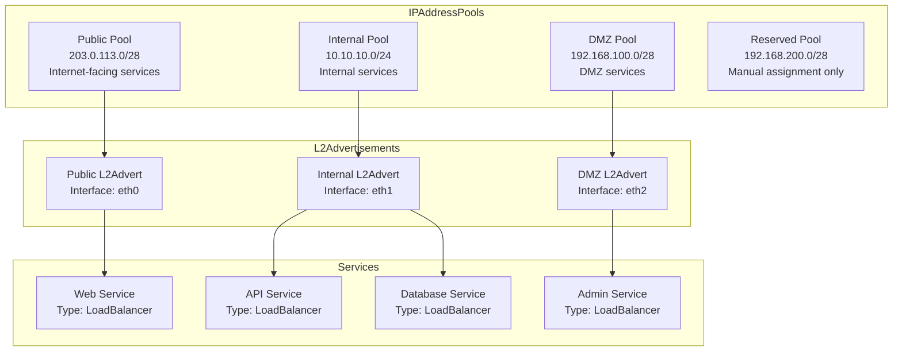
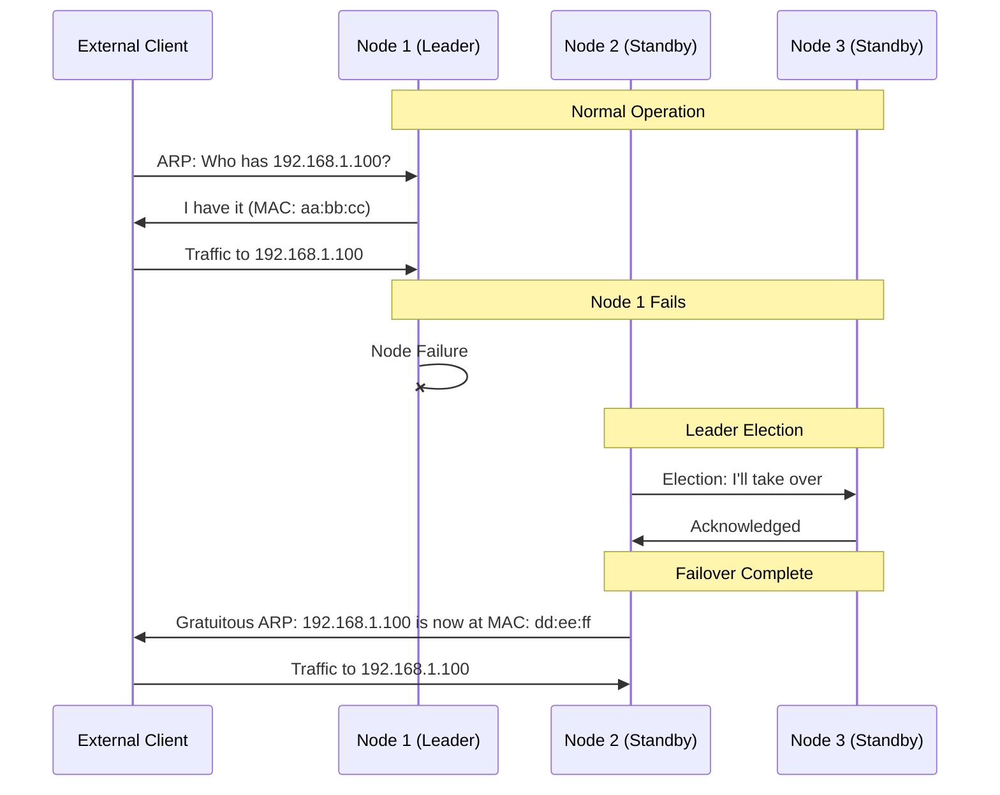

# How to Manage MetalLB IP Pools with Custom Resource Definitions

Author: [nawazdhandala](https://github.com/nawazdhandala)

Tags: MetalLB, Kubernetes, CRD, IP Management, Load Balancing, Networking, Configuration

Description: Deep dive into managing MetalLB IP pools using Custom Resource Definitions including IPAddressPool and L2Advertisement.

---

MetalLB is the go-to load balancer solution for bare-metal Kubernetes clusters. Unlike cloud providers that offer integrated load balancers, bare-metal environments require a software-based solution to provide external IP addresses to services. MetalLB fills this gap by implementing both Layer 2 (ARP/NDP) and BGP-based IP address advertisement.

In this comprehensive guide, we will explore how to manage MetalLB IP pools using Custom Resource Definitions (CRDs), with a deep focus on `IPAddressPool` and `L2Advertisement` resources.

## Understanding MetalLB Architecture

Before diving into configuration, let us understand how MetalLB works at a high level.

The following diagram illustrates MetalLB's architecture in a Kubernetes cluster:



MetalLB consists of two main components:

1. **Controller**: A deployment that watches for services of type `LoadBalancer` and assigns IP addresses from configured pools
2. **Speaker**: A DaemonSet that runs on every node and handles the actual advertisement of assigned IPs using either Layer 2 (ARP/NDP) or BGP protocols

## Prerequisites

Before configuring MetalLB IP pools, ensure you have:

- A running Kubernetes cluster (v1.20 or later recommended)
- MetalLB installed in your cluster
- `kubectl` configured to communicate with your cluster
- Administrative access to create CRDs

If MetalLB is not installed, you can install it using the following commands:

Install MetalLB using the official manifests:

```bash
kubectl apply -f https://raw.githubusercontent.com/metallb/metallb/v0.14.8/config/manifests/metallb-native.yaml
```

Wait for MetalLB pods to be ready:

```bash
kubectl wait --namespace metallb-system \
  --for=condition=ready pod \
  --selector=app=metallb \
  --timeout=90s
```

## IPAddressPool CRD Deep Dive

The `IPAddressPool` CRD is the foundation of MetalLB configuration. It defines the ranges of IP addresses that MetalLB can assign to LoadBalancer services.

### Basic IPAddressPool Configuration

The simplest IPAddressPool defines a range of IP addresses:

```yaml
apiVersion: metallb.io/v1beta1
kind: IPAddressPool
metadata:
  name: default-pool
  namespace: metallb-system
spec:
  addresses:
    - 192.168.1.100-192.168.1.110
```

### Multiple Address Ranges

You can define multiple ranges within a single pool, which is useful for non-contiguous IP blocks:

```yaml
apiVersion: metallb.io/v1beta1
kind: IPAddressPool
metadata:
  name: multi-range-pool
  namespace: metallb-system
spec:
  addresses:
    - 192.168.1.100-192.168.1.110
    - 192.168.1.200-192.168.1.210
    - 10.0.0.50-10.0.0.60
```

### CIDR Notation Support

IPAddressPool also supports CIDR notation for defining address ranges:

```yaml
apiVersion: metallb.io/v1beta1
kind: IPAddressPool
metadata:
  name: cidr-pool
  namespace: metallb-system
spec:
  addresses:
    - 192.168.10.0/28
    - 10.10.10.0/24
```

### IPv6 Address Pools

MetalLB fully supports IPv6 addresses. You can create IPv6-only or dual-stack pools:

```yaml
apiVersion: metallb.io/v1beta1
kind: IPAddressPool
metadata:
  name: ipv6-pool
  namespace: metallb-system
spec:
  addresses:
    - 2001:db8:1::100-2001:db8:1::110
    - fd00:dead:beef::/120
```

### Dual-Stack Configuration

For environments requiring both IPv4 and IPv6, combine both address families:

```yaml
apiVersion: metallb.io/v1beta1
kind: IPAddressPool
metadata:
  name: dual-stack-pool
  namespace: metallb-system
spec:
  addresses:
    - 192.168.1.100-192.168.1.110
    - 2001:db8:1::100-2001:db8:1::110
```

### Auto-Assign Control

By default, MetalLB automatically assigns IPs from pools. You can disable this for pools that should only be used when explicitly requested:

```yaml
apiVersion: metallb.io/v1beta1
kind: IPAddressPool
metadata:
  name: reserved-pool
  namespace: metallb-system
spec:
  addresses:
    - 192.168.1.200-192.168.1.210
  autoAssign: false
```

### Avoid Bug Share Key

The `avoidBuggyIPs` option tells MetalLB to avoid allocating IPs ending in .0 or .255, which can cause issues with some network equipment:

```yaml
apiVersion: metallb.io/v1beta1
kind: IPAddressPool
metadata:
  name: safe-pool
  namespace: metallb-system
spec:
  addresses:
    - 192.168.1.0/24
  avoidBuggyIPs: true
```

### Complete IPAddressPool Schema Reference

Here is a comprehensive example showing all available fields:

```yaml
apiVersion: metallb.io/v1beta1
kind: IPAddressPool
metadata:
  name: comprehensive-pool
  namespace: metallb-system
  labels:
    environment: production
    team: platform
spec:
  addresses:
    - 192.168.1.100-192.168.1.150
    - 192.168.2.0/28
    - 2001:db8:1::1-2001:db8:1::100
  autoAssign: true
  avoidBuggyIPs: true
  serviceAllocation:
    priority: 50
    namespaces:
      - production
      - staging
    namespaceSelectors:
      - matchLabels:
          pool: premium
    serviceSelectors:
      - matchExpressions:
          - key: app
            operator: In
            values:
              - web
              - api
```

## L2Advertisement CRD Deep Dive

The `L2Advertisement` CRD configures how MetalLB advertises IP addresses using Layer 2 protocols (ARP for IPv4, NDP for IPv6).

### How Layer 2 Mode Works

The following diagram shows how Layer 2 advertisement works:



### Basic L2Advertisement

A basic L2Advertisement that advertises all pools on all nodes:

```yaml
apiVersion: metallb.io/v1beta1
kind: L2Advertisement
metadata:
  name: default-l2-advertisement
  namespace: metallb-system
```

### Pool Selection

You can specify which IP pools to advertise using `ipAddressPools`:

```yaml
apiVersion: metallb.io/v1beta1
kind: L2Advertisement
metadata:
  name: production-l2-advertisement
  namespace: metallb-system
spec:
  ipAddressPools:
    - production-pool
    - backup-pool
```

### Pool Selection with Selectors

Use label selectors for more dynamic pool selection:

```yaml
apiVersion: metallb.io/v1beta1
kind: L2Advertisement
metadata:
  name: labeled-l2-advertisement
  namespace: metallb-system
spec:
  ipAddressPoolSelectors:
    - matchLabels:
        environment: production
    - matchExpressions:
        - key: tier
          operator: In
          values:
            - frontend
            - api
```

### Node Selection

Control which nodes participate in L2 advertisement using node selectors. This is useful for limiting advertisement to specific network segments:

```yaml
apiVersion: metallb.io/v1beta1
kind: L2Advertisement
metadata:
  name: worker-only-l2-advertisement
  namespace: metallb-system
spec:
  ipAddressPools:
    - worker-pool
  nodeSelectors:
    - matchLabels:
        node-role.kubernetes.io/worker: "true"
    - matchExpressions:
        - key: network-segment
          operator: In
          values:
            - segment-a
            - segment-b
```

### Interface Selection

Specify which network interfaces should be used for L2 advertisement:

```yaml
apiVersion: metallb.io/v1beta1
kind: L2Advertisement
metadata:
  name: specific-interface-l2-advertisement
  namespace: metallb-system
spec:
  ipAddressPools:
    - main-pool
  interfaces:
    - eth0
    - bond0
```

### Complete L2Advertisement Example

Here is a production-ready L2Advertisement configuration:

```yaml
apiVersion: metallb.io/v1beta1
kind: L2Advertisement
metadata:
  name: production-l2-config
  namespace: metallb-system
  labels:
    environment: production
spec:
  ipAddressPools:
    - production-external-pool
    - production-internal-pool
  ipAddressPoolSelectors:
    - matchLabels:
        advertise-l2: "true"
  nodeSelectors:
    - matchLabels:
        metallb-speaker: "enabled"
  interfaces:
    - eth0
```

## Advanced Configuration Patterns

### Multi-Pool Architecture

For complex environments, create separate pools for different purposes:

The following diagram illustrates a multi-pool architecture:



Public-facing pool for internet-accessible services:

```yaml
apiVersion: metallb.io/v1beta1
kind: IPAddressPool
metadata:
  name: public-pool
  namespace: metallb-system
  labels:
    tier: public
    advertise-l2: "true"
spec:
  addresses:
    - 203.0.113.10-203.0.113.25
  avoidBuggyIPs: true
  serviceAllocation:
    priority: 100
    namespaceSelectors:
      - matchLabels:
          exposure: public
```

Internal pool for cluster-internal services:

```yaml
apiVersion: metallb.io/v1beta1
kind: IPAddressPool
metadata:
  name: internal-pool
  namespace: metallb-system
  labels:
    tier: internal
    advertise-l2: "true"
spec:
  addresses:
    - 10.10.10.100-10.10.10.200
  serviceAllocation:
    priority: 50
    namespaceSelectors:
      - matchLabels:
          exposure: internal
```

DMZ pool for services requiring network isolation:

```yaml
apiVersion: metallb.io/v1beta1
kind: IPAddressPool
metadata:
  name: dmz-pool
  namespace: metallb-system
  labels:
    tier: dmz
    advertise-l2: "true"
spec:
  addresses:
    - 192.168.100.10-192.168.100.25
  serviceAllocation:
    priority: 75
    namespaceSelectors:
      - matchLabels:
          zone: dmz
```

### Namespace-Based IP Allocation

Control which namespaces can use specific IP pools:

Production namespace pool configuration:

```yaml
apiVersion: metallb.io/v1beta1
kind: IPAddressPool
metadata:
  name: production-only-pool
  namespace: metallb-system
spec:
  addresses:
    - 192.168.50.0/28
  serviceAllocation:
    namespaces:
      - production
      - production-critical
```

Development namespace pool configuration:

```yaml
apiVersion: metallb.io/v1beta1
kind: IPAddressPool
metadata:
  name: development-pool
  namespace: metallb-system
spec:
  addresses:
    - 192.168.60.0/24
  serviceAllocation:
    namespaces:
      - development
      - staging
      - qa
```

### Service-Specific IP Allocation

Allocate IPs based on service labels for fine-grained control:

```yaml
apiVersion: metallb.io/v1beta1
kind: IPAddressPool
metadata:
  name: high-priority-pool
  namespace: metallb-system
spec:
  addresses:
    - 192.168.1.10-192.168.1.20
  serviceAllocation:
    priority: 100
    serviceSelectors:
      - matchLabels:
          priority: high
      - matchExpressions:
          - key: app
            operator: In
            values:
              - payment-gateway
              - auth-service
```

### Requesting Specific IPs

Services can request specific IPs from pools using annotations or the `loadBalancerIP` field:

Using loadBalancerIP field (deprecated but still supported):

```yaml
apiVersion: v1
kind: Service
metadata:
  name: web-service
  namespace: production
spec:
  type: LoadBalancer
  loadBalancerIP: 192.168.1.100
  ports:
    - port: 80
      targetPort: 8080
  selector:
    app: web
```

Using annotation (recommended approach):

```yaml
apiVersion: v1
kind: Service
metadata:
  name: api-service
  namespace: production
  annotations:
    metallb.universe.tf/loadBalancerIPs: 192.168.1.101
spec:
  type: LoadBalancer
  ports:
    - port: 443
      targetPort: 8443
  selector:
    app: api
```

Requesting multiple IPs for dual-stack services:

```yaml
apiVersion: v1
kind: Service
metadata:
  name: dual-stack-service
  namespace: production
  annotations:
    metallb.universe.tf/loadBalancerIPs: 192.168.1.102,2001:db8:1::102
spec:
  type: LoadBalancer
  ipFamilyPolicy: RequireDualStack
  ipFamilies:
    - IPv4
    - IPv6
  ports:
    - port: 80
      targetPort: 8080
  selector:
    app: web
```

### Pool Selection via Annotations

Request IPs from specific pools using service annotations:

```yaml
apiVersion: v1
kind: Service
metadata:
  name: premium-service
  namespace: production
  annotations:
    metallb.universe.tf/address-pool: premium-pool
spec:
  type: LoadBalancer
  ports:
    - port: 443
      targetPort: 8443
  selector:
    app: premium-app
```

### Sharing IPs Across Services

Multiple services can share the same IP address. This is useful for exposing multiple ports on the same IP:

```yaml
apiVersion: metallb.io/v1beta1
kind: IPAddressPool
metadata:
  name: shared-ip-pool
  namespace: metallb-system
spec:
  addresses:
    - 192.168.1.200/32
```

HTTP service using shared IP:

```yaml
apiVersion: v1
kind: Service
metadata:
  name: web-http
  annotations:
    metallb.universe.tf/allow-shared-ip: "web-services"
    metallb.universe.tf/loadBalancerIPs: "192.168.1.200"
spec:
  type: LoadBalancer
  ports:
    - port: 80
      targetPort: 8080
  selector:
    app: web
```

HTTPS service using the same shared IP:

```yaml
apiVersion: v1
kind: Service
metadata:
  name: web-https
  annotations:
    metallb.universe.tf/allow-shared-ip: "web-services"
    metallb.universe.tf/loadBalancerIPs: "192.168.1.200"
spec:
  type: LoadBalancer
  ports:
    - port: 443
      targetPort: 8443
  selector:
    app: web
```

## Failover and High Availability

### Understanding L2 Failover

In Layer 2 mode, MetalLB elects a single leader node to respond to ARP requests for each IP. If that node fails, another node takes over.

The following diagram shows the failover process:



### Configuring for High Availability

Create redundant pools with different priorities:

Primary pool with highest priority:

```yaml
apiVersion: metallb.io/v1beta1
kind: IPAddressPool
metadata:
  name: primary-pool
  namespace: metallb-system
spec:
  addresses:
    - 192.168.1.100-192.168.1.110
  serviceAllocation:
    priority: 100
```

Backup pool with lower priority:

```yaml
apiVersion: metallb.io/v1beta1
kind: IPAddressPool
metadata:
  name: backup-pool
  namespace: metallb-system
spec:
  addresses:
    - 192.168.2.100-192.168.2.110
  serviceAllocation:
    priority: 50
```

### Node Affinity for Reliability

Ensure L2 advertisement is limited to reliable nodes:

```yaml
apiVersion: metallb.io/v1beta1
kind: L2Advertisement
metadata:
  name: reliable-nodes-l2
  namespace: metallb-system
spec:
  ipAddressPools:
    - primary-pool
  nodeSelectors:
    - matchExpressions:
        - key: node.kubernetes.io/instance-type
          operator: NotIn
          values:
            - spot
            - preemptible
        - key: node-role.kubernetes.io/control-plane
          operator: DoesNotExist
```

## Monitoring and Troubleshooting

### Verifying IP Pool Status

Check the status of IP pools:

```bash
kubectl get ipaddresspools -n metallb-system
```

View detailed pool information:

```bash
kubectl describe ipaddresspool -n metallb-system
```

### Checking Service IP Assignments

List services with their assigned external IPs:

```bash
kubectl get services -A -o wide | grep LoadBalancer
```

View detailed service events:

```bash
kubectl describe service <service-name> -n <namespace>
```

### MetalLB Speaker Logs

Check speaker pods for L2 advertisement activity:

```bash
kubectl logs -n metallb-system -l app=metallb,component=speaker --tail=100
```

### MetalLB Controller Logs

Check controller logs for IP assignment issues:

```bash
kubectl logs -n metallb-system -l app=metallb,component=controller --tail=100
```

### Common Issues and Solutions

**Issue: Service stuck in Pending state**

Check if there are available IPs in the pools:

```bash
kubectl get ipaddresspools -n metallb-system -o yaml
```

Verify the service namespace matches pool allocation rules:

```bash
kubectl get service <service-name> -n <namespace> -o yaml
```

**Issue: External IP not reachable**

Verify speaker pods are running on the correct nodes:

```bash
kubectl get pods -n metallb-system -o wide | grep speaker
```

Check if ARP is working by examining speaker logs:

```bash
kubectl logs -n metallb-system -l component=speaker | grep -i arp
```

**Issue: IP address conflicts**

List all assigned IPs to check for duplicates:

```bash
kubectl get services -A -o jsonpath='{range .items[?(@.spec.type=="LoadBalancer")]}{.metadata.namespace}/{.metadata.name}: {.status.loadBalancer.ingress[*].ip}{"\n"}{end}'
```

### Prometheus Metrics

MetalLB exposes metrics for monitoring. Key metrics include:

- `metallb_allocator_addresses_in_use_total`: Number of IPs currently in use
- `metallb_allocator_addresses_total`: Total number of IPs in pools
- `metallb_bgp_session_up`: BGP session status (for BGP mode)
- `metallb_layer2_requests_received`: L2 ARP/NDP requests received

Create a ServiceMonitor for Prometheus integration:

```yaml
apiVersion: monitoring.coreos.com/v1
kind: ServiceMonitor
metadata:
  name: metallb
  namespace: metallb-system
spec:
  selector:
    matchLabels:
      app: metallb
  endpoints:
    - port: monitoring
      interval: 30s
```

## Production Best Practices

### 1. Use Dedicated IP Ranges

Always use IP ranges that are properly allocated to your infrastructure:

```yaml
apiVersion: metallb.io/v1beta1
kind: IPAddressPool
metadata:
  name: production-pool
  namespace: metallb-system
spec:
  addresses:
    - 192.168.1.100-192.168.1.150
  avoidBuggyIPs: true
```

### 2. Implement Resource Quotas

Create quotas to prevent namespace from consuming all IPs. Note that direct IP quotas are not available, but you can limit LoadBalancer services:

```yaml
apiVersion: v1
kind: ResourceQuota
metadata:
  name: loadbalancer-quota
  namespace: development
spec:
  hard:
    services.loadbalancers: "5"
```

### 3. Document IP Allocations

Maintain clear documentation of IP allocations using labels and annotations:

```yaml
apiVersion: metallb.io/v1beta1
kind: IPAddressPool
metadata:
  name: customer-facing-pool
  namespace: metallb-system
  labels:
    purpose: customer-facing
    owner: platform-team
    cost-center: infrastructure
  annotations:
    description: "IPs for customer-facing services"
    network-team-ticket: "NET-12345"
spec:
  addresses:
    - 203.0.113.10-203.0.113.50
```

### 4. Implement Graduated Rollout

For new pool configurations, start with a small range and expand:

Initial small pool for testing:

```yaml
apiVersion: metallb.io/v1beta1
kind: IPAddressPool
metadata:
  name: new-pool-test
  namespace: metallb-system
spec:
  addresses:
    - 192.168.5.10-192.168.5.15
  autoAssign: false
```

After validation, expand the pool:

```yaml
apiVersion: metallb.io/v1beta1
kind: IPAddressPool
metadata:
  name: new-pool-production
  namespace: metallb-system
spec:
  addresses:
    - 192.168.5.10-192.168.5.100
  autoAssign: true
```

### 5. Configure Proper Node Selection

Ensure L2 advertisements only occur on appropriate nodes:

```yaml
apiVersion: metallb.io/v1beta1
kind: L2Advertisement
metadata:
  name: production-l2
  namespace: metallb-system
spec:
  ipAddressPools:
    - production-pool
  nodeSelectors:
    - matchLabels:
        metallb/speaker: "true"
        node-role.kubernetes.io/worker: "true"
    - matchExpressions:
        - key: node.kubernetes.io/instance-type
          operator: NotIn
          values:
            - spot
```

## Complete Production Configuration Example

Here is a complete, production-ready MetalLB configuration:

Production IPAddressPool for external services:

```yaml
apiVersion: metallb.io/v1beta1
kind: IPAddressPool
metadata:
  name: external-production
  namespace: metallb-system
  labels:
    environment: production
    tier: external
spec:
  addresses:
    - 203.0.113.10-203.0.113.50
  avoidBuggyIPs: true
  serviceAllocation:
    priority: 100
    namespaces:
      - production
      - production-critical
---
apiVersion: metallb.io/v1beta1
kind: IPAddressPool
metadata:
  name: internal-production
  namespace: metallb-system
  labels:
    environment: production
    tier: internal
spec:
  addresses:
    - 10.10.10.100-10.10.10.200
  serviceAllocation:
    priority: 90
    namespaces:
      - production
      - monitoring
      - logging
---
apiVersion: metallb.io/v1beta1
kind: IPAddressPool
metadata:
  name: development
  namespace: metallb-system
  labels:
    environment: development
spec:
  addresses:
    - 10.20.20.100-10.20.20.200
  serviceAllocation:
    priority: 10
    namespaces:
      - development
      - staging
      - qa
---
apiVersion: metallb.io/v1beta1
kind: L2Advertisement
metadata:
  name: external-l2
  namespace: metallb-system
spec:
  ipAddressPools:
    - external-production
  interfaces:
    - eth0
  nodeSelectors:
    - matchLabels:
        metallb/external-speaker: "true"
---
apiVersion: metallb.io/v1beta1
kind: L2Advertisement
metadata:
  name: internal-l2
  namespace: metallb-system
spec:
  ipAddressPools:
    - internal-production
    - development
  interfaces:
    - eth1
  nodeSelectors:
    - matchLabels:
        metallb/internal-speaker: "true"
```

## Summary

Managing MetalLB IP pools with Custom Resource Definitions provides powerful and flexible control over IP address allocation in bare-metal Kubernetes clusters. Key takeaways from this guide include:

1. **IPAddressPool** defines the available IP ranges with support for IPv4, IPv6, and dual-stack configurations
2. **L2Advertisement** controls how IPs are advertised using Layer 2 protocols with fine-grained node and interface selection
3. **Service allocation** features allow namespace-based and label-based IP assignment control
4. **Shared IPs** enable multiple services to use the same external IP on different ports
5. **Proper monitoring** and logging help identify and resolve issues quickly

By following the patterns and best practices outlined in this guide, you can build a robust, scalable, and maintainable load balancer infrastructure for your bare-metal Kubernetes clusters.

## Additional Resources

- [MetalLB Official Documentation](https://metallb.universe.tf/)
- [MetalLB GitHub Repository](https://github.com/metallb/metallb)
- [Kubernetes LoadBalancer Service Documentation](https://kubernetes.io/docs/concepts/services-networking/service/#loadbalancer)
- [MetalLB Configuration Reference](https://metallb.universe.tf/configuration/)
