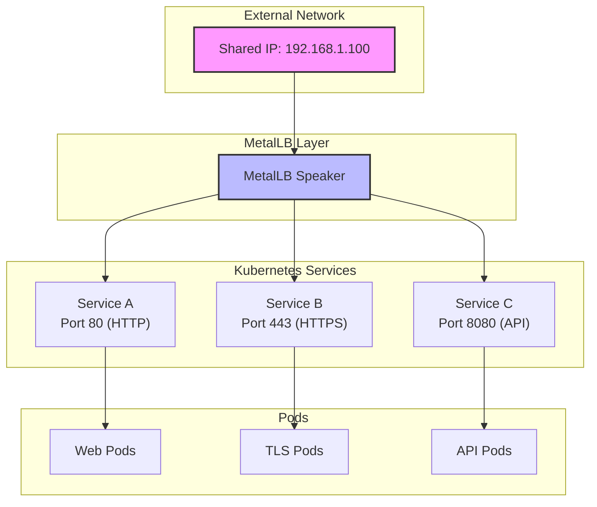
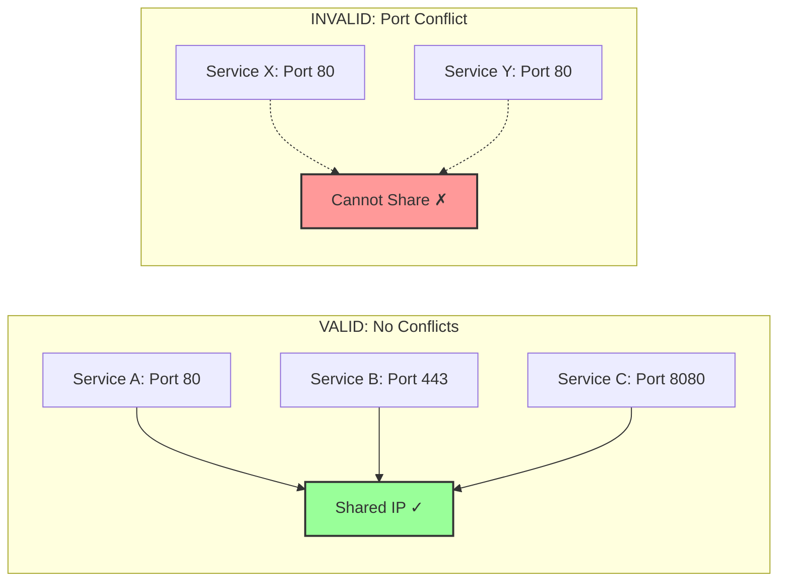
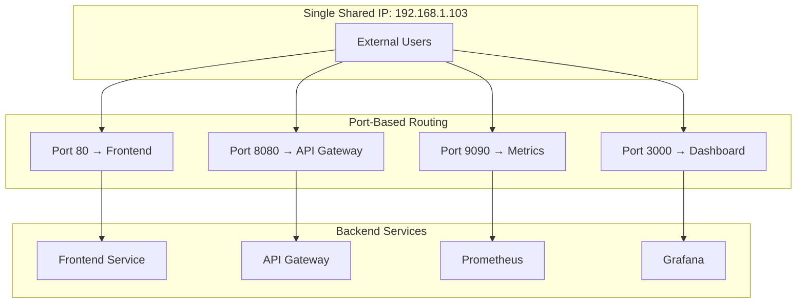
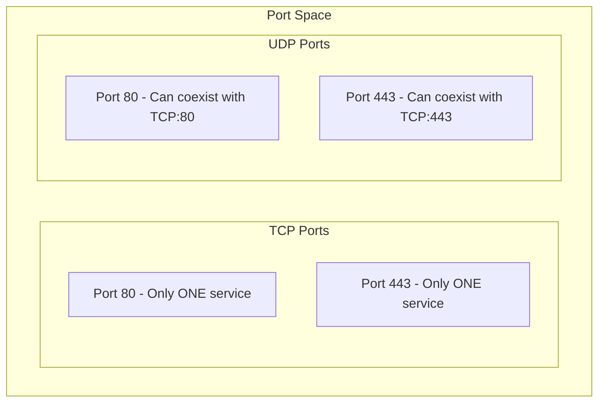

# How to Share IPs Between Services in MetalLB

Author: [nawazdhandala](https://github.com/nawazdhandala)

Tags: MetalLB, Kubernetes, IP Sharing, Load Balancing, Networking

Description: A guide to configuring IP address sharing between multiple services in MetalLB.

---

## Introduction

MetalLB is a load balancer implementation for bare metal Kubernetes clusters, providing network load balancing capabilities that are typically only available in cloud environments. One of its powerful features is **IP sharing**, which allows multiple Kubernetes services to share the same external IP address while using different ports.

In environments where public IP addresses are scarce or expensive, IP sharing becomes essential for efficient resource utilization. This guide will walk you through configuring IP sharing between services in MetalLB, including best practices, limitations, and real-world use cases.

## Prerequisites

Before we begin, ensure you have:

- A running Kubernetes cluster (v1.19+)
- MetalLB installed and configured (v0.13.0+)
- `kubectl` configured to access your cluster
- Basic understanding of Kubernetes Services and networking concepts

## Understanding IP Sharing in MetalLB

### The Sharing Key Annotation

MetalLB uses a special annotation called `metallb.universe.tf/allow-shared-ip` to enable IP sharing between services. When multiple services have the same sharing key value, MetalLB can assign them the same IP address.

The following diagram illustrates how IP sharing works in MetalLB:



### How IP Sharing Works

When you configure IP sharing, MetalLB performs the following steps:

1. **Checks for compatible sharing keys**: Services with matching `allow-shared-ip` annotation values are candidates for sharing
2. **Validates port uniqueness**: Ensures no port conflicts exist between services
3. **Assigns the same IP**: Allocates a single IP address to all compatible services
4. **Routes traffic by port**: Incoming traffic is routed to the appropriate service based on the destination port

## Configuring IP Sharing

### Step 1: Configure MetalLB IP Address Pool

First, you need an IP address pool configured in MetalLB. The following configuration creates a pool of addresses that can be used by your services:

```yaml
# This IPAddressPool defines the range of IPs MetalLB can assign to services
# The addresses field specifies a range from 192.168.1.100 to 192.168.1.110
apiVersion: metallb.io/v1beta1
kind: IPAddressPool
metadata:
  name: production-pool
  namespace: metallb-system
spec:
  # Define the range of IP addresses available for allocation
  addresses:
    - 192.168.1.100-192.168.1.110
  # autoAssign defaults to true; set to false if you want manual IP assignment
  autoAssign: true
```

### Step 2: Configure L2 Advertisement

For Layer 2 mode, you also need an L2Advertisement resource to announce the IP addresses:

```yaml
# L2Advertisement tells MetalLB to advertise IPs using ARP/NDP
# This is required for the IPs to be reachable on your local network
apiVersion: metallb.io/v1beta1
kind: L2Advertisement
metadata:
  name: production-l2-advertisement
  namespace: metallb-system
spec:
  # Reference the IP pool(s) to advertise
  ipAddressPools:
    - production-pool
```

### Step 3: Create Services with IP Sharing

Now, let's create multiple services that share the same IP address. The key is to use the same value for the `metallb.universe.tf/allow-shared-ip` annotation:

The first service handles HTTP traffic on port 80:

```yaml
# Service for HTTP traffic
# The allow-shared-ip annotation with value "web-services" enables IP sharing
# with any other service using the same annotation value
apiVersion: v1
kind: Service
metadata:
  name: web-http
  annotations:
    # This annotation value acts as a "sharing key"
    # All services with the same key can share an IP address
    metallb.universe.tf/allow-shared-ip: "web-services"
spec:
  type: LoadBalancer
  # Optionally request a specific IP from the pool
  loadBalancerIP: 192.168.1.100
  ports:
    # HTTP traffic on standard port 80
    - name: http
      port: 80
      targetPort: 8080
      protocol: TCP
  selector:
    app: web-frontend
```

The second service handles HTTPS traffic on port 443 and shares the IP with the HTTP service:

```yaml
# Service for HTTPS traffic - shares IP with web-http service
# Note: Both services use the same "web-services" sharing key
apiVersion: v1
kind: Service
metadata:
  name: web-https
  annotations:
    # Same sharing key as web-http service enables IP sharing
    metallb.universe.tf/allow-shared-ip: "web-services"
spec:
  type: LoadBalancer
  # Request the same IP as the HTTP service
  loadBalancerIP: 192.168.1.100
  ports:
    # HTTPS traffic on standard port 443
    - name: https
      port: 443
      targetPort: 8443
      protocol: TCP
  selector:
    app: web-frontend
```

### Step 4: Verify IP Sharing

After applying the configurations, verify that both services share the same external IP:

```bash
# Check the external IPs assigned to your services
# Both services should show the same EXTERNAL-IP value
kubectl get services web-http web-https

# Expected output:
# NAME        TYPE           CLUSTER-IP      EXTERNAL-IP     PORT(S)        AGE
# web-http    LoadBalancer   10.96.100.1     192.168.1.100   80:31234/TCP   5m
# web-https   LoadBalancer   10.96.100.2     192.168.1.100   443:31235/TCP  5m
```

## Port Conflict Avoidance

One critical requirement for IP sharing is that services must not use conflicting ports. MetalLB will refuse to share an IP if there are port conflicts.

### Understanding Port Conflicts

The following diagram shows valid vs. invalid port configurations:



### Protocol Considerations

Different protocols on the same port CAN share an IP. TCP and UDP are treated as separate port spaces:

```yaml
# Service using TCP on port 53 - DNS over TCP
apiVersion: v1
kind: Service
metadata:
  name: dns-tcp
  annotations:
    metallb.universe.tf/allow-shared-ip: "dns-services"
spec:
  type: LoadBalancer
  loadBalancerIP: 192.168.1.101
  ports:
    # DNS over TCP - note the protocol specification
    - name: dns-tcp
      port: 53
      targetPort: 5353
      protocol: TCP
  selector:
    app: dns-server
---
# Service using UDP on port 53 - DNS over UDP
# This CAN share an IP with dns-tcp because they use different protocols
apiVersion: v1
kind: Service
metadata:
  name: dns-udp
  annotations:
    metallb.universe.tf/allow-shared-ip: "dns-services"
spec:
  type: LoadBalancer
  loadBalancerIP: 192.168.1.101
  ports:
    # DNS over UDP - same port number but different protocol
    - name: dns-udp
      port: 53
      targetPort: 5353
      protocol: UDP
  selector:
    app: dns-server
```

### Detecting and Resolving Conflicts

If you encounter port conflicts, MetalLB will not assign an IP to the conflicting service. Here's how to diagnose the issue:

```bash
# Check MetalLB speaker logs for conflict messages
# Look for warnings about port conflicts or IP assignment failures
kubectl logs -n metallb-system -l component=speaker | grep -i conflict

# Describe the service to see if an IP was assigned
# If EXTERNAL-IP shows <pending>, there may be a conflict
kubectl describe service <service-name>

# List all services sharing the same IP to identify conflicts
# Check the PORT(S) column for duplicates
kubectl get services -A -o wide | grep "192.168.1.100"
```

## Use Cases for IP Sharing

### Use Case 1: HTTP and HTTPS on the Same IP

The most common use case is serving both HTTP and HTTPS traffic from the same IP address, which is standard practice for web applications:

```yaml
# Combined configuration for HTTP/HTTPS services sharing a single IP
# This is ideal for web applications that need both protocols
apiVersion: v1
kind: Service
metadata:
  name: webapp-http
  annotations:
    metallb.universe.tf/allow-shared-ip: "webapp-frontend"
spec:
  type: LoadBalancer
  loadBalancerIP: 192.168.1.102
  ports:
    - name: http
      port: 80
      targetPort: 8080
  selector:
    app: webapp
---
apiVersion: v1
kind: Service
metadata:
  name: webapp-https
  annotations:
    metallb.universe.tf/allow-shared-ip: "webapp-frontend"
spec:
  type: LoadBalancer
  loadBalancerIP: 192.168.1.102
  ports:
    - name: https
      port: 443
      targetPort: 8443
  selector:
    app: webapp
```

### Use Case 2: Multiple Microservices with Different Ports

When running multiple microservices that need external access, IP sharing reduces the number of required public IPs:



Here's the corresponding configuration:

```yaml
# Frontend service on port 80 - the main web interface
apiVersion: v1
kind: Service
metadata:
  name: frontend
  annotations:
    metallb.universe.tf/allow-shared-ip: "platform-services"
spec:
  type: LoadBalancer
  loadBalancerIP: 192.168.1.103
  ports:
    - port: 80
      targetPort: 3000
  selector:
    app: frontend
---
# API Gateway on port 8080 - handles all API requests
apiVersion: v1
kind: Service
metadata:
  name: api-gateway
  annotations:
    metallb.universe.tf/allow-shared-ip: "platform-services"
spec:
  type: LoadBalancer
  loadBalancerIP: 192.168.1.103
  ports:
    - port: 8080
      targetPort: 8080
  selector:
    app: api-gateway
---
# Prometheus metrics endpoint on port 9090
apiVersion: v1
kind: Service
metadata:
  name: prometheus
  annotations:
    metallb.universe.tf/allow-shared-ip: "platform-services"
spec:
  type: LoadBalancer
  loadBalancerIP: 192.168.1.103
  ports:
    - port: 9090
      targetPort: 9090
  selector:
    app: prometheus
---
# Grafana dashboard on port 3000 (external) mapped to internal port
apiVersion: v1
kind: Service
metadata:
  name: grafana
  annotations:
    metallb.universe.tf/allow-shared-ip: "platform-services"
spec:
  type: LoadBalancer
  loadBalancerIP: 192.168.1.103
  ports:
    # Using port 3001 externally to avoid conflict with frontend's port 80
    - port: 3001
      targetPort: 3000
  selector:
    app: grafana
```

### Use Case 3: Game Server with Multiple Ports

Game servers often require multiple ports for different functions (game traffic, voice chat, admin):

```yaml
# Game server configuration sharing a single IP across multiple ports
# This is common for multiplayer game servers with separate channels
apiVersion: v1
kind: Service
metadata:
  name: game-server-main
  annotations:
    # Sharing key groups all game server services
    metallb.universe.tf/allow-shared-ip: "game-server"
spec:
  type: LoadBalancer
  loadBalancerIP: 192.168.1.104
  ports:
    # Main game traffic - typically uses UDP for low latency
    - name: game
      port: 27015
      targetPort: 27015
      protocol: UDP
  selector:
    app: game-server
---
apiVersion: v1
kind: Service
metadata:
  name: game-server-rcon
  annotations:
    metallb.universe.tf/allow-shared-ip: "game-server"
spec:
  type: LoadBalancer
  loadBalancerIP: 192.168.1.104
  ports:
    # RCON (Remote Console) for admin commands - uses TCP
    - name: rcon
      port: 27016
      targetPort: 27016
      protocol: TCP
  selector:
    app: game-server
---
apiVersion: v1
kind: Service
metadata:
  name: game-server-voice
  annotations:
    metallb.universe.tf/allow-shared-ip: "game-server"
spec:
  type: LoadBalancer
  loadBalancerIP: 192.168.1.104
  ports:
    # Voice chat - uses UDP for real-time audio
    - name: voice
      port: 27017
      targetPort: 27017
      protocol: UDP
  selector:
    app: game-server
```

## Limitations and Considerations

### Limitation 1: Same Cluster Requirement

IP sharing only works for services within the same Kubernetes cluster. Services in different clusters cannot share IPs managed by MetalLB.

### Limitation 2: Port Uniqueness Per Protocol

Each protocol (TCP/UDP) maintains its own port space, but within the same protocol, ports must be unique across sharing services:



### Limitation 3: All Services Must Request the Same IP

For IP sharing to work reliably, all services should specify the same `loadBalancerIP`. If one service doesn't specify an IP, MetalLB may assign a different IP:

```yaml
# CORRECT: Both services request the same specific IP
# This ensures they will definitely share the IP
apiVersion: v1
kind: Service
metadata:
  name: service-a
  annotations:
    metallb.universe.tf/allow-shared-ip: "shared-group"
spec:
  type: LoadBalancer
  loadBalancerIP: 192.168.1.100  # Explicitly specified
  # ... rest of config

---
apiVersion: v1
kind: Service
metadata:
  name: service-b
  annotations:
    metallb.universe.tf/allow-shared-ip: "shared-group"
spec:
  type: LoadBalancer
  loadBalancerIP: 192.168.1.100  # Same IP as service-a
  # ... rest of config
```

### Limitation 4: Session Affinity Considerations

When using session affinity with shared IPs, be aware that affinity is configured per-service, not per-IP. This means different services on the same IP can have different affinity settings:

```yaml
# Service with session affinity - client IPs stick to same backend pod
apiVersion: v1
kind: Service
metadata:
  name: stateful-app
  annotations:
    metallb.universe.tf/allow-shared-ip: "mixed-affinity"
spec:
  type: LoadBalancer
  loadBalancerIP: 192.168.1.105
  # Enable client IP-based session affinity
  sessionAffinity: ClientIP
  sessionAffinityConfig:
    clientIP:
      # Sessions timeout after 1 hour of inactivity
      timeoutSeconds: 3600
  ports:
    - port: 8080
      targetPort: 8080
  selector:
    app: stateful-app
---
# Service without session affinity - round-robin load balancing
apiVersion: v1
kind: Service
metadata:
  name: stateless-app
  annotations:
    metallb.universe.tf/allow-shared-ip: "mixed-affinity"
spec:
  type: LoadBalancer
  loadBalancerIP: 192.168.1.105
  # No session affinity - requests distributed evenly
  sessionAffinity: None
  ports:
    - port: 9090
      targetPort: 9090
  selector:
    app: stateless-app
```

### Limitation 5: BGP Mode Considerations

In BGP mode, IP sharing works the same way, but you should be aware of how routes are advertised. All services sharing an IP will have their traffic routed through the same node(s):

```yaml
# BGP Advertisement configuration for shared IPs
# Traffic for all services on a shared IP goes through the same path
apiVersion: metallb.io/v1beta1
kind: BGPAdvertisement
metadata:
  name: shared-ip-advertisement
  namespace: metallb-system
spec:
  ipAddressPools:
    - production-pool
  # Optional: Advertise aggregated routes for IP ranges
  aggregationLength: 32
  # Optional: Limit which nodes can advertise (for high availability)
  nodeSelectors:
    - matchLabels:
        node-role.kubernetes.io/control-plane: ""
```

## Best Practices

### 1. Use Descriptive Sharing Keys

Choose sharing key names that describe the logical grouping of services:

```yaml
# GOOD: Descriptive sharing keys that indicate purpose
annotations:
  metallb.universe.tf/allow-shared-ip: "production-web-frontend"

# GOOD: Environment and application context
annotations:
  metallb.universe.tf/allow-shared-ip: "staging-api-services"

# AVOID: Generic or non-descriptive keys
annotations:
  metallb.universe.tf/allow-shared-ip: "shared"  # Too generic
  metallb.universe.tf/allow-shared-ip: "group1"  # Not meaningful
```

### 2. Document Port Allocations

Maintain a clear record of which ports are used by which services:

```yaml
# Port allocation documentation as a ConfigMap
# This helps prevent accidental port conflicts
apiVersion: v1
kind: ConfigMap
metadata:
  name: port-allocation-registry
  namespace: metallb-system
data:
  allocations: |
    # IP: 192.168.1.100 (web-services sharing key)
    # Port 80/TCP   - web-http    - HTTP traffic
    # Port 443/TCP  - web-https   - HTTPS traffic
    # Port 8080/TCP - web-api     - API endpoints

    # IP: 192.168.1.101 (dns-services sharing key)
    # Port 53/TCP   - dns-tcp     - DNS over TCP
    # Port 53/UDP   - dns-udp     - DNS over UDP
```

### 3. Implement Health Checks

Ensure all services sharing an IP have proper health checks to prevent routing traffic to unhealthy pods:

```yaml
# Service with properly configured pod health checks
# The readiness probe ensures only healthy pods receive traffic
apiVersion: apps/v1
kind: Deployment
metadata:
  name: web-frontend
spec:
  replicas: 3
  selector:
    matchLabels:
      app: web-frontend
  template:
    metadata:
      labels:
        app: web-frontend
    spec:
      containers:
        - name: web
          image: nginx:latest
          ports:
            - containerPort: 8080
          # Readiness probe determines if pod can receive traffic
          readinessProbe:
            httpGet:
              path: /health
              port: 8080
            initialDelaySeconds: 5
            periodSeconds: 10
          # Liveness probe restarts unhealthy pods
          livenessProbe:
            httpGet:
              path: /health
              port: 8080
            initialDelaySeconds: 15
            periodSeconds: 20
```

### 4. Monitor IP Utilization

Keep track of your IP pool utilization to plan for capacity:

```bash
# Script to check IP pool utilization
# This helps you understand how many IPs are available vs. in use

# List all LoadBalancer services and their external IPs
echo "=== LoadBalancer Services ==="
kubectl get services -A -o wide | grep LoadBalancer

# Count unique external IPs in use
echo -e "\n=== Unique External IPs in Use ==="
kubectl get services -A -o jsonpath='{.items[?(@.spec.type=="LoadBalancer")].status.loadBalancer.ingress[0].ip}' | tr ' ' '\n' | sort -u | grep -v '^$' | wc -l

# Show IP sharing groups (services sharing the same IP)
echo -e "\n=== IP Sharing Analysis ==="
kubectl get services -A -o custom-columns='NAMESPACE:.metadata.namespace,NAME:.metadata.name,EXTERNAL-IP:.status.loadBalancer.ingress[0].ip,SHARING-KEY:.metadata.annotations.metallb\.universe\.tf/allow-shared-ip' | grep -v '<none>' | sort -k3
```

## Troubleshooting

### Issue: Service Stuck in Pending State

If a service remains in `<pending>` state for the external IP, check for port conflicts:

```bash
# Check MetalLB controller logs for assignment issues
# Look for messages about port conflicts or pool exhaustion
kubectl logs -n metallb-system deployment/controller | tail -50

# Verify the IP pool has available addresses
kubectl get ipaddresspools -n metallb-system -o yaml

# Check if the sharing key matches other services
kubectl get services -A -o jsonpath='{range .items[*]}{.metadata.name}{"\t"}{.metadata.annotations.metallb\.universe\.tf/allow-shared-ip}{"\n"}{end}'
```

### Issue: Traffic Not Reaching Service

If traffic isn't reaching your service despite IP assignment:

```bash
# Verify L2 advertisement is configured for your pool
kubectl get l2advertisements -n metallb-system -o yaml

# Check which node is announcing the IP
kubectl logs -n metallb-system -l component=speaker | grep -i "announcing\|claimed"

# Verify the service endpoints are healthy
kubectl get endpoints <service-name>

# Test connectivity from within the cluster
kubectl run test-pod --image=busybox --rm -it --restart=Never -- wget -qO- http://<external-ip>:<port>
```

### Issue: Inconsistent IP Assignment

If services sometimes get different IPs:

```yaml
# Ensure ALL services specify the exact same loadBalancerIP
# Even one service missing this field can cause inconsistencies
apiVersion: v1
kind: Service
metadata:
  name: my-service
  annotations:
    metallb.universe.tf/allow-shared-ip: "my-group"
spec:
  type: LoadBalancer
  # ALWAYS specify this for consistent IP assignment in sharing groups
  loadBalancerIP: 192.168.1.100
  # ... rest of config
```

## Complete Working Example

Here's a complete, production-ready example that demonstrates IP sharing for a typical web application:

```yaml
# Complete IP sharing example for a web application stack
# This configuration shares a single IP across HTTP, HTTPS, and WebSocket services

---
# IP Address Pool - defines available IPs for MetalLB
apiVersion: metallb.io/v1beta1
kind: IPAddressPool
metadata:
  name: webapp-pool
  namespace: metallb-system
spec:
  addresses:
    - 192.168.1.200-192.168.1.210

---
# L2 Advertisement - enables ARP announcement for the IPs
apiVersion: metallb.io/v1beta1
kind: L2Advertisement
metadata:
  name: webapp-l2
  namespace: metallb-system
spec:
  ipAddressPools:
    - webapp-pool

---
# HTTP Service - handles plain HTTP traffic, typically for redirects to HTTPS
apiVersion: v1
kind: Service
metadata:
  name: webapp-http
  namespace: webapp
  annotations:
    # Sharing key groups this with other webapp services
    metallb.universe.tf/allow-shared-ip: "webapp-production"
  labels:
    app: webapp
    protocol: http
spec:
  type: LoadBalancer
  loadBalancerIP: 192.168.1.200
  ports:
    - name: http
      port: 80
      targetPort: 8080
      protocol: TCP
  selector:
    app: webapp
    tier: frontend

---
# HTTPS Service - handles encrypted traffic
apiVersion: v1
kind: Service
metadata:
  name: webapp-https
  namespace: webapp
  annotations:
    metallb.universe.tf/allow-shared-ip: "webapp-production"
  labels:
    app: webapp
    protocol: https
spec:
  type: LoadBalancer
  loadBalancerIP: 192.168.1.200
  ports:
    - name: https
      port: 443
      targetPort: 8443
      protocol: TCP
  selector:
    app: webapp
    tier: frontend

---
# WebSocket Service - handles real-time bidirectional communication
apiVersion: v1
kind: Service
metadata:
  name: webapp-websocket
  namespace: webapp
  annotations:
    metallb.universe.tf/allow-shared-ip: "webapp-production"
  labels:
    app: webapp
    protocol: websocket
spec:
  type: LoadBalancer
  loadBalancerIP: 192.168.1.200
  # Session affinity important for WebSocket connections
  sessionAffinity: ClientIP
  sessionAffinityConfig:
    clientIP:
      timeoutSeconds: 7200  # 2 hour timeout for long-lived connections
  ports:
    - name: websocket
      port: 8443
      targetPort: 9443
      protocol: TCP
  selector:
    app: webapp
    tier: websocket
```

## Conclusion

IP sharing in MetalLB is a powerful feature that helps optimize IP address utilization in bare metal Kubernetes clusters. By using the `metallb.universe.tf/allow-shared-ip` annotation, you can efficiently share a single external IP address across multiple services while maintaining proper traffic routing based on ports.

Key takeaways:

1. **Use consistent sharing keys**: All services that should share an IP must have the same annotation value
2. **Avoid port conflicts**: Ensure each service uses unique ports within the same protocol
3. **Specify explicit IPs**: Always use `loadBalancerIP` for predictable behavior
4. **Document your allocations**: Maintain clear records of which ports are used by which services
5. **Monitor and troubleshoot**: Use MetalLB logs and kubectl commands to diagnose issues

By following the practices outlined in this guide, you can effectively manage IP sharing in your MetalLB deployment and make the most of your available IP addresses.

## Further Reading

- [MetalLB Official Documentation](https://metallb.universe.tf/)
- [Kubernetes Service Types](https://kubernetes.io/docs/concepts/services-networking/service/#publishing-services-service-types)
- [MetalLB GitHub Repository](https://github.com/metallb/metallb)
