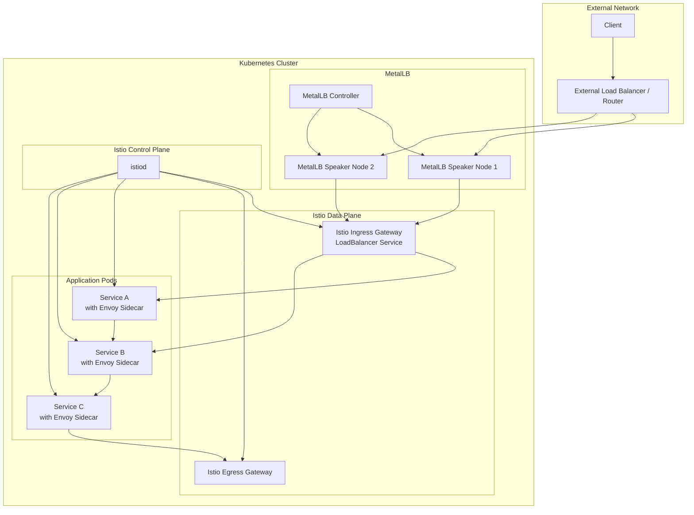
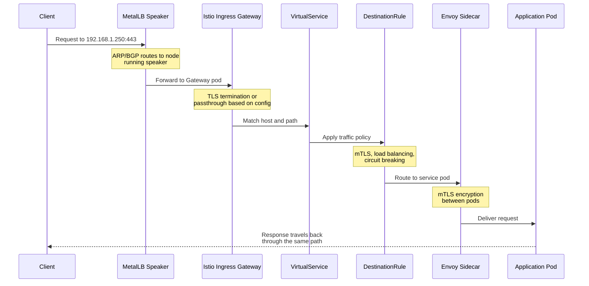
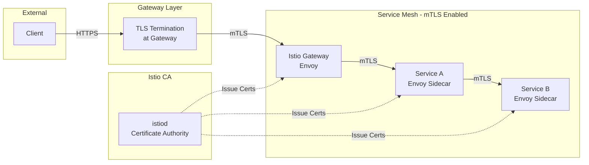
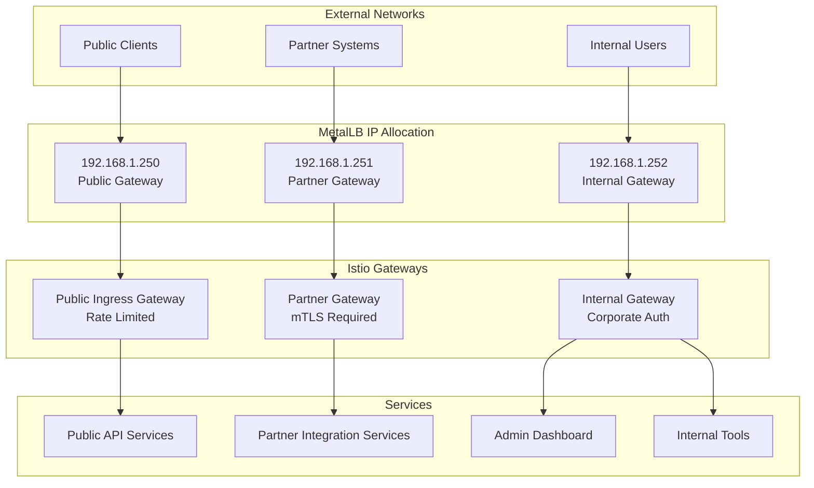

# How to Use MetalLB with Istio Gateway

Author: [nawazdhandala](https://github.com/nawazdhandala)

Tags: MetalLB, Istio, Gateway, Kubernetes, Service Mesh, Load Balancing

Description: A guide to integrating MetalLB with Istio Gateway for bare-metal service mesh deployments.

---

## Introduction

Running Kubernetes in bare-metal or on-premises environments presents a unique challenge: the lack of cloud provider load balancers. When you deploy a service of type `LoadBalancer` in AWS, GCP, or Azure, the cloud provider automatically provisions an external load balancer and assigns it an IP address. On bare-metal, however, this integration does not exist out of the box.

MetalLB solves this problem by providing a network load balancer implementation for bare-metal Kubernetes clusters. When combined with Istio's Gateway, you can achieve a production-grade service mesh ingress that rivals cloud-native deployments.

This guide covers:
- Setting up MetalLB in Layer 2 and BGP modes
- Configuring Istio Gateway with MetalLB-allocated IPs
- Managing IP address pools for Istio services
- Implementing mTLS with MetalLB and Istio
- Multi-gateway architectures for complex deployments

## Prerequisites

Before starting, ensure you have:
- A Kubernetes cluster (v1.25+) running on bare-metal or VMs
- `kubectl` configured with cluster admin access
- Helm v3 installed
- Basic understanding of Kubernetes networking concepts

## Architecture Overview

The following diagram illustrates how MetalLB integrates with Istio Gateway to provide external access to your service mesh:



## Step 1: Install MetalLB

First, we need to deploy MetalLB to handle LoadBalancer service type allocation in our bare-metal cluster.

### Install MetalLB using Helm

The following commands add the MetalLB Helm repository and install MetalLB in its own namespace with recommended settings for production use:

```bash
# Add the MetalLB Helm repository to your local Helm configuration
helm repo add metallb https://metallb.github.io/metallb

# Update Helm repositories to fetch the latest chart versions
helm repo update

# Create a dedicated namespace for MetalLB components
kubectl create namespace metallb-system

# Install MetalLB with Helm, enabling the speaker component for L2/BGP advertisement
# The --wait flag ensures the installation completes before proceeding
helm install metallb metallb/metallb \
  --namespace metallb-system \
  --wait
```

### Verify MetalLB Installation

Before proceeding, verify that all MetalLB components are running properly:

```bash
# Check that the MetalLB controller and speaker pods are running
# The controller handles IP allocation, while speakers advertise IPs
kubectl get pods -n metallb-system

# Expected output:
# NAME                                  READY   STATUS    RESTARTS   AGE
# metallb-controller-xxxxx             1/1     Running   0          2m
# metallb-speaker-xxxxx                1/1     Running   0          2m
# metallb-speaker-yyyyy                1/1     Running   0          2m
```

## Step 2: Configure MetalLB IP Address Pools

MetalLB needs an IP address pool from which it can allocate addresses to LoadBalancer services. We will create dedicated pools for Istio services.

### Layer 2 Mode Configuration

Layer 2 mode is the simplest configuration, using ARP (IPv4) or NDP (IPv6) to make IP addresses reachable on your network. This YAML defines an IP address pool and an L2 advertisement configuration:

```yaml
# metallb-config.yaml
# This configuration creates two IP pools: one for general services
# and a dedicated pool for Istio Gateway components
---
apiVersion: metallb.io/v1beta1
kind: IPAddressPool
metadata:
  name: general-pool
  namespace: metallb-system
spec:
  # Define the IP range available for general LoadBalancer services
  # Ensure these IPs are not used by DHCP or other systems on your network
  addresses:
  - 192.168.1.240-192.168.1.249
  # autoAssign: true allows MetalLB to automatically assign IPs from this pool
  autoAssign: true

---
apiVersion: metallb.io/v1beta1
kind: IPAddressPool
metadata:
  name: istio-pool
  namespace: metallb-system
spec:
  # Dedicated IP range for Istio ingress and egress gateways
  # Using a separate pool allows for better IP management and potential
  # different network policies for service mesh traffic
  addresses:
  - 192.168.1.250-192.168.1.254
  # autoAssign: false means services must explicitly request this pool
  # This prevents non-Istio services from consuming Istio-reserved IPs
  autoAssign: false

---
apiVersion: metallb.io/v1beta1
kind: L2Advertisement
metadata:
  name: default-advertisement
  namespace: metallb-system
spec:
  # Reference both pools for L2 advertisement
  # This tells MetalLB speakers to respond to ARP requests for IPs in these pools
  ipAddressPools:
  - general-pool
  - istio-pool
  # Optional: Limit which nodes can advertise these IPs using nodeSelectors
  # nodeSelectors:
  # - matchLabels:
  #     node-role.kubernetes.io/worker: "true"
```

Apply the MetalLB configuration:

```bash
# Apply the IP address pool and advertisement configuration
kubectl apply -f metallb-config.yaml

# Verify the IP pools are created and available
kubectl get ipaddresspools -n metallb-system
```

### BGP Mode Configuration (Alternative)

For larger deployments or when Layer 2 mode does not meet your requirements (e.g., spanning multiple subnets), BGP mode provides better scalability. This configuration establishes BGP peering with your network routers:

```yaml
# metallb-bgp-config.yaml
# BGP configuration for MetalLB - requires BGP-capable routers in your network
---
apiVersion: metallb.io/v1beta2
kind: BGPPeer
metadata:
  name: router-1
  namespace: metallb-system
spec:
  # IP address of your BGP-capable router
  peerAddress: 10.0.0.1
  # Your router's Autonomous System Number
  peerASN: 64512
  # ASN that MetalLB will use - typically a private ASN
  myASN: 64513
  # Optional: Source address for BGP connections (usually the node IP)
  # sourceAddress: 10.0.1.1
  # Optional: Node selector to limit which nodes establish BGP sessions
  nodeSelectors:
  - matchLabels:
      node-role.kubernetes.io/worker: "true"

---
apiVersion: metallb.io/v1beta2
kind: BGPPeer
metadata:
  name: router-2
  namespace: metallb-system
spec:
  peerAddress: 10.0.0.2
  peerASN: 64512
  myASN: 64513

---
apiVersion: metallb.io/v1beta1
kind: BGPAdvertisement
metadata:
  name: istio-bgp-advertisement
  namespace: metallb-system
spec:
  # Advertise only the Istio IP pool via BGP
  ipAddressPools:
  - istio-pool
  # Optional: Attach BGP communities for traffic engineering
  communities:
  - 64512:100
  # Optional: Aggregate routes to reduce BGP table size
  # aggregationLength: 32
```

## Step 3: Install Istio with Gateway Support

Now we install Istio with the ingress gateway component configured to work with MetalLB.

### Install Istio using istioctl

The following commands download and install Istio with a production-ready configuration:

```bash
# Download the latest Istio release (adjust version as needed)
curl -L https://istio.io/downloadIstio | ISTIO_VERSION=1.20.0 sh -

# Add istioctl to your PATH for the current session
export PATH=$PWD/istio-1.20.0/bin:$PATH

# Install Istio with the default profile which includes the ingress gateway
# The 'default' profile is suitable for production with reasonable defaults
istioctl install --set profile=default -y

# Verify Istio installation
istioctl verify-install
```

### Configure Istio Gateway to Use MetalLB

By default, Istio's ingress gateway service will be created as a LoadBalancer type. We need to annotate it to use our dedicated Istio IP pool:

```yaml
# istio-gateway-metallb.yaml
# This configuration patches the Istio ingress gateway to use our dedicated
# MetalLB IP pool and optionally request a specific IP address
---
apiVersion: v1
kind: Service
metadata:
  name: istio-ingressgateway
  namespace: istio-system
  annotations:
    # Tell MetalLB to use our dedicated Istio IP pool
    metallb.universe.tf/address-pool: istio-pool
    # Optional: Request a specific IP from the pool for consistency
    # This is useful when you need a predictable IP for DNS configuration
    metallb.universe.tf/loadBalancerIPs: "192.168.1.250"
  labels:
    app: istio-ingressgateway
    istio: ingressgateway
spec:
  type: LoadBalancer
  # externalTrafficPolicy: Local preserves client source IP
  # This is important for access logging and IP-based policies
  externalTrafficPolicy: Local
  selector:
    app: istio-ingressgateway
    istio: ingressgateway
  ports:
  # Standard HTTP port for unencrypted traffic or HTTP->HTTPS redirect
  - name: http2
    port: 80
    targetPort: 8080
    protocol: TCP
  # Standard HTTPS port for TLS-encrypted traffic
  - name: https
    port: 443
    targetPort: 8443
    protocol: TCP
  # Status port for health checks and metrics scraping
  - name: status-port
    port: 15021
    targetPort: 15021
    protocol: TCP
```

Apply the service configuration:

```bash
# Apply the updated service configuration to use MetalLB
kubectl apply -f istio-gateway-metallb.yaml

# Verify the external IP has been assigned from the Istio pool
kubectl get svc istio-ingressgateway -n istio-system

# Expected output:
# NAME                   TYPE           CLUSTER-IP      EXTERNAL-IP     PORT(S)
# istio-ingressgateway   LoadBalancer   10.96.100.50    192.168.1.250   80:31380/TCP,443:31390/TCP
```

## Step 4: Configure Istio Gateway and VirtualService

With the infrastructure in place, we can now configure Istio Gateway resources to route traffic to our applications.

### Traffic Flow with MetalLB and Istio

The following diagram shows how a request flows from a client through MetalLB and Istio to reach the target service:



### Create a Gateway Resource

The Gateway resource defines the entry point for traffic entering the mesh. This configuration sets up HTTPS ingress with TLS termination:

```yaml
# istio-gateway.yaml
# Gateway configuration for handling incoming HTTPS traffic
# The Gateway listens on the ingress gateway pods and terminates TLS
---
apiVersion: networking.istio.io/v1beta1
kind: Gateway
metadata:
  name: main-gateway
  namespace: istio-system
spec:
  # Selector matches the Istio ingress gateway pods
  selector:
    istio: ingressgateway
  servers:
  # HTTPS server configuration with TLS termination
  - port:
      number: 443
      name: https
      protocol: HTTPS
    tls:
      # SIMPLE mode terminates TLS at the gateway
      # Use PASSTHROUGH if the application handles TLS
      mode: SIMPLE
      # Reference to the Kubernetes secret containing TLS certificate
      credentialName: main-gateway-tls
    # Hosts this gateway accepts traffic for
    # Use specific hostnames in production, avoid wildcards
    hosts:
    - "api.example.com"
    - "web.example.com"
  # HTTP server for redirect to HTTPS
  - port:
      number: 80
      name: http
      protocol: HTTP
    hosts:
    - "api.example.com"
    - "web.example.com"
    tls:
      # Redirect all HTTP traffic to HTTPS
      httpsRedirect: true
```

### Create TLS Secret for the Gateway

Before the Gateway can terminate TLS, you need to provide the certificate and key:

```bash
# Create a TLS secret in the istio-system namespace
# Replace with your actual certificate and key files
kubectl create secret tls main-gateway-tls \
  --cert=path/to/tls.crt \
  --key=path/to/tls.key \
  -n istio-system

# For testing, you can generate a self-signed certificate:
# openssl req -x509 -nodes -days 365 -newkey rsa:2048 \
#   -keyout tls.key -out tls.crt \
#   -subj "/CN=*.example.com"
```

### Create VirtualService for Routing

The VirtualService defines how traffic matching the Gateway is routed to backend services:

```yaml
# virtual-service.yaml
# VirtualService configuration for routing traffic from the Gateway
# to backend services based on host and path matching
---
apiVersion: networking.istio.io/v1beta1
kind: VirtualService
metadata:
  name: api-routes
  namespace: default
spec:
  # Hosts this VirtualService applies to
  hosts:
  - "api.example.com"
  # Reference to the Gateway that handles incoming traffic
  gateways:
  - istio-system/main-gateway
  http:
  # Route /users/* requests to the users service
  - match:
    - uri:
        prefix: /users
    # Rewrite the URI if needed (remove /users prefix)
    rewrite:
      uri: /
    route:
    - destination:
        host: users-service
        port:
          number: 8080
      # Weight for traffic splitting (100% to this destination)
      weight: 100
    # Timeout for requests to this route
    timeout: 30s
    # Retry policy for failed requests
    retries:
      attempts: 3
      perTryTimeout: 10s
      retryOn: "5xx,reset,connect-failure"

  # Route /orders/* requests to the orders service
  - match:
    - uri:
        prefix: /orders
    route:
    - destination:
        host: orders-service
        port:
          number: 8080
    # Apply fault injection for testing (comment out in production)
    # fault:
    #   delay:
    #     percentage:
    #       value: 10
    #     fixedDelay: 5s

---
apiVersion: networking.istio.io/v1beta1
kind: VirtualService
metadata:
  name: web-routes
  namespace: default
spec:
  hosts:
  - "web.example.com"
  gateways:
  - istio-system/main-gateway
  http:
  # Default route for all web traffic
  - route:
    - destination:
        host: web-frontend
        port:
          number: 80
```

Apply the Gateway and VirtualService configurations:

```bash
# Apply the Gateway configuration
kubectl apply -f istio-gateway.yaml

# Apply the VirtualService configurations
kubectl apply -f virtual-service.yaml

# Verify the configurations are applied
kubectl get gateway,virtualservice -A
```

## Step 5: mTLS Configuration with MetalLB

When using MetalLB with Istio, mTLS (mutual TLS) considerations are important for securing traffic both at the gateway level and within the mesh.

### mTLS Architecture



### Enable Strict mTLS Mesh-Wide

This PeerAuthentication policy enforces mTLS for all pod-to-pod communication within the mesh:

```yaml
# mtls-strict.yaml
# Enable STRICT mTLS mode for the entire mesh
# This ensures all traffic between pods is encrypted and authenticated
---
apiVersion: security.istio.io/v1beta1
kind: PeerAuthentication
metadata:
  name: default
  # Applying to istio-system makes this the mesh-wide default
  namespace: istio-system
spec:
  # STRICT mode rejects any non-mTLS traffic
  # Use PERMISSIVE during migration to allow both mTLS and plain text
  mtls:
    mode: STRICT
```

### Configure DestinationRule for mTLS

DestinationRules work with PeerAuthentication to ensure clients also use mTLS when connecting to services:

```yaml
# destination-rule-mtls.yaml
# DestinationRule ensures clients use mTLS when connecting to services
---
apiVersion: networking.istio.io/v1beta1
kind: DestinationRule
metadata:
  name: users-service-mtls
  namespace: default
spec:
  host: users-service
  trafficPolicy:
    # Enable mTLS for connections to this service
    tls:
      mode: ISTIO_MUTUAL
    # Configure connection pool settings
    connectionPool:
      tcp:
        maxConnections: 100
      http:
        h2UpgradePolicy: UPGRADE
        http1MaxPendingRequests: 100
        http2MaxRequests: 1000
    # Circuit breaker configuration
    outlierDetection:
      consecutive5xxErrors: 5
      interval: 30s
      baseEjectionTime: 30s
      maxEjectionPercent: 50
```

### Gateway-Level TLS Options

For the Istio Gateway, you can configure different TLS modes depending on your security requirements:

```yaml
# gateway-tls-options.yaml
# Different TLS configurations for various security requirements
---
apiVersion: networking.istio.io/v1beta1
kind: Gateway
metadata:
  name: secure-gateway
  namespace: istio-system
spec:
  selector:
    istio: ingressgateway
  servers:
  # Option 1: SIMPLE - Gateway terminates TLS, uses its own certificate
  - port:
      number: 443
      name: https-simple
      protocol: HTTPS
    tls:
      mode: SIMPLE
      credentialName: gateway-cert
    hosts:
    - "simple.example.com"

  # Option 2: MUTUAL - Gateway terminates TLS and validates client certificate
  # Use this for service-to-service authentication at the edge
  - port:
      number: 443
      name: https-mutual
      protocol: HTTPS
    tls:
      mode: MUTUAL
      # Server certificate
      credentialName: gateway-cert
      # CA certificate to validate client certificates
      # Clients must present a valid certificate signed by this CA
      caCertificates: /etc/istio/gateway-ca/ca.crt
    hosts:
    - "mutual.example.com"

  # Option 3: PASSTHROUGH - Gateway passes TLS traffic through without termination
  # Use this when the application needs to handle TLS itself
  - port:
      number: 443
      name: https-passthrough
      protocol: TLS
    tls:
      mode: PASSTHROUGH
    hosts:
    - "passthrough.example.com"
```

## Step 6: Multi-Gateway Architecture

For complex deployments, you may need multiple Istio gateways with different IP addresses for various purposes (e.g., public API, internal services, partner access).

### Multi-Gateway Architecture Diagram



### Deploy Additional Ingress Gateways

Create separate Istio ingress gateway deployments for different purposes:

```yaml
# multi-gateway-deployment.yaml
# Deploy multiple Istio ingress gateways for different traffic classes
---
# Partner Gateway - for B2B API access with mutual TLS
apiVersion: apps/v1
kind: Deployment
metadata:
  name: istio-partner-gateway
  namespace: istio-system
  labels:
    app: istio-partner-gateway
    istio: partner-gateway
spec:
  replicas: 2
  selector:
    matchLabels:
      app: istio-partner-gateway
      istio: partner-gateway
  template:
    metadata:
      labels:
        app: istio-partner-gateway
        istio: partner-gateway
      annotations:
        # Inject the Istio sidecar for the gateway pod
        sidecar.istio.io/inject: "false"
    spec:
      serviceAccountName: istio-partner-gateway
      containers:
      - name: istio-proxy
        # Use the same Istio proxy image as the main gateway
        image: docker.io/istio/proxyv2:1.20.0
        args:
        - proxy
        - router
        - --domain
        - $(POD_NAMESPACE).svc.cluster.local
        - --proxyLogLevel=warning
        - --proxyComponentLogLevel=misc:error
        - --log_output_level=default:info
        ports:
        - containerPort: 8080
          protocol: TCP
        - containerPort: 8443
          protocol: TCP
        - containerPort: 15021
          protocol: TCP
        env:
        - name: POD_NAME
          valueFrom:
            fieldRef:
              fieldPath: metadata.name
        - name: POD_NAMESPACE
          valueFrom:
            fieldRef:
              fieldPath: metadata.namespace
        - name: INSTANCE_IP
          valueFrom:
            fieldRef:
              fieldPath: status.podIP
        resources:
          requests:
            cpu: 100m
            memory: 128Mi
          limits:
            cpu: 2000m
            memory: 1024Mi

---
# Service for Partner Gateway with dedicated MetalLB IP
apiVersion: v1
kind: Service
metadata:
  name: istio-partner-gateway
  namespace: istio-system
  annotations:
    # Use the Istio IP pool for consistent IP management
    metallb.universe.tf/address-pool: istio-pool
    # Request a specific IP for the partner gateway
    metallb.universe.tf/loadBalancerIPs: "192.168.1.251"
  labels:
    app: istio-partner-gateway
    istio: partner-gateway
spec:
  type: LoadBalancer
  externalTrafficPolicy: Local
  selector:
    app: istio-partner-gateway
    istio: partner-gateway
  ports:
  - name: https
    port: 443
    targetPort: 8443
    protocol: TCP
  - name: status-port
    port: 15021
    targetPort: 15021
    protocol: TCP

---
# Internal Gateway - for corporate network access
apiVersion: v1
kind: Service
metadata:
  name: istio-internal-gateway
  namespace: istio-system
  annotations:
    metallb.universe.tf/address-pool: istio-pool
    metallb.universe.tf/loadBalancerIPs: "192.168.1.252"
  labels:
    app: istio-internal-gateway
    istio: internal-gateway
spec:
  type: LoadBalancer
  externalTrafficPolicy: Local
  selector:
    # This selector would match a separate internal gateway deployment
    app: istio-internal-gateway
    istio: internal-gateway
  ports:
  - name: http2
    port: 80
    targetPort: 8080
    protocol: TCP
  - name: https
    port: 443
    targetPort: 8443
    protocol: TCP
```

### Configure Gateway Resources for Each Ingress

Create separate Gateway resources that select their respective ingress gateway deployments:

```yaml
# multi-gateway-config.yaml
# Gateway configurations for each ingress gateway deployment
---
# Partner Gateway - requires client certificates
apiVersion: networking.istio.io/v1beta1
kind: Gateway
metadata:
  name: partner-gateway
  namespace: istio-system
spec:
  # Selector matches the partner gateway pods only
  selector:
    istio: partner-gateway
  servers:
  - port:
      number: 443
      name: https
      protocol: HTTPS
    tls:
      # MUTUAL mode requires clients to present valid certificates
      mode: MUTUAL
      credentialName: partner-gateway-tls
    hosts:
    - "partner-api.example.com"

---
# Internal Gateway - for corporate internal services
apiVersion: networking.istio.io/v1beta1
kind: Gateway
metadata:
  name: internal-gateway
  namespace: istio-system
spec:
  selector:
    istio: internal-gateway
  servers:
  - port:
      number: 443
      name: https
      protocol: HTTPS
    tls:
      mode: SIMPLE
      credentialName: internal-gateway-tls
    hosts:
    # Wildcard for internal subdomains
    - "*.internal.example.com"
  - port:
      number: 80
      name: http
      protocol: HTTP
    hosts:
    - "*.internal.example.com"
    tls:
      httpsRedirect: true
```

### VirtualServices for Multi-Gateway Routing

Route traffic through the appropriate gateway based on the hostname:

```yaml
# multi-gateway-virtualservices.yaml
# VirtualServices for routing through different gateways
---
# Partner API VirtualService
apiVersion: networking.istio.io/v1beta1
kind: VirtualService
metadata:
  name: partner-api-routes
  namespace: default
spec:
  hosts:
  - "partner-api.example.com"
  # Reference the partner gateway specifically
  gateways:
  - istio-system/partner-gateway
  http:
  - match:
    - uri:
        prefix: /v1
    route:
    - destination:
        host: partner-integration-service
        port:
          number: 8080
    # Strict timeout for partner APIs
    timeout: 10s

---
# Internal Admin Dashboard
apiVersion: networking.istio.io/v1beta1
kind: VirtualService
metadata:
  name: admin-dashboard-routes
  namespace: default
spec:
  hosts:
  - "admin.internal.example.com"
  gateways:
  - istio-system/internal-gateway
  http:
  - route:
    - destination:
        host: admin-dashboard
        port:
          number: 3000

---
# Internal Monitoring Tools
apiVersion: networking.istio.io/v1beta1
kind: VirtualService
metadata:
  name: monitoring-routes
  namespace: monitoring
spec:
  hosts:
  - "grafana.internal.example.com"
  - "prometheus.internal.example.com"
  gateways:
  - istio-system/internal-gateway
  http:
  - match:
    - headers:
        host:
          exact: grafana.internal.example.com
    route:
    - destination:
        host: grafana
        port:
          number: 3000
  - match:
    - headers:
        host:
          exact: prometheus.internal.example.com
    route:
    - destination:
        host: prometheus
        port:
          number: 9090
```

## Step 7: IP Address Management Best Practices

Managing IP addresses effectively is crucial for a stable MetalLB and Istio integration.

### Using IP Sharing for Multiple Gateways

MetalLB supports sharing a single IP address across multiple services when they use different ports. This is useful when you have limited public IPs:

```yaml
# shared-ip-services.yaml
# Share a single external IP across multiple gateway services using different ports
---
apiVersion: v1
kind: Service
metadata:
  name: istio-ingressgateway-http
  namespace: istio-system
  annotations:
    metallb.universe.tf/address-pool: istio-pool
    metallb.universe.tf/loadBalancerIPs: "192.168.1.250"
    # Enable IP sharing with other services
    metallb.universe.tf/allow-shared-ip: "shared-gateway-ip"
spec:
  type: LoadBalancer
  selector:
    istio: ingressgateway
  ports:
  - name: http2
    port: 80
    targetPort: 8080
  - name: https
    port: 443
    targetPort: 8443

---
# gRPC gateway on the same IP but different port
apiVersion: v1
kind: Service
metadata:
  name: istio-grpc-gateway
  namespace: istio-system
  annotations:
    metallb.universe.tf/address-pool: istio-pool
    # Same IP as HTTP gateway
    metallb.universe.tf/loadBalancerIPs: "192.168.1.250"
    # Same sharing key enables IP sharing
    metallb.universe.tf/allow-shared-ip: "shared-gateway-ip"
spec:
  type: LoadBalancer
  selector:
    istio: ingressgateway
  ports:
  # gRPC on non-standard port to avoid conflict
  - name: grpc
    port: 9443
    targetPort: 9443
```

### Monitoring IP Pool Usage

Create a script or use Prometheus to monitor MetalLB IP allocation:

```bash
# Check current IP allocations from MetalLB
# This shows which services have been assigned which IPs
kubectl get services -A -o wide | grep LoadBalancer

# Check the status of IP address pools
kubectl get ipaddresspool -n metallb-system -o yaml

# View MetalLB controller logs for allocation events
kubectl logs -n metallb-system -l app.kubernetes.io/component=controller --tail=50

# Check which nodes are advertising which IPs (Layer 2 mode)
kubectl logs -n metallb-system -l app.kubernetes.io/component=speaker --tail=50
```

## Step 8: Troubleshooting Common Issues

### Issue 1: External IP Stuck in Pending

If the Istio ingress gateway service shows `<pending>` for the external IP:

```bash
# Check if MetalLB pods are running
kubectl get pods -n metallb-system

# Check MetalLB controller logs for errors
kubectl logs -n metallb-system deployment/metallb-controller

# Verify IP address pools exist and have available IPs
kubectl get ipaddresspool -n metallb-system

# Check if the service has correct annotations
kubectl get svc istio-ingressgateway -n istio-system -o yaml | grep -A5 annotations
```

### Issue 2: Traffic Not Reaching Services

If traffic reaches the MetalLB IP but does not reach your services:

```bash
# Verify the Istio ingress gateway pods are running
kubectl get pods -n istio-system -l app=istio-ingressgateway

# Check gateway pod logs for connection issues
kubectl logs -n istio-system -l app=istio-ingressgateway --tail=100

# Verify the Gateway and VirtualService are correctly configured
istioctl analyze

# Check if the Gateway is listening on the expected ports
kubectl exec -n istio-system deploy/istio-ingressgateway -- netstat -tlnp

# Use istioctl to debug the proxy configuration
istioctl proxy-config listeners deploy/istio-ingressgateway -n istio-system
istioctl proxy-config routes deploy/istio-ingressgateway -n istio-system
```

### Issue 3: mTLS Connection Failures

When experiencing mTLS-related connection issues:

```bash
# Check the mTLS status of services
istioctl x authz check <pod-name>

# Verify PeerAuthentication policies
kubectl get peerauthentication -A

# Check DestinationRule TLS settings
kubectl get destinationrule -A -o yaml | grep -A5 "tls:"

# Debug TLS handshake issues in the proxy
kubectl logs -n istio-system deploy/istio-ingressgateway | grep -i tls

# Verify certificates are valid and not expired
istioctl proxy-config secret deploy/istio-ingressgateway -n istio-system
```

### Issue 4: Multi-Gateway IP Conflicts

When deploying multiple gateways and experiencing IP issues:

```bash
# List all LoadBalancer services and their IPs
kubectl get svc -A -o custom-columns=\
'NAMESPACE:.metadata.namespace,'\
'NAME:.metadata.name,'\
'TYPE:.spec.type,'\
'EXTERNAL-IP:.status.loadBalancer.ingress[0].ip' \
| grep LoadBalancer

# Check for annotation conflicts
kubectl get svc -A -o jsonpath='{range .items[?(@.spec.type=="LoadBalancer")]}{.metadata.namespace}/{.metadata.name}: {.metadata.annotations}{"\n"}{end}'

# Verify each gateway has unique selectors
kubectl get gateway -A -o yaml | grep -A3 "selector:"
```

## Complete Example: Production-Ready Configuration

Here is a complete, production-ready configuration that combines all the elements discussed:

```yaml
# production-metallb-istio.yaml
# Complete production configuration for MetalLB with Istio Gateway
---
# MetalLB IP Pool for Istio
apiVersion: metallb.io/v1beta1
kind: IPAddressPool
metadata:
  name: production-istio-pool
  namespace: metallb-system
spec:
  addresses:
  - 10.0.100.10-10.0.100.20
  autoAssign: false

---
apiVersion: metallb.io/v1beta1
kind: L2Advertisement
metadata:
  name: production-l2
  namespace: metallb-system
spec:
  ipAddressPools:
  - production-istio-pool
  interfaces:
  - eth0

---
# Istio Ingress Gateway Service
apiVersion: v1
kind: Service
metadata:
  name: istio-ingressgateway
  namespace: istio-system
  annotations:
    metallb.universe.tf/address-pool: production-istio-pool
    metallb.universe.tf/loadBalancerIPs: "10.0.100.10"
spec:
  type: LoadBalancer
  externalTrafficPolicy: Local
  selector:
    istio: ingressgateway
  ports:
  - name: http2
    port: 80
    targetPort: 8080
  - name: https
    port: 443
    targetPort: 8443

---
# Mesh-wide strict mTLS
apiVersion: security.istio.io/v1beta1
kind: PeerAuthentication
metadata:
  name: default
  namespace: istio-system
spec:
  mtls:
    mode: STRICT

---
# Production Gateway with TLS
apiVersion: networking.istio.io/v1beta1
kind: Gateway
metadata:
  name: production-gateway
  namespace: istio-system
spec:
  selector:
    istio: ingressgateway
  servers:
  - port:
      number: 443
      name: https
      protocol: HTTPS
    tls:
      mode: SIMPLE
      credentialName: production-tls-cert
    hosts:
    - "*.example.com"
  - port:
      number: 80
      name: http
      protocol: HTTP
    hosts:
    - "*.example.com"
    tls:
      httpsRedirect: true

---
# Example VirtualService
apiVersion: networking.istio.io/v1beta1
kind: VirtualService
metadata:
  name: api-virtualservice
  namespace: default
spec:
  hosts:
  - "api.example.com"
  gateways:
  - istio-system/production-gateway
  http:
  - match:
    - uri:
        prefix: /
    route:
    - destination:
        host: api-service
        port:
          number: 8080
    timeout: 30s
    retries:
      attempts: 3
      perTryTimeout: 10s
      retryOn: "5xx,reset,connect-failure,retriable-4xx"

---
# DestinationRule with mTLS and resilience settings
apiVersion: networking.istio.io/v1beta1
kind: DestinationRule
metadata:
  name: api-service-dr
  namespace: default
spec:
  host: api-service
  trafficPolicy:
    tls:
      mode: ISTIO_MUTUAL
    connectionPool:
      tcp:
        maxConnections: 100
        connectTimeout: 10s
      http:
        http1MaxPendingRequests: 100
        http2MaxRequests: 1000
        maxRequestsPerConnection: 100
    outlierDetection:
      consecutive5xxErrors: 5
      interval: 10s
      baseEjectionTime: 30s
      maxEjectionPercent: 50
      minHealthPercent: 30
```

## Conclusion

Integrating MetalLB with Istio Gateway provides a robust solution for running service mesh workloads on bare-metal Kubernetes clusters. Key takeaways from this guide:

1. **MetalLB IP Pools**: Use dedicated IP pools for Istio components to prevent IP exhaustion and simplify management
2. **Layer 2 vs BGP**: Choose Layer 2 mode for simplicity or BGP mode for larger, multi-subnet deployments
3. **Gateway Configuration**: Properly configure TLS termination and routing through Istio Gateway and VirtualService resources
4. **mTLS Security**: Enable strict mTLS for pod-to-pod encryption while handling external TLS at the gateway
5. **Multi-Gateway Architecture**: Deploy multiple ingress gateways with dedicated IPs for different traffic classes
6. **IP Management**: Use annotations to control IP allocation and enable IP sharing when needed

With this configuration, your bare-metal Kubernetes cluster can provide the same level of load balancing and traffic management capabilities as cloud-based deployments.

## Further Reading

- [MetalLB Documentation](https://metallb.universe.tf/)
- [Istio Gateway Documentation](https://istio.io/latest/docs/tasks/traffic-management/ingress/ingress-control/)
- [Istio Security Best Practices](https://istio.io/latest/docs/ops/best-practices/security/)
- [Kubernetes LoadBalancer Services](https://kubernetes.io/docs/concepts/services-networking/service/#loadbalancer)
