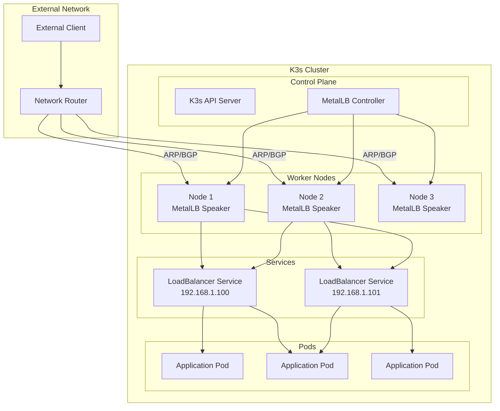
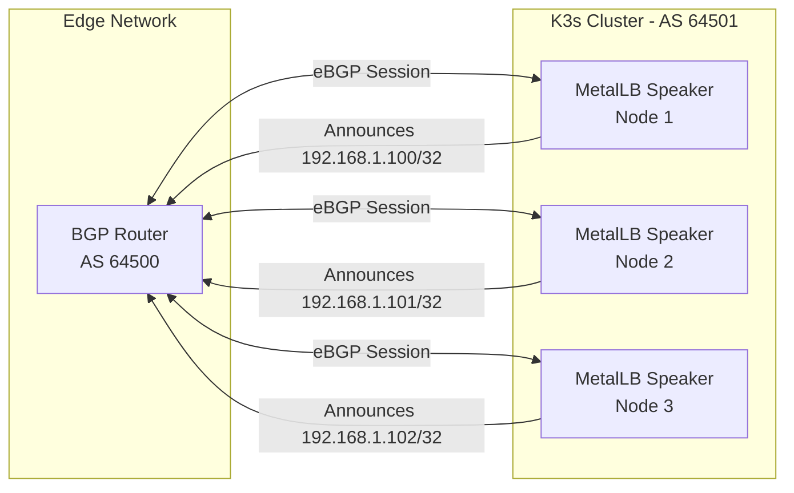
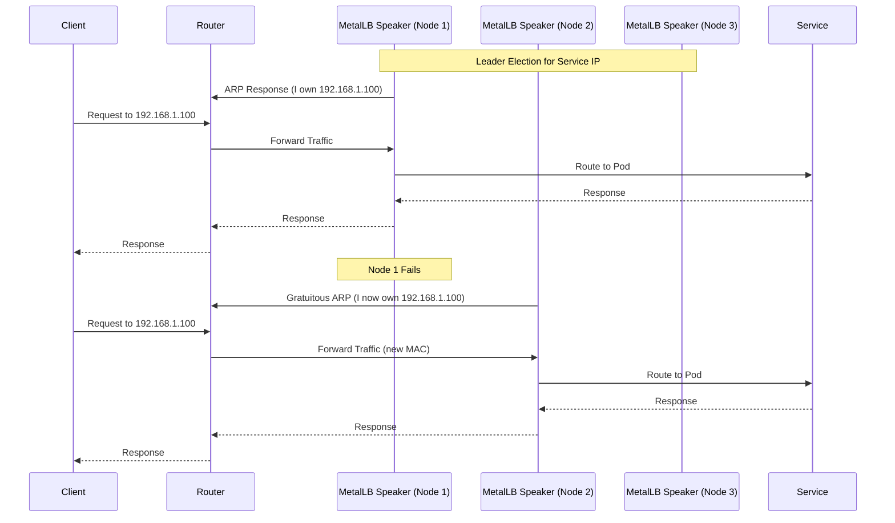

# How to Configure MetalLB with K3s for Lightweight Kubernetes

Author: [nawazdhandala](https://github.com/nawazdhandala)

Tags: MetalLB, K3s, Kubernetes, Load Balancing, Edge, IoT, Bare Metal, Networking

Description: Learn how to configure MetalLB with K3s for lightweight Kubernetes deployments on edge and IoT environments.

---

## Introduction

K3s is a lightweight, certified Kubernetes distribution designed for edge computing, IoT devices, and resource-constrained environments. When deploying K3s on bare metal or in environments without a cloud provider, you need a load balancer solution to expose your services externally. MetalLB fills this gap by providing a network load balancer implementation for bare metal Kubernetes clusters.

This guide will walk you through configuring MetalLB with K3s for lightweight Kubernetes deployments, covering everything from basic setup to advanced configurations suitable for edge and IoT scenarios.

## Why MetalLB with K3s?

The combination of MetalLB and K3s offers several advantages for edge and IoT deployments:

- **Lightweight footprint**: Both K3s and MetalLB are designed with minimal resource consumption in mind
- **No cloud dependency**: Perfect for on-premises, edge locations, or air-gapped environments
- **Native LoadBalancer support**: Enables the use of Kubernetes LoadBalancer services without a cloud provider
- **Layer 2 and BGP modes**: Flexible network integration options for various network topologies
- **Simple deployment**: Both components are easy to install and configure

## Architecture Overview

The following diagram illustrates how MetalLB integrates with K3s to provide external load balancing:



## Prerequisites

Before proceeding, ensure you have:

- A K3s cluster running (single node or multi-node)
- `kubectl` configured to communicate with your cluster
- A range of IP addresses available for MetalLB to allocate
- Network access to the nodes from the intended clients

## Step 1: Install K3s

If you haven't already installed K3s, here's how to set it up on your nodes.

### Installing K3s on the Master Node

For edge and IoT deployments, you may want to disable some default components. The following command installs K3s without the default load balancer (ServiceLB/Klipper), as MetalLB will replace it:

```bash
curl -sfL https://get.k3s.io | INSTALL_K3S_EXEC="--disable servicelb" sh -
```

### Getting the Join Token

To add worker nodes, you'll need the node token from the master:

```bash
sudo cat /var/lib/rancher/k3s/server/node-token
```

### Adding Worker Nodes

On each worker node, run the following command, replacing the server URL and token with your values:

```bash
curl -sfL https://get.k3s.io | K3S_URL=https://master-node:6443 K3S_TOKEN=<node-token> sh -
```

### Configuring kubectl

Set up kubectl to use the K3s kubeconfig:

```bash
export KUBECONFIG=/etc/rancher/k3s/k3s.yaml
```

Or copy it to your user's kubeconfig:

```bash
mkdir -p ~/.kube
sudo cp /etc/rancher/k3s/k3s.yaml ~/.kube/config
sudo chown $(id -u):$(id -g) ~/.kube/config
```

## Step 2: Verify K3s Installation

Ensure your K3s cluster is running properly before installing MetalLB.

Check cluster nodes:

```bash
kubectl get nodes
```

Expected output:

```
NAME          STATUS   ROLES                  AGE   VERSION
k3s-master    Ready    control-plane,master   5m    v1.28.5+k3s1
k3s-worker1   Ready    <none>                 3m    v1.28.5+k3s1
k3s-worker2   Ready    <none>                 3m    v1.28.5+k3s1
```

Verify the ServiceLB is disabled (no svclb pods should be running):

```bash
kubectl get pods -n kube-system | grep svclb
```

## Step 3: Install MetalLB

MetalLB can be installed using manifests or Helm. We'll cover both methods.

### Method 1: Installation Using Manifests

This applies the official MetalLB manifests to your cluster:

```bash
kubectl apply -f https://raw.githubusercontent.com/metallb/metallb/v0.14.5/config/manifests/metallb-native.yaml
```

### Method 2: Installation Using Helm

First, add the MetalLB Helm repository:

```bash
helm repo add metallb https://metallb.github.io/metallb
helm repo update
```

Then install MetalLB with Helm. This creates the metallb-system namespace and deploys the components:

```bash
helm install metallb metallb/metallb --namespace metallb-system --create-namespace
```

### Verify MetalLB Installation

Wait for the MetalLB pods to be ready:

```bash
kubectl wait --namespace metallb-system \
  --for=condition=ready pod \
  --selector=app=metallb \
  --timeout=120s
```

Check the MetalLB components:

```bash
kubectl get pods -n metallb-system
```

Expected output:

```
NAME                          READY   STATUS    RESTARTS   AGE
controller-7dcc8764f4-2xjkl   1/1     Running   0          2m
speaker-4kj9d                 1/1     Running   0          2m
speaker-8xh2m                 1/1     Running   0          2m
speaker-vw3pl                 1/1     Running   0          2m
```

## Step 4: Configure MetalLB Address Pools

MetalLB needs to know which IP addresses it can allocate to LoadBalancer services.

### Layer 2 Mode Configuration

Layer 2 mode is the simplest to configure and works well for most edge and IoT deployments. It uses ARP (IPv4) or NDP (IPv6) to announce the service IP addresses.

Create an IP address pool and L2 advertisement configuration. Replace the IP range with addresses available on your network:

```yaml
apiVersion: metallb.io/v1beta1
kind: IPAddressPool
metadata:
  name: edge-pool
  namespace: metallb-system
spec:
  addresses:
  - 192.168.1.100-192.168.1.120
---
apiVersion: metallb.io/v1beta1
kind: L2Advertisement
metadata:
  name: edge-l2-advertisement
  namespace: metallb-system
spec:
  ipAddressPools:
  - edge-pool
```

Apply the configuration:

```bash
kubectl apply -f metallb-config.yaml
```

### Multiple Address Pools

For larger deployments, you might want separate address pools for different purposes:

```yaml
apiVersion: metallb.io/v1beta1
kind: IPAddressPool
metadata:
  name: production-pool
  namespace: metallb-system
spec:
  addresses:
  - 192.168.1.100-192.168.1.110
---
apiVersion: metallb.io/v1beta1
kind: IPAddressPool
metadata:
  name: development-pool
  namespace: metallb-system
spec:
  addresses:
  - 192.168.1.200-192.168.1.210
---
apiVersion: metallb.io/v1beta1
kind: L2Advertisement
metadata:
  name: all-pools-advertisement
  namespace: metallb-system
spec:
  ipAddressPools:
  - production-pool
  - development-pool
```

## Step 5: Configure BGP Mode (Advanced)

For more complex network topologies, especially in larger edge deployments, BGP mode provides better scalability and traffic distribution.

The following diagram shows how BGP mode works with MetalLB:



### BGP Configuration

Configure MetalLB to peer with your BGP router. Replace the peer address and AS numbers with your network's values:

```yaml
apiVersion: metallb.io/v1beta2
kind: BGPPeer
metadata:
  name: edge-router
  namespace: metallb-system
spec:
  myASN: 64501
  peerASN: 64500
  peerAddress: 192.168.1.1
  password: "bgp-secret-password"
---
apiVersion: metallb.io/v1beta1
kind: IPAddressPool
metadata:
  name: bgp-pool
  namespace: metallb-system
spec:
  addresses:
  - 192.168.1.100-192.168.1.120
---
apiVersion: metallb.io/v1beta1
kind: BGPAdvertisement
metadata:
  name: bgp-advertisement
  namespace: metallb-system
spec:
  ipAddressPools:
  - bgp-pool
  localPref: 100
  communities:
  - 64500:100
```

## Step 6: Deploy a Test Application

Let's deploy a sample application to verify MetalLB is working correctly.

### Create a Deployment

This creates a simple nginx deployment with 3 replicas:

```yaml
apiVersion: apps/v1
kind: Deployment
metadata:
  name: nginx-test
  labels:
    app: nginx-test
spec:
  replicas: 3
  selector:
    matchLabels:
      app: nginx-test
  template:
    metadata:
      labels:
        app: nginx-test
    spec:
      containers:
      - name: nginx
        image: nginx:alpine
        ports:
        - containerPort: 80
        resources:
          limits:
            memory: "64Mi"
            cpu: "100m"
          requests:
            memory: "32Mi"
            cpu: "50m"
```

### Create a LoadBalancer Service

Expose the deployment using a LoadBalancer service. MetalLB will assign an IP from the configured pool:

```yaml
apiVersion: v1
kind: Service
metadata:
  name: nginx-loadbalancer
spec:
  type: LoadBalancer
  selector:
    app: nginx-test
  ports:
  - port: 80
    targetPort: 80
```

### Apply the Resources

Save the above YAML to files and apply them:

```bash
kubectl apply -f nginx-deployment.yaml
kubectl apply -f nginx-service.yaml
```

### Verify the Service

Check that MetalLB has assigned an external IP to the service:

```bash
kubectl get svc nginx-loadbalancer
```

Expected output (IP will be from your configured pool):

```
NAME                 TYPE           CLUSTER-IP     EXTERNAL-IP     PORT(S)        AGE
nginx-loadbalancer   LoadBalancer   10.43.45.123   192.168.1.100   80:31234/TCP   30s
```

### Test External Access

Verify you can access the service from outside the cluster:

```bash
curl http://192.168.1.100
```

You should see the nginx welcome page HTML.

## Step 7: Advanced Configurations for Edge/IoT

Edge and IoT deployments often have unique requirements. Here are some advanced configurations.

### Resource-Optimized MetalLB Installation

For resource-constrained IoT devices, you can limit MetalLB's resource usage. Create a values file for Helm installation:

```yaml
controller:
  resources:
    limits:
      cpu: 100m
      memory: 100Mi
    requests:
      cpu: 25m
      memory: 50Mi

speaker:
  resources:
    limits:
      cpu: 100m
      memory: 100Mi
    requests:
      cpu: 25m
      memory: 50Mi
  tolerations:
  - key: "node-role.kubernetes.io/edge"
    operator: "Exists"
    effect: "NoSchedule"
```

Install with custom values:

```bash
helm install metallb metallb/metallb \
  --namespace metallb-system \
  --create-namespace \
  -f metallb-values.yaml
```

### Node-Specific IP Advertisement

In edge deployments with nodes in different locations, you might want specific nodes to advertise specific IPs:

```yaml
apiVersion: metallb.io/v1beta1
kind: IPAddressPool
metadata:
  name: location-a-pool
  namespace: metallb-system
spec:
  addresses:
  - 192.168.10.100-192.168.10.110
---
apiVersion: metallb.io/v1beta1
kind: IPAddressPool
metadata:
  name: location-b-pool
  namespace: metallb-system
spec:
  addresses:
  - 192.168.20.100-192.168.20.110
---
apiVersion: metallb.io/v1beta1
kind: L2Advertisement
metadata:
  name: location-a-advertisement
  namespace: metallb-system
spec:
  ipAddressPools:
  - location-a-pool
  nodeSelectors:
  - matchLabels:
      location: "site-a"
---
apiVersion: metallb.io/v1beta1
kind: L2Advertisement
metadata:
  name: location-b-advertisement
  namespace: metallb-system
spec:
  ipAddressPools:
  - location-b-pool
  nodeSelectors:
  - matchLabels:
      location: "site-b"
```

### Requesting Specific IPs

For services that need a predictable IP address (common in IoT scenarios), use the loadBalancerIP field:

```yaml
apiVersion: v1
kind: Service
metadata:
  name: mqtt-broker
  annotations:
    metallb.universe.tf/address-pool: edge-pool
spec:
  type: LoadBalancer
  loadBalancerIP: 192.168.1.105
  selector:
    app: mqtt-broker
  ports:
  - port: 1883
    targetPort: 1883
    name: mqtt
  - port: 8883
    targetPort: 8883
    name: mqtt-tls
```

### IP Address Sharing

Multiple services can share the same IP address, useful when you have limited IPs:

```yaml
apiVersion: v1
kind: Service
metadata:
  name: web-service
  annotations:
    metallb.universe.tf/allow-shared-ip: "shared-ip-key"
spec:
  type: LoadBalancer
  loadBalancerIP: 192.168.1.100
  selector:
    app: web
  ports:
  - port: 80
    targetPort: 80
---
apiVersion: v1
kind: Service
metadata:
  name: api-service
  annotations:
    metallb.universe.tf/allow-shared-ip: "shared-ip-key"
spec:
  type: LoadBalancer
  loadBalancerIP: 192.168.1.100
  selector:
    app: api
  ports:
  - port: 8080
    targetPort: 8080
```

## Step 8: High Availability Considerations

For production edge deployments, consider these high availability configurations.

### MetalLB Component Flow in HA Mode



### Multi-Node K3s with MetalLB

Ensure your K3s cluster has multiple nodes for high availability:

```bash
kubectl get nodes -o wide
```

Label nodes for speaker scheduling:

```bash
kubectl label node k3s-worker1 metallb-speaker=true
kubectl label node k3s-worker2 metallb-speaker=true
```

### Configure Speaker Node Affinity

Restrict MetalLB speakers to specific nodes using a Helm values file:

```yaml
speaker:
  nodeSelector:
    metallb-speaker: "true"
  tolerations:
  - key: "node.kubernetes.io/network-unavailable"
    operator: "Exists"
    effect: "NoSchedule"
```

## Step 9: Monitoring MetalLB

Monitoring is essential for edge deployments. MetalLB exposes Prometheus metrics.

### Enable Prometheus Metrics

If using Helm, enable metrics in your values file:

```yaml
prometheus:
  scrapeAnnotations: true
  metricsPort: 7472

controller:
  metrics:
    enabled: true
    serviceMonitor:
      enabled: true

speaker:
  metrics:
    enabled: true
    serviceMonitor:
      enabled: true
```

### Manual ServiceMonitor Configuration

If you're not using Helm but have Prometheus Operator installed, create ServiceMonitors manually:

```yaml
apiVersion: monitoring.coreos.com/v1
kind: ServiceMonitor
metadata:
  name: metallb-controller
  namespace: metallb-system
spec:
  selector:
    matchLabels:
      app.kubernetes.io/component: controller
  endpoints:
  - port: monitoring
    interval: 30s
---
apiVersion: monitoring.coreos.com/v1
kind: ServiceMonitor
metadata:
  name: metallb-speaker
  namespace: metallb-system
spec:
  selector:
    matchLabels:
      app.kubernetes.io/component: speaker
  endpoints:
  - port: monitoring
    interval: 30s
```

### Key Metrics to Monitor

Here are important MetalLB metrics to track:

- `metallb_bgp_session_up` - BGP session status (1 = up, 0 = down)
- `metallb_bgp_announced_prefixes_total` - Number of prefixes announced via BGP
- `metallb_allocator_addresses_in_use_total` - Number of IPs currently allocated
- `metallb_allocator_addresses_total` - Total number of IPs available in pools
- `metallb_layer2_announcements_total` - Number of L2 announcements made

## Step 10: Troubleshooting

Common issues and their solutions when running MetalLB with K3s.

### Service Stuck in Pending State

If your LoadBalancer service doesn't get an external IP, check the following.

Verify MetalLB components are running:

```bash
kubectl get pods -n metallb-system
```

Check if IP pools are configured:

```bash
kubectl get ipaddresspools -n metallb-system
```

View MetalLB controller logs:

```bash
kubectl logs -n metallb-system -l app.kubernetes.io/component=controller
```

### Layer 2 Issues

For Layer 2 mode issues, check the speaker logs:

```bash
kubectl logs -n metallb-system -l app.kubernetes.io/component=speaker
```

Verify ARP responses from the cluster using this command from an external machine:

```bash
arping -I eth0 192.168.1.100
```

### BGP Issues

For BGP mode issues, check the BGP peer status:

```bash
kubectl get bgppeers -n metallb-system -o yaml
```

View detailed speaker logs:

```bash
kubectl logs -n metallb-system -l app.kubernetes.io/component=speaker --tail=100
```

### K3s ServiceLB Conflict

If you installed K3s with the default ServiceLB (Klipper), disable it:

```bash
kubectl delete daemonset svclb-* -n kube-system
```

Or reinstall K3s with ServiceLB disabled:

```bash
curl -sfL https://get.k3s.io | INSTALL_K3S_EXEC="--disable servicelb" sh -
```

### Network Policy Conflicts

If you're using network policies, ensure MetalLB traffic is allowed. Create a network policy to allow MetalLB speaker communication:

```yaml
apiVersion: networking.k8s.io/v1
kind: NetworkPolicy
metadata:
  name: allow-metallb-speaker
  namespace: metallb-system
spec:
  podSelector:
    matchLabels:
      app.kubernetes.io/component: speaker
  policyTypes:
  - Ingress
  - Egress
  ingress:
  - {}
  egress:
  - {}
```

## Complete Example: IoT Gateway Setup

Here's a complete example deploying an MQTT broker as an IoT gateway with MetalLB on K3s:

### Namespace and ConfigMap

```yaml
apiVersion: v1
kind: Namespace
metadata:
  name: iot-gateway
---
apiVersion: v1
kind: ConfigMap
metadata:
  name: mosquitto-config
  namespace: iot-gateway
data:
  mosquitto.conf: |
    listener 1883
    listener 8883
    allow_anonymous false
    password_file /mosquitto/config/passwd
    persistence true
    persistence_location /mosquitto/data/
    log_dest stdout
```

### MQTT Broker Deployment

```yaml
apiVersion: apps/v1
kind: Deployment
metadata:
  name: mqtt-broker
  namespace: iot-gateway
spec:
  replicas: 1
  selector:
    matchLabels:
      app: mqtt-broker
  template:
    metadata:
      labels:
        app: mqtt-broker
    spec:
      containers:
      - name: mosquitto
        image: eclipse-mosquitto:2
        ports:
        - containerPort: 1883
          name: mqtt
        - containerPort: 8883
          name: mqtt-tls
        resources:
          limits:
            memory: "128Mi"
            cpu: "200m"
          requests:
            memory: "64Mi"
            cpu: "100m"
        volumeMounts:
        - name: config
          mountPath: /mosquitto/config
        - name: data
          mountPath: /mosquitto/data
      volumes:
      - name: config
        configMap:
          name: mosquitto-config
      - name: data
        emptyDir: {}
```

### LoadBalancer Service for MQTT

```yaml
apiVersion: v1
kind: Service
metadata:
  name: mqtt-broker
  namespace: iot-gateway
  annotations:
    metallb.universe.tf/address-pool: edge-pool
spec:
  type: LoadBalancer
  loadBalancerIP: 192.168.1.105
  selector:
    app: mqtt-broker
  ports:
  - port: 1883
    targetPort: 1883
    name: mqtt
  - port: 8883
    targetPort: 8883
    name: mqtt-tls
```

### Apply All Resources

```bash
kubectl apply -f iot-gateway.yaml
```

### Verify the Deployment

Check the service has been assigned the requested IP:

```bash
kubectl get svc -n iot-gateway
```

Expected output:

```
NAME          TYPE           CLUSTER-IP    EXTERNAL-IP     PORT(S)                         AGE
mqtt-broker   LoadBalancer   10.43.12.45   192.168.1.105   1883:31234/TCP,8883:31235/TCP   30s
```

Test MQTT connectivity:

```bash
mosquitto_pub -h 192.168.1.105 -t test/topic -m "Hello from IoT device"
```

## Summary

Configuring MetalLB with K3s provides a powerful, lightweight solution for load balancing in edge and IoT Kubernetes deployments. Key takeaways:

1. **Disable K3s ServiceLB**: Use `--disable servicelb` when installing K3s to avoid conflicts
2. **Choose the right mode**: Layer 2 mode is simpler and suitable for most edge deployments; BGP mode offers better scalability
3. **Plan IP allocation**: Carefully plan your IP address pools based on your network topology
4. **Optimize for resources**: Use resource limits appropriate for your edge/IoT devices
5. **Monitor proactively**: Set up metrics collection to catch issues before they impact services
6. **Consider HA**: Deploy multiple nodes with proper speaker distribution for high availability

With MetalLB and K3s, you can run production-grade Kubernetes workloads on edge devices, IoT gateways, and resource-constrained environments while maintaining enterprise-level networking capabilities.

## Additional Resources

- [MetalLB Official Documentation](https://metallb.universe.tf/)
- [K3s Documentation](https://docs.k3s.io/)
- [MetalLB GitHub Repository](https://github.com/metallb/metallb)
- [K3s GitHub Repository](https://github.com/k3s-io/k3s)
