# How to Benchmark MetalLB Layer 2 vs BGP Mode Performance

Author: [nawazdhandala](https://github.com/nawazdhandala)

Tags: MetalLB, Kubernetes, Benchmarking, Performance, BGP, Layer 2, Load Balancing, Testing

Description: Learn how to benchmark MetalLB Layer 2 vs BGP mode performance including measuring latency and throughput differences.

---

MetalLB provides two distinct modes for advertising LoadBalancer services in bare-metal Kubernetes environments: Layer 2 (L2) mode and BGP mode. Each has different performance characteristics, failover behaviors, and scalability properties. This comprehensive guide walks you through setting up a rigorous benchmarking environment to measure latency, throughput, and overall performance differences between these two modes.

## Understanding the Performance Differences

Before diving into benchmarking, it's important to understand what makes these modes fundamentally different:

The following diagram illustrates the architectural differences between Layer 2 and BGP modes:


### Layer 2 Mode Characteristics

- Uses ARP/NDP to announce service IPs
- Single node handles all traffic for a given service (leader election)
- Simple setup, no router configuration required
- Limited by single node bandwidth
- Failover requires new leader election (typically 10-30 seconds)

### BGP Mode Characteristics

- Uses BGP protocol to announce routes to upstream routers
- Traffic distributed across multiple nodes via ECMP
- Requires BGP-capable network infrastructure
- Horizontal scaling of bandwidth across nodes
- Faster failover with BFD (sub-second possible)

## Prerequisites

Before starting the benchmark, ensure you have:

- A Kubernetes cluster with at least 3 worker nodes
- MetalLB installed and configured
- Network access to configure both L2 and BGP modes
- Benchmarking tools: `iperf3`, `wrk`, `vegeta`, and `fortio`
- Prometheus and Grafana for metrics collection (optional but recommended)

## Setting Up the Test Environment

### Step 1: Deploy a Test Application

Create a simple test application that can handle high throughput. We'll use nginx as the backend service.

This deployment creates 6 nginx replicas spread across nodes with anti-affinity rules to ensure distributed testing:

```yaml
# test-deployment.yaml
apiVersion: apps/v1
kind: Deployment
metadata:
  name: benchmark-nginx
  namespace: benchmark
spec:
  replicas: 6
  selector:
    matchLabels:
      app: benchmark-nginx
  template:
    metadata:
      labels:
        app: benchmark-nginx
    spec:
      affinity:
        podAntiAffinity:
          preferredDuringSchedulingIgnoredDuringExecution:
          - weight: 100
            podAffinityTerm:
              labelSelector:
                matchExpressions:
                - key: app
                  operator: In
                  values:
                  - benchmark-nginx
              topologyKey: kubernetes.io/hostname
      containers:
      - name: nginx
        image: nginx:alpine
        ports:
        - containerPort: 80
        resources:
          requests:
            memory: "128Mi"
            cpu: "500m"
          limits:
            memory: "256Mi"
            cpu: "1000m"
```

Create the namespace and deploy the application:

```bash
kubectl create namespace benchmark
kubectl apply -f test-deployment.yaml
```

### Step 2: Configure MetalLB for Layer 2 Mode

First, let's set up MetalLB in Layer 2 mode. This configuration creates an IP address pool and an L2 advertisement:

```yaml
# metallb-l2-config.yaml
apiVersion: metallb.io/v1beta1
kind: IPAddressPool
metadata:
  name: l2-pool
  namespace: metallb-system
spec:
  addresses:
  - 192.168.1.240-192.168.1.249

---
apiVersion: metallb.io/v1beta1
kind: L2Advertisement
metadata:
  name: l2-advertisement
  namespace: metallb-system
spec:
  ipAddressPools:
  - l2-pool
```

Apply the L2 configuration:

```bash
kubectl apply -f metallb-l2-config.yaml
```

Create a LoadBalancer service for L2 mode testing:

```yaml
# service-l2.yaml
apiVersion: v1
kind: Service
metadata:
  name: benchmark-l2
  namespace: benchmark
  annotations:
    metallb.universe.tf/address-pool: l2-pool
spec:
  type: LoadBalancer
  selector:
    app: benchmark-nginx
  ports:
  - port: 80
    targetPort: 80
```

### Step 3: Configure MetalLB for BGP Mode

Now configure BGP mode. You'll need to adjust the peer addresses and AS numbers to match your network:

```yaml
# metallb-bgp-config.yaml
apiVersion: metallb.io/v1beta1
kind: IPAddressPool
metadata:
  name: bgp-pool
  namespace: metallb-system
spec:
  addresses:
  - 192.168.1.250-192.168.1.254

---
apiVersion: metallb.io/v1beta2
kind: BGPPeer
metadata:
  name: router-peer
  namespace: metallb-system
spec:
  myASN: 64500
  peerASN: 64501
  peerAddress: 192.168.1.1
  holdTime: 90s
  keepaliveTime: 30s

---
apiVersion: metallb.io/v1beta1
kind: BGPAdvertisement
metadata:
  name: bgp-advertisement
  namespace: metallb-system
spec:
  ipAddressPools:
  - bgp-pool
  aggregationLength: 32
  localPref: 100
```

Create a separate service for BGP mode testing:

```yaml
# service-bgp.yaml
apiVersion: v1
kind: Service
metadata:
  name: benchmark-bgp
  namespace: benchmark
  annotations:
    metallb.universe.tf/address-pool: bgp-pool
spec:
  type: LoadBalancer
  selector:
    app: benchmark-nginx
  ports:
  - port: 80
    targetPort: 80
```

Apply the configurations:

```bash
kubectl apply -f metallb-bgp-config.yaml
kubectl apply -f service-bgp.yaml
```

## Benchmarking Tools and Methodology

### Benchmark Architecture Overview

The following diagram shows the complete benchmarking setup:


### Deploy the Benchmarking Pod

Create a dedicated pod for running benchmark tools from within the cluster:

```yaml
# benchmark-client.yaml
apiVersion: v1
kind: Pod
metadata:
  name: benchmark-client
  namespace: benchmark
spec:
  containers:
  - name: benchmark
    image: networkstatic/iperf3
    command: ["sleep", "infinity"]
  - name: wrk
    image: skandyla/wrk
    command: ["sleep", "infinity"]
  - name: vegeta
    image: peterevans/vegeta
    command: ["sleep", "infinity"]
  - name: fortio
    image: fortio/fortio
    command: ["sleep", "infinity"]
```

## Latency Benchmarking

### Test 1: TCP Latency with iperf3

This test measures raw TCP connection latency between client and server:

```bash
# Get the service IPs
L2_IP=$(kubectl get svc benchmark-l2 -n benchmark -o jsonpath='{.status.loadBalancer.ingress[0].ip}')
BGP_IP=$(kubectl get svc benchmark-bgp -n benchmark -o jsonpath='{.status.loadBalancer.ingress[0].ip}')

echo "L2 Service IP: $L2_IP"
echo "BGP Service IP: $BGP_IP"
```

Deploy an iperf3 server in your benchmark deployment and run latency tests:

```bash
# Run latency test against L2 service (10 iterations)
for i in {1..10}; do
  kubectl exec -n benchmark benchmark-client -c benchmark -- \
    iperf3 -c $L2_IP -p 5201 -t 30 --json | \
    jq '.end.sum_sent.bits_per_second, .end.streams[0].sender.mean_rtt'
done > l2_latency_results.txt

# Run latency test against BGP service (10 iterations)
for i in {1..10}; do
  kubectl exec -n benchmark benchmark-client -c benchmark -- \
    iperf3 -c $BGP_IP -p 5201 -t 30 --json | \
    jq '.end.sum_sent.bits_per_second, .end.streams[0].sender.mean_rtt'
done > bgp_latency_results.txt
```

### Test 2: HTTP Latency with wrk

Measure HTTP request latency with concurrent connections:

```bash
# L2 mode latency test - 100 connections, 4 threads, 60 seconds
kubectl exec -n benchmark benchmark-client -c wrk -- \
  wrk -t4 -c100 -d60s --latency http://$L2_IP/ > l2_wrk_results.txt

# BGP mode latency test
kubectl exec -n benchmark benchmark-client -c wrk -- \
  wrk -t4 -c100 -d60s --latency http://$BGP_IP/ > bgp_wrk_results.txt
```

### Test 3: Detailed Latency Distribution with Fortio

Fortio provides detailed percentile latency distribution which is crucial for understanding tail latencies:

```bash
# L2 mode - capture p50, p75, p90, p99, p99.9 latencies
kubectl exec -n benchmark benchmark-client -c fortio -- \
  fortio load -qps 1000 -t 60s -c 50 \
  -json l2_fortio.json \
  http://$L2_IP/

# BGP mode
kubectl exec -n benchmark benchmark-client -c fortio -- \
  fortio load -qps 1000 -t 60s -c 50 \
  -json bgp_fortio.json \
  http://$BGP_IP/
```

## Throughput Benchmarking

### Test 4: Maximum Throughput with iperf3

Measure the maximum achievable throughput for each mode:

```bash
# L2 mode throughput - parallel streams
kubectl exec -n benchmark benchmark-client -c benchmark -- \
  iperf3 -c $L2_IP -p 5201 -t 60 -P 10 --json > l2_throughput.json

# BGP mode throughput - parallel streams
kubectl exec -n benchmark benchmark-client -c benchmark -- \
  iperf3 -c $BGP_IP -p 5201 -t 60 -P 10 --json > bgp_throughput.json
```

### Test 5: HTTP Throughput with vegeta

Use vegeta for sustained HTTP load testing:

Create a target file for vegeta:

```bash
echo "GET http://$L2_IP/" > l2_targets.txt
echo "GET http://$BGP_IP/" > bgp_targets.txt
```

Run the load tests with increasing rates:

```bash
# L2 mode - ramp up from 1000 to 10000 RPS
for rate in 1000 2000 5000 10000; do
  kubectl exec -n benchmark benchmark-client -c vegeta -- \
    vegeta attack -targets=/tmp/l2_targets.txt -rate=$rate -duration=60s | \
    vegeta report --type=json > l2_vegeta_${rate}rps.json
done

# BGP mode
for rate in 1000 2000 5000 10000; do
  kubectl exec -n benchmark benchmark-client -c vegeta -- \
    vegeta attack -targets=/tmp/bgp_targets.txt -rate=$rate -duration=60s | \
    vegeta report --type=json > bgp_vegeta_${rate}rps.json
done
```

## Scalability Benchmarking

### Test 6: Multi-Client Scaling

This test simulates multiple clients to see how each mode scales. The key difference is that L2 mode funnels all traffic through a single node while BGP distributes it.

Deploy multiple benchmark clients:

```yaml
# multi-client-benchmark.yaml
apiVersion: apps/v1
kind: Deployment
metadata:
  name: benchmark-clients
  namespace: benchmark
spec:
  replicas: 10
  selector:
    matchLabels:
      app: benchmark-client
  template:
    metadata:
      labels:
        app: benchmark-client
    spec:
      affinity:
        podAntiAffinity:
          preferredDuringSchedulingIgnoredDuringExecution:
          - weight: 100
            podAffinityTerm:
              labelSelector:
                matchExpressions:
                - key: app
                  operator: In
                  values:
                  - benchmark-client
              topologyKey: kubernetes.io/hostname
      containers:
      - name: fortio
        image: fortio/fortio
        command: ["sleep", "infinity"]
```

Run coordinated load tests from all clients simultaneously:

```bash
# Get all client pod names
CLIENTS=$(kubectl get pods -n benchmark -l app=benchmark-client -o jsonpath='{.items[*].metadata.name}')

# Run simultaneous load test against L2 service
for client in $CLIENTS; do
  kubectl exec -n benchmark $client -- \
    fortio load -qps 500 -t 60s -c 20 http://$L2_IP/ &
done
wait

# Run simultaneous load test against BGP service
for client in $CLIENTS; do
  kubectl exec -n benchmark $client -- \
    fortio load -qps 500 -t 60s -c 20 http://$BGP_IP/ &
done
wait
```

## Failover Performance Testing

### Test 7: Measuring Failover Time

One of the most significant differences between L2 and BGP modes is failover behavior.

The failover process differs significantly between modes:


Script to measure L2 failover time:

```bash
#!/bin/bash
# l2-failover-test.sh

L2_IP=$1
OUTPUT_FILE="l2_failover_results.txt"

# Start continuous ping in background
ping -i 0.1 $L2_IP | while read line; do
  echo "$(date +%s.%N) $line"
done > $OUTPUT_FILE &
PING_PID=$!

# Find and cordon the leader node
LEADER_NODE=$(kubectl get endpoints benchmark-l2 -n benchmark -o jsonpath='{.subsets[0].addresses[0].nodeName}')
echo "Leader node: $LEADER_NODE"

# Simulate node failure by cordoning and draining
kubectl cordon $LEADER_NODE
kubectl drain $LEADER_NODE --ignore-daemonsets --delete-emptydir-data --force

# Wait for failover to complete
sleep 60

# Stop ping
kill $PING_PID

# Analyze results - count dropped packets and measure recovery time
echo "Analyzing failover results..."
grep -c "Request timeout" $OUTPUT_FILE
```

Script to measure BGP failover time (requires BFD enabled):

```bash
#!/bin/bash
# bgp-failover-test.sh

BGP_IP=$1
OUTPUT_FILE="bgp_failover_results.txt"

# Start continuous ping in background
ping -i 0.1 $BGP_IP | while read line; do
  echo "$(date +%s.%N) $line"
done > $OUTPUT_FILE &
PING_PID=$!

# Find a node advertising the BGP route
BGP_NODE=$(kubectl get pods -n metallb-system -l component=speaker -o jsonpath='{.items[0].spec.nodeName}')
echo "BGP advertising node: $BGP_NODE"

# Simulate node failure
kubectl cordon $BGP_NODE
kubectl drain $BGP_NODE --ignore-daemonsets --delete-emptydir-data --force

# Wait for failover
sleep 60

# Stop ping
kill $PING_PID

# Analyze results
echo "Analyzing failover results..."
grep -c "Request timeout" $OUTPUT_FILE
```

## Collecting and Analyzing Results

### Prometheus Metrics Collection

Deploy ServiceMonitors to collect MetalLB metrics:

```yaml
# metallb-servicemonitor.yaml
apiVersion: monitoring.coreos.com/v1
kind: ServiceMonitor
metadata:
  name: metallb-monitor
  namespace: metallb-system
spec:
  selector:
    matchLabels:
      app.kubernetes.io/name: metallb
  endpoints:
  - port: metrics
    interval: 15s
```

### Key Metrics to Monitor

Create a Grafana dashboard to visualize these metrics:

```yaml
# grafana-dashboard-configmap.yaml
apiVersion: v1
kind: ConfigMap
metadata:
  name: metallb-benchmark-dashboard
  namespace: monitoring
  labels:
    grafana_dashboard: "1"
data:
  metallb-benchmark.json: |
    {
      "dashboard": {
        "title": "MetalLB Benchmark Dashboard",
        "panels": [
          {
            "title": "Request Latency (L2 vs BGP)",
            "type": "graph",
            "targets": [
              {
                "expr": "histogram_quantile(0.99, sum(rate(http_request_duration_seconds_bucket{service='benchmark-l2'}[5m])) by (le))",
                "legendFormat": "L2 p99"
              },
              {
                "expr": "histogram_quantile(0.99, sum(rate(http_request_duration_seconds_bucket{service='benchmark-bgp'}[5m])) by (le))",
                "legendFormat": "BGP p99"
              }
            ]
          },
          {
            "title": "Throughput Comparison",
            "type": "graph",
            "targets": [
              {
                "expr": "sum(rate(nginx_http_requests_total{service='benchmark-l2'}[1m]))",
                "legendFormat": "L2 RPS"
              },
              {
                "expr": "sum(rate(nginx_http_requests_total{service='benchmark-bgp'}[1m]))",
                "legendFormat": "BGP RPS"
              }
            ]
          }
        ]
      }
    }
```

### Results Analysis Script

Python script to analyze and compare benchmark results:

```python
#!/usr/bin/env python3
# analyze_benchmark.py

import json
import statistics
import sys
from pathlib import Path

def load_fortio_results(filename):
    """Load and parse Fortio JSON results."""
    with open(filename) as f:
        data = json.load(f)
    return {
        'qps': data['ActualQPS'],
        'p50': data['DurationHistogram']['Percentiles'][0]['Value'] * 1000,
        'p75': data['DurationHistogram']['Percentiles'][1]['Value'] * 1000,
        'p90': data['DurationHistogram']['Percentiles'][2]['Value'] * 1000,
        'p99': data['DurationHistogram']['Percentiles'][3]['Value'] * 1000,
        'p999': data['DurationHistogram']['Percentiles'][4]['Value'] * 1000,
        'mean': data['DurationHistogram']['Avg'] * 1000,
        'errors': data.get('ErrorsDurationHistogram', {}).get('Count', 0)
    }

def load_vegeta_results(filename):
    """Load and parse Vegeta JSON results."""
    with open(filename) as f:
        data = json.load(f)
    return {
        'rps': data['rate'],
        'throughput': data['throughput'],
        'mean_latency': data['latencies']['mean'] / 1e6,
        'p50_latency': data['latencies']['50th'] / 1e6,
        'p99_latency': data['latencies']['99th'] / 1e6,
        'success_rate': data['success'] * 100,
        'errors': data['errors']
    }

def compare_results(l2_results, bgp_results, test_name):
    """Compare L2 and BGP results and print summary."""
    print(f"\n{'='*60}")
    print(f"Test: {test_name}")
    print(f"{'='*60}")

    print(f"\n{'Metric':<25} {'L2 Mode':<15} {'BGP Mode':<15} {'Difference':<15}")
    print("-" * 70)

    for key in l2_results:
        l2_val = l2_results[key]
        bgp_val = bgp_results[key]

        if isinstance(l2_val, (int, float)) and l2_val != 0:
            diff_pct = ((bgp_val - l2_val) / l2_val) * 100
            diff_str = f"{diff_pct:+.2f}%"
        else:
            diff_str = "N/A"

        if isinstance(l2_val, float):
            print(f"{key:<25} {l2_val:<15.3f} {bgp_val:<15.3f} {diff_str:<15}")
        else:
            print(f"{key:<25} {l2_val:<15} {bgp_val:<15} {diff_str:<15}")

def main():
    # Analyze Fortio results
    print("\n" + "="*70)
    print("METALLB BENCHMARK RESULTS ANALYSIS")
    print("="*70)

    l2_fortio = load_fortio_results('l2_fortio.json')
    bgp_fortio = load_fortio_results('bgp_fortio.json')
    compare_results(l2_fortio, bgp_fortio, "HTTP Latency (Fortio)")

    # Analyze Vegeta results at different rates
    for rate in [1000, 2000, 5000, 10000]:
        l2_vegeta = load_vegeta_results(f'l2_vegeta_{rate}rps.json')
        bgp_vegeta = load_vegeta_results(f'bgp_vegeta_{rate}rps.json')
        compare_results(l2_vegeta, bgp_vegeta, f"HTTP Throughput at {rate} RPS (Vegeta)")

    # Summary and recommendations
    print("\n" + "="*70)
    print("SUMMARY AND RECOMMENDATIONS")
    print("="*70)

    print("""
Based on the benchmark results:

1. LATENCY:
   - L2 mode typically shows lower latency for light loads
   - BGP mode shows more consistent latency under heavy load
   - At high concurrency, BGP benefits from traffic distribution

2. THROUGHPUT:
   - L2 mode is limited by single-node bandwidth
   - BGP mode scales linearly with additional nodes
   - For high-throughput scenarios, BGP is strongly recommended

3. FAILOVER:
   - L2 failover: 10-30 seconds (ARP/NDP update propagation)
   - BGP failover: 1-3 seconds (or <300ms with BFD)

4. RECOMMENDATIONS:
   - Use L2 mode for: Simple setups, development, low traffic
   - Use BGP mode for: Production, high availability, high throughput
    """)

if __name__ == '__main__':
    main()
```

## Expected Results and Interpretation

Based on typical benchmarking scenarios, here's what you might expect:

### Latency Comparison Table

| Metric | L2 Mode | BGP Mode | Notes |
|--------|---------|----------|-------|
| p50 Latency | 0.5-1ms | 0.5-1ms | Similar at low load |
| p99 Latency | 2-5ms | 1-3ms | BGP more consistent |
| p99.9 Latency | 10-20ms | 5-10ms | BGP handles bursts better |
| Under Load | Degrades | Stable | BGP distributes load |

### Throughput Comparison

```mermaid
graph LR
    subgraph "Throughput Scaling"
        L2[L2 Mode<br/>~10 Gbps max<br/>Single node limit]
        BGP[BGP Mode<br/>~10 Gbps × N nodes<br/>Linear scaling]
    end
```



| Clients | L2 Mode RPS | BGP Mode RPS | Improvement |
|---------|-------------|--------------|-------------|
| 10 | 50,000 | 55,000 | +10% |
| 50 | 45,000 | 150,000 | +233% |
| 100 | 40,000 | 280,000 | +600% |
| 200 | 35,000 | 350,000 | +900% |

### Failover Time Comparison

| Scenario | L2 Mode | BGP Mode (no BFD) | BGP Mode (with BFD) |
|----------|---------|-------------------|---------------------|
| Node failure | 10-30s | 3-5s | 0.3-1s |
| Network partition | 30-60s | 5-10s | 0.3-1s |
| Graceful shutdown | 5-10s | 1-3s | <1s |

## Best Practices for Accurate Benchmarking

### 1. Isolate the Test Environment

Ensure no other workloads are competing for resources during benchmarks:

```bash
# Create dedicated node pool for benchmarking
kubectl taint nodes benchmark-node-1 benchmark=true:NoSchedule
kubectl taint nodes benchmark-node-2 benchmark=true:NoSchedule
kubectl taint nodes benchmark-node-3 benchmark=true:NoSchedule
```

### 2. Warm Up Before Measuring

Always run warm-up iterations before collecting data:

```bash
# Warm-up run (discard results)
kubectl exec -n benchmark benchmark-client -c fortio -- \
  fortio load -qps 1000 -t 30s http://$L2_IP/

# Actual measurement
kubectl exec -n benchmark benchmark-client -c fortio -- \
  fortio load -qps 1000 -t 60s -json results.json http://$L2_IP/
```

### 3. Run Multiple Iterations

Statistical significance requires multiple test runs:

```bash
#!/bin/bash
# run-benchmark-iterations.sh

ITERATIONS=10
RESULTS_DIR="./benchmark_results"
mkdir -p $RESULTS_DIR

for i in $(seq 1 $ITERATIONS); do
  echo "Running iteration $i of $ITERATIONS..."

  # L2 test
  kubectl exec -n benchmark benchmark-client -c fortio -- \
    fortio load -qps 1000 -t 60s -json - http://$L2_IP/ > \
    $RESULTS_DIR/l2_iter_${i}.json

  # BGP test
  kubectl exec -n benchmark benchmark-client -c fortio -- \
    fortio load -qps 1000 -t 60s -json - http://$BGP_IP/ > \
    $RESULTS_DIR/bgp_iter_${i}.json

  # Cool down between iterations
  sleep 30
done

echo "Benchmark complete. Results in $RESULTS_DIR"
```

### 4. Monitor System Resources

Collect node-level metrics during tests:

```bash
# Monitor CPU, memory, network on all nodes
kubectl top nodes --use-protocol-buffers

# Watch for network saturation
kubectl exec -n benchmark benchmark-client -- \
  watch -n 1 'cat /proc/net/dev | grep eth0'
```

## Conclusion

Benchmarking MetalLB Layer 2 vs BGP mode reveals important performance characteristics:

1. **Layer 2 Mode** is simpler to configure and works well for development and low-traffic production environments. However, it becomes a bottleneck as traffic increases because all traffic flows through a single leader node.

2. **BGP Mode** requires more infrastructure setup but provides significant advantages for production workloads:
   - Horizontal scaling through ECMP
   - Faster failover with BFD
   - More predictable latency under load
   - Better utilization of cluster resources

3. **Mode Selection Criteria**:
   - Choose L2 for simplicity when traffic is low (<10,000 RPS)
   - Choose BGP when you need high availability (sub-second failover)
   - Choose BGP when throughput requirements exceed single-node capacity
   - Choose BGP for production workloads requiring consistent latency

Regular benchmarking should be part of your capacity planning process. As your traffic patterns change, re-run these benchmarks to ensure your MetalLB configuration continues to meet your performance requirements.

## Additional Resources

- [MetalLB Official Documentation](https://metallb.universe.tf/)
- [Fortio Load Testing Tool](https://fortio.org/)
- [Vegeta HTTP Load Testing](https://github.com/tsenart/vegeta)
- [iperf3 Network Performance](https://iperf.fr/)
- [Kubernetes Service Load Balancing](https://kubernetes.io/docs/concepts/services-networking/service/)
