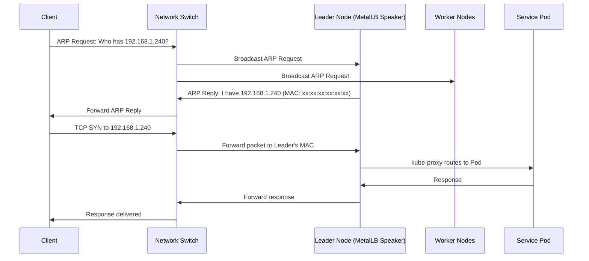
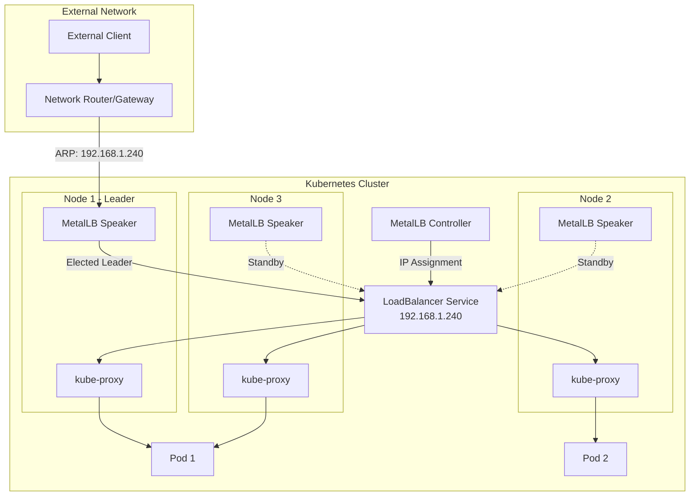
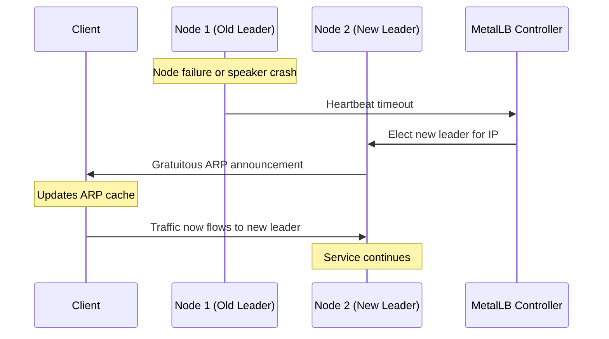
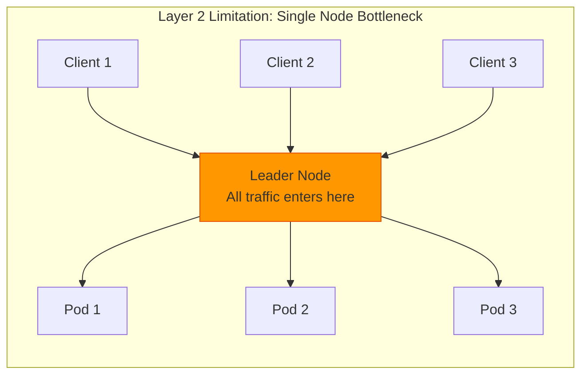

# How to Configure MetalLB Layer 2 Mode for Local Networks

Author: [nawazdhandala](https://github.com/nawazdhandala)

Tags: MetalLB, Kubernetes, Layer 2, ARP, Networking, Load Balancing

Description: Learn how to configure MetalLB Layer 2 mode for simple load balancing on local networks.

---

MetalLB is a load-balancer implementation for bare-metal Kubernetes clusters that provides network load balancing capabilities. Unlike cloud providers where LoadBalancer services are handled by the infrastructure, bare-metal clusters require a solution like MetalLB to assign external IP addresses to services. Layer 2 mode is the simplest way to get started with MetalLB, making it ideal for local networks, development environments, and small-scale deployments.

## Understanding Layer 2 Mode

Layer 2 mode works by responding to ARP (Address Resolution Protocol) requests on the local network. When a service is assigned an external IP, MetalLB elects a leader node that "owns" that IP address and responds to ARP requests for it. All traffic destined for that IP is then routed to the leader node, which forwards it to the appropriate pods.

### How Layer 2 Mode Works

The following diagram illustrates how MetalLB Layer 2 mode handles traffic:



### Layer 2 Mode Architecture

This diagram shows the overall architecture of MetalLB in Layer 2 mode:



## Prerequisites

Before configuring MetalLB Layer 2 mode, ensure you have:

- A Kubernetes cluster (v1.13.0 or later)
- kubectl configured to access your cluster
- Cluster admin permissions
- A range of IP addresses available on your local network that are not used by DHCP or other services
- Network that supports ARP (most standard Ethernet networks)

## Installing MetalLB

First, let's install MetalLB using the official manifests. The following command applies the MetalLB namespace, controller, and speaker components:

```bash
# Apply the MetalLB native manifest which includes:
# - metallb-system namespace
# - Controller deployment (handles IP address allocation)
# - Speaker daemonset (announces IPs via ARP)
# - Required RBAC permissions
kubectl apply -f https://raw.githubusercontent.com/metallb/metallb/v0.14.5/config/manifests/metallb-native.yaml
```

Wait for MetalLB components to be ready before proceeding:

```bash
# Wait for the controller and speaker pods to be running
# The controller manages IP allocation, speakers handle ARP announcements
kubectl wait --namespace metallb-system \
  --for=condition=ready pod \
  --selector=app=metallb \
  --timeout=90s
```

Verify the installation by checking the running pods:

```bash
# Verify MetalLB components are running
# You should see one controller pod and one speaker pod per node
kubectl get pods -n metallb-system

# Expected output:
# NAME                          READY   STATUS    RESTARTS   AGE
# controller-5f784d7c9d-xxxxx   1/1     Running   0          2m
# speaker-xxxxx                 1/1     Running   0          2m
# speaker-yyyyy                 1/1     Running   0          2m
# speaker-zzzzz                 1/1     Running   0          2m
```

## Configuring IPAddressPool

The IPAddressPool defines which IP addresses MetalLB can assign to LoadBalancer services. This is the first configuration resource you need to create.

### Basic IPAddressPool Configuration

Create a file named `ipaddresspool.yaml` with the following content. This configuration defines a pool of IP addresses that MetalLB will use:

```yaml
# IPAddressPool defines a range of IP addresses that MetalLB can allocate
# to LoadBalancer services. Choose IPs from your local network that are:
# - Not used by DHCP
# - Not assigned to other devices
# - Routable from clients that need to access the services
apiVersion: metallb.io/v1beta1
kind: IPAddressPool
metadata:
  # Name used to reference this pool in L2Advertisement
  name: local-network-pool
  # MetalLB resources must be in the metallb-system namespace
  namespace: metallb-system
spec:
  # addresses defines the IP ranges available for allocation
  # Format options: CIDR notation or range notation
  addresses:
    # Range notation: start IP - end IP
    # This example provides 16 IPs (192.168.1.240 through 192.168.1.255)
    - 192.168.1.240-192.168.1.255
```

Apply the IPAddressPool configuration:

```bash
# Apply the IPAddressPool to make IPs available for allocation
kubectl apply -f ipaddresspool.yaml
```

### Advanced IPAddressPool with Multiple Ranges

For more complex setups, you can define multiple IP ranges and control allocation behavior:

```yaml
# Advanced IPAddressPool with multiple ranges and allocation controls
apiVersion: metallb.io/v1beta1
kind: IPAddressPool
metadata:
  name: production-pool
  namespace: metallb-system
spec:
  addresses:
    # Multiple ranges can be specified for flexibility
    # Primary range for general services
    - 192.168.1.100-192.168.1.150
    # Secondary range for specific use cases
    - 192.168.1.200-192.168.1.220
    # CIDR notation is also supported (provides 16 IPs)
    - 10.0.0.0/28

  # autoAssign controls whether this pool is used for automatic allocation
  # Set to false if you want services to explicitly request from this pool
  # Default is true
  autoAssign: true

  # avoidBuggyIPs skips .0 and .255 addresses which can cause issues
  # with some network equipment that treats these as broadcast addresses
  # Default is false
  avoidBuggyIPs: true
```

### IPAddressPool for Specific Services

You can create dedicated pools for specific applications by disabling auto-assignment:

```yaml
# Dedicated pool for database services - requires explicit annotation
apiVersion: metallb.io/v1beta1
kind: IPAddressPool
metadata:
  name: database-pool
  namespace: metallb-system
spec:
  addresses:
    # Reserved range for database load balancers
    - 192.168.1.50-192.168.1.59

  # Disable auto-assignment to require explicit pool selection
  # Services must use annotation: metallb.universe.tf/address-pool: database-pool
  autoAssign: false
```

## Configuring L2Advertisement

The L2Advertisement resource tells MetalLB to advertise IP addresses from specified pools using Layer 2 (ARP/NDP) protocol. Without this configuration, allocated IPs won't be reachable from the network.

### Basic L2Advertisement

Create a file named `l2advertisement.yaml`:

```yaml
# L2Advertisement enables Layer 2 mode for the specified IP pools
# This makes MetalLB respond to ARP requests for allocated IPs
apiVersion: metallb.io/v1beta1
kind: L2Advertisement
metadata:
  # Name for this advertisement configuration
  name: local-network-advertisement
  namespace: metallb-system
spec:
  # ipAddressPools lists which pools should be advertised via Layer 2
  # If omitted, all pools are advertised
  ipAddressPools:
    - local-network-pool
```

Apply the L2Advertisement:

```bash
# Apply the L2Advertisement to enable ARP announcements
kubectl apply -f l2advertisement.yaml
```

### L2Advertisement with Node Selectors

Control which nodes can be leaders for Layer 2 announcements. This is useful for directing traffic to specific nodes:

```yaml
# L2Advertisement with node selection for controlled traffic flow
apiVersion: metallb.io/v1beta1
kind: L2Advertisement
metadata:
  name: edge-node-advertisement
  namespace: metallb-system
spec:
  ipAddressPools:
    - production-pool

  # nodeSelectors restricts which nodes can become leaders
  # Only nodes matching these selectors will respond to ARP requests
  nodeSelectors:
    - matchLabels:
        # Only nodes labeled as edge nodes will handle L2 traffic
        node-role.kubernetes.io/edge: "true"
    - matchExpressions:
        # Alternative: select nodes in specific zones
        - key: topology.kubernetes.io/zone
          operator: In
          values:
            - zone-a
            - zone-b
```

### L2Advertisement with Interface Selection

Specify which network interfaces should be used for ARP announcements:

```yaml
# L2Advertisement with specific interface configuration
apiVersion: metallb.io/v1beta1
kind: L2Advertisement
metadata:
  name: interface-specific-advertisement
  namespace: metallb-system
spec:
  ipAddressPools:
    - local-network-pool

  # interfaces restricts ARP announcements to specific network interfaces
  # Useful when nodes have multiple NICs (management, data, storage networks)
  interfaces:
    # Only announce on the primary data network interface
    - eth0
    # Also announce on the secondary bonded interface
    - bond0
```

## Complete Configuration Example

Here's a complete, production-ready configuration combining all components:

```yaml
# Complete MetalLB Layer 2 configuration for a local network
# This configuration provides two pools: general and dedicated
---
# Primary pool for general LoadBalancer services
apiVersion: metallb.io/v1beta1
kind: IPAddressPool
metadata:
  name: primary-pool
  namespace: metallb-system
spec:
  addresses:
    # 16 IPs for general use
    - 192.168.1.240-192.168.1.255
  # Automatically assign IPs from this pool to new LoadBalancer services
  autoAssign: true
  # Avoid .0 and .255 addresses to prevent network issues
  avoidBuggyIPs: true

---
# Secondary pool for specific high-priority services
apiVersion: metallb.io/v1beta1
kind: IPAddressPool
metadata:
  name: priority-pool
  namespace: metallb-system
spec:
  addresses:
    # 5 IPs reserved for critical services
    - 192.168.1.200-192.168.1.204
  # Require explicit annotation to use this pool
  autoAssign: false

---
# L2 Advertisement for primary pool - available on all nodes
apiVersion: metallb.io/v1beta1
kind: L2Advertisement
metadata:
  name: primary-l2-advertisement
  namespace: metallb-system
spec:
  ipAddressPools:
    - primary-pool

---
# L2 Advertisement for priority pool - only on worker nodes
apiVersion: metallb.io/v1beta1
kind: L2Advertisement
metadata:
  name: priority-l2-advertisement
  namespace: metallb-system
spec:
  ipAddressPools:
    - priority-pool
  nodeSelectors:
    - matchLabels:
        # Only worker nodes can be leaders for priority services
        node-role.kubernetes.io/worker: "true"
```

## Creating a LoadBalancer Service

Now let's create a service that uses MetalLB. First, deploy a sample application:

```yaml
# Sample nginx deployment for testing MetalLB
apiVersion: apps/v1
kind: Deployment
metadata:
  name: nginx-demo
  namespace: default
spec:
  replicas: 3
  selector:
    matchLabels:
      app: nginx-demo
  template:
    metadata:
      labels:
        app: nginx-demo
    spec:
      containers:
        - name: nginx
          image: nginx:1.25
          ports:
            - containerPort: 80
          # Add resource limits for production use
          resources:
            limits:
              memory: "128Mi"
              cpu: "250m"
            requests:
              memory: "64Mi"
              cpu: "100m"
```

Create a LoadBalancer service to expose the application:

```yaml
# LoadBalancer service that will receive an IP from MetalLB
apiVersion: v1
kind: Service
metadata:
  name: nginx-lb
  namespace: default
  # Optional: Add annotations to control MetalLB behavior
  annotations:
    # Uncomment to request a specific IP address
    # metallb.universe.tf/loadBalancerIPs: "192.168.1.240"

    # Uncomment to request from a specific pool (required for autoAssign: false pools)
    # metallb.universe.tf/address-pool: priority-pool
spec:
  # Type LoadBalancer triggers MetalLB to assign an external IP
  type: LoadBalancer

  # externalTrafficPolicy affects how traffic is routed:
  # - Cluster: kube-proxy load balances across all pods (may cause extra hops)
  # - Local: Traffic goes directly to pods on the receiving node (preserves source IP)
  externalTrafficPolicy: Cluster

  selector:
    app: nginx-demo
  ports:
    - name: http
      port: 80
      targetPort: 80
      protocol: TCP
```

Apply and verify the service:

```bash
# Apply the deployment and service
kubectl apply -f nginx-demo.yaml

# Check that the service received an external IP from MetalLB
# The EXTERNAL-IP column should show an IP from your pool
kubectl get service nginx-lb

# Expected output:
# NAME       TYPE           CLUSTER-IP      EXTERNAL-IP     PORT(S)        AGE
# nginx-lb   LoadBalancer   10.96.xxx.xxx   192.168.1.240   80:32000/TCP   1m

# Test connectivity to the service from any machine on the network
curl http://192.168.1.240
```

### Requesting a Specific IP Address

To request a specific IP from your pool, use the annotation:

```yaml
# Service requesting a specific IP address from MetalLB
apiVersion: v1
kind: Service
metadata:
  name: nginx-specific-ip
  namespace: default
  annotations:
    # Request a specific IP address from the pool
    # The IP must be available and within a configured pool
    metallb.universe.tf/loadBalancerIPs: "192.168.1.245"
spec:
  type: LoadBalancer
  selector:
    app: nginx-demo
  ports:
    - port: 80
      targetPort: 80
```

### Using a Specific Pool

To use a non-auto-assign pool, specify the pool name:

```yaml
# Service using a specific address pool
apiVersion: v1
kind: Service
metadata:
  name: priority-service
  namespace: default
  annotations:
    # Request IP from the priority pool (which has autoAssign: false)
    metallb.universe.tf/address-pool: priority-pool
spec:
  type: LoadBalancer
  selector:
    app: critical-app
  ports:
    - port: 443
      targetPort: 8443
```

## Failover Behavior

Layer 2 mode provides automatic failover when the leader node becomes unavailable. Understanding this behavior is crucial for production deployments.

### Failover Process

The following diagram illustrates the failover sequence:



### Failover Timeline

```mermaid
gantt
    title MetalLB Layer 2 Failover Timeline
    dateFormat X
    axisFormat %s seconds

    section Normal Operation
    Leader responding    :active, normal, 0, 10

    section Failure
    Node failure         :crit, failure, 10, 11

    section Recovery
    Detection (1-3s)     :detection, 11, 14
    Election (< 1s)      :election, 14, 15
    Gratuitous ARP       :arp, 15, 16
    Client ARP update    :client, 16, 17
    Traffic restored     :done, restored, 17, 25
```



### Testing Failover

You can test failover behavior by identifying the current leader and simulating a failure:

```bash
# Find which node is currently the leader for a specific IP
# The speaker logs will show which node is announcing the IP
kubectl logs -n metallb-system -l app=metallb,component=speaker | grep -i "192.168.1.240"

# Alternative: Check using kubectl describe on the service
kubectl describe service nginx-lb | grep -i "Events" -A 10

# Simulate failover by cordoning and draining the leader node
# Replace 'node-1' with your actual leader node name
kubectl cordon node-1
kubectl drain node-1 --ignore-daemonsets --delete-emptydir-data

# Watch the service - external IP should remain the same
# Traffic will automatically route to the new leader
kubectl get service nginx-lb -w

# Verify connectivity during and after failover
for i in {1..30}; do
  curl -s -o /dev/null -w "%{http_code} - %{time_total}s\n" http://192.168.1.240 || echo "Connection failed"
  sleep 1
done

# Restore the node
kubectl uncordon node-1
```

### Monitoring Failover Events

Create a script to monitor MetalLB events:

```bash
#!/bin/bash
# monitor-metallb.sh - Watch for MetalLB leadership changes

# This script monitors MetalLB speaker logs for leadership changes
# Run it in a separate terminal during failover testing

echo "Monitoring MetalLB speaker logs for leadership changes..."
echo "Press Ctrl+C to stop"

# Stream logs from all speaker pods, filtering for leadership messages
kubectl logs -n metallb-system -l component=speaker -f --all-containers 2>/dev/null | \
  grep -E "(leader|announce|withdraw|elected)" --line-buffered | \
  while read line; do
    echo "[$(date '+%Y-%m-%d %H:%M:%S')] $line"
  done
```

## Limitations of Layer 2 Mode

Understanding the limitations helps you decide if Layer 2 mode is right for your use case:

### Single-Node Bottleneck



**Key Limitations:**

1. **Single Point of Entry**: All traffic for a given IP flows through one node (the leader). This can become a bottleneck for high-traffic services.

2. **No True Load Balancing**: Unlike BGP mode, Layer 2 doesn't distribute incoming connections across multiple nodes. The leader node handles all external traffic.

3. **Failover Delay**: When the leader fails, there's a brief interruption (typically 1-3 seconds) while a new leader is elected and clients update their ARP caches.

4. **Network Scope**: Only works within a single Layer 2 network segment. Cannot advertise IPs across routed networks without additional configuration.

5. **ARP Cache Dependencies**: Clients and network equipment cache ARP entries. Stale caches can cause brief connectivity issues after failover.

6. **Bandwidth Limitation**: The leader node's network interface becomes the throughput limit for all service traffic.

### When to Use Layer 2 Mode

| Use Case | Recommended | Reason |
|----------|-------------|--------|
| Development/Testing | Yes | Simple setup, no network configuration needed |
| Home Lab | Yes | Works on any network, easy to configure |
| Small Production (<100 RPS) | Yes | Sufficient for moderate traffic loads |
| Single L2 Network | Yes | Works perfectly within one network segment |
| High-Traffic Production | No | Use BGP mode for true load distribution |
| Multi-Site Deployments | No | Requires BGP for cross-network routing |
| Low-Latency Requirements | Caution | Failover delay may be unacceptable |

## Troubleshooting

### Common Issues and Solutions

**Issue: Service stuck in Pending state**

```bash
# Check if MetalLB controller is running
kubectl get pods -n metallb-system

# Verify IPAddressPool is configured correctly
kubectl get ipaddresspools -n metallb-system

# Check controller logs for errors
kubectl logs -n metallb-system -l app=metallb,component=controller

# Verify L2Advertisement exists and references the correct pool
kubectl get l2advertisements -n metallb-system -o yaml
```

**Issue: Service has IP but is not reachable**

```bash
# Verify L2Advertisement is configured
kubectl get l2advertisement -n metallb-system

# Check speaker logs for ARP announcements
kubectl logs -n metallb-system -l component=speaker | grep -i "announce"

# Verify the speaker pods are running on all nodes
kubectl get pods -n metallb-system -o wide

# Check if the IP is being announced (from any node in the cluster)
# You may need to install arping
arping -I eth0 192.168.1.240

# Verify no IP conflicts on the network
arp -a | grep 192.168.1.240
```

**Issue: Failover not working**

```bash
# Check speaker health on all nodes
kubectl get pods -n metallb-system -l component=speaker

# Verify memberlist communication between speakers
kubectl logs -n metallb-system -l component=speaker | grep -i "memberlist"

# Check if nodes can communicate on the memberlist port (7946)
kubectl exec -n metallb-system $(kubectl get pods -n metallb-system -l component=speaker -o jsonpath='{.items[0].metadata.name}') -- \
  wget -q -O - http://localhost:7472/metrics | grep memberlist
```

### Debugging Commands

```bash
# Get comprehensive MetalLB status
kubectl get all -n metallb-system

# Check IP address allocations
kubectl get services --all-namespaces | grep LoadBalancer

# View MetalLB configuration
kubectl get ipaddresspools,l2advertisements -n metallb-system -o yaml

# Check events for issues
kubectl get events -n metallb-system --sort-by='.lastTimestamp'

# Verify network connectivity from speaker pod
kubectl exec -n metallb-system -it $(kubectl get pods -n metallb-system -l component=speaker -o jsonpath='{.items[0].metadata.name}') -- \
  ip addr show
```

## Best Practices

### IP Address Management

```yaml
# Best practice: Document your IP allocation strategy
# Create separate pools for different purposes
---
# Pool for general web services
apiVersion: metallb.io/v1beta1
kind: IPAddressPool
metadata:
  name: web-services-pool
  namespace: metallb-system
  labels:
    purpose: web
    environment: production
  annotations:
    description: "IP pool for public-facing web services"
spec:
  addresses:
    - 192.168.1.100-192.168.1.119
  autoAssign: true

---
# Pool for internal services - requires explicit annotation
apiVersion: metallb.io/v1beta1
kind: IPAddressPool
metadata:
  name: internal-services-pool
  namespace: metallb-system
  labels:
    purpose: internal
    environment: production
  annotations:
    description: "Reserved IPs for internal services"
spec:
  addresses:
    - 192.168.1.120-192.168.1.129
  autoAssign: false
```

### Monitoring and Alerting

Set up Prometheus alerts for MetalLB:

```yaml
# PrometheusRule for MetalLB monitoring
apiVersion: monitoring.coreos.com/v1
kind: PrometheusRule
metadata:
  name: metallb-alerts
  namespace: monitoring
spec:
  groups:
    - name: metallb
      rules:
        # Alert when MetalLB controller is down
        - alert: MetalLBControllerDown
          expr: |
            absent(up{job="metallb-controller"} == 1)
          for: 5m
          labels:
            severity: critical
          annotations:
            summary: "MetalLB controller is down"
            description: "MetalLB controller has been down for more than 5 minutes"

        # Alert when speaker pods are not running on all nodes
        - alert: MetalLBSpeakerMissing
          expr: |
            count(up{job="metallb-speaker"} == 1) < count(kube_node_info)
          for: 5m
          labels:
            severity: warning
          annotations:
            summary: "MetalLB speaker not running on all nodes"
            description: "Some nodes are missing MetalLB speaker pods"

        # Alert on IP pool exhaustion
        - alert: MetalLBPoolExhausted
          expr: |
            metallb_allocator_addresses_in_use_total / metallb_allocator_addresses_total > 0.9
          for: 10m
          labels:
            severity: warning
          annotations:
            summary: "MetalLB IP pool nearly exhausted"
            description: "IP pool {{ $labels.pool }} is more than 90% utilized"
```

### Security Considerations

```yaml
# Network Policy to restrict MetalLB speaker communication
apiVersion: networking.k8s.io/v1
kind: NetworkPolicy
metadata:
  name: metallb-speaker-policy
  namespace: metallb-system
spec:
  podSelector:
    matchLabels:
      component: speaker
  policyTypes:
    - Ingress
    - Egress
  ingress:
    # Allow memberlist communication between speakers
    - from:
        - podSelector:
            matchLabels:
              component: speaker
      ports:
        - protocol: TCP
          port: 7946
        - protocol: UDP
          port: 7946
    # Allow metrics scraping
    - from:
        - namespaceSelector:
            matchLabels:
              name: monitoring
      ports:
        - protocol: TCP
          port: 7472
  egress:
    # Allow communication with other speakers
    - to:
        - podSelector:
            matchLabels:
              component: speaker
      ports:
        - protocol: TCP
          port: 7946
        - protocol: UDP
          port: 7946
    # Allow DNS resolution
    - to: []
      ports:
        - protocol: UDP
          port: 53
```

## Conclusion

MetalLB Layer 2 mode provides a straightforward solution for exposing Kubernetes services on bare-metal clusters within local networks. Its simplicity makes it ideal for development environments, home labs, and small-scale production deployments where the single-node bottleneck is acceptable.

Key takeaways:

1. **Simple Setup**: Layer 2 mode requires minimal network configuration - just define your IP pools and L2 advertisements
2. **Automatic Failover**: Built-in leader election provides resilience against node failures
3. **Flexible IP Management**: Multiple pools with different allocation policies support various use cases
4. **Understand Limitations**: All traffic flows through a single node, making it unsuitable for high-throughput scenarios

For larger deployments requiring true load distribution across multiple nodes, consider MetalLB's BGP mode, which provides equal-cost multi-path (ECMP) routing for better scalability.

## Additional Resources

- [MetalLB Official Documentation](https://metallb.universe.tf/)
- [MetalLB GitHub Repository](https://github.com/metallb/metallb)
- [Kubernetes LoadBalancer Services](https://kubernetes.io/docs/concepts/services-networking/service/#loadbalancer)
- [Understanding ARP Protocol](https://en.wikipedia.org/wiki/Address_Resolution_Protocol)
