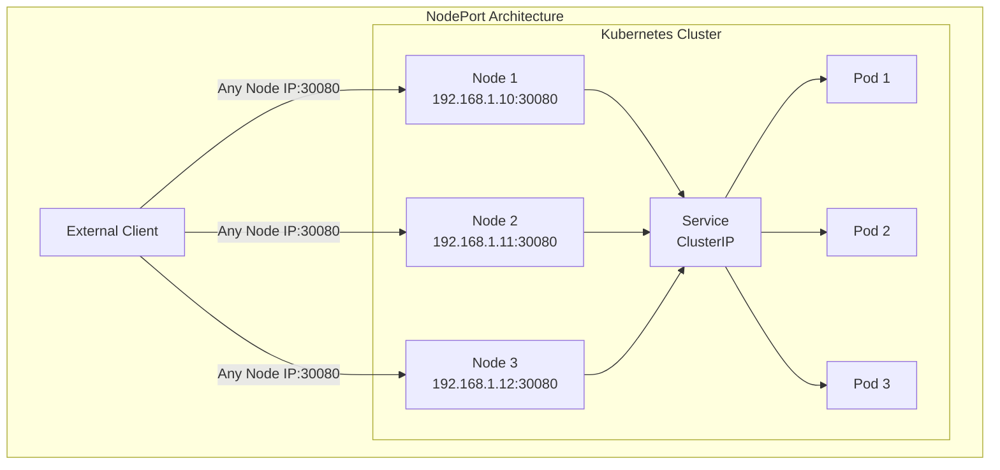
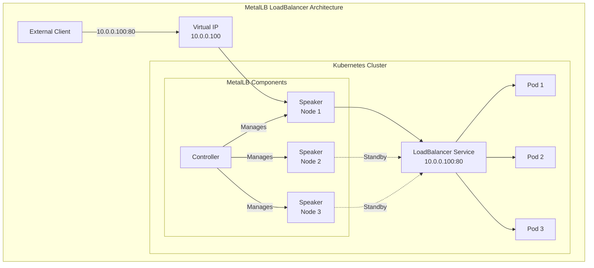
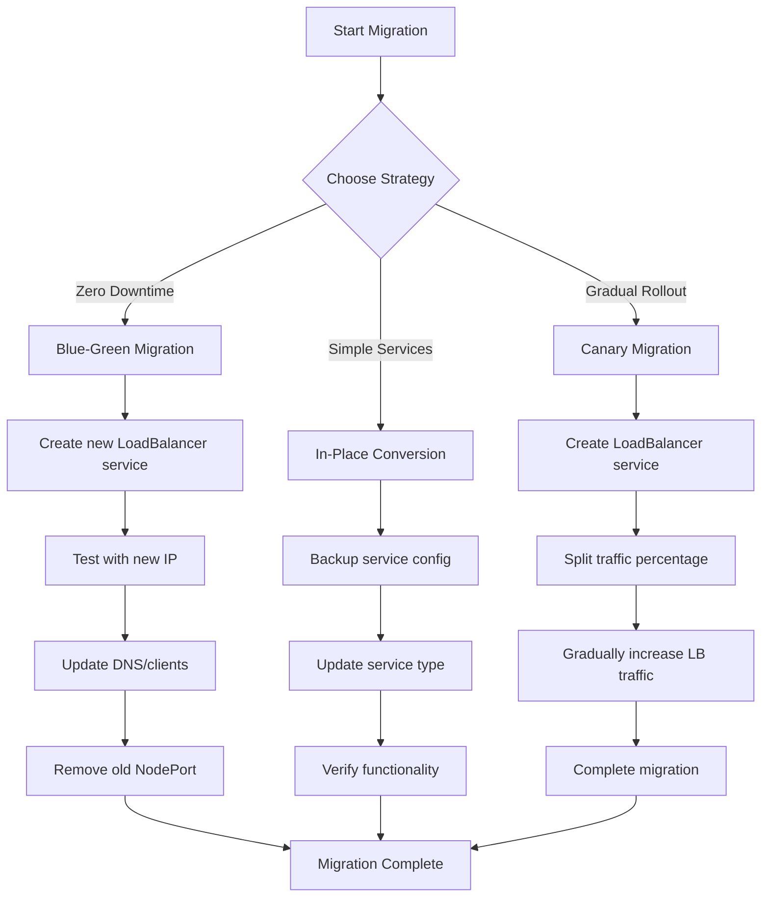
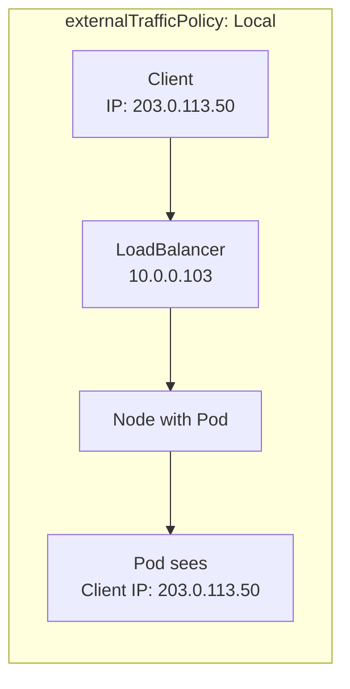
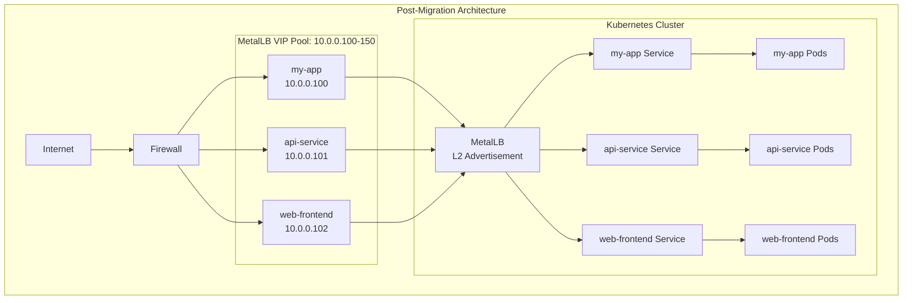

# How to Migrate from kube-proxy NodePort to MetalLB LoadBalancer

Author: [nawazdhandala](https://github.com/nawazdhandala)

Tags: MetalLB, Kubernetes, Migration, NodePort, Load Balancing, Networking, kube-proxy

Description: Learn how to migrate from kube-proxy NodePort to MetalLB LoadBalancer for proper load balancing on bare-metal Kubernetes.

---

## Introduction

When running Kubernetes on bare-metal infrastructure, exposing services to external traffic is a common challenge. Many organizations start with NodePort services because they are simple to set up and require no additional components. However, as applications grow in complexity and require proper load balancing, high availability, and professional-grade traffic management, migrating to MetalLB becomes essential.

This comprehensive guide walks you through the entire migration process from kube-proxy NodePort services to MetalLB LoadBalancer, ensuring zero downtime and a smooth transition for your production workloads.

## Understanding the Difference

Before diving into the migration, let's understand what we're moving from and to.

### NodePort Services

NodePort is the simplest way to expose a service externally in Kubernetes. When you create a NodePort service, Kubernetes allocates a port from a configured range (default: 30000-32767) on every node in the cluster. Traffic sent to any node on that port gets routed to the service.

The following diagram illustrates how NodePort routing works:



**Limitations of NodePort:**
- Requires clients to know node IP addresses
- No automatic failover if a node goes down
- Uses high port numbers (30000-32767)
- Manual load balancing configuration required
- Client IP preservation is difficult
- Not suitable for production-grade deployments

### MetalLB LoadBalancer

MetalLB provides a proper LoadBalancer implementation for bare-metal Kubernetes clusters. It assigns real IP addresses from a configured pool and announces them using either Layer 2 (ARP/NDP) or BGP protocols.

The following diagram shows the MetalLB architecture:



**Benefits of MetalLB:**
- Real IP addresses on standard ports (80, 443, etc.)
- Automatic failover between nodes
- Standard LoadBalancer service type
- Better client IP preservation options
- Production-ready load balancing
- Integration with existing network infrastructure

## Prerequisites

Before starting the migration, ensure you have the following:

- A running Kubernetes cluster (version 1.13 or later)
- kubectl configured with cluster admin access
- Existing NodePort services that need to be migrated
- A pool of IP addresses available for MetalLB
- Network access to install MetalLB components

Verify your cluster is ready by checking the Kubernetes version:

```bash
kubectl version --short
```

List all existing NodePort services:

```bash
kubectl get services --all-namespaces -o wide | grep NodePort
```

## Step 1: Audit Existing NodePort Services

First, create a comprehensive inventory of all NodePort services in your cluster.

The following script exports all NodePort services to a JSON file for analysis:

```bash
kubectl get services --all-namespaces -o json | \
  jq '.items[] | select(.spec.type=="NodePort") | {
    namespace: .metadata.namespace,
    name: .metadata.name,
    ports: .spec.ports,
    selector: .spec.selector
  }' > nodeport-services.json
```

Review the exported services:

```bash
cat nodeport-services.json | jq '.'
```

Create a migration tracking spreadsheet or document with the following information for each service:
- Service name and namespace
- Current NodePort number
- Target LoadBalancer IP (if specific IP needed)
- Dependencies and downstream clients
- Migration priority and schedule

## Step 2: Install MetalLB

Install MetalLB using the official manifests. This creates the metallb-system namespace and deploys the controller and speaker components.

Apply the MetalLB native manifests:

```bash
kubectl apply -f https://raw.githubusercontent.com/metallb/metallb/v0.14.5/config/manifests/metallb-native.yaml
```

Wait for all MetalLB pods to be ready:

```bash
kubectl wait --namespace metallb-system \
  --for=condition=ready pod \
  --selector=app=metallb \
  --timeout=120s
```

Verify the installation:

```bash
kubectl get pods -n metallb-system
```

Expected output shows the controller and speaker pods running:

```
NAME                          READY   STATUS    RESTARTS   AGE
controller-5f98465b6b-xxxxx   1/1     Running   0          60s
speaker-xxxxx                 1/1     Running   0          60s
speaker-yyyyy                 1/1     Running   0          60s
speaker-zzzzz                 1/1     Running   0          60s
```

## Step 3: Configure MetalLB IP Address Pool

Create an IP address pool that MetalLB will use to assign addresses to LoadBalancer services. Choose IP addresses that are:
- Not used by any other device on your network
- Routable from where your clients are located
- Within the same subnet as your nodes (for Layer 2 mode)

Create the IPAddressPool configuration:

```yaml
apiVersion: metallb.io/v1beta1
kind: IPAddressPool
metadata:
  name: production-pool
  namespace: metallb-system
spec:
  addresses:
  - 10.0.0.100-10.0.0.150
  autoAssign: true
---
apiVersion: metallb.io/v1beta1
kind: L2Advertisement
metadata:
  name: production-l2
  namespace: metallb-system
spec:
  ipAddressPools:
  - production-pool
```

Save the above configuration to a file called `metallb-config.yaml` and apply it:

```bash
kubectl apply -f metallb-config.yaml
```

Verify the configuration was created successfully:

```bash
kubectl get ipaddresspool -n metallb-system
kubectl get l2advertisement -n metallb-system
```

## Step 4: Plan the Migration Strategy

Choose a migration strategy based on your requirements. The following diagram shows the available migration approaches:



### Strategy 1: Blue-Green Migration (Recommended for Production)

This strategy creates a parallel LoadBalancer service, allows testing, and then switches traffic.

### Strategy 2: In-Place Conversion (Simple Services)

Directly modify the service type from NodePort to LoadBalancer.

### Strategy 3: Canary Migration (Gradual Rollout)

Run both services in parallel and gradually shift traffic.

## Step 5: Execute Blue-Green Migration

This section demonstrates the recommended blue-green migration approach for production services.

### 5.1 Document the Existing NodePort Service

First, export the current service configuration:

```bash
kubectl get service my-app -n production -o yaml > my-app-nodeport-backup.yaml
```

Example of a typical NodePort service:

```yaml
apiVersion: v1
kind: Service
metadata:
  name: my-app
  namespace: production
  labels:
    app: my-app
spec:
  type: NodePort
  selector:
    app: my-app
  ports:
  - name: http
    port: 80
    targetPort: 8080
    nodePort: 30080
  - name: https
    port: 443
    targetPort: 8443
    nodePort: 30443
```

### 5.2 Create the LoadBalancer Service

Create a new LoadBalancer service that targets the same pods. Note the service name includes "-lb" suffix to differentiate it during migration:

```yaml
apiVersion: v1
kind: Service
metadata:
  name: my-app-lb
  namespace: production
  labels:
    app: my-app
    migration: in-progress
  annotations:
    metallb.universe.tf/loadBalancerIPs: "10.0.0.100"
spec:
  type: LoadBalancer
  selector:
    app: my-app
  ports:
  - name: http
    port: 80
    targetPort: 8080
  - name: https
    port: 443
    targetPort: 8443
  externalTrafficPolicy: Local
```

Apply the new service:

```bash
kubectl apply -f my-app-lb.yaml
```

### 5.3 Verify the LoadBalancer Service

Check that MetalLB has assigned an IP address:

```bash
kubectl get service my-app-lb -n production
```

Expected output showing the external IP assigned:

```
NAME        TYPE           CLUSTER-IP      EXTERNAL-IP   PORT(S)                      AGE
my-app-lb   LoadBalancer   10.96.100.50    10.0.0.100    80:31234/TCP,443:31235/TCP   30s
```

Test connectivity to the new LoadBalancer IP:

```bash
curl -v http://10.0.0.100/health
```

### 5.4 Verify Both Services are Working

During migration, both services should be functional and routing to the same pods:

```bash
echo "Testing NodePort service..."
curl -s http://192.168.1.10:30080/health

echo "Testing LoadBalancer service..."
curl -s http://10.0.0.100/health
```

Create a comprehensive test script:

```bash
#!/bin/bash

NODEPORT_HOST="192.168.1.10"
NODEPORT_PORT="30080"
LB_IP="10.0.0.100"
LB_PORT="80"

echo "=== Migration Validation Test ==="

echo -e "\n1. Testing NodePort connectivity..."
NODEPORT_RESULT=$(curl -s -o /dev/null -w "%{http_code}" http://${NODEPORT_HOST}:${NODEPORT_PORT}/health)
echo "NodePort response: $NODEPORT_RESULT"

echo -e "\n2. Testing LoadBalancer connectivity..."
LB_RESULT=$(curl -s -o /dev/null -w "%{http_code}" http://${LB_IP}:${LB_PORT}/health)
echo "LoadBalancer response: $LB_RESULT"

echo -e "\n3. Comparing responses..."
NODEPORT_BODY=$(curl -s http://${NODEPORT_HOST}:${NODEPORT_PORT}/health)
LB_BODY=$(curl -s http://${LB_IP}:${LB_PORT}/health)

if [ "$NODEPORT_BODY" == "$LB_BODY" ]; then
    echo "PASS: Responses match"
else
    echo "WARN: Responses differ"
    echo "NodePort: $NODEPORT_BODY"
    echo "LoadBalancer: $LB_BODY"
fi

echo -e "\n4. Load testing LoadBalancer..."
for i in {1..10}; do
    RESPONSE=$(curl -s -o /dev/null -w "%{http_code}" http://${LB_IP}:${LB_PORT}/health)
    echo "Request $i: $RESPONSE"
done

echo -e "\n=== Validation Complete ==="
```

### 5.5 Update DNS and Client Configuration

Update DNS records or client configurations to point to the new LoadBalancer IP. The transition timeline depends on your DNS TTL settings.

Example DNS update using a common DNS provider API:

```bash
# Example for updating A record
# Replace with your DNS provider's API
curl -X PUT "https://api.dns-provider.com/zones/example.com/records/my-app" \
  -H "Authorization: Bearer $DNS_API_TOKEN" \
  -H "Content-Type: application/json" \
  -d '{
    "type": "A",
    "name": "my-app",
    "content": "10.0.0.100",
    "ttl": 300
  }'
```

### 5.6 Monitor Traffic Migration

Monitor traffic during the migration to ensure smooth transition:

```bash
# Watch for any errors on the LoadBalancer service
kubectl logs -n metallb-system -l app=metallb -f

# Monitor service endpoints
watch kubectl get endpoints my-app-lb -n production
```

### 5.7 Remove the Old NodePort Service

After confirming all traffic has migrated and the LoadBalancer service is stable (recommended waiting period: 24-48 hours), remove the old NodePort service:

```bash
kubectl delete service my-app -n production
```

Rename the LoadBalancer service to the original name (optional but recommended for consistency):

```bash
kubectl get service my-app-lb -n production -o yaml | \
  sed 's/name: my-app-lb/name: my-app/' | \
  kubectl apply -f -

kubectl delete service my-app-lb -n production
```

## Step 6: In-Place Migration for Simple Services

For non-critical services where brief connectivity interruption is acceptable, you can perform an in-place conversion.

### 6.1 Backup the Service

Create a backup of the current service configuration:

```bash
kubectl get service simple-app -n default -o yaml > simple-app-backup.yaml
```

### 6.2 Patch the Service Type

Use kubectl patch to change the service type directly:

```bash
kubectl patch service simple-app -n default \
  -p '{"spec":{"type":"LoadBalancer"}}'
```

If you want to specify a particular IP address, use:

```bash
kubectl patch service simple-app -n default \
  -p '{"spec":{"type":"LoadBalancer","loadBalancerIP":"10.0.0.101"}}'
```

Note: The newer annotation method is preferred for MetalLB-specific IP assignments:

```bash
kubectl annotate service simple-app -n default \
  metallb.universe.tf/loadBalancerIPs="10.0.0.101"
```

### 6.3 Remove the NodePort

After converting to LoadBalancer, the NodePort is automatically removed when no longer needed. However, Kubernetes may still allocate a NodePort. To verify:

```bash
kubectl get service simple-app -n default -o yaml | grep nodePort
```

## Step 7: Handling Special Cases

### 7.1 Services with Fixed NodePort Requirements

Some legacy applications may depend on specific NodePort numbers. You can preserve NodePort functionality while adding LoadBalancer:

The following configuration maintains backward compatibility by keeping the NodePort while adding LoadBalancer capability:

```yaml
apiVersion: v1
kind: Service
metadata:
  name: legacy-app
  namespace: production
  annotations:
    metallb.universe.tf/loadBalancerIPs: "10.0.0.102"
spec:
  type: LoadBalancer
  selector:
    app: legacy-app
  ports:
  - name: http
    port: 80
    targetPort: 8080
    nodePort: 30080
  externalTrafficPolicy: Cluster
```

### 7.2 Services Requiring Client IP Preservation

For applications that need to know the client's real IP address, configure `externalTrafficPolicy`:

```yaml
apiVersion: v1
kind: Service
metadata:
  name: client-aware-app
  namespace: production
  annotations:
    metallb.universe.tf/loadBalancerIPs: "10.0.0.103"
spec:
  type: LoadBalancer
  selector:
    app: client-aware-app
  ports:
  - name: http
    port: 80
    targetPort: 8080
  externalTrafficPolicy: Local
```

The `externalTrafficPolicy: Local` setting has the following implications:



- Traffic only goes to nodes running the target pods
- Client IP is preserved
- Potentially uneven load distribution
- Health checks required to avoid dead nodes

### 7.3 Multiple Services Sharing IP Address

MetalLB supports IP sharing for services that use different ports:

```yaml
apiVersion: v1
kind: Service
metadata:
  name: web-frontend
  namespace: production
  annotations:
    metallb.universe.tf/loadBalancerIPs: "10.0.0.104"
    metallb.universe.tf/allow-shared-ip: "shared-web"
spec:
  type: LoadBalancer
  selector:
    app: web-frontend
  ports:
  - name: http
    port: 80
    targetPort: 8080
---
apiVersion: v1
kind: Service
metadata:
  name: web-backend-api
  namespace: production
  annotations:
    metallb.universe.tf/loadBalancerIPs: "10.0.0.104"
    metallb.universe.tf/allow-shared-ip: "shared-web"
spec:
  type: LoadBalancer
  selector:
    app: web-backend
  ports:
  - name: api
    port: 8080
    targetPort: 8080
```

## Step 8: Batch Migration Script

For clusters with many NodePort services, use this automated migration script:

```bash
#!/bin/bash

# MetalLB Migration Script
# Migrates NodePort services to LoadBalancer type

set -e

NAMESPACE="${1:-default}"
IP_POOL_START="${2:-10.0.0.100}"
DRY_RUN="${3:-true}"

echo "=== MetalLB Migration Script ==="
echo "Namespace: $NAMESPACE"
echo "Starting IP: $IP_POOL_START"
echo "Dry Run: $DRY_RUN"
echo ""

# Function to increment IP address
increment_ip() {
    local ip=$1
    local IFS='.'
    read -r i1 i2 i3 i4 <<< "$ip"

    i4=$((i4 + 1))
    if [ $i4 -gt 255 ]; then
        i4=0
        i3=$((i3 + 1))
    fi

    echo "$i1.$i2.$i3.$i4"
}

# Get all NodePort services
SERVICES=$(kubectl get services -n "$NAMESPACE" -o json | \
    jq -r '.items[] | select(.spec.type=="NodePort") | .metadata.name')

if [ -z "$SERVICES" ]; then
    echo "No NodePort services found in namespace $NAMESPACE"
    exit 0
fi

CURRENT_IP=$IP_POOL_START

echo "Services to migrate:"
echo "$SERVICES"
echo ""

for SERVICE in $SERVICES; do
    echo "----------------------------------------"
    echo "Migrating: $SERVICE"
    echo "Assigned IP: $CURRENT_IP"

    if [ "$DRY_RUN" = "false" ]; then
        # Create backup
        kubectl get service "$SERVICE" -n "$NAMESPACE" -o yaml > "${SERVICE}-backup.yaml"
        echo "Backup created: ${SERVICE}-backup.yaml"

        # Add MetalLB annotation
        kubectl annotate service "$SERVICE" -n "$NAMESPACE" \
            metallb.universe.tf/loadBalancerIPs="$CURRENT_IP" \
            --overwrite

        # Patch service type
        kubectl patch service "$SERVICE" -n "$NAMESPACE" \
            -p '{"spec":{"type":"LoadBalancer"}}'

        echo "Service $SERVICE migrated successfully"
    else
        echo "[DRY RUN] Would migrate $SERVICE to IP $CURRENT_IP"
    fi

    CURRENT_IP=$(increment_ip "$CURRENT_IP")
done

echo ""
echo "=== Migration Summary ==="
if [ "$DRY_RUN" = "false" ]; then
    kubectl get services -n "$NAMESPACE" -l type=LoadBalancer
else
    echo "Dry run complete. Run with 'false' as third argument to execute."
fi
```

Save the script and make it executable:

```bash
chmod +x migrate-to-metallb.sh
```

Run a dry-run first:

```bash
./migrate-to-metallb.sh production 10.0.0.100 true
```

Execute the actual migration:

```bash
./migrate-to-metallb.sh production 10.0.0.100 false
```

## Step 9: Post-Migration Validation

After completing the migration, perform comprehensive validation.

### 9.1 Verify All Services

Check that all migrated services have external IPs:

```bash
kubectl get services --all-namespaces -o wide | grep LoadBalancer
```

### 9.2 Test Connectivity

Create a validation script:

```bash
#!/bin/bash

echo "=== Post-Migration Validation ==="

# Get all LoadBalancer services
SERVICES=$(kubectl get services --all-namespaces -o json | \
    jq -r '.items[] | select(.spec.type=="LoadBalancer") |
    "\(.metadata.namespace)/\(.metadata.name) \(.status.loadBalancer.ingress[0].ip)"')

echo "Testing LoadBalancer services..."
echo ""

while IFS= read -r line; do
    SERVICE=$(echo "$line" | awk '{print $1}')
    IP=$(echo "$line" | awk '{print $2}')

    if [ -n "$IP" ] && [ "$IP" != "null" ]; then
        # Get the first port
        NS=$(echo "$SERVICE" | cut -d'/' -f1)
        NAME=$(echo "$SERVICE" | cut -d'/' -f2)
        PORT=$(kubectl get service "$NAME" -n "$NS" -o jsonpath='{.spec.ports[0].port}')

        echo -n "Testing $SERVICE ($IP:$PORT)... "

        RESULT=$(curl -s -o /dev/null -w "%{http_code}" \
            --connect-timeout 5 "http://${IP}:${PORT}/" 2>/dev/null || echo "FAIL")

        if [ "$RESULT" = "FAIL" ]; then
            echo "CONNECTION FAILED"
        else
            echo "HTTP $RESULT"
        fi
    else
        echo "$SERVICE - No external IP assigned"
    fi
done <<< "$SERVICES"

echo ""
echo "=== Validation Complete ==="
```

### 9.3 Verify MetalLB Health

Check MetalLB speaker and controller logs for any issues:

```bash
# Check controller logs
kubectl logs -n metallb-system -l component=controller --tail=50

# Check speaker logs
kubectl logs -n metallb-system -l component=speaker --tail=50
```

### 9.4 Verify IP Address Assignments

List all IP addresses assigned by MetalLB:

```bash
kubectl get services --all-namespaces \
    -o jsonpath='{range .items[?(@.spec.type=="LoadBalancer")]}{.metadata.namespace}/{.metadata.name}: {.status.loadBalancer.ingress[0].ip}{"\n"}{end}'
```

## Step 10: Rollback Procedures

If issues arise during migration, follow these rollback procedures.

### 10.1 Rollback Single Service

Restore a service from backup:

```bash
kubectl apply -f my-app-nodeport-backup.yaml
```

Or manually revert:

```bash
# Remove MetalLB annotation
kubectl annotate service my-app -n production \
    metallb.universe.tf/loadBalancerIPs-

# Change type back to NodePort
kubectl patch service my-app -n production \
    -p '{"spec":{"type":"NodePort"}}'
```

### 10.2 Emergency Rollback Script

Complete rollback script for emergency situations:

```bash
#!/bin/bash

# Emergency Rollback Script

NAMESPACE="${1:-production}"
BACKUP_DIR="${2:-.}"

echo "=== Emergency Rollback ==="
echo "Namespace: $NAMESPACE"
echo "Backup Directory: $BACKUP_DIR"

# Find all backup files
BACKUPS=$(ls ${BACKUP_DIR}/*-backup.yaml 2>/dev/null)

if [ -z "$BACKUPS" ]; then
    echo "No backup files found in $BACKUP_DIR"
    exit 1
fi

echo "Found backups:"
echo "$BACKUPS"
echo ""

read -p "Proceed with rollback? (yes/no): " CONFIRM

if [ "$CONFIRM" = "yes" ]; then
    for BACKUP in $BACKUPS; do
        echo "Restoring from $BACKUP..."
        kubectl apply -f "$BACKUP"
    done

    echo ""
    echo "Rollback complete. Current services:"
    kubectl get services -n "$NAMESPACE"
else
    echo "Rollback cancelled"
fi
```

## Step 11: Update Monitoring and Alerting

After migration, update your monitoring configuration to track MetalLB-specific metrics.

### 11.1 Prometheus ServiceMonitor

Create a ServiceMonitor for MetalLB metrics:

```yaml
apiVersion: monitoring.coreos.com/v1
kind: ServiceMonitor
metadata:
  name: metallb
  namespace: monitoring
  labels:
    app: metallb
spec:
  namespaceSelector:
    matchNames:
    - metallb-system
  selector:
    matchLabels:
      app.kubernetes.io/name: metallb
  endpoints:
  - port: monitoring
    interval: 30s
```

### 11.2 Grafana Dashboard

Import the official MetalLB Grafana dashboard or create custom alerts:

```yaml
# Example Prometheus alerting rules
apiVersion: monitoring.coreos.com/v1
kind: PrometheusRule
metadata:
  name: metallb-alerts
  namespace: monitoring
spec:
  groups:
  - name: metallb
    rules:
    - alert: MetalLBSpeakerDown
      expr: up{job="metallb-speaker"} == 0
      for: 5m
      labels:
        severity: critical
      annotations:
        summary: "MetalLB Speaker is down"
        description: "MetalLB Speaker on {{ $labels.instance }} has been down for more than 5 minutes."

    - alert: MetalLBNoIPsAvailable
      expr: metallb_allocator_addresses_in_use_total >= metallb_allocator_addresses_total
      for: 1m
      labels:
        severity: warning
      annotations:
        summary: "MetalLB IP pool exhausted"
        description: "MetalLB has no available IPs in the address pool."
```

## Step 12: Documentation and Cleanup

### 12.1 Update Network Documentation

Document the new network architecture:



### 12.2 Clean Up Old Configurations

Remove old NodePort-related configurations:

```bash
# Remove backup files after successful migration (keep for at least 30 days)
rm -f *-nodeport-backup.yaml

# Remove any NodePort-specific firewall rules
# (This depends on your firewall configuration)

# Update any scripts that reference NodePort numbers
grep -r "30080\|30443\|3[0-9][0-9][0-9][0-9]" /path/to/scripts/
```

### 12.3 Update CI/CD Pipelines

Update deployment pipelines to use LoadBalancer service type:

```yaml
# Example Helm values update
service:
  type: LoadBalancer
  annotations:
    metallb.universe.tf/loadBalancerIPs: "${SERVICE_IP}"
  port: 80
  targetPort: 8080
```

## Troubleshooting Common Issues

### Issue: No External IP Assigned

Symptoms:
- Service shows `<pending>` for EXTERNAL-IP

Solutions:

Check MetalLB controller logs:

```bash
kubectl logs -n metallb-system -l component=controller
```

Verify IPAddressPool configuration:

```bash
kubectl get ipaddresspool -n metallb-system -o yaml
```

Ensure L2Advertisement is configured:

```bash
kubectl get l2advertisement -n metallb-system
```

### Issue: Intermittent Connectivity

Symptoms:
- Connections work sometimes but fail randomly

Solutions:

Check speaker logs for ARP issues:

```bash
kubectl logs -n metallb-system -l component=speaker | grep -i arp
```

Verify network connectivity between nodes:

```bash
# Run from each node
arping -I eth0 10.0.0.100
```

### Issue: Client IP Not Preserved

Symptoms:
- Application sees cluster IPs instead of client IPs

Solution:

Set externalTrafficPolicy to Local:

```bash
kubectl patch service my-app -n production \
    -p '{"spec":{"externalTrafficPolicy":"Local"}}'
```

### Issue: Service Unavailable After Node Failure

Symptoms:
- Service becomes unavailable when the active speaker node goes down

Solution:

This is expected behavior in L2 mode. The failover should occur within a few seconds. If it takes longer, check speaker health:

```bash
kubectl get pods -n metallb-system -o wide
```

For faster failover, consider using BGP mode with multiple upstream routers.

## Best Practices Summary

1. **Always test in staging first** - Never migrate production services without testing the process in a staging environment.

2. **Use blue-green migration for critical services** - The brief additional complexity is worth the zero-downtime guarantee.

3. **Keep backups for 30+ days** - Maintain service backups even after successful migration in case delayed issues emerge.

4. **Monitor MetalLB health** - Set up proper monitoring and alerting for MetalLB components.

5. **Document IP assignments** - Maintain a clear record of which IPs are assigned to which services.

6. **Plan IP address space** - Allocate sufficient IP addresses for current and future services.

7. **Consider externalTrafficPolicy** - Choose between `Cluster` (even distribution) and `Local` (client IP preservation) based on your requirements.

8. **Update all documentation** - Ensure network diagrams, runbooks, and operational procedures reflect the new architecture.

## Conclusion

Migrating from NodePort to MetalLB LoadBalancer is a significant improvement for bare-metal Kubernetes clusters. The process requires careful planning, but the benefits of proper load balancing, standard ports, and automatic failover make it worthwhile.

By following this guide, you can execute a safe, methodical migration that minimizes risk and ensures your services remain available throughout the transition. Remember to thoroughly test each step, maintain backups, and update your monitoring to catch any issues early.

MetalLB transforms your bare-metal cluster into a first-class citizen in the Kubernetes ecosystem, providing the same LoadBalancer capabilities that cloud providers offer natively. This investment in infrastructure pays dividends in operational simplicity and service reliability.

## Additional Resources

- [MetalLB Official Documentation](https://metallb.universe.tf/)
- [Kubernetes Service Types](https://kubernetes.io/docs/concepts/services-networking/service/)
- [MetalLB GitHub Repository](https://github.com/metallb/metallb)
- [Kubernetes Network Policies](https://kubernetes.io/docs/concepts/services-networking/network-policies/)
