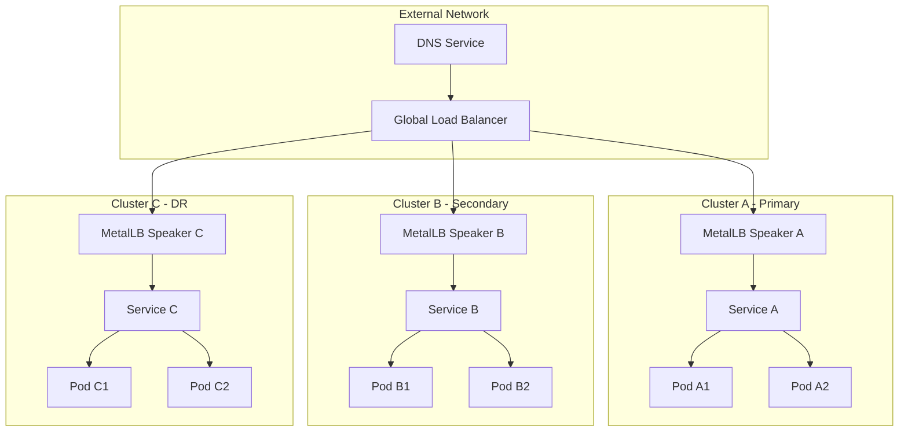
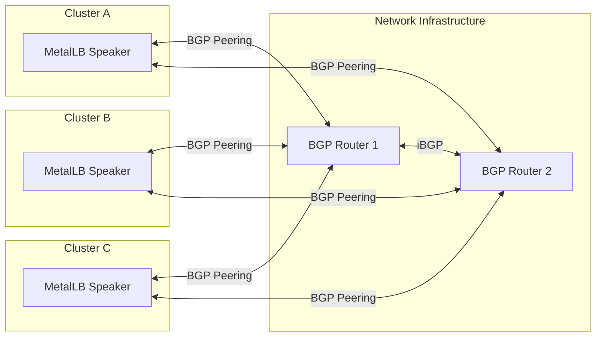
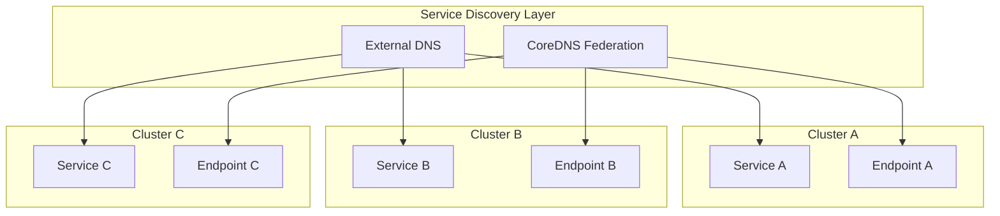
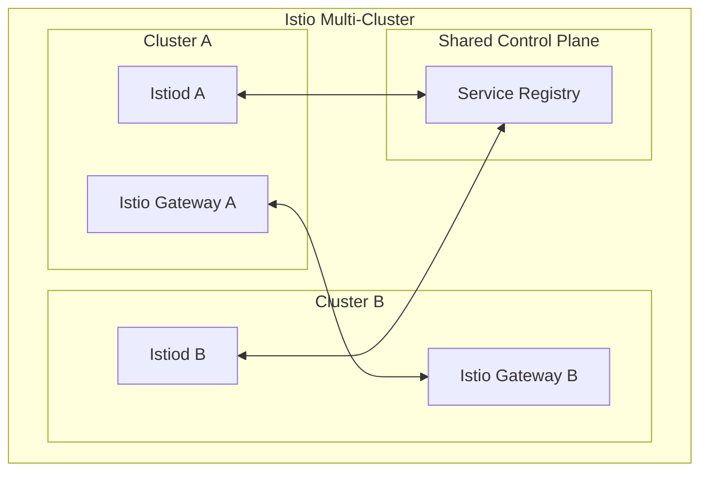

# How to Configure MetalLB for Multi-Cluster Load Balancing

Author: [nawazdhandala](https://github.com/nawazdhandala)

Tags: MetalLB, Kubernetes, Multi-Cluster, Load Balancing, High Availability, Networking, Failover

Description: Learn how to configure MetalLB for multi-cluster load balancing with cross-cluster service discovery and failover.

---

Multi-cluster Kubernetes deployments are becoming increasingly common for achieving high availability, disaster recovery, and geographic distribution. MetalLB, the popular bare-metal load balancer for Kubernetes, can be configured to work across multiple clusters to provide seamless service discovery and automatic failover. This comprehensive guide walks you through setting up MetalLB for multi-cluster load balancing.

## Understanding Multi-Cluster Load Balancing Architecture

Before diving into configuration, let's understand the architecture of multi-cluster load balancing with MetalLB.



## Prerequisites

Before starting, ensure you have:

- Multiple Kubernetes clusters (we'll use three in this guide)
- Network connectivity between clusters (VPN, VPC peering, or direct routing)
- kubectl configured with access to all clusters
- Helm 3.x installed
- Non-overlapping IP address ranges for each cluster

## Step 1: Install MetalLB on Each Cluster

Install MetalLB on each cluster using Helm. First, add the MetalLB Helm repository.

```bash
helm repo add metallb https://metallb.github.io/metallb
helm repo update
```

Install MetalLB on Cluster A (Primary). Replace the kubeconfig context with your actual context name.

```bash
kubectl config use-context cluster-a

helm install metallb metallb/metallb \
  --namespace metallb-system \
  --create-namespace \
  --set speaker.frr.enabled=true \
  --wait
```

Install MetalLB on Cluster B (Secondary).

```bash
kubectl config use-context cluster-b

helm install metallb metallb/metallb \
  --namespace metallb-system \
  --create-namespace \
  --set speaker.frr.enabled=true \
  --wait
```

Install MetalLB on Cluster C (DR/Disaster Recovery).

```bash
kubectl config use-context cluster-c

helm install metallb metallb/metallb \
  --namespace metallb-system \
  --create-namespace \
  --set speaker.frr.enabled=true \
  --wait
```

## Step 2: Configure IP Address Pools

Each cluster needs its own IP address pool. The pools should not overlap but should be routable between clusters.

Create the IP address pool configuration for Cluster A. This pool defines the range of external IPs that MetalLB can assign to LoadBalancer services.

```yaml
# cluster-a-ippool.yaml
apiVersion: metallb.io/v1beta1
kind: IPAddressPool
metadata:
  name: cluster-a-pool
  namespace: metallb-system
spec:
  addresses:
    - 192.168.100.1-192.168.100.50
  autoAssign: true
---
apiVersion: metallb.io/v1beta1
kind: L2Advertisement
metadata:
  name: cluster-a-l2
  namespace: metallb-system
spec:
  ipAddressPools:
    - cluster-a-pool
  interfaces:
    - eth0
```

Create the IP address pool configuration for Cluster B.

```yaml
# cluster-b-ippool.yaml
apiVersion: metallb.io/v1beta1
kind: IPAddressPool
metadata:
  name: cluster-b-pool
  namespace: metallb-system
spec:
  addresses:
    - 192.168.100.51-192.168.100.100
  autoAssign: true
---
apiVersion: metallb.io/v1beta1
kind: L2Advertisement
metadata:
  name: cluster-b-l2
  namespace: metallb-system
spec:
  ipAddressPools:
    - cluster-b-pool
  interfaces:
    - eth0
```

Create the IP address pool configuration for Cluster C.

```yaml
# cluster-c-ippool.yaml
apiVersion: metallb.io/v1beta1
kind: IPAddressPool
metadata:
  name: cluster-c-pool
  namespace: metallb-system
spec:
  addresses:
    - 192.168.100.101-192.168.100.150
  autoAssign: true
---
apiVersion: metallb.io/v1beta1
kind: L2Advertisement
metadata:
  name: cluster-c-l2
  namespace: metallb-system
spec:
  ipAddressPools:
    - cluster-c-pool
  interfaces:
    - eth0
```

Apply the configurations to each cluster.

```bash
kubectl config use-context cluster-a
kubectl apply -f cluster-a-ippool.yaml

kubectl config use-context cluster-b
kubectl apply -f cluster-b-ippool.yaml

kubectl config use-context cluster-c
kubectl apply -f cluster-c-ippool.yaml
```

## Step 3: Configure BGP for Cross-Cluster Routing

For production environments, BGP is the preferred method for cross-cluster routing. This enables dynamic route advertisement and automatic failover.



Create the BGP configuration for Cluster A. This establishes BGP peering with your network routers and configures route advertisement.

```yaml
# cluster-a-bgp.yaml
apiVersion: metallb.io/v1beta2
kind: BGPPeer
metadata:
  name: router-1
  namespace: metallb-system
spec:
  myASN: 64500
  peerASN: 64501
  peerAddress: 10.0.0.1
  password: "secure-bgp-password"
  holdTime: 90s
  keepaliveTime: 30s
  bfdProfile: production
---
apiVersion: metallb.io/v1beta2
kind: BGPPeer
metadata:
  name: router-2
  namespace: metallb-system
spec:
  myASN: 64500
  peerASN: 64501
  peerAddress: 10.0.0.2
  password: "secure-bgp-password"
  holdTime: 90s
  keepaliveTime: 30s
  bfdProfile: production
---
apiVersion: metallb.io/v1beta1
kind: BGPAdvertisement
metadata:
  name: cluster-a-advertisement
  namespace: metallb-system
spec:
  ipAddressPools:
    - cluster-a-pool
  aggregationLength: 32
  localPref: 100
  communities:
    - 64500:100
---
apiVersion: metallb.io/v1beta1
kind: BFDProfile
metadata:
  name: production
  namespace: metallb-system
spec:
  receiveInterval: 300
  transmitInterval: 300
  detectMultiplier: 3
  echoInterval: 50
  echoMode: true
  passiveMode: false
  minimumTtl: 254
```

Create similar BGP configurations for Clusters B and C. Note the different ASN and community values for proper traffic routing.

```yaml
# cluster-b-bgp.yaml
apiVersion: metallb.io/v1beta2
kind: BGPPeer
metadata:
  name: router-1
  namespace: metallb-system
spec:
  myASN: 64502
  peerASN: 64501
  peerAddress: 10.0.0.1
  password: "secure-bgp-password"
  holdTime: 90s
  keepaliveTime: 30s
  bfdProfile: production
---
apiVersion: metallb.io/v1beta2
kind: BGPPeer
metadata:
  name: router-2
  namespace: metallb-system
spec:
  myASN: 64502
  peerASN: 64501
  peerAddress: 10.0.0.2
  password: "secure-bgp-password"
  holdTime: 90s
  keepaliveTime: 30s
  bfdProfile: production
---
apiVersion: metallb.io/v1beta1
kind: BGPAdvertisement
metadata:
  name: cluster-b-advertisement
  namespace: metallb-system
spec:
  ipAddressPools:
    - cluster-b-pool
  aggregationLength: 32
  localPref: 90
  communities:
    - 64502:100
---
apiVersion: metallb.io/v1beta1
kind: BFDProfile
metadata:
  name: production
  namespace: metallb-system
spec:
  receiveInterval: 300
  transmitInterval: 300
  detectMultiplier: 3
  echoInterval: 50
  echoMode: true
  passiveMode: false
  minimumTtl: 254
```

```yaml
# cluster-c-bgp.yaml
apiVersion: metallb.io/v1beta2
kind: BGPPeer
metadata:
  name: router-1
  namespace: metallb-system
spec:
  myASN: 64503
  peerASN: 64501
  peerAddress: 10.0.0.1
  password: "secure-bgp-password"
  holdTime: 90s
  keepaliveTime: 30s
  bfdProfile: production
---
apiVersion: metallb.io/v1beta2
kind: BGPPeer
metadata:
  name: router-2
  namespace: metallb-system
spec:
  myASN: 64503
  peerASN: 64501
  peerAddress: 10.0.0.2
  password: "secure-bgp-password"
  holdTime: 90s
  keepaliveTime: 30s
  bfdProfile: production
---
apiVersion: metallb.io/v1beta1
kind: BGPAdvertisement
metadata:
  name: cluster-c-advertisement
  namespace: metallb-system
spec:
  ipAddressPools:
    - cluster-c-pool
  aggregationLength: 32
  localPref: 80
  communities:
    - 64503:100
---
apiVersion: metallb.io/v1beta1
kind: BFDProfile
metadata:
  name: production
  namespace: metallb-system
spec:
  receiveInterval: 300
  transmitInterval: 300
  detectMultiplier: 3
  echoInterval: 50
  echoMode: true
  passiveMode: false
  minimumTtl: 254
```

Apply the BGP configurations to each cluster.

```bash
kubectl config use-context cluster-a
kubectl apply -f cluster-a-bgp.yaml

kubectl config use-context cluster-b
kubectl apply -f cluster-b-bgp.yaml

kubectl config use-context cluster-c
kubectl apply -f cluster-c-bgp.yaml
```

## Step 4: Implement Cross-Cluster Service Discovery

For cross-cluster service discovery, we'll use a combination of external DNS and service mesh. This architecture allows services in one cluster to discover and communicate with services in other clusters.



Deploy External DNS on each cluster. External DNS automatically creates DNS records for LoadBalancer services.

```yaml
# external-dns.yaml
apiVersion: v1
kind: ServiceAccount
metadata:
  name: external-dns
  namespace: kube-system
---
apiVersion: rbac.authorization.k8s.io/v1
kind: ClusterRole
metadata:
  name: external-dns
rules:
  - apiGroups: [""]
    resources: ["services", "endpoints", "pods"]
    verbs: ["get", "watch", "list"]
  - apiGroups: ["extensions", "networking.k8s.io"]
    resources: ["ingresses"]
    verbs: ["get", "watch", "list"]
  - apiGroups: [""]
    resources: ["nodes"]
    verbs: ["list", "watch"]
---
apiVersion: rbac.authorization.k8s.io/v1
kind: ClusterRoleBinding
metadata:
  name: external-dns-viewer
roleRef:
  apiGroup: rbac.authorization.k8s.io
  kind: ClusterRole
  name: external-dns
subjects:
  - kind: ServiceAccount
    name: external-dns
    namespace: kube-system
---
apiVersion: apps/v1
kind: Deployment
metadata:
  name: external-dns
  namespace: kube-system
spec:
  replicas: 1
  selector:
    matchLabels:
      app: external-dns
  template:
    metadata:
      labels:
        app: external-dns
    spec:
      serviceAccountName: external-dns
      containers:
        - name: external-dns
          image: registry.k8s.io/external-dns/external-dns:v0.14.0
          args:
            - --source=service
            - --source=ingress
            - --provider=aws
            - --policy=sync
            - --aws-zone-type=public
            - --registry=txt
            - --txt-owner-id=my-identifier
            - --domain-filter=example.com
          env:
            - name: AWS_DEFAULT_REGION
              value: us-east-1
```

## Step 5: Configure Global Load Balancing with Failover

Create a global load balancer configuration that routes traffic across clusters with automatic failover. This example uses NGINX as a global load balancer.

```yaml
# global-lb-configmap.yaml
apiVersion: v1
kind: ConfigMap
metadata:
  name: nginx-global-lb
  namespace: global-lb
data:
  nginx.conf: |
    worker_processes auto;
    error_log /var/log/nginx/error.log warn;
    pid /var/run/nginx.pid;

    events {
        worker_connections 4096;
        use epoll;
        multi_accept on;
    }

    stream {
        # Define upstream clusters with health checks
        upstream multi_cluster_backend {
            zone backend 64k;

            # Cluster A - Primary (highest priority)
            server 192.168.100.10:80 weight=100 max_fails=3 fail_timeout=30s;

            # Cluster B - Secondary
            server 192.168.100.60:80 weight=50 max_fails=3 fail_timeout=30s backup;

            # Cluster C - DR
            server 192.168.100.110:80 weight=25 max_fails=3 fail_timeout=30s backup;
        }

        server {
            listen 80;
            proxy_pass multi_cluster_backend;
            proxy_timeout 10s;
            proxy_connect_timeout 5s;

            # Enable health checks
            health_check interval=5s passes=2 fails=3;
        }
    }

    http {
        include /etc/nginx/mime.types;
        default_type application/octet-stream;

        # Health check endpoint
        server {
            listen 8080;
            location /health {
                return 200 'OK';
                add_header Content-Type text/plain;
            }
        }
    }
```

Deploy the global load balancer.

```yaml
# global-lb-deployment.yaml
apiVersion: v1
kind: Namespace
metadata:
  name: global-lb
---
apiVersion: apps/v1
kind: Deployment
metadata:
  name: global-lb
  namespace: global-lb
spec:
  replicas: 3
  selector:
    matchLabels:
      app: global-lb
  template:
    metadata:
      labels:
        app: global-lb
    spec:
      affinity:
        podAntiAffinity:
          requiredDuringSchedulingIgnoredDuringExecution:
            - labelSelector:
                matchExpressions:
                  - key: app
                    operator: In
                    values:
                      - global-lb
              topologyKey: kubernetes.io/hostname
      containers:
        - name: nginx
          image: nginx:1.25-alpine
          ports:
            - containerPort: 80
              name: http
            - containerPort: 8080
              name: health
          volumeMounts:
            - name: config
              mountPath: /etc/nginx/nginx.conf
              subPath: nginx.conf
          livenessProbe:
            httpGet:
              path: /health
              port: 8080
            initialDelaySeconds: 10
            periodSeconds: 5
          readinessProbe:
            httpGet:
              path: /health
              port: 8080
            initialDelaySeconds: 5
            periodSeconds: 3
          resources:
            requests:
              cpu: 100m
              memory: 128Mi
            limits:
              cpu: 500m
              memory: 256Mi
      volumes:
        - name: config
          configMap:
            name: nginx-global-lb
---
apiVersion: v1
kind: Service
metadata:
  name: global-lb
  namespace: global-lb
  annotations:
    metallb.universe.tf/loadBalancerIPs: 192.168.100.200
spec:
  type: LoadBalancer
  selector:
    app: global-lb
  ports:
    - port: 80
      targetPort: 80
      protocol: TCP
```

## Step 6: Deploy Sample Application Across Clusters

Deploy a sample application to test the multi-cluster setup. This deployment creates identical services in each cluster.

```yaml
# sample-app.yaml
apiVersion: apps/v1
kind: Deployment
metadata:
  name: demo-app
  namespace: default
spec:
  replicas: 3
  selector:
    matchLabels:
      app: demo-app
  template:
    metadata:
      labels:
        app: demo-app
    spec:
      containers:
        - name: demo-app
          image: hashicorp/http-echo:0.2.3
          args:
            - "-text=Hello from $(CLUSTER_NAME)"
          env:
            - name: CLUSTER_NAME
              valueFrom:
                fieldRef:
                  fieldPath: metadata.labels['topology.kubernetes.io/zone']
          ports:
            - containerPort: 5678
          resources:
            requests:
              cpu: 50m
              memory: 64Mi
            limits:
              cpu: 100m
              memory: 128Mi
          readinessProbe:
            httpGet:
              path: /
              port: 5678
            initialDelaySeconds: 5
            periodSeconds: 3
          livenessProbe:
            httpGet:
              path: /
              port: 5678
            initialDelaySeconds: 10
            periodSeconds: 10
---
apiVersion: v1
kind: Service
metadata:
  name: demo-app
  namespace: default
  annotations:
    external-dns.alpha.kubernetes.io/hostname: demo.example.com
    metallb.universe.tf/address-pool: cluster-a-pool
spec:
  type: LoadBalancer
  selector:
    app: demo-app
  ports:
    - port: 80
      targetPort: 5678
      protocol: TCP
```

Deploy to all clusters with appropriate pool annotations.

```bash
kubectl config use-context cluster-a
kubectl apply -f sample-app.yaml

kubectl config use-context cluster-b
sed 's/cluster-a-pool/cluster-b-pool/g' sample-app.yaml | kubectl apply -f -

kubectl config use-context cluster-c
sed 's/cluster-a-pool/cluster-c-pool/g' sample-app.yaml | kubectl apply -f -
```

## Step 7: Implement Health-Based Failover

Configure health checks that trigger automatic failover when a cluster becomes unhealthy.

```yaml
# health-check-controller.yaml
apiVersion: v1
kind: ConfigMap
metadata:
  name: health-check-script
  namespace: global-lb
data:
  health-check.sh: |
    #!/bin/bash

    CLUSTERS=("192.168.100.10" "192.168.100.60" "192.168.100.110")
    CLUSTER_NAMES=("cluster-a" "cluster-b" "cluster-c")
    HEALTH_ENDPOINT="/health"
    TIMEOUT=5

    check_cluster_health() {
        local ip=$1
        local name=$2

        response=$(curl -s -o /dev/null -w "%{http_code}" \
            --connect-timeout $TIMEOUT \
            "http://${ip}${HEALTH_ENDPOINT}")

        if [ "$response" = "200" ]; then
            echo "HEALTHY: $name ($ip)"
            return 0
        else
            echo "UNHEALTHY: $name ($ip) - Response: $response"
            return 1
        fi
    }

    update_dns_weight() {
        local name=$1
        local healthy=$2

        if [ "$healthy" = "true" ]; then
            # Restore normal weight
            echo "Restoring DNS weight for $name"
        else
            # Set weight to 0 for unhealthy cluster
            echo "Setting DNS weight to 0 for $name"
        fi
    }

    while true; do
        echo "=== Health Check $(date) ==="

        for i in "${!CLUSTERS[@]}"; do
            if check_cluster_health "${CLUSTERS[$i]}" "${CLUSTER_NAMES[$i]}"; then
                update_dns_weight "${CLUSTER_NAMES[$i]}" "true"
            else
                update_dns_weight "${CLUSTER_NAMES[$i]}" "false"
            fi
        done

        sleep 10
    done
---
apiVersion: apps/v1
kind: Deployment
metadata:
  name: health-check-controller
  namespace: global-lb
spec:
  replicas: 1
  selector:
    matchLabels:
      app: health-check-controller
  template:
    metadata:
      labels:
        app: health-check-controller
    spec:
      containers:
        - name: health-check
          image: curlimages/curl:8.5.0
          command: ["/bin/sh", "-c"]
          args:
            - |
              chmod +x /scripts/health-check.sh
              /scripts/health-check.sh
          volumeMounts:
            - name: scripts
              mountPath: /scripts
          resources:
            requests:
              cpu: 50m
              memory: 64Mi
            limits:
              cpu: 100m
              memory: 128Mi
      volumes:
        - name: scripts
          configMap:
            name: health-check-script
            defaultMode: 0755
```

## Step 8: Configure Cross-Cluster Service Mesh (Optional)

For advanced service discovery and traffic management, integrate with a service mesh like Istio or Linkerd.



Create Istio multi-cluster configuration. This enables cross-cluster service discovery through Istio's service mesh.

```yaml
# istio-multi-cluster.yaml
apiVersion: install.istio.io/v1alpha1
kind: IstioOperator
metadata:
  name: istio-multicluster
  namespace: istio-system
spec:
  profile: default
  meshConfig:
    accessLogFile: /dev/stdout
    enableTracing: true
    defaultConfig:
      proxyMetadata:
        ISTIO_META_DNS_CAPTURE: "true"
        ISTIO_META_DNS_AUTO_ALLOCATE: "true"
  values:
    global:
      meshID: mesh1
      multiCluster:
        clusterName: cluster-a
      network: network1
    pilot:
      env:
        PILOT_ENABLE_CROSS_CLUSTER_WORKLOAD_ENTRY: "true"
  components:
    ingressGateways:
      - name: istio-eastwestgateway
        label:
          istio: eastwestgateway
          app: istio-eastwestgateway
        enabled: true
        k8s:
          env:
            - name: ISTIO_META_ROUTER_MODE
              value: sni-dnat
            - name: ISTIO_META_REQUESTED_NETWORK_VIEW
              value: network1
          service:
            ports:
              - name: status-port
                port: 15021
                targetPort: 15021
              - name: tls
                port: 15443
                targetPort: 15443
              - name: tls-istiod
                port: 15012
                targetPort: 15012
              - name: tls-webhook
                port: 15017
                targetPort: 15017
```

## Step 9: Implement Traffic Policies

Create traffic policies for weighted routing and failover between clusters.

```yaml
# traffic-policy.yaml
apiVersion: networking.istio.io/v1beta1
kind: DestinationRule
metadata:
  name: demo-app-global
  namespace: default
spec:
  host: demo-app.default.svc.cluster.local
  trafficPolicy:
    connectionPool:
      tcp:
        maxConnections: 1000
      http:
        h2UpgradePolicy: UPGRADE
        http1MaxPendingRequests: 1000
        http2MaxRequests: 1000
    loadBalancer:
      simple: ROUND_ROBIN
      localityLbSetting:
        enabled: true
        failover:
          - from: us-east-1
            to: us-west-2
          - from: us-west-2
            to: eu-west-1
    outlierDetection:
      consecutive5xxErrors: 5
      interval: 10s
      baseEjectionTime: 30s
      maxEjectionPercent: 50
      minHealthPercent: 30
---
apiVersion: networking.istio.io/v1beta1
kind: VirtualService
metadata:
  name: demo-app-routing
  namespace: default
spec:
  hosts:
    - demo-app.default.svc.cluster.local
    - demo.example.com
  http:
    - match:
        - headers:
            x-cluster-override:
              exact: cluster-b
      route:
        - destination:
            host: demo-app.default.svc.cluster.local
            subset: cluster-b
    - route:
        - destination:
            host: demo-app.default.svc.cluster.local
            subset: cluster-a
          weight: 70
        - destination:
            host: demo-app.default.svc.cluster.local
            subset: cluster-b
          weight: 20
        - destination:
            host: demo-app.default.svc.cluster.local
            subset: cluster-c
          weight: 10
---
apiVersion: networking.istio.io/v1beta1
kind: DestinationRule
metadata:
  name: demo-app-subsets
  namespace: default
spec:
  host: demo-app.default.svc.cluster.local
  subsets:
    - name: cluster-a
      labels:
        topology.kubernetes.io/zone: us-east-1
    - name: cluster-b
      labels:
        topology.kubernetes.io/zone: us-west-2
    - name: cluster-c
      labels:
        topology.kubernetes.io/zone: eu-west-1
```

## Step 10: Monitoring and Observability

Set up monitoring for multi-cluster MetalLB deployments. Deploy Prometheus with federation to aggregate metrics from all clusters.

```yaml
# prometheus-federation.yaml
apiVersion: v1
kind: ConfigMap
metadata:
  name: prometheus-config
  namespace: monitoring
data:
  prometheus.yml: |
    global:
      scrape_interval: 15s
      evaluation_interval: 15s

    scrape_configs:
      # Scrape local MetalLB metrics
      - job_name: 'metallb'
        kubernetes_sd_configs:
          - role: pod
            namespaces:
              names:
                - metallb-system
        relabel_configs:
          - source_labels: [__meta_kubernetes_pod_annotation_prometheus_io_scrape]
            action: keep
            regex: true
          - source_labels: [__meta_kubernetes_pod_annotation_prometheus_io_port]
            action: replace
            target_label: __address__
            regex: (.+)
            replacement: ${1}:7472

      # Federation from other cluster Prometheus instances
      - job_name: 'federation-cluster-b'
        honor_labels: true
        metrics_path: '/federate'
        params:
          'match[]':
            - '{job="metallb"}'
            - '{__name__=~"metallb.*"}'
        static_configs:
          - targets:
              - 'prometheus-cluster-b.monitoring.svc:9090'
        relabel_configs:
          - target_label: cluster
            replacement: cluster-b

      - job_name: 'federation-cluster-c'
        honor_labels: true
        metrics_path: '/federate'
        params:
          'match[]':
            - '{job="metallb"}'
            - '{__name__=~"metallb.*"}'
        static_configs:
          - targets:
              - 'prometheus-cluster-c.monitoring.svc:9090'
        relabel_configs:
          - target_label: cluster
            replacement: cluster-c

    alerting:
      alertmanagers:
        - static_configs:
            - targets:
                - alertmanager:9093

    rule_files:
      - /etc/prometheus/rules/*.yml
---
apiVersion: v1
kind: ConfigMap
metadata:
  name: prometheus-rules
  namespace: monitoring
data:
  metallb-alerts.yml: |
    groups:
      - name: metallb-multi-cluster
        rules:
          - alert: MetalLBClusterDown
            expr: up{job="metallb"} == 0
            for: 2m
            labels:
              severity: critical
            annotations:
              summary: "MetalLB is down on cluster {{ $labels.cluster }}"
              description: "MetalLB speaker has been down for more than 2 minutes."

          - alert: MetalLBNoActiveEndpoints
            expr: metallb_bgp_session_up == 0
            for: 5m
            labels:
              severity: warning
            annotations:
              summary: "No active BGP sessions on {{ $labels.cluster }}"
              description: "MetalLB has no active BGP sessions for 5 minutes."

          - alert: MetalLBIPPoolExhausted
            expr: metallb_allocator_addresses_in_use_total / metallb_allocator_addresses_total > 0.9
            for: 10m
            labels:
              severity: warning
            annotations:
              summary: "IP pool nearly exhausted on {{ $labels.cluster }}"
              description: "MetalLB IP pool usage is above 90%."
```

Create a Grafana dashboard for multi-cluster MetalLB monitoring.

```yaml
# grafana-dashboard.yaml
apiVersion: v1
kind: ConfigMap
metadata:
  name: metallb-multicluster-dashboard
  namespace: monitoring
  labels:
    grafana_dashboard: "1"
data:
  metallb-multicluster.json: |
    {
      "dashboard": {
        "title": "MetalLB Multi-Cluster Overview",
        "uid": "metallb-multicluster",
        "panels": [
          {
            "title": "Active Clusters",
            "type": "stat",
            "gridPos": {"x": 0, "y": 0, "w": 6, "h": 4},
            "targets": [
              {
                "expr": "count(up{job='metallb'} == 1)",
                "legendFormat": "Active Clusters"
              }
            ]
          },
          {
            "title": "Total IPs Allocated",
            "type": "stat",
            "gridPos": {"x": 6, "y": 0, "w": 6, "h": 4},
            "targets": [
              {
                "expr": "sum(metallb_allocator_addresses_in_use_total)",
                "legendFormat": "IPs in Use"
              }
            ]
          },
          {
            "title": "BGP Sessions by Cluster",
            "type": "graph",
            "gridPos": {"x": 0, "y": 4, "w": 12, "h": 8},
            "targets": [
              {
                "expr": "metallb_bgp_session_up",
                "legendFormat": "{{ cluster }} - {{ peer }}"
              }
            ]
          },
          {
            "title": "IP Pool Usage by Cluster",
            "type": "gauge",
            "gridPos": {"x": 0, "y": 12, "w": 12, "h": 6},
            "targets": [
              {
                "expr": "metallb_allocator_addresses_in_use_total / metallb_allocator_addresses_total * 100",
                "legendFormat": "{{ cluster }}"
              }
            ]
          }
        ]
      }
    }
```

## Step 11: Testing Failover

Test the failover mechanism by simulating cluster failures.

This script tests automatic failover when a cluster becomes unavailable. It monitors the response to verify traffic is rerouted.

```bash
#!/bin/bash

echo "=== Multi-Cluster Failover Test ==="

GLOBAL_LB_IP="192.168.100.200"
TEST_DURATION=60
INTERVAL=2

echo "Starting baseline test..."
for i in $(seq 1 10); do
    response=$(curl -s "http://${GLOBAL_LB_IP}/")
    echo "Response $i: $response"
    sleep $INTERVAL
done

echo ""
echo "Simulating Cluster A failure..."
kubectl config use-context cluster-a
kubectl scale deployment demo-app --replicas=0

echo "Monitoring failover..."
start_time=$(date +%s)
while [ $(($(date +%s) - start_time)) -lt $TEST_DURATION ]; do
    response=$(curl -s "http://${GLOBAL_LB_IP}/")
    timestamp=$(date '+%Y-%m-%d %H:%M:%S')
    echo "[$timestamp] Response: $response"
    sleep $INTERVAL
done

echo ""
echo "Restoring Cluster A..."
kubectl scale deployment demo-app --replicas=3

echo ""
echo "Final verification..."
sleep 30
for i in $(seq 1 10); do
    response=$(curl -s "http://${GLOBAL_LB_IP}/")
    echo "Response $i: $response"
    sleep $INTERVAL
done

echo "=== Failover Test Complete ==="
```

## Troubleshooting Common Issues

### BGP Session Not Establishing

Check BGP peer status and logs to diagnose connectivity issues.

```bash
kubectl logs -n metallb-system -l component=speaker -c frr --tail=100

kubectl exec -n metallb-system -it $(kubectl get pods -n metallb-system -l component=speaker -o jsonpath='{.items[0].metadata.name}') -c frr -- vtysh -c "show bgp summary"
```

### IP Address Not Announced

Verify IP pool configuration and allocation status.

```bash
kubectl get ipaddresspools -n metallb-system -o yaml

kubectl get services -A -o jsonpath='{range .items[?(@.spec.type=="LoadBalancer")]}{.metadata.namespace}/{.metadata.name}: {.status.loadBalancer.ingress[0].ip}{"\n"}{end}'
```

### Cross-Cluster Connectivity Issues

Test network connectivity between clusters.

```bash
kubectl run nettest --image=nicolaka/netshoot --rm -it --restart=Never -- /bin/bash -c "
ping -c 3 192.168.100.60
traceroute 192.168.100.60
nc -zv 192.168.100.60 80
"
```

## Best Practices

1. **Use Non-Overlapping IP Ranges**: Ensure each cluster has unique IP address pools to prevent conflicts.

2. **Implement Health Checks**: Always configure health checks for automatic failover detection.

3. **Monitor BGP Sessions**: Set up alerts for BGP session flaps or failures.

4. **Use BFD for Fast Failover**: Bidirectional Forwarding Detection (BFD) reduces failover time from seconds to milliseconds.

5. **Test Failover Regularly**: Conduct regular failover tests to ensure the system works as expected.

6. **Document IP Allocations**: Maintain documentation of IP ranges assigned to each cluster.

7. **Secure BGP Sessions**: Use MD5 authentication and filter BGP announcements.

8. **Plan for Capacity**: Ensure each cluster can handle the full load during failover scenarios.

## Conclusion

Configuring MetalLB for multi-cluster load balancing provides a robust foundation for high-availability Kubernetes deployments. By implementing BGP-based routing, health checks, and cross-cluster service discovery, you can achieve seamless failover and geographic distribution of your workloads.

The key components of a successful multi-cluster MetalLB setup include:

- Properly configured IP address pools with non-overlapping ranges
- BGP peering with BFD for fast failover
- External DNS for cross-cluster service discovery
- Comprehensive monitoring and alerting
- Regular failover testing

With these configurations in place, your Kubernetes infrastructure can handle cluster failures gracefully while maintaining service availability for your users.
