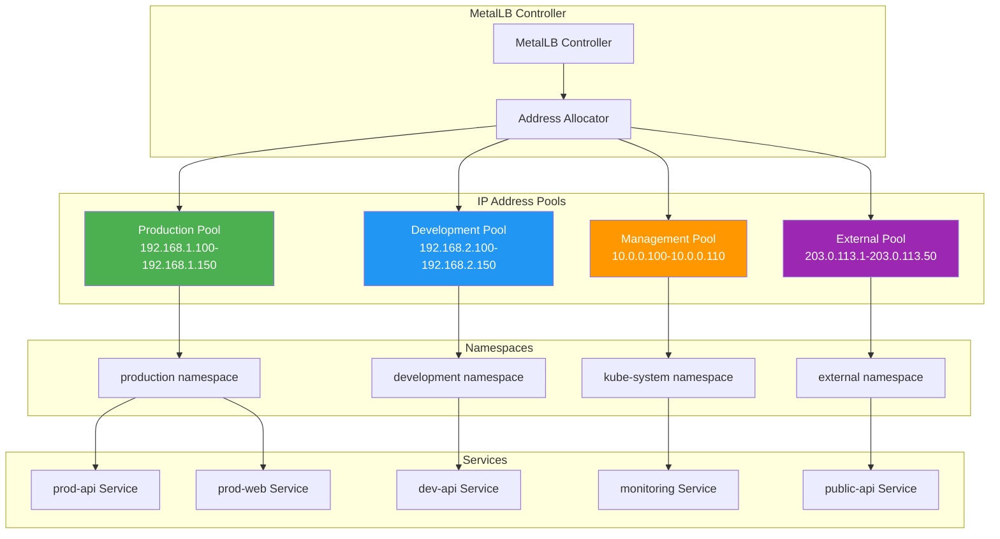
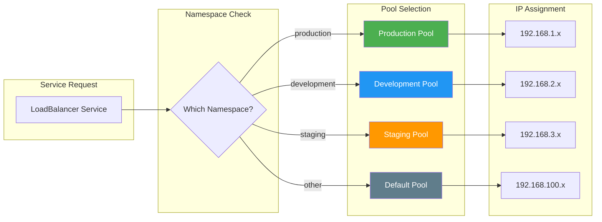
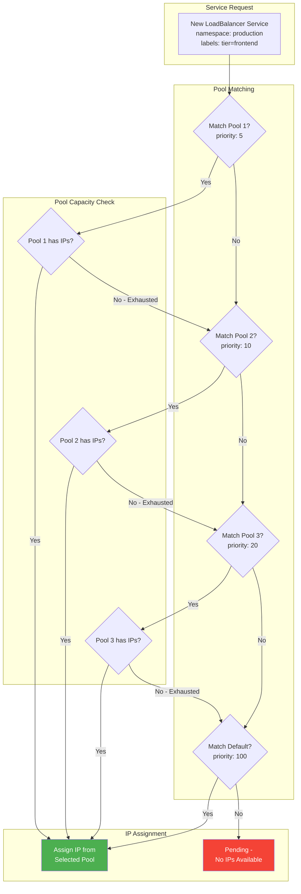
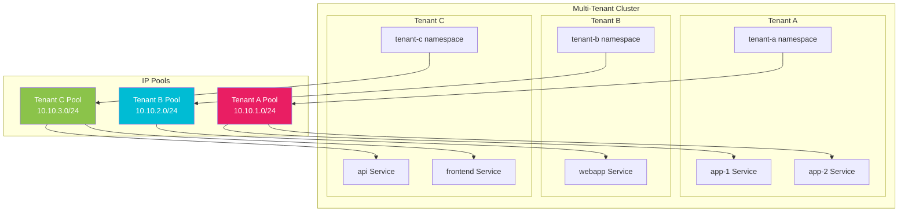
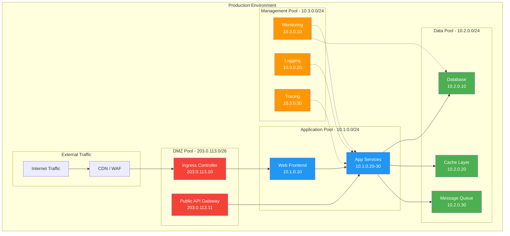

# How to Configure Multiple IP Pools in MetalLB for Different Services

Author: [nawazdhandala](https://github.com/nawazdhandala)

Tags: MetalLB, Kubernetes, IP Management, Multi-tenant, Load Balancing

Description: A guide to configuring multiple IP address pools for different service types in MetalLB.

---

## Introduction

MetalLB is the go-to solution for providing LoadBalancer services in bare-metal Kubernetes clusters. While a single IP pool might suffice for simple deployments, production environments often require multiple IP pools to segment traffic, manage multi-tenant environments, or allocate addresses based on service criticality.

This comprehensive guide walks you through configuring multiple IP address pools in MetalLB, including namespace selectors, label-based allocation, priority configurations, and real-world use cases.

## Prerequisites

Before diving in, ensure you have:

- A running Kubernetes cluster (v1.20+)
- MetalLB installed (v0.13.0+ recommended for the new CRD-based configuration)
- kubectl configured with cluster admin access
- Multiple IP ranges available for allocation

## Understanding MetalLB IP Pool Architecture

The following diagram illustrates how MetalLB manages multiple IP pools and routes requests to appropriate services:



## Basic Multiple Pool Configuration

Let's start by creating multiple IP address pools for different environments. This configuration separates production and development traffic.

The following YAML defines two distinct IP pools - one for production workloads and another for development:

```yaml
# multiple-pools.yaml
# This configuration creates separate IP pools for production and development environments
# Each pool has its own IP range to ensure complete traffic isolation

apiVersion: metallb.io/v1beta1
kind: IPAddressPool
metadata:
  # Name should be descriptive to indicate the pool's purpose
  name: production-pool
  namespace: metallb-system
spec:
  # Define the IP range for production services
  # Ensure this range is not used by other network devices
  addresses:
    - 192.168.1.100-192.168.1.150
  # autoAssign controls whether this pool is used for automatic allocation
  # Set to false to require explicit pool selection via annotations
  autoAssign: false

---
apiVersion: metallb.io/v1beta1
kind: IPAddressPool
metadata:
  name: development-pool
  namespace: metallb-system
spec:
  addresses:
    - 192.168.2.100-192.168.2.150
  # For development, we allow auto-assignment as a fallback
  autoAssign: true
```

Apply this configuration using kubectl:

```bash
# Apply the IP pool configuration to your cluster
kubectl apply -f multiple-pools.yaml

# Verify the pools were created successfully
kubectl get ipaddresspools -n metallb-system
```

## L2 Advertisement Configuration

After defining IP pools, you must configure how MetalLB advertises these addresses. L2 mode uses ARP/NDP to announce addresses on the local network.

This configuration creates L2 advertisements for each pool, optionally limiting which nodes can announce each pool:

```yaml
# l2-advertisements.yaml
# L2 advertisements tell MetalLB how to announce IP addresses on the network
# Different pools can have different advertisement strategies

apiVersion: metallb.io/v1beta1
kind: L2Advertisement
metadata:
  name: production-l2-advert
  namespace: metallb-system
spec:
  # Reference the IP pool this advertisement applies to
  ipAddressPools:
    - production-pool
  # Optional: Limit which nodes can announce production IPs
  # This is useful for dedicated ingress nodes
  nodeSelectors:
    - matchLabels:
        node-role.kubernetes.io/ingress: "true"

---
apiVersion: metallb.io/v1beta1
kind: L2Advertisement
metadata:
  name: development-l2-advert
  namespace: metallb-system
spec:
  ipAddressPools:
    - development-pool
  # Development can use any node for announcements
  # No nodeSelector means all nodes participate
```

## Namespace-Based Pool Selection

One of the most powerful features is allocating IPs based on the namespace where services are deployed. This ensures automatic segregation without manual intervention.

The following diagram shows how namespace selectors route services to appropriate pools:



This configuration uses namespace selectors to automatically assign IPs from the correct pool:

```yaml
# namespace-pools.yaml
# This configuration automatically assigns IPs based on the namespace
# Services don't need any special annotations - allocation is automatic

apiVersion: metallb.io/v1beta1
kind: IPAddressPool
metadata:
  name: production-ns-pool
  namespace: metallb-system
spec:
  addresses:
    - 192.168.1.100-192.168.1.150
  # Disable auto-assign to prevent this pool from being used
  # for services outside the production namespace
  autoAssign: false
  # serviceAllocation defines which services can use this pool
  serviceAllocation:
    # priority determines which pool is chosen when multiple match
    # lower numbers have higher priority
    priority: 10
    # namespaces restricts this pool to specific namespaces
    namespaces:
      - production
      - prod-*

---
apiVersion: metallb.io/v1beta1
kind: IPAddressPool
metadata:
  name: development-ns-pool
  namespace: metallb-system
spec:
  addresses:
    - 192.168.2.100-192.168.2.150
  autoAssign: false
  serviceAllocation:
    priority: 20
    namespaces:
      - development
      - dev-*
      - staging

---
apiVersion: metallb.io/v1beta1
kind: IPAddressPool
metadata:
  name: default-pool
  namespace: metallb-system
spec:
  addresses:
    - 192.168.100.100-192.168.100.200
  # This pool catches all services that don't match other pools
  autoAssign: true
  serviceAllocation:
    # Lowest priority - used as fallback
    priority: 100
```

## Label-Based Pool Selection

For more granular control, you can use service labels to determine pool allocation. This is useful when the same namespace contains services with different requirements.

This configuration uses service label selectors to match services to appropriate pools:

```yaml
# label-pools.yaml
# Label-based selection provides fine-grained control over IP allocation
# Services use labels to request specific pools

apiVersion: metallb.io/v1beta1
kind: IPAddressPool
metadata:
  name: external-facing-pool
  namespace: metallb-system
spec:
  addresses:
    # Public IP range for internet-facing services
    - 203.0.113.1-203.0.113.50
  autoAssign: false
  serviceAllocation:
    priority: 5
    # Match services with the 'exposure: external' label
    serviceSelectors:
      - matchLabels:
          exposure: external
      - matchExpressions:
          - key: tier
            operator: In
            values:
              - frontend
              - api-gateway

---
apiVersion: metallb.io/v1beta1
kind: IPAddressPool
metadata:
  name: internal-pool
  namespace: metallb-system
spec:
  addresses:
    # Private IP range for internal services
    - 10.0.0.100-10.0.0.200
  autoAssign: false
  serviceAllocation:
    priority: 10
    serviceSelectors:
      - matchLabels:
          exposure: internal
      - matchExpressions:
          - key: tier
            operator: In
            values:
              - backend
              - database
              - cache

---
apiVersion: metallb.io/v1beta1
kind: IPAddressPool
metadata:
  name: monitoring-pool
  namespace: metallb-system
spec:
  addresses:
    - 10.0.1.100-10.0.1.120
  autoAssign: false
  serviceAllocation:
    priority: 15
    # Combine namespace and label selectors
    namespaces:
      - monitoring
      - observability
    serviceSelectors:
      - matchLabels:
          app.kubernetes.io/component: monitoring
```

Here's an example service that uses label-based pool selection:

```yaml
# external-service.yaml
# This service will automatically receive an IP from the external-facing-pool
# because it has the 'exposure: external' label

apiVersion: v1
kind: Service
metadata:
  name: public-api
  namespace: production
  labels:
    # This label triggers allocation from external-facing-pool
    exposure: external
    tier: api-gateway
    app: public-api
spec:
  type: LoadBalancer
  ports:
    - port: 443
      targetPort: 8443
      protocol: TCP
      name: https
  selector:
    app: public-api
```

## Priority-Based Allocation

When multiple pools could match a service, priorities determine which pool is used. This is essential for creating fallback hierarchies.

The following diagram illustrates how priority-based allocation works:



This configuration demonstrates a priority hierarchy with fallback pools:

```yaml
# priority-pools.yaml
# Priority values determine pool selection order
# Lower numbers = higher priority = checked first

apiVersion: metallb.io/v1beta1
kind: IPAddressPool
metadata:
  name: premium-pool
  namespace: metallb-system
spec:
  addresses:
    # Limited pool of premium IPs (perhaps with better routing)
    - 192.168.50.1-192.168.50.10
  autoAssign: false
  serviceAllocation:
    # Highest priority - checked first
    priority: 1
    serviceSelectors:
      - matchLabels:
          # Only services with premium tier get these IPs
          service-tier: premium
    namespaces:
      - production

---
apiVersion: metallb.io/v1beta1
kind: IPAddressPool
metadata:
  name: standard-production-pool
  namespace: metallb-system
spec:
  addresses:
    - 192.168.51.1-192.168.51.100
  autoAssign: false
  serviceAllocation:
    # Second priority - used if premium pool doesn't match or is exhausted
    priority: 10
    namespaces:
      - production

---
apiVersion: metallb.io/v1beta1
kind: IPAddressPool
metadata:
  name: general-pool
  namespace: metallb-system
spec:
  addresses:
    - 192.168.100.1-192.168.100.254
  # Auto-assign enabled as this is the fallback pool
  autoAssign: true
  serviceAllocation:
    # Lowest priority - catches everything else
    priority: 100
```

## Multi-Tenant Configuration

For multi-tenant Kubernetes clusters, you can isolate tenants by giving each their own IP pool. This provides network-level isolation and simplifies billing or chargeback.



This configuration creates isolated pools for each tenant:

```yaml
# multi-tenant-pools.yaml
# Each tenant gets a dedicated IP pool with namespace isolation
# This enables network segmentation and usage tracking per tenant

apiVersion: metallb.io/v1beta1
kind: IPAddressPool
metadata:
  name: tenant-a-pool
  namespace: metallb-system
  labels:
    # Labels help with pool management and monitoring
    tenant: tenant-a
    environment: production
spec:
  addresses:
    # CIDR notation works too - /24 gives 254 usable addresses
    - 10.10.1.0/24
  autoAssign: false
  serviceAllocation:
    priority: 10
    # Strict namespace isolation for tenant A
    namespaces:
      - tenant-a
      - tenant-a-*

---
apiVersion: metallb.io/v1beta1
kind: IPAddressPool
metadata:
  name: tenant-b-pool
  namespace: metallb-system
  labels:
    tenant: tenant-b
    environment: production
spec:
  addresses:
    - 10.10.2.0/24
  autoAssign: false
  serviceAllocation:
    priority: 10
    namespaces:
      - tenant-b
      - tenant-b-*

---
apiVersion: metallb.io/v1beta1
kind: IPAddressPool
metadata:
  name: tenant-c-pool
  namespace: metallb-system
  labels:
    tenant: tenant-c
    environment: production
spec:
  addresses:
    - 10.10.3.0/24
  autoAssign: false
  serviceAllocation:
    priority: 10
    namespaces:
      - tenant-c
      - tenant-c-*

---
# Shared pool for cluster services that all tenants can access
apiVersion: metallb.io/v1beta1
kind: IPAddressPool
metadata:
  name: shared-services-pool
  namespace: metallb-system
  labels:
    type: shared
spec:
  addresses:
    - 10.10.0.0/24
  autoAssign: false
  serviceAllocation:
    priority: 50
    namespaces:
      - kube-system
      - ingress-nginx
      - cert-manager
```

## BGP-Based Configuration for Multiple Pools

For larger deployments, BGP mode provides better scalability and integration with network infrastructure. Each pool can have different BGP communities for traffic engineering.

```yaml
# bgp-pools.yaml
# BGP configuration for multiple pools with different routing policies
# Each pool can advertise with different BGP attributes

apiVersion: metallb.io/v1beta1
kind: IPAddressPool
metadata:
  name: internet-egress-pool
  namespace: metallb-system
spec:
  addresses:
    - 203.0.113.0/26
  autoAssign: false
  serviceAllocation:
    priority: 5
    serviceSelectors:
      - matchLabels:
          network-tier: internet

---
apiVersion: metallb.io/v1beta1
kind: IPAddressPool
metadata:
  name: datacenter-pool
  namespace: metallb-system
spec:
  addresses:
    - 10.100.0.0/24
  autoAssign: false
  serviceAllocation:
    priority: 10
    serviceSelectors:
      - matchLabels:
          network-tier: datacenter

---
# BGP Advertisement configuration
apiVersion: metallb.io/v1beta1
kind: BGPAdvertisement
metadata:
  name: internet-advertisement
  namespace: metallb-system
spec:
  ipAddressPools:
    - internet-egress-pool
  # Advertise with specific BGP communities for traffic engineering
  communities:
    - 65000:100
  # Local preference affects outbound path selection
  localPref: 200
  # Aggregate routes to reduce BGP table size
  aggregationLength: 26

---
apiVersion: metallb.io/v1beta1
kind: BGPAdvertisement
metadata:
  name: datacenter-advertisement
  namespace: metallb-system
spec:
  ipAddressPools:
    - datacenter-pool
  communities:
    - 65000:200
  localPref: 100
  aggregationLength: 24

---
# BGP Peer configuration (connects to your routers)
apiVersion: metallb.io/v1beta1
kind: BGPPeer
metadata:
  name: router-1
  namespace: metallb-system
spec:
  myASN: 65001
  peerASN: 65000
  peerAddress: 10.0.0.1
  # Optional: limit which nodes peer with this router
  nodeSelectors:
    - matchLabels:
        node-role.kubernetes.io/worker: "true"
```

## Explicit Pool Selection via Annotations

Sometimes you need explicit control over which pool a service uses, regardless of namespace or labels. MetalLB supports this via annotations.

This example shows how to request a specific pool or even a specific IP address:

```yaml
# annotated-services.yaml
# Use annotations to explicitly select pools or request specific IPs
# This overrides automatic pool selection based on namespace/labels

apiVersion: v1
kind: Service
metadata:
  name: critical-service
  namespace: production
  annotations:
    # Explicitly request the premium pool
    metallb.universe.tf/address-pool: premium-pool
spec:
  type: LoadBalancer
  ports:
    - port: 443
      targetPort: 8443
  selector:
    app: critical-service

---
apiVersion: v1
kind: Service
metadata:
  name: legacy-service
  namespace: production
  annotations:
    # Request a specific IP address from the pool
    # The IP must be within one of the configured pools
    metallb.universe.tf/loadBalancerIPs: 192.168.1.100
spec:
  type: LoadBalancer
  ports:
    - port: 80
      targetPort: 8080
  selector:
    app: legacy-service

---
apiVersion: v1
kind: Service
metadata:
  name: dual-stack-service
  namespace: production
  annotations:
    # Request specific IPs for dual-stack services
    metallb.universe.tf/loadBalancerIPs: 192.168.1.101,2001:db8::1
spec:
  type: LoadBalancer
  ipFamilyPolicy: RequireDualStack
  ipFamilies:
    - IPv4
    - IPv6
  ports:
    - port: 443
      targetPort: 8443
  selector:
    app: dual-stack-service
```

## Complete Production Example

Here's a comprehensive example combining all concepts for a production environment:



This comprehensive configuration implements the architecture shown above:

```yaml
# production-complete.yaml
# Complete production MetalLB configuration with multiple pools
# Implements DMZ, Application, Data, and Management network segments

# ============================================
# IP Address Pool Definitions
# ============================================

# DMZ Pool - Internet-facing services
apiVersion: metallb.io/v1beta1
kind: IPAddressPool
metadata:
  name: dmz-pool
  namespace: metallb-system
  labels:
    network-zone: dmz
    criticality: high
spec:
  addresses:
    - 203.0.113.0/26
  autoAssign: false
  serviceAllocation:
    priority: 1
    serviceSelectors:
      - matchLabels:
          network-zone: dmz
      - matchExpressions:
          - key: app.kubernetes.io/component
            operator: In
            values:
              - ingress
              - api-gateway
              - cdn-origin

---
# Application Pool - Internal application services
apiVersion: metallb.io/v1beta1
kind: IPAddressPool
metadata:
  name: application-pool
  namespace: metallb-system
  labels:
    network-zone: application
    criticality: high
spec:
  addresses:
    - 10.1.0.0/24
  autoAssign: false
  serviceAllocation:
    priority: 10
    namespaces:
      - production
      - staging
    serviceSelectors:
      - matchLabels:
          tier: application
      - matchExpressions:
          - key: app.kubernetes.io/component
            operator: In
            values:
              - frontend
              - backend
              - worker

---
# Data Pool - Database and cache services
apiVersion: metallb.io/v1beta1
kind: IPAddressPool
metadata:
  name: data-pool
  namespace: metallb-system
  labels:
    network-zone: data
    criticality: critical
spec:
  addresses:
    - 10.2.0.0/24
  autoAssign: false
  serviceAllocation:
    priority: 5
    namespaces:
      - production
      - data-services
    serviceSelectors:
      - matchLabels:
          tier: data
      - matchExpressions:
          - key: app.kubernetes.io/component
            operator: In
            values:
              - database
              - cache
              - message-queue
              - search

---
# Management Pool - Observability and cluster services
apiVersion: metallb.io/v1beta1
kind: IPAddressPool
metadata:
  name: management-pool
  namespace: metallb-system
  labels:
    network-zone: management
    criticality: medium
spec:
  addresses:
    - 10.3.0.0/24
  autoAssign: false
  serviceAllocation:
    priority: 20
    namespaces:
      - monitoring
      - logging
      - tracing
      - kube-system
    serviceSelectors:
      - matchLabels:
          tier: management
      - matchExpressions:
          - key: app.kubernetes.io/part-of
            operator: In
            values:
              - prometheus-stack
              - elastic-stack
              - jaeger

---
# Development Pool - Non-production environments
apiVersion: metallb.io/v1beta1
kind: IPAddressPool
metadata:
  name: development-pool
  namespace: metallb-system
  labels:
    network-zone: development
    criticality: low
spec:
  addresses:
    - 10.100.0.0/23
  autoAssign: true
  serviceAllocation:
    priority: 50
    namespaces:
      - development
      - dev-*
      - feature-*
      - test-*

---
# ============================================
# L2 Advertisements
# ============================================

# DMZ L2 Advertisement - Uses dedicated ingress nodes
apiVersion: metallb.io/v1beta1
kind: L2Advertisement
metadata:
  name: dmz-l2
  namespace: metallb-system
spec:
  ipAddressPools:
    - dmz-pool
  nodeSelectors:
    - matchLabels:
        # Only ingress-capable nodes announce DMZ IPs
        node-role.kubernetes.io/ingress: "true"
  interfaces:
    # Limit to specific network interface if needed
    - eth0

---
# Internal L2 Advertisement - All worker nodes
apiVersion: metallb.io/v1beta1
kind: L2Advertisement
metadata:
  name: internal-l2
  namespace: metallb-system
spec:
  ipAddressPools:
    - application-pool
    - data-pool
    - management-pool
    - development-pool
  nodeSelectors:
    - matchLabels:
        node-role.kubernetes.io/worker: "true"
```

## Monitoring Pool Usage

To effectively manage multiple pools, you need visibility into IP allocation. Here's how to monitor pool usage:

```bash
# View all configured IP pools and their addresses
kubectl get ipaddresspools -n metallb-system -o wide

# Check which services have been assigned IPs from each pool
kubectl get services --all-namespaces -o jsonpath='{range .items[?(@.spec.type=="LoadBalancer")]}{.metadata.namespace}{"\t"}{.metadata.name}{"\t"}{.status.loadBalancer.ingress[0].ip}{"\n"}{end}'

# View MetalLB controller logs for allocation decisions
kubectl logs -n metallb-system -l app=metallb -c controller --tail=100

# Check speaker logs for advertisement status
kubectl logs -n metallb-system -l component=speaker --tail=100
```

For Prometheus-based monitoring, MetalLB exposes useful metrics:

```yaml
# prometheus-servicemonitor.yaml
# ServiceMonitor for scraping MetalLB metrics

apiVersion: monitoring.coreos.com/v1
kind: ServiceMonitor
metadata:
  name: metallb-metrics
  namespace: monitoring
spec:
  selector:
    matchLabels:
      app.kubernetes.io/name: metallb
  namespaceSelector:
    matchNames:
      - metallb-system
  endpoints:
    - port: monitoring
      interval: 30s
      path: /metrics
```

Key metrics to monitor:

- `metallb_allocator_addresses_in_use_total` - IPs currently allocated per pool
- `metallb_allocator_addresses_total` - Total IPs available per pool
- `metallb_bgp_session_up` - BGP session status (if using BGP mode)
- `metallb_k8s_client_updates_total` - Configuration update events

## Troubleshooting Multiple Pools

Common issues and solutions when working with multiple pools:

### Service Stuck in Pending State

If a service shows `<pending>` for its external IP:

```bash
# Check if the service matches any pool's selection criteria
kubectl describe service <service-name> -n <namespace>

# View MetalLB controller logs for allocation errors
kubectl logs -n metallb-system deployment/controller | grep -i error

# Verify pool has available addresses
kubectl get ipaddresspools -n metallb-system -o yaml
```

### IP Assigned from Wrong Pool

If a service receives an IP from an unexpected pool:

```bash
# Check service labels match expected pool selectors
kubectl get service <service-name> -n <namespace> --show-labels

# Verify pool priorities - lower priority number wins
kubectl get ipaddresspools -n metallb-system -o jsonpath='{range .items[*]}{.metadata.name}{": "}{.spec.serviceAllocation.priority}{"\n"}{end}'

# Check if explicit annotation overrides selection
kubectl get service <service-name> -n <namespace> -o jsonpath='{.metadata.annotations}'
```

### L2 Advertisement Not Working

If IPs aren't reachable on the network:

```bash
# Verify L2 advertisement configuration
kubectl get l2advertisements -n metallb-system -o yaml

# Check speaker pods are running on expected nodes
kubectl get pods -n metallb-system -l component=speaker -o wide

# Verify node labels match advertisement nodeSelectors
kubectl get nodes --show-labels | grep ingress
```

## Best Practices

1. **Use Descriptive Names**: Name pools based on their purpose (e.g., `production-external-pool` rather than `pool-1`)

2. **Document IP Ranges**: Keep external documentation of which IP ranges are assigned to which pools

3. **Set Appropriate Priorities**: Use priority gaps (1, 10, 20, 100) to allow future pools to be inserted

4. **Implement Monitoring**: Always monitor pool utilization to prevent exhaustion

5. **Use Labels Consistently**: Establish naming conventions for labels used in service selectors

6. **Plan for Growth**: Allocate IP ranges with room for expansion

7. **Test Pool Selection**: Verify new services receive IPs from expected pools before production deployment

8. **Backup Configurations**: Store MetalLB configurations in version control

## Conclusion

Configuring multiple IP pools in MetalLB provides the flexibility needed for production Kubernetes deployments. By leveraging namespace selectors, label-based allocation, and priority configurations, you can implement sophisticated network segmentation strategies.

Key takeaways:

- Use separate pools to isolate different environments, tenants, or service tiers
- Namespace and label selectors enable automatic pool assignment
- Priorities create fallback hierarchies when pools overlap
- L2 advertisements can be customized per pool for network topology requirements
- Monitoring and troubleshooting tools help maintain healthy IP allocation

With these configurations in place, your MetalLB deployment can scale to meet the demands of complex, multi-tenant Kubernetes environments while maintaining clear network boundaries and simplified operations.

## Further Reading

- [MetalLB Official Documentation](https://metallb.universe.tf/)
- [Kubernetes LoadBalancer Services](https://kubernetes.io/docs/concepts/services-networking/service/#loadbalancer)
- [BGP Fundamentals for Network Engineers](https://metallb.universe.tf/concepts/bgp/)
- [MetalLB GitHub Repository](https://github.com/metallb/metallb)
