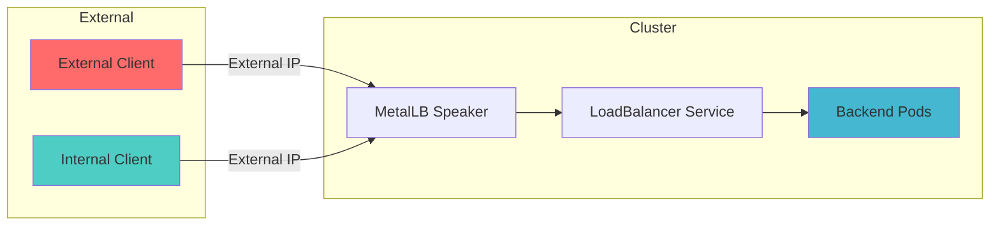
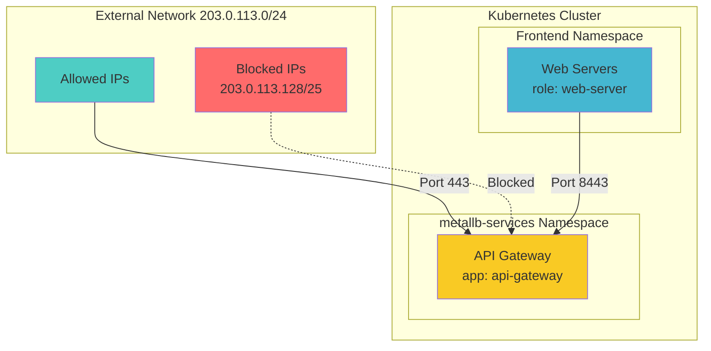
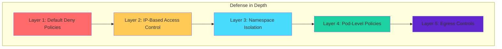

# How to Secure MetalLB with Kubernetes Network Policies

Author: [nawazdhandala](https://github.com/nawazdhandala)

Tags: MetalLB, Kubernetes, Network Policies, Security, Load Balancing, Networking, Access Control

Description: Learn how to secure MetalLB-exposed services using Kubernetes Network Policies to restrict access.

---

MetalLB provides load balancing for bare-metal Kubernetes clusters, but exposing services through external IPs creates security challenges. Without proper controls, your load-balanced services become accessible to anyone who can reach them. This guide covers how to use Kubernetes Network Policies to restrict access to MetalLB-exposed services, implementing defense-in-depth security for your infrastructure.

## Understanding the Security Challenge

When MetalLB assigns an external IP to a LoadBalancer service, traffic flows directly to your pods. Unlike cloud providers who offer security groups and firewall rules at the infrastructure level, bare-metal clusters require explicit network policy configuration.

The following diagram illustrates how traffic flows through MetalLB to your services:



Without Network Policies, both external and internal clients have unrestricted access to your services. This creates several risks:

- Unauthorized access from compromised workloads within the cluster
- Lateral movement opportunities for attackers
- Exposure of sensitive services to unintended consumers
- Difficulty meeting compliance requirements for network segmentation

## Prerequisites

Before implementing these policies, ensure your cluster meets these requirements:

- Kubernetes 1.20 or later
- MetalLB installed and configured
- A CNI plugin that supports Network Policies (Calico, Cilium, Weave Net, or similar)
- kubectl configured to access your cluster

Verify Network Policy support by checking your CNI plugin:

```bash
kubectl get pods -n kube-system | grep -E 'calico|cilium|weave'
```

## Basic Network Policy Concepts

Network Policies in Kubernetes act as pod-level firewalls. They define rules for ingress (incoming) and egress (outgoing) traffic based on:

- Pod selectors (labels)
- Namespace selectors
- IP blocks (CIDR ranges)
- Ports and protocols

A key concept to understand is that Network Policies are additive. If no policies select a pod, all traffic is allowed. Once any policy selects a pod, only traffic explicitly allowed by some policy is permitted.

## Creating a Secure Namespace for MetalLB Services

Start by creating a dedicated namespace for services that will be exposed via MetalLB. This provides a clear boundary for policy application.

Create a namespace with appropriate labels for policy selection:

```yaml
apiVersion: v1
kind: Namespace
metadata:
  name: metallb-services
  labels:
    environment: production
    metallb-exposed: "true"
```

Apply this configuration:

```bash
kubectl apply -f namespace.yaml
```

## Implementing Default Deny Policies

The foundation of network security is the principle of least privilege. Implement a default deny policy that blocks all traffic unless explicitly allowed.

This policy denies all ingress traffic to pods in the namespace:

```yaml
apiVersion: networking.k8s.io/v1
kind: NetworkPolicy
metadata:
  name: default-deny-ingress
  namespace: metallb-services
spec:
  podSelector: {}
  policyTypes:
    - Ingress
```

For complete isolation, also deny egress traffic:

```yaml
apiVersion: networking.k8s.io/v1
kind: NetworkPolicy
metadata:
  name: default-deny-egress
  namespace: metallb-services
spec:
  podSelector: {}
  policyTypes:
    - Egress
```

Apply both policies:

```bash
kubectl apply -f default-deny-ingress.yaml
kubectl apply -f default-deny-egress.yaml
```

## Allowing Traffic from Specific IP Ranges

After implementing default deny, selectively allow traffic from trusted sources. This example allows traffic only from your corporate network.

Define the IP ranges that should have access to your services:

```yaml
apiVersion: networking.k8s.io/v1
kind: NetworkPolicy
metadata:
  name: allow-corporate-network
  namespace: metallb-services
spec:
  podSelector:
    matchLabels:
      app: web-api
  policyTypes:
    - Ingress
  ingress:
    - from:
        - ipBlock:
            cidr: 10.0.0.0/8
        - ipBlock:
            cidr: 192.168.1.0/24
      ports:
        - protocol: TCP
          port: 8080
```

This policy allows ingress traffic to pods labeled `app: web-api` from two IP ranges on port 8080 only.

## Restricting Access by Source Namespace

For services that should only be accessible to specific internal workloads, use namespace selectors.

Allow traffic only from pods in the monitoring namespace:

```yaml
apiVersion: networking.k8s.io/v1
kind: NetworkPolicy
metadata:
  name: allow-monitoring-namespace
  namespace: metallb-services
spec:
  podSelector:
    matchLabels:
      app: metrics-service
  policyTypes:
    - Ingress
  ingress:
    - from:
        - namespaceSelector:
            matchLabels:
              name: monitoring
      ports:
        - protocol: TCP
          port: 9090
```

Ensure the source namespace has the required label:

```bash
kubectl label namespace monitoring name=monitoring
```

## Combining IP Blocks with Namespace Selectors

Complex security requirements often need multiple conditions. This example demonstrates combining different selector types.

Allow traffic from both external networks and internal services:

```yaml
apiVersion: networking.k8s.io/v1
kind: NetworkPolicy
metadata:
  name: allow-mixed-sources
  namespace: metallb-services
spec:
  podSelector:
    matchLabels:
      app: api-gateway
  policyTypes:
    - Ingress
  ingress:
    - from:
        - ipBlock:
            cidr: 203.0.113.0/24
            except:
              - 203.0.113.128/25
      ports:
        - protocol: TCP
          port: 443
    - from:
        - namespaceSelector:
            matchLabels:
              tier: frontend
          podSelector:
            matchLabels:
              role: web-server
      ports:
        - protocol: TCP
          port: 8443
```

This policy creates two distinct rules:
1. Allow HTTPS traffic from the external IP range (excluding a subset)
2. Allow traffic on port 8443 from frontend web servers

The following diagram shows the traffic flow:



## Securing MetalLB Speaker Communication

MetalLB speakers need to communicate with each other and with the Kubernetes API. Secure this communication while allowing necessary traffic.

Create a policy for the MetalLB namespace:

```yaml
apiVersion: networking.k8s.io/v1
kind: NetworkPolicy
metadata:
  name: metallb-speaker-policy
  namespace: metallb-system
spec:
  podSelector:
    matchLabels:
      component: speaker
  policyTypes:
    - Ingress
    - Egress
  ingress:
    - from:
        - podSelector:
            matchLabels:
              component: speaker
      ports:
        - protocol: TCP
          port: 7946
        - protocol: UDP
          port: 7946
  egress:
    - to:
        - podSelector:
            matchLabels:
              component: speaker
      ports:
        - protocol: TCP
          port: 7946
        - protocol: UDP
          port: 7946
    - to:
        - namespaceSelector: {}
          podSelector:
            matchLabels:
              component: kube-apiserver
      ports:
        - protocol: TCP
          port: 6443
    - to:
        - ipBlock:
            cidr: 0.0.0.0/0
      ports:
        - protocol: UDP
          port: 53
        - protocol: TCP
          port: 53
```

This policy:
- Allows speaker-to-speaker communication on port 7946
- Permits egress to the Kubernetes API server
- Allows DNS resolution

## Implementing Egress Controls for Backend Pods

Services exposed via MetalLB often need to communicate with databases, external APIs, or other services. Control this egress traffic explicitly.

Allow egress only to specific destinations:

```yaml
apiVersion: networking.k8s.io/v1
kind: NetworkPolicy
metadata:
  name: controlled-egress
  namespace: metallb-services
spec:
  podSelector:
    matchLabels:
      app: web-api
  policyTypes:
    - Egress
  egress:
    - to:
        - namespaceSelector:
            matchLabels:
              name: database
          podSelector:
            matchLabels:
              app: postgresql
      ports:
        - protocol: TCP
          port: 5432
    - to:
        - ipBlock:
            cidr: 0.0.0.0/0
      ports:
        - protocol: UDP
          port: 53
        - protocol: TCP
          port: 53
    - to:
        - ipBlock:
            cidr: 10.0.0.0/8
      ports:
        - protocol: TCP
          port: 443
```

This allows the web-api pods to:
- Connect to PostgreSQL in the database namespace
- Perform DNS lookups
- Access internal HTTPS services

## Rate Limiting Considerations

While Network Policies control access, they do not provide rate limiting. For rate limiting on MetalLB-exposed services, consider these complementary approaches.

Deploy an ingress controller with rate limiting capabilities behind MetalLB:

```yaml
apiVersion: v1
kind: ConfigMap
metadata:
  name: nginx-configuration
  namespace: ingress-nginx
data:
  limit-req-status-code: "429"
  limit-conn-zone-variable: "$binary_remote_addr"
```

Or implement rate limiting at the application level using middleware.

## Monitoring Network Policy Effectiveness

Verify your policies work as expected using these debugging techniques.

Check which policies apply to a specific pod:

```bash
kubectl get networkpolicy -n metallb-services -o wide
```

Test connectivity from within the cluster:

```bash
kubectl run test-pod --image=busybox --rm -it --restart=Never -- wget -qO- --timeout=2 http://service-name:port
```

Enable network policy logging if your CNI supports it. For Calico:

```yaml
apiVersion: projectcalico.org/v3
kind: GlobalNetworkPolicy
metadata:
  name: log-denied-traffic
spec:
  tier: default
  selector: all()
  types:
    - Ingress
    - Egress
  ingress:
    - action: Log
      metadata:
        annotations:
          reason: "Denied by default policy"
  egress:
    - action: Log
      metadata:
        annotations:
          reason: "Denied by default policy"
```

## Complete Example: Securing a Web Application

Here is a complete example securing a web application exposed via MetalLB with multiple tiers of access control.

First, deploy the application:

```yaml
apiVersion: apps/v1
kind: Deployment
metadata:
  name: secure-web-app
  namespace: metallb-services
spec:
  replicas: 3
  selector:
    matchLabels:
      app: secure-web-app
      tier: frontend
  template:
    metadata:
      labels:
        app: secure-web-app
        tier: frontend
    spec:
      containers:
        - name: web
          image: nginx:alpine
          ports:
            - containerPort: 80
          resources:
            limits:
              memory: "128Mi"
              cpu: "250m"
---
apiVersion: v1
kind: Service
metadata:
  name: secure-web-app
  namespace: metallb-services
  annotations:
    metallb.universe.tf/address-pool: production
spec:
  type: LoadBalancer
  selector:
    app: secure-web-app
  ports:
    - port: 80
      targetPort: 80
      protocol: TCP
```

Apply comprehensive network policies:

```yaml
apiVersion: networking.k8s.io/v1
kind: NetworkPolicy
metadata:
  name: secure-web-app-ingress
  namespace: metallb-services
spec:
  podSelector:
    matchLabels:
      app: secure-web-app
  policyTypes:
    - Ingress
  ingress:
    - from:
        - ipBlock:
            cidr: 10.0.0.0/8
        - ipBlock:
            cidr: 172.16.0.0/12
        - ipBlock:
            cidr: 192.168.0.0/16
      ports:
        - protocol: TCP
          port: 80
---
apiVersion: networking.k8s.io/v1
kind: NetworkPolicy
metadata:
  name: secure-web-app-egress
  namespace: metallb-services
spec:
  podSelector:
    matchLabels:
      app: secure-web-app
  policyTypes:
    - Egress
  egress:
    - to:
        - ipBlock:
            cidr: 0.0.0.0/0
      ports:
        - protocol: UDP
          port: 53
        - protocol: TCP
          port: 53
```

This configuration:
- Exposes the web application via MetalLB
- Restricts ingress to RFC 1918 private IP ranges
- Limits egress to DNS only

## Troubleshooting Common Issues

When traffic is unexpectedly blocked, follow these steps.

Verify the policy is applied correctly:

```bash
kubectl describe networkpolicy secure-web-app-ingress -n metallb-services
```

Check pod labels match the policy selector:

```bash
kubectl get pods -n metallb-services --show-labels
```

Ensure your CNI supports Network Policies:

```bash
kubectl get pods -n kube-system -l k8s-app=calico-node
```

Test from a pod within an allowed namespace:

```bash
kubectl run debug --image=nicolaka/netshoot -n allowed-namespace -it --rm -- curl -v http://service-ip:port
```

## Advanced: Using Cilium for Enhanced Security

For more advanced security requirements, Cilium provides layer 7 Network Policies that can filter based on HTTP paths, methods, and headers.

Example Cilium policy for HTTP-aware filtering:

```yaml
apiVersion: cilium.io/v2
kind: CiliumNetworkPolicy
metadata:
  name: l7-aware-policy
  namespace: metallb-services
spec:
  endpointSelector:
    matchLabels:
      app: api-server
  ingress:
    - fromEndpoints:
        - matchLabels:
            role: frontend
      toPorts:
        - ports:
            - port: "8080"
              protocol: TCP
          rules:
            http:
              - method: GET
                path: "/api/v1/public/.*"
              - method: POST
                path: "/api/v1/public/.*"
                headers:
                  - "Content-Type: application/json"
```

This policy allows only GET and POST requests to specific API paths with required headers.

## Security Best Practices Summary

Follow these practices when securing MetalLB services with Network Policies:

1. **Start with default deny** - Always implement default deny policies before adding allow rules
2. **Use specific selectors** - Avoid broad selectors that match unintended pods
3. **Limit egress** - Do not overlook egress controls; they prevent data exfiltration
4. **Document policies** - Maintain clear documentation of what each policy allows
5. **Test thoroughly** - Verify policies work as expected before production deployment
6. **Monitor continuously** - Use logging and monitoring to detect policy violations
7. **Review regularly** - Audit policies periodically as applications evolve

The following diagram summarizes the layered security approach:



## Conclusion

Securing MetalLB-exposed services requires a layered approach combining Network Policies with proper namespace design and monitoring. By implementing default deny policies and selectively allowing traffic based on source IPs, namespaces, and pods, you create a robust security posture for your bare-metal Kubernetes cluster.

Network Policies provide powerful primitive controls, but remember they are just one component of a comprehensive security strategy. Combine them with proper RBAC, secrets management, and application-level security for defense in depth.

Start by implementing the default deny policies in this guide, then progressively add allow rules based on your specific requirements. Test thoroughly in non-production environments before applying to production workloads.
