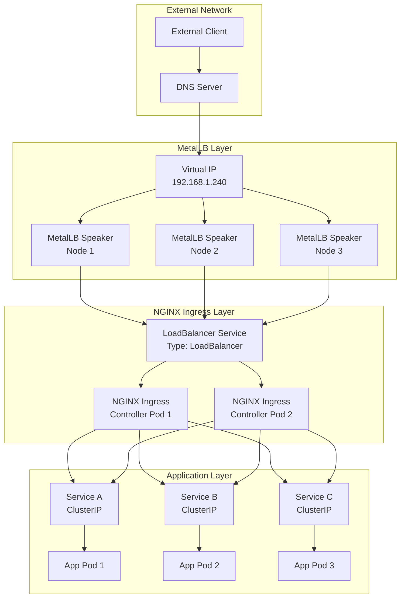
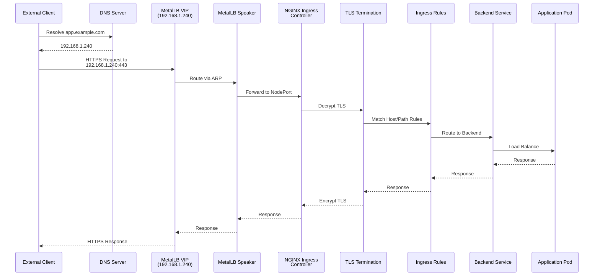

# How to Integrate MetalLB with NGINX Ingress Controller

Author: [nawazdhandala](https://github.com/nawazdhandala)

Tags: MetalLB, NGINX, Ingress, Kubernetes, Load Balancing

Description: A guide to using MetalLB with NGINX Ingress Controller for external traffic management.

---

## Introduction

Running Kubernetes in bare-metal or on-premises environments presents a unique challenge: how do you expose services externally without cloud provider load balancers? MetalLB solves this by providing a network load balancer implementation for Kubernetes clusters that don't have access to cloud-native load balancing solutions.

When combined with the NGINX Ingress Controller, MetalLB creates a powerful ingress stack that handles external traffic routing, SSL termination, and load balancing. This guide walks you through the complete integration process, from installation to production-ready configuration.

## Understanding the Architecture

Before diving into the implementation, let's understand how MetalLB and NGINX Ingress Controller work together.

The following diagram illustrates the traffic flow from external clients to your Kubernetes services:



### How It Works

1. **MetalLB** assigns external IP addresses to LoadBalancer services and announces them to the network using either Layer 2 (ARP/NDP) or BGP protocols
2. **NGINX Ingress Controller** runs as a Deployment with a LoadBalancer service type
3. **Traffic Flow**: External requests hit the MetalLB-assigned IP, get routed to the NGINX Ingress Controller, which then routes based on Ingress rules to backend services

## Prerequisites

Before you begin, ensure you have:

- A Kubernetes cluster (v1.21 or later) without a cloud load balancer
- kubectl configured to communicate with your cluster
- Helm 3.x installed for easier deployment
- Administrative access to the cluster
- A range of IP addresses available for MetalLB to use

## Step 1: Install MetalLB

First, let's install MetalLB using the official manifests. This creates the necessary namespace, RBAC, and controller components.

```bash
# Install MetalLB native manifests
# This deploys the controller and speaker daemonset
kubectl apply -f https://raw.githubusercontent.com/metallb/metallb/v0.14.9/config/manifests/metallb-native.yaml

# Wait for MetalLB pods to be ready
# The controller manages IP assignments while speakers handle network announcements
kubectl wait --namespace metallb-system \
  --for=condition=ready pod \
  --selector=app=metallb \
  --timeout=90s
```

Verify the installation by checking the running pods:

```bash
# List all MetalLB components
# You should see one controller pod and one speaker pod per node
kubectl get pods -n metallb-system
```

Expected output:

```
NAME                          READY   STATUS    RESTARTS   AGE
controller-5f784d8f9d-xxxxx   1/1     Running   0          30s
speaker-xxxxx                 1/1     Running   0          30s
speaker-yyyyy                 1/1     Running   0          30s
speaker-zzzzz                 1/1     Running   0          30s
```

## Step 2: Configure MetalLB IP Address Pool

MetalLB needs a pool of IP addresses it can assign to LoadBalancer services. Create an IPAddressPool resource with your available IP range.

The following configuration defines an IP address pool that MetalLB will use to allocate external IPs:

```yaml
# metallb-ipaddresspool.yaml
# This resource defines the IP addresses available for LoadBalancer services
# Ensure these IPs are routable and not used by other devices on your network
apiVersion: metallb.io/v1beta1
kind: IPAddressPool
metadata:
  name: nginx-ingress-pool
  namespace: metallb-system
spec:
  # Define the IP range for LoadBalancer services
  # Use CIDR notation or explicit ranges
  addresses:
  - 192.168.1.240-192.168.1.250
  # autoAssign controls whether this pool is used for automatic allocation
  # Set to true to allow MetalLB to automatically pick IPs from this pool
  autoAssign: true
```

Apply the IP address pool configuration:

```bash
kubectl apply -f metallb-ipaddresspool.yaml
```

## Step 3: Configure L2 Advertisement

For Layer 2 mode, MetalLB announces IP addresses using ARP (IPv4) or NDP (IPv6). This is the simplest mode and works in most environments.

This L2Advertisement resource tells MetalLB how to announce the IPs to your network:

```yaml
# metallb-l2advertisement.yaml
# L2Advertisement configures how MetalLB announces IPs on the network
# Layer 2 mode uses ARP/NDP to make IPs reachable on the local network
apiVersion: metallb.io/v1beta1
kind: L2Advertisement
metadata:
  name: nginx-ingress-l2
  namespace: metallb-system
spec:
  # Reference the IP address pools this advertisement applies to
  # Multiple pools can be listed if needed
  ipAddressPools:
  - nginx-ingress-pool
  # Optional: Specify which network interfaces to use for announcements
  # Leave empty to use all interfaces
  # interfaces:
  # - eth0
```

Apply the L2 advertisement configuration:

```bash
kubectl apply -f metallb-l2advertisement.yaml
```

## Step 4: Install NGINX Ingress Controller

Now install the NGINX Ingress Controller. Using Helm provides the most flexible configuration options.

First, add the ingress-nginx Helm repository:

```bash
# Add the official ingress-nginx Helm repository
helm repo add ingress-nginx https://kubernetes.github.io/ingress-nginx

# Update the repository to get the latest chart versions
helm repo update
```

Create a values file for customizing the NGINX Ingress Controller installation with MetalLB integration:

```yaml
# nginx-ingress-values.yaml
# This file configures NGINX Ingress Controller for use with MetalLB
# Includes SSL termination, health checks, and performance tuning

controller:
  # Deploy multiple replicas for high availability
  # Minimum 2 replicas recommended for production
  replicaCount: 2

  # Resource requests and limits for the controller pods
  # Adjust based on your traffic volume and cluster capacity
  resources:
    requests:
      cpu: 100m
      memory: 128Mi
    limits:
      cpu: 1000m
      memory: 512Mi

  # Service configuration for LoadBalancer type
  # MetalLB will assign an IP from the configured pool
  service:
    type: LoadBalancer
    # Annotations to control MetalLB behavior
    annotations:
      # Request a specific IP from MetalLB (optional)
      # metallb.universe.tf/loadBalancerIPs: "192.168.1.240"
      # Specify which address pool to use (optional if autoAssign is true)
      metallb.universe.tf/address-pool: nginx-ingress-pool
    # External traffic policy affects how traffic is routed
    # Local: preserves client IP but may cause uneven load distribution
    # Cluster: may lose client IP but provides better load balancing
    externalTrafficPolicy: Local

  # Health check configuration for the ingress controller
  # These settings ensure proper pod lifecycle management
  livenessProbe:
    httpGet:
      path: /healthz
      port: 10254
      scheme: HTTP
    initialDelaySeconds: 10
    periodSeconds: 10
    timeoutSeconds: 5
    successThreshold: 1
    failureThreshold: 3

  readinessProbe:
    httpGet:
      path: /healthz
      port: 10254
      scheme: HTTP
    initialDelaySeconds: 10
    periodSeconds: 10
    timeoutSeconds: 5
    successThreshold: 1
    failureThreshold: 3

  # NGINX configuration for performance tuning
  # These settings optimize the ingress controller for production use
  config:
    # Enable gzip compression for responses
    use-gzip: "true"
    gzip-level: "6"
    gzip-types: "application/json application/javascript text/css text/plain text/xml application/xml"

    # Connection keep-alive settings
    # Reduces latency for subsequent requests from the same client
    keep-alive: "75"
    keep-alive-requests: "1000"

    # Upstream keep-alive for backend connections
    # Reuses connections to backend services for better performance
    upstream-keepalive-connections: "100"
    upstream-keepalive-timeout: "60"
    upstream-keepalive-requests: "10000"

    # Proxy buffer settings for handling large responses
    proxy-buffer-size: "16k"
    proxy-buffers-number: "4"
    proxy-body-size: "100m"

    # Timeouts for various operations
    proxy-connect-timeout: "60"
    proxy-read-timeout: "60"
    proxy-send-timeout: "60"

    # SSL/TLS settings for secure connections
    ssl-protocols: "TLSv1.2 TLSv1.3"
    ssl-ciphers: "ECDHE-ECDSA-AES128-GCM-SHA256:ECDHE-RSA-AES128-GCM-SHA256:ECDHE-ECDSA-AES256-GCM-SHA384:ECDHE-RSA-AES256-GCM-SHA384"
    ssl-prefer-server-ciphers: "true"

    # Enable HSTS for improved security
    hsts: "true"
    hsts-max-age: "31536000"
    hsts-include-subdomains: "true"

    # Logging configuration
    log-format-upstream: '$remote_addr - $remote_user [$time_local] "$request" $status $body_bytes_sent "$http_referer" "$http_user_agent" $request_length $request_time [$proxy_upstream_name] [$proxy_alternative_upstream_name] $upstream_addr $upstream_response_length $upstream_response_time $upstream_status $req_id'

    # Enable real IP detection for client IP preservation
    use-forwarded-headers: "true"
    compute-full-forwarded-for: "true"
    use-proxy-protocol: "false"

  # Pod anti-affinity to spread replicas across nodes
  # Improves availability by preventing all replicas on one node
  affinity:
    podAntiAffinity:
      preferredDuringSchedulingIgnoredDuringExecution:
      - weight: 100
        podAffinityTerm:
          labelSelector:
            matchExpressions:
            - key: app.kubernetes.io/name
              operator: In
              values:
              - ingress-nginx
          topologyKey: kubernetes.io/hostname

  # Metrics configuration for monitoring
  # Enable Prometheus metrics for observability
  metrics:
    enabled: true
    serviceMonitor:
      enabled: false  # Set to true if using Prometheus Operator

# Default backend for handling requests that don't match any ingress rule
defaultBackend:
  enabled: true
  replicaCount: 1
```

Install the NGINX Ingress Controller with the custom values:

```bash
# Create a dedicated namespace for the ingress controller
kubectl create namespace ingress-nginx

# Install NGINX Ingress Controller using Helm
# The values file contains all our customizations for MetalLB integration
helm install ingress-nginx ingress-nginx/ingress-nginx \
  --namespace ingress-nginx \
  --values nginx-ingress-values.yaml
```

Verify the installation and check that MetalLB assigned an external IP:

```bash
# Check the LoadBalancer service status
# The EXTERNAL-IP column should show an IP from your MetalLB pool
kubectl get svc -n ingress-nginx

# Verify the controller pods are running
kubectl get pods -n ingress-nginx
```

Expected output showing MetalLB IP assignment:

```
NAME                                 TYPE           CLUSTER-IP      EXTERNAL-IP     PORT(S)                      AGE
ingress-nginx-controller             LoadBalancer   10.96.123.45    192.168.1.240   80:31234/TCP,443:31235/TCP   2m
ingress-nginx-controller-admission   ClusterIP      10.96.234.56    <none>          443/TCP                      2m
```

## Step 5: Configure SSL/TLS Termination

SSL termination at the ingress level is crucial for secure communications. Let's set up TLS certificates and configure HTTPS.

### Option A: Self-Signed Certificates (Development)

For development environments, create a self-signed certificate:

```bash
# Generate a self-signed certificate for development/testing
# Replace *.example.com with your domain
openssl req -x509 -nodes -days 365 -newkey rsa:2048 \
  -keyout tls.key \
  -out tls.crt \
  -subj "/CN=*.example.com/O=Example Inc"

# Create a Kubernetes secret to store the certificate
# This secret will be referenced by Ingress resources
kubectl create secret tls example-tls \
  --key tls.key \
  --cert tls.crt \
  --namespace default
```

### Option B: Let's Encrypt with cert-manager (Production)

For production, use cert-manager for automatic certificate management:

```bash
# Install cert-manager for automatic certificate management
# cert-manager handles certificate issuance and renewal
kubectl apply -f https://github.com/cert-manager/cert-manager/releases/download/v1.14.4/cert-manager.yaml

# Wait for cert-manager to be ready
kubectl wait --for=condition=Available deployment --all -n cert-manager --timeout=120s
```

Create a ClusterIssuer for Let's Encrypt:

```yaml
# letsencrypt-issuer.yaml
# ClusterIssuer defines how certificates should be obtained
# This configuration uses Let's Encrypt production servers
apiVersion: cert-manager.io/v1
kind: ClusterIssuer
metadata:
  name: letsencrypt-prod
spec:
  acme:
    # Let's Encrypt production server
    # Use staging server for testing: https://acme-staging-v02.api.letsencrypt.org/directory
    server: https://acme-v02.api.letsencrypt.org/directory
    # Email address for certificate expiration notifications
    email: admin@example.com
    # Secret to store the ACME account private key
    privateKeySecretRef:
      name: letsencrypt-prod-account-key
    # HTTP-01 challenge solver using the ingress controller
    solvers:
    - http01:
        ingress:
          class: nginx
```

Apply the ClusterIssuer:

```bash
kubectl apply -f letsencrypt-issuer.yaml
```

## Step 6: Create an Ingress Resource with SSL

Now let's create a complete Ingress resource that demonstrates SSL termination, health checks, and routing:

```yaml
# sample-ingress.yaml
# This Ingress resource demonstrates a complete configuration with
# SSL termination, health checks, and routing rules
apiVersion: networking.k8s.io/v1
kind: Ingress
metadata:
  name: example-ingress
  namespace: default
  annotations:
    # Specify the ingress controller class
    kubernetes.io/ingress.class: nginx

    # SSL redirect - automatically redirect HTTP to HTTPS
    nginx.ingress.kubernetes.io/ssl-redirect: "true"

    # Force SSL/HTTPS
    nginx.ingress.kubernetes.io/force-ssl-redirect: "true"

    # Backend protocol - use HTTPS if backend expects it
    nginx.ingress.kubernetes.io/backend-protocol: "HTTP"

    # Custom timeouts for this specific ingress
    nginx.ingress.kubernetes.io/proxy-connect-timeout: "60"
    nginx.ingress.kubernetes.io/proxy-read-timeout: "60"
    nginx.ingress.kubernetes.io/proxy-send-timeout: "60"

    # Rate limiting - protect backend services from overload
    nginx.ingress.kubernetes.io/limit-rps: "100"
    nginx.ingress.kubernetes.io/limit-connections: "50"

    # Enable CORS if needed
    nginx.ingress.kubernetes.io/enable-cors: "true"
    nginx.ingress.kubernetes.io/cors-allow-origin: "https://example.com"

    # Health check configuration for upstream services
    nginx.ingress.kubernetes.io/upstream-hash-by: "$request_uri"

    # cert-manager annotation for automatic TLS certificate
    cert-manager.io/cluster-issuer: "letsencrypt-prod"
spec:
  ingressClassName: nginx
  # TLS configuration for HTTPS
  tls:
  - hosts:
    - app.example.com
    - api.example.com
    # Secret containing the TLS certificate and key
    # cert-manager will create this automatically with the annotation above
    secretName: example-tls-secret
  rules:
  # Rule for the main application
  - host: app.example.com
    http:
      paths:
      - path: /
        pathType: Prefix
        backend:
          service:
            name: frontend-service
            port:
              number: 80
  # Rule for the API endpoint
  - host: api.example.com
    http:
      paths:
      - path: /v1
        pathType: Prefix
        backend:
          service:
            name: api-v1-service
            port:
              number: 8080
      - path: /v2
        pathType: Prefix
        backend:
          service:
            name: api-v2-service
            port:
              number: 8080
```

Apply the Ingress resource:

```bash
kubectl apply -f sample-ingress.yaml
```

## Step 7: Configure Health Checks

Proper health check configuration ensures traffic only reaches healthy pods. Here's how to configure health checks at multiple levels.

### Backend Service Health Checks

Configure health checks in your backend service deployment:

```yaml
# backend-deployment.yaml
# Example deployment with comprehensive health check configuration
apiVersion: apps/v1
kind: Deployment
metadata:
  name: api-v1-service
  namespace: default
spec:
  replicas: 3
  selector:
    matchLabels:
      app: api-v1
  template:
    metadata:
      labels:
        app: api-v1
    spec:
      containers:
      - name: api
        image: your-api-image:latest
        ports:
        - containerPort: 8080
        # Liveness probe - restart container if unhealthy
        # Use this to detect deadlocks or unrecoverable states
        livenessProbe:
          httpGet:
            path: /health/live
            port: 8080
          # Wait before starting health checks
          initialDelaySeconds: 15
          # Check every 20 seconds
          periodSeconds: 20
          # Request timeout
          timeoutSeconds: 5
          # Number of failures before restarting
          failureThreshold: 3
        # Readiness probe - control traffic routing
        # Pod only receives traffic when ready
        readinessProbe:
          httpGet:
            path: /health/ready
            port: 8080
          initialDelaySeconds: 5
          periodSeconds: 10
          timeoutSeconds: 3
          # Number of consecutive successes required
          successThreshold: 1
          failureThreshold: 3
        # Startup probe - for slow-starting applications
        # Prevents premature liveness checks
        startupProbe:
          httpGet:
            path: /health/started
            port: 8080
          # Allow up to 5 minutes for startup (30 * 10s)
          failureThreshold: 30
          periodSeconds: 10
```

### NGINX Ingress Health Check Annotations

Configure active health checks for upstream services using annotations:

```yaml
# ingress-with-healthcheck.yaml
# Ingress with active health check configuration
apiVersion: networking.k8s.io/v1
kind: Ingress
metadata:
  name: healthcheck-example
  annotations:
    # Enable active health checking
    nginx.ingress.kubernetes.io/upstream-hash-by: "$request_uri"

    # Custom health check endpoint for the backend
    nginx.ingress.kubernetes.io/health-check-path: "/health"
    nginx.ingress.kubernetes.io/health-check-interval: "10s"
    nginx.ingress.kubernetes.io/health-check-timeout: "5s"

    # Connection draining for graceful shutdown
    nginx.ingress.kubernetes.io/server-snippet: |
      proxy_next_upstream error timeout http_500 http_502 http_503 http_504;
      proxy_next_upstream_tries 3;
      proxy_next_upstream_timeout 10s;
spec:
  ingressClassName: nginx
  rules:
  - host: app.example.com
    http:
      paths:
      - path: /
        pathType: Prefix
        backend:
          service:
            name: frontend-service
            port:
              number: 80
```

## Step 8: Performance Tuning

### NGINX ConfigMap Tuning

For high-traffic scenarios, tune the NGINX Ingress Controller's ConfigMap:

```yaml
# nginx-performance-configmap.yaml
# ConfigMap with performance tuning for high-traffic scenarios
apiVersion: v1
kind: ConfigMap
metadata:
  name: ingress-nginx-controller
  namespace: ingress-nginx
data:
  # Worker process configuration
  # Adjust based on CPU cores available
  worker-processes: "auto"
  worker-connections: "65536"

  # Enable multi-accept for handling multiple connections per worker
  multi-accept: "true"

  # Use epoll for better performance on Linux
  use-http2: "true"

  # Keepalive settings for client connections
  keep-alive: "75"
  keep-alive-requests: "10000"

  # Upstream keepalive for backend connections
  # Reduces connection overhead to backend services
  upstream-keepalive-connections: "200"
  upstream-keepalive-timeout: "60"
  upstream-keepalive-requests: "10000"

  # Proxy buffer tuning for large responses
  proxy-buffer-size: "32k"
  proxy-buffers-number: "8"
  proxy-body-size: "256m"

  # Enable server-side caching for static content
  server-tokens: "false"

  # Request throttling
  limit-req-status-code: "429"

  # Large client header buffers for complex requests
  large-client-header-buffers: "4 16k"

  # Access log buffering for better performance
  access-log-buffering: "true"

  # Enable brotli compression (more efficient than gzip)
  enable-brotli: "true"
  brotli-level: "6"
  brotli-types: "application/json application/javascript text/css text/plain text/xml application/xml"
```

Apply the performance ConfigMap:

```bash
kubectl apply -f nginx-performance-configmap.yaml

# Restart the ingress controller to apply changes
kubectl rollout restart deployment ingress-nginx-controller -n ingress-nginx
```

### Resource Limits and HPA

Configure Horizontal Pod Autoscaler for dynamic scaling:

```yaml
# nginx-hpa.yaml
# Horizontal Pod Autoscaler for NGINX Ingress Controller
# Automatically scales based on CPU and memory utilization
apiVersion: autoscaling/v2
kind: HorizontalPodAutoscaler
metadata:
  name: ingress-nginx-controller
  namespace: ingress-nginx
spec:
  scaleTargetRef:
    apiVersion: apps/v1
    kind: Deployment
    name: ingress-nginx-controller
  # Minimum and maximum replica counts
  minReplicas: 2
  maxReplicas: 10
  metrics:
  # Scale based on CPU utilization
  - type: Resource
    resource:
      name: cpu
      target:
        type: Utilization
        averageUtilization: 70
  # Scale based on memory utilization
  - type: Resource
    resource:
      name: memory
      target:
        type: Utilization
        averageUtilization: 80
  # Scaling behavior configuration
  behavior:
    scaleDown:
      # Stabilization window prevents rapid scale-down
      stabilizationWindowSeconds: 300
      policies:
      - type: Percent
        value: 10
        periodSeconds: 60
    scaleUp:
      stabilizationWindowSeconds: 0
      policies:
      - type: Percent
        value: 100
        periodSeconds: 15
      - type: Pods
        value: 4
        periodSeconds: 15
      selectPolicy: Max
```

Apply the HPA:

```bash
kubectl apply -f nginx-hpa.yaml
```

## Traffic Flow Diagram

The following diagram shows the complete traffic flow through the integrated stack:



## Monitoring and Observability

### Enable Prometheus Metrics

The NGINX Ingress Controller exposes Prometheus metrics. Here's how to configure a ServiceMonitor:

```yaml
# nginx-servicemonitor.yaml
# ServiceMonitor for Prometheus Operator integration
# Enables automatic metrics scraping from NGINX Ingress Controller
apiVersion: monitoring.coreos.com/v1
kind: ServiceMonitor
metadata:
  name: ingress-nginx
  namespace: ingress-nginx
  labels:
    app.kubernetes.io/name: ingress-nginx
spec:
  # Match the ingress controller service
  selector:
    matchLabels:
      app.kubernetes.io/name: ingress-nginx
      app.kubernetes.io/component: controller
  namespaceSelector:
    matchNames:
    - ingress-nginx
  endpoints:
  - port: metrics
    interval: 30s
    path: /metrics
```

### Key Metrics to Monitor

Monitor these essential metrics for your MetalLB and NGINX integration:

```yaml
# Sample Prometheus rules for alerting
# prometheus-rules.yaml
apiVersion: monitoring.coreos.com/v1
kind: PrometheusRule
metadata:
  name: ingress-nginx-alerts
  namespace: monitoring
spec:
  groups:
  - name: nginx-ingress
    rules:
    # Alert when error rate is high
    - alert: NginxHighErrorRate
      expr: |
        sum(rate(nginx_ingress_controller_requests{status=~"5.."}[5m]))
        / sum(rate(nginx_ingress_controller_requests[5m])) > 0.05
      for: 5m
      labels:
        severity: warning
      annotations:
        summary: "High error rate on NGINX Ingress"
        description: "Error rate is above 5% for the last 5 minutes"

    # Alert when latency is high
    - alert: NginxHighLatency
      expr: |
        histogram_quantile(0.95,
          sum(rate(nginx_ingress_controller_request_duration_seconds_bucket[5m]))
          by (le, ingress)) > 2
      for: 5m
      labels:
        severity: warning
      annotations:
        summary: "High latency on NGINX Ingress"
        description: "P95 latency is above 2 seconds"

    # Alert when MetalLB speaker is down
    - alert: MetalLBSpeakerDown
      expr: up{job="metallb-speaker"} == 0
      for: 1m
      labels:
        severity: critical
      annotations:
        summary: "MetalLB speaker is down"
        description: "MetalLB speaker on node {{ $labels.instance }} is not responding"
```

## Troubleshooting

### Common Issues and Solutions

**Issue: LoadBalancer service stuck in "Pending" state**

```bash
# Check MetalLB controller logs for errors
kubectl logs -n metallb-system deployment/controller

# Verify IPAddressPool configuration
kubectl get ipaddresspools -n metallb-system -o yaml

# Check if the address pool has available IPs
kubectl describe ipaddresspool nginx-ingress-pool -n metallb-system
```

**Issue: External IP not reachable**

```bash
# Check MetalLB speaker logs for ARP announcements
kubectl logs -n metallb-system daemonset/speaker

# Verify L2Advertisement configuration
kubectl get l2advertisements -n metallb-system -o yaml

# Test ARP resolution from another machine on the network
arping -I eth0 192.168.1.240
```

**Issue: SSL certificate errors**

```bash
# Check certificate status with cert-manager
kubectl describe certificate example-tls-secret

# View certificate request status
kubectl get certificaterequest -A

# Check NGINX Ingress Controller logs
kubectl logs -n ingress-nginx deployment/ingress-nginx-controller
```

**Issue: Backend services not receiving traffic**

```bash
# Verify Ingress resource configuration
kubectl describe ingress example-ingress

# Check NGINX configuration generated by the controller
kubectl exec -n ingress-nginx deployment/ingress-nginx-controller -- cat /etc/nginx/nginx.conf

# Test backend connectivity from ingress controller
kubectl exec -n ingress-nginx deployment/ingress-nginx-controller -- curl -v http://frontend-service.default.svc.cluster.local
```

## Best Practices

### Security Recommendations

1. **Network Policies**: Restrict traffic to the ingress controller namespace
2. **Pod Security**: Run NGINX Ingress Controller with minimal privileges
3. **TLS Versions**: Only allow TLS 1.2 and 1.3
4. **Rate Limiting**: Protect against DDoS attacks
5. **WAF Integration**: Consider ModSecurity for web application firewall

### High Availability Recommendations

1. **Multiple Replicas**: Run at least 2-3 ingress controller replicas
2. **Pod Anti-Affinity**: Spread replicas across nodes
3. **Pod Disruption Budget**: Ensure minimum availability during updates
4. **MetalLB BGP Mode**: Consider BGP mode for true active-active load balancing

Example Pod Disruption Budget:

```yaml
# nginx-pdb.yaml
# Ensures at least 1 pod is always available during disruptions
apiVersion: policy/v1
kind: PodDisruptionBudget
metadata:
  name: ingress-nginx-pdb
  namespace: ingress-nginx
spec:
  minAvailable: 1
  selector:
    matchLabels:
      app.kubernetes.io/name: ingress-nginx
      app.kubernetes.io/component: controller
```

## Conclusion

Integrating MetalLB with NGINX Ingress Controller provides a robust, production-ready solution for exposing services in bare-metal Kubernetes environments. This guide covered:

- Complete installation and configuration of both MetalLB and NGINX Ingress Controller
- SSL/TLS termination with both self-signed and Let's Encrypt certificates
- Comprehensive health check configuration at multiple levels
- Performance tuning for high-traffic scenarios
- Monitoring and observability setup
- Troubleshooting common issues

The combination of MetalLB's network load balancing and NGINX Ingress Controller's powerful routing capabilities gives you enterprise-grade traffic management without the need for cloud provider integrations.

## References

- [MetalLB Official Documentation](https://metallb.universe.tf/)
- [NGINX Ingress Controller Documentation](https://kubernetes.github.io/ingress-nginx/)
- [cert-manager Documentation](https://cert-manager.io/docs/)
- [Kubernetes Ingress Concepts](https://kubernetes.io/docs/concepts/services-networking/ingress/)
