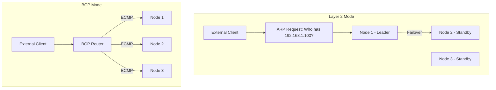
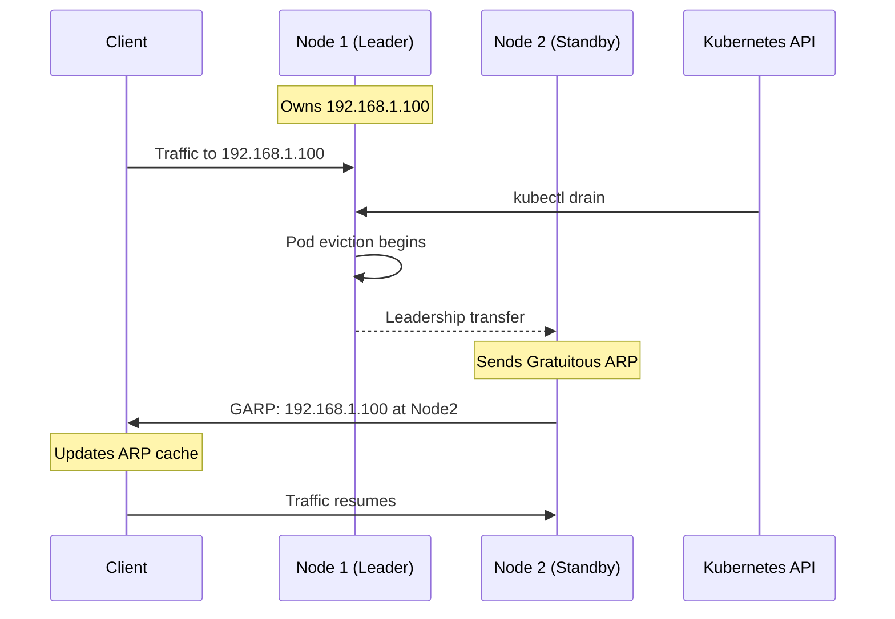
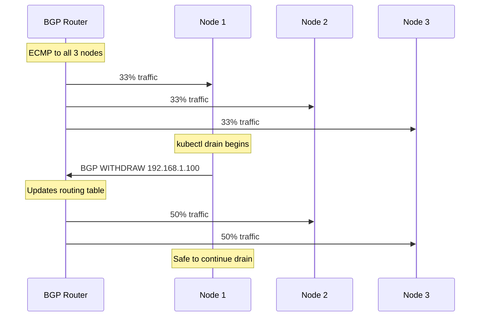
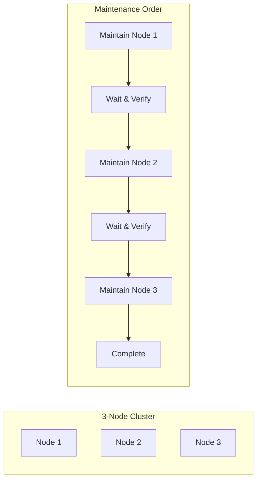

# How to Handle MetalLB During Kubernetes Node Maintenance

Author: [nawazdhandala](https://github.com/nawazdhandala)

Tags: MetalLB, Kubernetes, Maintenance, Node Draining, High Availability, Operations, Load Balancing

Description: Learn how to handle MetalLB during Kubernetes node maintenance with graceful draining and IP address migration.

---

MetalLB provides load balancer services for bare-metal Kubernetes clusters, but node maintenance requires careful planning to avoid service disruptions. This guide covers graceful draining strategies and IP address migration techniques that ensure continuous availability during maintenance windows.

## Understanding MetalLB Architecture

MetalLB operates in two modes, each with different maintenance considerations:

### Layer 2 Mode

In Layer 2 mode, one node "owns" each service IP and responds to ARP requests. When that node goes down, another node takes over the IP.

### BGP Mode

In BGP mode, all nodes advertise the service IP to BGP peers. Traffic is distributed across multiple nodes based on ECMP (Equal-Cost Multi-Path) routing.

The following diagram illustrates how MetalLB handles traffic in both modes:



## Pre-Maintenance Checklist

Before starting any node maintenance, verify your MetalLB configuration and cluster health.

Check MetalLB speaker pods are running on all nodes:

```bash
kubectl get pods -n metallb-system -o wide
```

Verify IP address pool status:

```bash
kubectl get ipaddresspools -n metallb-system
```

Check which node currently owns each LoadBalancer service IP (Layer 2 mode):

```bash
kubectl get svc -A -o wide | grep LoadBalancer
```

Identify the speaker pod logs to see current IP assignments:

```bash
kubectl logs -n metallb-system -l app=metallb,component=speaker --tail=50
```

## Layer 2 Mode Maintenance

### Understanding Leader Election

In Layer 2 mode, MetalLB uses leader election to determine which node responds to ARP/NDP requests for each service IP. Only one node at a time "owns" each IP address.

Check current leader for each service:

```bash
kubectl describe configmap -n metallb-system metallb-state
```

Or parse speaker logs for ownership information:

```bash
kubectl logs -n metallb-system -l component=speaker | grep "assuming leadership"
```

### Graceful Node Drain for Layer 2

When draining a node that owns service IPs, MetalLB automatically fails over to another node. However, the failover causes a brief disruption (typically 1-3 seconds).

The following diagram shows the Layer 2 failover process during node drain:



Execute the drain with appropriate flags:

```bash
kubectl drain <node-name> \
  --ignore-daemonsets \
  --delete-emptydir-data \
  --grace-period=60
```

### Forcing IP Migration Before Drain

To minimize disruption, you can force IP migration before draining by cordoning the node and waiting for MetalLB to reassign IPs.

Step 1: Cordon the node to prevent new pods from being scheduled:

```bash
kubectl cordon <node-name>
```

Step 2: Delete the MetalLB speaker pod on the target node to trigger immediate failover:

```bash
kubectl delete pod -n metallb-system -l component=speaker \
  --field-selector spec.nodeName=<node-name>
```

Step 3: Wait for the speaker pod to be recreated and IPs to fail over:

```bash
kubectl wait --for=condition=ready pod \
  -n metallb-system \
  -l component=speaker \
  --field-selector spec.nodeName=<node-name> \
  --timeout=60s
```

Step 4: Verify IPs have moved by checking speaker logs:

```bash
kubectl logs -n metallb-system -l component=speaker --tail=20 | grep -E "(leader|announcing)"
```

Step 5: Now proceed with the drain:

```bash
kubectl drain <node-name> \
  --ignore-daemonsets \
  --delete-emptydir-data \
  --grace-period=60
```

### Post-Maintenance Recovery for Layer 2

After maintenance is complete, bring the node back into the cluster:

```bash
kubectl uncordon <node-name>
```

Verify the speaker pod is running:

```bash
kubectl get pods -n metallb-system -o wide | grep <node-name>
```

The node will participate in leader election again but won't immediately take over IPs. IPs only migrate when the current leader fails or is drained.

## BGP Mode Maintenance

BGP mode provides more graceful traffic handling during maintenance because multiple nodes advertise each IP.

### Understanding BGP Route Withdrawal

When a node is drained, MetalLB withdraws its BGP routes, and upstream routers remove the node from ECMP paths. This process is typically faster and more graceful than Layer 2 failover.

The following diagram illustrates the BGP route withdrawal process:



### Graceful BGP Drain Procedure

Step 1: Check current BGP session status:

```bash
kubectl exec -n metallb-system -it \
  $(kubectl get pods -n metallb-system -l component=speaker -o jsonpath='{.items[0].metadata.name}') \
  -- birdcl show protocols
```

Step 2: Cordon the node:

```bash
kubectl cordon <node-name>
```

Step 3: Delete speaker pod to withdraw BGP routes immediately:

```bash
kubectl delete pod -n metallb-system -l component=speaker \
  --field-selector spec.nodeName=<node-name>
```

Step 4: Wait for BGP convergence (typically 5-30 seconds depending on router configuration):

```bash
sleep 30
```

Step 5: Proceed with drain:

```bash
kubectl drain <node-name> \
  --ignore-daemonsets \
  --delete-emptydir-data \
  --grace-period=60
```

### BGP Peer Configuration for Faster Failover

Configure BGP peers with shorter hold times for faster failover. Update the BGPPeer resource:

```yaml
apiVersion: metallb.io/v1beta2
kind: BGPPeer
metadata:
  name: router-peer
  namespace: metallb-system
spec:
  myASN: 64500
  peerASN: 64501
  peerAddress: 10.0.0.1
  holdTime: 30s
  keepaliveTime: 10s
```

For aggressive failover (may impact stability), reduce times further:

```yaml
apiVersion: metallb.io/v1beta2
kind: BGPPeer
metadata:
  name: router-peer-fast
  namespace: metallb-system
spec:
  myASN: 64500
  peerASN: 64501
  peerAddress: 10.0.0.1
  holdTime: 9s
  keepaliveTime: 3s
```

### BFD (Bidirectional Forwarding Detection) for Sub-Second Failover

Enable BFD for the fastest possible failover (requires router support):

```yaml
apiVersion: metallb.io/v1beta2
kind: BGPPeer
metadata:
  name: router-peer-bfd
  namespace: metallb-system
spec:
  myASN: 64500
  peerASN: 64501
  peerAddress: 10.0.0.1
  bfdProfile: fast-failover
---
apiVersion: metallb.io/v1beta1
kind: BFDProfile
metadata:
  name: fast-failover
  namespace: metallb-system
spec:
  receiveInterval: 300
  transmitInterval: 300
  detectMultiplier: 3
  echoMode: false
  passiveMode: false
  minimumTtl: 254
```

## Automating Maintenance with Scripts

### Pre-Drain Script

Create a script that handles all pre-drain tasks:

```bash
#!/bin/bash
set -euo pipefail

NODE_NAME="${1:?Usage: pre-drain.sh <node-name>}"
METALLB_NAMESPACE="metallb-system"

echo "Starting pre-drain procedure for node: ${NODE_NAME}"

echo "Step 1: Cordoning node..."
kubectl cordon "${NODE_NAME}"

echo "Step 2: Getting current service IPs owned by this node..."
OWNED_IPS=$(kubectl logs -n "${METALLB_NAMESPACE}" -l component=speaker \
  --field-selector spec.nodeName="${NODE_NAME}" \
  | grep "announcing" | tail -10)
echo "${OWNED_IPS}"

echo "Step 3: Deleting speaker pod to trigger failover..."
kubectl delete pod -n "${METALLB_NAMESPACE}" -l component=speaker \
  --field-selector spec.nodeName="${NODE_NAME}" \
  --wait=true

echo "Step 4: Waiting for new speaker pod..."
sleep 10
kubectl wait --for=condition=ready pod \
  -n "${METALLB_NAMESPACE}" \
  -l component=speaker \
  --field-selector spec.nodeName="${NODE_NAME}" \
  --timeout=120s

echo "Step 5: Verifying IP failover..."
sleep 5
NEW_OWNERS=$(kubectl logs -n "${METALLB_NAMESPACE}" -l component=speaker \
  | grep "announcing" | tail -20)
echo "${NEW_OWNERS}"

echo "Pre-drain complete. Node ${NODE_NAME} is ready for drain."
echo "Run: kubectl drain ${NODE_NAME} --ignore-daemonsets --delete-emptydir-data"
```

### Full Maintenance Script

A comprehensive maintenance script for MetalLB-aware node maintenance:

```bash
#!/bin/bash
set -euo pipefail

NODE_NAME="${1:?Usage: maintain-node.sh <node-name>}"
DRAIN_TIMEOUT="${2:-300}"
METALLB_NAMESPACE="metallb-system"

log() {
    echo "[$(date '+%Y-%m-%d %H:%M:%S')] $*"
}

check_metallb_mode() {
    if kubectl get bgppeers -n "${METALLB_NAMESPACE}" &>/dev/null; then
        if [ "$(kubectl get bgppeers -n "${METALLB_NAMESPACE}" -o name | wc -l)" -gt 0 ]; then
            echo "bgp"
            return
        fi
    fi
    echo "l2"
}

wait_for_ip_migration() {
    local mode=$1
    local wait_time=5

    if [ "${mode}" = "bgp" ]; then
        wait_time=30
        log "BGP mode detected. Waiting ${wait_time}s for route convergence..."
    else
        log "Layer 2 mode detected. Waiting ${wait_time}s for ARP propagation..."
    fi

    sleep "${wait_time}"
}

main() {
    log "Starting maintenance for node: ${NODE_NAME}"

    local mode
    mode=$(check_metallb_mode)
    log "MetalLB mode: ${mode}"

    log "Cordoning node..."
    kubectl cordon "${NODE_NAME}"

    log "Recording current speaker pod..."
    local speaker_pod
    speaker_pod=$(kubectl get pods -n "${METALLB_NAMESPACE}" -l component=speaker \
      --field-selector spec.nodeName="${NODE_NAME}" -o name 2>/dev/null || echo "")

    if [ -n "${speaker_pod}" ]; then
        log "Deleting speaker pod to trigger IP migration..."
        kubectl delete "${speaker_pod}" -n "${METALLB_NAMESPACE}" --wait=true

        log "Waiting for speaker pod recreation..."
        sleep 10
        kubectl wait --for=condition=ready pod \
          -n "${METALLB_NAMESPACE}" \
          -l component=speaker \
          --timeout=120s || true

        wait_for_ip_migration "${mode}"
    else
        log "No speaker pod found on node (may be a control plane node)"
    fi

    log "Draining node..."
    kubectl drain "${NODE_NAME}" \
      --ignore-daemonsets \
      --delete-emptydir-data \
      --grace-period=60 \
      --timeout="${DRAIN_TIMEOUT}s"

    log "Drain complete. Node ${NODE_NAME} is ready for maintenance."
    log "After maintenance, run: kubectl uncordon ${NODE_NAME}"
}

main
```

### Post-Maintenance Verification Script

Verify cluster health after maintenance:

```bash
#!/bin/bash
set -euo pipefail

METALLB_NAMESPACE="metallb-system"

log() {
    echo "[$(date '+%Y-%m-%d %H:%M:%S')] $*"
}

main() {
    log "Checking MetalLB health..."

    log "Speaker pods status:"
    kubectl get pods -n "${METALLB_NAMESPACE}" -l component=speaker -o wide

    log "Controller pods status:"
    kubectl get pods -n "${METALLB_NAMESPACE}" -l component=controller -o wide

    log "LoadBalancer services:"
    kubectl get svc -A -o wide | grep -E "^NAMESPACE|LoadBalancer"

    log "IP Address Pool status:"
    kubectl get ipaddresspools -n "${METALLB_NAMESPACE}" -o yaml

    log "Recent speaker events:"
    kubectl get events -n "${METALLB_NAMESPACE}" \
      --sort-by='.lastTimestamp' \
      --field-selector reason!=Normal \
      | tail -20

    log "Checking for pending LoadBalancer services..."
    PENDING=$(kubectl get svc -A -o json | \
      jq -r '.items[] | select(.spec.type=="LoadBalancer" and (.status.loadBalancer.ingress == null or .status.loadBalancer.ingress == [])) | "\(.metadata.namespace)/\(.metadata.name)"')

    if [ -n "${PENDING}" ]; then
        log "WARNING: Services without assigned IPs:"
        echo "${PENDING}"
    else
        log "All LoadBalancer services have assigned IPs"
    fi
}

main
```

## Pod Disruption Budgets for MetalLB

Create PDBs to ensure MetalLB components remain available during maintenance.

PDB for the speaker DaemonSet (ensure at least one speaker per zone for HA):

```yaml
apiVersion: policy/v1
kind: PodDisruptionBudget
metadata:
  name: metallb-speaker-pdb
  namespace: metallb-system
spec:
  maxUnavailable: 1
  selector:
    matchLabels:
      app: metallb
      component: speaker
```

PDB for the controller Deployment:

```yaml
apiVersion: policy/v1
kind: PodDisruptionBudget
metadata:
  name: metallb-controller-pdb
  namespace: metallb-system
spec:
  minAvailable: 1
  selector:
    matchLabels:
      app: metallb
      component: controller
```

## Handling IP Address Pool Exhaustion

During maintenance, temporary IP address conflicts can occur. Configure adequate address pools.

Create a larger IP pool with proper sizing:

```yaml
apiVersion: metallb.io/v1beta1
kind: IPAddressPool
metadata:
  name: production-pool
  namespace: metallb-system
spec:
  addresses:
  - 192.168.1.100-192.168.1.200
  autoAssign: true
  avoidBuggyIPs: true
```

Monitor IP pool usage:

```bash
kubectl get svc -A -o json | \
  jq -r '.items[] | select(.spec.type=="LoadBalancer") | .status.loadBalancer.ingress[0].ip' | \
  sort | uniq -c | sort -rn
```

## Monitoring MetalLB During Maintenance

### Prometheus Metrics

Key metrics to watch during maintenance:

```yaml
apiVersion: monitoring.coreos.com/v1
kind: PrometheusRule
metadata:
  name: metallb-maintenance-alerts
  namespace: monitoring
spec:
  groups:
  - name: metallb-maintenance
    rules:
    - alert: MetalLBSpeakerDown
      expr: |
        absent(up{job="metallb-speaker"} == 1)
      for: 1m
      labels:
        severity: critical
      annotations:
        summary: "MetalLB speaker is down"
        description: "MetalLB speaker pod is not running"

    - alert: MetalLBIPNotAdvertised
      expr: |
        metallb_bgp_announced_prefixes_total == 0
      for: 2m
      labels:
        severity: warning
      annotations:
        summary: "No BGP prefixes announced"
        description: "MetalLB is not advertising any BGP prefixes"

    - alert: MetalLBBGPSessionDown
      expr: |
        metallb_bgp_session_up == 0
      for: 1m
      labels:
        severity: critical
      annotations:
        summary: "BGP session down"
        description: "MetalLB BGP session to peer {{ $labels.peer }} is down"
```

### Grafana Dashboard Queries

Monitor MetalLB during maintenance with these queries:

Speaker pod status across nodes:

```promql
count by (node) (
  kube_pod_info{namespace="metallb-system", pod=~"speaker.*"}
  * on (pod) group_left()
  kube_pod_status_phase{phase="Running"}
)
```

BGP session status:

```promql
metallb_bgp_session_up
```

Announced prefixes per node:

```promql
sum by (node) (metallb_bgp_announced_prefixes_total)
```

## Rolling Maintenance Strategy

When maintaining multiple nodes, follow a rolling strategy to maintain service availability.

The following diagram shows the recommended rolling maintenance order:



Rolling maintenance script for multiple nodes:

```bash
#!/bin/bash
set -euo pipefail

NODES=("$@")
WAIT_BETWEEN_NODES=300
METALLB_NAMESPACE="metallb-system"

log() {
    echo "[$(date '+%Y-%m-%d %H:%M:%S')] $*"
}

verify_cluster_health() {
    log "Verifying cluster health..."

    local unhealthy_speakers
    unhealthy_speakers=$(kubectl get pods -n "${METALLB_NAMESPACE}" -l component=speaker \
      --field-selector status.phase!=Running -o name | wc -l)

    if [ "${unhealthy_speakers}" -gt 0 ]; then
        log "ERROR: ${unhealthy_speakers} unhealthy speaker pods"
        return 1
    fi

    local pending_svc
    pending_svc=$(kubectl get svc -A -o json | \
      jq '[.items[] | select(.spec.type=="LoadBalancer" and (.status.loadBalancer.ingress == null or .status.loadBalancer.ingress == []))] | length')

    if [ "${pending_svc}" -gt 0 ]; then
        log "ERROR: ${pending_svc} services without IPs"
        return 1
    fi

    log "Cluster health verified"
    return 0
}

maintain_node() {
    local node=$1

    log "Starting maintenance for: ${node}"

    kubectl cordon "${node}"

    kubectl delete pod -n "${METALLB_NAMESPACE}" -l component=speaker \
      --field-selector spec.nodeName="${node}" --wait=true 2>/dev/null || true

    sleep 30

    kubectl drain "${node}" \
      --ignore-daemonsets \
      --delete-emptydir-data \
      --grace-period=60 \
      --timeout=300s

    log "Node ${node} drained. Perform maintenance now..."
    read -r -p "Press Enter when maintenance is complete..."

    kubectl uncordon "${node}"

    log "Waiting for node to be ready..."
    kubectl wait --for=condition=ready node "${node}" --timeout=300s

    sleep 30
}

main() {
    if [ ${#NODES[@]} -eq 0 ]; then
        echo "Usage: rolling-maintain.sh <node1> [node2] [node3] ..."
        exit 1
    fi

    log "Planning maintenance for ${#NODES[@]} nodes: ${NODES[*]}"

    verify_cluster_health || exit 1

    for node in "${NODES[@]}"; do
        maintain_node "${node}"

        log "Waiting ${WAIT_BETWEEN_NODES}s before next node..."
        sleep "${WAIT_BETWEEN_NODES}"

        verify_cluster_health || {
            log "Cluster health check failed. Stopping maintenance."
            exit 1
        }
    done

    log "Rolling maintenance complete for all nodes"
}

main
```

## Handling Emergency Maintenance

For emergency maintenance where graceful draining is not possible, use these procedures.

### Force Failover for Layer 2

When you need immediate IP migration:

```bash
kubectl delete pod -n metallb-system -l component=speaker \
  --field-selector spec.nodeName=<failing-node> \
  --force --grace-period=0
```

### Force BGP Route Withdrawal

Force immediate route withdrawal:

```bash
kubectl delete pod -n metallb-system -l component=speaker \
  --field-selector spec.nodeName=<failing-node> \
  --force --grace-period=0
```

Then cordon and drain with force:

```bash
kubectl cordon <failing-node>
kubectl drain <failing-node> \
  --ignore-daemonsets \
  --delete-emptydir-data \
  --force \
  --grace-period=0
```

## Best Practices Summary

### Before Maintenance

- Always cordon nodes before deleting speaker pods
- Check which services are affected before draining
- Verify PDBs are in place for critical workloads
- Ensure adequate IP address pool capacity

### During Maintenance

- Monitor service accessibility during the maintenance window
- Use rolling maintenance for multi-node updates
- Wait for convergence between node maintenance
- Keep communication channels open with stakeholders

### After Maintenance

- Verify all speaker pods are running
- Check that all LoadBalancer services have IPs assigned
- Confirm BGP sessions are established (BGP mode)
- Run health verification scripts

### Configuration Recommendations

For Layer 2 mode, spread services across multiple pools to minimize impact:

```yaml
apiVersion: metallb.io/v1beta1
kind: L2Advertisement
metadata:
  name: production-l2
  namespace: metallb-system
spec:
  ipAddressPools:
  - production-pool
  nodeSelectors:
  - matchLabels:
      node-role.kubernetes.io/worker: ""
```

For BGP mode, enable BFD when supported:

```yaml
apiVersion: metallb.io/v1beta2
kind: BGPPeer
metadata:
  name: router-peer
  namespace: metallb-system
spec:
  myASN: 64500
  peerASN: 64501
  peerAddress: 10.0.0.1
  bfdProfile: production
```

---

Handling MetalLB during Kubernetes node maintenance requires understanding the underlying protocol (Layer 2 vs BGP), planning IP migration strategies, and implementing proper monitoring. By following the graceful draining procedures and automation scripts outlined in this guide, you can minimize service disruptions and maintain high availability during maintenance windows. Always test your maintenance procedures in staging environments before applying them to production clusters.
