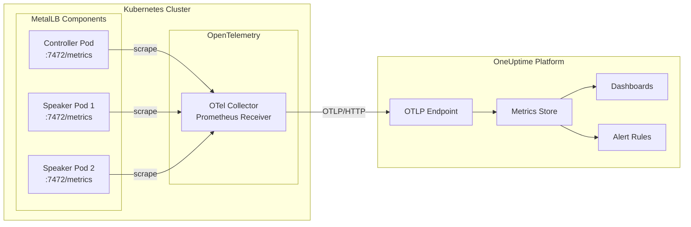
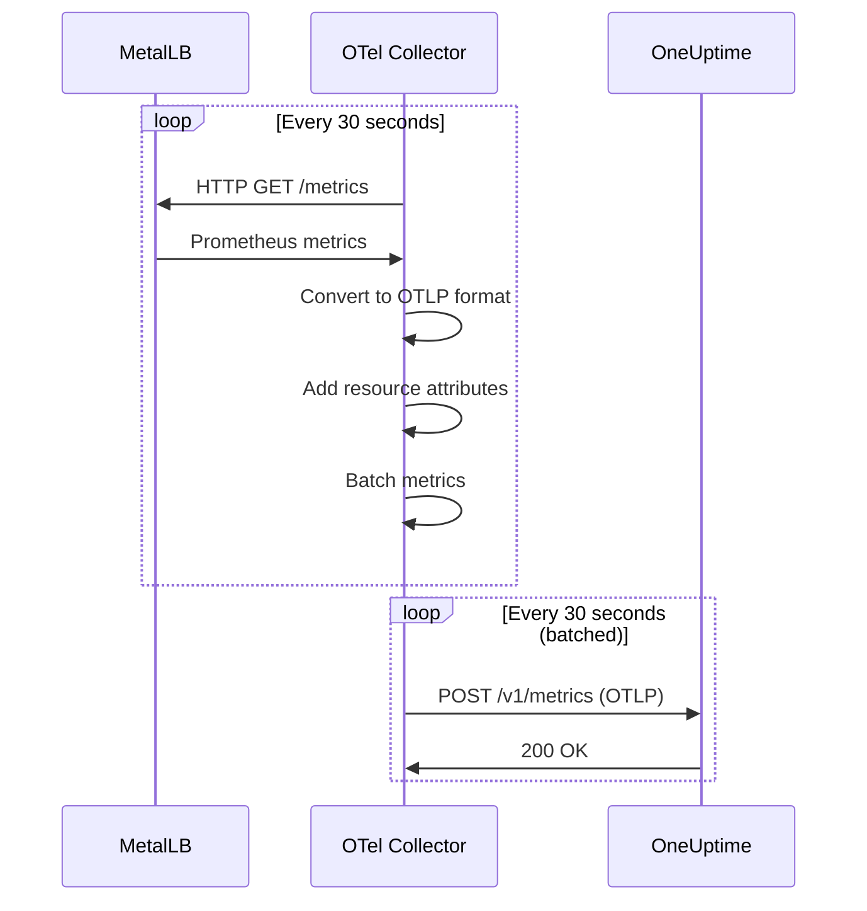
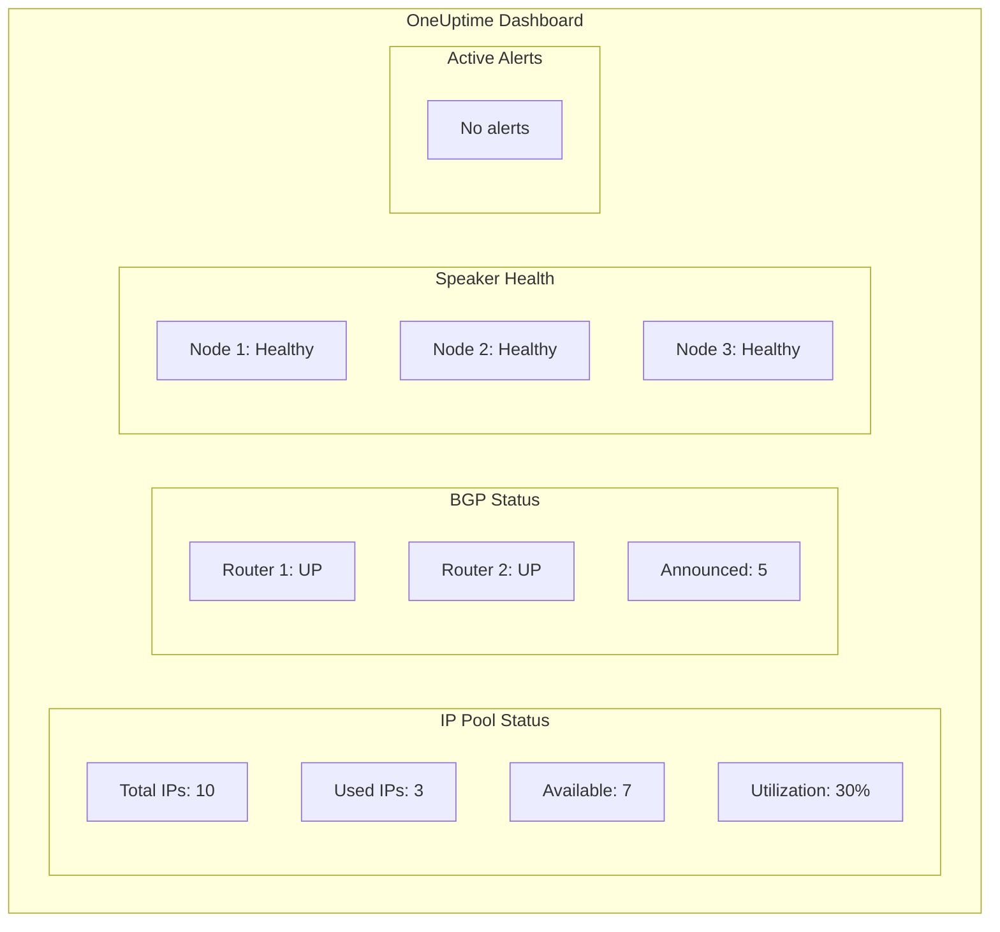

# How to Integrate MetalLB Metrics with OneUptime

Author: [nawazdhandala](https://github.com/nawazdhandala)

Tags: MetalLB, OneUptime, Monitoring, Observability, Kubernetes, Metrics, Load Balancing

Description: Learn how to integrate MetalLB metrics with OneUptime for centralized observability and load balancer health monitoring.

---

MetalLB is the backbone of external load balancing in bare-metal Kubernetes clusters, but without proper monitoring, you are flying blind. When a LoadBalancer service fails to get an IP address or network advertisements stop working, you need immediate visibility. This guide shows you how to integrate MetalLB metrics with OneUptime for centralized observability and proactive alerting.

## Table of Contents

1. [Why Monitor MetalLB](#why-monitor-metallb)
2. [Understanding MetalLB Metrics](#understanding-metallb-metrics)
3. [Architecture Overview](#architecture-overview)
4. [Enabling MetalLB Metrics](#enabling-metallb-metrics)
5. [Deploying OpenTelemetry Collector](#deploying-opentelemetry-collector)
6. [Configuring Prometheus Receiver](#configuring-prometheus-receiver)
7. [Sending Metrics to OneUptime](#sending-metrics-to-oneuptime)
8. [Creating Dashboards in OneUptime](#creating-dashboards-in-oneuptime)
9. [Setting Up Alerts](#setting-up-alerts)
10. [Best Practices](#best-practices)

## Why Monitor MetalLB

MetalLB manages critical infrastructure that exposes your services to the outside world. When MetalLB has issues, your applications become unreachable. Key scenarios that require monitoring include:

- **IP Address Pool Exhaustion**: When all IPs in your pool are allocated, new LoadBalancer services stay pending
- **Speaker Failures**: If speaker pods crash, ARP/NDP announcements stop, and traffic routing fails
- **BGP Session Issues**: In BGP mode, session flaps can cause traffic blackholes
- **Configuration Drift**: Misconfigured address pools or advertisements can silently break networking

Without centralized monitoring, these issues may go unnoticed until users report outages.

## Understanding MetalLB Metrics

MetalLB exposes Prometheus metrics that provide deep visibility into its operation. Here are the key metrics you should track:

| Metric Name | Type | Description |
|-------------|------|-------------|
| `metallb_allocator_addresses_in_use_total` | Gauge | Number of IP addresses currently allocated |
| `metallb_allocator_addresses_total` | Gauge | Total IP addresses available in all pools |
| `metallb_bgp_session_up` | Gauge | BGP session status (1=up, 0=down) |
| `metallb_bgp_announced_prefixes_total` | Gauge | Number of prefixes announced via BGP |
| `metallb_bgp_updates_total` | Counter | Total BGP updates sent |
| `metallb_layer2_announcements_total` | Counter | Total Layer 2 announcements made |
| `metallb_k8s_client_updates_total` | Counter | Kubernetes API updates processed |
| `metallb_k8s_client_update_errors_total` | Counter | Kubernetes API update errors |

## Architecture Overview

The following diagram illustrates how metrics flow from MetalLB to OneUptime:



The integration uses:

1. **MetalLB's native Prometheus endpoints**: Both controller and speaker expose metrics on port 7472
2. **OpenTelemetry Collector**: Scrapes Prometheus metrics and converts them to OTLP format
3. **OneUptime OTLP Endpoint**: Receives and stores metrics for visualization and alerting

## Enabling MetalLB Metrics

By default, MetalLB exposes metrics on port 7472. You need to ensure the metrics port is accessible and optionally create a ServiceMonitor (if using Prometheus Operator) or configure direct scraping.

First, verify that MetalLB is exposing metrics. The following command checks if the controller is serving metrics:

```bash
# Port-forward to the MetalLB controller to verify metrics are available
kubectl port-forward -n metallb-system deploy/controller 7472:7472 &

# Fetch metrics from the controller (run in another terminal or wait a moment)
curl -s http://localhost:7472/metrics | grep metallb

# Example output:
# metallb_allocator_addresses_in_use_total{pool="default"} 3
# metallb_allocator_addresses_total{pool="default"} 10
```

If you installed MetalLB via Helm, you can enable dedicated metrics services for easier scraping. Update your MetalLB Helm values:

```yaml
# metallb-values.yaml
# Enable Prometheus metrics exposure for MetalLB components

controller:
  # Enable metrics endpoint on the controller
  metrics:
    enabled: true
    # Service configuration for metrics
    service:
      # Annotations for service discovery (optional for Prometheus Operator)
      annotations:
        prometheus.io/scrape: "true"
        prometheus.io/port: "7472"
      # Port for metrics service
      port: 7472

speaker:
  # Enable metrics endpoint on speakers
  metrics:
    enabled: true
    service:
      annotations:
        prometheus.io/scrape: "true"
        prometheus.io/port: "7472"
      port: 7472
  # FRR metrics (if using FRR mode for BGP)
  frr:
    enabled: false
    metricsPort: 7473
```

Apply the updated configuration:

```bash
# Upgrade MetalLB with metrics enabled
helm upgrade metallb metallb/metallb \
  --namespace metallb-system \
  --values metallb-values.yaml \
  --wait

# Verify the metrics services are created
kubectl get svc -n metallb-system
```

You should see services like `controller-metrics` and `speaker-metrics` that expose port 7472.

## Deploying OpenTelemetry Collector

The OpenTelemetry Collector acts as the bridge between MetalLB's Prometheus metrics and OneUptime. We will deploy it as a Deployment in the cluster.

Create a namespace for the OpenTelemetry Collector:

```bash
# Create namespace for OpenTelemetry components
kubectl create namespace opentelemetry
```

First, let's create the ConfigMap for the OpenTelemetry Collector configuration. This configuration defines how metrics are scraped from MetalLB and exported to OneUptime:

```yaml
# otel-collector-config.yaml
# OpenTelemetry Collector configuration for MetalLB metrics
apiVersion: v1
kind: ConfigMap
metadata:
  name: otel-collector-config
  namespace: opentelemetry
data:
  config.yaml: |
    # Receivers define how data gets into the collector
    receivers:
      # Prometheus receiver scrapes metrics from MetalLB endpoints
      prometheus:
        config:
          scrape_configs:
            # Scrape MetalLB controller metrics
            - job_name: 'metallb-controller'
              # Scrape interval - how often to collect metrics
              scrape_interval: 30s
              # Timeout for each scrape attempt
              scrape_timeout: 10s
              # Use Kubernetes service discovery to find the controller
              kubernetes_sd_configs:
                - role: pod
                  namespaces:
                    names:
                      - metallb-system
              # Relabel configurations to filter and label metrics
              relabel_configs:
                # Only scrape pods with the controller label
                - source_labels: [__meta_kubernetes_pod_label_app_kubernetes_io_component]
                  action: keep
                  regex: controller
                # Add pod name as a label
                - source_labels: [__meta_kubernetes_pod_name]
                  target_label: pod
                # Add namespace as a label
                - source_labels: [__meta_kubernetes_namespace]
                  target_label: namespace
                # Set the metrics path
                - target_label: __metrics_path__
                  replacement: /metrics
                # Set the correct port for scraping
                - source_labels: [__meta_kubernetes_pod_ip]
                  target_label: __address__
                  replacement: ${1}:7472

            # Scrape MetalLB speaker metrics from all speaker pods
            - job_name: 'metallb-speaker'
              scrape_interval: 30s
              scrape_timeout: 10s
              kubernetes_sd_configs:
                - role: pod
                  namespaces:
                    names:
                      - metallb-system
              relabel_configs:
                # Only scrape pods with the speaker label
                - source_labels: [__meta_kubernetes_pod_label_app_kubernetes_io_component]
                  action: keep
                  regex: speaker
                # Add the node name where the speaker runs
                - source_labels: [__meta_kubernetes_pod_node_name]
                  target_label: node
                # Add pod name as a label
                - source_labels: [__meta_kubernetes_pod_name]
                  target_label: pod
                # Add namespace as a label
                - source_labels: [__meta_kubernetes_namespace]
                  target_label: namespace
                # Set the metrics path
                - target_label: __metrics_path__
                  replacement: /metrics
                # Set the correct port for scraping
                - source_labels: [__meta_kubernetes_pod_ip]
                  target_label: __address__
                  replacement: ${1}:7472

    # Processors modify data as it passes through the collector
    processors:
      # Batch processor groups data for efficient export
      batch:
        # Send batches every 30 seconds
        send_batch_size: 1000
        timeout: 30s

      # Memory limiter prevents out-of-memory situations
      memory_limiter:
        # Check memory usage every second
        check_interval: 1s
        # Limit memory to 400MB
        limit_mib: 400
        # Start dropping data at 350MB to prevent OOM
        spike_limit_mib: 100

      # Resource processor adds common attributes to all metrics
      resource:
        attributes:
          # Add cluster identifier for multi-cluster setups
          - key: k8s.cluster.name
            value: "production-cluster"
            action: upsert
          # Add service name for identification in OneUptime
          - key: service.name
            value: "metallb"
            action: upsert

    # Exporters send data to external systems
    exporters:
      # OTLP HTTP exporter sends metrics to OneUptime
      otlphttp:
        # OneUptime OTLP endpoint
        endpoint: "https://otlp.oneuptime.com"
        headers:
          # Your OneUptime API token for authentication
          # Get this from OneUptime Dashboard > Settings > API Keys
          x-oneuptime-token: "${ONEUPTIME_TOKEN}"
        # Retry configuration for reliability
        retry_on_failure:
          enabled: true
          initial_interval: 5s
          max_interval: 30s
          max_elapsed_time: 300s

      # Debug exporter for troubleshooting (optional, can be removed in production)
      debug:
        verbosity: basic

    # Service section defines the data pipelines
    service:
      # Telemetry configuration for the collector itself
      telemetry:
        logs:
          level: info
        metrics:
          address: :8888

      # Pipelines connect receivers, processors, and exporters
      pipelines:
        # Metrics pipeline for MetalLB metrics
        metrics:
          receivers:
            - prometheus
          processors:
            - memory_limiter
            - resource
            - batch
          exporters:
            - otlphttp
            # Uncomment for debugging
            # - debug
```

Create a Secret to store your OneUptime token securely:

```bash
# Create secret with OneUptime API token
# Replace 'your-oneuptime-token' with your actual token from OneUptime
kubectl create secret generic oneuptime-credentials \
  --namespace opentelemetry \
  --from-literal=token='your-oneuptime-token'
```

Now deploy the OpenTelemetry Collector. The following Deployment runs the collector with the configuration we created:

```yaml
# otel-collector-deployment.yaml
# OpenTelemetry Collector Deployment for MetalLB metrics
apiVersion: apps/v1
kind: Deployment
metadata:
  name: otel-collector
  namespace: opentelemetry
  labels:
    app: otel-collector
spec:
  replicas: 1
  selector:
    matchLabels:
      app: otel-collector
  template:
    metadata:
      labels:
        app: otel-collector
    spec:
      # Service account with permissions to discover pods
      serviceAccountName: otel-collector
      containers:
        - name: otel-collector
          # Use the contrib image which includes the Prometheus receiver
          image: otel/opentelemetry-collector-contrib:0.96.0
          args:
            - "--config=/etc/otel-collector/config.yaml"
          ports:
            # Health check port
            - containerPort: 13133
              name: health
            # Metrics port for collector's own metrics
            - containerPort: 8888
              name: metrics
          env:
            # Inject OneUptime token from secret
            - name: ONEUPTIME_TOKEN
              valueFrom:
                secretKeyRef:
                  name: oneuptime-credentials
                  key: token
          resources:
            requests:
              cpu: 100m
              memory: 256Mi
            limits:
              cpu: 500m
              memory: 512Mi
          # Liveness probe ensures the collector is healthy
          livenessProbe:
            httpGet:
              path: /
              port: 13133
            initialDelaySeconds: 10
            periodSeconds: 30
          # Readiness probe ensures the collector is ready to receive traffic
          readinessProbe:
            httpGet:
              path: /
              port: 13133
            initialDelaySeconds: 5
            periodSeconds: 10
          volumeMounts:
            - name: config
              mountPath: /etc/otel-collector
      volumes:
        - name: config
          configMap:
            name: otel-collector-config
---
# Service account for the OpenTelemetry Collector
apiVersion: v1
kind: ServiceAccount
metadata:
  name: otel-collector
  namespace: opentelemetry
---
# ClusterRole with permissions to discover pods for Prometheus scraping
apiVersion: rbac.authorization.k8s.io/v1
kind: ClusterRole
metadata:
  name: otel-collector
rules:
  # Permissions needed for Kubernetes service discovery
  - apiGroups: [""]
    resources:
      - pods
      - nodes
      - services
      - endpoints
    verbs: ["get", "list", "watch"]
  - apiGroups: [""]
    resources:
      - configmaps
    verbs: ["get"]
  - apiGroups: ["discovery.k8s.io"]
    resources:
      - endpointslices
    verbs: ["get", "list", "watch"]
---
# ClusterRoleBinding to associate the service account with the role
apiVersion: rbac.authorization.k8s.io/v1
kind: ClusterRoleBinding
metadata:
  name: otel-collector
roleRef:
  apiGroup: rbac.authorization.k8s.io
  kind: ClusterRole
  name: otel-collector
subjects:
  - kind: ServiceAccount
    name: otel-collector
    namespace: opentelemetry
```

Apply the configurations:

```bash
# Apply the ConfigMap with collector configuration
kubectl apply -f otel-collector-config.yaml

# Apply the Deployment, ServiceAccount, and RBAC
kubectl apply -f otel-collector-deployment.yaml

# Verify the collector is running
kubectl get pods -n opentelemetry

# Check collector logs for any errors
kubectl logs -n opentelemetry -l app=otel-collector --tail=50
```

## Configuring Prometheus Receiver

The Prometheus receiver in the OpenTelemetry Collector is highly configurable. Here are some advanced configurations for specific use cases.

For scraping metrics via Kubernetes Services instead of direct pod IPs, use this alternative configuration:

```yaml
# Alternative scrape configuration using Kubernetes Services
receivers:
  prometheus:
    config:
      scrape_configs:
        # Service-based discovery for MetalLB controller
        - job_name: 'metallb-controller-svc'
          scrape_interval: 30s
          # Static configuration pointing to the service
          static_configs:
            - targets:
              # Service DNS name within the cluster
              - 'controller-metrics.metallb-system.svc.cluster.local:7472'
          relabel_configs:
            - target_label: component
              replacement: controller

        # Service-based discovery for MetalLB speakers
        # Note: This only works if you have a headless service for speakers
        - job_name: 'metallb-speaker-svc'
          scrape_interval: 30s
          kubernetes_sd_configs:
            - role: endpoints
              namespaces:
                names:
                  - metallb-system
          relabel_configs:
            # Keep only the speaker metrics endpoints
            - source_labels: [__meta_kubernetes_endpoints_name]
              action: keep
              regex: speaker-metrics
            # Add node name from endpoint
            - source_labels: [__meta_kubernetes_endpoint_node_name]
              target_label: node
```

For filtering specific metrics to reduce data volume and cost, add metric relabeling:

```yaml
# Metric relabeling to filter and transform metrics
receivers:
  prometheus:
    config:
      scrape_configs:
        - job_name: 'metallb-controller'
          scrape_interval: 30s
          kubernetes_sd_configs:
            - role: pod
              namespaces:
                names:
                  - metallb-system
          relabel_configs:
            - source_labels: [__meta_kubernetes_pod_label_app_kubernetes_io_component]
              action: keep
              regex: controller
            - source_labels: [__meta_kubernetes_pod_ip]
              target_label: __address__
              replacement: ${1}:7472
          # Metric relabeling happens after scraping
          metric_relabel_configs:
            # Keep only MetalLB-specific metrics
            - source_labels: [__name__]
              action: keep
              regex: 'metallb_.*'
            # Drop high-cardinality histogram buckets if not needed
            - source_labels: [__name__]
              action: drop
              regex: '.*_bucket'
            # Rename metrics for clarity in OneUptime
            - source_labels: [__name__]
              target_label: __name__
              regex: 'metallb_(.*)'
              replacement: 'lb_${1}'
```

## Sending Metrics to OneUptime

OneUptime accepts metrics via the OTLP (OpenTelemetry Protocol) endpoint. The collector configuration we created already includes the OTLP HTTP exporter. Here is what happens when metrics are sent:



To verify metrics are being received by OneUptime, you can temporarily enable the debug exporter. Update the collector configuration:

```yaml
# Enable debug exporter for troubleshooting
exporters:
  otlphttp:
    endpoint: "https://otlp.oneuptime.com"
    headers:
      x-oneuptime-token: "${ONEUPTIME_TOKEN}"

  # Debug exporter logs metrics to stdout
  debug:
    verbosity: detailed

service:
  pipelines:
    metrics:
      receivers:
        - prometheus
      processors:
        - memory_limiter
        - resource
        - batch
      exporters:
        - otlphttp
        - debug
```

After applying the updated configuration, check the collector logs:

```bash
# View collector logs to see metrics being processed
kubectl logs -n opentelemetry -l app=otel-collector -f

# You should see output like:
# Metric #0
# Descriptor:
#   Name: metallb_allocator_addresses_in_use_total
#   Description: Number of IP addresses in use
# NumberDataPoints #0
#   StartTimestamp: 2024-01-01 00:00:00 +0000 UTC
#   Timestamp: 2024-01-01 00:00:30 +0000 UTC
#   Value: 3
```

## Creating Dashboards in OneUptime

Once metrics are flowing into OneUptime, you can create dashboards to visualize MetalLB health. Here are the key visualizations to set up:

### IP Address Pool Utilization Dashboard

Create a dashboard showing IP address usage across your pools:

The following metrics should be displayed:

- **Total Available IPs**: `metallb_allocator_addresses_total`
- **IPs In Use**: `metallb_allocator_addresses_in_use_total`
- **Utilization Percentage**: Calculate as `(in_use / total) * 100`

Example query for pool utilization:

```
# PromQL-style query for IP utilization percentage
(metallb_allocator_addresses_in_use_total / metallb_allocator_addresses_total) * 100
```

### BGP Session Health Dashboard (for BGP mode)

If you are using MetalLB in BGP mode, monitor session health:

- **Session Status**: `metallb_bgp_session_up` (1 = up, 0 = down)
- **Announced Prefixes**: `metallb_bgp_announced_prefixes_total`
- **BGP Updates**: `metallb_bgp_updates_total` (rate over time)

### Speaker Pod Health Dashboard

Monitor the health of speaker pods across your cluster:

- **Layer 2 Announcements**: `metallb_layer2_announcements_total` (rate)
- **Kubernetes API Errors**: `metallb_k8s_client_update_errors_total`
- **Speaker Pod Count**: Number of healthy speaker pods



## Setting Up Alerts

Proactive alerting is essential for catching MetalLB issues before they impact users. Configure the following alerts in OneUptime:

### Alert: IP Pool Near Exhaustion

Alert when IP pool utilization exceeds 80%:

- **Metric**: `metallb_allocator_addresses_in_use_total / metallb_allocator_addresses_total`
- **Condition**: Greater than 0.8
- **Duration**: 5 minutes
- **Severity**: Warning

Alert when IP pool utilization exceeds 95%:

- **Metric**: Same as above
- **Condition**: Greater than 0.95
- **Duration**: 1 minute
- **Severity**: Critical

### Alert: BGP Session Down

Alert immediately when a BGP session goes down:

- **Metric**: `metallb_bgp_session_up`
- **Condition**: Equals 0
- **Duration**: 1 minute
- **Severity**: Critical

### Alert: Speaker Pod Down

Alert when speaker pods are not running on all nodes:

- **Metric**: Count of `metallb_layer2_announcements_total` grouped by node
- **Condition**: Less than expected node count
- **Duration**: 2 minutes
- **Severity**: Warning

### Alert: High Kubernetes API Error Rate

Alert when MetalLB experiences Kubernetes API errors:

- **Metric**: `rate(metallb_k8s_client_update_errors_total[5m])`
- **Condition**: Greater than 0
- **Duration**: 5 minutes
- **Severity**: Warning

Here is an example of how to configure an alert in OneUptime:

1. Navigate to **Telemetry** > **Metrics** in OneUptime
2. Search for `metallb_allocator_addresses_in_use_total`
3. Click on **Create Alert Rule**
4. Configure the threshold and notification settings
5. Link to your on-call schedule or notification channels

## Best Practices

### Metric Collection Best Practices

1. **Set appropriate scrape intervals**: 30 seconds is a good default for MetalLB metrics. Shorter intervals increase load without significant benefit.

2. **Use metric filtering**: Drop unnecessary metrics at the collector level to reduce storage costs and improve query performance.

3. **Add meaningful labels**: Include cluster name, environment, and region labels for multi-cluster deployments.

4. **Monitor the collector itself**: Set up alerts for collector health using its internal metrics on port 8888.

### Alert Configuration Best Practices

1. **Avoid alert fatigue**: Use appropriate thresholds and durations to prevent false positives.

2. **Create escalation policies**: Start with warning alerts that can be investigated during business hours, and critical alerts that trigger immediate response.

3. **Include runbook links**: Add links to troubleshooting documentation in alert descriptions.

4. **Test alerts regularly**: Periodically verify alerts are working by simulating failure conditions.

### High Availability Best Practices

For production environments, consider these configurations:

```yaml
# High-availability OpenTelemetry Collector configuration
apiVersion: apps/v1
kind: Deployment
metadata:
  name: otel-collector
  namespace: opentelemetry
spec:
  # Run multiple replicas for redundancy
  replicas: 2
  selector:
    matchLabels:
      app: otel-collector
  template:
    metadata:
      labels:
        app: otel-collector
    spec:
      # Spread pods across nodes
      affinity:
        podAntiAffinity:
          preferredDuringSchedulingIgnoredDuringExecution:
            - weight: 100
              podAffinityTerm:
                labelSelector:
                  matchLabels:
                    app: otel-collector
                topologyKey: kubernetes.io/hostname
      containers:
        - name: otel-collector
          image: otel/opentelemetry-collector-contrib:0.96.0
          resources:
            requests:
              cpu: 200m
              memory: 512Mi
            limits:
              cpu: 1000m
              memory: 1Gi
```

When running multiple collector replicas, use the target allocator to distribute scrape targets and avoid duplicate metrics:

```yaml
# Target allocator configuration for distributed scraping
# This requires the OpenTelemetry Operator
apiVersion: opentelemetry.io/v1alpha1
kind: OpenTelemetryCollector
metadata:
  name: metallb-metrics
  namespace: opentelemetry
spec:
  mode: statefulset
  replicas: 2
  targetAllocator:
    enabled: true
    prometheusCR:
      enabled: true
```

## Troubleshooting

### Metrics Not Appearing in OneUptime

Check the following:

1. **Verify collector is running**:

```bash
kubectl get pods -n opentelemetry
kubectl logs -n opentelemetry -l app=otel-collector
```

2. **Verify MetalLB metrics endpoint**:

```bash
kubectl port-forward -n metallb-system deploy/controller 7472:7472
curl http://localhost:7472/metrics | grep metallb
```

3. **Check OneUptime token**:

```bash
kubectl get secret oneuptime-credentials -n opentelemetry -o jsonpath='{.data.token}' | base64 -d
```

4. **Verify network connectivity**:

```bash
kubectl exec -n opentelemetry -it deploy/otel-collector -- wget -qO- https://otlp.oneuptime.com/v1/metrics
```

### High Memory Usage in Collector

If the collector uses excessive memory:

1. Reduce batch size and timeout in the batch processor
2. Enable the memory limiter processor
3. Filter unnecessary metrics using metric_relabel_configs

### Duplicate Metrics

If you see duplicate metrics, ensure only one collector replica is scraping each target, or use the target allocator for distributed collection.

## Conclusion

Integrating MetalLB metrics with OneUptime provides essential visibility into your Kubernetes load balancing infrastructure. With the OpenTelemetry Collector handling metric collection and transformation, you get a standardized, vendor-neutral approach to observability.

Key takeaways:

- MetalLB exposes critical metrics about IP allocation, BGP sessions, and Layer 2 announcements
- OpenTelemetry Collector bridges Prometheus metrics to OneUptime via OTLP
- Proactive alerting on pool exhaustion and session health prevents outages
- Proper filtering and batching optimizes cost and performance

By following this guide, you can monitor MetalLB health alongside your applications in OneUptime, creating a unified observability platform for your bare-metal Kubernetes infrastructure.

## Further Reading

- [MetalLB Official Documentation](https://metallb.universe.tf/)
- [OpenTelemetry Collector Documentation](https://opentelemetry.io/docs/collector/)
- [OneUptime Telemetry Documentation](https://oneuptime.com/docs/telemetry/overview)
- [Prometheus Receiver Configuration](https://github.com/open-telemetry/opentelemetry-collector-contrib/tree/main/receiver/prometheusreceiver)
