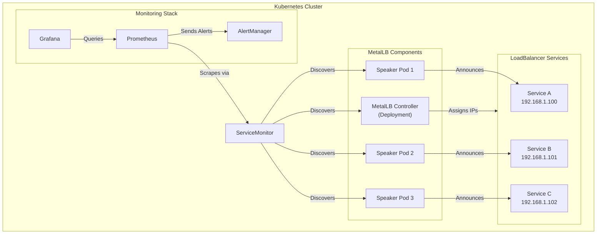
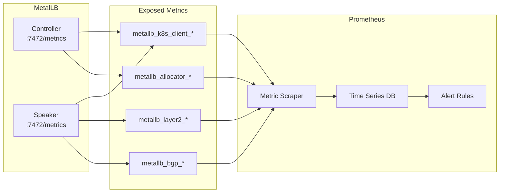
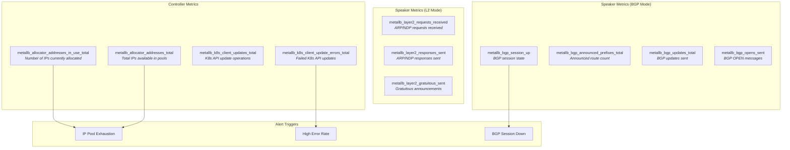
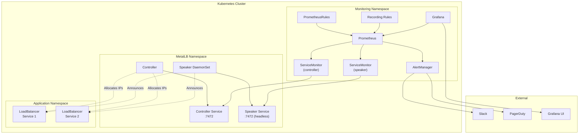

# How to Monitor MetalLB with Prometheus and Grafana

Author: [nawazdhandala](https://github.com/nawazdhandala)

Tags: MetalLB, Prometheus, Grafana, Monitoring, Kubernetes, Observability

Description: Learn how to monitor MetalLB health and performance using Prometheus and Grafana.

---

MetalLB is a popular bare-metal load balancer for Kubernetes clusters that provides network load balancing capabilities without the need for cloud provider integrations. While MetalLB is robust and reliable, monitoring its health and performance is crucial for maintaining a stable production environment. In this comprehensive guide, we will explore how to set up complete observability for MetalLB using Prometheus and Grafana.

## Table of Contents

1. [Understanding MetalLB Architecture](#understanding-metallb-architecture)
2. [MetalLB Metrics Overview](#metallb-metrics-overview)
3. [Enabling Metrics in MetalLB](#enabling-metrics-in-metallb)
4. [Setting Up Prometheus ServiceMonitor](#setting-up-prometheus-servicemonitor)
5. [Key Metrics to Monitor](#key-metrics-to-monitor)
6. [Creating Grafana Dashboards](#creating-grafana-dashboards)
7. [Setting Up Alerting Rules](#setting-up-alerting-rules)
8. [Best Practices](#best-practices)
9. [Troubleshooting](#troubleshooting)

## Understanding MetalLB Architecture

Before diving into monitoring, let's understand how MetalLB works and what components we need to monitor.

The following diagram illustrates the MetalLB monitoring architecture and how Prometheus and Grafana integrate with MetalLB components:



MetalLB consists of two main components:

- **Controller**: A deployment that handles IP address assignment for LoadBalancer services
- **Speaker**: A DaemonSet that runs on each node and announces the allocated IP addresses using either Layer 2 (ARP/NDP) or BGP protocols

## MetalLB Metrics Overview

MetalLB exposes several Prometheus metrics that provide insights into its operation. The following diagram shows the flow of metrics from MetalLB to your monitoring stack:



## Enabling Metrics in MetalLB

MetalLB exposes metrics on port 7472 by default. However, you need to ensure that the metrics endpoint is accessible and properly configured.

The following ConfigMap ensures MetalLB is configured correctly with metrics enabled. This configuration sets up an IP address pool for LoadBalancer services:

```yaml
# metallb-config.yaml
# This ConfigMap configures MetalLB with an address pool for LoadBalancer services
# Metrics are enabled by default on port 7472 for both controller and speaker
apiVersion: metallb.io/v1beta1
kind: IPAddressPool
metadata:
  name: production-pool
  namespace: metallb-system
spec:
  # Define the IP range that MetalLB can assign to LoadBalancer services
  addresses:
  - 192.168.1.100-192.168.1.200
---
# L2Advertisement configures MetalLB to use Layer 2 mode (ARP/NDP)
# This is the simplest mode and works with any network infrastructure
apiVersion: metallb.io/v1beta1
kind: L2Advertisement
metadata:
  name: l2-advertisement
  namespace: metallb-system
spec:
  # Reference the IP pool defined above
  ipAddressPools:
  - production-pool
```

To verify that metrics are exposed, you can port-forward to a MetalLB pod and check the metrics endpoint:

```bash
# Port-forward to the MetalLB controller to access its metrics endpoint
# This allows you to verify that metrics are being exposed correctly
kubectl port-forward -n metallb-system deployment/controller 7472:7472

# In another terminal, fetch the metrics to verify they're available
# You should see Prometheus-formatted metrics output
curl http://localhost:7472/metrics
```

## Setting Up Prometheus ServiceMonitor

To enable Prometheus to automatically discover and scrape MetalLB metrics, we need to create ServiceMonitor resources. These are Custom Resources used by the Prometheus Operator.

First, ensure you have a Service that exposes the metrics port for both the controller and speakers:

```yaml
# metallb-metrics-service.yaml
# This Service exposes the metrics endpoint for the MetalLB controller
# Prometheus will use this service for metric discovery and scraping
apiVersion: v1
kind: Service
metadata:
  name: controller-metrics
  namespace: metallb-system
  labels:
    # Labels are important for ServiceMonitor to discover this service
    app: metallb
    component: controller
spec:
  # ClusterIP is sufficient since Prometheus runs inside the cluster
  type: ClusterIP
  selector:
    # Match the controller pod labels
    app: metallb
    component: controller
  ports:
  - name: metrics
    port: 7472
    targetPort: 7472
    protocol: TCP
---
# This Service exposes metrics for all MetalLB speaker pods (DaemonSet)
# Each speaker pod on every node will be scraped individually
apiVersion: v1
kind: Service
metadata:
  name: speaker-metrics
  namespace: metallb-system
  labels:
    app: metallb
    component: speaker
spec:
  type: ClusterIP
  # ClusterIP: None creates a headless service
  # This allows Prometheus to discover and scrape each speaker pod individually
  clusterIP: None
  selector:
    app: metallb
    component: speaker
  ports:
  - name: metrics
    port: 7472
    targetPort: 7472
    protocol: TCP
```

Now create the ServiceMonitor resources that tell Prometheus how to scrape MetalLB:

```yaml
# metallb-servicemonitor.yaml
# ServiceMonitor for the MetalLB controller component
# This CR is used by Prometheus Operator to configure metric scraping
apiVersion: monitoring.coreos.com/v1
kind: ServiceMonitor
metadata:
  name: metallb-controller
  namespace: metallb-system
  labels:
    # These labels should match your Prometheus serviceMonitorSelector
    # Check your Prometheus CR to see what labels are required
    app: metallb
    release: prometheus
spec:
  # Selector to find the controller metrics service
  selector:
    matchLabels:
      app: metallb
      component: controller
  # Namespace where the service is located
  namespaceSelector:
    matchNames:
    - metallb-system
  # Define how to scrape the metrics endpoint
  endpoints:
  - port: metrics
    # Scrape metrics every 30 seconds
    interval: 30s
    # Path where metrics are exposed (default for MetalLB)
    path: /metrics
    # Honor labels from the target to avoid conflicts
    honorLabels: true
---
# ServiceMonitor for the MetalLB speaker DaemonSet
# This will scrape metrics from speaker pods on all nodes
apiVersion: monitoring.coreos.com/v1
kind: ServiceMonitor
metadata:
  name: metallb-speaker
  namespace: metallb-system
  labels:
    app: metallb
    release: prometheus
spec:
  selector:
    matchLabels:
      app: metallb
      component: speaker
  namespaceSelector:
    matchNames:
    - metallb-system
  endpoints:
  - port: metrics
    interval: 30s
    path: /metrics
    honorLabels: true
    # Add relabeling to include node information in metrics
    # This helps identify which node each speaker is running on
    relabelings:
    - sourceLabels: [__meta_kubernetes_pod_node_name]
      targetLabel: node
```

Apply the configurations:

```bash
# Apply the metrics services and ServiceMonitors
# These resources enable Prometheus to discover and scrape MetalLB
kubectl apply -f metallb-metrics-service.yaml
kubectl apply -f metallb-servicemonitor.yaml

# Verify that ServiceMonitors are created successfully
kubectl get servicemonitor -n metallb-system
```

Verify that Prometheus is discovering the targets:

```bash
# Port-forward to Prometheus to check the targets page
kubectl port-forward -n monitoring svc/prometheus-operated 9090:9090

# Open http://localhost:9090/targets in your browser
# You should see metallb-controller and metallb-speaker targets
```

## Key Metrics to Monitor

MetalLB exposes several important metrics. Here's a comprehensive overview:

The following diagram categorizes the key MetalLB metrics by component and importance:



### Controller Metrics

| Metric | Description | Type |
|--------|-------------|------|
| `metallb_allocator_addresses_in_use_total` | Number of IP addresses currently allocated | Gauge |
| `metallb_allocator_addresses_total` | Total number of IP addresses available in pools | Gauge |
| `metallb_k8s_client_updates_total` | Number of Kubernetes API updates | Counter |
| `metallb_k8s_client_update_errors_total` | Number of failed Kubernetes API updates | Counter |

### Speaker Metrics (Layer 2 Mode)

| Metric | Description | Type |
|--------|-------------|------|
| `metallb_layer2_requests_received` | Number of ARP/NDP requests received | Counter |
| `metallb_layer2_responses_sent` | Number of ARP/NDP responses sent | Counter |
| `metallb_layer2_gratuitous_sent` | Number of gratuitous announcements sent | Counter |

### Speaker Metrics (BGP Mode)

| Metric | Description | Type |
|--------|-------------|------|
| `metallb_bgp_session_up` | BGP session state (1 = up, 0 = down) | Gauge |
| `metallb_bgp_announced_prefixes_total` | Number of prefixes announced | Gauge |
| `metallb_bgp_updates_total` | Number of BGP updates sent | Counter |
| `metallb_bgp_opens_sent` | Number of BGP OPEN messages sent | Counter |

## Creating Grafana Dashboards

Now let's create comprehensive Grafana dashboards to visualize MetalLB metrics. The following JSON can be imported directly into Grafana:

```json
{
  "__comment": "MetalLB Monitoring Dashboard - Comprehensive view of MetalLB health and performance",
  "annotations": {
    "list": [
      {
        "builtIn": 1,
        "datasource": {
          "type": "grafana",
          "uid": "-- Grafana --"
        },
        "enable": true,
        "hide": true,
        "iconColor": "rgba(0, 211, 255, 1)",
        "name": "Annotations & Alerts",
        "type": "dashboard"
      }
    ]
  },
  "description": "Comprehensive monitoring dashboard for MetalLB load balancer",
  "editable": true,
  "fiscalYearStartMonth": 0,
  "graphTooltip": 0,
  "id": null,
  "links": [],
  "liveNow": false,
  "panels": [
    {
      "__comment": "Row 1: Overview Statistics",
      "collapsed": false,
      "gridPos": {
        "h": 1,
        "w": 24,
        "x": 0,
        "y": 0
      },
      "id": 1,
      "panels": [],
      "title": "Overview",
      "type": "row"
    },
    {
      "__comment": "Stat panel showing total IP addresses in use across all pools",
      "datasource": {
        "type": "prometheus",
        "uid": "${datasource}"
      },
      "fieldConfig": {
        "defaults": {
          "color": {
            "mode": "thresholds"
          },
          "mappings": [],
          "thresholds": {
            "mode": "absolute",
            "steps": [
              {
                "color": "green",
                "value": null
              },
              {
                "color": "yellow",
                "value": 80
              },
              {
                "color": "red",
                "value": 95
              }
            ]
          },
          "unit": "none"
        }
      },
      "gridPos": {
        "h": 4,
        "w": 6,
        "x": 0,
        "y": 1
      },
      "id": 2,
      "options": {
        "colorMode": "value",
        "graphMode": "none",
        "justifyMode": "auto",
        "orientation": "horizontal",
        "reduceOptions": {
          "calcs": ["lastNotNull"],
          "fields": "",
          "values": false
        },
        "textMode": "auto"
      },
      "targets": [
        {
          "expr": "sum(metallb_allocator_addresses_in_use_total)",
          "legendFormat": "IPs In Use",
          "refId": "A"
        }
      ],
      "title": "IPs In Use",
      "type": "stat"
    },
    {
      "__comment": "Stat panel showing total available IP addresses across all pools",
      "datasource": {
        "type": "prometheus",
        "uid": "${datasource}"
      },
      "fieldConfig": {
        "defaults": {
          "color": {
            "mode": "thresholds"
          },
          "mappings": [],
          "thresholds": {
            "mode": "absolute",
            "steps": [
              {
                "color": "green",
                "value": null
              }
            ]
          },
          "unit": "none"
        }
      },
      "gridPos": {
        "h": 4,
        "w": 6,
        "x": 6,
        "y": 1
      },
      "id": 3,
      "options": {
        "colorMode": "value",
        "graphMode": "none",
        "justifyMode": "auto",
        "orientation": "horizontal",
        "reduceOptions": {
          "calcs": ["lastNotNull"],
          "fields": "",
          "values": false
        }
      },
      "targets": [
        {
          "expr": "sum(metallb_allocator_addresses_total)",
          "legendFormat": "Total Available",
          "refId": "A"
        }
      ],
      "title": "Total IP Pool Size",
      "type": "stat"
    },
    {
      "__comment": "Gauge showing IP pool utilization percentage - critical for capacity planning",
      "datasource": {
        "type": "prometheus",
        "uid": "${datasource}"
      },
      "fieldConfig": {
        "defaults": {
          "color": {
            "mode": "thresholds"
          },
          "mappings": [],
          "max": 100,
          "min": 0,
          "thresholds": {
            "mode": "absolute",
            "steps": [
              {
                "color": "green",
                "value": null
              },
              {
                "color": "yellow",
                "value": 70
              },
              {
                "color": "orange",
                "value": 85
              },
              {
                "color": "red",
                "value": 95
              }
            ]
          },
          "unit": "percent"
        }
      },
      "gridPos": {
        "h": 4,
        "w": 6,
        "x": 12,
        "y": 1
      },
      "id": 4,
      "options": {
        "orientation": "auto",
        "reduceOptions": {
          "calcs": ["lastNotNull"],
          "fields": "",
          "values": false
        },
        "showThresholdLabels": false,
        "showThresholdMarkers": true
      },
      "targets": [
        {
          "expr": "(sum(metallb_allocator_addresses_in_use_total) / sum(metallb_allocator_addresses_total)) * 100",
          "legendFormat": "Utilization",
          "refId": "A"
        }
      ],
      "title": "IP Pool Utilization",
      "type": "gauge"
    },
    {
      "__comment": "Stat panel showing number of active BGP sessions (for BGP mode deployments)",
      "datasource": {
        "type": "prometheus",
        "uid": "${datasource}"
      },
      "fieldConfig": {
        "defaults": {
          "color": {
            "mode": "thresholds"
          },
          "mappings": [
            {
              "options": {
                "0": {
                  "color": "red",
                  "index": 1,
                  "text": "DOWN"
                },
                "1": {
                  "color": "green",
                  "index": 0,
                  "text": "UP"
                }
              },
              "type": "value"
            }
          ],
          "thresholds": {
            "mode": "absolute",
            "steps": [
              {
                "color": "green",
                "value": null
              }
            ]
          }
        }
      },
      "gridPos": {
        "h": 4,
        "w": 6,
        "x": 18,
        "y": 1
      },
      "id": 5,
      "options": {
        "colorMode": "value",
        "graphMode": "none",
        "justifyMode": "auto",
        "orientation": "horizontal",
        "reduceOptions": {
          "calcs": ["lastNotNull"],
          "fields": "",
          "values": false
        }
      },
      "targets": [
        {
          "expr": "sum(metallb_bgp_session_up)",
          "legendFormat": "BGP Sessions",
          "refId": "A"
        }
      ],
      "title": "BGP Sessions Up",
      "type": "stat"
    },
    {
      "__comment": "Row 2: IP Address Allocation Details",
      "collapsed": false,
      "gridPos": {
        "h": 1,
        "w": 24,
        "x": 0,
        "y": 5
      },
      "id": 6,
      "panels": [],
      "title": "IP Address Allocation",
      "type": "row"
    },
    {
      "__comment": "Time series graph showing IP allocation over time by pool",
      "datasource": {
        "type": "prometheus",
        "uid": "${datasource}"
      },
      "fieldConfig": {
        "defaults": {
          "color": {
            "mode": "palette-classic"
          },
          "custom": {
            "axisCenteredZero": false,
            "axisColorMode": "text",
            "axisLabel": "IP Addresses",
            "axisPlacement": "auto",
            "barAlignment": 0,
            "drawStyle": "line",
            "fillOpacity": 20,
            "gradientMode": "none",
            "hideFrom": {
              "legend": false,
              "tooltip": false,
              "viz": false
            },
            "lineInterpolation": "smooth",
            "lineWidth": 2,
            "pointSize": 5,
            "scaleDistribution": {
              "type": "linear"
            },
            "showPoints": "never",
            "spanNulls": false,
            "stacking": {
              "group": "A",
              "mode": "none"
            },
            "thresholdsStyle": {
              "mode": "off"
            }
          },
          "mappings": [],
          "thresholds": {
            "mode": "absolute",
            "steps": [
              {
                "color": "green",
                "value": null
              }
            ]
          },
          "unit": "none"
        }
      },
      "gridPos": {
        "h": 8,
        "w": 12,
        "x": 0,
        "y": 6
      },
      "id": 7,
      "options": {
        "legend": {
          "calcs": ["lastNotNull", "max"],
          "displayMode": "table",
          "placement": "bottom",
          "showLegend": true
        },
        "tooltip": {
          "mode": "multi",
          "sort": "none"
        }
      },
      "targets": [
        {
          "expr": "metallb_allocator_addresses_in_use_total",
          "legendFormat": "{{ pool }} - In Use",
          "refId": "A"
        },
        {
          "expr": "metallb_allocator_addresses_total",
          "legendFormat": "{{ pool }} - Total",
          "refId": "B"
        }
      ],
      "title": "IP Address Allocation Over Time",
      "type": "timeseries"
    },
    {
      "__comment": "Bar chart showing per-pool IP utilization for quick comparison",
      "datasource": {
        "type": "prometheus",
        "uid": "${datasource}"
      },
      "fieldConfig": {
        "defaults": {
          "color": {
            "mode": "thresholds"
          },
          "mappings": [],
          "max": 100,
          "min": 0,
          "thresholds": {
            "mode": "absolute",
            "steps": [
              {
                "color": "green",
                "value": null
              },
              {
                "color": "yellow",
                "value": 70
              },
              {
                "color": "red",
                "value": 90
              }
            ]
          },
          "unit": "percent"
        }
      },
      "gridPos": {
        "h": 8,
        "w": 12,
        "x": 12,
        "y": 6
      },
      "id": 8,
      "options": {
        "displayMode": "gradient",
        "minVizHeight": 10,
        "minVizWidth": 0,
        "orientation": "horizontal",
        "reduceOptions": {
          "calcs": ["lastNotNull"],
          "fields": "",
          "values": false
        },
        "showUnfilled": true
      },
      "targets": [
        {
          "expr": "(metallb_allocator_addresses_in_use_total / metallb_allocator_addresses_total) * 100",
          "legendFormat": "{{ pool }}",
          "refId": "A"
        }
      ],
      "title": "IP Pool Utilization by Pool",
      "type": "bargauge"
    },
    {
      "__comment": "Row 3: Layer 2 Mode Metrics",
      "collapsed": false,
      "gridPos": {
        "h": 1,
        "w": 24,
        "x": 0,
        "y": 14
      },
      "id": 9,
      "panels": [],
      "title": "Layer 2 Mode Metrics",
      "type": "row"
    },
    {
      "__comment": "Time series showing ARP/NDP request and response rates",
      "datasource": {
        "type": "prometheus",
        "uid": "${datasource}"
      },
      "fieldConfig": {
        "defaults": {
          "color": {
            "mode": "palette-classic"
          },
          "custom": {
            "axisCenteredZero": false,
            "axisColorMode": "text",
            "axisLabel": "Requests/sec",
            "axisPlacement": "auto",
            "barAlignment": 0,
            "drawStyle": "line",
            "fillOpacity": 10,
            "gradientMode": "none",
            "hideFrom": {
              "legend": false,
              "tooltip": false,
              "viz": false
            },
            "lineInterpolation": "smooth",
            "lineWidth": 2,
            "pointSize": 5,
            "scaleDistribution": {
              "type": "linear"
            },
            "showPoints": "never",
            "spanNulls": false,
            "stacking": {
              "group": "A",
              "mode": "none"
            },
            "thresholdsStyle": {
              "mode": "off"
            }
          },
          "mappings": [],
          "thresholds": {
            "mode": "absolute",
            "steps": [
              {
                "color": "green",
                "value": null
              }
            ]
          },
          "unit": "reqps"
        }
      },
      "gridPos": {
        "h": 8,
        "w": 12,
        "x": 0,
        "y": 15
      },
      "id": 10,
      "options": {
        "legend": {
          "calcs": ["mean", "max"],
          "displayMode": "table",
          "placement": "bottom",
          "showLegend": true
        },
        "tooltip": {
          "mode": "multi",
          "sort": "none"
        }
      },
      "targets": [
        {
          "expr": "rate(metallb_layer2_requests_received[5m])",
          "legendFormat": "{{ node }} - Requests Received",
          "refId": "A"
        },
        {
          "expr": "rate(metallb_layer2_responses_sent[5m])",
          "legendFormat": "{{ node }} - Responses Sent",
          "refId": "B"
        }
      ],
      "title": "Layer 2 ARP/NDP Activity",
      "type": "timeseries"
    },
    {
      "__comment": "Time series showing gratuitous ARP announcements per node",
      "datasource": {
        "type": "prometheus",
        "uid": "${datasource}"
      },
      "fieldConfig": {
        "defaults": {
          "color": {
            "mode": "palette-classic"
          },
          "custom": {
            "axisCenteredZero": false,
            "axisColorMode": "text",
            "axisLabel": "Announcements/sec",
            "axisPlacement": "auto",
            "barAlignment": 0,
            "drawStyle": "bars",
            "fillOpacity": 50,
            "gradientMode": "none",
            "hideFrom": {
              "legend": false,
              "tooltip": false,
              "viz": false
            },
            "lineInterpolation": "linear",
            "lineWidth": 1,
            "pointSize": 5,
            "scaleDistribution": {
              "type": "linear"
            },
            "showPoints": "never",
            "spanNulls": false,
            "stacking": {
              "group": "A",
              "mode": "normal"
            },
            "thresholdsStyle": {
              "mode": "off"
            }
          },
          "mappings": [],
          "thresholds": {
            "mode": "absolute",
            "steps": [
              {
                "color": "green",
                "value": null
              }
            ]
          },
          "unit": "short"
        }
      },
      "gridPos": {
        "h": 8,
        "w": 12,
        "x": 12,
        "y": 15
      },
      "id": 11,
      "options": {
        "legend": {
          "calcs": ["sum"],
          "displayMode": "table",
          "placement": "bottom",
          "showLegend": true
        },
        "tooltip": {
          "mode": "multi",
          "sort": "none"
        }
      },
      "targets": [
        {
          "expr": "rate(metallb_layer2_gratuitous_sent[5m])",
          "legendFormat": "{{ node }}",
          "refId": "A"
        }
      ],
      "title": "Gratuitous ARP Announcements",
      "type": "timeseries"
    },
    {
      "__comment": "Row 4: BGP Mode Metrics",
      "collapsed": false,
      "gridPos": {
        "h": 1,
        "w": 24,
        "x": 0,
        "y": 23
      },
      "id": 12,
      "panels": [],
      "title": "BGP Mode Metrics",
      "type": "row"
    },
    {
      "__comment": "State timeline showing BGP session status over time",
      "datasource": {
        "type": "prometheus",
        "uid": "${datasource}"
      },
      "fieldConfig": {
        "defaults": {
          "color": {
            "mode": "thresholds"
          },
          "mappings": [
            {
              "options": {
                "0": {
                  "color": "red",
                  "index": 0,
                  "text": "DOWN"
                },
                "1": {
                  "color": "green",
                  "index": 1,
                  "text": "UP"
                }
              },
              "type": "value"
            }
          ],
          "thresholds": {
            "mode": "absolute",
            "steps": [
              {
                "color": "red",
                "value": null
              },
              {
                "color": "green",
                "value": 1
              }
            ]
          }
        }
      },
      "gridPos": {
        "h": 6,
        "w": 24,
        "x": 0,
        "y": 24
      },
      "id": 13,
      "options": {
        "alignValue": "center",
        "legend": {
          "displayMode": "list",
          "placement": "bottom",
          "showLegend": true
        },
        "mergeValues": true,
        "rowHeight": 0.9,
        "showValue": "auto",
        "tooltip": {
          "mode": "single",
          "sort": "none"
        }
      },
      "targets": [
        {
          "expr": "metallb_bgp_session_up",
          "legendFormat": "{{ peer }} on {{ node }}",
          "refId": "A"
        }
      ],
      "title": "BGP Session Status",
      "type": "state-timeline"
    },
    {
      "__comment": "Time series showing BGP updates and announced prefixes",
      "datasource": {
        "type": "prometheus",
        "uid": "${datasource}"
      },
      "fieldConfig": {
        "defaults": {
          "color": {
            "mode": "palette-classic"
          },
          "custom": {
            "axisCenteredZero": false,
            "axisColorMode": "text",
            "axisLabel": "",
            "axisPlacement": "auto",
            "barAlignment": 0,
            "drawStyle": "line",
            "fillOpacity": 10,
            "gradientMode": "none",
            "hideFrom": {
              "legend": false,
              "tooltip": false,
              "viz": false
            },
            "lineInterpolation": "smooth",
            "lineWidth": 2,
            "pointSize": 5,
            "scaleDistribution": {
              "type": "linear"
            },
            "showPoints": "never",
            "spanNulls": false,
            "stacking": {
              "group": "A",
              "mode": "none"
            },
            "thresholdsStyle": {
              "mode": "off"
            }
          },
          "mappings": [],
          "thresholds": {
            "mode": "absolute",
            "steps": [
              {
                "color": "green",
                "value": null
              }
            ]
          },
          "unit": "short"
        }
      },
      "gridPos": {
        "h": 8,
        "w": 12,
        "x": 0,
        "y": 30
      },
      "id": 14,
      "options": {
        "legend": {
          "calcs": ["lastNotNull"],
          "displayMode": "table",
          "placement": "bottom",
          "showLegend": true
        },
        "tooltip": {
          "mode": "multi",
          "sort": "none"
        }
      },
      "targets": [
        {
          "expr": "metallb_bgp_announced_prefixes_total",
          "legendFormat": "{{ peer }} - Announced Prefixes",
          "refId": "A"
        }
      ],
      "title": "BGP Announced Prefixes",
      "type": "timeseries"
    },
    {
      "__comment": "Time series showing BGP message rates",
      "datasource": {
        "type": "prometheus",
        "uid": "${datasource}"
      },
      "fieldConfig": {
        "defaults": {
          "color": {
            "mode": "palette-classic"
          },
          "custom": {
            "axisCenteredZero": false,
            "axisColorMode": "text",
            "axisLabel": "Messages/sec",
            "axisPlacement": "auto",
            "barAlignment": 0,
            "drawStyle": "line",
            "fillOpacity": 10,
            "gradientMode": "none",
            "hideFrom": {
              "legend": false,
              "tooltip": false,
              "viz": false
            },
            "lineInterpolation": "smooth",
            "lineWidth": 2,
            "pointSize": 5,
            "scaleDistribution": {
              "type": "linear"
            },
            "showPoints": "never",
            "spanNulls": false,
            "stacking": {
              "group": "A",
              "mode": "none"
            },
            "thresholdsStyle": {
              "mode": "off"
            }
          },
          "mappings": [],
          "thresholds": {
            "mode": "absolute",
            "steps": [
              {
                "color": "green",
                "value": null
              }
            ]
          },
          "unit": "short"
        }
      },
      "gridPos": {
        "h": 8,
        "w": 12,
        "x": 12,
        "y": 30
      },
      "id": 15,
      "options": {
        "legend": {
          "calcs": ["mean", "max"],
          "displayMode": "table",
          "placement": "bottom",
          "showLegend": true
        },
        "tooltip": {
          "mode": "multi",
          "sort": "none"
        }
      },
      "targets": [
        {
          "expr": "rate(metallb_bgp_updates_total[5m])",
          "legendFormat": "{{ peer }} - Updates",
          "refId": "A"
        },
        {
          "expr": "rate(metallb_bgp_opens_sent[5m])",
          "legendFormat": "{{ peer }} - Opens",
          "refId": "B"
        }
      ],
      "title": "BGP Message Rate",
      "type": "timeseries"
    },
    {
      "__comment": "Row 5: Kubernetes Client Metrics",
      "collapsed": false,
      "gridPos": {
        "h": 1,
        "w": 24,
        "x": 0,
        "y": 38
      },
      "id": 16,
      "panels": [],
      "title": "Kubernetes Client Metrics",
      "type": "row"
    },
    {
      "__comment": "Time series showing K8s API update success and error rates",
      "datasource": {
        "type": "prometheus",
        "uid": "${datasource}"
      },
      "fieldConfig": {
        "defaults": {
          "color": {
            "mode": "palette-classic"
          },
          "custom": {
            "axisCenteredZero": false,
            "axisColorMode": "text",
            "axisLabel": "Updates/sec",
            "axisPlacement": "auto",
            "barAlignment": 0,
            "drawStyle": "line",
            "fillOpacity": 10,
            "gradientMode": "none",
            "hideFrom": {
              "legend": false,
              "tooltip": false,
              "viz": false
            },
            "lineInterpolation": "smooth",
            "lineWidth": 2,
            "pointSize": 5,
            "scaleDistribution": {
              "type": "linear"
            },
            "showPoints": "never",
            "spanNulls": false,
            "stacking": {
              "group": "A",
              "mode": "none"
            },
            "thresholdsStyle": {
              "mode": "off"
            }
          },
          "mappings": [],
          "thresholds": {
            "mode": "absolute",
            "steps": [
              {
                "color": "green",
                "value": null
              }
            ]
          },
          "unit": "short"
        }
      },
      "gridPos": {
        "h": 8,
        "w": 12,
        "x": 0,
        "y": 39
      },
      "id": 17,
      "options": {
        "legend": {
          "calcs": ["mean", "max"],
          "displayMode": "table",
          "placement": "bottom",
          "showLegend": true
        },
        "tooltip": {
          "mode": "multi",
          "sort": "none"
        }
      },
      "targets": [
        {
          "expr": "rate(metallb_k8s_client_updates_total[5m])",
          "legendFormat": "Updates",
          "refId": "A"
        },
        {
          "expr": "rate(metallb_k8s_client_update_errors_total[5m])",
          "legendFormat": "Errors",
          "refId": "B"
        }
      ],
      "title": "Kubernetes API Update Rate",
      "type": "timeseries"
    },
    {
      "__comment": "Gauge showing K8s API error rate percentage",
      "datasource": {
        "type": "prometheus",
        "uid": "${datasource}"
      },
      "fieldConfig": {
        "defaults": {
          "color": {
            "mode": "thresholds"
          },
          "mappings": [],
          "max": 100,
          "min": 0,
          "thresholds": {
            "mode": "absolute",
            "steps": [
              {
                "color": "green",
                "value": null
              },
              {
                "color": "yellow",
                "value": 1
              },
              {
                "color": "red",
                "value": 5
              }
            ]
          },
          "unit": "percent"
        }
      },
      "gridPos": {
        "h": 8,
        "w": 12,
        "x": 12,
        "y": 39
      },
      "id": 18,
      "options": {
        "orientation": "auto",
        "reduceOptions": {
          "calcs": ["lastNotNull"],
          "fields": "",
          "values": false
        },
        "showThresholdLabels": false,
        "showThresholdMarkers": true
      },
      "targets": [
        {
          "expr": "(rate(metallb_k8s_client_update_errors_total[5m]) / rate(metallb_k8s_client_updates_total[5m])) * 100",
          "legendFormat": "Error Rate",
          "refId": "A"
        }
      ],
      "title": "K8s API Error Rate",
      "type": "gauge"
    }
  ],
  "refresh": "30s",
  "schemaVersion": 38,
  "style": "dark",
  "tags": ["metallb", "kubernetes", "load-balancer"],
  "templating": {
    "list": [
      {
        "current": {
          "selected": false,
          "text": "Prometheus",
          "value": "Prometheus"
        },
        "hide": 0,
        "includeAll": false,
        "label": "Data Source",
        "multi": false,
        "name": "datasource",
        "options": [],
        "query": "prometheus",
        "refresh": 1,
        "regex": "",
        "skipUrlSync": false,
        "type": "datasource"
      }
    ]
  },
  "time": {
    "from": "now-1h",
    "to": "now"
  },
  "timepicker": {},
  "timezone": "",
  "title": "MetalLB Monitoring",
  "uid": "metallb-monitoring",
  "version": 1,
  "weekStart": ""
}
```

To import this dashboard into Grafana, you can use the Grafana API or the UI:

```bash
# Save the dashboard JSON to a file
# The dashboard JSON should be wrapped in a dashboard object for import
cat << 'EOF' > metallb-dashboard.json
{
  "dashboard": <paste-dashboard-json-here>,
  "overwrite": true
}
EOF

# Import using the Grafana API
# Replace GRAFANA_URL and API_KEY with your actual values
curl -X POST \
  -H "Content-Type: application/json" \
  -H "Authorization: Bearer ${GRAFANA_API_KEY}" \
  -d @metallb-dashboard.json \
  "${GRAFANA_URL}/api/dashboards/db"
```

Alternatively, you can use the Grafana ConfigMap approach for GitOps-style deployment:

```yaml
# grafana-dashboard-configmap.yaml
# This ConfigMap provisions the MetalLB dashboard to Grafana automatically
# Grafana's sidecar will detect this and load the dashboard
apiVersion: v1
kind: ConfigMap
metadata:
  name: metallb-grafana-dashboard
  namespace: monitoring
  labels:
    # This label is required for Grafana's sidecar to discover the dashboard
    # Adjust based on your Grafana sidecar configuration
    grafana_dashboard: "1"
data:
  # The filename becomes the dashboard title in Grafana's folder
  metallb-dashboard.json: |
    <paste-dashboard-json-here>
```

## Setting Up Alerting Rules

Alerting is critical for proactive monitoring. The following PrometheusRule resource defines comprehensive alerts for MetalLB:

```yaml
# metallb-alerts.yaml
# PrometheusRule defines alerting rules for MetalLB monitoring
# These rules are processed by Prometheus and trigger AlertManager notifications
apiVersion: monitoring.coreos.com/v1
kind: PrometheusRule
metadata:
  name: metallb-alerts
  namespace: metallb-system
  labels:
    # Labels should match your Prometheus ruleSelector
    app: metallb
    release: prometheus
spec:
  groups:
  # Group 1: IP Pool Alerts
  # These alerts monitor IP address pool capacity and utilization
  - name: metallb-ip-pool
    rules:
    # Alert when IP pool utilization exceeds 80%
    # This gives you time to add more IPs before exhaustion
    - alert: MetalLBIPPoolHighUtilization
      expr: |
        (
          sum by (pool) (metallb_allocator_addresses_in_use_total)
          /
          sum by (pool) (metallb_allocator_addresses_total)
        ) * 100 > 80
      for: 5m
      labels:
        severity: warning
      annotations:
        summary: "MetalLB IP pool {{ $labels.pool }} utilization is high"
        description: "IP pool {{ $labels.pool }} is {{ printf \"%.1f\" $value }}% utilized. Consider adding more IP addresses."
        runbook_url: "https://docs.example.com/runbooks/metallb-ip-pool-high"

    # Critical alert when IP pool is nearly exhausted (95%+)
    # Immediate action required to prevent service creation failures
    - alert: MetalLBIPPoolCritical
      expr: |
        (
          sum by (pool) (metallb_allocator_addresses_in_use_total)
          /
          sum by (pool) (metallb_allocator_addresses_total)
        ) * 100 > 95
      for: 2m
      labels:
        severity: critical
      annotations:
        summary: "MetalLB IP pool {{ $labels.pool }} is critically low"
        description: "IP pool {{ $labels.pool }} is {{ printf \"%.1f\" $value }}% utilized. New LoadBalancer services may fail to get IPs."
        runbook_url: "https://docs.example.com/runbooks/metallb-ip-pool-critical"

    # Alert when IP pool is completely exhausted
    - alert: MetalLBIPPoolExhausted
      expr: |
        sum by (pool) (metallb_allocator_addresses_in_use_total)
        >=
        sum by (pool) (metallb_allocator_addresses_total)
      for: 1m
      labels:
        severity: critical
      annotations:
        summary: "MetalLB IP pool {{ $labels.pool }} is exhausted"
        description: "IP pool {{ $labels.pool }} has no available IP addresses. New LoadBalancer services cannot be created."
        runbook_url: "https://docs.example.com/runbooks/metallb-ip-pool-exhausted"

  # Group 2: BGP Session Alerts
  # These alerts monitor BGP session health for BGP mode deployments
  - name: metallb-bgp
    rules:
    # Alert when a BGP session goes down
    # BGP session loss means routes are not being announced
    - alert: MetalLBBGPSessionDown
      expr: metallb_bgp_session_up == 0
      for: 2m
      labels:
        severity: critical
      annotations:
        summary: "MetalLB BGP session is down"
        description: "BGP session to peer {{ $labels.peer }} on node {{ $labels.node }} is down. Load balancer IPs may not be reachable."
        runbook_url: "https://docs.example.com/runbooks/metallb-bgp-down"

    # Alert when BGP sessions are flapping (unstable)
    # Frequent up/down cycles indicate network or configuration issues
    - alert: MetalLBBGPSessionFlapping
      expr: |
        changes(metallb_bgp_session_up[10m]) > 2
      for: 5m
      labels:
        severity: warning
      annotations:
        summary: "MetalLB BGP session is flapping"
        description: "BGP session to peer {{ $labels.peer }} has changed state {{ $value }} times in the last 10 minutes."
        runbook_url: "https://docs.example.com/runbooks/metallb-bgp-flapping"

    # Alert when no prefixes are being announced despite having allocated IPs
    # This indicates a routing configuration issue
    - alert: MetalLBBGPNoPrefixesAnnounced
      expr: |
        metallb_bgp_announced_prefixes_total == 0
        and
        sum(metallb_allocator_addresses_in_use_total) > 0
      for: 5m
      labels:
        severity: warning
      annotations:
        summary: "MetalLB is not announcing any BGP prefixes"
        description: "No BGP prefixes are being announced despite having {{ $value }} allocated IPs."
        runbook_url: "https://docs.example.com/runbooks/metallb-bgp-no-prefixes"

  # Group 3: Kubernetes Client Alerts
  # These alerts monitor MetalLB's interaction with the Kubernetes API
  - name: metallb-k8s-client
    rules:
    # Alert when there are Kubernetes API update errors
    # Errors may indicate RBAC issues or API server problems
    - alert: MetalLBK8sClientErrors
      expr: |
        rate(metallb_k8s_client_update_errors_total[5m]) > 0
      for: 5m
      labels:
        severity: warning
      annotations:
        summary: "MetalLB is experiencing Kubernetes API errors"
        description: "MetalLB is encountering errors when updating Kubernetes resources. Error rate: {{ printf \"%.2f\" $value }}/sec"
        runbook_url: "https://docs.example.com/runbooks/metallb-k8s-errors"

    # Alert when error rate is high relative to total updates
    # High error rate indicates systemic issues
    - alert: MetalLBK8sClientHighErrorRate
      expr: |
        (
          rate(metallb_k8s_client_update_errors_total[5m])
          /
          rate(metallb_k8s_client_updates_total[5m])
        ) * 100 > 5
      for: 5m
      labels:
        severity: critical
      annotations:
        summary: "MetalLB Kubernetes API error rate is high"
        description: "MetalLB Kubernetes API error rate is {{ printf \"%.1f\" $value }}%. This may indicate API server issues or RBAC misconfigurations."
        runbook_url: "https://docs.example.com/runbooks/metallb-k8s-high-errors"

  # Group 4: Component Health Alerts
  # These alerts monitor MetalLB component availability
  - name: metallb-health
    rules:
    # Alert when the MetalLB controller is down
    # The controller is required for IP allocation
    - alert: MetalLBControllerDown
      expr: |
        absent(up{job="metallb-controller"} == 1)
      for: 2m
      labels:
        severity: critical
      annotations:
        summary: "MetalLB controller is down"
        description: "The MetalLB controller is not running. New LoadBalancer services will not receive IP addresses."
        runbook_url: "https://docs.example.com/runbooks/metallb-controller-down"

    # Alert when MetalLB speakers are not running on all nodes
    # Missing speakers means some nodes cannot announce IPs
    - alert: MetalLBSpeakersMissing
      expr: |
        count(up{job="metallb-speaker"} == 1)
        <
        count(kube_node_info)
      for: 5m
      labels:
        severity: warning
      annotations:
        summary: "MetalLB speakers are not running on all nodes"
        description: "Only {{ $value }} MetalLB speakers are running, but there are more nodes in the cluster."
        runbook_url: "https://docs.example.com/runbooks/metallb-speakers-missing"

    # Alert when a specific speaker is down
    - alert: MetalLBSpeakerDown
      expr: up{job="metallb-speaker"} == 0
      for: 2m
      labels:
        severity: warning
      annotations:
        summary: "MetalLB speaker is down on node {{ $labels.node }}"
        description: "MetalLB speaker on node {{ $labels.node }} is not running. This node cannot announce LoadBalancer IPs."
        runbook_url: "https://docs.example.com/runbooks/metallb-speaker-down"

  # Group 5: Layer 2 Mode Alerts
  # These alerts are specific to Layer 2 (ARP/NDP) mode
  - name: metallb-layer2
    rules:
    # Alert when there's no L2 activity despite having allocated IPs
    # This may indicate network connectivity issues
    - alert: MetalLBL2NoActivity
      expr: |
        rate(metallb_layer2_requests_received[10m]) == 0
        and
        sum(metallb_allocator_addresses_in_use_total) > 0
      for: 10m
      labels:
        severity: warning
      annotations:
        summary: "MetalLB Layer 2 has no ARP/NDP activity"
        description: "No ARP/NDP requests have been received in the last 10 minutes despite having allocated IPs. This may indicate network issues."
        runbook_url: "https://docs.example.com/runbooks/metallb-l2-no-activity"
```

Apply the alerting rules:

```bash
# Apply the PrometheusRule to create alerting rules
# Prometheus Operator will automatically load these rules
kubectl apply -f metallb-alerts.yaml

# Verify that the rules are loaded
kubectl get prometheusrules -n metallb-system

# Check Prometheus to verify rules are active
# Port-forward and check http://localhost:9090/rules
kubectl port-forward -n monitoring svc/prometheus-operated 9090:9090
```

## Best Practices

### 1. Label Consistency

Ensure consistent labeling across all MetalLB resources for effective monitoring:

```yaml
# Example of consistent labeling across MetalLB components
# These labels enable effective filtering and grouping in dashboards
metadata:
  labels:
    app.kubernetes.io/name: metallb
    app.kubernetes.io/component: controller  # or speaker
    app.kubernetes.io/part-of: networking
    app.kubernetes.io/managed-by: helm
```

### 2. Recording Rules for Performance

For large clusters, create recording rules to pre-compute expensive queries:

```yaml
# metallb-recording-rules.yaml
# Recording rules pre-compute expensive PromQL queries
# This improves dashboard performance and reduces Prometheus load
apiVersion: monitoring.coreos.com/v1
kind: PrometheusRule
metadata:
  name: metallb-recording-rules
  namespace: metallb-system
spec:
  groups:
  - name: metallb.rules
    # These rules run every 30 seconds and store the results
    interval: 30s
    rules:
    # Pre-compute IP pool utilization percentage
    - record: metallb:ip_pool:utilization_ratio
      expr: |
        sum by (pool) (metallb_allocator_addresses_in_use_total)
        /
        sum by (pool) (metallb_allocator_addresses_total)

    # Pre-compute total IPs in use
    - record: metallb:ip_addresses:in_use_total
      expr: sum(metallb_allocator_addresses_in_use_total)

    # Pre-compute total available IPs
    - record: metallb:ip_addresses:available_total
      expr: sum(metallb_allocator_addresses_total)

    # Pre-compute BGP session health
    - record: metallb:bgp:sessions_up_total
      expr: sum(metallb_bgp_session_up)

    # Pre-compute K8s API error rate
    - record: metallb:k8s_client:error_rate_5m
      expr: |
        rate(metallb_k8s_client_update_errors_total[5m])
        /
        rate(metallb_k8s_client_updates_total[5m])
```

### 3. Monitoring Architecture Overview

The following diagram shows the complete monitoring architecture with all components:



### 4. Resource Limits for Monitoring Components

Ensure your monitoring stack has appropriate resources:

```yaml
# prometheus-resources.yaml
# Recommended resource configuration for Prometheus when monitoring MetalLB
# Adjust based on your cluster size and retention requirements
apiVersion: monitoring.coreos.com/v1
kind: Prometheus
metadata:
  name: prometheus
  namespace: monitoring
spec:
  # Resource requests and limits for Prometheus pods
  resources:
    requests:
      memory: 2Gi
      cpu: 500m
    limits:
      memory: 4Gi
      cpu: 2000m
  # Storage configuration for metrics retention
  storage:
    volumeClaimTemplate:
      spec:
        storageClassName: fast-ssd
        resources:
          requests:
            storage: 50Gi
  # Retention period for metrics
  retention: 15d
  # Retention size limit
  retentionSize: 45GB
```

## Troubleshooting

### Common Issues and Solutions

#### 1. Metrics Not Being Scraped

If Prometheus is not scraping MetalLB metrics, check the following:

```bash
# Verify that the metrics services exist and have endpoints
kubectl get svc -n metallb-system | grep metrics

# Check if endpoints are populated (should show pod IPs)
kubectl get endpoints -n metallb-system

# Verify ServiceMonitor is recognized by Prometheus
kubectl get servicemonitor -n metallb-system

# Check Prometheus targets page for errors
kubectl port-forward -n monitoring svc/prometheus-operated 9090:9090
# Then open http://localhost:9090/targets
```

#### 2. Dashboard Shows No Data

If Grafana dashboards are empty:

```bash
# Test the Prometheus query directly
# This verifies data is available in Prometheus
kubectl port-forward -n monitoring svc/prometheus-operated 9090:9090

# Run this query in Prometheus UI:
# metallb_allocator_addresses_in_use_total

# Verify Grafana data source configuration
# The Prometheus URL should be: http://prometheus-operated.monitoring.svc:9090
```

#### 3. Alerts Not Firing

If expected alerts are not triggering:

```bash
# Check if PrometheusRule is loaded
kubectl get prometheusrules -n metallb-system -o yaml

# Verify the rule appears in Prometheus
# Check http://localhost:9090/rules

# Test the alert expression manually in Prometheus
# If it returns no data, the condition isn't met

# Check AlertManager configuration
kubectl port-forward -n monitoring svc/alertmanager-operated 9093:9093
# Open http://localhost:9093 to see active alerts
```

#### 4. BGP Metrics Missing

If BGP metrics are not appearing (for BGP mode deployments):

```bash
# Verify BGP is configured and sessions are established
kubectl logs -n metallb-system -l component=speaker | grep -i bgp

# Check if the speaker has BGP configuration
kubectl get bgppeers -n metallb-system -o yaml

# Verify BGP sessions from the speaker pod
kubectl exec -n metallb-system -it $(kubectl get pod -n metallb-system -l component=speaker -o jsonpath='{.items[0].metadata.name}') -- /bin/sh
# Inside the pod, check for BGP-related metrics
wget -qO- http://localhost:7472/metrics | grep bgp
```

### Debugging Checklist

Use this checklist when troubleshooting MetalLB monitoring:

```markdown
## MetalLB Monitoring Troubleshooting Checklist

### Prerequisites
- [ ] MetalLB is installed and running
- [ ] Prometheus Operator is installed
- [ ] Grafana is installed and configured

### Metrics Exposure
- [ ] MetalLB pods are running (`kubectl get pods -n metallb-system`)
- [ ] Metrics services exist (`kubectl get svc -n metallb-system`)
- [ ] Services have endpoints (`kubectl get endpoints -n metallb-system`)
- [ ] Can access metrics directly (`kubectl port-forward` + `curl`)

### Prometheus Discovery
- [ ] ServiceMonitors are created
- [ ] ServiceMonitor labels match Prometheus serviceMonitorSelector
- [ ] Targets appear in Prometheus UI
- [ ] No scrape errors in Prometheus targets

### Grafana
- [ ] Prometheus data source is configured
- [ ] Data source URL is correct and reachable
- [ ] Dashboard is imported correctly
- [ ] Queries return data in Explore view

### Alerting
- [ ] PrometheusRule is created
- [ ] Rule labels match Prometheus ruleSelector
- [ ] Rules appear in Prometheus rules page
- [ ] AlertManager is configured and reachable
- [ ] Alert notifications are configured (Slack, email, etc.)
```

## Conclusion

Monitoring MetalLB with Prometheus and Grafana provides comprehensive visibility into your bare-metal load balancer's health and performance. By implementing the ServiceMonitors, dashboards, and alerting rules described in this guide, you can:

- Track IP address pool utilization and prevent exhaustion
- Monitor BGP session health and routing announcements
- Detect and respond to Layer 2 ARP/NDP issues
- Identify Kubernetes API communication problems
- Proactively alert on potential issues before they impact production

Remember to regularly review your alerting thresholds and dashboard configurations as your infrastructure evolves. The monitoring setup should grow with your cluster to maintain effective observability.

For more advanced monitoring scenarios, consider:

- Integrating with your existing observability stack (OneUptime, Datadog, etc.)
- Setting up log aggregation for MetalLB pods
- Implementing distributed tracing for load balancer traffic
- Creating SLO-based alerting for service availability

Happy monitoring!
