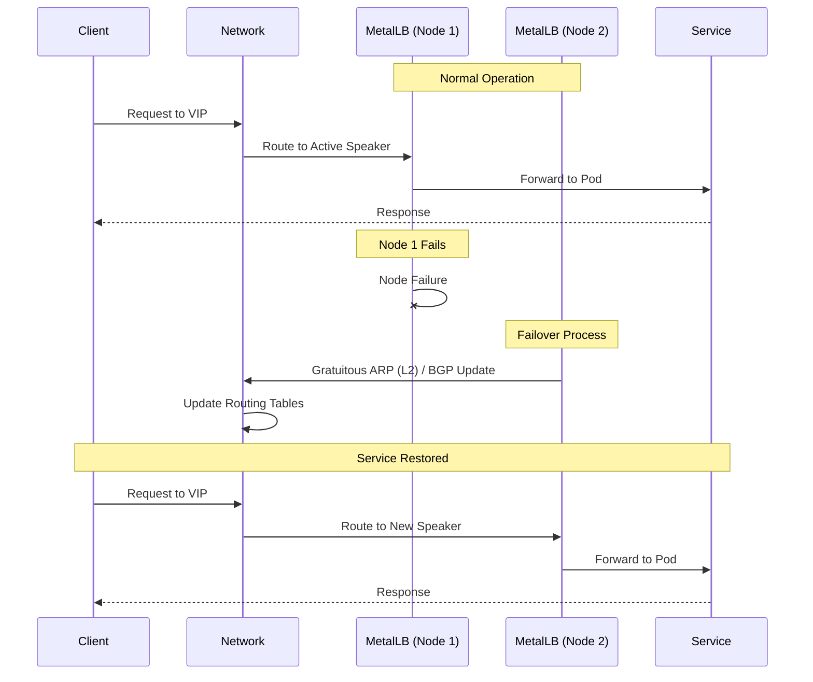
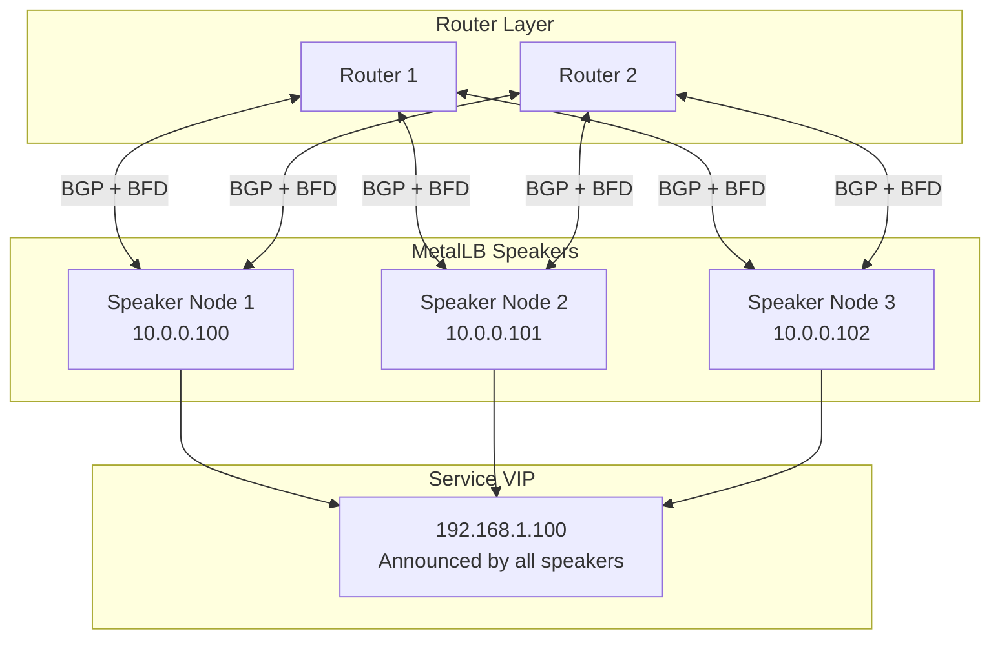

# How to Reduce MetalLB Failover Time in Production

Author: [nawazdhandala](https://github.com/nawazdhandala)

Tags: MetalLB, Kubernetes, High Availability, Failover, Performance, Load Balancing, Reliability

Description: Learn how to reduce MetalLB failover time in production to minimize service disruption during node failures.

---

MetalLB provides essential load balancer functionality for bare-metal Kubernetes clusters, but default configurations can lead to extended failover times during node failures. In production environments, every second of downtime impacts users and revenue. This guide covers comprehensive strategies to minimize MetalLB failover time and ensure maximum service availability.

## Understanding MetalLB Failover Mechanics

Before optimizing failover, you need to understand how MetalLB handles failures in both Layer 2 and BGP modes.



### Default Failover Timeline

The default failover process involves several time-consuming steps:

| Phase | L2 Mode Default | BGP Mode Default |
|-------|-----------------|------------------|
| Failure Detection | 10-30 seconds | 90 seconds (Hold Timer) |
| Leader Election | 1-5 seconds | N/A (all nodes announce) |
| ARP/Route Propagation | 1-5 seconds | 5-30 seconds |
| **Total Downtime** | **12-40 seconds** | **95-120 seconds** |

## Layer 2 Mode Optimization

Layer 2 mode uses ARP (IPv4) or NDP (IPv6) to announce IP addresses. Optimization focuses on faster failure detection and announcement propagation.

### Configuring Faster MemberList Settings

MetalLB uses HashiCorp's memberlist library for node failure detection. Adjust these settings for faster detection.

Apply this ConfigMap to tune memberlist parameters:

```yaml
apiVersion: v1
kind: ConfigMap
metadata:
  name: metallb-memberlist
  namespace: metallb-system
data:
  config: |
    # Reduce probe interval from default 1s to 500ms
    probe-interval: 500ms
    # Reduce probe timeout from default 500ms to 200ms
    probe-timeout: 200ms
    # Reduce suspicion multiplier for faster failure detection
    suspicion-mult: 2
    # Number of indirect probes to use
    indirect-checks: 2
    # Retransmit multiplier for reliable message delivery
    retransmit-mult: 2
```

### Optimizing Speaker DaemonSet

Configure the MetalLB speaker pods for faster response times.

Apply resource limits and configure liveness probes:

```yaml
apiVersion: apps/v1
kind: DaemonSet
metadata:
  name: speaker
  namespace: metallb-system
spec:
  template:
    spec:
      containers:
      - name: speaker
        args:
        - --port=7472
        - --log-level=info
        resources:
          requests:
            cpu: 100m
            memory: 100Mi
          limits:
            cpu: 500m
            memory: 200Mi
        livenessProbe:
          httpGet:
            path: /metrics
            port: 7472
          initialDelaySeconds: 10
          periodSeconds: 5
          timeoutSeconds: 2
          failureThreshold: 2
        readinessProbe:
          httpGet:
            path: /metrics
            port: 7472
          initialDelaySeconds: 5
          periodSeconds: 3
          timeoutSeconds: 2
          failureThreshold: 2
      priorityClassName: system-node-critical
      terminationGracePeriodSeconds: 2
```

### L2Advertisement Configuration

Configure L2 advertisements with specific node selectors for predictable failover.

Define L2 advertisement with interface and node preferences:

```yaml
apiVersion: metallb.io/v1beta1
kind: L2Advertisement
metadata:
  name: fast-failover-l2
  namespace: metallb-system
spec:
  ipAddressPools:
  - production-pool
  interfaces:
  - eth0
  nodeSelectors:
  - matchLabels:
      metallb-speaker: "primary"
  - matchLabels:
      metallb-speaker: "secondary"
```

### Network Interface Tuning

Configure the host network interfaces for faster ARP responses.

Run this script on all MetalLB speaker nodes:

```bash
#!/bin/bash

# Reduce ARP cache timeout for faster updates
echo 60 > /proc/sys/net/ipv4/neigh/default/gc_stale_time
echo 30 > /proc/sys/net/ipv4/neigh/default/base_reachable_time_ms

# Increase ARP cache size for busy environments
echo 4096 > /proc/sys/net/ipv4/neigh/default/gc_thresh1
echo 8192 > /proc/sys/net/ipv4/neigh/default/gc_thresh2
echo 16384 > /proc/sys/net/ipv4/neigh/default/gc_thresh3

# Enable gratuitous ARP acceptance
echo 1 > /proc/sys/net/ipv4/conf/all/arp_accept

# Make settings persistent
cat >> /etc/sysctl.d/99-metallb-optimization.conf << EOF
net.ipv4.neigh.default.gc_stale_time = 60
net.ipv4.neigh.default.base_reachable_time_ms = 30
net.ipv4.neigh.default.gc_thresh1 = 4096
net.ipv4.neigh.default.gc_thresh2 = 8192
net.ipv4.neigh.default.gc_thresh3 = 16384
net.ipv4.conf.all.arp_accept = 1
EOF
```

## BGP Mode Optimization

BGP mode offers more sophisticated failover options through protocol-level timers and BFD integration.

### Aggressive BGP Timers

Configure aggressive keepalive and hold timers for faster failure detection.

Set up BGP peer with optimized timers:

```yaml
apiVersion: metallb.io/v1beta2
kind: BGPPeer
metadata:
  name: fast-failover-peer
  namespace: metallb-system
spec:
  myASN: 65001
  peerASN: 65000
  peerAddress: 10.0.0.1
  # Reduce keepalive from default 60s to 3s
  keepaliveTime: 3s
  # Reduce hold time from default 180s to 9s (must be 3x keepalive)
  holdTime: 9s
  # Connect retry timer
  connectTime: 3s
  # Graceful restart for planned maintenance
  gracefulRestart:
    enabled: true
    time: 60s
  nodeSelectors:
  - matchLabels:
      node-role.kubernetes.io/worker: ""
```

### Enable BFD for Sub-Second Failover

Bidirectional Forwarding Detection provides millisecond-level failure detection.

Configure BFD profile with aggressive timers:

```yaml
apiVersion: metallb.io/v1beta1
kind: BFDProfile
metadata:
  name: fast-bfd
  namespace: metallb-system
spec:
  # Minimum interval between sent packets (50-60000ms)
  receiveInterval: 50
  # Minimum interval for receiving packets (50-60000ms)
  transmitInterval: 50
  # Detection multiplier (failure after multiplier * interval)
  detectMultiplier: 3
  # Echo mode for even faster detection (when supported)
  echoMode: true
  # Echo interval in milliseconds
  echoInterval: 25
  # Passive mode (wait for peer to initiate)
  passiveMode: false
  # Minimum TTL for incoming packets (for security)
  minimumTtl: 254
```

Link BFD profile to BGP peer:

```yaml
apiVersion: metallb.io/v1beta2
kind: BGPPeer
metadata:
  name: router-with-bfd
  namespace: metallb-system
spec:
  myASN: 65001
  peerASN: 65000
  peerAddress: 10.0.0.1
  bfdProfile: fast-bfd
  keepaliveTime: 3s
  holdTime: 9s
  password: "bgp-secret"
  routerID: 10.0.0.100
```

### BGP Communities for Fast Convergence

Use BGP communities to signal routing preferences and speed convergence.

Configure BGP advertisement with communities:

```yaml
apiVersion: metallb.io/v1beta1
kind: BGPAdvertisement
metadata:
  name: fast-convergence-advert
  namespace: metallb-system
spec:
  ipAddressPools:
  - production-pool
  aggregationLength: 32
  aggregationLengthV6: 128
  localPref: 100
  communities:
  - no-export
  - 65000:100
  peers:
  - router-with-bfd
```

### Router-Side BGP Configuration

Configure your upstream router for fast convergence.

Example for Cisco IOS-XE router:

```text
router bgp 65000
 bgp log-neighbor-changes
 bgp bestpath compare-routerid
 neighbor 10.0.0.100 remote-as 65001
 neighbor 10.0.0.100 fall-over bfd
 neighbor 10.0.0.100 timers 3 9
 neighbor 10.0.0.101 remote-as 65001
 neighbor 10.0.0.101 fall-over bfd
 neighbor 10.0.0.101 timers 3 9

 address-family ipv4 unicast
  maximum-paths 4
  bgp additional-paths select all
  bgp additional-paths send receive
  neighbor 10.0.0.100 activate
  neighbor 10.0.0.100 soft-reconfiguration inbound
  neighbor 10.0.0.101 activate
  neighbor 10.0.0.101 soft-reconfiguration inbound
```

Example for FRRouting (open source):

```text
frr version 8.4
frr defaults traditional
hostname router1
!
router bgp 65000
 bgp router-id 10.0.0.1
 bgp bestpath compare-routerid
 bgp bestpath as-path multipath-relax
 neighbor metallb peer-group
 neighbor metallb remote-as 65001
 neighbor metallb timers 3 9
 neighbor metallb timers connect 3
 neighbor metallb bfd
 neighbor 10.0.0.100 peer-group metallb
 neighbor 10.0.0.101 peer-group metallb
 neighbor 10.0.0.102 peer-group metallb
 !
 address-family ipv4 unicast
  neighbor metallb soft-reconfiguration inbound
  maximum-paths 8
 exit-address-family
!
bfd
 peer 10.0.0.100
  receive-interval 50
  transmit-interval 50
  detect-multiplier 3
 !
 peer 10.0.0.101
  receive-interval 50
  transmit-interval 50
  detect-multiplier 3
```

## Advanced Failover Architectures

### Multi-Speaker Active-Active with ECMP

Deploy multiple active speakers for zero-failover-time routing.



Configure BGP advertisement for ECMP:

```yaml
apiVersion: metallb.io/v1beta1
kind: BGPAdvertisement
metadata:
  name: ecmp-advertisement
  namespace: metallb-system
spec:
  ipAddressPools:
  - production-pool
  peers:
  - router1-peer
  - router2-peer
  aggregationLength: 32
  localPref: 100
```

### Health-Check Based Failover

Integrate external health checks to trigger faster failover based on application health.

Deploy health check controller:

```yaml
apiVersion: apps/v1
kind: Deployment
metadata:
  name: metallb-health-controller
  namespace: metallb-system
spec:
  replicas: 2
  selector:
    matchLabels:
      app: metallb-health-controller
  template:
    metadata:
      labels:
        app: metallb-health-controller
    spec:
      serviceAccountName: metallb-health-controller
      containers:
      - name: controller
        image: custom/metallb-health-controller:v1.0
        env:
        - name: CHECK_INTERVAL
          value: "2s"
        - name: FAILURE_THRESHOLD
          value: "2"
        - name: METALLB_NAMESPACE
          value: "metallb-system"
        resources:
          requests:
            cpu: 50m
            memory: 64Mi
          limits:
            cpu: 200m
            memory: 128Mi
```

Create ServiceAccount and RBAC:

```yaml
apiVersion: v1
kind: ServiceAccount
metadata:
  name: metallb-health-controller
  namespace: metallb-system
---
apiVersion: rbac.authorization.k8s.io/v1
kind: ClusterRole
metadata:
  name: metallb-health-controller
rules:
- apiGroups: [""]
  resources: ["services", "endpoints", "nodes"]
  verbs: ["get", "list", "watch"]
- apiGroups: ["metallb.io"]
  resources: ["ipaddresspools", "l2advertisements", "bgpadvertisements"]
  verbs: ["get", "list", "watch", "update", "patch"]
---
apiVersion: rbac.authorization.k8s.io/v1
kind: ClusterRoleBinding
metadata:
  name: metallb-health-controller
roleRef:
  apiGroup: rbac.authorization.k8s.io
  kind: ClusterRole
  name: metallb-health-controller
subjects:
- kind: ServiceAccount
  name: metallb-health-controller
  namespace: metallb-system
```

### Node Failure Detection Script

Deploy a DaemonSet for application-aware node failure detection:

```yaml
apiVersion: apps/v1
kind: DaemonSet
metadata:
  name: node-failure-detector
  namespace: metallb-system
spec:
  selector:
    matchLabels:
      app: node-failure-detector
  template:
    metadata:
      labels:
        app: node-failure-detector
    spec:
      hostNetwork: true
      containers:
      - name: detector
        image: busybox:1.35
        command:
        - /bin/sh
        - -c
        - |
          while true; do
            # Check critical services
            if ! curl -sf http://localhost:10256/healthz > /dev/null 2>&1; then
              echo "kube-proxy unhealthy, triggering failover"
              # Signal MetalLB speaker to withdraw routes
              kill -SIGUSR1 $(pidof speaker) 2>/dev/null || true
            fi

            # Check network connectivity
            if ! ping -c 1 -W 1 $GATEWAY_IP > /dev/null 2>&1; then
              echo "Gateway unreachable, triggering failover"
              kill -SIGUSR1 $(pidof speaker) 2>/dev/null || true
            fi

            sleep 2
          done
        env:
        - name: GATEWAY_IP
          value: "10.0.0.1"
        securityContext:
          privileged: true
```

## Kubernetes-Level Optimizations

### Node Problem Detector Integration

Configure Node Problem Detector to quickly identify failing nodes.

Deploy Node Problem Detector:

```yaml
apiVersion: apps/v1
kind: DaemonSet
metadata:
  name: node-problem-detector
  namespace: kube-system
spec:
  selector:
    matchLabels:
      app: node-problem-detector
  template:
    metadata:
      labels:
        app: node-problem-detector
    spec:
      containers:
      - name: node-problem-detector
        image: registry.k8s.io/node-problem-detector/node-problem-detector:v0.8.14
        command:
        - /node-problem-detector
        - --logtostderr
        - --config.system-log-monitor=/config/kernel-monitor.json,/config/docker-monitor.json
        - --config.custom-plugin-monitor=/config/network-problem-monitor.json
        volumeMounts:
        - name: log
          mountPath: /var/log
          readOnly: true
        - name: config
          mountPath: /config
          readOnly: true
        resources:
          requests:
            cpu: 20m
            memory: 50Mi
          limits:
            cpu: 200m
            memory: 100Mi
        securityContext:
          privileged: true
      volumes:
      - name: log
        hostPath:
          path: /var/log
      - name: config
        configMap:
          name: node-problem-detector-config
```

Create custom network problem monitor:

```yaml
apiVersion: v1
kind: ConfigMap
metadata:
  name: node-problem-detector-config
  namespace: kube-system
data:
  network-problem-monitor.json: |
    {
      "plugin": "custom",
      "pluginConfig": {
        "invoke_interval": "5s",
        "timeout": "3s",
        "max_output_length": 80,
        "concurrency": 1
      },
      "source": "network-problem-monitor",
      "conditions": [],
      "rules": [
        {
          "type": "temporary",
          "reason": "NetworkUnavailable",
          "path": "/config/check-network.sh",
          "pattern": "network not reachable"
        }
      ]
    }
  check-network.sh: |
    #!/bin/bash
    if ! ping -c 1 -W 2 10.0.0.1 > /dev/null 2>&1; then
      echo "network not reachable"
      exit 1
    fi
    echo "network OK"
    exit 0
```

### Pod Topology Spread for Speaker Resilience

Ensure MetalLB speakers are spread across failure domains:

```yaml
apiVersion: apps/v1
kind: DaemonSet
metadata:
  name: speaker
  namespace: metallb-system
spec:
  template:
    spec:
      topologySpreadConstraints:
      - maxSkew: 1
        topologyKey: topology.kubernetes.io/zone
        whenUnsatisfiable: DoNotSchedule
        labelSelector:
          matchLabels:
            app: metallb
            component: speaker
      - maxSkew: 1
        topologyKey: kubernetes.io/hostname
        whenUnsatisfiable: DoNotSchedule
        labelSelector:
          matchLabels:
            app: metallb
            component: speaker
      nodeSelector:
        metallb-speaker: "enabled"
```

### Optimized Kubelet Configuration

Configure kubelet for faster node status updates:

```yaml
apiVersion: kubelet.config.k8s.io/v1beta1
kind: KubeletConfiguration
nodeStatusUpdateFrequency: 5s
nodeStatusReportFrequency: 5s
nodeLeaseDurationSeconds: 20
```

Configure kube-controller-manager for faster node monitoring:

```yaml
apiVersion: v1
kind: Pod
metadata:
  name: kube-controller-manager
  namespace: kube-system
spec:
  containers:
  - name: kube-controller-manager
    command:
    - kube-controller-manager
    - --node-monitor-period=2s
    - --node-monitor-grace-period=20s
    - --pod-eviction-timeout=30s
```

## Monitoring and Alerting

### Prometheus Metrics for Failover Tracking

Deploy ServiceMonitor for MetalLB metrics:

```yaml
apiVersion: monitoring.coreos.com/v1
kind: ServiceMonitor
metadata:
  name: metallb-metrics
  namespace: metallb-system
spec:
  selector:
    matchLabels:
      app.kubernetes.io/name: metallb
  endpoints:
  - port: metrics
    interval: 10s
    path: /metrics
```

### Critical Alerting Rules

Create PrometheusRule for failover alerts:

```yaml
apiVersion: monitoring.coreos.com/v1
kind: PrometheusRule
metadata:
  name: metallb-failover-alerts
  namespace: metallb-system
spec:
  groups:
  - name: metallb-failover
    interval: 10s
    rules:
    - alert: MetalLBSpeakerDown
      expr: up{job="metallb-speaker"} == 0
      for: 10s
      labels:
        severity: critical
      annotations:
        summary: "MetalLB speaker is down"
        description: "MetalLB speaker on {{ $labels.instance }} has been down for more than 10 seconds."

    - alert: MetalLBBGPSessionDown
      expr: metallb_bgp_session_up == 0
      for: 5s
      labels:
        severity: critical
      annotations:
        summary: "BGP session is down"
        description: "BGP session {{ $labels.peer }} is down on {{ $labels.instance }}."

    - alert: MetalLBBFDSessionDown
      expr: metallb_bfd_session_up == 0
      for: 1s
      labels:
        severity: critical
      annotations:
        summary: "BFD session is down"
        description: "BFD session {{ $labels.peer }} is down, expect immediate failover."

    - alert: MetalLBFailoverOccurred
      expr: increase(metallb_layer2_announcements_total[1m]) > 0 and increase(metallb_layer2_announcements_total[1m]) != increase(metallb_layer2_announcements_total[2m] offset 1m)
      labels:
        severity: warning
      annotations:
        summary: "MetalLB failover detected"
        description: "A Layer 2 failover event occurred in the last minute."

    - alert: MetalLBHighFailoverLatency
      expr: histogram_quantile(0.99, rate(metallb_speaker_announce_duration_seconds_bucket[5m])) > 2
      for: 5m
      labels:
        severity: warning
      annotations:
        summary: "High MetalLB announcement latency"
        description: "99th percentile announcement latency is above 2 seconds."
```

### Grafana Dashboard

Create comprehensive failover monitoring dashboard:

```json
{
  "dashboard": {
    "title": "MetalLB Failover Monitoring",
    "panels": [
      {
        "title": "BGP Session Status",
        "type": "stat",
        "targets": [
          {
            "expr": "sum(metallb_bgp_session_up)",
            "legendFormat": "Active Sessions"
          }
        ],
        "fieldConfig": {
          "defaults": {
            "thresholds": {
              "mode": "absolute",
              "steps": [
                {"color": "red", "value": null},
                {"color": "yellow", "value": 1},
                {"color": "green", "value": 3}
              ]
            }
          }
        }
      },
      {
        "title": "BFD Session Status",
        "type": "stat",
        "targets": [
          {
            "expr": "sum(metallb_bfd_session_up)",
            "legendFormat": "Active BFD Sessions"
          }
        ]
      },
      {
        "title": "Failover Events (Last Hour)",
        "type": "timeseries",
        "targets": [
          {
            "expr": "increase(metallb_layer2_announcements_total[5m])",
            "legendFormat": "L2 Announcements"
          },
          {
            "expr": "increase(metallb_bgp_updates_total[5m])",
            "legendFormat": "BGP Updates"
          }
        ]
      },
      {
        "title": "Announcement Latency",
        "type": "timeseries",
        "targets": [
          {
            "expr": "histogram_quantile(0.50, rate(metallb_speaker_announce_duration_seconds_bucket[5m]))",
            "legendFormat": "p50"
          },
          {
            "expr": "histogram_quantile(0.95, rate(metallb_speaker_announce_duration_seconds_bucket[5m]))",
            "legendFormat": "p95"
          },
          {
            "expr": "histogram_quantile(0.99, rate(metallb_speaker_announce_duration_seconds_bucket[5m]))",
            "legendFormat": "p99"
          }
        ]
      }
    ]
  }
}
```

## Testing Failover Performance

### Automated Failover Test Script

Create a comprehensive failover testing script:

```bash
#!/bin/bash

# MetalLB Failover Test Script
# Tests failover time and validates service continuity

set -e

VIP="192.168.1.100"
SERVICE_PORT="80"
TEST_DURATION=60
POLL_INTERVAL=0.1

# Colors for output
RED='\033[0;31m'
GREEN='\033[0;32m'
YELLOW='\033[1;33m'
NC='\033[0m'

echo "=========================================="
echo "MetalLB Failover Test"
echo "=========================================="
echo "VIP: $VIP:$SERVICE_PORT"
echo "Test Duration: ${TEST_DURATION}s"
echo ""

# Get current speaker node
get_speaker_node() {
    kubectl get endpoints -n metallb-system speaker -o jsonpath='{.subsets[0].addresses[0].nodeName}' 2>/dev/null
}

# Continuous connectivity test
connectivity_test() {
    local start_time=$(date +%s.%N)
    local fail_count=0
    local success_count=0
    local first_fail_time=""
    local recovery_time=""

    echo "Starting connectivity test..."

    while true; do
        current_time=$(date +%s.%N)
        elapsed=$(echo "$current_time - $start_time" | bc)

        if [ $(echo "$elapsed > $TEST_DURATION" | bc) -eq 1 ]; then
            break
        fi

        if curl -sf -m 0.5 "http://$VIP:$SERVICE_PORT/health" > /dev/null 2>&1; then
            success_count=$((success_count + 1))
            if [ -n "$first_fail_time" ] && [ -z "$recovery_time" ]; then
                recovery_time=$current_time
                recovery_duration=$(echo "$recovery_time - $first_fail_time" | bc)
                echo -e "${GREEN}Service recovered after ${recovery_duration}s${NC}"
            fi
        else
            fail_count=$((fail_count + 1))
            if [ -z "$first_fail_time" ]; then
                first_fail_time=$current_time
                echo -e "${RED}Service unavailable at ${elapsed}s${NC}"
            fi
        fi

        sleep $POLL_INTERVAL
    done

    echo ""
    echo "=========================================="
    echo "Test Results"
    echo "=========================================="
    echo "Successful requests: $success_count"
    echo "Failed requests: $fail_count"

    if [ -n "$first_fail_time" ] && [ -n "$recovery_time" ]; then
        failover_time=$(echo "$recovery_time - $first_fail_time" | bc)
        echo -e "Failover time: ${YELLOW}${failover_time}s${NC}"
    fi

    availability=$(echo "scale=2; $success_count * 100 / ($success_count + $fail_count)" | bc)
    echo "Availability: ${availability}%"
}

# Main test execution
main() {
    echo "Current speaker node: $(get_speaker_node)"
    echo ""

    # Start connectivity test in background
    connectivity_test &
    TEST_PID=$!

    # Wait a few seconds then trigger failover
    sleep 5

    SPEAKER_NODE=$(get_speaker_node)
    echo "Triggering failover by cordoning node: $SPEAKER_NODE"
    kubectl cordon "$SPEAKER_NODE"

    # Delete speaker pod on the node to force immediate failover
    SPEAKER_POD=$(kubectl get pods -n metallb-system -l app=metallb,component=speaker \
        --field-selector spec.nodeName="$SPEAKER_NODE" -o jsonpath='{.items[0].metadata.name}')
    kubectl delete pod -n metallb-system "$SPEAKER_POD" --grace-period=0 --force

    # Wait for test to complete
    wait $TEST_PID

    # Cleanup - uncordon the node
    echo ""
    echo "Cleaning up - uncordoning node: $SPEAKER_NODE"
    kubectl uncordon "$SPEAKER_NODE"

    echo "New speaker node: $(get_speaker_node)"
}

main "$@"
```

### Load Test During Failover

Test with sustained load during failover:

```yaml
apiVersion: batch/v1
kind: Job
metadata:
  name: failover-load-test
  namespace: default
spec:
  template:
    spec:
      containers:
      - name: load-generator
        image: fortio/fortio:1.60.3
        command:
        - fortio
        - load
        - -c
        - "50"
        - -qps
        - "1000"
        - -t
        - "120s"
        - -json
        - /results/failover-test.json
        - http://production-service/api/health
        volumeMounts:
        - name: results
          mountPath: /results
      volumes:
      - name: results
        emptyDir: {}
      restartPolicy: Never
```

## Complete Production Configuration

Here is a complete production-ready MetalLB configuration optimized for fast failover:

```yaml
apiVersion: v1
kind: Namespace
metadata:
  name: metallb-system
  labels:
    pod-security.kubernetes.io/enforce: privileged
---
apiVersion: metallb.io/v1beta1
kind: IPAddressPool
metadata:
  name: production-pool
  namespace: metallb-system
spec:
  addresses:
  - 192.168.1.100-192.168.1.200
  autoAssign: true
  avoidBuggyIPs: true
---
apiVersion: metallb.io/v1beta1
kind: BFDProfile
metadata:
  name: production-bfd
  namespace: metallb-system
spec:
  receiveInterval: 50
  transmitInterval: 50
  detectMultiplier: 3
  echoMode: true
  echoInterval: 25
  passiveMode: false
  minimumTtl: 254
---
apiVersion: metallb.io/v1beta2
kind: BGPPeer
metadata:
  name: router-primary
  namespace: metallb-system
spec:
  myASN: 65001
  peerASN: 65000
  peerAddress: 10.0.0.1
  peerPort: 179
  sourceAddress: 10.0.0.100
  bfdProfile: production-bfd
  keepaliveTime: 3s
  holdTime: 9s
  connectTime: 3s
  password: "secure-bgp-password"
  ebgpMultiHop: false
  gracefulRestart:
    enabled: true
    time: 60s
  nodeSelectors:
  - matchLabels:
      metallb-speaker: "enabled"
---
apiVersion: metallb.io/v1beta2
kind: BGPPeer
metadata:
  name: router-secondary
  namespace: metallb-system
spec:
  myASN: 65001
  peerASN: 65000
  peerAddress: 10.0.0.2
  peerPort: 179
  sourceAddress: 10.0.0.100
  bfdProfile: production-bfd
  keepaliveTime: 3s
  holdTime: 9s
  connectTime: 3s
  password: "secure-bgp-password"
  ebgpMultiHop: false
  gracefulRestart:
    enabled: true
    time: 60s
  nodeSelectors:
  - matchLabels:
      metallb-speaker: "enabled"
---
apiVersion: metallb.io/v1beta1
kind: BGPAdvertisement
metadata:
  name: production-advertisement
  namespace: metallb-system
spec:
  ipAddressPools:
  - production-pool
  aggregationLength: 32
  localPref: 100
  communities:
  - 65000:100
  peers:
  - router-primary
  - router-secondary
---
apiVersion: metallb.io/v1beta1
kind: L2Advertisement
metadata:
  name: production-l2-fallback
  namespace: metallb-system
spec:
  ipAddressPools:
  - production-pool
  interfaces:
  - eth0
```

## Failover Time Comparison Summary

After implementing these optimizations, here are the expected failover times:

```mermaid
gantt
    title MetalLB Failover Time Comparison
    dateFormat X
    axisFormat %S seconds

    section Default L2
    Failure Detection    :0, 30
    Leader Election      :30, 35
    ARP Propagation      :35, 40

    section Optimized L2
    Failure Detection    :0, 5
    Leader Election      :5, 6
    ARP Propagation      :6, 8

    section Default BGP
    Hold Timer Expiry    :0, 90
    Route Withdrawal     :90, 95
    Convergence          :95, 120

    section BGP + BFD
    BFD Detection        :0, 0.15
    Route Withdrawal     :0.15, 0.5
    Convergence          :0.5, 1
```

| Configuration | Typical Failover Time | Maximum Failover Time |
|---------------|----------------------|----------------------|
| Default Layer 2 | 15-30 seconds | 60 seconds |
| Optimized Layer 2 | 5-8 seconds | 15 seconds |
| Default BGP | 90-180 seconds | 270 seconds |
| Optimized BGP Timers | 9-15 seconds | 30 seconds |
| BGP with BFD | 150-500 milliseconds | 1 second |
| ECMP with BFD | Near-zero (traffic redistributed) | 500 milliseconds |

## Key Takeaways

1. **Use BGP mode with BFD** for production workloads requiring sub-second failover.

2. **Configure aggressive timers** but balance them against network stability. Too aggressive settings can cause flapping.

3. **Deploy multiple speakers** across failure domains and use ECMP for true high availability.

4. **Monitor failover metrics** and set up alerting to catch degradation before it impacts users.

5. **Test regularly** using automated failover tests to validate your configuration performs as expected.

6. **Coordinate with network team** to ensure router-side configurations match your MetalLB settings.

7. **Document your failover architecture** so operations teams understand expected behavior during incidents.

By implementing these optimizations, you can reduce MetalLB failover time from minutes to sub-second levels, ensuring your production services maintain high availability even during node failures.
