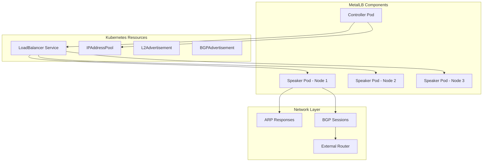
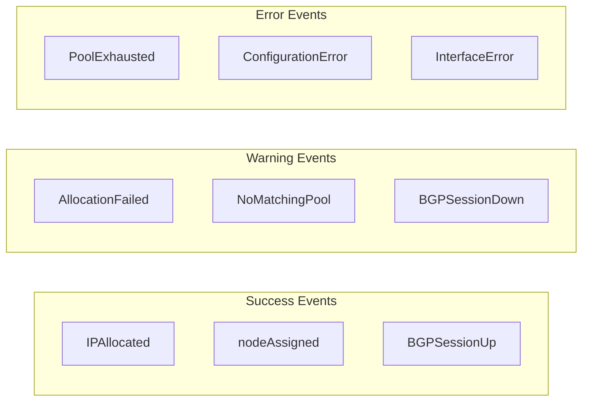
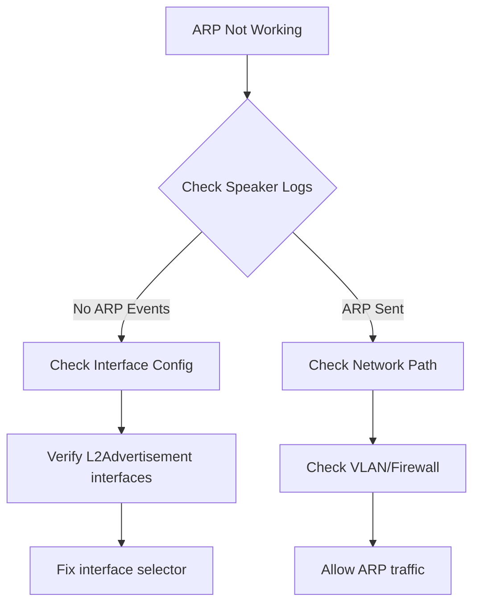

# How to Debug MetalLB with Speaker Logs and Events

Author: [nawazdhandala](https://github.com/nawazdhandala)

Tags: MetalLB, Kubernetes, Debugging, Troubleshooting, Logging, Load Balancing, Operations

Description: Learn how to debug MetalLB using speaker logs and events to troubleshoot IP assignment and advertisement issues.

---

MetalLB is a powerful load balancer for bare-metal Kubernetes clusters, but when IP assignment or advertisement fails, debugging can be challenging. The speaker component handles IP advertisement and is often where issues surface. This guide covers comprehensive techniques for debugging MetalLB using speaker logs, Kubernetes events, and diagnostic tools.

## Understanding MetalLB Architecture

Before diving into debugging, understanding MetalLB's components is essential:



**Controller**: Watches for Services of type LoadBalancer and assigns IPs from configured pools.

**Speaker**: Runs on every node as a DaemonSet and handles the actual IP advertisement via Layer 2 (ARP/NDP) or BGP.

## Checking MetalLB Component Status

Start by verifying that MetalLB pods are running correctly:

List all MetalLB pods and their status:

```bash
kubectl get pods -n metallb-system -o wide
```

Expected output shows all pods Running:

```
NAME                          READY   STATUS    RESTARTS   AGE   IP            NODE
controller-5f98465b6b-xyz12   1/1     Running   0          24h   10.244.0.15   node-1
speaker-abc12                 1/1     Running   0          24h   192.168.1.10  node-1
speaker-def34                 1/1     Running   0          24h   192.168.1.11  node-2
speaker-ghi56                 1/1     Running   0          24h   192.168.1.12  node-3
```

Verify DaemonSet status to ensure speakers run on all nodes:

```bash
kubectl get daemonset -n metallb-system
```

```
NAME      DESIRED   CURRENT   READY   UP-TO-DATE   AVAILABLE   NODE SELECTOR   AGE
speaker   3         3         3       3            3           <none>          24h
```

## Accessing Speaker Logs

Speaker logs contain detailed information about IP assignment and advertisement operations.

### Viewing Real-Time Logs

Stream logs from all speaker pods:

```bash
kubectl logs -n metallb-system -l app=metallb,component=speaker -f
```

Get logs from a specific speaker pod:

```bash
kubectl logs -n metallb-system speaker-abc12 --tail=100
```

View logs from the speaker container only (in case of multiple containers):

```bash
kubectl logs -n metallb-system speaker-abc12 -c speaker --tail=200
```

### Increasing Log Verbosity

MetalLB supports different log levels. Edit the speaker DaemonSet to increase verbosity:

```bash
kubectl edit daemonset speaker -n metallb-system
```

Add or modify the log level argument in the container spec:

```yaml
spec:
  template:
    spec:
      containers:
      - name: speaker
        args:
        - --log-level=debug
```

Available log levels are: all, debug, info, warn, error, none.

Alternatively, patch the DaemonSet directly:

```bash
kubectl patch daemonset speaker -n metallb-system --type='json' \
  -p='[{"op": "add", "path": "/spec/template/spec/containers/0/args/-", "value": "--log-level=debug"}]'
```

## Understanding Speaker Log Messages

### Healthy Operation Logs

Normal L2 mode logs showing successful ARP responses:

```
{"caller":"main.go:142","event":"startUpdate","msg":"start of service update","service":"default/nginx-lb","ts":"2026-01-07T10:15:30Z"}
{"caller":"main.go:178","event":"serviceAnnounced","ip":"192.168.1.100","msg":"service announced","pool":"default-pool","protocol":"layer2","service":"default/nginx-lb","ts":"2026-01-07T10:15:30Z"}
{"caller":"arp.go:102","event":"arpResponse","interface":"eth0","ip":"192.168.1.100","msg":"responded to ARP request","ts":"2026-01-07T10:15:31Z"}
```

Normal BGP mode logs showing session establishment:

```
{"caller":"bgp.go:89","event":"sessionUp","msg":"BGP session established","peer":"192.168.1.1","ts":"2026-01-07T10:15:30Z"}
{"caller":"bgp.go:156","event":"routeAdvertised","msg":"route advertised","prefix":"192.168.1.100/32","peer":"192.168.1.1","ts":"2026-01-07T10:15:31Z"}
```

### Error Logs to Watch For

IP pool exhaustion:

```
{"caller":"main.go:205","error":"no available IPs in pool","level":"error","msg":"failed to allocate IP","service":"default/nginx-lb","ts":"2026-01-07T10:15:30Z"}
```

Network interface issues:

```
{"caller":"arp.go:67","error":"interface eth0 not found","level":"error","msg":"failed to send ARP announcement","ts":"2026-01-07T10:15:30Z"}
```

BGP session failures:

```
{"caller":"bgp.go:112","error":"connection refused","level":"error","msg":"BGP session failed","peer":"192.168.1.1","ts":"2026-01-07T10:15:30Z"}
```

## Using Kubernetes Events for Debugging

Kubernetes events provide high-level information about MetalLB operations.

### Service Events

Get events related to a specific LoadBalancer service:

```bash
kubectl describe service nginx-lb -n default
```

Look for the Events section at the bottom:

```
Events:
  Type     Reason            Age   From                Message
  ----     ------            ----  ----                -------
  Normal   IPAllocated       10m   metallb-controller  Assigned IP ["192.168.1.100"]
  Normal   nodeAssigned      10m   metallb-speaker     announcing from node "node-1"
  Warning  AllocationFailed  5m    metallb-controller  Failed to allocate IP: no available addresses
```

### Filtering MetalLB Events

Get all events from MetalLB components:

```bash
kubectl get events -n metallb-system --sort-by='.lastTimestamp'
```

Filter events by specific reason:

```bash
kubectl get events --all-namespaces --field-selector reason=IPAllocated
```

Watch events in real-time:

```bash
kubectl get events --all-namespaces -w | grep -i metallb
```

### Common Event Types



## Debugging IP Assignment Issues

### Problem: Service Stuck in Pending State

When a LoadBalancer service shows `<pending>` for its external IP:

Check service status:

```bash
kubectl get svc nginx-lb -n default
```

```
NAME       TYPE           CLUSTER-IP     EXTERNAL-IP   PORT(S)        AGE
nginx-lb   LoadBalancer   10.96.100.50   <pending>     80:31234/TCP   10m
```

Describe the service to see events:

```bash
kubectl describe svc nginx-lb -n default
```

Check controller logs for allocation issues:

```bash
kubectl logs -n metallb-system -l component=controller --tail=100 | grep -i "nginx-lb\|error\|fail"
```

### Problem: IP Pool Exhausted

Verify IP pool configuration and usage:

```bash
kubectl get ipaddresspools -n metallb-system -o yaml
```

Check how many IPs are currently assigned:

```bash
kubectl get svc --all-namespaces -o jsonpath='{range .items[?(@.spec.type=="LoadBalancer")]}{.metadata.namespace}/{.metadata.name}: {.status.loadBalancer.ingress[0].ip}{"\n"}{end}'
```

Calculate pool utilization by counting assigned IPs vs pool size:

```bash
ASSIGNED=$(kubectl get svc --all-namespaces -o json | jq '[.items[] | select(.spec.type=="LoadBalancer") | .status.loadBalancer.ingress[0].ip // empty] | unique | length')
echo "Assigned IPs: $ASSIGNED"
```

### Problem: Service Using Wrong Pool

Check L2Advertisement or BGPAdvertisement selectors:

```bash
kubectl get l2advertisements -n metallb-system -o yaml
```

Verify the service has correct annotations or labels matching the advertisement:

```yaml
apiVersion: v1
kind: Service
metadata:
  name: nginx-lb
  annotations:
    metallb.universe.tf/address-pool: specific-pool
spec:
  type: LoadBalancer
  # ...
```

## Debugging L2 Mode Advertisement Issues

### Verifying ARP Responses

From a node in the same network segment, check if ARP is working:

```bash
arping -I eth0 192.168.1.100
```

Expected output shows responses from the speaker node's MAC address:

```
ARPING 192.168.1.100 from 192.168.1.50 eth0
Unicast reply from 192.168.1.100 [AA:BB:CC:DD:EE:FF]  0.845ms
Unicast reply from 192.168.1.100 [AA:BB:CC:DD:EE:FF]  0.821ms
```

### Checking Which Node Owns the IP

In L2 mode, only one speaker pod handles each IP. Find the owner:

Check speaker logs for the specific IP:

```bash
kubectl logs -n metallb-system -l component=speaker --tail=500 | grep "192.168.1.100"
```

Or use the speaker's memberlist status (if enabled):

```bash
kubectl exec -n metallb-system speaker-abc12 -- wget -qO- http://localhost:7946/debug/memberlist
```

### Network Interface Issues

Verify the speaker can access the correct interface:

```bash
kubectl exec -n metallb-system speaker-abc12 -- ip addr show
```

Check if the interface is in the allowed list (if configured):

```yaml
apiVersion: metallb.io/v1beta1
kind: L2Advertisement
metadata:
  name: example
  namespace: metallb-system
spec:
  interfaces:
  - eth0
```

### Debugging Speaker Election

In L2 mode, speakers elect a leader for each IP. Debug election issues:

```bash
kubectl logs -n metallb-system -l component=speaker | grep -i "election\|leader"
```

Check for split-brain scenarios:

```bash
for pod in $(kubectl get pods -n metallb-system -l component=speaker -o name); do
  echo "=== $pod ==="
  kubectl logs -n metallb-system $pod | grep -i "announcing" | tail -5
done
```

## Debugging BGP Mode Issues

### Checking BGP Session Status

View BGP-related logs:

```bash
kubectl logs -n metallb-system -l component=speaker | grep -i bgp
```

Look for session establishment messages:

```
{"caller":"bgp.go:89","event":"sessionUp","msg":"BGP session established","peer":"192.168.1.1"}
{"caller":"bgp.go:95","event":"sessionDown","msg":"BGP session lost","peer":"192.168.1.1","error":"connection reset"}
```

### Verifying BGP Configuration

Check BGPPeer resources:

```bash
kubectl get bgppeers -n metallb-system -o yaml
```

Verify BGPAdvertisement configuration:

```bash
kubectl get bgpadvertisements -n metallb-system -o yaml
```

### Testing BGP Connectivity

From the speaker pod, check connectivity to the BGP peer:

```bash
kubectl exec -n metallb-system speaker-abc12 -- nc -zv 192.168.1.1 179
```

Check if the BGP port is being blocked:

```bash
kubectl exec -n metallb-system speaker-abc12 -- timeout 5 bash -c 'cat < /dev/tcp/192.168.1.1/179'
```

### Router-Side Verification

Commands to run on the BGP router (varies by vendor):

Cisco IOS:

```
show ip bgp summary
show ip bgp neighbors 192.168.1.10
show ip route bgp
```

FRRouting:

```
show bgp summary
show bgp neighbors
show ip route bgp
```

## Creating a Diagnostic Script

This script collects comprehensive MetalLB diagnostic information:

```bash
#!/bin/bash
# metallb-diagnostics.sh - Collect MetalLB diagnostic information

OUTPUT_DIR="metallb-diagnostics-$(date +%Y%m%d-%H%M%S)"
mkdir -p "$OUTPUT_DIR"

echo "Collecting MetalLB diagnostics..."

echo "1. Pod status..."
kubectl get pods -n metallb-system -o wide > "$OUTPUT_DIR/pods.txt"

echo "2. DaemonSet status..."
kubectl get daemonset -n metallb-system -o yaml > "$OUTPUT_DIR/daemonset.yaml"

echo "3. Configuration resources..."
kubectl get ipaddresspools -n metallb-system -o yaml > "$OUTPUT_DIR/ipaddresspools.yaml" 2>/dev/null
kubectl get l2advertisements -n metallb-system -o yaml > "$OUTPUT_DIR/l2advertisements.yaml" 2>/dev/null
kubectl get bgppeers -n metallb-system -o yaml > "$OUTPUT_DIR/bgppeers.yaml" 2>/dev/null
kubectl get bgpadvertisements -n metallb-system -o yaml > "$OUTPUT_DIR/bgpadvertisements.yaml" 2>/dev/null

echo "4. Controller logs..."
kubectl logs -n metallb-system -l component=controller --tail=500 > "$OUTPUT_DIR/controller-logs.txt"

echo "5. Speaker logs..."
for pod in $(kubectl get pods -n metallb-system -l component=speaker -o name); do
  podname=$(basename $pod)
  kubectl logs -n metallb-system $podname --tail=500 > "$OUTPUT_DIR/speaker-$podname.txt"
done

echo "6. LoadBalancer services..."
kubectl get svc --all-namespaces -o wide | grep LoadBalancer > "$OUTPUT_DIR/lb-services.txt"

echo "7. Events..."
kubectl get events -n metallb-system --sort-by='.lastTimestamp' > "$OUTPUT_DIR/events-metallb.txt"
kubectl get events --all-namespaces --field-selector reason=IPAllocated > "$OUTPUT_DIR/events-ipallocated.txt" 2>/dev/null

echo "8. Node information..."
kubectl get nodes -o wide > "$OUTPUT_DIR/nodes.txt"

echo "Diagnostics collected in $OUTPUT_DIR/"
tar -czf "$OUTPUT_DIR.tar.gz" "$OUTPUT_DIR"
echo "Archive created: $OUTPUT_DIR.tar.gz"
```

Make the script executable and run it:

```bash
chmod +x metallb-diagnostics.sh
./metallb-diagnostics.sh
```

## Common Issues and Solutions

### Issue: ARP Responses Not Reaching Clients



Symptoms: External clients cannot reach the LoadBalancer IP.

Solution steps:

1. Verify speaker is sending ARP responses in logs
2. Check if the interface is correctly configured in L2Advertisement
3. Verify no firewall rules blocking ARP (protocol 0x0806)
4. Ensure client and MetalLB nodes are on the same L2 segment

### Issue: BGP Session Keeps Flapping

Symptoms: Logs show repeated "session up" and "session down" messages.

Common causes and solutions:

Check hold timer configuration - ensure it's long enough for your network:

```yaml
apiVersion: metallb.io/v1beta2
kind: BGPPeer
metadata:
  name: peer-router
  namespace: metallb-system
spec:
  myASN: 65000
  peerASN: 65001
  peerAddress: 192.168.1.1
  holdTime: 90s
  keepaliveTime: 30s
```

Verify router-side configuration matches MetalLB settings.

Check for MTU issues causing TCP session problems.

### Issue: IP Assigned but Traffic Not Flowing

Symptoms: Service has external IP but no traffic reaches pods.

Debug steps:

Verify kube-proxy is creating correct iptables rules:

```bash
iptables -t nat -L KUBE-SERVICES | grep <external-ip>
```

Check if endpoints exist:

```bash
kubectl get endpoints nginx-lb -n default
```

Verify pods are ready and passing health checks:

```bash
kubectl get pods -l app=nginx -n default
```

### Issue: Multiple Nodes Responding to Same IP (L2)

Symptoms: Intermittent connectivity, packet loss.

This indicates speaker election issues. Debug by:

Checking for network partitions between speaker pods:

```bash
kubectl logs -n metallb-system -l component=speaker | grep -i "memberlist\|partition"
```

Verifying all speakers can communicate:

```bash
kubectl exec -n metallb-system speaker-abc12 -- ping -c 3 <other-speaker-pod-ip>
```

## Monitoring MetalLB Health

### Prometheus Metrics

MetalLB exposes metrics for monitoring. Key metrics to watch:

```
metallb_speaker_announced - Number of announced IPs
metallb_bgp_session_up - BGP session state (1 = up, 0 = down)
metallb_bgp_updates_total - BGP update messages sent
metallb_allocator_addresses_in_use_total - IPs currently allocated
metallb_allocator_addresses_total - Total IPs in pools
```

Create a ServiceMonitor for Prometheus:

```yaml
apiVersion: monitoring.coreos.com/v1
kind: ServiceMonitor
metadata:
  name: metallb
  namespace: metallb-system
spec:
  selector:
    matchLabels:
      app: metallb
  endpoints:
  - port: monitoring
    interval: 30s
```

### Alert Rules

Example Prometheus alert rules for MetalLB:

```yaml
groups:
- name: metallb
  rules:
  - alert: MetalLBSpeakerDown
    expr: up{job="metallb-speaker"} == 0
    for: 5m
    labels:
      severity: critical
    annotations:
      summary: MetalLB speaker is down

  - alert: MetalLBBGPSessionDown
    expr: metallb_bgp_session_up == 0
    for: 2m
    labels:
      severity: warning
    annotations:
      summary: BGP session to {{ $labels.peer }} is down

  - alert: MetalLBPoolNearlyExhausted
    expr: metallb_allocator_addresses_in_use_total / metallb_allocator_addresses_total > 0.9
    for: 10m
    labels:
      severity: warning
    annotations:
      summary: IP pool {{ $labels.pool }} is 90% utilized
```

## Best Practices for Debugging

1. **Enable debug logging temporarily** - Increase log verbosity when troubleshooting, but revert to info level afterward to avoid log volume issues.

2. **Correlate timestamps** - Match speaker logs, controller logs, and Kubernetes events by timestamp to understand the sequence of events.

3. **Check all speaker pods** - In L2 mode, only one speaker handles each IP. Check logs from all speakers to find the active one.

4. **Verify network prerequisites** - Ensure nodes are on the same L2 segment (for L2 mode) or have BGP connectivity (for BGP mode).

5. **Use diagnostic scripts** - Create and maintain scripts for common diagnostic tasks to speed up troubleshooting.

6. **Document your configuration** - Keep records of IP pools, advertisements, and expected behavior for reference during incidents.

7. **Test changes in staging** - Validate MetalLB configuration changes in a non-production environment first.

---

Effective MetalLB debugging requires understanding both the controller (IP assignment) and speaker (IP advertisement) components. Speaker logs and Kubernetes events provide the visibility needed to diagnose most issues. Regular monitoring and alerting help catch problems early before they impact production workloads.
