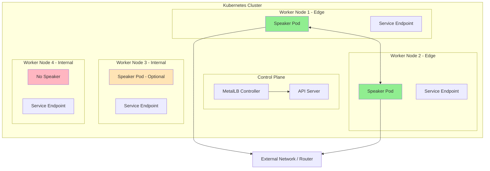
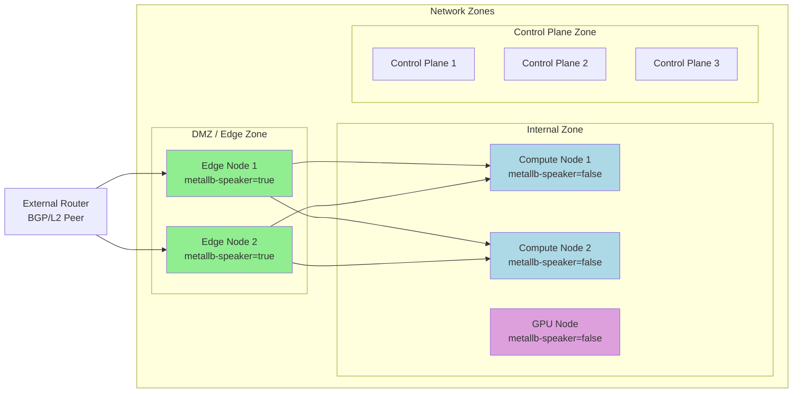
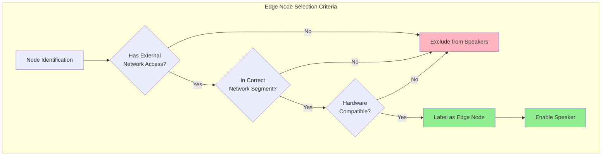
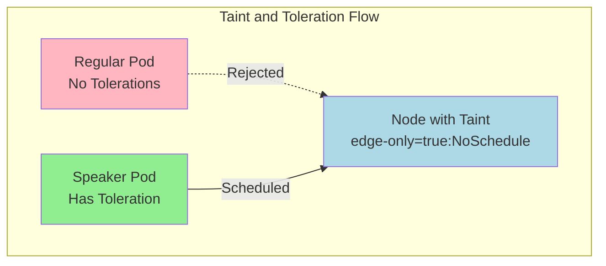

# How to Configure MetalLB Speaker Node Selection

Author: [nawazdhandala](https://github.com/nawazdhandala)

Tags: MetalLB, Kubernetes, Node Selection, Networking, Configuration

Description: A guide to controlling which nodes participate in MetalLB speaker announcements.

---

MetalLB is a load-balancer implementation for bare-metal Kubernetes clusters that provides network load-balancing capabilities typically only available in cloud environments. One of its critical components is the **speaker**, which runs on each node and is responsible for announcing service IPs to the network. In production environments, you often need fine-grained control over which nodes participate in these announcements. This guide covers everything you need to know about configuring MetalLB speaker node selection.

## Understanding MetalLB Architecture

Before diving into node selection, let's understand how MetalLB's speaker component works within a Kubernetes cluster.



The speaker component operates as a DaemonSet, meaning by default it runs on every node in your cluster. However, in many production scenarios, you want to limit which nodes participate in IP announcements:

- **Edge nodes** with direct network access should announce IPs
- **Internal compute nodes** may not need speaker pods
- **Specialized nodes** (GPU, high-memory) should focus on their primary workloads
- **Control plane nodes** might be excluded for security reasons

## Prerequisites

Before configuring speaker node selection, ensure you have:

- A running Kubernetes cluster (v1.20+)
- MetalLB installed (v0.13+)
- `kubectl` configured with cluster admin access
- Understanding of Kubernetes labels and node selectors

## Basic Node Selector Configuration

The most straightforward way to control speaker placement is using node selectors. Node selectors allow you to specify which nodes should run the speaker pods based on node labels.

### Step 1: Label Your Nodes

First, label the nodes where you want MetalLB speakers to run. This example labels nodes that have direct network access as edge nodes.

```bash
# Label nodes that should participate in MetalLB announcements
# These are typically edge nodes with direct network connectivity
kubectl label nodes worker-node-1 node-role.kubernetes.io/metallb-speaker=true
kubectl label nodes worker-node-2 node-role.kubernetes.io/metallb-speaker=true

# Verify the labels were applied correctly
kubectl get nodes --show-labels | grep metallb-speaker
```

### Step 2: Configure MetalLB with Node Selector

Create or update the MetalLB configuration to include node selectors. The following configuration restricts speaker pods to nodes with the `metallb-speaker=true` label.

```yaml
# metallb-config.yaml
# This configuration file sets up MetalLB with node selection
# to ensure speakers only run on designated edge nodes
apiVersion: metallb.io/v1beta1
kind: MetalLB
metadata:
  name: metallb
  namespace: metallb-system
spec:
  # nodeSelector restricts which nodes will run the speaker DaemonSet
  # Only nodes matching ALL specified labels will run a speaker pod
  nodeSelector:
    node-role.kubernetes.io/metallb-speaker: "true"

  # Speaker-specific configuration can be added here
  speakerConfig:
    # Runtime class for speaker pods (optional)
    runtimeClassName: ""
    # Security context settings (optional)
    securityContext: {}
```

Apply the configuration to your cluster:

```bash
# Apply the MetalLB configuration with node selection
kubectl apply -f metallb-config.yaml

# Verify that speaker pods are only running on labeled nodes
kubectl get pods -n metallb-system -o wide | grep speaker
```

## Node Topology and Selection Diagram

Understanding your cluster topology helps design an effective speaker placement strategy.



## Advanced Node Exclusion Patterns

Sometimes it's easier to specify which nodes should NOT run speakers rather than which ones should. This approach is useful when you have many edge nodes but only a few specialized nodes to exclude.

### Using Node Anti-Affinity

Node anti-affinity prevents speaker pods from scheduling on specific nodes. This configuration excludes GPU nodes and control plane nodes from running speakers.

```yaml
# metallb-exclusion.yaml
# This configuration uses affinity rules to exclude specific node types
# from running MetalLB speaker pods
apiVersion: metallb.io/v1beta1
kind: MetalLB
metadata:
  name: metallb
  namespace: metallb-system
spec:
  speakerConfig:
    # Affinity rules control pod scheduling beyond simple node selectors
    # We use nodeAffinity to exclude certain node types
    affinity:
      nodeAffinity:
        # requiredDuringSchedulingIgnoredDuringExecution ensures the pod
        # will NOT be scheduled on nodes that don't match these rules
        requiredDuringSchedulingIgnoredDuringExecution:
          nodeSelectorTerms:
          - matchExpressions:
            # Exclude GPU nodes - they should focus on GPU workloads
            - key: node-type
              operator: NotIn
              values:
              - gpu
              - gpu-high-memory
            # Exclude nodes marked as internal-only
            - key: network-zone
              operator: NotIn
              values:
              - internal
              - restricted
```

### Excluding Control Plane Nodes

Control plane nodes often have taints that prevent regular workloads from scheduling. If you need to explicitly exclude them, use the following pattern:

```yaml
# metallb-exclude-control-plane.yaml
# Explicitly exclude control plane nodes from running speakers
# This is useful when control plane nodes are untainted
apiVersion: metallb.io/v1beta1
kind: MetalLB
metadata:
  name: metallb
  namespace: metallb-system
spec:
  speakerConfig:
    affinity:
      nodeAffinity:
        requiredDuringSchedulingIgnoredDuringExecution:
          nodeSelectorTerms:
          - matchExpressions:
            # Exclude master/control-plane nodes using standard Kubernetes labels
            # The control-plane label is the modern standard (1.24+)
            - key: node-role.kubernetes.io/control-plane
              operator: DoesNotExist
            # Also check for the legacy master label for older clusters
            - key: node-role.kubernetes.io/master
              operator: DoesNotExist
```

## Edge Node Deployment Strategy

Edge nodes are the primary targets for MetalLB speakers in most production deployments. Here's a comprehensive strategy for edge node deployment.

### Defining Edge Node Characteristics

Edge nodes typically have:
- Direct connectivity to external networks
- Lower latency to network ingress points
- Often located in specific racks or network segments



### Complete Edge Node Configuration

This comprehensive example shows how to configure MetalLB for edge node deployment with all relevant settings:

```yaml
# metallb-edge-deployment.yaml
# Complete MetalLB configuration for edge node deployment
# This configuration ensures speakers only run on properly configured edge nodes
apiVersion: metallb.io/v1beta1
kind: MetalLB
metadata:
  name: metallb
  namespace: metallb-system
spec:
  # Node selector targets nodes with the edge-node label
  # This is the primary selection mechanism
  nodeSelector:
    node-role.kubernetes.io/edge: "true"

  speakerConfig:
    # Tolerations allow speakers to run on nodes with specific taints
    # Edge nodes might have taints to prevent regular workloads
    tolerations:
    # Tolerate the edge-node taint that might be applied to edge nodes
    - key: "node-role.kubernetes.io/edge"
      operator: "Exists"
      effect: "NoSchedule"
    # Tolerate network-critical taint for high-priority networking workloads
    - key: "network-critical"
      operator: "Exists"
      effect: "NoSchedule"

    # Affinity rules for more complex scheduling requirements
    affinity:
      nodeAffinity:
        # Preferred scheduling spreads speakers across availability zones
        # This ensures high availability even if one zone fails
        preferredDuringSchedulingIgnoredDuringExecution:
        - weight: 100
          preference:
            matchExpressions:
            - key: topology.kubernetes.io/zone
              operator: Exists

      # Pod anti-affinity can spread speakers across nodes
      # Useful when nodes are in the same zone but different racks
      podAntiAffinity:
        preferredDuringSchedulingIgnoredDuringExecution:
        - weight: 50
          podAffinityTerm:
            labelSelector:
              matchLabels:
                app: metallb
                component: speaker
            topologyKey: kubernetes.io/hostname

    # Resource limits ensure speaker pods don't consume excessive resources
    resources:
      limits:
        cpu: "100m"
        memory: "100Mi"
      requests:
        cpu: "50m"
        memory: "50Mi"

    # Priority class ensures speakers are scheduled before regular workloads
    priorityClassName: system-node-critical
```

### Labeling Edge Nodes Script

Use this script to systematically label your edge nodes:

```bash
#!/bin/bash
# label-edge-nodes.sh
# Script to label edge nodes for MetalLB speaker deployment
# This script applies consistent labels across all edge nodes

# Define your edge nodes
# Replace these with your actual edge node names
EDGE_NODES=(
  "edge-node-1"
  "edge-node-2"
  "edge-node-3"
)

# Labels to apply to edge nodes
# These labels identify nodes suitable for MetalLB speakers
LABELS=(
  "node-role.kubernetes.io/edge=true"
  "node-role.kubernetes.io/metallb-speaker=true"
  "network-zone=dmz"
)

# Apply labels to each edge node
for node in "${EDGE_NODES[@]}"; do
  echo "Labeling node: $node"
  for label in "${LABELS[@]}"; do
    kubectl label node "$node" "$label" --overwrite
  done
done

# Verify the labels were applied
echo ""
echo "Verification - Edge nodes with labels:"
kubectl get nodes -l node-role.kubernetes.io/edge=true -o wide

# Optionally apply a taint to edge nodes to prevent regular workloads
# Uncomment the following lines if you want to taint edge nodes
# for node in "${EDGE_NODES[@]}"; do
#   kubectl taint nodes "$node" node-role.kubernetes.io/edge=true:NoSchedule --overwrite
# done
```

## Tolerations Configuration

Tolerations allow MetalLB speaker pods to be scheduled on nodes that have taints. This is essential when your edge nodes are tainted to prevent general workloads from running on them.

### Understanding Taints and Tolerations



### Comprehensive Tolerations Example

This configuration shows various toleration patterns for different scenarios:

```yaml
# metallb-tolerations.yaml
# MetalLB configuration with comprehensive tolerations
# Allows speakers to run on various tainted node types
apiVersion: metallb.io/v1beta1
kind: MetalLB
metadata:
  name: metallb
  namespace: metallb-system
spec:
  nodeSelector:
    node-role.kubernetes.io/metallb-speaker: "true"

  speakerConfig:
    tolerations:
    # Tolerate the standard not-ready taint
    # Ensures speakers can run during node initialization
    - key: "node.kubernetes.io/not-ready"
      operator: "Exists"
      effect: "NoExecute"
      tolerationSeconds: 300

    # Tolerate unreachable nodes for a limited time
    # Prevents unnecessary pod evictions during network blips
    - key: "node.kubernetes.io/unreachable"
      operator: "Exists"
      effect: "NoExecute"
      tolerationSeconds: 300

    # Tolerate disk pressure - networking should continue
    # even if the node is experiencing storage issues
    - key: "node.kubernetes.io/disk-pressure"
      operator: "Exists"
      effect: "NoSchedule"

    # Tolerate memory pressure - speaker pods use minimal memory
    - key: "node.kubernetes.io/memory-pressure"
      operator: "Exists"
      effect: "NoSchedule"

    # Tolerate network-unavailable during initialization
    # Important for nodes that are just joining the cluster
    - key: "node.kubernetes.io/network-unavailable"
      operator: "Exists"
      effect: "NoSchedule"

    # Custom taint for edge nodes
    # Apply this taint to your edge nodes to reserve them for networking
    - key: "node-role.kubernetes.io/edge"
      operator: "Exists"
      effect: "NoSchedule"

    # Custom taint for network-critical workloads
    - key: "network-critical"
      operator: "Equal"
      value: "true"
      effect: "NoSchedule"

    # Tolerate control plane taints if speakers should run there
    # Uncomment only if you specifically need speakers on control plane
    # - key: "node-role.kubernetes.io/control-plane"
    #   operator: "Exists"
    #   effect: "NoSchedule"
```

### Applying Taints to Edge Nodes

After configuring tolerations, apply corresponding taints to your edge nodes:

```bash
# Apply taints to edge nodes to prevent regular workloads
# Only pods with matching tolerations (like MetalLB speaker) will be scheduled

# Taint edge nodes to reserve them for network-critical workloads
kubectl taint nodes edge-node-1 node-role.kubernetes.io/edge=true:NoSchedule
kubectl taint nodes edge-node-2 node-role.kubernetes.io/edge=true:NoSchedule

# Verify taints are applied
kubectl describe nodes edge-node-1 | grep -A5 "Taints:"

# To remove a taint (if needed), use the minus sign at the end
# kubectl taint nodes edge-node-1 node-role.kubernetes.io/edge=true:NoSchedule-
```

## Complete Production Configuration

Here's a production-ready configuration that combines all the concepts covered:

```yaml
# metallb-production.yaml
# Production-ready MetalLB configuration with comprehensive node selection
# This configuration is suitable for enterprise deployments
---
apiVersion: v1
kind: Namespace
metadata:
  name: metallb-system
  labels:
    # Pod security standards for the namespace
    pod-security.kubernetes.io/enforce: privileged
    pod-security.kubernetes.io/audit: privileged
    pod-security.kubernetes.io/warn: privileged
---
apiVersion: metallb.io/v1beta1
kind: MetalLB
metadata:
  name: metallb
  namespace: metallb-system
  labels:
    app.kubernetes.io/name: metallb
    app.kubernetes.io/instance: production
spec:
  # Primary node selection - only nodes with this label run speakers
  nodeSelector:
    node-role.kubernetes.io/metallb-speaker: "true"

  # Controller configuration (runs on any node by default)
  controllerConfig:
    # Controller can run anywhere, doesn't need special placement
    priorityClassName: system-cluster-critical
    resources:
      limits:
        cpu: "200m"
        memory: "200Mi"
      requests:
        cpu: "100m"
        memory: "100Mi"

  # Speaker configuration with full production settings
  speakerConfig:
    # Priority ensures speaker pods are scheduled first
    priorityClassName: system-node-critical

    # Resource limits for speaker pods
    resources:
      limits:
        cpu: "100m"
        memory: "100Mi"
      requests:
        cpu: "25m"
        memory: "25Mi"

    # Tolerations for various node conditions
    tolerations:
    # System tolerations for node conditions
    - key: "node.kubernetes.io/not-ready"
      operator: "Exists"
      effect: "NoExecute"
      tolerationSeconds: 300
    - key: "node.kubernetes.io/unreachable"
      operator: "Exists"
      effect: "NoExecute"
      tolerationSeconds: 300
    - key: "node.kubernetes.io/disk-pressure"
      operator: "Exists"
      effect: "NoSchedule"
    - key: "node.kubernetes.io/memory-pressure"
      operator: "Exists"
      effect: "NoSchedule"
    - key: "node.kubernetes.io/pid-pressure"
      operator: "Exists"
      effect: "NoSchedule"

    # Custom tolerations for edge nodes
    - key: "node-role.kubernetes.io/edge"
      operator: "Exists"
      effect: "NoSchedule"
    - key: "network-critical"
      operator: "Exists"
      effect: "NoSchedule"

    # Affinity rules for optimal placement
    affinity:
      nodeAffinity:
        # Hard requirement - must be on edge nodes
        requiredDuringSchedulingIgnoredDuringExecution:
          nodeSelectorTerms:
          - matchExpressions:
            # Must be an edge node
            - key: node-role.kubernetes.io/edge
              operator: In
              values:
              - "true"
            # Must not be a control plane node
            - key: node-role.kubernetes.io/control-plane
              operator: DoesNotExist

        # Soft preference - prefer nodes in different zones
        preferredDuringSchedulingIgnoredDuringExecution:
        - weight: 100
          preference:
            matchExpressions:
            - key: topology.kubernetes.io/zone
              operator: Exists
        # Prefer nodes with high network bandwidth
        - weight: 50
          preference:
            matchExpressions:
            - key: network-bandwidth
              operator: In
              values:
              - "high"
              - "10g"
              - "25g"
---
# IP Address Pool for Layer 2 mode
apiVersion: metallb.io/v1beta1
kind: IPAddressPool
metadata:
  name: production-pool
  namespace: metallb-system
spec:
  # Define the IP range for load balancer services
  addresses:
  - 192.168.1.240-192.168.1.250

  # Auto-assign IPs to services requesting a LoadBalancer
  autoAssign: true
---
# L2 Advertisement configuration
apiVersion: metallb.io/v1beta1
kind: L2Advertisement
metadata:
  name: production-l2
  namespace: metallb-system
spec:
  # Reference the IP pool to advertise
  ipAddressPools:
  - production-pool

  # Node selectors for L2 advertisements
  # This controls which nodes can announce IPs via ARP/NDP
  nodeSelectors:
  - matchLabels:
      node-role.kubernetes.io/metallb-speaker: "true"

  # Interfaces to use for L2 announcements (optional)
  # Uncomment and modify if you want to restrict to specific interfaces
  # interfaces:
  # - eth0
  # - bond0
```

## Verification and Troubleshooting

After applying your configuration, verify that speakers are running on the correct nodes:

```bash
# Check which nodes have speaker pods
echo "=== Speaker Pod Distribution ==="
kubectl get pods -n metallb-system -l component=speaker -o wide

# Verify node labels
echo ""
echo "=== Nodes with MetalLB Speaker Label ==="
kubectl get nodes -l node-role.kubernetes.io/metallb-speaker=true

# Check speaker pod logs for any issues
echo ""
echo "=== Recent Speaker Logs ==="
kubectl logs -n metallb-system -l component=speaker --tail=20

# Verify the MetalLB configuration
echo ""
echo "=== MetalLB Configuration ==="
kubectl get metallb -n metallb-system -o yaml

# Check events for any scheduling issues
echo ""
echo "=== Recent Events ==="
kubectl get events -n metallb-system --sort-by='.lastTimestamp' | tail -10
```

### Common Issues and Solutions

**Issue: Speaker pods not scheduling on expected nodes**

```bash
# Check if nodes have the required labels
kubectl get nodes --show-labels | grep metallb

# Check for taints that might prevent scheduling
kubectl describe node <node-name> | grep -A5 Taints

# Check the speaker DaemonSet for scheduling constraints
kubectl get daemonset -n metallb-system speaker -o yaml | grep -A50 spec:
```

**Issue: Speaker pods being evicted**

```bash
# Check pod events for eviction reasons
kubectl describe pod -n metallb-system <speaker-pod-name>

# Verify tolerations are correctly configured
kubectl get metallb -n metallb-system metallb -o yaml | grep -A20 tolerations
```

## Summary

Configuring MetalLB speaker node selection is essential for production deployments. Key takeaways:

1. **Use node labels** to identify nodes suitable for speaker deployment
2. **Apply node selectors** in the MetalLB configuration to target labeled nodes
3. **Configure tolerations** to allow speakers on tainted edge nodes
4. **Use affinity rules** for complex scheduling requirements
5. **Exclude control plane** and specialized nodes from speaker deployment
6. **Verify deployment** with kubectl commands to ensure correct placement

By following these patterns, you can ensure that MetalLB speakers run only on the nodes that have proper network access and are configured to handle load balancer traffic, improving both security and performance of your bare-metal Kubernetes cluster.

## Additional Resources

- [MetalLB Official Documentation](https://metallb.universe.tf/)
- [Kubernetes Node Selection Documentation](https://kubernetes.io/docs/concepts/scheduling-eviction/assign-pod-node/)
- [Kubernetes Taints and Tolerations](https://kubernetes.io/docs/concepts/scheduling-eviction/taint-and-toleration/)
- [MetalLB GitHub Repository](https://github.com/metallb/metallb)
