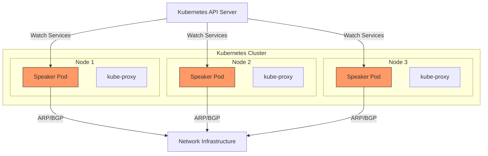
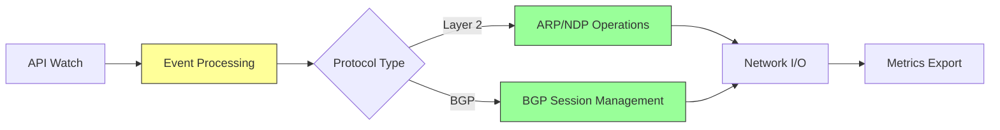
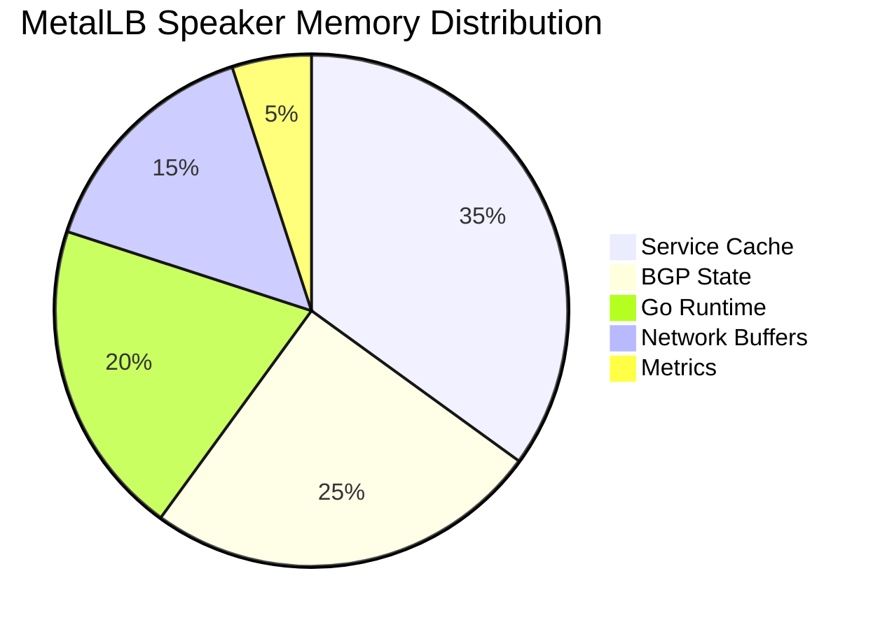
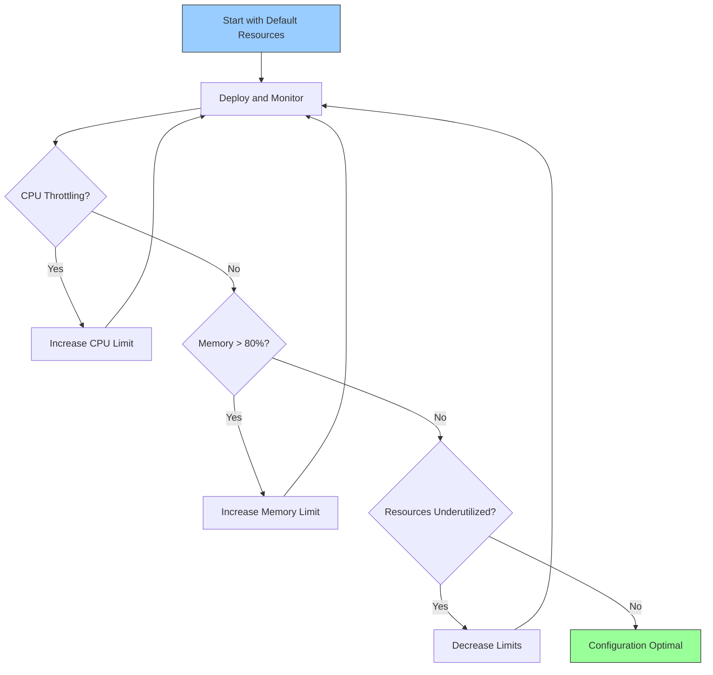

# How to Configure MetalLB Speaker Resource Limits

Author: [nawazdhandala](https://github.com/nawazdhandala)

Tags: MetalLB, Kubernetes, Resource Management, Performance, CPU, Memory, Load Balancing

Description: Learn how to configure MetalLB speaker resource limits including CPU and memory tuning for optimal performance.

---

MetalLB is a powerful load balancer implementation for bare-metal Kubernetes clusters. The speaker component is responsible for announcing service IPs using either Layer 2 (ARP/NDP) or BGP protocols. Properly configuring resource limits for speaker pods is crucial for ensuring stable, reliable load balancing while preventing resource contention on your cluster nodes.

In this comprehensive guide, you'll learn how to tune CPU and memory resources for MetalLB speaker pods, understand the factors that influence resource requirements, and implement best practices for production environments.

## Understanding MetalLB Speaker Resource Requirements

The MetalLB speaker runs as a DaemonSet, meaning one pod runs on each node in your cluster (or selected nodes based on node selectors). The speaker's resource consumption depends on several factors:

**Factors affecting resource usage:**
- Number of services with LoadBalancer type
- Announcement protocol (Layer 2 vs BGP)
- Number of BGP peers (for BGP mode)
- Frequency of service updates
- Network traffic volume
- Cluster size

The following diagram illustrates the MetalLB speaker architecture:



## Default Resource Configuration

MetalLB speaker pods typically start with minimal default resource settings. Let's examine a basic speaker deployment configuration:

The following shows a basic MetalLB speaker DaemonSet without custom resource limits:

```yaml
apiVersion: apps/v1
kind: DaemonSet
metadata:
  name: speaker
  namespace: metallb-system
  labels:
    app: metallb
    component: speaker
spec:
  selector:
    matchLabels:
      app: metallb
      component: speaker
  template:
    metadata:
      labels:
        app: metallb
        component: speaker
    spec:
      serviceAccountName: speaker
      terminationGracePeriodSeconds: 2
      hostNetwork: true
      containers:
      - name: speaker
        image: quay.io/metallb/speaker:v0.14.5
        args:
        - --port=7472
        - --log-level=info
        env:
        - name: METALLB_NODE_NAME
          valueFrom:
            fieldRef:
              fieldPath: spec.nodeName
        - name: METALLB_HOST
          valueFrom:
            fieldRef:
              fieldPath: status.hostIP
        ports:
        - name: monitoring
          containerPort: 7472
        securityContext:
          allowPrivilegeEscalation: false
          readOnlyRootFilesystem: true
          capabilities:
            drop:
            - ALL
            add:
            - NET_RAW
```

## Configuring Resource Requests and Limits

### Basic Resource Configuration

For most small to medium deployments (fewer than 50 services), the following resource configuration provides adequate resources:

```yaml
apiVersion: apps/v1
kind: DaemonSet
metadata:
  name: speaker
  namespace: metallb-system
spec:
  selector:
    matchLabels:
      app: metallb
      component: speaker
  template:
    spec:
      containers:
      - name: speaker
        image: quay.io/metallb/speaker:v0.14.5
        resources:
          requests:
            cpu: 25m
            memory: 32Mi
          limits:
            cpu: 100m
            memory: 128Mi
```

### Production Resource Configuration

For production environments with more services and higher reliability requirements, increase the resource allocations:

```yaml
apiVersion: apps/v1
kind: DaemonSet
metadata:
  name: speaker
  namespace: metallb-system
spec:
  selector:
    matchLabels:
      app: metallb
      component: speaker
  template:
    spec:
      containers:
      - name: speaker
        image: quay.io/metallb/speaker:v0.14.5
        resources:
          requests:
            cpu: 50m
            memory: 64Mi
          limits:
            cpu: 200m
            memory: 256Mi
```

### High-Performance Configuration

For large clusters with hundreds of services or high-frequency updates, use this configuration:

```yaml
apiVersion: apps/v1
kind: DaemonSet
metadata:
  name: speaker
  namespace: metallb-system
spec:
  selector:
    matchLabels:
      app: metallb
      component: speaker
  template:
    spec:
      containers:
      - name: speaker
        image: quay.io/metallb/speaker:v0.14.5
        resources:
          requests:
            cpu: 100m
            memory: 128Mi
          limits:
            cpu: 500m
            memory: 512Mi
```

## Resource Configuration Using Helm

If you're installing MetalLB using Helm, you can configure speaker resources directly in your values file.

Create a custom values file for your MetalLB Helm installation:

```yaml
speaker:
  enabled: true

  resources:
    requests:
      cpu: 50m
      memory: 64Mi
    limits:
      cpu: 200m
      memory: 256Mi

  tolerations:
  - key: node-role.kubernetes.io/control-plane
    effect: NoSchedule
  - key: node-role.kubernetes.io/master
    effect: NoSchedule

  nodeSelector: {}

  affinity: {}

  priorityClassName: system-node-critical

controller:
  resources:
    requests:
      cpu: 25m
      memory: 32Mi
    limits:
      cpu: 100m
      memory: 128Mi
```

Install or upgrade MetalLB with the custom values:

```bash
helm upgrade --install metallb metallb/metallb \
  --namespace metallb-system \
  --create-namespace \
  -f metallb-values.yaml
```

## Understanding CPU Resource Tuning

CPU resources for MetalLB speaker should account for the following operations:

The diagram below shows the CPU-intensive operations in the speaker:



### CPU Considerations for Layer 2 Mode

In Layer 2 mode, the speaker responds to ARP requests. CPU usage patterns include periodic ARP announcements, response handling for ARP requests, and leader election processing.

This configuration is optimized for Layer 2 mode with moderate traffic:

```yaml
apiVersion: apps/v1
kind: DaemonSet
metadata:
  name: speaker
  namespace: metallb-system
spec:
  selector:
    matchLabels:
      app: metallb
      component: speaker
  template:
    spec:
      containers:
      - name: speaker
        image: quay.io/metallb/speaker:v0.14.5
        args:
        - --port=7472
        - --log-level=info
        resources:
          requests:
            cpu: 25m
            memory: 48Mi
          limits:
            cpu: 150m
            memory: 128Mi
```

### CPU Considerations for BGP Mode

BGP mode requires more CPU resources due to BGP session maintenance, route advertisement calculations, and peer management.

This configuration is optimized for BGP mode with multiple peers:

```yaml
apiVersion: apps/v1
kind: DaemonSet
metadata:
  name: speaker
  namespace: metallb-system
spec:
  selector:
    matchLabels:
      app: metallb
      component: speaker
  template:
    spec:
      containers:
      - name: speaker
        image: quay.io/metallb/speaker:v0.14.5
        args:
        - --port=7472
        - --log-level=info
        resources:
          requests:
            cpu: 75m
            memory: 96Mi
          limits:
            cpu: 300m
            memory: 256Mi
```

## Memory Resource Tuning

Memory consumption in MetalLB speaker is influenced by several factors:

The following diagram illustrates memory allocation patterns:



### Calculating Memory Requirements

Use this formula to estimate memory requirements:

```
Base Memory (Go runtime): ~20Mi
Per Service: ~0.5Mi
Per BGP Peer: ~2Mi
Buffer (safety margin): 20%

Total = (Base + (Services × 0.5) + (BGP Peers × 2)) × 1.2
```

For example, for a cluster with 100 services and 4 BGP peers:
- Base: 20Mi
- Services: 100 × 0.5 = 50Mi
- BGP Peers: 4 × 2 = 8Mi
- Subtotal: 78Mi
- With buffer: 78 × 1.2 = ~94Mi

Apply these calculations with appropriate safety margins:

```yaml
apiVersion: apps/v1
kind: DaemonSet
metadata:
  name: speaker
  namespace: metallb-system
spec:
  selector:
    matchLabels:
      app: metallb
      component: speaker
  template:
    spec:
      containers:
      - name: speaker
        image: quay.io/metallb/speaker:v0.14.5
        resources:
          requests:
            cpu: 50m
            memory: 96Mi
          limits:
            cpu: 200m
            memory: 192Mi
```

## Using Kustomize for Resource Configuration

Kustomize provides a clean way to manage resource configurations across environments.

Create the base kustomization structure with the following files:

```yaml
# base/kustomization.yaml
apiVersion: kustomize.config.k8s.io/v1beta1
kind: Kustomization

namespace: metallb-system

resources:
- namespace.yaml
- metallb-native.yaml

commonLabels:
  app.kubernetes.io/managed-by: kustomize
```

Create environment-specific overlays for development:

```yaml
# overlays/dev/kustomization.yaml
apiVersion: kustomize.config.k8s.io/v1beta1
kind: Kustomization

resources:
- ../../base

patches:
- path: speaker-resources.yaml
  target:
    kind: DaemonSet
    name: speaker
```

Define development resource limits (minimal resources for dev environments):

```yaml
# overlays/dev/speaker-resources.yaml
apiVersion: apps/v1
kind: DaemonSet
metadata:
  name: speaker
  namespace: metallb-system
spec:
  template:
    spec:
      containers:
      - name: speaker
        resources:
          requests:
            cpu: 10m
            memory: 24Mi
          limits:
            cpu: 50m
            memory: 64Mi
```

Create production overlay with higher resource allocations:

```yaml
# overlays/prod/kustomization.yaml
apiVersion: kustomize.config.k8s.io/v1beta1
kind: Kustomization

resources:
- ../../base

patches:
- path: speaker-resources.yaml
  target:
    kind: DaemonSet
    name: speaker
```

Define production resource limits (generous resources for reliability):

```yaml
# overlays/prod/speaker-resources.yaml
apiVersion: apps/v1
kind: DaemonSet
metadata:
  name: speaker
  namespace: metallb-system
spec:
  template:
    spec:
      containers:
      - name: speaker
        resources:
          requests:
            cpu: 100m
            memory: 128Mi
          limits:
            cpu: 500m
            memory: 512Mi
```

Apply the configuration for your environment:

```bash
# Apply development configuration
kubectl apply -k overlays/dev/

# Apply production configuration
kubectl apply -k overlays/prod/
```

## Monitoring Resource Usage

Setting up proper monitoring is essential for tuning resource limits effectively.

### Prometheus ServiceMonitor

Create a ServiceMonitor to scrape MetalLB speaker metrics:

```yaml
apiVersion: monitoring.coreos.com/v1
kind: ServiceMonitor
metadata:
  name: metallb-speaker
  namespace: metallb-system
  labels:
    app: metallb
spec:
  selector:
    matchLabels:
      app: metallb
      component: speaker
  endpoints:
  - port: monitoring
    interval: 30s
    path: /metrics
```

### Useful Prometheus Queries

Query to check current CPU usage for speaker pods:

```promql
sum(rate(container_cpu_usage_seconds_total{
  namespace="metallb-system",
  pod=~"speaker-.*"
}[5m])) by (pod)
```

Query to monitor memory usage for speaker pods:

```promql
sum(container_memory_working_set_bytes{
  namespace="metallb-system",
  pod=~"speaker-.*"
}) by (pod)
```

Query to check CPU throttling (indicates limits are too low):

```promql
sum(rate(container_cpu_cfs_throttled_seconds_total{
  namespace="metallb-system",
  pod=~"speaker-.*"
}[5m])) by (pod)
```

Query to monitor memory against limits (OOMKill risk assessment):

```promql
sum(container_memory_working_set_bytes{
  namespace="metallb-system",
  pod=~"speaker-.*"
}) by (pod)
/
sum(kube_pod_container_resource_limits{
  namespace="metallb-system",
  pod=~"speaker-.*",
  resource="memory"
}) by (pod)
```

### Grafana Dashboard Configuration

Create a Grafana dashboard JSON for MetalLB speaker monitoring:

```json
{
  "dashboard": {
    "title": "MetalLB Speaker Resources",
    "panels": [
      {
        "title": "CPU Usage vs Limits",
        "type": "timeseries",
        "targets": [
          {
            "expr": "sum(rate(container_cpu_usage_seconds_total{namespace=\"metallb-system\",pod=~\"speaker-.*\"}[5m])) by (pod)",
            "legendFormat": "{{pod}} usage"
          },
          {
            "expr": "sum(kube_pod_container_resource_limits{namespace=\"metallb-system\",pod=~\"speaker-.*\",resource=\"cpu\"}) by (pod)",
            "legendFormat": "{{pod}} limit"
          }
        ]
      },
      {
        "title": "Memory Usage vs Limits",
        "type": "timeseries",
        "targets": [
          {
            "expr": "sum(container_memory_working_set_bytes{namespace=\"metallb-system\",pod=~\"speaker-.*\"}) by (pod)",
            "legendFormat": "{{pod}} usage"
          },
          {
            "expr": "sum(kube_pod_container_resource_limits{namespace=\"metallb-system\",pod=~\"speaker-.*\",resource=\"memory\"}) by (pod)",
            "legendFormat": "{{pod}} limit"
          }
        ]
      }
    ]
  }
}
```

## Setting Up Resource Alerts

Configure PrometheusRule for alerting on resource issues:

```yaml
apiVersion: monitoring.coreos.com/v1
kind: PrometheusRule
metadata:
  name: metallb-speaker-resources
  namespace: metallb-system
spec:
  groups:
  - name: metallb-speaker-resources
    rules:
    - alert: MetalLBSpeakerHighCPU
      expr: |
        sum(rate(container_cpu_usage_seconds_total{
          namespace="metallb-system",
          pod=~"speaker-.*"
        }[5m])) by (pod)
        /
        sum(kube_pod_container_resource_limits{
          namespace="metallb-system",
          pod=~"speaker-.*",
          resource="cpu"
        }) by (pod) > 0.8
      for: 5m
      labels:
        severity: warning
      annotations:
        summary: "MetalLB speaker {{ $labels.pod }} high CPU usage"
        description: "Speaker pod {{ $labels.pod }} is using more than 80% of CPU limit"

    - alert: MetalLBSpeakerHighMemory
      expr: |
        sum(container_memory_working_set_bytes{
          namespace="metallb-system",
          pod=~"speaker-.*"
        }) by (pod)
        /
        sum(kube_pod_container_resource_limits{
          namespace="metallb-system",
          pod=~"speaker-.*",
          resource="memory"
        }) by (pod) > 0.8
      for: 5m
      labels:
        severity: warning
      annotations:
        summary: "MetalLB speaker {{ $labels.pod }} high memory usage"
        description: "Speaker pod {{ $labels.pod }} is using more than 80% of memory limit"

    - alert: MetalLBSpeakerCPUThrottling
      expr: |
        sum(rate(container_cpu_cfs_throttled_seconds_total{
          namespace="metallb-system",
          pod=~"speaker-.*"
        }[5m])) by (pod) > 0.1
      for: 10m
      labels:
        severity: warning
      annotations:
        summary: "MetalLB speaker {{ $labels.pod }} CPU throttling"
        description: "Speaker pod {{ $labels.pod }} is being CPU throttled"

    - alert: MetalLBSpeakerOOMRisk
      expr: |
        sum(container_memory_working_set_bytes{
          namespace="metallb-system",
          pod=~"speaker-.*"
        }) by (pod)
        /
        sum(kube_pod_container_resource_limits{
          namespace="metallb-system",
          pod=~"speaker-.*",
          resource="memory"
        }) by (pod) > 0.9
      for: 2m
      labels:
        severity: critical
      annotations:
        summary: "MetalLB speaker {{ $labels.pod }} at OOM risk"
        description: "Speaker pod {{ $labels.pod }} is using more than 90% of memory limit"
```

## Vertical Pod Autoscaler (VPA) Configuration

VPA can automatically adjust resource requests based on actual usage patterns.

Deploy VPA for MetalLB speaker with UpdateMode set to Off for recommendations only:

```yaml
apiVersion: autoscaling.k8s.io/v1
kind: VerticalPodAutoscaler
metadata:
  name: speaker-vpa
  namespace: metallb-system
spec:
  targetRef:
    apiVersion: apps/v1
    kind: DaemonSet
    name: speaker
  updatePolicy:
    updateMode: "Off"
  resourcePolicy:
    containerPolicies:
    - containerName: speaker
      minAllowed:
        cpu: 10m
        memory: 24Mi
      maxAllowed:
        cpu: 500m
        memory: 512Mi
      controlledResources:
      - cpu
      - memory
```

Check VPA recommendations to understand actual resource needs:

```bash
kubectl describe vpa speaker-vpa -n metallb-system
```

## Priority Classes for Speaker Pods

Ensure speaker pods get scheduled even during resource pressure by using priority classes:

```yaml
apiVersion: scheduling.k8s.io/v1
kind: PriorityClass
metadata:
  name: metallb-speaker-priority
value: 1000000
globalDefault: false
description: "Priority class for MetalLB speaker pods"
```

Apply the priority class to the speaker DaemonSet:

```yaml
apiVersion: apps/v1
kind: DaemonSet
metadata:
  name: speaker
  namespace: metallb-system
spec:
  selector:
    matchLabels:
      app: metallb
      component: speaker
  template:
    spec:
      priorityClassName: metallb-speaker-priority
      containers:
      - name: speaker
        image: quay.io/metallb/speaker:v0.14.5
        resources:
          requests:
            cpu: 50m
            memory: 64Mi
          limits:
            cpu: 200m
            memory: 256Mi
```

## Resource Quota Considerations

When using namespace resource quotas, ensure MetalLB has adequate allocation:

```yaml
apiVersion: v1
kind: ResourceQuota
metadata:
  name: metallb-quota
  namespace: metallb-system
spec:
  hard:
    requests.cpu: "2"
    requests.memory: 2Gi
    limits.cpu: "4"
    limits.memory: 4Gi
    pods: "50"
```

## Complete Production Configuration

Here's a comprehensive production-ready configuration combining all best practices:

```yaml
apiVersion: v1
kind: Namespace
metadata:
  name: metallb-system
  labels:
    pod-security.kubernetes.io/enforce: privileged
    pod-security.kubernetes.io/audit: privileged
    pod-security.kubernetes.io/warn: privileged
---
apiVersion: scheduling.k8s.io/v1
kind: PriorityClass
metadata:
  name: metallb-critical
value: 1000000
globalDefault: false
description: "Critical priority for MetalLB components"
---
apiVersion: apps/v1
kind: DaemonSet
metadata:
  name: speaker
  namespace: metallb-system
  labels:
    app: metallb
    component: speaker
spec:
  selector:
    matchLabels:
      app: metallb
      component: speaker
  updateStrategy:
    type: RollingUpdate
    rollingUpdate:
      maxUnavailable: 1
  template:
    metadata:
      labels:
        app: metallb
        component: speaker
      annotations:
        prometheus.io/scrape: "true"
        prometheus.io/port: "7472"
    spec:
      serviceAccountName: speaker
      terminationGracePeriodSeconds: 2
      hostNetwork: true
      priorityClassName: metallb-critical
      tolerations:
      - key: node-role.kubernetes.io/control-plane
        effect: NoSchedule
      - key: node-role.kubernetes.io/master
        effect: NoSchedule
      - key: node.kubernetes.io/not-ready
        effect: NoSchedule
      containers:
      - name: speaker
        image: quay.io/metallb/speaker:v0.14.5
        args:
        - --port=7472
        - --log-level=info
        env:
        - name: METALLB_NODE_NAME
          valueFrom:
            fieldRef:
              fieldPath: spec.nodeName
        - name: METALLB_HOST
          valueFrom:
            fieldRef:
              fieldPath: status.hostIP
        - name: METALLB_ML_BIND_ADDR
          valueFrom:
            fieldRef:
              fieldPath: status.podIP
        - name: METALLB_ML_LABELS
          value: "app=metallb,component=speaker"
        - name: METALLB_ML_SECRET_KEY_PATH
          value: "/etc/ml_secret_key"
        ports:
        - name: monitoring
          containerPort: 7472
          hostPort: 7472
        - name: memberlist-tcp
          containerPort: 7946
          hostPort: 7946
          protocol: TCP
        - name: memberlist-udp
          containerPort: 7946
          hostPort: 7946
          protocol: UDP
        resources:
          requests:
            cpu: 100m
            memory: 128Mi
          limits:
            cpu: 500m
            memory: 512Mi
        securityContext:
          allowPrivilegeEscalation: false
          readOnlyRootFilesystem: true
          capabilities:
            drop:
            - ALL
            add:
            - NET_RAW
        livenessProbe:
          httpGet:
            path: /metrics
            port: monitoring
          initialDelaySeconds: 10
          periodSeconds: 10
          timeoutSeconds: 1
          failureThreshold: 3
        readinessProbe:
          httpGet:
            path: /metrics
            port: monitoring
          initialDelaySeconds: 10
          periodSeconds: 10
          timeoutSeconds: 1
          successThreshold: 1
          failureThreshold: 3
        volumeMounts:
        - name: ml-secret-key
          mountPath: /etc/ml_secret_key
          readOnly: true
      volumes:
      - name: ml-secret-key
        secret:
          secretName: memberlist
      nodeSelector:
        kubernetes.io/os: linux
```

## Troubleshooting Resource Issues

### Check Current Resource Usage

View current resource consumption for speaker pods:

```bash
kubectl top pods -n metallb-system -l component=speaker
```

### Check for OOMKilled Events

Look for out-of-memory terminations:

```bash
kubectl get events -n metallb-system --field-selector reason=OOMKilled
```

### Describe Pod for Detailed Resource Information

Get detailed resource allocation and status:

```bash
kubectl describe daemonset speaker -n metallb-system
```

### Check Container Logs for Resource-Related Issues

View speaker logs for any resource-related warnings:

```bash
kubectl logs -n metallb-system -l component=speaker --tail=100
```

### Check Node Resource Availability

Ensure nodes have sufficient allocatable resources:

```bash
kubectl describe nodes | grep -A 5 "Allocatable:"
```

## Resource Tuning Workflow

The following diagram shows the recommended workflow for tuning resources:



## Best Practices Summary

1. **Start Conservative**: Begin with lower limits and increase based on monitoring data
2. **Monitor Continuously**: Use Prometheus and Grafana to track resource usage patterns
3. **Set Appropriate Requests**: Requests should match typical usage; limits should accommodate peaks
4. **Use Priority Classes**: Ensure speaker pods aren't evicted during resource pressure
5. **Consider Protocol Differences**: BGP mode typically requires more resources than Layer 2
6. **Scale with Cluster Size**: Increase resources as you add more services
7. **Test Before Production**: Validate resource configurations in staging environments
8. **Enable Probes**: Liveness and readiness probes help detect resource starvation
9. **Review Regularly**: Re-evaluate resource settings as your cluster evolves

## Conclusion

Properly configuring MetalLB speaker resource limits is essential for maintaining reliable load balancing in your Kubernetes cluster. By following the guidelines in this post, you can ensure your speaker pods have adequate CPU and memory resources while avoiding over-provisioning.

Key takeaways:
- Layer 2 mode typically requires fewer resources than BGP mode
- Memory requirements scale with the number of services and BGP peers
- Monitoring and alerting are crucial for identifying resource constraints
- Use VPA recommendations to right-size your configurations
- Priority classes ensure speaker pods remain scheduled during resource pressure

Start with the recommended configurations for your environment size, monitor resource usage, and adjust based on actual utilization patterns. This iterative approach ensures optimal resource allocation while maintaining stable load balancing performance.
