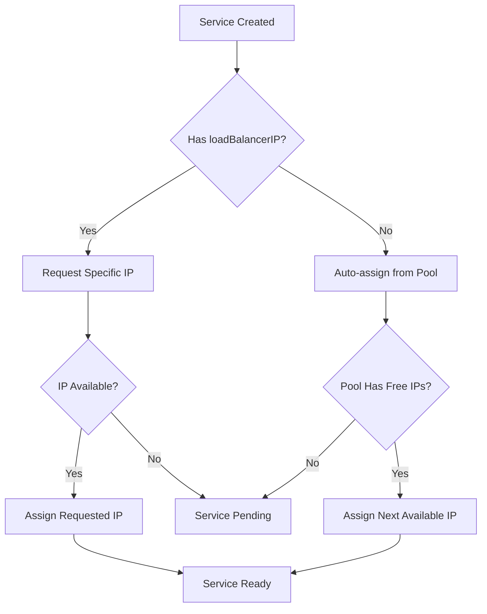
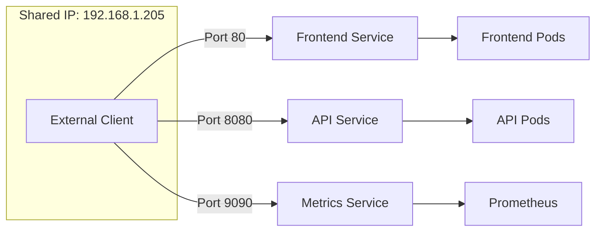
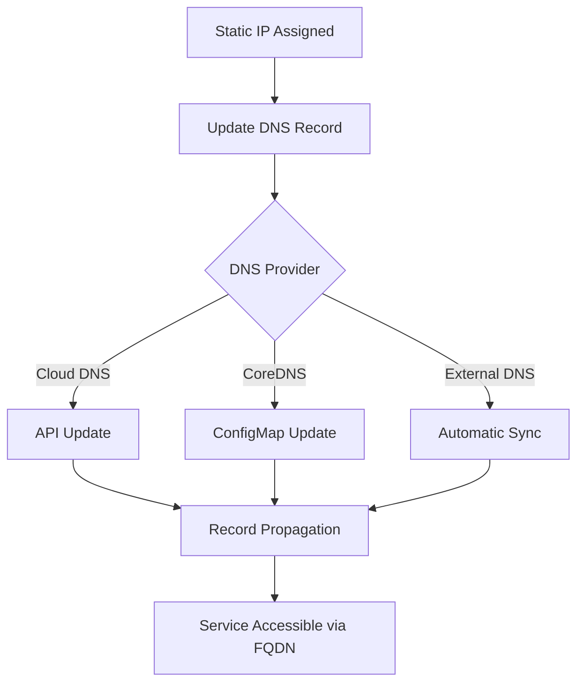

# How to Request Static IPs for Services in MetalLB

Author: [nawazdhandala](https://github.com/nawazdhandala)

Tags: MetalLB, Kubernetes, Static IP, Load Balancing, Networking

Description: Learn how to request and manage static IP addresses for Kubernetes services with MetalLB.

---

When running Kubernetes in bare-metal environments, MetalLB provides essential load balancer functionality that cloud providers offer out of the box. One of the most important capabilities is the ability to request static IP addresses for your services. This ensures that your applications maintain consistent, predictable IPs that can be used for DNS records, firewall rules, and external integrations.

In this comprehensive guide, we'll explore various strategies for requesting and managing static IPs in MetalLB, from basic annotations to advanced IP sharing and reservation techniques.

## Understanding Static IP Allocation in MetalLB

Before diving into implementation, let's understand how MetalLB handles IP allocation:



## Prerequisites

Before proceeding, ensure you have:

- A running Kubernetes cluster (v1.20+)
- MetalLB installed and configured (v0.13+)
- kubectl configured with cluster access
- At least one IP address pool defined

## Setting Up IP Address Pools

The foundation of static IP allocation is properly configured address pools. MetalLB uses IPAddressPool resources to define available IP ranges.

The following configuration creates two IP pools: one for general services and one reserved for critical infrastructure services that need guaranteed static IPs.

```yaml
# ip-address-pools.yaml
# Define IP address pools for MetalLB to allocate from
# We create separate pools for different use cases to ensure
# critical services always have available addresses
apiVersion: metallb.io/v1beta1
kind: IPAddressPool
metadata:
  name: general-pool
  namespace: metallb-system
spec:
  # General pool for dynamic allocation
  # Services without specific IP requests will use this pool
  addresses:
    - 192.168.1.100-192.168.1.150
  # Prevent auto-assignment to preserve IPs for explicit requests
  autoAssign: true
---
apiVersion: metallb.io/v1beta1
kind: IPAddressPool
metadata:
  name: static-reserved-pool
  namespace: metallb-system
spec:
  # Reserved pool for services requiring static IPs
  # These IPs are typically used for DNS entries and external integrations
  addresses:
    - 192.168.1.200-192.168.1.220
  # Disable auto-assign to ensure IPs are only given when explicitly requested
  # This prevents accidental allocation of reserved addresses
  autoAssign: false
```

Apply the configuration:

```bash
# Apply the IP address pool configuration to your cluster
kubectl apply -f ip-address-pools.yaml
```

## Method 1: Using loadBalancerIP Field

The most straightforward way to request a static IP is using the `spec.loadBalancerIP` field in your Service definition.

This method directly specifies which IP address the service should receive. The IP must be within one of your configured address pools.

```yaml
# nginx-static-ip.yaml
# Example service requesting a specific static IP address
# This is useful when you need a predictable IP for DNS records
apiVersion: v1
kind: Service
metadata:
  name: nginx-web
  namespace: default
  labels:
    app: nginx
spec:
  # Specify the exact IP address you want assigned to this service
  # This IP must exist within a configured IPAddressPool
  loadBalancerIP: 192.168.1.200
  type: LoadBalancer
  ports:
    # HTTP port mapping
    - name: http
      port: 80
      targetPort: 8080
      protocol: TCP
    # HTTPS port mapping
    - name: https
      port: 443
      targetPort: 8443
      protocol: TCP
  selector:
    app: nginx
```

**Important Considerations:**

- The requested IP must be within a configured IPAddressPool
- If the IP is already allocated, the service will remain in "Pending" state
- Using `autoAssign: false` on pools prevents other services from accidentally taking your reserved IPs

## Method 2: Using MetalLB Annotations

MetalLB provides annotations for more granular control over IP allocation. These annotations offer additional flexibility beyond the standard loadBalancerIP field.

The following example demonstrates using annotations to request an IP from a specific pool, which is useful when you have multiple pools for different purposes.

```yaml
# api-service-annotated.yaml
# Service using MetalLB-specific annotations for IP allocation
# Annotations provide more control than the loadBalancerIP field
apiVersion: v1
kind: Service
metadata:
  name: api-gateway
  namespace: production
  annotations:
    # Request IP from a specific pool
    # This ensures the IP comes from our reserved static pool
    metallb.universe.tf/address-pool: static-reserved-pool
    # Alternative: Request a specific IP using annotation
    # metallb.universe.tf/loadBalancerIPs: 192.168.1.201
spec:
  type: LoadBalancer
  ports:
    - name: http
      port: 80
      targetPort: 8080
  selector:
    app: api-gateway
```

### Requesting Multiple IPs (Dual-Stack)

For IPv4/IPv6 dual-stack environments, you can request IPs from multiple address families:

```yaml
# dual-stack-service.yaml
# Service configuration for dual-stack (IPv4 + IPv6) environments
# This ensures your service is accessible via both IP versions
apiVersion: v1
kind: Service
metadata:
  name: dual-stack-app
  namespace: default
  annotations:
    # Request specific IPs for both IPv4 and IPv6
    # Comma-separated list for multiple IP assignments
    metallb.universe.tf/loadBalancerIPs: 192.168.1.202,2001:db8::1
spec:
  type: LoadBalancer
  # Enable dual-stack IP family policy
  ipFamilyPolicy: RequireDualStack
  ipFamilies:
    - IPv4
    - IPv6
  ports:
    - port: 443
      targetPort: 8443
  selector:
    app: dual-stack-app
```

## Method 3: IP Sharing Between Services

MetalLB supports sharing a single IP address among multiple services. This is invaluable when you have limited public IPs or want to consolidate services under one address.



### Setting Up IP Sharing

Services can share an IP if they use the same sharing key and don't have conflicting ports:

```yaml
# shared-ip-services.yaml
# Multiple services sharing a single IP address
# This is useful for conserving IP addresses and simplifying external access

# Frontend service - handles web traffic on ports 80 and 443
apiVersion: v1
kind: Service
metadata:
  name: frontend
  namespace: production
  annotations:
    # The sharing key must be identical across all services sharing an IP
    # Choose a descriptive key that identifies this group of services
    metallb.universe.tf/allow-shared-ip: "production-gateway"
    # Specify which pool to allocate from
    metallb.universe.tf/address-pool: static-reserved-pool
spec:
  # All services sharing an IP must request the same address
  loadBalancerIP: 192.168.1.205
  type: LoadBalancer
  ports:
    # Frontend handles standard web ports
    - name: http
      port: 80
      targetPort: 8080
    - name: https
      port: 443
      targetPort: 8443
  selector:
    app: frontend
---
# API service - handles API traffic on port 8080
apiVersion: v1
kind: Service
metadata:
  name: api-backend
  namespace: production
  annotations:
    # Same sharing key as frontend to enable IP sharing
    metallb.universe.tf/allow-shared-ip: "production-gateway"
    metallb.universe.tf/address-pool: static-reserved-pool
spec:
  # Request the same IP as the frontend service
  loadBalancerIP: 192.168.1.205
  type: LoadBalancer
  ports:
    # API uses a different port to avoid conflict with frontend
    - name: api
      port: 8080
      targetPort: 8080
  selector:
    app: api-backend
---
# Metrics service - exposes Prometheus metrics on port 9090
apiVersion: v1
kind: Service
metadata:
  name: metrics-endpoint
  namespace: production
  annotations:
    # All three services share the same IP using this key
    metallb.universe.tf/allow-shared-ip: "production-gateway"
    metallb.universe.tf/address-pool: static-reserved-pool
spec:
  loadBalancerIP: 192.168.1.205
  type: LoadBalancer
  ports:
    # Metrics on its own dedicated port
    - name: metrics
      port: 9090
      targetPort: 9090
  selector:
    app: prometheus
```

### IP Sharing Rules

For IP sharing to work, the following conditions must be met:

1. **Same sharing key**: All services must have identical `metallb.universe.tf/allow-shared-ip` annotation values
2. **No port conflicts**: Services cannot use the same port numbers
3. **Same protocol family**: All services must use the same protocol (TCP or UDP)
4. **Same IP request**: All services must request the same `loadBalancerIP`

## IP Reservation Strategies

Implementing a robust IP reservation strategy prevents allocation conflicts and ensures service stability.

### Strategy 1: Dedicated Pools for Static IPs

Create separate pools with `autoAssign: false` for services requiring static IPs:

```yaml
# reservation-pools.yaml
# Comprehensive IP pool strategy with dedicated pools for different use cases
# This prevents accidental allocation of critical IP addresses

# Pool for database services - static IPs for stable connections
apiVersion: metallb.io/v1beta1
kind: IPAddressPool
metadata:
  name: database-pool
  namespace: metallb-system
spec:
  addresses:
    # Small, dedicated range for database services
    - 192.168.1.230-192.168.1.235
  # Never auto-assign - databases always need explicit IP requests
  autoAssign: false
---
# Pool for ingress controllers - static IPs for DNS records
apiVersion: metallb.io/v1beta1
kind: IPAddressPool
metadata:
  name: ingress-pool
  namespace: metallb-system
spec:
  addresses:
    # Dedicated range for ingress controllers
    - 192.168.1.240-192.168.1.245
  # Disable auto-assign to protect ingress IPs
  autoAssign: false
---
# Pool for general workloads - dynamic allocation allowed
apiVersion: metallb.io/v1beta1
kind: IPAddressPool
metadata:
  name: workload-pool
  namespace: metallb-system
spec:
  addresses:
    # Larger range for general services
    - 192.168.1.100-192.168.1.180
  # Allow auto-assignment for non-critical services
  autoAssign: true
```

### Strategy 2: Using Priority-Based Pool Selection

Configure L2 or BGP advertisements with pool selectors for prioritized allocation:

```yaml
# l2-advertisements.yaml
# Configure L2 mode advertisements with specific pool targeting
# This allows different network configurations per pool

# Advertisement for ingress pool with specific network interface
apiVersion: metallb.io/v1beta1
kind: L2Advertisement
metadata:
  name: ingress-l2-advert
  namespace: metallb-system
spec:
  # Only advertise IPs from the ingress pool
  ipAddressPools:
    - ingress-pool
  # Optionally specify which interfaces to advertise on
  # Useful in multi-NIC setups
  interfaces:
    - eth0
---
# Advertisement for general workload pool
apiVersion: metallb.io/v1beta1
kind: L2Advertisement
metadata:
  name: workload-l2-advert
  namespace: metallb-system
spec:
  ipAddressPools:
    - workload-pool
    - database-pool
  # Advertise on all interfaces if not specified
```

### Strategy 3: Namespace-Based IP Allocation

Implement namespace-specific IP ranges using pool selectors:

```yaml
# namespace-pools.yaml
# IP pools dedicated to specific namespaces
# Useful for multi-tenant clusters or environment separation

# Production namespace pool with premium IP range
apiVersion: metallb.io/v1beta1
kind: IPAddressPool
metadata:
  name: production-pool
  namespace: metallb-system
spec:
  addresses:
    - 10.0.100.1-10.0.100.50
  autoAssign: false
  # Note: Namespace restriction is enforced via RBAC and naming conventions
  # MetalLB doesn't natively support namespace selectors on pools
---
# Staging namespace pool with separate range
apiVersion: metallb.io/v1beta1
kind: IPAddressPool
metadata:
  name: staging-pool
  namespace: metallb-system
spec:
  addresses:
    - 10.0.200.1-10.0.200.50
  autoAssign: true
```

## DNS Integration Considerations

When using static IPs, DNS integration becomes crucial for service discovery. Here are key considerations and implementation patterns:



### Using External-DNS with MetalLB

External-DNS can automatically manage DNS records for LoadBalancer services:

```yaml
# external-dns-deployment.yaml
# External-DNS controller for automatic DNS record management
# Works with MetalLB to create DNS records when services get IPs
apiVersion: apps/v1
kind: Deployment
metadata:
  name: external-dns
  namespace: kube-system
spec:
  replicas: 1
  selector:
    matchLabels:
      app: external-dns
  template:
    metadata:
      labels:
        app: external-dns
    spec:
      serviceAccountName: external-dns
      containers:
        - name: external-dns
          image: registry.k8s.io/external-dns/external-dns:v0.14.0
          args:
            # Watch for LoadBalancer services
            - --source=service
            # Configure your DNS provider (example: AWS Route53)
            - --provider=aws
            # Only manage records in this domain
            - --domain-filter=example.com
            # Ownership identifier for this cluster
            - --txt-owner-id=my-cluster
            # Sync both creation and deletion of records
            - --policy=sync
            # How often to sync DNS records
            - --interval=1m
          env:
            # AWS credentials for Route53 access
            - name: AWS_ACCESS_KEY_ID
              valueFrom:
                secretKeyRef:
                  name: aws-credentials
                  key: access-key
            - name: AWS_SECRET_ACCESS_KEY
              valueFrom:
                secretKeyRef:
                  name: aws-credentials
                  key: secret-key
```

### Service with DNS Annotations

Configure services to automatically create DNS records:

```yaml
# service-with-dns.yaml
# Service configured for automatic DNS record creation
# External-DNS will create A records based on annotations
apiVersion: v1
kind: Service
metadata:
  name: web-application
  namespace: production
  annotations:
    # Request static IP from MetalLB
    metallb.universe.tf/address-pool: static-reserved-pool
    # External-DNS annotation: create DNS record with this hostname
    # Multiple hostnames can be comma-separated
    external-dns.alpha.kubernetes.io/hostname: app.example.com,www.example.com
    # TTL for the DNS record in seconds
    external-dns.alpha.kubernetes.io/ttl: "300"
spec:
  loadBalancerIP: 192.168.1.210
  type: LoadBalancer
  ports:
    - port: 443
      targetPort: 8443
  selector:
    app: web-application
```

### CoreDNS Integration for Internal DNS

For internal cluster DNS, integrate with CoreDNS:

```yaml
# coredns-configmap-addition.yaml
# Add custom DNS entries for MetalLB-assigned static IPs
# This ConfigMap patch adds a 'hosts' plugin block
apiVersion: v1
kind: ConfigMap
metadata:
  name: coredns-custom
  namespace: kube-system
data:
  # Custom hosts file for static IP mappings
  metallb.override: |
    # Map internal service names to their static IPs
    # These entries take precedence over service discovery
    192.168.1.200 nginx.internal.cluster
    192.168.1.205 gateway.internal.cluster
    192.168.1.210 api.internal.cluster
```

## Monitoring and Troubleshooting

### Verifying IP Allocation

Use these commands to verify your static IP allocation:

```bash
# Check service status and assigned IP
# The EXTERNAL-IP column shows the allocated MetalLB IP
kubectl get svc -o wide

# Get detailed service information including events
# Events will show IP allocation success or failure reasons
kubectl describe svc <service-name>

# List all IP address pools and their configuration
kubectl get ipaddresspools -n metallb-system -o yaml

# Check which IPs are currently in use
# This shows all LoadBalancer services and their assigned IPs
kubectl get svc --all-namespaces -o jsonpath='{range .items[?(@.spec.type=="LoadBalancer")]}{.metadata.namespace}{"\t"}{.metadata.name}{"\t"}{.status.loadBalancer.ingress[0].ip}{"\n"}{end}'
```

### Common Issues and Solutions

**Issue: Service stuck in Pending state**

```bash
# Check MetalLB speaker logs for allocation errors
# Common causes: IP not in pool, IP already allocated, pool exhausted
kubectl logs -n metallb-system -l component=speaker --tail=50

# Verify the requested IP is within a configured pool
kubectl get ipaddresspools -n metallb-system -o jsonpath='{range .items[*]}{.metadata.name}: {.spec.addresses}{"\n"}{end}'
```

**Issue: IP sharing not working**

```yaml
# Troubleshooting checklist for IP sharing
# Verify these conditions are met:

# 1. Check sharing keys match exactly (case-sensitive)
kubectl get svc -o jsonpath='{range .items[*]}{.metadata.name}: {.metadata.annotations.metallb\.universe\.tf/allow-shared-ip}{"\n"}{end}'

# 2. Verify no port conflicts exist
kubectl get svc -o jsonpath='{range .items[*]}{.metadata.name}: {range .spec.ports[*]}{.port}/{.protocol} {end}{"\n"}{end}'

# 3. Confirm all services request the same IP
kubectl get svc -o jsonpath='{range .items[*]}{.metadata.name}: {.spec.loadBalancerIP}{"\n"}{end}'
```

### Creating an IP Inventory Script

This script helps track IP allocations across your cluster:

```bash
#!/bin/bash
# metallb-ip-inventory.sh
# Script to generate an inventory of MetalLB IP allocations
# Run this periodically to track IP usage and plan capacity

echo "=== MetalLB IP Address Inventory ==="
echo ""

# Display configured IP pools
echo "Configured IP Pools:"
echo "--------------------"
kubectl get ipaddresspools -n metallb-system -o custom-columns=\
'NAME:.metadata.name,ADDRESSES:.spec.addresses,AUTO-ASSIGN:.spec.autoAssign'

echo ""

# Display current allocations
echo "Current IP Allocations:"
echo "-----------------------"
kubectl get svc --all-namespaces \
  -o custom-columns=\
'NAMESPACE:.metadata.namespace,SERVICE:.metadata.name,EXTERNAL-IP:.status.loadBalancer.ingress[0].ip,REQUESTED-IP:.spec.loadBalancerIP,POOL:.metadata.annotations.metallb\.universe\.tf/address-pool' \
  | grep -v '<none>'

echo ""

# Display sharing groups
echo "IP Sharing Groups:"
echo "------------------"
kubectl get svc --all-namespaces \
  -o jsonpath='{range .items[?(@.metadata.annotations.metallb\.universe\.tf/allow-shared-ip)]}{.metadata.namespace}/{.metadata.name}: {.metadata.annotations.metallb\.universe\.tf/allow-shared-ip}{"\n"}{end}'
```

## Best Practices Summary

When implementing static IP allocation with MetalLB, follow these best practices:

1. **Use dedicated pools for static IPs**: Set `autoAssign: false` on pools containing reserved addresses
2. **Document IP assignments**: Maintain an inventory of which IPs are assigned to which services
3. **Implement naming conventions**: Use consistent annotation keys for IP sharing groups
4. **Plan for growth**: Reserve extra IPs in your static pools for future services
5. **Integrate with DNS early**: Set up External-DNS or equivalent from the start
6. **Monitor pool exhaustion**: Set up alerts when IP pools are running low
7. **Use namespace isolation**: Consider separate pools per environment or team

## Complete Example: Production Setup

Here's a complete example bringing together all concepts:

```yaml
# production-metallb-setup.yaml
# Complete MetalLB configuration for a production environment
# Includes pools, advertisements, and example services

# Static IP pool for production services
apiVersion: metallb.io/v1beta1
kind: IPAddressPool
metadata:
  name: prod-static-pool
  namespace: metallb-system
spec:
  addresses:
    - 10.0.50.1-10.0.50.20
  autoAssign: false
---
# Dynamic pool for development/testing
apiVersion: metallb.io/v1beta1
kind: IPAddressPool
metadata:
  name: dev-dynamic-pool
  namespace: metallb-system
spec:
  addresses:
    - 10.0.100.1-10.0.100.100
  autoAssign: true
---
# L2 advertisement for all pools
apiVersion: metallb.io/v1beta1
kind: L2Advertisement
metadata:
  name: l2-advert
  namespace: metallb-system
spec:
  ipAddressPools:
    - prod-static-pool
    - dev-dynamic-pool
---
# Production ingress controller with static IP
apiVersion: v1
kind: Service
metadata:
  name: ingress-nginx
  namespace: ingress-nginx
  annotations:
    metallb.universe.tf/address-pool: prod-static-pool
    external-dns.alpha.kubernetes.io/hostname: "*.example.com"
spec:
  loadBalancerIP: 10.0.50.1
  type: LoadBalancer
  ports:
    - name: http
      port: 80
      targetPort: 80
    - name: https
      port: 443
      targetPort: 443
  selector:
    app.kubernetes.io/name: ingress-nginx
---
# API gateway sharing IP with ingress on different port
apiVersion: v1
kind: Service
metadata:
  name: api-gateway
  namespace: production
  annotations:
    metallb.universe.tf/address-pool: prod-static-pool
    metallb.universe.tf/allow-shared-ip: "primary-gateway"
spec:
  loadBalancerIP: 10.0.50.1
  type: LoadBalancer
  ports:
    - name: grpc
      port: 9000
      targetPort: 9000
  selector:
    app: api-gateway
```

## Conclusion

Static IP allocation in MetalLB provides the stability and predictability needed for production Kubernetes deployments on bare metal. By using the techniques covered in this guide - from basic loadBalancerIP requests to advanced IP sharing and reservation strategies - you can build a robust networking foundation for your cluster.

Key takeaways:

- Use `loadBalancerIP` or MetalLB annotations to request specific IPs
- Create separate pools with `autoAssign: false` for reserved addresses
- Leverage IP sharing to maximize limited address space
- Integrate with External-DNS for automatic DNS management
- Monitor and document your IP allocations

With these practices in place, your MetalLB-powered services will maintain consistent, manageable IP addresses that integrate seamlessly with your existing network infrastructure.

## Additional Resources

- [MetalLB Official Documentation](https://metallb.universe.tf/)
- [MetalLB Configuration Reference](https://metallb.universe.tf/configuration/)
- [External-DNS Documentation](https://github.com/kubernetes-sigs/external-dns)
- [Kubernetes Service Types](https://kubernetes.io/docs/concepts/services-networking/service/#loadbalancer)
