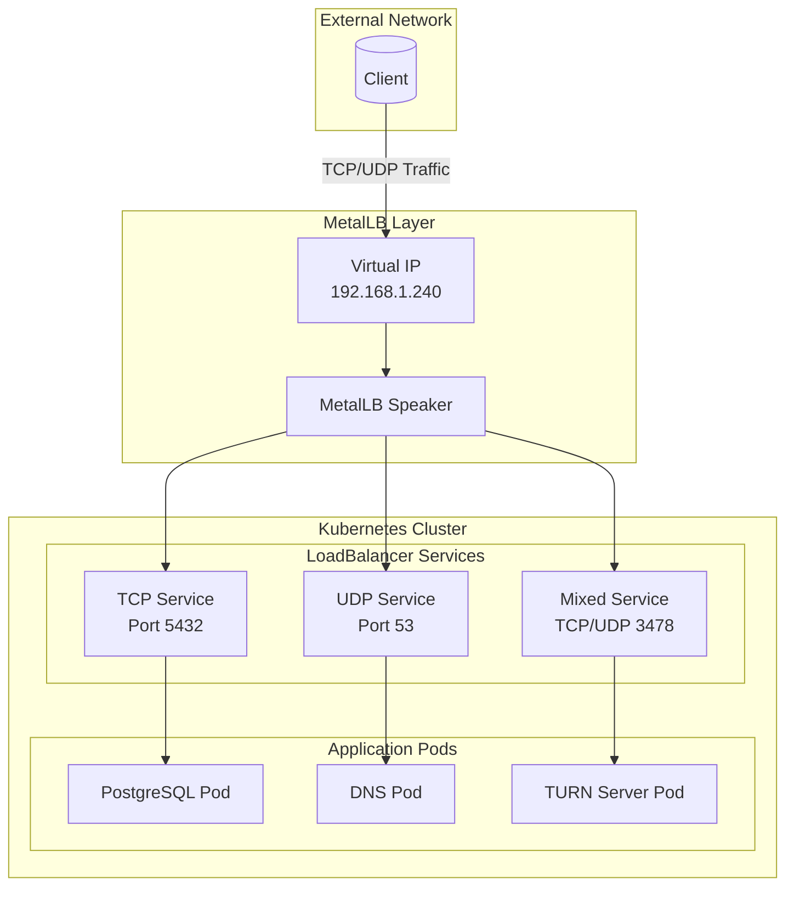
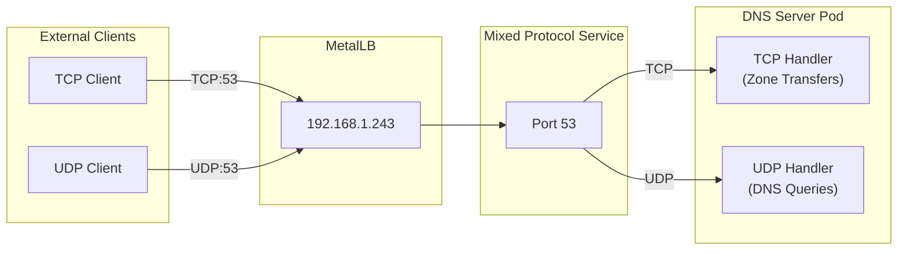
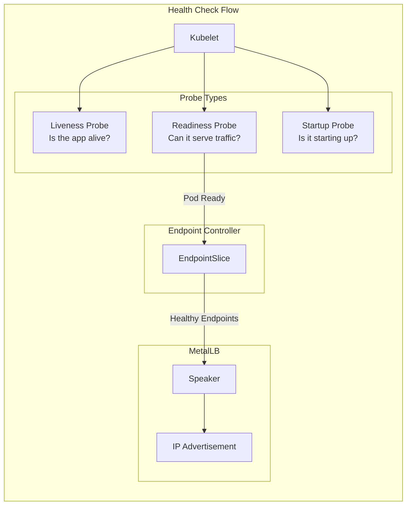
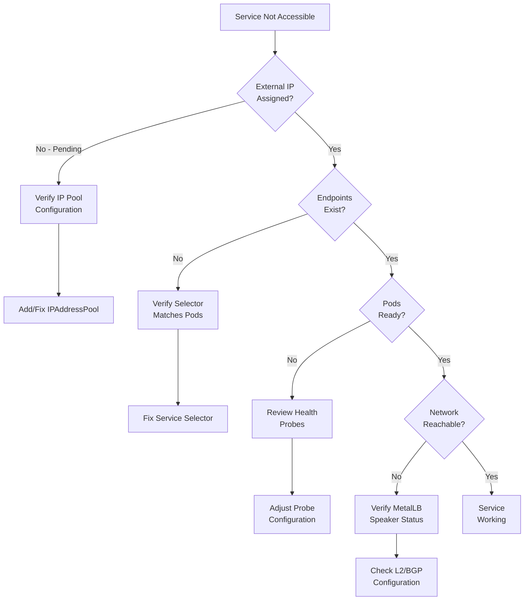

# How to Expose TCP and UDP Services with MetalLB

Author: [nawazdhandala](https://github.com/nawazdhandala)

Tags: MetalLB, TCP, UDP, Kubernetes, Load Balancing, Networking

Description: A guide to exposing non-HTTP services with MetalLB for TCP and UDP workloads.

---

## Introduction

While HTTP-based services dominate the Kubernetes landscape, many critical workloads rely on raw TCP and UDP protocols. Database connections, gaming servers, DNS services, streaming applications, and IoT gateways all require direct TCP/UDP access. MetalLB provides a robust solution for exposing these non-HTTP services in bare-metal Kubernetes environments where cloud-native load balancers are unavailable.

This comprehensive guide covers everything you need to know about exposing TCP and UDP services with MetalLB, from basic configuration to advanced multi-protocol setups with proper health checking.

## Understanding MetalLB Protocol Support

MetalLB supports both Layer 2 (ARP/NDP) and BGP modes for advertising external IPs. Both modes work seamlessly with TCP and UDP protocols, making MetalLB an excellent choice for exposing any type of network service.

The following diagram illustrates how MetalLB handles TCP and UDP traffic:



## Prerequisites

Before proceeding, ensure you have:

- A Kubernetes cluster (v1.20+) running on bare-metal or virtual machines
- MetalLB installed and configured with an IP address pool
- kubectl configured to access your cluster
- Basic understanding of Kubernetes Services

## Exposing TCP Services

TCP is the most common protocol for stateful connections. Let's explore how to expose various TCP-based services.

### Basic TCP Service Exposure

The following configuration exposes a PostgreSQL database through MetalLB. We define a LoadBalancer service that listens on the standard PostgreSQL port (5432) and forwards traffic to pods with the matching selector.

```yaml
# postgresql-service.yaml
# This manifest creates a LoadBalancer service for PostgreSQL
# MetalLB will assign an external IP from the configured pool
apiVersion: v1
kind: Service
metadata:
  name: postgresql-external
  namespace: database
  annotations:
    # Optional: Request a specific IP from the MetalLB pool
    metallb.universe.tf/loadBalancerIPs: "192.168.1.240"
spec:
  # LoadBalancer type triggers MetalLB to assign an external IP
  type: LoadBalancer

  # Selector matches the PostgreSQL deployment pods
  selector:
    app: postgresql

  ports:
    # TCP port configuration for PostgreSQL
    - name: postgresql
      # Protocol defaults to TCP, but we explicitly set it for clarity
      protocol: TCP
      # External port that clients will connect to
      port: 5432
      # Port on the pod where PostgreSQL is listening
      targetPort: 5432
```

### Multi-Port TCP Service

Many applications require multiple TCP ports. The following example shows a Redis cluster configuration with both client and cluster communication ports exposed through a single LoadBalancer service.

```yaml
# redis-cluster-service.yaml
# This service exposes multiple Redis ports for client connections
# and cluster gossip communication
apiVersion: v1
kind: Service
metadata:
  name: redis-cluster-external
  namespace: cache
  labels:
    app: redis-cluster
spec:
  type: LoadBalancer

  # externalTrafficPolicy: Local preserves client source IP
  # This is important for Redis ACLs and connection logging
  externalTrafficPolicy: Local

  selector:
    app: redis-cluster

  ports:
    # Primary Redis client port
    - name: redis-client
      protocol: TCP
      port: 6379
      targetPort: 6379

    # Redis cluster bus port (client port + 10000)
    # Used for node-to-node communication
    - name: redis-cluster-bus
      protocol: TCP
      port: 16379
      targetPort: 16379
```

### TCP Service with Session Affinity

For stateful TCP connections that require session persistence, configure session affinity. This ensures that subsequent connections from the same client IP are routed to the same pod, which is essential for applications maintaining client state.

```yaml
# mysql-service.yaml
# MySQL service with session affinity to maintain connection state
# This is crucial for applications using connection pooling
apiVersion: v1
kind: Service
metadata:
  name: mysql-external
  namespace: database
  annotations:
    # Optionally specify which address pool to use
    metallb.universe.tf/address-pool: "production-pool"
spec:
  type: LoadBalancer

  # Session affinity ensures clients reconnect to the same pod
  # Important for MySQL prepared statements and transactions
  sessionAffinity: ClientIP
  sessionAffinityConfig:
    clientIP:
      # Sessions timeout after 30 minutes of inactivity
      timeoutSeconds: 1800

  selector:
    app: mysql

  ports:
    - name: mysql
      protocol: TCP
      port: 3306
      targetPort: 3306
```

## Exposing UDP Services

UDP services require explicit protocol specification since Kubernetes defaults to TCP. UDP is commonly used for DNS, gaming, streaming, and real-time communication protocols.

### DNS Service with UDP

The following configuration exposes a CoreDNS server externally. This is useful for providing DNS services to clients outside the Kubernetes cluster.

```yaml
# dns-service.yaml
# External DNS service using UDP protocol
# CoreDNS pods will serve DNS queries from external clients
apiVersion: v1
kind: Service
metadata:
  name: dns-external
  namespace: kube-system
  annotations:
    metallb.universe.tf/loadBalancerIPs: "192.168.1.241"
spec:
  type: LoadBalancer

  # For DNS, we want to preserve the client source IP
  # This enables proper DNS query logging and ACLs
  externalTrafficPolicy: Local

  selector:
    app: coredns

  ports:
    # UDP port for standard DNS queries
    - name: dns-udp
      # IMPORTANT: UDP must be explicitly specified
      protocol: UDP
      port: 53
      targetPort: 53
```

### High-Performance UDP Service

For high-throughput UDP applications like game servers or media streaming, additional configuration ensures optimal performance.

```yaml
# game-server-service.yaml
# High-performance game server UDP service configuration
# Optimized for low-latency real-time game traffic
apiVersion: v1
kind: Service
metadata:
  name: game-server-external
  namespace: gaming
  annotations:
    metallb.universe.tf/loadBalancerIPs: "192.168.1.242"
spec:
  type: LoadBalancer

  # Local policy reduces latency by avoiding extra network hops
  # Critical for real-time gaming applications
  externalTrafficPolicy: Local

  selector:
    app: game-server

  ports:
    # Main game traffic UDP port
    - name: game-traffic
      protocol: UDP
      port: 7777
      targetPort: 7777

    # Voice chat UDP port
    - name: voice-chat
      protocol: UDP
      port: 7778
      targetPort: 7778

    # Game state synchronization
    - name: state-sync
      protocol: UDP
      port: 7779
      targetPort: 7779
```

## Mixed Protocol Services (TCP and UDP)

Some applications require both TCP and UDP on the same port. A classic example is DNS (which uses both protocols) or TURN servers for WebRTC. Kubernetes has specific requirements for handling mixed protocols.

### Understanding Mixed Protocol Limitations

Prior to Kubernetes 1.20, exposing both TCP and UDP on the same port required separate services. With the `MixedProtocolLBService` feature (stable in 1.24+), you can combine them in a single service.

The following diagram shows the architecture for mixed protocol services:



### Single Service with Mixed Protocols (Kubernetes 1.24+)

With modern Kubernetes versions, you can define both protocols in a single service. This simplifies management and ensures both protocols share the same external IP.

```yaml
# dns-mixed-service.yaml
# DNS service exposing both TCP and UDP on port 53
# Requires Kubernetes 1.24+ with MixedProtocolLBService feature
apiVersion: v1
kind: Service
metadata:
  name: dns-mixed-external
  namespace: kube-system
  annotations:
    metallb.universe.tf/loadBalancerIPs: "192.168.1.243"
spec:
  type: LoadBalancer

  # Allocate the same IP for both protocols
  # This is the default behavior in Kubernetes 1.24+
  allocateLoadBalancerNodePorts: true

  selector:
    app: dns-server

  ports:
    # UDP for standard DNS queries (most common)
    - name: dns-udp
      protocol: UDP
      port: 53
      targetPort: 53

    # TCP for zone transfers and large responses
    # DNS responses over 512 bytes require TCP
    - name: dns-tcp
      protocol: TCP
      port: 53
      targetPort: 53
```

### TURN Server Mixed Protocol Configuration

TURN (Traversal Using Relays around NAT) servers for WebRTC require both TCP and UDP. The following configuration exposes a full TURN server setup.

```yaml
# turn-server-service.yaml
# TURN/STUN server service for WebRTC applications
# Supports both TCP and UDP for maximum NAT traversal compatibility
apiVersion: v1
kind: Service
metadata:
  name: turn-server-external
  namespace: webrtc
  annotations:
    metallb.universe.tf/loadBalancerIPs: "192.168.1.244"
    # Add description for documentation
    description: "TURN server for WebRTC NAT traversal"
spec:
  type: LoadBalancer
  externalTrafficPolicy: Local

  selector:
    app: coturn

  ports:
    # STUN/TURN listening port - UDP (primary)
    - name: turn-udp
      protocol: UDP
      port: 3478
      targetPort: 3478

    # STUN/TURN listening port - TCP (fallback)
    - name: turn-tcp
      protocol: TCP
      port: 3478
      targetPort: 3478

    # TURN over TLS (TCP only)
    - name: turns-tcp
      protocol: TCP
      port: 5349
      targetPort: 5349

    # TURN relay port range - UDP
    # Note: For relay ports, you may need additional services
    # or use hostNetwork: true in the pod spec
    - name: relay-udp-start
      protocol: UDP
      port: 49152
      targetPort: 49152
```

### Separate Services for Mixed Protocols (Pre-1.24)

For older Kubernetes versions or when you need different configurations per protocol, create separate services that share the same IP.

```yaml
# dns-tcp-service.yaml
# TCP-only DNS service for zone transfers
# Pair with dns-udp-service.yaml for complete DNS functionality
apiVersion: v1
kind: Service
metadata:
  name: dns-tcp-external
  namespace: kube-system
  annotations:
    # IMPORTANT: Use the same IP as the UDP service
    metallb.universe.tf/loadBalancerIPs: "192.168.1.245"
    metallb.universe.tf/allow-shared-ip: "dns-service-group"
spec:
  type: LoadBalancer

  selector:
    app: dns-server

  ports:
    - name: dns-tcp
      protocol: TCP
      port: 53
      targetPort: 53
---
# dns-udp-service.yaml
# UDP DNS service for standard queries
# Shares IP with dns-tcp-service.yaml using allow-shared-ip
apiVersion: v1
kind: Service
metadata:
  name: dns-udp-external
  namespace: kube-system
  annotations:
    # Same IP as TCP service - MetalLB will share the IP
    metallb.universe.tf/loadBalancerIPs: "192.168.1.245"
    # The sharing key must match across all services sharing an IP
    metallb.universe.tf/allow-shared-ip: "dns-service-group"
spec:
  type: LoadBalancer

  selector:
    app: dns-server

  ports:
    - name: dns-udp
      protocol: UDP
      port: 53
      targetPort: 53
```

## Health Check Considerations

MetalLB itself doesn't perform application-level health checks. Instead, it relies on Kubernetes' built-in health checking mechanisms. Understanding how health checks work with TCP/UDP services is crucial for reliable operation.

### Health Check Architecture



### TCP Health Checks

For TCP services, use TCP socket probes to verify that the application is accepting connections.

```yaml
# postgresql-deployment.yaml
# PostgreSQL deployment with comprehensive health checks
# These probes ensure MetalLB only routes to healthy pods
apiVersion: apps/v1
kind: Deployment
metadata:
  name: postgresql
  namespace: database
spec:
  replicas: 3
  selector:
    matchLabels:
      app: postgresql
  template:
    metadata:
      labels:
        app: postgresql
    spec:
      containers:
        - name: postgresql
          image: postgres:15
          ports:
            - containerPort: 5432

          # Readiness probe determines if pod receives traffic
          # MetalLB routes traffic only to pods with passing readiness
          readinessProbe:
            tcpSocket:
              port: 5432
            # Wait 5 seconds before first check
            initialDelaySeconds: 5
            # Check every 10 seconds
            periodSeconds: 10
            # Timeout after 5 seconds
            timeoutSeconds: 5
            # Pod is ready after 1 success
            successThreshold: 1
            # Pod is unready after 3 failures
            failureThreshold: 3

          # Liveness probe restarts unhealthy containers
          livenessProbe:
            tcpSocket:
              port: 5432
            initialDelaySeconds: 30
            periodSeconds: 10
            timeoutSeconds: 5
            failureThreshold: 6

          # Startup probe for slow-starting databases
          # Gives PostgreSQL time to recover from crash
          startupProbe:
            tcpSocket:
              port: 5432
            # Maximum startup time: 30 * 10 = 300 seconds
            failureThreshold: 30
            periodSeconds: 10
```

### UDP Health Checks

UDP health checks are more challenging since UDP is connectionless. Use exec probes with custom scripts or HTTP probes on a sidecar health endpoint.

```yaml
# dns-deployment.yaml
# DNS server deployment with UDP health checking
# Uses exec probe to verify DNS functionality
apiVersion: apps/v1
kind: Deployment
metadata:
  name: dns-server
  namespace: kube-system
spec:
  replicas: 2
  selector:
    matchLabels:
      app: dns-server
  template:
    metadata:
      labels:
        app: dns-server
    spec:
      containers:
        - name: coredns
          image: coredns/coredns:1.11.1
          ports:
            - containerPort: 53
              protocol: UDP
            - containerPort: 53
              protocol: TCP
            # Health check HTTP port
            - containerPort: 8080
              protocol: TCP

          # For UDP services, use HTTP health endpoint if available
          # CoreDNS exposes a health plugin on port 8080
          readinessProbe:
            httpGet:
              path: /ready
              port: 8080
            initialDelaySeconds: 2
            periodSeconds: 5

          livenessProbe:
            httpGet:
              path: /health
              port: 8080
            initialDelaySeconds: 5
            periodSeconds: 10

          # Alternative: Use exec probe with dig command
          # Uncomment below if HTTP health endpoint is unavailable
          # readinessProbe:
          #   exec:
          #     command:
          #       - /bin/sh
          #       - -c
          #       - "dig @127.0.0.1 -p 53 health.check.local +time=2 +tries=1"
          #   initialDelaySeconds: 5
          #   periodSeconds: 10
```

### Health Check for Mixed Protocol Services

When exposing both TCP and UDP, ensure your health checks cover both protocols appropriately.

```yaml
# turn-deployment.yaml
# TURN server deployment with multi-protocol health checks
apiVersion: apps/v1
kind: Deployment
metadata:
  name: coturn
  namespace: webrtc
spec:
  replicas: 2
  selector:
    matchLabels:
      app: coturn
  template:
    metadata:
      labels:
        app: coturn
    spec:
      containers:
        - name: coturn
          image: coturn/coturn:4.6.2
          ports:
            - containerPort: 3478
              protocol: UDP
            - containerPort: 3478
              protocol: TCP
            - containerPort: 5349
              protocol: TCP

          # TCP check on TURN port verifies service is running
          # This indirectly validates UDP availability too
          readinessProbe:
            tcpSocket:
              port: 3478
            initialDelaySeconds: 5
            periodSeconds: 10

          livenessProbe:
            tcpSocket:
              port: 3478
            initialDelaySeconds: 10
            periodSeconds: 20

          # Resource limits prevent health check timeouts
          resources:
            requests:
              cpu: 100m
              memory: 128Mi
            limits:
              cpu: 500m
              memory: 512Mi
```

## Complete Real-World Example: Multi-Service Application

Let's put everything together with a complete example of a VoIP application that requires multiple TCP and UDP services.

```yaml
# voip-platform.yaml
# Complete VoIP platform with SIP, RTP, and management interfaces
# This demonstrates real-world TCP/UDP service exposure patterns
---
# Namespace for the VoIP platform
apiVersion: v1
kind: Namespace
metadata:
  name: voip
---
# SIP signaling service - TCP and UDP on port 5060
# SIP uses both protocols for call setup
apiVersion: v1
kind: Service
metadata:
  name: sip-signaling
  namespace: voip
  annotations:
    metallb.universe.tf/loadBalancerIPs: "192.168.1.250"
spec:
  type: LoadBalancer
  externalTrafficPolicy: Local
  selector:
    app: asterisk
  ports:
    # SIP over UDP (most common)
    - name: sip-udp
      protocol: UDP
      port: 5060
      targetPort: 5060
    # SIP over TCP (for larger messages)
    - name: sip-tcp
      protocol: TCP
      port: 5060
      targetPort: 5060
    # SIP over TLS
    - name: sips-tcp
      protocol: TCP
      port: 5061
      targetPort: 5061
---
# RTP media service - UDP only for voice/video streams
# Wide port range for concurrent call media
apiVersion: v1
kind: Service
metadata:
  name: rtp-media
  namespace: voip
  annotations:
    metallb.universe.tf/loadBalancerIPs: "192.168.1.251"
spec:
  type: LoadBalancer
  externalTrafficPolicy: Local
  selector:
    app: asterisk
  ports:
    # RTP port range - in practice, you'd use hostNetwork
    # or configure Asterisk's RTP to use specific ports
    - name: rtp-1
      protocol: UDP
      port: 10000
      targetPort: 10000
    - name: rtp-2
      protocol: UDP
      port: 10001
      targetPort: 10001
    # ... continue for your required port range
    - name: rtp-100
      protocol: UDP
      port: 10100
      targetPort: 10100
---
# Management API - TCP only
apiVersion: v1
kind: Service
metadata:
  name: management-api
  namespace: voip
  annotations:
    metallb.universe.tf/loadBalancerIPs: "192.168.1.252"
spec:
  type: LoadBalancer
  selector:
    app: asterisk
  ports:
    # AMI (Asterisk Manager Interface)
    - name: ami
      protocol: TCP
      port: 5038
      targetPort: 5038
    # ARI (Asterisk REST Interface)
    - name: ari
      protocol: TCP
      port: 8088
      targetPort: 8088
---
# Asterisk deployment with comprehensive health checks
apiVersion: apps/v1
kind: Deployment
metadata:
  name: asterisk
  namespace: voip
spec:
  replicas: 2
  selector:
    matchLabels:
      app: asterisk
  template:
    metadata:
      labels:
        app: asterisk
    spec:
      containers:
        - name: asterisk
          image: asterisk:20
          ports:
            - containerPort: 5060
              protocol: UDP
            - containerPort: 5060
              protocol: TCP
            - containerPort: 5061
              protocol: TCP
            - containerPort: 5038
              protocol: TCP
            - containerPort: 8088
              protocol: TCP

          # Use AMI port for TCP health check
          readinessProbe:
            tcpSocket:
              port: 5038
            initialDelaySeconds: 10
            periodSeconds: 5

          livenessProbe:
            tcpSocket:
              port: 5038
            initialDelaySeconds: 30
            periodSeconds: 10

          resources:
            requests:
              cpu: 500m
              memory: 512Mi
            limits:
              cpu: 2000m
              memory: 2Gi
```

## Troubleshooting

### Common Issues and Solutions

The following diagram shows the troubleshooting workflow for TCP/UDP services:



### Debugging Commands

Use these commands to troubleshoot TCP and UDP service issues.

```bash
# Check if MetalLB assigned an external IP
# Look for EXTERNAL-IP column - should not show <pending>
kubectl get svc -n your-namespace your-service-name

# Verify service endpoints are populated
# Empty ENDPOINTS indicates selector mismatch or unhealthy pods
kubectl get endpoints -n your-namespace your-service-name

# Check pod readiness - unready pods won't receive traffic
kubectl get pods -n your-namespace -l app=your-app -o wide

# View MetalLB speaker logs for IP advertisement issues
kubectl logs -n metallb-system -l app=metallb,component=speaker

# Verify MetalLB IP allocation
kubectl get ipaddresspool -n metallb-system

# Test TCP connectivity from outside the cluster
nc -zv 192.168.1.240 5432

# Test UDP connectivity (requires netcat with UDP support)
nc -zuv 192.168.1.241 53

# Check which node is advertising the IP (Layer 2 mode)
kubectl get events -n metallb-system --field-selector reason=nodeAssigned
```

## Best Practices

### 1. Use Descriptive Port Names

Always name your ports descriptively. This helps with debugging and makes configurations self-documenting.

```yaml
ports:
  # Good: Descriptive names indicate purpose
  - name: postgresql-primary
    port: 5432
  - name: postgresql-replication
    port: 5433

  # Bad: Generic names provide no context
  # - name: port1
  # - name: port2
```

### 2. Set Appropriate External Traffic Policy

Choose the right `externalTrafficPolicy` based on your requirements.

```yaml
# Use Local when you need:
# - Client source IP preservation
# - Lower latency (no extra hop)
# - Predictable traffic distribution
externalTrafficPolicy: Local

# Use Cluster (default) when you need:
# - Better load distribution across all nodes
# - Higher availability (any node can serve traffic)
externalTrafficPolicy: Cluster
```

### 3. Implement Proper Health Checks

Always configure appropriate health checks for your services.

```yaml
# Minimum recommended health check configuration
readinessProbe:
  tcpSocket:
    port: your-port
  initialDelaySeconds: 5
  periodSeconds: 10
  failureThreshold: 3
```

### 4. Document IP Allocations

Use annotations and labels to document IP assignments.

```yaml
metadata:
  annotations:
    metallb.universe.tf/loadBalancerIPs: "192.168.1.240"
    description: "Production PostgreSQL - Contact: dba@company.com"
  labels:
    environment: production
    team: database
```

### 5. Use Separate Pools for Different Environments

Configure separate IP pools for different environments or service tiers.

```yaml
# Configure in MetalLB IPAddressPool
apiVersion: metallb.io/v1beta1
kind: IPAddressPool
metadata:
  name: production-pool
  namespace: metallb-system
spec:
  addresses:
    - 192.168.1.240-192.168.1.250
---
apiVersion: metallb.io/v1beta1
kind: IPAddressPool
metadata:
  name: staging-pool
  namespace: metallb-system
spec:
  addresses:
    - 192.168.2.240-192.168.2.250
```

## Conclusion

MetalLB provides a robust solution for exposing TCP and UDP services in bare-metal Kubernetes environments. By understanding the nuances of protocol configuration, health checking, and mixed protocol services, you can reliably expose any type of network service to external clients.

Key takeaways:

- **TCP services** are straightforward with explicit port configuration
- **UDP services** require explicit protocol specification and careful health check design
- **Mixed protocol services** are supported in Kubernetes 1.24+ or can be achieved with shared IPs in earlier versions
- **Health checks** are essential for reliable traffic routing and are handled by Kubernetes, not MetalLB
- **External traffic policy** affects source IP preservation and load distribution

With these patterns, you can confidently expose databases, game servers, DNS, VoIP systems, and any other TCP/UDP workloads through MetalLB in your bare-metal Kubernetes cluster.

## Additional Resources

- [MetalLB Official Documentation](https://metallb.universe.tf/)
- [Kubernetes Service Types](https://kubernetes.io/docs/concepts/services-networking/service/)
- [Mixed Protocol LoadBalancer Services KEP](https://github.com/kubernetes/enhancements/tree/master/keps/sig-network/1435-mixed-protocol-lb)
- [Kubernetes Health Probes](https://kubernetes.io/docs/tasks/configure-pod-container/configure-liveness-readiness-startup-probes/)
