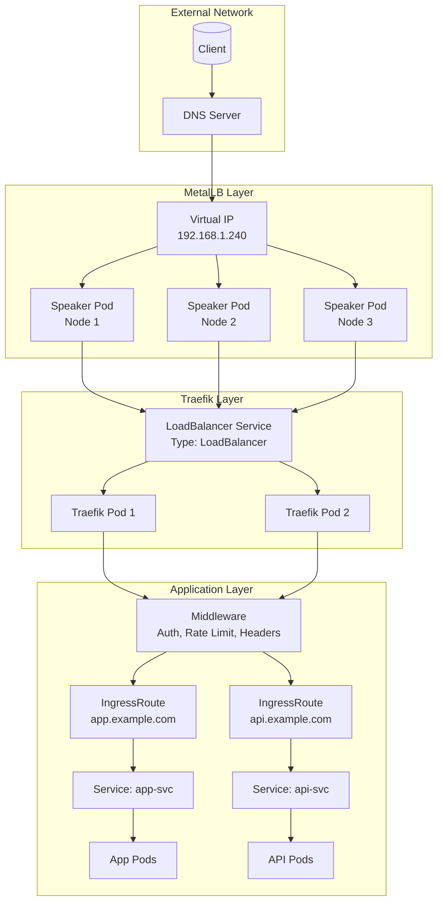
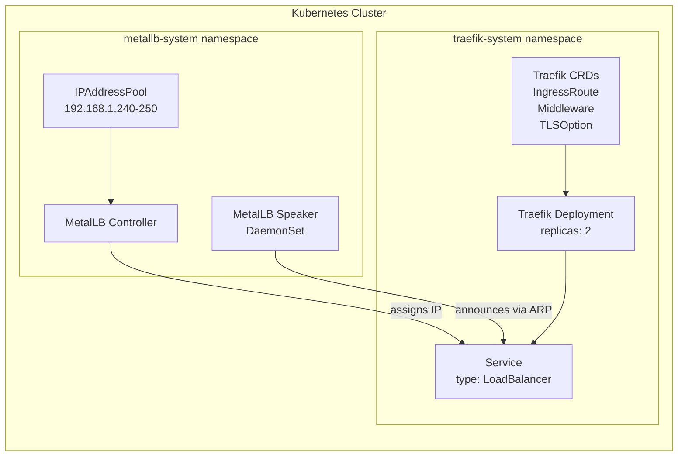
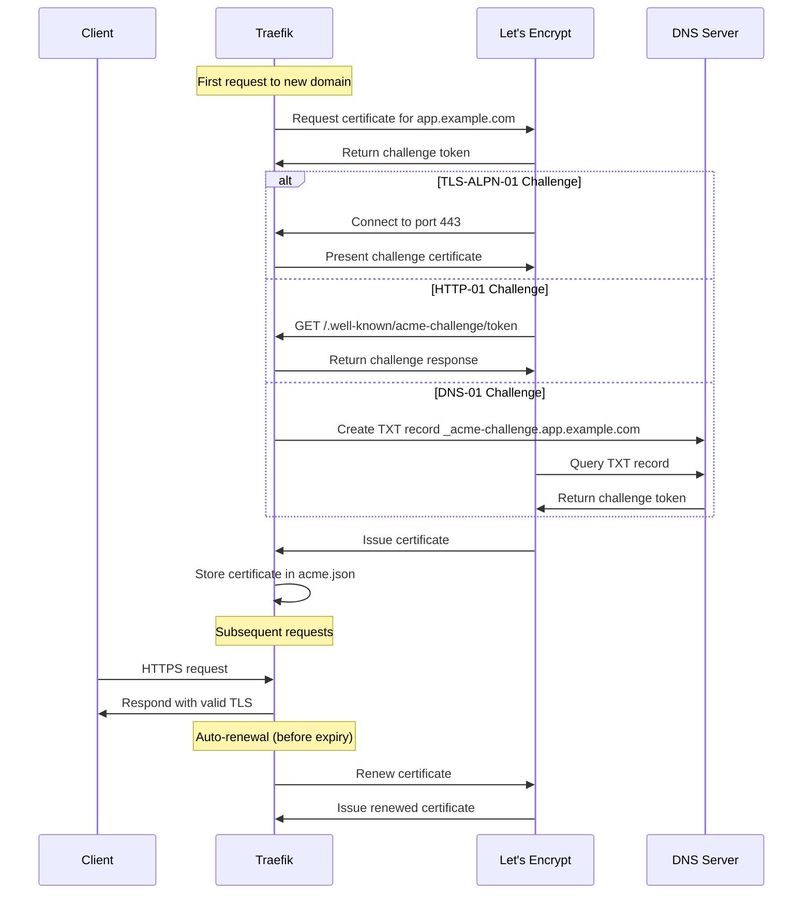
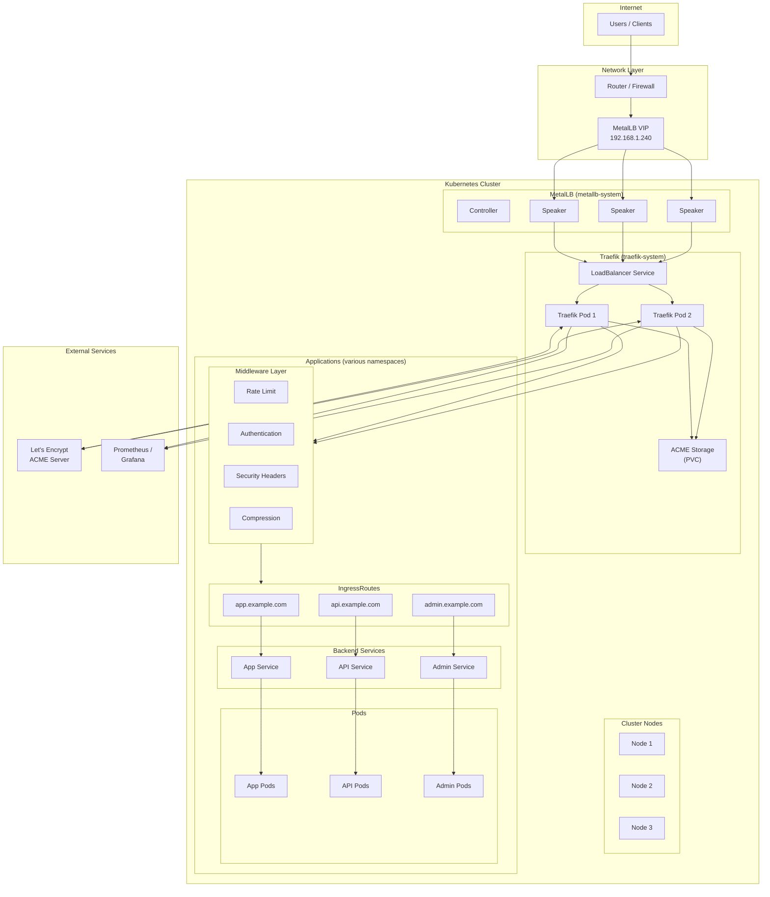

# How to Use MetalLB with Traefik Ingress

Author: [nawazdhandala](https://github.com/nawazdhandala)

Tags: MetalLB, Traefik, Ingress, Kubernetes, Load Balancing

Description: Learn how to configure MetalLB with Traefik for feature-rich ingress management.

---

In this comprehensive guide, we will explore how to integrate MetalLB with Traefik Ingress Controller to build a production-ready ingress solution for bare-metal Kubernetes clusters. This combination provides external load balancing capabilities with feature-rich traffic management, middleware support, and automatic TLS certificate management through Let's Encrypt.

## Table of Contents

1. [Understanding the Architecture](#understanding-the-architecture)
2. [Prerequisites](#prerequisites)
3. [Installing MetalLB](#installing-metallb)
4. [Deploying Traefik with LoadBalancer Service](#deploying-traefik-with-loadbalancer-service)
5. [Configuring IngressRoute Resources](#configuring-ingressroute-resources)
6. [Implementing Middleware](#implementing-middleware)
7. [Setting Up Let's Encrypt TLS](#setting-up-lets-encrypt-tls)
8. [Advanced Configuration](#advanced-configuration)
9. [Troubleshooting](#troubleshooting)
10. [Best Practices](#best-practices)

## Understanding the Architecture

Before diving into the configuration, let's understand how MetalLB and Traefik work together to handle incoming traffic.



The traffic flow works as follows:

1. **Client Request**: A client sends a request to your application's domain
2. **DNS Resolution**: The domain resolves to the external IP provided by MetalLB
3. **MetalLB**: Announces the external IP and routes traffic to the Traefik LoadBalancer service
4. **Traefik**: Receives the traffic, applies middleware (authentication, rate limiting, headers), and routes to the appropriate backend service based on IngressRoute rules
5. **Application**: The backend pods receive the processed request

## Prerequisites

Before starting, ensure you have the following:

- A Kubernetes cluster (v1.21+) running on bare-metal or a platform without cloud load balancer support
- `kubectl` configured to communicate with your cluster
- `helm` v3 installed for deploying applications
- A range of available IP addresses for MetalLB to use
- Domain names pointing to your MetalLB IP addresses (for TLS setup)

## Installing MetalLB

First, let's install MetalLB to provide load balancing capabilities for our bare-metal cluster.

The following command adds the MetalLB Helm repository to your local Helm configuration, which is required before installing MetalLB charts.

```bash
# Add the MetalLB Helm repository
helm repo add metallb https://metallb.github.io/metallb

# Update Helm repositories to fetch the latest chart versions
helm repo update
```

Create a namespace for MetalLB and install it with Helm. We use a dedicated namespace to isolate MetalLB resources and make management easier.

```bash
# Create a dedicated namespace for MetalLB
kubectl create namespace metallb-system

# Install MetalLB using Helm with default configuration
# The --wait flag ensures the command only returns after all resources are ready
helm install metallb metallb/metallb \
  --namespace metallb-system \
  --wait
```

After MetalLB is installed, we need to configure an IP address pool. This YAML defines the range of IP addresses that MetalLB can assign to LoadBalancer services.

```yaml
# metallb-config.yaml
# This configuration defines an IP address pool for MetalLB to use
# Replace the IP range with addresses available on your network
apiVersion: metallb.io/v1beta1
kind: IPAddressPool
metadata:
  name: default-pool
  namespace: metallb-system
spec:
  # Define the range of IP addresses MetalLB can assign
  # These must be available IPs on your network that aren't in use
  addresses:
  - 192.168.1.240-192.168.1.250
---
# L2Advertisement makes MetalLB announce the IPs using Layer 2 mode (ARP/NDP)
# This is the simplest mode and works on any network without special router configuration
apiVersion: metallb.io/v1beta1
kind: L2Advertisement
metadata:
  name: default-advertisement
  namespace: metallb-system
spec:
  # Reference the IP pool we created above
  ipAddressPools:
  - default-pool
```

Apply the MetalLB configuration to your cluster. This makes the IP pool available for LoadBalancer services.

```bash
# Apply the MetalLB IP address pool and advertisement configuration
kubectl apply -f metallb-config.yaml
```

Verify that MetalLB is running correctly. All pods should be in the Running state before proceeding.

```bash
# Verify MetalLB controller and speaker pods are running
# The controller manages IP assignments, speakers handle network announcements
kubectl get pods -n metallb-system

# Expected output:
# NAME                          READY   STATUS    RESTARTS   AGE
# controller-5f98465b6b-xxxxx   1/1     Running   0          2m
# speaker-xxxxx                 1/1     Running   0          2m
# speaker-yyyyy                 1/1     Running   0          2m
```

## Deploying Traefik with LoadBalancer Service

Now let's deploy Traefik as our ingress controller. Traefik will use the LoadBalancer service type, which MetalLB will fulfill with an external IP.

First, add the Traefik Helm repository and update your local cache.

```bash
# Add the Traefik Helm repository
helm repo add traefik https://traefik.github.io/charts

# Update Helm repositories to get the latest chart versions
helm repo update
```

Create a comprehensive values file for Traefik. This configuration enables key features like dashboard access, metrics, and proper resource allocation.

```yaml
# traefik-values.yaml
# Comprehensive Traefik configuration for production use with MetalLB

# Global arguments passed to the Traefik binary
# These configure core Traefik behavior
globalArguments:
  # Disable anonymous usage statistics
  - "--global.sendanonymoususage=false"
  # Enable API and dashboard access
  - "--api.dashboard=true"

# Additional command-line arguments for Traefik
additionalArguments:
  # Enable access logs for debugging and monitoring
  - "--accesslog=true"
  # Format access logs as JSON for easier parsing by log aggregators
  - "--accesslog.format=json"
  # Enable debug logging (set to false in production for performance)
  - "--log.level=DEBUG"

# Configure the deployment settings
deployment:
  # Run 2 replicas for high availability
  replicas: 2

# Service configuration - this is where MetalLB integration happens
service:
  # Enable the Traefik service
  enabled: true
  # Use LoadBalancer type - MetalLB will assign an external IP
  type: LoadBalancer
  # Annotations for MetalLB configuration
  annotations:
    # Request a specific IP from MetalLB's pool (optional)
    # Remove this to let MetalLB auto-assign an IP
    metallb.universe.tf/loadBalancerIPs: "192.168.1.240"
  spec:
    # Preserve the client's source IP address
    # This is important for logging, rate limiting, and security
    externalTrafficPolicy: Local

# Entry points define the ports Traefik listens on
ports:
  # HTTP entry point configuration
  web:
    port: 8000
    exposedPort: 80
    expose:
      default: true
    protocol: TCP
    # Redirect all HTTP traffic to HTTPS (uncomment for production)
    # redirectTo:
    #   port: websecure

  # HTTPS entry point configuration
  websecure:
    port: 8443
    exposedPort: 443
    expose:
      default: true
    protocol: TCP
    # TLS configuration is handled by certificate resolvers
    tls:
      enabled: true

  # Traefik dashboard and metrics port
  traefik:
    port: 9000
    expose:
      default: false
    protocol: TCP

# Enable Prometheus metrics for monitoring
metrics:
  prometheus:
    # The entrypoint for metrics (matches 'traefik' port above)
    entryPoint: traefik
    # Enable service monitor for Prometheus Operator integration
    service:
      enabled: true
    # Uncomment if using Prometheus Operator
    # serviceMonitor:
    #   enabled: true

# Resource requests and limits for Traefik pods
resources:
  requests:
    # Minimum CPU allocation
    cpu: "100m"
    # Minimum memory allocation
    memory: "128Mi"
  limits:
    # Maximum CPU allocation
    cpu: "500m"
    # Maximum memory allocation
    memory: "512Mi"

# Pod disruption budget ensures availability during updates
podDisruptionBudget:
  enabled: true
  # Always keep at least 1 pod available
  minAvailable: 1

# Enable Traefik's IngressRoute CRD for advanced routing
ingressRoute:
  dashboard:
    # Enable the dashboard IngressRoute
    enabled: true
    # Restrict dashboard access with middleware (configured later)
    annotations: {}

# Provider configuration - how Traefik discovers services
providers:
  # Enable Kubernetes Ingress provider for standard Ingress resources
  kubernetesIngress:
    enabled: true
    # Allow Traefik to read Ingress from all namespaces
    allowCrossNamespace: true
  # Enable Kubernetes CRD provider for IngressRoute resources
  kubernetesCRD:
    enabled: true
    # Allow IngressRoute to reference services in other namespaces
    allowCrossNamespace: true

# Logs configuration
logs:
  # General Traefik logs
  general:
    # Log level: DEBUG, INFO, WARN, ERROR
    level: INFO
  # Access logs for incoming requests
  access:
    enabled: true
    # Log all requests, not just errors
    filters: {}
```

Deploy Traefik using the values file we created. The installation creates the deployment, service, and required CRDs.

```bash
# Create a dedicated namespace for Traefik
kubectl create namespace traefik-system

# Install Traefik using Helm with our custom configuration
# The -f flag points to our values file
helm install traefik traefik/traefik \
  --namespace traefik-system \
  --values traefik-values.yaml \
  --wait
```

Verify that Traefik is deployed and has received an external IP from MetalLB.

```bash
# Check that Traefik pods are running
kubectl get pods -n traefik-system

# Verify the LoadBalancer service has an external IP from MetalLB
# The EXTERNAL-IP should show an IP from your MetalLB pool
kubectl get svc -n traefik-system

# Expected output:
# NAME      TYPE           CLUSTER-IP     EXTERNAL-IP     PORT(S)                      AGE
# traefik   LoadBalancer   10.96.xxx.xx   192.168.1.240   80:30080/TCP,443:30443/TCP   2m
```

The following diagram illustrates the relationship between MetalLB and Traefik components:



## Configuring IngressRoute Resources

Traefik's IngressRoute CRD provides more powerful routing capabilities than standard Kubernetes Ingress resources. Let's configure IngressRoute for a sample application.

First, deploy a sample application that we'll expose through Traefik.

```yaml
# sample-app.yaml
# This deploys a simple web application for testing our ingress configuration
apiVersion: apps/v1
kind: Deployment
metadata:
  name: whoami
  namespace: default
  labels:
    app: whoami
spec:
  replicas: 3
  selector:
    matchLabels:
      app: whoami
  template:
    metadata:
      labels:
        app: whoami
    spec:
      containers:
      - name: whoami
        # traefik/whoami is a simple HTTP server that returns request information
        image: traefik/whoami:latest
        ports:
        - containerPort: 80
        # Resource limits for the container
        resources:
          requests:
            cpu: "10m"
            memory: "32Mi"
          limits:
            cpu: "100m"
            memory: "64Mi"
---
# Service to expose the whoami deployment
apiVersion: v1
kind: Service
metadata:
  name: whoami
  namespace: default
spec:
  selector:
    app: whoami
  ports:
  - port: 80
    targetPort: 80
  type: ClusterIP
```

Apply the sample application deployment.

```bash
# Deploy the sample application
kubectl apply -f sample-app.yaml

# Verify the deployment is running
kubectl get pods -l app=whoami
kubectl get svc whoami
```

Now create an IngressRoute to expose the application. IngressRoute supports advanced matching rules, priority, and middleware chains.

```yaml
# ingressroute.yaml
# IngressRoute provides advanced routing capabilities for Traefik
apiVersion: traefik.io/v1alpha1
kind: IngressRoute
metadata:
  name: whoami-route
  namespace: default
spec:
  # Define which entry points this route applies to
  # 'web' is HTTP (port 80), 'websecure' is HTTPS (port 443)
  entryPoints:
    - web
    - websecure

  # Routes define the matching rules and target services
  routes:
    # Route 1: Match requests to app.example.com
    - match: Host(`app.example.com`)
      # Kind can be 'Rule' for standard routing
      kind: Rule
      # Priority determines which route takes precedence (higher = more priority)
      priority: 10
      # Services define the backend targets
      services:
        - name: whoami
          port: 80
          # Weight for load balancing (useful with multiple services)
          weight: 100
          # Pass the original Host header to the backend
          passHostHeader: true

    # Route 2: Match requests to app.example.com with /api prefix
    - match: Host(`app.example.com`) && PathPrefix(`/api`)
      kind: Rule
      # Higher priority ensures this matches before the general route
      priority: 20
      services:
        - name: whoami
          port: 80
      # Apply middlewares (defined in the next section)
      middlewares:
        - name: api-ratelimit
          namespace: default
        - name: api-headers
          namespace: default

  # TLS configuration (optional for HTTPS)
  # tls:
  #   secretName: app-example-com-tls
```

Apply the IngressRoute to your cluster.

```bash
# Apply the IngressRoute configuration
kubectl apply -f ingressroute.yaml

# Verify the IngressRoute was created
kubectl get ingressroute -n default

# Test the route (replace with your actual domain or use --resolve flag)
curl -H "Host: app.example.com" http://192.168.1.240/
```

For more complex routing scenarios, you can use path-based routing, header matching, or query parameter matching:

```yaml
# advanced-ingressroute.yaml
# Demonstrates advanced routing patterns with Traefik IngressRoute
apiVersion: traefik.io/v1alpha1
kind: IngressRoute
metadata:
  name: advanced-routes
  namespace: default
spec:
  entryPoints:
    - websecure
  routes:
    # Path-based routing with prefix stripping
    - match: Host(`api.example.com`) && PathPrefix(`/v1`)
      kind: Rule
      services:
        - name: api-v1-service
          port: 80
      middlewares:
        # Strip the /v1 prefix before forwarding to the service
        - name: strip-v1-prefix

    # Header-based routing for A/B testing or canary deployments
    - match: Host(`api.example.com`) && Headers(`X-Version`, `beta`)
      kind: Rule
      # Higher priority for header-specific routes
      priority: 30
      services:
        - name: api-beta-service
          port: 80

    # Query parameter matching for debugging or feature flags
    - match: Host(`api.example.com`) && Query(`debug`, `true`)
      kind: Rule
      priority: 25
      services:
        - name: api-debug-service
          port: 80
```

## Implementing Middleware

Traefik middleware allows you to modify requests and responses as they pass through the proxy. Common uses include authentication, rate limiting, header manipulation, and circuit breaking.

The following configuration creates several useful middleware components.

```yaml
# middleware.yaml
# Collection of Traefik middleware configurations for common use cases

# Rate limiting middleware - prevents abuse and protects backend services
apiVersion: traefik.io/v1alpha1
kind: Middleware
metadata:
  name: api-ratelimit
  namespace: default
spec:
  rateLimit:
    # Average number of requests allowed per second
    average: 100
    # Maximum burst of requests above the average
    burst: 200
    # Time period for rate calculation
    period: 1s
    # Rate limit is applied per source IP
    sourceCriterion:
      ipStrategy:
        # Depth of 0 means use the direct client IP
        # Increase if behind additional proxies
        depth: 0

---
# Custom headers middleware - adds security and custom headers
apiVersion: traefik.io/v1alpha1
kind: Middleware
metadata:
  name: api-headers
  namespace: default
spec:
  headers:
    # Security headers to protect against common attacks
    frameDeny: true
    browserXssFilter: true
    contentTypeNosniff: true
    # HSTS configuration (use with HTTPS)
    stsSeconds: 31536000
    stsIncludeSubdomains: true
    stsPreload: true
    # Custom headers for backend identification
    customRequestHeaders:
      X-Forwarded-Proto: "https"
      X-Custom-Header: "traefik-processed"
    # Remove headers that expose server internals
    customResponseHeaders:
      X-Powered-By: ""
      Server: ""

---
# Basic authentication middleware - simple username/password protection
apiVersion: traefik.io/v1alpha1
kind: Middleware
metadata:
  name: basic-auth
  namespace: default
spec:
  basicAuth:
    # Secret containing htpasswd-formatted credentials
    secret: auth-secret
    # Realm shown in the authentication dialog
    realm: "Traefik Dashboard"
    # Remove the Authorization header before forwarding
    removeHeader: true

---
# Retry middleware - automatic retry on failure
apiVersion: traefik.io/v1alpha1
kind: Middleware
metadata:
  name: retry-middleware
  namespace: default
spec:
  retry:
    # Number of retry attempts
    attempts: 3
    # Initial interval between retries (exponential backoff)
    initialInterval: 100ms

---
# Circuit breaker middleware - prevents cascade failures
apiVersion: traefik.io/v1alpha1
kind: Middleware
metadata:
  name: circuit-breaker
  namespace: default
spec:
  circuitBreaker:
    # Open circuit when 50% of requests fail within the check period
    expression: "NetworkErrorRatio() > 0.50 || ResponseCodeRatio(500, 600, 0, 600) > 0.50"
    # Time to wait before attempting to close the circuit
    checkPeriod: 10s
    # Time circuit stays open before half-open state
    fallbackDuration: 30s
    # Number of requests to try in half-open state
    recoveryDuration: 60s

---
# Compress middleware - enables gzip compression for responses
apiVersion: traefik.io/v1alpha1
kind: Middleware
metadata:
  name: compress-response
  namespace: default
spec:
  compress:
    # Exclude file types that are already compressed
    excludedContentTypes:
      - "image/png"
      - "image/jpeg"
      - "image/gif"

---
# IP allowlist middleware - restrict access to specific IPs
apiVersion: traefik.io/v1alpha1
kind: Middleware
metadata:
  name: ip-allowlist
  namespace: default
spec:
  ipAllowList:
    # Only allow requests from these IP ranges
    sourceRange:
      - "10.0.0.0/8"
      - "172.16.0.0/12"
      - "192.168.0.0/16"
    # Strategy for determining client IP
    ipStrategy:
      depth: 0

---
# Strip prefix middleware - removes path prefix before forwarding
apiVersion: traefik.io/v1alpha1
kind: Middleware
metadata:
  name: strip-v1-prefix
  namespace: default
spec:
  stripPrefix:
    # Prefixes to remove from the request path
    prefixes:
      - "/v1"
    # Force the slash if the resulting path is empty
    forceSlash: true

---
# Redirect regex middleware - URL rewriting and redirects
apiVersion: traefik.io/v1alpha1
kind: Middleware
metadata:
  name: redirect-www
  namespace: default
spec:
  redirectRegex:
    # Match the www subdomain
    regex: "^https?://www\\.(.+)"
    # Redirect to the non-www version
    replacement: "https://${1}"
    # Use permanent redirect (301)
    permanent: true
```

Create the secret for basic authentication. The htpasswd command generates the proper format for Traefik.

```bash
# Generate htpasswd-formatted credentials
# Use bcrypt (-B) for secure password hashing
# Replace 'admin' and 'secure-password' with your values
htpasswd -nbB admin 'secure-password' | base64

# Create the secret with the base64-encoded credentials
kubectl create secret generic auth-secret \
  --namespace=default \
  --from-literal=users='admin:$2y$05$xxxxxxxxxxxxxxxxxxxxxxxxxxxxxxxxxxxxxxxxxxxxx'
```

Apply all middleware configurations.

```bash
# Apply all middleware configurations
kubectl apply -f middleware.yaml

# Verify middleware was created
kubectl get middleware -n default
```

Now update the IngressRoute to use multiple middleware in a chain:

```yaml
# ingressroute-with-middleware.yaml
# IngressRoute with a middleware chain for comprehensive request processing
apiVersion: traefik.io/v1alpha1
kind: IngressRoute
metadata:
  name: whoami-secure
  namespace: default
spec:
  entryPoints:
    - websecure
  routes:
    - match: Host(`app.example.com`)
      kind: Rule
      services:
        - name: whoami
          port: 80
      # Middleware chain - applied in order
      middlewares:
        # 1. Rate limiting first to prevent abuse
        - name: api-ratelimit
          namespace: default
        # 2. Security headers
        - name: api-headers
          namespace: default
        # 3. Compression for faster responses
        - name: compress-response
          namespace: default
        # 4. Circuit breaker for resilience
        - name: circuit-breaker
          namespace: default
  tls:
    # Use the certificate resolver for automatic TLS (configured below)
    certResolver: letsencrypt
```

## Setting Up Let's Encrypt TLS

Traefik has built-in support for automatic TLS certificate management through Let's Encrypt. This configuration enables automatic certificate issuance and renewal.

First, update the Traefik Helm values to enable the Let's Encrypt certificate resolver.

```yaml
# traefik-values-tls.yaml
# Extended Traefik configuration with Let's Encrypt support

# Previous configuration remains the same...

# Certificate resolvers configuration for automatic TLS
additionalArguments:
  # Enable access logs
  - "--accesslog=true"
  - "--accesslog.format=json"
  - "--log.level=INFO"

  # Let's Encrypt ACME configuration
  # Production server (rate limited - use after testing with staging)
  - "--certificatesresolvers.letsencrypt.acme.email=admin@example.com"
  - "--certificatesresolvers.letsencrypt.acme.storage=/data/acme.json"
  - "--certificatesresolvers.letsencrypt.acme.tlschallenge=true"

  # Staging server for testing (uncomment to use, no rate limits)
  # - "--certificatesresolvers.letsencrypt-staging.acme.email=admin@example.com"
  # - "--certificatesresolvers.letsencrypt-staging.acme.storage=/data/acme-staging.json"
  # - "--certificatesresolvers.letsencrypt-staging.acme.tlschallenge=true"
  # - "--certificatesresolvers.letsencrypt-staging.acme.caserver=https://acme-staging-v02.api.letsencrypt.org/directory"

# Persistent storage for ACME certificates
persistence:
  enabled: true
  name: data
  # Access mode for the PVC
  accessMode: ReadWriteOnce
  # Storage size for certificate data
  size: 128Mi
  # Storage class (optional, uses default if not specified)
  # storageClass: "standard"
  # Path inside the container where certificates are stored
  path: /data

# Entry points with TLS configuration
ports:
  web:
    port: 8000
    exposedPort: 80
    expose:
      default: true
    protocol: TCP
    # Redirect HTTP to HTTPS
    redirectTo:
      port: websecure

  websecure:
    port: 8443
    exposedPort: 443
    expose:
      default: true
    protocol: TCP
    tls:
      enabled: true
      # Use the Let's Encrypt resolver by default
      certResolver: letsencrypt
      # Domains to include in the default certificate
      domains:
        - main: "example.com"
          sans:
            - "*.example.com"
```

For HTTP-01 challenge (if TLS challenge doesn't work), update the configuration:

```yaml
# traefik-values-http-challenge.yaml
# Alternative configuration using HTTP-01 challenge for Let's Encrypt

additionalArguments:
  - "--accesslog=true"
  - "--log.level=INFO"

  # HTTP-01 challenge configuration
  # This requires port 80 to be accessible from the internet
  - "--certificatesresolvers.letsencrypt.acme.email=admin@example.com"
  - "--certificatesresolvers.letsencrypt.acme.storage=/data/acme.json"
  - "--certificatesresolvers.letsencrypt.acme.httpchallenge=true"
  - "--certificatesresolvers.letsencrypt.acme.httpchallenge.entrypoint=web"
```

For DNS-01 challenge (supports wildcard certificates), you need to configure a DNS provider:

```yaml
# traefik-values-dns-challenge.yaml
# DNS-01 challenge configuration for wildcard certificates
# This example uses Cloudflare as the DNS provider

# Additional environment variables for DNS provider credentials
env:
  - name: CF_API_EMAIL
    valueFrom:
      secretKeyRef:
        name: cloudflare-credentials
        key: email
  - name: CF_API_KEY
    valueFrom:
      secretKeyRef:
        name: cloudflare-credentials
        key: apikey

additionalArguments:
  - "--accesslog=true"
  - "--log.level=INFO"

  # DNS-01 challenge with Cloudflare
  - "--certificatesresolvers.letsencrypt.acme.email=admin@example.com"
  - "--certificatesresolvers.letsencrypt.acme.storage=/data/acme.json"
  - "--certificatesresolvers.letsencrypt.acme.dnschallenge=true"
  - "--certificatesresolvers.letsencrypt.acme.dnschallenge.provider=cloudflare"
  - "--certificatesresolvers.letsencrypt.acme.dnschallenge.resolvers=1.1.1.1:53,8.8.8.8:53"
```

Create the Cloudflare credentials secret for DNS challenge:

```bash
# Create secret for Cloudflare DNS credentials
kubectl create secret generic cloudflare-credentials \
  --namespace traefik-system \
  --from-literal=email=your-cloudflare-email@example.com \
  --from-literal=apikey=your-cloudflare-api-key
```

Upgrade Traefik with the new TLS configuration:

```bash
# Upgrade Traefik with TLS configuration
helm upgrade traefik traefik/traefik \
  --namespace traefik-system \
  --values traefik-values-tls.yaml \
  --wait
```

Create an IngressRoute that uses Let's Encrypt certificates:

```yaml
# ingressroute-tls.yaml
# IngressRoute with automatic Let's Encrypt TLS certificate
apiVersion: traefik.io/v1alpha1
kind: IngressRoute
metadata:
  name: whoami-tls
  namespace: default
spec:
  entryPoints:
    - websecure
  routes:
    - match: Host(`app.example.com`)
      kind: Rule
      services:
        - name: whoami
          port: 80
  tls:
    # Use the Let's Encrypt certificate resolver
    # Traefik will automatically request and renew certificates
    certResolver: letsencrypt
    # Specify domains for the certificate
    domains:
      - main: app.example.com
        # Subject Alternative Names (optional)
        sans:
          - www.app.example.com
```

The following diagram shows the TLS certificate flow:



## Advanced Configuration

### Custom TLS Options

Create custom TLS options for specific security requirements:

```yaml
# tls-options.yaml
# Custom TLS configuration for enhanced security

apiVersion: traefik.io/v1alpha1
kind: TLSOption
metadata:
  name: modern-tls
  namespace: default
spec:
  # Minimum TLS version (TLS 1.2 or 1.3 recommended)
  minVersion: VersionTLS12
  # Maximum TLS version
  maxVersion: VersionTLS13
  # Cipher suites for TLS 1.2 (TLS 1.3 has fixed ciphers)
  cipherSuites:
    - TLS_ECDHE_ECDSA_WITH_AES_256_GCM_SHA384
    - TLS_ECDHE_RSA_WITH_AES_256_GCM_SHA384
    - TLS_ECDHE_ECDSA_WITH_CHACHA20_POLY1305
    - TLS_ECDHE_RSA_WITH_CHACHA20_POLY1305
  # Curve preferences for ECDHE
  curvePreferences:
    - CurveP521
    - CurveP384
  # Enable strict SNI checking
  sniStrict: true

---
# Strict TLS option for highly sensitive endpoints
apiVersion: traefik.io/v1alpha1
kind: TLSOption
metadata:
  name: strict-tls
  namespace: default
spec:
  # Only allow TLS 1.3
  minVersion: VersionTLS13
  # Require client certificates (mutual TLS)
  clientAuth:
    # Secret containing CA certificate for client verification
    secretNames:
      - client-ca-cert
    # Require valid client certificate
    clientAuthType: RequireAndVerifyClientCert
```

Use the TLS option in your IngressRoute:

```yaml
# ingressroute-custom-tls.yaml
apiVersion: traefik.io/v1alpha1
kind: IngressRoute
metadata:
  name: secure-app
  namespace: default
spec:
  entryPoints:
    - websecure
  routes:
    - match: Host(`secure.example.com`)
      kind: Rule
      services:
        - name: secure-app
          port: 443
          # Use HTTPS to communicate with the backend
          scheme: https
          # Skip TLS verification for self-signed backend certs
          serversTransport: skip-verify
  tls:
    certResolver: letsencrypt
    # Reference the custom TLS options
    options:
      name: modern-tls
      namespace: default
```

### Weighted Load Balancing and Canary Deployments

Configure weighted routing for canary deployments:

```yaml
# canary-ingressroute.yaml
# Weighted routing for canary deployments
apiVersion: traefik.io/v1alpha1
kind: IngressRoute
metadata:
  name: canary-deployment
  namespace: default
spec:
  entryPoints:
    - websecure
  routes:
    - match: Host(`app.example.com`)
      kind: Rule
      services:
        # Stable version receives 90% of traffic
        - name: app-stable
          port: 80
          weight: 90
        # Canary version receives 10% of traffic
        - name: app-canary
          port: 80
          weight: 10
  tls:
    certResolver: letsencrypt
```

### Traffic Mirroring

Mirror traffic to a test service without affecting production responses:

```yaml
# mirror-ingressroute.yaml
# Traffic mirroring for shadow testing
apiVersion: traefik.io/v1alpha1
kind: TraefikService
metadata:
  name: mirrored-service
  namespace: default
spec:
  mirroring:
    # Primary service that returns responses
    name: app-production
    port: 80
    mirrors:
      # Mirror traffic to the test service
      - name: app-test
        port: 80
        # Mirror 100% of requests
        percent: 100
---
apiVersion: traefik.io/v1alpha1
kind: IngressRoute
metadata:
  name: mirror-route
  namespace: default
spec:
  entryPoints:
    - websecure
  routes:
    - match: Host(`app.example.com`)
      kind: Rule
      services:
        # Reference the TraefikService instead of a Kubernetes Service
        - name: mirrored-service
          kind: TraefikService
  tls:
    certResolver: letsencrypt
```

### TCP and UDP Routing

Traefik can also route TCP and UDP traffic:

```yaml
# tcp-ingressroute.yaml
# TCP routing for non-HTTP protocols (e.g., databases, message queues)
apiVersion: traefik.io/v1alpha1
kind: IngressRouteTCP
metadata:
  name: postgres-route
  namespace: default
spec:
  entryPoints:
    # Define a TCP entrypoint in Traefik values
    - postgres
  routes:
    - match: HostSNI(`postgres.example.com`)
      services:
        - name: postgres-service
          port: 5432
          weight: 100
  tls:
    # Passthrough TLS to the backend (Traefik doesn't terminate)
    passthrough: true
```

Add the TCP entry point to Traefik values:

```yaml
# Additional entry point for TCP services
ports:
  postgres:
    port: 5432
    exposedPort: 5432
    expose:
      default: true
    protocol: TCP
```

## Troubleshooting

### Common Issues and Solutions

Check MetalLB and Traefik status when things aren't working:

```bash
# Check MetalLB controller logs for IP allocation issues
kubectl logs -n metallb-system -l app.kubernetes.io/component=controller

# Check MetalLB speaker logs for network announcement issues
kubectl logs -n metallb-system -l app.kubernetes.io/component=speaker

# Check Traefik logs for routing and TLS issues
kubectl logs -n traefik-system -l app.kubernetes.io/name=traefik

# Verify the LoadBalancer has an external IP
kubectl get svc -n traefik-system traefik

# Check IngressRoute status
kubectl describe ingressroute -n default whoami-route

# Verify middleware configuration
kubectl describe middleware -n default api-ratelimit

# Check certificate status (if using Let's Encrypt)
kubectl exec -n traefik-system deploy/traefik -- cat /data/acme.json | jq
```

### Debugging Network Connectivity

```bash
# Test connectivity from inside the cluster
kubectl run debug-pod --image=nicolaka/netshoot --rm -it -- /bin/bash

# Inside the debug pod, test various connections
curl -v http://traefik.traefik-system.svc.cluster.local
curl -v -H "Host: app.example.com" http://192.168.1.240

# Check ARP announcements from MetalLB
arping 192.168.1.240

# Verify DNS resolution (if configured)
nslookup app.example.com
```

### Certificate Troubleshooting

```bash
# Check certificate details
openssl s_client -connect app.example.com:443 -servername app.example.com

# Verify certificate chain
curl -vI https://app.example.com

# Check Traefik's stored certificates
kubectl exec -n traefik-system deploy/traefik -- \
  cat /data/acme.json | jq '.letsencrypt.Certificates'

# Force certificate renewal (delete and recreate IngressRoute)
kubectl delete ingressroute whoami-tls -n default
kubectl apply -f ingressroute-tls.yaml
```

## Best Practices

### Security Best Practices

1. **Always use HTTPS in production**: Configure HTTP to HTTPS redirect and use valid TLS certificates

2. **Implement rate limiting**: Protect your services from abuse with rate limiting middleware

3. **Use security headers**: Add security headers to prevent common web attacks

4. **Restrict dashboard access**: Protect the Traefik dashboard with authentication and IP restrictions

```yaml
# dashboard-ingressroute.yaml
# Secure Traefik dashboard access
apiVersion: traefik.io/v1alpha1
kind: IngressRoute
metadata:
  name: traefik-dashboard
  namespace: traefik-system
spec:
  entryPoints:
    - websecure
  routes:
    - match: Host(`traefik.example.com`) && (PathPrefix(`/api`) || PathPrefix(`/dashboard`))
      kind: Rule
      services:
        - name: api@internal
          kind: TraefikService
      middlewares:
        # Require authentication
        - name: basic-auth
          namespace: default
        # Restrict to internal IPs only
        - name: ip-allowlist
          namespace: default
  tls:
    certResolver: letsencrypt
```

### High Availability Configuration

1. **Run multiple Traefik replicas**: Ensure at least 2 replicas for fault tolerance

2. **Configure pod disruption budgets**: Prevent all pods from being evicted during maintenance

3. **Use pod anti-affinity**: Spread Traefik pods across nodes

```yaml
# traefik-ha-values.yaml
# High availability configuration for Traefik

deployment:
  replicas: 3

affinity:
  podAntiAffinity:
    # Prefer to schedule on different nodes
    preferredDuringSchedulingIgnoredDuringExecution:
      - weight: 100
        podAffinityTerm:
          labelSelector:
            matchLabels:
              app.kubernetes.io/name: traefik
          topologyKey: kubernetes.io/hostname

podDisruptionBudget:
  enabled: true
  minAvailable: 2

# Topology spread for even distribution
topologySpreadConstraints:
  - maxSkew: 1
    topologyKey: kubernetes.io/hostname
    whenUnsatisfiable: ScheduleAnyway
    labelSelector:
      matchLabels:
        app.kubernetes.io/name: traefik
```

### Monitoring and Observability

Enable comprehensive monitoring for your ingress infrastructure:

```yaml
# traefik-monitoring-values.yaml
# Monitoring configuration for Traefik

metrics:
  prometheus:
    entryPoint: traefik
    service:
      enabled: true
    serviceMonitor:
      enabled: true
      # Scrape interval
      interval: 30s
      # Additional labels for the ServiceMonitor
      additionalLabels:
        release: prometheus

# Tracing configuration (optional)
tracing:
  serviceName: traefik
  # Enable Jaeger tracing
  jaeger:
    samplingServerURL: http://jaeger-agent.tracing:5778/sampling
    localAgentHostPort: jaeger-agent.tracing:6831
```

### Complete Architecture Diagram



## Conclusion

Combining MetalLB with Traefik provides a powerful, production-ready ingress solution for bare-metal Kubernetes clusters. This setup offers:

- **External Load Balancing**: MetalLB provides stable external IPs without cloud provider integration
- **Advanced Routing**: Traefik's IngressRoute CRD enables sophisticated traffic management
- **Middleware Pipeline**: Chain middleware components for authentication, rate limiting, and security
- **Automatic TLS**: Let's Encrypt integration provides automatic certificate management
- **High Availability**: Both components can be configured for fault tolerance

The configurations in this guide provide a solid foundation that you can customize for your specific requirements. Start with the basic setup and gradually add middleware, TLS, and advanced routing features as needed.

## Further Reading

- [MetalLB Official Documentation](https://metallb.universe.tf/)
- [Traefik Documentation](https://doc.traefik.io/traefik/)
- [Let's Encrypt Documentation](https://letsencrypt.org/docs/)
- [Kubernetes Ingress Concepts](https://kubernetes.io/docs/concepts/services-networking/ingress/)
