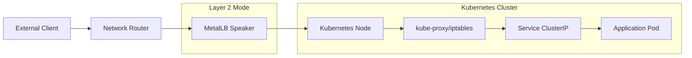
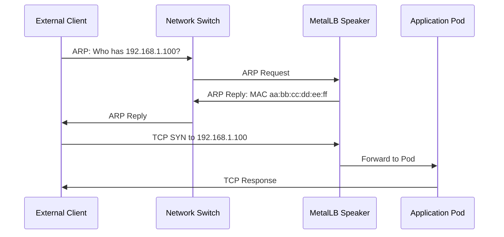
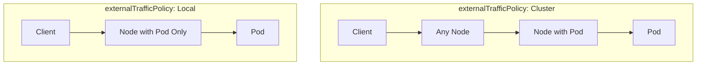

# How to Diagnose MetalLB Traffic Not Reaching Pods

Author: [nawazdhandala](https://github.com/nawazdhandala)

Tags: MetalLB, Kubernetes, Troubleshooting, Networking, Load Balancing, Debugging, Traffic Analysis

Description: Learn how to diagnose issues when MetalLB traffic is not reaching pods by tracing the network path from external clients.

---

When external traffic fails to reach your pods through MetalLB, the problem could exist at any point along the network path. This guide walks you through systematic diagnosis, from the external client all the way to your application pods.

## Understanding the Traffic Flow

Before diving into troubleshooting, you need to understand how traffic flows through MetalLB to reach your pods.



In Layer 2 mode, MetalLB responds to ARP requests for the service IP. In BGP mode, MetalLB advertises routes to your upstream router. Problems can occur at any of these hops.

## Step 1: Verify Service and Endpoint Configuration

Start by confirming your Service has an external IP assigned and endpoints are healthy.

Check if MetalLB assigned an external IP to your service:

```bash
kubectl get svc -A | grep LoadBalancer
```

Verify the service has endpoints (running pods):

```bash
kubectl get endpoints <service-name> -n <namespace>
```

Check the service details including selector and ports:

```bash
kubectl describe svc <service-name> -n <namespace>
```

If endpoints are empty, your pods either are not running or their labels do not match the service selector. Check pod status:

```bash
kubectl get pods -n <namespace> -l <selector-label>=<selector-value>
```

## Step 2: Verify MetalLB Speaker Health

MetalLB speakers are responsible for announcing the service IP. If they are unhealthy, external traffic cannot reach your cluster.

Check MetalLB speaker pod status:

```bash
kubectl get pods -n metallb-system -l app=metallb,component=speaker
```

View speaker logs for errors:

```bash
kubectl logs -n metallb-system -l component=speaker --tail=100
```

Look for these common error patterns:
- "no available nodes" - Node selectors may be too restrictive
- "failed to assign" - IP pool exhausted or misconfigured
- "ARP failed" - Network interface issues

Check MetalLB controller for configuration issues:

```bash
kubectl logs -n metallb-system -l component=controller --tail=100
```

## Step 3: Verify IP Address Pool Configuration

Ensure your IP pool is correctly configured and has available addresses.

List MetalLB IP address pools:

```bash
kubectl get ipaddresspools -n metallb-system -o yaml
```

Check L2 advertisement configuration:

```bash
kubectl get l2advertisements -n metallb-system -o yaml
```

For BGP mode, check BGP peers and advertisements:

```bash
kubectl get bgppeers -n metallb-system -o yaml
kubectl get bgpadvertisements -n metallb-system -o yaml
```

Verify the assigned IP falls within your configured pool:

```bash
kubectl get svc <service-name> -n <namespace> -o jsonpath='{.status.loadBalancer.ingress[0].ip}'
```

## Step 4: Test Network Connectivity from External Client

From your external client, test basic connectivity to the LoadBalancer IP.

Test if the IP responds to ping (if ICMP is allowed):

```bash
ping <loadbalancer-ip>
```

Test TCP connectivity to the service port:

```bash
nc -zv <loadbalancer-ip> <service-port>
```

Use curl with verbose output for HTTP services:

```bash
curl -v http://<loadbalancer-ip>:<service-port>/
```

If these fail, the problem is likely at the network layer (ARP, routing, or firewall).

## Step 5: Diagnose Layer 2 (ARP) Issues

In Layer 2 mode, MetalLB responds to ARP requests. ARP problems are a common cause of connectivity issues.



From the external client, check ARP resolution:

```bash
arp -n | grep <loadbalancer-ip>
```

If the ARP entry is missing or has the wrong MAC, clear and retry:

```bash
sudo arp -d <loadbalancer-ip>
ping -c 1 <loadbalancer-ip>
arp -n | grep <loadbalancer-ip>
```

On the MetalLB speaker node, check which node is announcing the IP. First, identify which node is the speaker for your service:

```bash
kubectl get events -n metallb-system --field-selector reason=nodeAssigned
```

Or check speaker logs for assignment:

```bash
kubectl logs -n metallb-system -l component=speaker | grep <loadbalancer-ip>
```

Verify the expected MAC address matches the node interface:

```bash
kubectl get nodes -o wide
ssh <node> ip link show
```

## Step 6: Diagnose BGP Mode Issues

For BGP mode, verify route advertisement and peer connectivity.

Check BGP session status on the speaker:

```bash
kubectl exec -n metallb-system <speaker-pod> -- birdcl show protocols all
```

Verify routes are being advertised:

```bash
kubectl exec -n metallb-system <speaker-pod> -- birdcl show route export
```

On your upstream router, verify the route is received. This command varies by router vendor. Example for a Linux router:

```bash
ip route | grep <loadbalancer-ip>
```

Check for BGP session errors in speaker logs:

```bash
kubectl logs -n metallb-system -l component=speaker | grep -i bgp
```

Common BGP issues:
- Wrong AS number configuration
- Peer IP address mismatch
- Firewall blocking TCP port 179
- MD5 authentication mismatch

## Step 7: Trace Traffic on the Cluster Node

Once traffic reaches the cluster, you can trace it using tcpdump.

SSH to the node that should receive traffic (the speaker node in L2 mode):

```bash
ssh <node>
```

Capture traffic on the external interface:

```bash
sudo tcpdump -i <interface> host <loadbalancer-ip> -nn
```

If traffic arrives at the node, capture on all interfaces to see if it reaches kube-proxy:

```bash
sudo tcpdump -i any host <loadbalancer-ip> or host <pod-ip> -nn
```

Capture traffic specific to your service port:

```bash
sudo tcpdump -i any port <service-port> -nn
```

If you see incoming packets but no responses, the issue is within the cluster (kube-proxy, iptables, or the pod itself).

## Step 8: Verify kube-proxy and iptables Rules

kube-proxy creates iptables rules to forward traffic from the LoadBalancer IP to pod endpoints.

Check if kube-proxy is running on the node:

```bash
kubectl get pods -n kube-system -l k8s-app=kube-proxy -o wide
```

View kube-proxy logs for errors:

```bash
kubectl logs -n kube-system -l k8s-app=kube-proxy --tail=100
```

Examine iptables rules for your service. On the node, list NAT rules:

```bash
sudo iptables -t nat -L KUBE-SERVICES -n | grep <loadbalancer-ip>
```

Trace the full iptables chain for your service:

```bash
sudo iptables -t nat -L -n -v | grep -A 5 <service-name>
```

Check IPVS rules if using IPVS mode:

```bash
sudo ipvsadm -Ln | grep -A 5 <loadbalancer-ip>
```

## Step 9: Test Connectivity from Inside the Cluster

Test if the service works from within the cluster to isolate external network issues.

Deploy a debug pod:

```bash
kubectl run debug --image=nicolaka/netshoot --rm -it -- /bin/bash
```

From inside the debug pod, test the service:

Test service DNS resolution:

```bash
nslookup <service-name>.<namespace>.svc.cluster.local
```

Test connectivity to ClusterIP:

```bash
curl -v http://<cluster-ip>:<port>/
```

Test connectivity to LoadBalancer IP:

```bash
curl -v http://<loadbalancer-ip>:<port>/
```

Test direct pod connectivity:

```bash
curl -v http://<pod-ip>:<container-port>/
```

This helps identify whether the issue is:
- Pod not responding (all tests fail)
- Service configuration issue (ClusterIP works, LoadBalancer fails)
- External network issue (internal tests work, external fail)

## Step 10: Check for externalTrafficPolicy Issues

The `externalTrafficPolicy` setting affects how traffic is routed and can cause connectivity issues.



Check your service's externalTrafficPolicy:

```bash
kubectl get svc <service-name> -n <namespace> -o jsonpath='{.spec.externalTrafficPolicy}'
```

With `externalTrafficPolicy: Local`:
- Traffic only goes to nodes running the pods
- If no pods run on the speaker node, traffic is dropped
- Health checks must be configured correctly

Check if pods run on the speaker node:

```bash
kubectl get pods -n <namespace> -o wide | grep <node-name>
```

If using Local policy and no pods are on the speaker node, either:
- Change to `externalTrafficPolicy: Cluster`
- Use node affinity to ensure pods run on speaker nodes
- Configure MetalLB to only announce from nodes with pods

## Step 11: Verify Firewall Rules

Firewalls on nodes or in the network can block traffic at various points.

Check node firewall rules. On nodes using iptables:

```bash
sudo iptables -L INPUT -n -v | grep <service-port>
sudo iptables -L FORWARD -n -v
```

On nodes using firewalld:

```bash
sudo firewall-cmd --list-all
```

On nodes using ufw:

```bash
sudo ufw status verbose
```

Check for cloud provider security groups if running on a cloud platform:

```bash
aws ec2 describe-security-groups --group-ids <sg-id>
```

Ensure these ports are open:
- Your service port on the LoadBalancer IP
- BGP port 179 if using BGP mode
- Health check port if configured

## Step 12: Check Network Policies

Kubernetes Network Policies can block traffic to your pods.

List network policies in the namespace:

```bash
kubectl get networkpolicies -n <namespace>
```

Check if any policy might block ingress:

```bash
kubectl describe networkpolicy -n <namespace>
```

Test with network policies temporarily disabled. Delete or modify restrictive policies to test:

```bash
kubectl delete networkpolicy <policy-name> -n <namespace>
```

Remember to re-apply policies after testing.

## Step 13: Verify Pod Health and Readiness

Traffic will not be sent to unhealthy pods.

Check pod status and readiness:

```bash
kubectl get pods -n <namespace> -o wide
```

Check pod readiness probe status:

```bash
kubectl describe pod <pod-name> -n <namespace> | grep -A 10 "Readiness:"
```

View pod events for probe failures:

```bash
kubectl get events -n <namespace> --field-selector involvedObject.name=<pod-name>
```

Test if the application responds on the expected port. Exec into the pod:

```bash
kubectl exec -it <pod-name> -n <namespace> -- /bin/sh
```

From inside the pod, test the application:

```bash
curl -v localhost:<container-port>/
```

## Diagnostic Script

Here is a comprehensive diagnostic script that checks all common issues:

```bash
#!/bin/bash

SERVICE_NAME=$1
NAMESPACE=${2:-default}

if [ -z "$SERVICE_NAME" ]; then
    echo "Usage: $0 <service-name> [namespace]"
    exit 1
fi

echo "=========================================="
echo "MetalLB Traffic Diagnostic for $SERVICE_NAME"
echo "=========================================="

echo -e "\n[1] Service Configuration"
kubectl get svc $SERVICE_NAME -n $NAMESPACE -o wide

echo -e "\n[2] Service Endpoints"
kubectl get endpoints $SERVICE_NAME -n $NAMESPACE

echo -e "\n[3] LoadBalancer IP"
LB_IP=$(kubectl get svc $SERVICE_NAME -n $NAMESPACE -o jsonpath='{.status.loadBalancer.ingress[0].ip}')
echo "LoadBalancer IP: $LB_IP"

if [ -z "$LB_IP" ]; then
    echo "ERROR: No LoadBalancer IP assigned!"
    echo "Checking MetalLB controller logs..."
    kubectl logs -n metallb-system -l component=controller --tail=20
    exit 1
fi

echo -e "\n[4] MetalLB Speaker Status"
kubectl get pods -n metallb-system -l component=speaker

echo -e "\n[5] MetalLB Speaker Logs (last 10 lines)"
kubectl logs -n metallb-system -l component=speaker --tail=10

echo -e "\n[6] IP Address Pools"
kubectl get ipaddresspools -n metallb-system

echo -e "\n[7] L2 Advertisements"
kubectl get l2advertisements -n metallb-system

echo -e "\n[8] External Traffic Policy"
ETP=$(kubectl get svc $SERVICE_NAME -n $NAMESPACE -o jsonpath='{.spec.externalTrafficPolicy}')
echo "externalTrafficPolicy: ${ETP:-Cluster}"

echo -e "\n[9] Backend Pods"
SELECTOR=$(kubectl get svc $SERVICE_NAME -n $NAMESPACE -o jsonpath='{.spec.selector}' | tr -d '{}' | sed 's/:/=/g')
kubectl get pods -n $NAMESPACE -l $SELECTOR -o wide

echo -e "\n[10] Network Policies"
kubectl get networkpolicies -n $NAMESPACE

echo -e "\n[11] Testing from debug pod..."
kubectl run metallb-debug-$$ --image=nicolaka/netshoot --rm -i --restart=Never -- \
    sh -c "echo 'Testing ClusterIP...' && curl -s -o /dev/null -w '%{http_code}' --connect-timeout 5 http://\$(kubectl get svc $SERVICE_NAME -n $NAMESPACE -o jsonpath='{.spec.clusterIP}'):\$(kubectl get svc $SERVICE_NAME -n $NAMESPACE -o jsonpath='{.spec.ports[0].port}')/ 2>/dev/null || echo 'Failed'"

echo -e "\n=========================================="
echo "Diagnostic complete"
echo "=========================================="
```

Save this script and run it:

```bash
chmod +x metallb-diagnose.sh
./metallb-diagnose.sh my-service my-namespace
```

## Common Issues and Solutions

### Issue: Service Stuck in Pending State

Symptom: Service shows `<pending>` for EXTERNAL-IP

Solutions:
- Check MetalLB is installed and running
- Verify IP address pool has available IPs
- Check for annotation conflicts on the service
- Review controller logs for assignment errors

```bash
kubectl logs -n metallb-system -l component=controller | grep -i error
```

### Issue: Traffic Reaches Node but Not Pod

Symptom: tcpdump shows packets arriving but no response

Solutions:
- Check kube-proxy is running and healthy
- Verify iptables rules exist for the service
- Check externalTrafficPolicy setting
- Look for network policy blocking traffic

### Issue: Intermittent Connectivity

Symptom: Connection works sometimes but not always

Solutions:
- Check if multiple speakers are contending (Layer 2)
- Verify BGP session stability (BGP mode)
- Check for node failures or pod restarts
- Review endpoint updates in service

### Issue: Wrong Node Receiving Traffic

Symptom: Traffic goes to a node without pods (with Local policy)

Solutions:
- Check MetalLB node selection configuration
- Verify pod affinity/anti-affinity rules
- Consider using speaker node selectors
- Switch to Cluster policy if acceptable

## Monitoring MetalLB for Ongoing Issues

Set up monitoring to catch problems early.

Deploy Prometheus metrics for MetalLB:

```yaml
apiVersion: monitoring.coreos.com/v1
kind: ServiceMonitor
metadata:
  name: metallb
  namespace: metallb-system
spec:
  selector:
    matchLabels:
      app: metallb
  endpoints:
    - port: monitoring
```

Key metrics to monitor:
- `metallb_bgp_session_up` - BGP session status
- `metallb_allocator_addresses_in_use_total` - IP usage
- `metallb_layer2_requests_received_total` - ARP requests
- `metallb_announced_services_total` - Services being announced

Set up alerts for critical issues:

```yaml
apiVersion: monitoring.coreos.com/v1
kind: PrometheusRule
metadata:
  name: metallb-alerts
  namespace: metallb-system
spec:
  groups:
    - name: metallb
      rules:
        - alert: MetalLBSpeakerDown
          expr: up{job="metallb-speaker"} == 0
          for: 5m
          labels:
            severity: critical
          annotations:
            summary: MetalLB speaker is down
        - alert: MetalLBBGPSessionDown
          expr: metallb_bgp_session_up == 0
          for: 5m
          labels:
            severity: critical
          annotations:
            summary: MetalLB BGP session is down
```

---

Diagnosing MetalLB traffic issues requires methodically checking each hop in the network path. Start from the service configuration, verify MetalLB health, trace the network path, and check cluster networking components. Most issues fall into one of a few categories: misconfiguration, network/firewall problems, or unhealthy pods. Using the diagnostic techniques in this guide, you can identify and resolve traffic issues efficiently.
