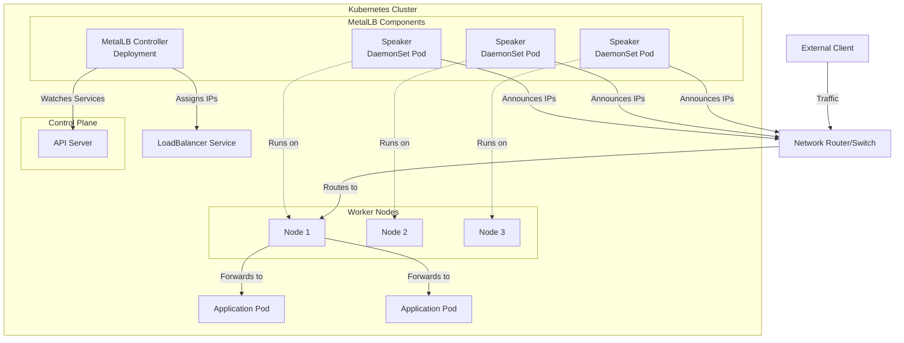
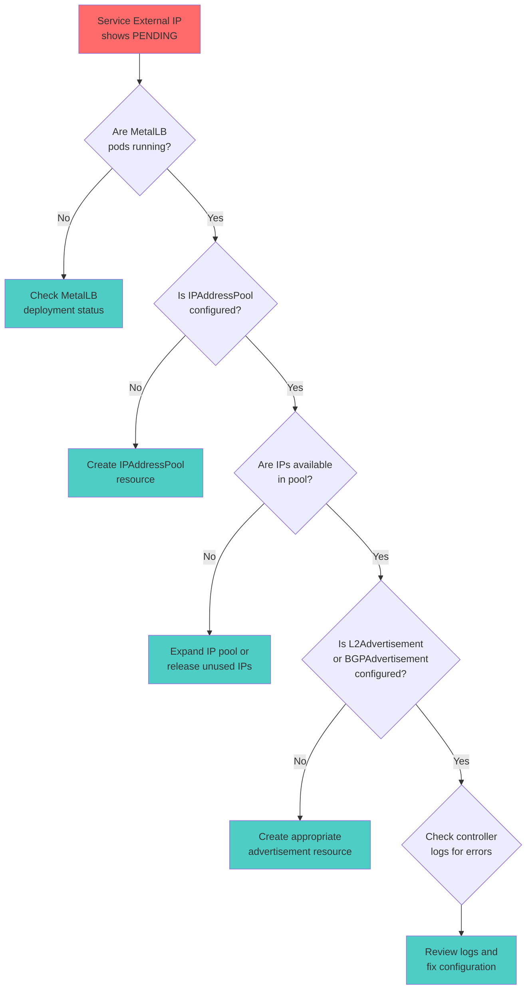
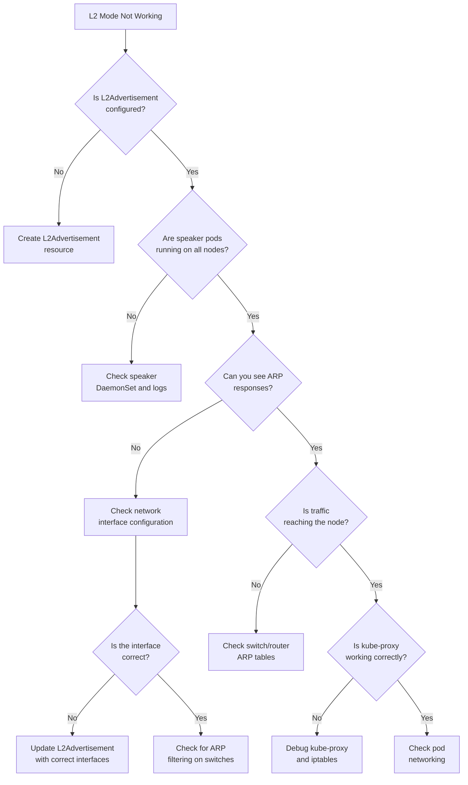
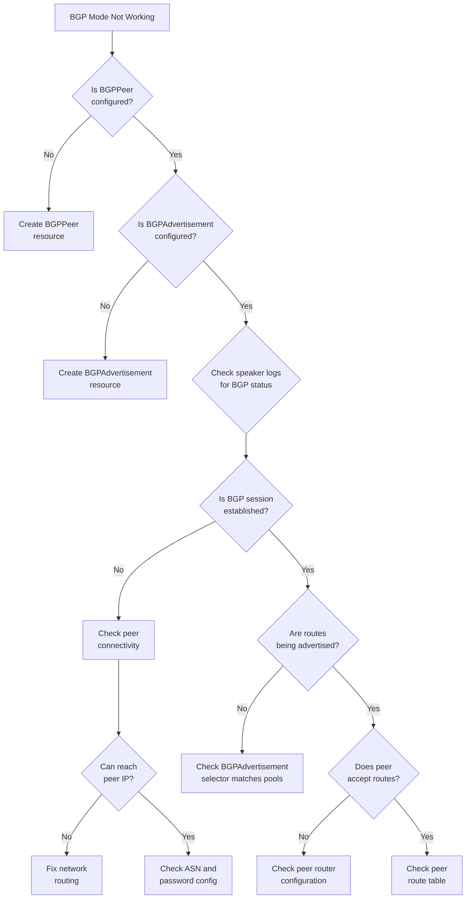
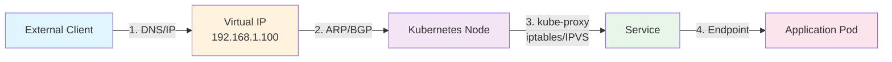

# How to Troubleshoot MetalLB Issues

Author: [nawazdhandala](https://github.com/nawazdhandala)

Tags: MetalLB, Troubleshooting, Kubernetes, Debugging, Networking

Description: A practical guide to diagnosing and resolving common MetalLB problems.

---

MetalLB is a widely-used load balancer implementation for bare-metal Kubernetes clusters, providing external IP addresses for services. However, like any networking component, it can encounter issues that require systematic troubleshooting. This guide walks you through diagnosing and resolving the most common MetalLB problems.

## Table of Contents

1. [Understanding MetalLB Architecture](#understanding-metallb-architecture)
2. [Common Symptoms and Quick Diagnosis](#common-symptoms-and-quick-diagnosis)
3. [Checking MetalLB Component Health](#checking-metallb-component-health)
4. [IP Address Pool Issues](#ip-address-pool-issues)
5. [Layer 2 Mode Troubleshooting](#layer-2-mode-troubleshooting)
6. [BGP Mode Troubleshooting](#bgp-mode-troubleshooting)
7. [Service Configuration Problems](#service-configuration-problems)
8. [Network Connectivity Issues](#network-connectivity-issues)
9. [Log Analysis and Debugging](#log-analysis-and-debugging)
10. [Advanced Debugging Techniques](#advanced-debugging-techniques)

## Understanding MetalLB Architecture

Before diving into troubleshooting, it's essential to understand how MetalLB works. MetalLB consists of two main components:

The following diagram illustrates the MetalLB architecture and the flow of traffic:



**Key Components:**
- **Controller**: A Deployment that watches for Services of type LoadBalancer and assigns IP addresses from configured pools
- **Speaker**: A DaemonSet that runs on every node and announces assigned IPs using Layer 2 (ARP/NDP) or BGP

## Common Symptoms and Quick Diagnosis

Here's a decision tree to help you quickly identify the root cause of MetalLB issues:



## Checking MetalLB Component Health

### Step 1: Verify MetalLB Pods Are Running

The first step in troubleshooting is ensuring all MetalLB components are healthy:

```bash
# Check the status of all MetalLB pods in the metallb-system namespace
# You should see one controller pod and one speaker pod per node
kubectl get pods -n metallb-system -o wide
```

Expected output shows pods in Running state:

```
NAME                          READY   STATUS    RESTARTS   AGE   IP            NODE
controller-5f98465b6b-x7kcj   1/1     Running   0          2d    10.244.0.15   node1
speaker-7h4km                 1/1     Running   0          2d    192.168.1.10  node1
speaker-8j5ln                 1/1     Running   0          2d    192.168.1.11  node2
speaker-9k6mo                 1/1     Running   0          2d    192.168.1.12  node3
```

### Step 2: Check Pod Events and Descriptions

If pods are not running, examine their events for clues:

```bash
# Describe the controller deployment to see events and conditions
# This reveals scheduling issues, resource constraints, or image pull problems
kubectl describe deployment controller -n metallb-system

# Check individual pod details if a specific pod is failing
# Replace <pod-name> with the actual pod name from the previous command
kubectl describe pod <pod-name> -n metallb-system
```

### Step 3: Verify MetalLB Custom Resources

MetalLB requires proper configuration through Custom Resources:

```bash
# List all IPAddressPool resources - these define available IP ranges
# At least one pool must exist for MetalLB to assign IPs
kubectl get ipaddresspools -n metallb-system

# List L2Advertisement resources for Layer 2 mode
# These tell MetalLB which pools to advertise via ARP/NDP
kubectl get l2advertisements -n metallb-system

# List BGPAdvertisement resources for BGP mode
# These configure how IPs are advertised to BGP peers
kubectl get bgpadvertisements -n metallb-system

# List BGPPeer resources for BGP mode
# These define the external routers MetalLB should peer with
kubectl get bgppeers -n metallb-system
```

## IP Address Pool Issues

### Problem: External IP Stays in PENDING State

This is the most common MetalLB issue. Here's how to diagnose it:

```bash
# Check if your service is waiting for an IP address
# The EXTERNAL-IP column will show <pending> if there's a problem
kubectl get svc -A | grep LoadBalancer

# Examine the service details for events or conditions
# Look for events mentioning IP allocation failures
kubectl describe svc <service-name> -n <namespace>
```

### Verify IP Address Pool Configuration

Ensure your IPAddressPool is correctly configured:

```yaml
# Example IPAddressPool configuration
# This defines a range of IPs that MetalLB can assign to services
apiVersion: metallb.io/v1beta1
kind: IPAddressPool
metadata:
  name: production-pool
  namespace: metallb-system
spec:
  # Define one or more IP ranges
  # These must be routable on your network and not used by other devices
  addresses:
  - 192.168.1.100-192.168.1.200  # Range format
  - 192.168.2.0/24               # CIDR format is also supported

  # Optional: Auto-assign IPs to services without explicit requests
  autoAssign: true

  # Optional: Avoid allocating specific IPs (e.g., reserved for manual assignment)
  avoidBuggyIPs: true
```

### Check IP Pool Exhaustion

If all IPs in your pool are allocated, new services will remain pending:

```bash
# List all services with their external IPs to see current allocations
# Count how many IPs are in use versus your pool size
kubectl get svc -A -o custom-columns=\
'NAMESPACE:.metadata.namespace,NAME:.metadata.name,TYPE:.spec.type,EXTERNAL-IP:.status.loadBalancer.ingress[0].ip' \
| grep -v '<none>'

# Check the IPAddressPool status for allocation information
# This shows how many IPs are available versus allocated
kubectl get ipaddresspool -n metallb-system -o yaml
```

### Solution: Expand or Add IP Pools

If you've exhausted your IP pool, expand it or create additional pools:

```yaml
# Create an additional IP pool for overflow
# Services can request IPs from specific pools using annotations
apiVersion: metallb.io/v1beta1
kind: IPAddressPool
metadata:
  name: overflow-pool
  namespace: metallb-system
spec:
  addresses:
  - 192.168.3.100-192.168.3.150
```

## Layer 2 Mode Troubleshooting

Layer 2 mode uses ARP (for IPv4) or NDP (for IPv6) to announce IP addresses. This section covers common L2-specific issues.

### Troubleshooting Flow for Layer 2 Mode



### Verify L2Advertisement Configuration

Ensure L2Advertisement is properly set up:

```yaml
# L2Advertisement tells MetalLB to announce IPs via ARP/NDP
# Without this, IPs will be assigned but not reachable
apiVersion: metallb.io/v1beta1
kind: L2Advertisement
metadata:
  name: default-l2
  namespace: metallb-system
spec:
  # Reference the IP pools to advertise
  # If empty, advertises all pools
  ipAddressPools:
  - production-pool

  # Optional: Limit which interfaces to use for announcements
  # Useful in multi-homed setups
  interfaces:
  - eth0

  # Optional: Select specific nodes for announcements
  nodeSelectors:
  - matchLabels:
      node-role.kubernetes.io/worker: ""
```

### Check ARP Announcements

Verify that MetalLB is properly announcing IP addresses via ARP:

```bash
# On a Linux machine on the same network segment, capture ARP traffic
# You should see gratuitous ARP announcements for the LoadBalancer IPs
sudo tcpdump -i eth0 arp -n

# Check the ARP table on your local machine to see if the VIP is learned
# The MAC address should match one of your Kubernetes node's interfaces
arp -n | grep 192.168.1.100

# From a node, check which speaker is handling a specific IP
# This shows the current leader for each allocated IP
kubectl logs -n metallb-system -l component=speaker | grep "handling"
```

### Diagnose Speaker Leader Election

In L2 mode, only one speaker announces each IP. Verify leader election:

```bash
# Check speaker logs for leader election status
# Each IP should have exactly one speaker handling it
kubectl logs -n metallb-system -l component=speaker --tail=100 | grep -E "(leader|election)"

# Check memberlist state for cluster membership
kubectl logs -n metallb-system -l component=speaker --tail=100 | grep memberlist
```

### Common L2 Mode Problems and Solutions

**Problem 1: ARP not reaching the client network**

```bash
# Verify the speaker is using the correct network interface
# Check speaker logs for the interface being used
kubectl logs -n metallb-system -l component=speaker | grep "interface"

# If using VLANs, ensure the correct VLAN interface is specified
# Update L2Advertisement to specify the correct interface
```

**Problem 2: Multiple speakers responding (split-brain)**

```bash
# Check for multiple pods claiming leadership for the same IP
# This indicates a membership/communication issue
kubectl logs -n metallb-system -l component=speaker --tail=200 | grep "speaker"

# Verify network connectivity between speaker pods
# They must be able to communicate for leader election
kubectl exec -n metallb-system <speaker-pod> -- ping <other-speaker-pod-ip>
```

## BGP Mode Troubleshooting

BGP mode is more complex but offers better scalability and traffic distribution.

### BGP Troubleshooting Flow



### Verify BGP Peer Configuration

```yaml
# BGPPeer defines the external router to establish BGP sessions with
apiVersion: metallb.io/v1beta2
kind: BGPPeer
metadata:
  name: router1
  namespace: metallb-system
spec:
  # Your router's IP address
  peerAddress: 10.0.0.1

  # Your router's BGP Autonomous System Number
  peerASN: 64501

  # MetalLB's ASN (must be different from peer for eBGP)
  myASN: 64500

  # Optional: TCP MD5 authentication password
  # Must match the password configured on your router
  password: "secretpassword"

  # Optional: Select which nodes should peer with this router
  nodeSelectors:
  - matchLabels:
      rack: rack1

  # Optional: BFD for faster failure detection
  bfdProfile: production
```

### Check BGP Session Status

```bash
# View speaker logs for BGP session information
# Look for "established" or connection error messages
kubectl logs -n metallb-system -l component=speaker --tail=100 | grep -i bgp

# Check for specific peer connection status
kubectl logs -n metallb-system -l component=speaker | grep "session"

# Look for route advertisement messages
kubectl logs -n metallb-system -l component=speaker | grep "advertise"
```

### Verify BGP Advertisement Configuration

```yaml
# BGPAdvertisement controls which IPs are advertised and how
apiVersion: metallb.io/v1beta1
kind: BGPAdvertisement
metadata:
  name: default-bgp
  namespace: metallb-system
spec:
  # Reference the IP pools to advertise via BGP
  ipAddressPools:
  - production-pool

  # Optional: Aggregate routes to reduce routing table size
  aggregationLength: 32
  aggregationLengthV6: 128

  # Optional: Add BGP communities to routes
  communities:
  - 64500:100

  # Optional: Set local preference for traffic engineering
  localPref: 100

  # Optional: Select specific peers to advertise to
  peers:
  - router1
```

### Debug BGP from the Router Side

If you have access to your BGP router, check its perspective:

```bash
# Commands vary by router vendor - examples for common platforms

# Cisco IOS
show ip bgp summary
show ip bgp neighbors 10.244.0.15
show ip route bgp

# FRRouting (commonly used in network labs)
vtysh -c "show bgp summary"
vtysh -c "show bgp neighbors"
vtysh -c "show ip route bgp"

# Bird
birdc show protocols
birdc show route
```

## Service Configuration Problems

### Check Service Annotations

MetalLB uses annotations to control IP assignment behavior:

```yaml
# Example Service with MetalLB annotations
apiVersion: v1
kind: Service
metadata:
  name: my-service
  annotations:
    # Request a specific IP from the pool
    # The IP must be available in a configured pool
    metallb.universe.tf/loadBalancerIPs: "192.168.1.100"

    # Request IP from a specific pool
    metallb.universe.tf/address-pool: "production-pool"

    # Allow sharing the same IP with other services (requires same sharing key)
    metallb.universe.tf/allow-shared-ip: "shared-key-1"
spec:
  type: LoadBalancer
  ports:
  - port: 80
    targetPort: 8080
  selector:
    app: my-app
```

### Diagnose Specific IP Request Failures

```bash
# Check if the requested IP is already in use
kubectl get svc -A -o jsonpath='{range .items[*]}{.metadata.name}: {.status.loadBalancer.ingress[0].ip}{"\n"}{end}' | grep "192.168.1.100"

# Verify the IP is within a configured pool
kubectl get ipaddresspool -n metallb-system -o yaml | grep -A 10 "addresses:"

# Check controller logs for allocation decisions
kubectl logs -n metallb-system -l component=controller | grep "192.168.1.100"
```

### IP Sharing Configuration

Multiple services can share an IP if configured correctly:

```yaml
# Service 1 - HTTP traffic on shared IP
apiVersion: v1
kind: Service
metadata:
  name: http-service
  annotations:
    metallb.universe.tf/loadBalancerIPs: "192.168.1.100"
    metallb.universe.tf/allow-shared-ip: "web-services"
spec:
  type: LoadBalancer
  ports:
  - port: 80
    targetPort: 8080
  selector:
    app: web-http

---
# Service 2 - HTTPS traffic on the same shared IP
# Must use the same sharing key and different port
apiVersion: v1
kind: Service
metadata:
  name: https-service
  annotations:
    metallb.universe.tf/loadBalancerIPs: "192.168.1.100"
    metallb.universe.tf/allow-shared-ip: "web-services"
spec:
  type: LoadBalancer
  ports:
  - port: 443
    targetPort: 8443
  selector:
    app: web-https
```

## Network Connectivity Issues

### End-to-End Connectivity Debugging



### Step-by-Step Connectivity Test

```bash
# Step 1: Test basic connectivity to the VIP from outside the cluster
# This verifies the IP is reachable at the network level
ping 192.168.1.100

# Step 2: Test the service port
# This verifies traffic is reaching the node
nc -zv 192.168.1.100 80

# Step 3: Check if the service has endpoints
# No endpoints means no healthy pods matching the selector
kubectl get endpoints <service-name> -n <namespace>

# Step 4: Verify pod is healthy and listening
kubectl exec -it <pod-name> -n <namespace> -- netstat -tlnp

# Step 5: Test connectivity from within the cluster
kubectl run debug --rm -it --image=nicolaka/netshoot -- /bin/bash
# Then from within the debug pod:
curl http://192.168.1.100
```

### Check kube-proxy Status

kube-proxy handles the actual traffic forwarding:

```bash
# Check kube-proxy pods are running
kubectl get pods -n kube-system -l k8s-app=kube-proxy

# View kube-proxy logs for errors
kubectl logs -n kube-system -l k8s-app=kube-proxy --tail=50

# Check iptables rules for your service (on a node)
# Replace 192.168.1.100 with your LoadBalancer IP
sudo iptables -t nat -L KUBE-SERVICES -n | grep 192.168.1.100

# For IPVS mode, check virtual server configuration
sudo ipvsadm -Ln | grep -A 5 192.168.1.100
```

### Debug with tcpdump

Capture traffic at various points to identify where packets are dropped:

```bash
# On the node receiving the VIP traffic
# Capture incoming traffic to the VIP
sudo tcpdump -i eth0 host 192.168.1.100 -n

# Capture traffic going to pod network
sudo tcpdump -i cni0 -n

# Within a speaker pod, check if traffic is being received
kubectl exec -n metallb-system <speaker-pod> -- tcpdump -i any host 192.168.1.100 -n
```

## Log Analysis and Debugging

### Collecting MetalLB Logs

```bash
# Get controller logs - shows IP allocation decisions
kubectl logs -n metallb-system deployment/controller --tail=200

# Get all speaker logs - shows network announcements
kubectl logs -n metallb-system -l component=speaker --tail=200

# Follow logs in real-time while testing
kubectl logs -n metallb-system deployment/controller -f

# Get logs from a specific time period
kubectl logs -n metallb-system deployment/controller --since=1h

# Export logs to a file for detailed analysis
kubectl logs -n metallb-system deployment/controller > controller-logs.txt
kubectl logs -n metallb-system -l component=speaker > speaker-logs.txt
```

### Common Log Messages and Their Meanings

**Controller Logs:**

```bash
# Successful IP assignment
# "assigned IP" message indicates successful allocation
kubectl logs -n metallb-system deployment/controller | grep "assigned"

# IP pool exhaustion
# "no available IPs" indicates you need to expand your pool
kubectl logs -n metallb-system deployment/controller | grep "no available"

# Configuration issues
# "invalid" or "error" messages point to config problems
kubectl logs -n metallb-system deployment/controller | grep -E "(invalid|error)"
```

**Speaker Logs:**

```bash
# L2 mode: Check gratuitous ARP announcements
kubectl logs -n metallb-system -l component=speaker | grep "gratuitous"

# BGP mode: Check session establishment
kubectl logs -n metallb-system -l component=speaker | grep -E "(established|session)"

# Leader election events
kubectl logs -n metallb-system -l component=speaker | grep "leader"
```

### Enable Debug Logging

For more verbose output, you can increase the log level:

```yaml
# Edit the MetalLB deployment to add debug flags
apiVersion: apps/v1
kind: Deployment
metadata:
  name: controller
  namespace: metallb-system
spec:
  template:
    spec:
      containers:
      - name: controller
        args:
        - --port=7472
        - --log-level=debug  # Add this line for verbose logging
```

## Advanced Debugging Techniques

### Using MetalLB Webhooks for Validation

MetalLB includes admission webhooks to validate configuration:

```bash
# Check webhook configuration
kubectl get validatingwebhookconfigurations | grep metallb

# Check webhook service is running
kubectl get svc -n metallb-system | grep webhook

# Test webhook by applying an invalid configuration
# This should be rejected with a helpful error message
cat <<EOF | kubectl apply -f -
apiVersion: metallb.io/v1beta1
kind: IPAddressPool
metadata:
  name: invalid-pool
  namespace: metallb-system
spec:
  addresses:
  - "invalid-range"
EOF
```

### Debugging with Events

```bash
# Watch events across the metallb-system namespace
kubectl get events -n metallb-system --sort-by='.lastTimestamp'

# Watch events for a specific service
kubectl get events -n <namespace> --field-selector involvedObject.name=<service-name>

# Continuous event monitoring
kubectl get events -n metallb-system -w
```

### Network Policy Considerations

If you're using Kubernetes Network Policies, ensure MetalLB traffic isn't blocked:

```yaml
# Example NetworkPolicy allowing MetalLB speaker communication
apiVersion: networking.k8s.io/v1
kind: NetworkPolicy
metadata:
  name: allow-metallb
  namespace: metallb-system
spec:
  podSelector:
    matchLabels:
      component: speaker
  policyTypes:
  - Ingress
  - Egress
  ingress:
  # Allow memberlist protocol for speaker coordination
  - from:
    - podSelector:
        matchLabels:
          component: speaker
    ports:
    - protocol: TCP
      port: 7946
    - protocol: UDP
      port: 7946
  egress:
  # Allow BGP to external routers
  - to:
    - ipBlock:
        cidr: 10.0.0.0/8
    ports:
    - protocol: TCP
      port: 179
```

### Complete Diagnostic Script

Here's a comprehensive script to gather all relevant diagnostic information:

```bash
#!/bin/bash
# MetalLB Diagnostic Script
# This script collects all relevant information for troubleshooting

echo "=== MetalLB Diagnostic Report ==="
echo "Generated: $(date)"
echo ""

echo "=== MetalLB Pods Status ==="
kubectl get pods -n metallb-system -o wide
echo ""

echo "=== MetalLB Pod Events ==="
kubectl get events -n metallb-system --sort-by='.lastTimestamp' | tail -20
echo ""

echo "=== IP Address Pools ==="
kubectl get ipaddresspools -n metallb-system -o yaml
echo ""

echo "=== L2 Advertisements ==="
kubectl get l2advertisements -n metallb-system -o yaml
echo ""

echo "=== BGP Peers ==="
kubectl get bgppeers -n metallb-system -o yaml 2>/dev/null || echo "No BGP peers configured"
echo ""

echo "=== BGP Advertisements ==="
kubectl get bgpadvertisements -n metallb-system -o yaml 2>/dev/null || echo "No BGP advertisements configured"
echo ""

echo "=== LoadBalancer Services ==="
kubectl get svc -A -o wide | grep LoadBalancer
echo ""

echo "=== Controller Logs (last 50 lines) ==="
kubectl logs -n metallb-system deployment/controller --tail=50
echo ""

echo "=== Speaker Logs (last 50 lines per pod) ==="
for pod in $(kubectl get pods -n metallb-system -l component=speaker -o jsonpath='{.items[*].metadata.name}'); do
    echo "--- Logs from $pod ---"
    kubectl logs -n metallb-system $pod --tail=50
done
echo ""

echo "=== Node Information ==="
kubectl get nodes -o wide
echo ""

echo "=== Diagnostic Complete ==="
```

Save this script and run it to get a complete picture of your MetalLB deployment:

```bash
# Save the script and make it executable
chmod +x metallb-diagnostics.sh

# Run the diagnostic
./metallb-diagnostics.sh > metallb-report.txt 2>&1

# Review the report
less metallb-report.txt
```

## Quick Reference: Common Issues and Solutions

| Symptom | Likely Cause | Solution |
|---------|--------------|----------|
| External IP stuck in PENDING | No IPAddressPool configured | Create an IPAddressPool resource |
| External IP stuck in PENDING | No L2/BGP Advertisement | Create appropriate Advertisement resource |
| External IP stuck in PENDING | IP pool exhausted | Add more IPs to pool or create new pool |
| IP assigned but not reachable | Speaker not announcing | Check speaker logs and network interface config |
| Intermittent connectivity | L2 leader election issues | Check speaker pod communication |
| BGP session not establishing | Wrong ASN or password | Verify BGPPeer configuration matches router |
| Service accessible from some nodes only | kube-proxy issue | Check kube-proxy logs and iptables rules |
| Slow failover | No BFD configured | Enable BFD for faster failure detection |

## Conclusion

Troubleshooting MetalLB requires a systematic approach, starting from verifying basic component health and progressing through configuration validation to network-level debugging. The key areas to focus on are:

1. **Component Health**: Ensure all MetalLB pods are running
2. **Configuration**: Verify IPAddressPool and Advertisement resources exist and are correct
3. **Network Layer**: Confirm ARP/BGP announcements are working
4. **Traffic Path**: Trace the complete path from client to pod

By following the diagnostic workflows and using the commands provided in this guide, you can efficiently identify and resolve most MetalLB issues in your Kubernetes cluster.

## Further Reading

- [MetalLB Official Documentation](https://metallb.universe.tf/)
- [MetalLB GitHub Repository](https://github.com/metallb/metallb)
- [Kubernetes Service Types](https://kubernetes.io/docs/concepts/services-networking/service/)
- [BGP Fundamentals](https://www.cloudflare.com/learning/security/glossary/what-is-bgp/)
