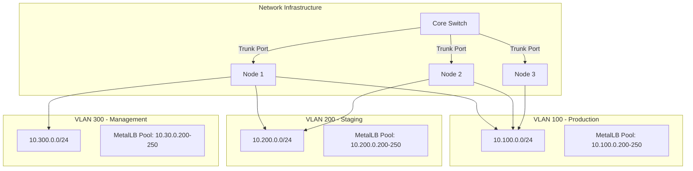
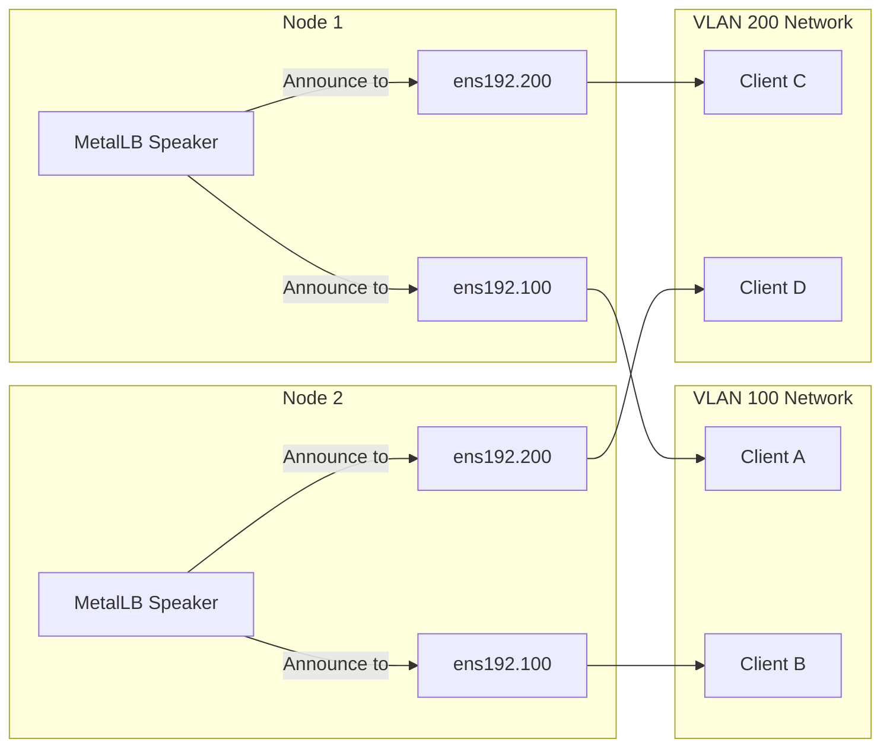
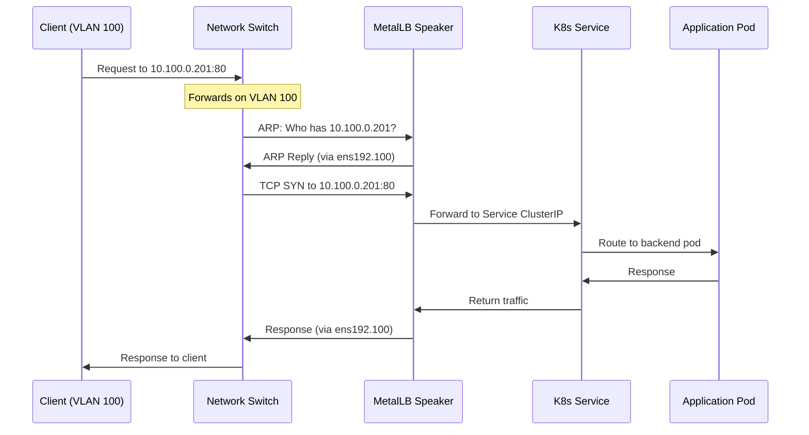
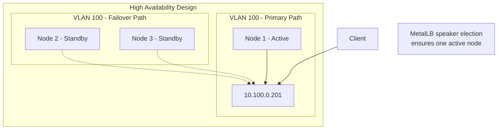

# How to Configure MetalLB for VLAN Networks

Author: [nawazdhandala](https://github.com/nawazdhandala)

Tags: MetalLB, VLAN, Networking, Kubernetes, Infrastructure

Description: Learn how to deploy MetalLB in VLAN-segmented network environments.

---

MetalLB is the go-to solution for providing LoadBalancer services in bare-metal Kubernetes clusters. However, deploying MetalLB in enterprise environments with VLAN-segmented networks requires careful planning and configuration. This comprehensive guide walks you through configuring MetalLB to work seamlessly with VLAN networks, including IP pool management per VLAN, L2 advertisement scoping, and node interface configuration.

## Table of Contents

1. [Understanding VLAN Networks with MetalLB](#understanding-vlan-networks-with-metallb)
2. [Prerequisites](#prerequisites)
3. [VLAN Architecture Overview](#vlan-architecture-overview)
4. [Node Interface Configuration](#node-interface-configuration)
5. [Installing MetalLB](#installing-metallb)
6. [Configuring IP Pools per VLAN](#configuring-ip-pools-per-vlan)
7. [L2 Advertisement Scoping](#l2-advertisement-scoping)
8. [Advanced VLAN Configurations](#advanced-vlan-configurations)
9. [Troubleshooting](#troubleshooting)
10. [Best Practices](#best-practices)

## Understanding VLAN Networks with MetalLB

VLANs (Virtual Local Area Networks) are used in enterprise environments to segment network traffic for security, performance, and organizational purposes. When running Kubernetes on bare-metal infrastructure with VLAN segmentation, MetalLB must be configured to:

- Announce IP addresses on the correct VLAN interfaces
- Scope L2 advertisements to specific nodes and interfaces
- Manage separate IP pools for different VLANs
- Handle traffic routing between VLANs appropriately

### Why VLAN Segmentation Matters

VLAN segmentation in Kubernetes environments provides:

- **Security isolation**: Separate production, staging, and development traffic
- **Traffic management**: Control bandwidth and QoS per network segment
- **Compliance**: Meet regulatory requirements for network isolation
- **Multi-tenancy**: Support multiple teams or customers on shared infrastructure

## Prerequisites

Before configuring MetalLB for VLAN networks, ensure you have:

- Kubernetes cluster v1.25 or later
- MetalLB v0.13 or later (for L2 advertisement scoping features)
- Network infrastructure supporting 802.1Q VLAN tagging
- Switch ports configured as trunk ports for Kubernetes nodes
- Root access to configure node network interfaces

## VLAN Architecture Overview

The following diagram illustrates a typical VLAN architecture with MetalLB in a Kubernetes cluster:



The diagram above shows:
- Three Kubernetes nodes connected to a core switch via trunk ports
- Three VLANs: Production (100), Staging (200), and Management (300)
- Each VLAN has its own IP range and MetalLB pool
- Not all nodes need access to all VLANs

## Node Interface Configuration

Before configuring MetalLB, you must configure VLAN interfaces on your Kubernetes nodes. This section covers interface configuration for different Linux distributions.

### Understanding VLAN Interface Naming

VLAN interfaces in Linux follow the naming convention `<parent-interface>.<vlan-id>`. For example:
- `eth0.100` - VLAN 100 on eth0
- `ens192.200` - VLAN 200 on ens192

### Ubuntu/Debian Configuration with Netplan

The following Netplan configuration creates VLAN interfaces for production (VLAN 100) and staging (VLAN 200) networks on a node.

```yaml
# /etc/netplan/01-vlan-config.yaml
# This configuration file sets up VLAN interfaces for MetalLB
# The parent interface (ens192) must be connected to a trunk port on your switch

network:
  version: 2
  renderer: networkd

  ethernets:
    # Define the parent interface that connects to the switch trunk port
    # This interface carries tagged traffic for all VLANs
    ens192:
      # No IP address on the parent interface - traffic is tagged
      dhcp4: false
      dhcp6: false

  vlans:
    # VLAN 100 - Production Network
    # This interface will be used by MetalLB to announce production LoadBalancer IPs
    vlan100:
      id: 100                          # VLAN ID matching switch configuration
      link: ens192                     # Parent interface
      addresses:
        - 10.100.0.10/24              # Node's IP address on this VLAN
      routes:
        - to: 10.100.0.0/24           # Route for production network
          via: 10.100.0.1             # Gateway for this VLAN
      mtu: 1500                        # Standard MTU, adjust if using jumbo frames

    # VLAN 200 - Staging Network
    # Separate VLAN for staging environment LoadBalancer services
    vlan200:
      id: 200
      link: ens192
      addresses:
        - 10.200.0.10/24
      routes:
        - to: 10.200.0.0/24
          via: 10.200.0.1
      mtu: 1500

    # VLAN 300 - Management Network
    # Used for internal management traffic and monitoring services
    vlan300:
      id: 300
      link: ens192
      addresses:
        - 10.30.0.10/24
      routes:
        - to: 10.30.0.0/24
          via: 10.30.0.1
      mtu: 1500
```

Apply the Netplan configuration with the following commands:

```bash
# Validate the configuration before applying
# This checks for syntax errors without making changes
sudo netplan try

# Apply the configuration permanently
# This creates the VLAN interfaces and assigns IP addresses
sudo netplan apply

# Verify the interfaces are created correctly
# You should see vlan100, vlan200, and vlan300 interfaces
ip addr show
```

### RHEL/CentOS Configuration with NetworkManager

For Red Hat-based distributions using NetworkManager, use the following approach:

```bash
#!/bin/bash
# Script: configure-vlan-interfaces.sh
# Purpose: Create VLAN interfaces for MetalLB on RHEL/CentOS nodes
# Run this script as root on each Kubernetes node

# Define the parent interface connected to the switch trunk port
PARENT_IFACE="ens192"

# Create VLAN 100 connection for Production network
# The connection name includes the VLAN ID for easy identification
nmcli connection add type vlan \
    con-name "vlan100-prod" \
    dev "${PARENT_IFACE}" \
    id 100 \
    ipv4.addresses "10.100.0.10/24" \
    ipv4.gateway "10.100.0.1" \
    ipv4.method manual \
    connection.autoconnect yes

# Create VLAN 200 connection for Staging network
nmcli connection add type vlan \
    con-name "vlan200-staging" \
    dev "${PARENT_IFACE}" \
    id 200 \
    ipv4.addresses "10.200.0.10/24" \
    ipv4.gateway "10.200.0.1" \
    ipv4.method manual \
    connection.autoconnect yes

# Create VLAN 300 connection for Management network
nmcli connection add type vlan \
    con-name "vlan300-mgmt" \
    dev "${PARENT_IFACE}" \
    id 300 \
    ipv4.addresses "10.30.0.10/24" \
    ipv4.gateway "10.30.0.1" \
    ipv4.method manual \
    connection.autoconnect yes

# Activate all VLAN connections
# This brings up the interfaces immediately
nmcli connection up vlan100-prod
nmcli connection up vlan200-staging
nmcli connection up vlan300-mgmt

# Display the created interfaces for verification
echo "VLAN interfaces created:"
ip -d link show type vlan
```

### Verifying VLAN Interface Configuration

After configuring VLAN interfaces, verify they are working correctly:

```bash
# Check that VLAN interfaces exist and have correct VLAN IDs
# The output should show the VLAN ID and parent interface for each
ip -d link show type vlan

# Expected output format:
# 4: ens192.100@ens192: <BROADCAST,MULTICAST,UP,LOWER_UP> mtu 1500 ...
#     vlan protocol 802.1Q id 100 <REORDER_HDR>

# Verify IP addresses are assigned correctly to each VLAN interface
ip addr show | grep -A 2 "vlan"

# Test connectivity to the gateway on each VLAN
ping -c 3 -I ens192.100 10.100.0.1
ping -c 3 -I ens192.200 10.200.0.1
ping -c 3 -I ens192.300 10.30.0.1
```

## Installing MetalLB

Install MetalLB using the official manifests or Helm chart. We recommend Helm for VLAN configurations as it simplifies management.

### Installation with Helm

The following Helm installation includes values optimized for VLAN environments:

```bash
# Add the MetalLB Helm repository
helm repo add metallb https://metallb.github.io/metallb

# Update repo to ensure we have the latest charts
helm repo update

# Create a namespace for MetalLB with appropriate labels
# The labels help with network policy targeting
kubectl create namespace metallb-system
kubectl label namespace metallb-system \
    app=metallb \
    pod-security.kubernetes.io/enforce=privileged \
    pod-security.kubernetes.io/audit=privileged \
    pod-security.kubernetes.io/warn=privileged

# Install MetalLB with VLAN-optimized configuration
helm install metallb metallb/metallb \
    --namespace metallb-system \
    --set speaker.frr.enabled=false \
    --set speaker.memberlistSecretName=metallb-memberlist \
    --wait
```

### Verify Installation

Ensure MetalLB pods are running before proceeding with VLAN configuration:

```bash
# Check that the controller and speaker pods are running
# The speaker pods run as a DaemonSet, so one per node
kubectl get pods -n metallb-system

# Expected output:
# NAME                          READY   STATUS    RESTARTS   AGE
# controller-5f98465b6b-xxxxx   1/1     Running   0          2m
# speaker-xxxxx                 1/1     Running   0          2m
# speaker-yyyyy                 1/1     Running   0          2m
# speaker-zzzzz                 1/1     Running   0          2m

# Verify MetalLB CRDs are installed
kubectl get crds | grep metallb
```

## Configuring IP Pools per VLAN

With MetalLB installed, configure separate IP address pools for each VLAN. This allows you to assign LoadBalancer IPs from the appropriate network segment.

### IPAddressPool Configuration

The following configuration creates IP pools for three VLANs. Each pool is labeled to enable targeted L2 advertisement.

```yaml
# metallb-ip-pools.yaml
# This manifest defines IP address pools for each VLAN
# Each pool has labels that will be used to scope L2 advertisements

apiVersion: metallb.io/v1beta1
kind: IPAddressPool
metadata:
  name: production-pool
  namespace: metallb-system
  labels:
    # Labels help identify the pool and enable advertisement targeting
    environment: production
    vlan: "100"
spec:
  # IP range for production LoadBalancer services
  # Ensure this range is reserved in your DHCP server to avoid conflicts
  addresses:
    - 10.100.0.200-10.100.0.250

  # autoAssign controls whether this pool is used for automatic IP allocation
  # Set to false if you want explicit pool selection only
  autoAssign: true

  # avoidBuggyIPs skips .0 and .255 addresses that may cause issues
  # with some network equipment
  avoidBuggyIPs: true

---
apiVersion: metallb.io/v1beta1
kind: IPAddressPool
metadata:
  name: staging-pool
  namespace: metallb-system
  labels:
    environment: staging
    vlan: "200"
spec:
  addresses:
    - 10.200.0.200-10.200.0.250
  autoAssign: true
  avoidBuggyIPs: true

---
apiVersion: metallb.io/v1beta1
kind: IPAddressPool
metadata:
  name: management-pool
  namespace: metallb-system
  labels:
    environment: management
    vlan: "300"
spec:
  addresses:
    - 10.30.0.200-10.30.0.250
  # Disable auto-assign for management pool
  # Services must explicitly request this pool
  autoAssign: false
  avoidBuggyIPs: true
```

Apply the IP pool configuration:

```bash
# Apply the IP address pools configuration
kubectl apply -f metallb-ip-pools.yaml

# Verify pools are created correctly
kubectl get ipaddresspools -n metallb-system

# Check pool details including available addresses
kubectl describe ipaddresspool production-pool -n metallb-system
```

### Using Pool Selection in Services

When creating LoadBalancer services, you can specify which IP pool to use. This is essential for VLAN-based deployments.

```yaml
# example-service-production.yaml
# This service will receive an IP from the production pool (VLAN 100)

apiVersion: v1
kind: Service
metadata:
  name: web-frontend
  namespace: production
  annotations:
    # Specify the IP pool by name
    # This ensures the service gets an IP from the correct VLAN
    metallb.universe.tf/address-pool: production-pool
spec:
  type: LoadBalancer
  # Optionally request a specific IP from the pool
  # loadBalancerIP: 10.100.0.201
  ports:
    - port: 80
      targetPort: 8080
      protocol: TCP
  selector:
    app: web-frontend

---
# example-service-staging.yaml
# This service will receive an IP from the staging pool (VLAN 200)

apiVersion: v1
kind: Service
metadata:
  name: web-frontend
  namespace: staging
  annotations:
    metallb.universe.tf/address-pool: staging-pool
spec:
  type: LoadBalancer
  ports:
    - port: 80
      targetPort: 8080
      protocol: TCP
  selector:
    app: web-frontend
```

## L2 Advertisement Scoping

L2 advertisement scoping is crucial for VLAN configurations. It controls which nodes and interfaces announce LoadBalancer IP addresses. Without proper scoping, ARP/NDP responses may be sent on the wrong interfaces.

### Understanding L2 Advertisement Architecture



### Configuring L2Advertisements

The L2Advertisement resource controls how and where MetalLB announces IP addresses. For VLAN configurations, you need separate L2Advertisements for each VLAN.

```yaml
# metallb-l2-advertisements.yaml
# L2 advertisement configuration for VLAN-scoped announcements
# Each advertisement targets a specific VLAN interface

apiVersion: metallb.io/v1beta1
kind: L2Advertisement
metadata:
  name: production-l2-advert
  namespace: metallb-system
spec:
  # Select which IP pools this advertisement applies to
  # Using label selectors for flexible pool targeting
  ipAddressPools:
    - production-pool

  # Alternatively, use pool selectors for label-based matching
  # ipAddressPoolSelectors:
  #   - matchLabels:
  #       environment: production

  # Specify the interfaces to use for L2 announcements
  # This MUST match your VLAN interface names on the nodes
  interfaces:
    - ens192.100    # VLAN 100 interface

  # Node selectors limit which nodes participate in announcements
  # Use this to target only nodes that have the VLAN configured
  nodeSelectors:
    - matchLabels:
        metallb.universe.tf/vlan100: "true"

---
apiVersion: metallb.io/v1beta1
kind: L2Advertisement
metadata:
  name: staging-l2-advert
  namespace: metallb-system
spec:
  ipAddressPools:
    - staging-pool

  # Target VLAN 200 interface
  interfaces:
    - ens192.200

  # Only advertise from nodes labeled for VLAN 200
  nodeSelectors:
    - matchLabels:
        metallb.universe.tf/vlan200: "true"

---
apiVersion: metallb.io/v1beta1
kind: L2Advertisement
metadata:
  name: management-l2-advert
  namespace: metallb-system
spec:
  ipAddressPools:
    - management-pool

  interfaces:
    - ens192.300

  # Management VLAN might be limited to specific nodes
  nodeSelectors:
    - matchLabels:
        metallb.universe.tf/vlan300: "true"
        node-role.kubernetes.io/control-plane: ""
```

### Labeling Nodes for VLAN Access

Before the L2 advertisements work, you must label nodes according to their VLAN access:

```bash
# Label nodes based on which VLANs they have configured
# Only label nodes that have the corresponding VLAN interface active

# Node 1 has access to all VLANs (typical for control plane nodes)
kubectl label node k8s-node-1 \
    metallb.universe.tf/vlan100=true \
    metallb.universe.tf/vlan200=true \
    metallb.universe.tf/vlan300=true

# Node 2 has access to production and staging only
kubectl label node k8s-node-2 \
    metallb.universe.tf/vlan100=true \
    metallb.universe.tf/vlan200=true

# Node 3 has access to production only
kubectl label node k8s-node-3 \
    metallb.universe.tf/vlan100=true

# Verify node labels
kubectl get nodes --show-labels | grep metallb
```

Apply the L2 advertisement configuration:

```bash
# Apply L2 advertisement configurations
kubectl apply -f metallb-l2-advertisements.yaml

# Verify L2 advertisements are created
kubectl get l2advertisements -n metallb-system

# Check advertisement details
kubectl describe l2advertisement production-l2-advert -n metallb-system
```

## Advanced VLAN Configurations

### Multiple IP Ranges per VLAN

For larger deployments, you might need multiple IP ranges within a single VLAN:

```yaml
# metallb-multi-range-pool.yaml
# Configure multiple IP ranges for a single VLAN
# Useful for reserved IPs, high-availability pairs, or capacity planning

apiVersion: metallb.io/v1beta1
kind: IPAddressPool
metadata:
  name: production-multi-range
  namespace: metallb-system
  labels:
    environment: production
    vlan: "100"
spec:
  addresses:
    # Primary range for general services
    - 10.100.0.200-10.100.0.220
    # Secondary range for critical services
    - 10.100.0.230-10.100.0.240
    # Reserved VIP range for HA services
    - 10.100.0.250/32
    - 10.100.0.251/32
  autoAssign: true
  avoidBuggyIPs: true
```

### Shared IP for Multiple Services

In some scenarios, you may want multiple services to share a single LoadBalancer IP (different ports):

```yaml
# shared-ip-services.yaml
# Two services sharing the same LoadBalancer IP on VLAN 100
# The key annotation must match for IP sharing to work

apiVersion: v1
kind: Service
metadata:
  name: http-service
  namespace: production
  annotations:
    metallb.universe.tf/address-pool: production-pool
    # The allow-shared-ip annotation with a matching key enables sharing
    metallb.universe.tf/allow-shared-ip: "web-frontend-shared"
spec:
  type: LoadBalancer
  loadBalancerIP: 10.100.0.205
  ports:
    - port: 80
      targetPort: 8080
      name: http
  selector:
    app: web-frontend

---
apiVersion: v1
kind: Service
metadata:
  name: https-service
  namespace: production
  annotations:
    metallb.universe.tf/address-pool: production-pool
    # Same sharing key as the HTTP service
    metallb.universe.tf/allow-shared-ip: "web-frontend-shared"
spec:
  type: LoadBalancer
  # Same IP as HTTP service
  loadBalancerIP: 10.100.0.205
  ports:
    - port: 443
      targetPort: 8443
      name: https
  selector:
    app: web-frontend
```

### VLAN-Aware Network Policies

When using VLANs with MetalLB, you should also consider network policies to control traffic flow:

```yaml
# network-policy-vlan-aware.yaml
# Network policy that restricts traffic based on VLAN source
# This ensures services on one VLAN cannot access services on another

apiVersion: networking.k8s.io/v1
kind: NetworkPolicy
metadata:
  name: production-ingress-policy
  namespace: production
spec:
  podSelector: {}  # Apply to all pods in namespace
  policyTypes:
    - Ingress
  ingress:
    # Allow traffic only from production VLAN network
    - from:
        - ipBlock:
            cidr: 10.100.0.0/24
      ports:
        - protocol: TCP
          port: 8080
    # Allow internal cluster traffic
    - from:
        - namespaceSelector:
            matchLabels:
              name: production
```

## Traffic Flow with VLANs

The following diagram shows how traffic flows through a VLAN-configured MetalLB setup:



## Troubleshooting

### Common Issues and Solutions

#### 1. ARP Responses Not Received

If clients cannot reach LoadBalancer IPs, the ARP responses might be going out the wrong interface.

```bash
# Check which interface MetalLB is using for announcements
kubectl logs -n metallb-system -l app=metallb,component=speaker | grep -i "arp\|interface"

# Verify the L2 advertisement interface configuration
kubectl get l2advertisements -n metallb-system -o yaml | grep -A 5 interfaces

# Test ARP from a client on the same VLAN
arping -I eth0 10.100.0.201
```

#### 2. IP Address Not Assigned

If services are stuck in "Pending" state without an external IP:

```bash
# Check if the IP pool has available addresses
kubectl get ipaddresspools -n metallb-system -o yaml

# Look for assignment events on the service
kubectl describe service <service-name> -n <namespace>

# Check MetalLB controller logs for errors
kubectl logs -n metallb-system -l app=metallb,component=controller
```

#### 3. Wrong Node Responding

If traffic is being handled by a node without the correct VLAN interface:

```bash
# Verify node labels match L2 advertisement selectors
kubectl get nodes -l metallb.universe.tf/vlan100=true

# Check which node is currently announcing an IP
kubectl logs -n metallb-system -l app=metallb,component=speaker | grep "10.100.0.201"

# Verify the node has the VLAN interface configured
kubectl debug node/<node-name> -it --image=busybox -- ip addr show
```

### Diagnostic Commands

The following script collects diagnostic information for MetalLB VLAN issues:

```bash
#!/bin/bash
# metallb-vlan-diagnostics.sh
# Run this script to collect diagnostic information for MetalLB VLAN issues

echo "=== MetalLB Pod Status ==="
kubectl get pods -n metallb-system -o wide

echo ""
echo "=== IP Address Pools ==="
kubectl get ipaddresspools -n metallb-system

echo ""
echo "=== L2 Advertisements ==="
kubectl get l2advertisements -n metallb-system -o yaml

echo ""
echo "=== Node Labels (MetalLB) ==="
kubectl get nodes -o custom-columns=\
'NAME:.metadata.name,VLAN100:.metadata.labels.metallb\.universe\.tf/vlan100,VLAN200:.metadata.labels.metallb\.universe\.tf/vlan200,VLAN300:.metadata.labels.metallb\.universe\.tf/vlan300'

echo ""
echo "=== LoadBalancer Services ==="
kubectl get services --all-namespaces -o wide | grep LoadBalancer

echo ""
echo "=== Speaker Logs (Last 50 lines) ==="
kubectl logs -n metallb-system -l app=metallb,component=speaker --tail=50

echo ""
echo "=== Controller Logs (Last 50 lines) ==="
kubectl logs -n metallb-system -l app=metallb,component=controller --tail=50
```

## Best Practices

### 1. Interface Naming Consistency

Ensure consistent VLAN interface naming across all nodes:

```bash
# Create a ConfigMap with expected interface names for validation
# This can be used by a DaemonSet to verify interface configuration

apiVersion: v1
kind: ConfigMap
metadata:
  name: metallb-interface-config
  namespace: metallb-system
data:
  vlan100_interface: "ens192.100"
  vlan200_interface: "ens192.200"
  vlan300_interface: "ens192.300"
```

### 2. Document VLAN Assignments

Maintain clear documentation of VLAN assignments:

```yaml
# vlan-inventory.yaml
# Reference documentation for VLAN configuration
# Keep this updated as your network grows

metadata:
  vlans:
    - id: 100
      name: Production
      network: 10.100.0.0/24
      gateway: 10.100.0.1
      metallb_pool: 10.100.0.200-10.100.0.250
      nodes: [k8s-node-1, k8s-node-2, k8s-node-3]

    - id: 200
      name: Staging
      network: 10.200.0.0/24
      gateway: 10.200.0.1
      metallb_pool: 10.200.0.200-10.200.0.250
      nodes: [k8s-node-1, k8s-node-2]

    - id: 300
      name: Management
      network: 10.30.0.0/24
      gateway: 10.30.0.1
      metallb_pool: 10.30.0.200-10.30.0.250
      nodes: [k8s-node-1]
```

### 3. Implement Monitoring

Monitor MetalLB and VLAN health with Prometheus:

```yaml
# metallb-servicemonitor.yaml
# ServiceMonitor for MetalLB metrics collection

apiVersion: monitoring.coreos.com/v1
kind: ServiceMonitor
metadata:
  name: metallb
  namespace: metallb-system
  labels:
    app: metallb
spec:
  selector:
    matchLabels:
      app: metallb
  endpoints:
    - port: monitoring
      interval: 30s
      path: /metrics
```

### 4. Use GitOps for Configuration

Store all MetalLB configuration in version control:

```
metallb-config/
├── base/
│   ├── kustomization.yaml
│   ├── namespace.yaml
│   └── metallb-install.yaml
├── overlays/
│   ├── production/
│   │   ├── kustomization.yaml
│   │   ├── ip-pools.yaml
│   │   └── l2-advertisements.yaml
│   └── staging/
│       ├── kustomization.yaml
│       ├── ip-pools.yaml
│       └── l2-advertisements.yaml
```

### 5. Plan for Failover

Design your VLAN configuration for high availability:



## Conclusion

Configuring MetalLB for VLAN networks requires careful coordination between network infrastructure, node configuration, and MetalLB resources. By following this guide, you can:

- Configure VLAN interfaces on Kubernetes nodes
- Create IP address pools scoped to specific VLANs
- Scope L2 advertisements to correct interfaces and nodes
- Troubleshoot common VLAN-related issues
- Implement best practices for production deployments

The key to successful MetalLB VLAN configuration is ensuring consistency between your physical network configuration and MetalLB's logical configuration. Always verify that VLAN interfaces exist and are properly configured on nodes before applying MetalLB L2 advertisement configurations.

## Additional Resources

- [MetalLB Official Documentation](https://metallb.universe.tf/)
- [MetalLB L2 Configuration](https://metallb.universe.tf/configuration/_advanced_l2_configuration/)
- [Linux VLAN Configuration](https://wiki.archlinux.org/title/VLAN)
- [Kubernetes Network Policies](https://kubernetes.io/docs/concepts/services-networking/network-policies/)
