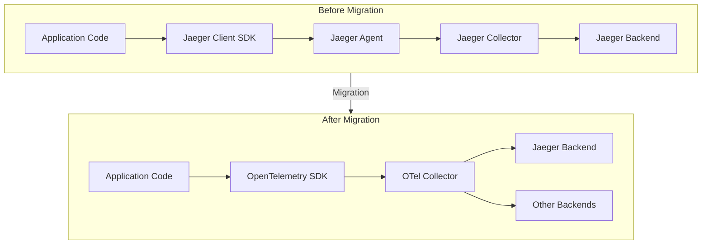
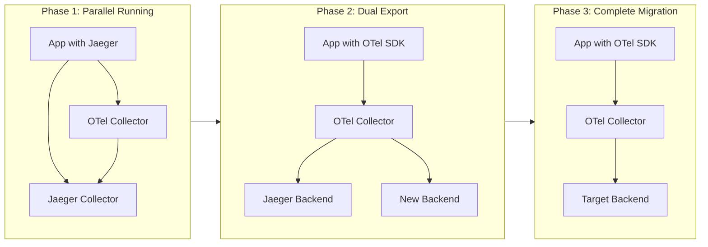
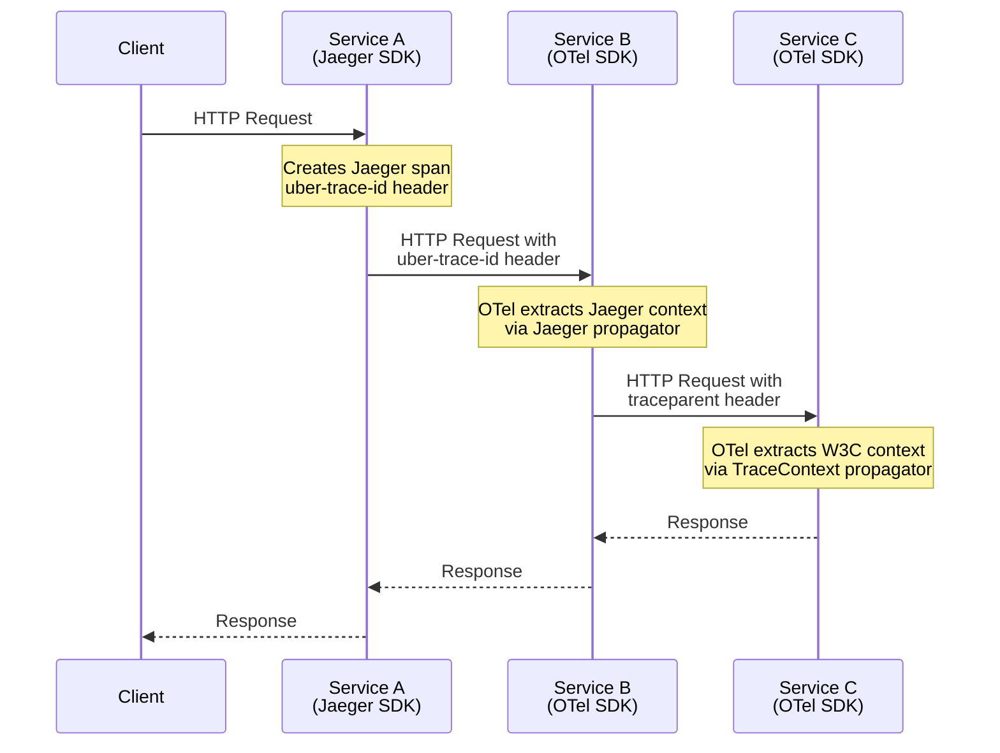
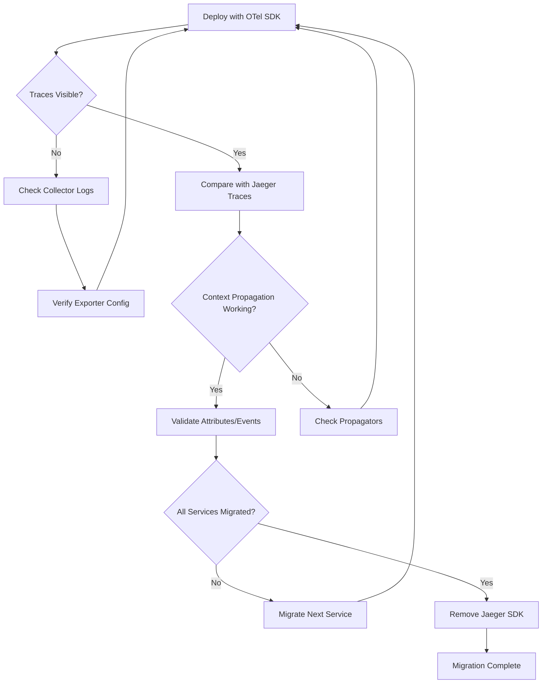

# How to Migrate from Jaeger to OpenTelemetry

Author: [nawazdhandala](https://github.com/nawazdhandala)

Tags: OpenTelemetry, Jaeger, Migration, Tracing, Observability

Description: A step-by-step guide to migrating from Jaeger client libraries to OpenTelemetry.

---

Jaeger has been a popular choice for distributed tracing in microservices architectures. However, with OpenTelemetry becoming the industry standard for observability, many organizations are migrating their instrumentation from Jaeger client libraries to the OpenTelemetry SDK. This guide provides a comprehensive, step-by-step approach to making this transition smoothly while maintaining backward compatibility with your existing Jaeger backend.

## Why Migrate from Jaeger to OpenTelemetry?

Before diving into the migration process, let's understand the compelling reasons for this transition:

1. **Vendor Neutrality**: OpenTelemetry is vendor-agnostic, allowing you to send telemetry data to any backend
2. **Unified Observability**: OpenTelemetry provides traces, metrics, and logs in a single SDK
3. **Active Development**: Jaeger client libraries are in maintenance mode; OpenTelemetry receives active development
4. **Industry Standard**: OpenTelemetry has become the CNCF standard for observability
5. **Better Ecosystem**: Extensive auto-instrumentation libraries and integrations

## Migration Architecture Overview

The following diagram illustrates the high-level migration workflow:



## Phase 1: Understanding the Current Jaeger Setup

Before migrating, you need to document your current Jaeger instrumentation. Here's a typical Jaeger client setup that we'll be migrating from:

The following code shows a standard Jaeger tracer initialization in Go that many applications use. We will convert this to OpenTelemetry step by step.

```go
// Current Jaeger setup that needs to be migrated
// This creates a Jaeger tracer with sampling and reporting configuration
package tracing

import (
    "io"
    "time"

    "github.com/opentracing/opentracing-go"
    "github.com/uber/jaeger-client-go"
    "github.com/uber/jaeger-client-go/config"
)

// InitJaeger initializes the Jaeger tracer
// This is the legacy setup we're migrating away from
func InitJaeger(serviceName string) (opentracing.Tracer, io.Closer, error) {
    // Configuration for the Jaeger client
    // samplerType: const means all traces are sampled
    // samplerParam: 1 means 100% sampling rate
    cfg := config.Configuration{
        ServiceName: serviceName,
        Sampler: &config.SamplerConfig{
            Type:  jaeger.SamplerTypeConst,
            Param: 1,
        },
        Reporter: &config.ReporterConfig{
            LogSpans:            true,
            BufferFlushInterval: 1 * time.Second,
            LocalAgentHostPort:  "localhost:6831",
        },
    }

    // Create the tracer from the configuration
    tracer, closer, err := cfg.NewTracer()
    if err != nil {
        return nil, nil, err
    }

    // Set as the global tracer for OpenTracing compatibility
    opentracing.SetGlobalTracer(tracer)
    return tracer, closer, nil
}
```

Here's an example of how spans are created with the Jaeger client. Note the OpenTracing API usage which will change with OpenTelemetry.

```go
// Example of creating spans with Jaeger/OpenTracing
// This pattern will be replaced with OpenTelemetry's API
func processRequest(ctx context.Context, data string) error {
    // Start a new span from the context
    // The span name describes the operation being traced
    span, ctx := opentracing.StartSpanFromContext(ctx, "processRequest")
    defer span.Finish()

    // Add tags to provide additional context
    // Tags are key-value pairs attached to the span
    span.SetTag("data.length", len(data))
    span.SetTag("component", "processor")

    // Log events within the span
    // These appear as logs/events in the trace
    span.LogKV(
        "event", "processing_started",
        "data_preview", data[:min(50, len(data))],
    )

    // Perform the actual work
    result, err := doWork(ctx, data)
    if err != nil {
        // Mark the span as an error
        span.SetTag("error", true)
        span.LogKV("error.message", err.Error())
        return err
    }

    span.LogKV("event", "processing_completed", "result", result)
    return nil
}
```

## Phase 2: Configuration Mapping

The following table provides a comprehensive mapping between Jaeger client configuration options and their OpenTelemetry equivalents:

| Jaeger Configuration | OpenTelemetry Equivalent | Notes |
|---------------------|-------------------------|-------|
| `ServiceName` | `service.name` resource attribute | Set via resource configuration |
| `SamplerType: const` | `TraceIDRatioBased` or `AlwaysOn` | Use AlwaysOn for 100% sampling |
| `SamplerType: probabilistic` | `TraceIDRatioBased` | Direct equivalent |
| `SamplerType: ratelimiting` | Custom sampler needed | Implement rate limiting sampler |
| `Reporter.LocalAgentHostPort` | OTLP exporter endpoint | Use OTel Collector |
| `Reporter.BufferFlushInterval` | `BatchSpanProcessor` options | Configure batch processor |
| `Tags` | Resource attributes | Set as resource attributes |
| `Propagation: jaeger` | `jaeger` propagator | Available in OTel |
| `Propagation: b3` | `b3` propagator | Available in OTel |

## Phase 3: Setting Up OpenTelemetry

Now let's set up the OpenTelemetry SDK. First, install the required dependencies:

```bash
# Install OpenTelemetry Go SDK and exporters
go get go.opentelemetry.io/otel
go get go.opentelemetry.io/otel/sdk
go get go.opentelemetry.io/otel/exporters/otlp/otlptrace
go get go.opentelemetry.io/otel/exporters/otlp/otlptrace/otlptracegrpc
go get go.opentelemetry.io/otel/propagation
go get go.opentelemetry.io/contrib/propagators/jaeger
```

The following code sets up the OpenTelemetry tracer provider, which replaces the Jaeger tracer initialization. This includes resource configuration, exporter setup, and sampler configuration.

```go
// OpenTelemetry tracer initialization
// This replaces the Jaeger InitJaeger function
package tracing

import (
    "context"
    "time"

    "go.opentelemetry.io/otel"
    "go.opentelemetry.io/otel/attribute"
    "go.opentelemetry.io/otel/exporters/otlp/otlptrace"
    "go.opentelemetry.io/otel/exporters/otlp/otlptrace/otlptracegrpc"
    "go.opentelemetry.io/otel/propagation"
    "go.opentelemetry.io/otel/sdk/resource"
    sdktrace "go.opentelemetry.io/otel/sdk/trace"
    semconv "go.opentelemetry.io/otel/semconv/v1.21.0"
    "google.golang.org/grpc"
    "google.golang.org/grpc/credentials/insecure"
)

// InitOpenTelemetry initializes the OpenTelemetry tracer provider
// Returns a shutdown function that should be called when the application exits
func InitOpenTelemetry(ctx context.Context, serviceName string) (func(context.Context) error, error) {
    // Create a resource that describes this service
    // Resources provide metadata about the entity producing telemetry
    res, err := resource.Merge(
        resource.Default(),
        resource.NewWithAttributes(
            semconv.SchemaURL,
            // Service name is the primary identifier for your service
            semconv.ServiceName(serviceName),
            // Add version information for better debugging
            semconv.ServiceVersion("1.0.0"),
            // Add deployment environment for filtering
            attribute.String("deployment.environment", "production"),
        ),
    )
    if err != nil {
        return nil, err
    }

    // Create a gRPC connection to the OpenTelemetry Collector
    // This replaces the Jaeger agent connection
    conn, err := grpc.DialContext(
        ctx,
        // Default OTel Collector gRPC endpoint
        "localhost:4317",
        grpc.WithTransportCredentials(insecure.NewCredentials()),
        grpc.WithBlock(),
    )
    if err != nil {
        return nil, err
    }

    // Create the OTLP trace exporter
    // This sends trace data to the OTel Collector using the OTLP protocol
    traceExporter, err := otlptrace.New(
        ctx,
        otlptracegrpc.NewClient(otlptracegrpc.WithGRPCConn(conn)),
    )
    if err != nil {
        return nil, err
    }

    // Create a batch span processor for efficient trace export
    // Batching reduces network overhead by grouping spans together
    bsp := sdktrace.NewBatchSpanProcessor(
        traceExporter,
        // Configure batch size and timing
        sdktrace.WithMaxQueueSize(2048),
        sdktrace.WithMaxExportBatchSize(512),
        sdktrace.WithBatchTimeout(5*time.Second),
    )

    // Create the tracer provider with all configurations
    // This is the central point for managing trace creation
    tracerProvider := sdktrace.NewTracerProvider(
        // Use AlwaysOn sampler for 100% sampling (equivalent to const sampler with param=1)
        sdktrace.WithSampler(sdktrace.AlwaysSample()),
        // Attach the resource to all spans
        sdktrace.WithResource(res),
        // Use the batch processor for exporting
        sdktrace.WithSpanProcessor(bsp),
    )

    // Set as the global tracer provider
    // This allows instrumentation libraries to access it
    otel.SetTracerProvider(tracerProvider)

    // Set up propagation for distributed tracing
    // TextMapPropagator handles context propagation across service boundaries
    otel.SetTextMapPropagator(propagation.NewCompositeTextMapPropagator(
        propagation.TraceContext{},  // W3C Trace Context (recommended)
        propagation.Baggage{},       // W3C Baggage for custom context
    ))

    // Return a shutdown function for graceful cleanup
    return tracerProvider.Shutdown, nil
}
```

## Phase 4: Migrating Span Creation

The following code demonstrates how to create spans using the OpenTelemetry API. Notice the differences from the OpenTracing API: we use `tracer.Start()` instead of `StartSpanFromContext()`, and attributes replace tags.

```go
// OpenTelemetry span creation
// This replaces the OpenTracing span creation pattern
package handlers

import (
    "context"

    "go.opentelemetry.io/otel"
    "go.opentelemetry.io/otel/attribute"
    "go.opentelemetry.io/otel/codes"
    "go.opentelemetry.io/otel/trace"
)

// Get a tracer for this package
// The tracer name should identify the instrumentation library or package
var tracer = otel.Tracer("myapp/handlers")

// processRequest demonstrates OpenTelemetry span creation
// Compare this with the Jaeger version above
func processRequest(ctx context.Context, data string) error {
    // Start a new span
    // The context returned contains the span, use it for nested operations
    ctx, span := tracer.Start(ctx, "processRequest",
        // SpanKind indicates the relationship between spans
        trace.WithSpanKind(trace.SpanKindInternal),
    )
    // Always ensure the span is ended to avoid memory leaks
    defer span.End()

    // Add attributes to the span (replaces SetTag)
    // Attributes provide structured metadata about the operation
    span.SetAttributes(
        attribute.Int("data.length", len(data)),
        attribute.String("component", "processor"),
    )

    // Add an event (replaces LogKV)
    // Events are timestamped annotations within a span
    span.AddEvent("processing_started",
        trace.WithAttributes(
            attribute.String("data_preview", data[:min(50, len(data))]),
        ),
    )

    // Perform the actual work
    result, err := doWork(ctx, data)
    if err != nil {
        // Record the error on the span
        // This automatically sets the span status to Error
        span.RecordError(err)
        span.SetStatus(codes.Error, err.Error())
        return err
    }

    // Add completion event
    span.AddEvent("processing_completed",
        trace.WithAttributes(
            attribute.String("result", result),
        ),
    )

    // Set status to OK for successful operations
    span.SetStatus(codes.Ok, "")
    return nil
}
```

## Phase 5: Gradual Migration Strategy

A gradual migration minimizes risk and allows for testing at each stage. The following diagram shows the recommended migration phases:



### Phase 1: Run Both SDKs in Parallel

During the initial phase, you can run both Jaeger and OpenTelemetry SDKs simultaneously. This allows validation of the new instrumentation without disrupting existing monitoring.

The following code shows how to initialize both tracers and create spans that are recorded by both systems. This is useful for comparing trace data between the two implementations.

```go
// Parallel tracing setup for validation
// This allows comparing Jaeger and OpenTelemetry traces side by side
package tracing

import (
    "context"
    "io"

    "github.com/opentracing/opentracing-go"
    "go.opentelemetry.io/otel"
    "go.opentelemetry.io/otel/trace"
)

// DualTracer wraps both Jaeger and OpenTelemetry tracers
// Use this during the migration validation phase
type DualTracer struct {
    jaegerTracer   opentracing.Tracer
    jaegerCloser   io.Closer
    otelTracer     trace.Tracer
    otelShutdown   func(context.Context) error
}

// NewDualTracer creates a tracer that reports to both systems
// This enables parallel validation during migration
func NewDualTracer(ctx context.Context, serviceName string) (*DualTracer, error) {
    // Initialize Jaeger (existing setup)
    jaegerTracer, jaegerCloser, err := InitJaeger(serviceName)
    if err != nil {
        return nil, err
    }

    // Initialize OpenTelemetry (new setup)
    otelShutdown, err := InitOpenTelemetry(ctx, serviceName)
    if err != nil {
        jaegerCloser.Close()
        return nil, err
    }

    return &DualTracer{
        jaegerTracer:   jaegerTracer,
        jaegerCloser:   jaegerCloser,
        otelTracer:     otel.Tracer(serviceName),
        otelShutdown:   otelShutdown,
    }, nil
}

// StartSpan creates spans in both tracing systems
// This allows comparing trace data during validation
func (dt *DualTracer) StartSpan(ctx context.Context, operationName string) (context.Context, func()) {
    // Create Jaeger span
    jaegerSpan, ctx := opentracing.StartSpanFromContext(ctx, operationName)

    // Create OpenTelemetry span
    ctx, otelSpan := dt.otelTracer.Start(ctx, operationName)

    // Return a combined finish function
    finishFunc := func() {
        jaegerSpan.Finish()
        otelSpan.End()
    }

    return ctx, finishFunc
}

// Close shuts down both tracing systems
// Call this when the application is shutting down
func (dt *DualTracer) Close(ctx context.Context) error {
    dt.jaegerCloser.Close()
    return dt.otelShutdown(ctx)
}
```

### Phase 2: OpenTelemetry Collector Configuration

The OpenTelemetry Collector acts as a central hub for receiving, processing, and exporting telemetry data. Configure it to receive data from both Jaeger and OTLP protocols, and export to your Jaeger backend.

The following configuration file sets up the OTel Collector to accept traces from multiple sources and route them to Jaeger. This enables a smooth transition as services migrate.

```yaml
# OpenTelemetry Collector configuration for migration
# This configuration accepts both Jaeger and OTLP traces
# Save as otel-collector-config.yaml

# Receivers define how the collector receives telemetry data
receivers:
  # OTLP receiver for OpenTelemetry SDK instrumented services
  # This is the primary receiver for migrated services
  otlp:
    protocols:
      grpc:
        endpoint: 0.0.0.0:4317
      http:
        endpoint: 0.0.0.0:4318

  # Jaeger receiver for services still using Jaeger client
  # This allows gradual migration without breaking existing services
  jaeger:
    protocols:
      grpc:
        endpoint: 0.0.0.0:14250
      thrift_http:
        endpoint: 0.0.0.0:14268
      thrift_compact:
        endpoint: 0.0.0.0:6831
      thrift_binary:
        endpoint: 0.0.0.0:6832

# Processors modify or filter telemetry data
processors:
  # Batch processor groups spans for efficient export
  # This reduces network overhead and improves throughput
  batch:
    timeout: 1s
    send_batch_size: 1024
    send_batch_max_size: 2048

  # Memory limiter prevents out of memory errors
  # Essential for production deployments
  memory_limiter:
    check_interval: 1s
    limit_mib: 1000
    spike_limit_mib: 200

  # Resource processor adds common attributes
  # Useful for adding environment or cluster information
  resource:
    attributes:
      - key: environment
        value: production
        action: upsert

# Exporters send telemetry data to backends
exporters:
  # Jaeger exporter for backward compatibility
  # Sends traces to your existing Jaeger installation
  jaeger:
    endpoint: jaeger-collector:14250
    tls:
      insecure: true

  # OTLP exporter for future backend (optional)
  # Use this when migrating to a new observability platform
  otlp:
    endpoint: new-backend:4317
    tls:
      insecure: true

  # Logging exporter for debugging
  # Useful during migration to verify data flow
  logging:
    loglevel: debug

# Extensions provide additional capabilities
extensions:
  # Health check endpoint for monitoring collector status
  health_check:
    endpoint: 0.0.0.0:13133

  # Performance profiling for debugging
  pprof:
    endpoint: 0.0.0.0:1777

  # zPages for debugging pipelines
  zpages:
    endpoint: 0.0.0.0:55679

# Service section ties everything together
service:
  extensions: [health_check, pprof, zpages]
  pipelines:
    # Traces pipeline processes trace data
    traces:
      # Accept traces from both OTLP and Jaeger sources
      receivers: [otlp, jaeger]
      # Apply processing in order
      processors: [memory_limiter, batch, resource]
      # Export to Jaeger backend (add otlp for dual export)
      exporters: [jaeger, logging]
```

## Phase 6: Context Propagation Migration

Context propagation is critical for distributed tracing. When migrating, you need to ensure that trace context is properly passed between services, even if they use different instrumentation.

The following diagram shows how context propagation works during migration when services use different SDKs:



To support context propagation from Jaeger-instrumented services, configure the OpenTelemetry SDK to use the Jaeger propagator alongside the W3C Trace Context propagator.

```go
// Context propagation setup for mixed environments
// This enables tracing across services using different SDKs
package tracing

import (
    "go.opentelemetry.io/contrib/propagators/jaeger"
    "go.opentelemetry.io/otel"
    "go.opentelemetry.io/otel/propagation"
)

// SetupMixedPropagation configures propagators for migration
// This allows OpenTelemetry to understand Jaeger trace headers
func SetupMixedPropagation() {
    // Create a composite propagator that supports multiple formats
    // During migration, you need to support both Jaeger and W3C formats
    otel.SetTextMapPropagator(propagation.NewCompositeTextMapPropagator(
        // W3C Trace Context is the standard format for OpenTelemetry
        // Use this as the primary format for new services
        propagation.TraceContext{},

        // W3C Baggage allows passing custom key-value pairs
        // Replaces Jaeger's baggage functionality
        propagation.Baggage{},

        // Jaeger propagator reads the uber-trace-id header
        // Essential for receiving traces from Jaeger-instrumented services
        jaeger.Jaeger{},
    ))
}
```

The following code demonstrates HTTP middleware that properly propagates context between services. This middleware extracts trace context from incoming requests and injects it into outgoing requests.

```go
// HTTP middleware for trace context propagation
// Use this to ensure traces flow correctly across service boundaries
package middleware

import (
    "net/http"

    "go.opentelemetry.io/contrib/instrumentation/net/http/otelhttp"
    "go.opentelemetry.io/otel"
    "go.opentelemetry.io/otel/propagation"
)

// TracingMiddleware wraps an HTTP handler with tracing
// This extracts trace context from incoming requests
func TracingMiddleware(next http.Handler) http.Handler {
    return otelhttp.NewHandler(next, "http-server",
        // Configure options for the handler
        otelhttp.WithPropagators(otel.GetTextMapPropagator()),
    )
}

// TracingTransport wraps an HTTP transport with tracing
// This injects trace context into outgoing requests
func TracingTransport(base http.RoundTripper) http.RoundTripper {
    if base == nil {
        base = http.DefaultTransport
    }
    return otelhttp.NewTransport(base,
        otelhttp.WithPropagators(otel.GetTextMapPropagator()),
    )
}

// CreateTracingClient creates an HTTP client with tracing enabled
// Use this for all outgoing HTTP requests to propagate context
func CreateTracingClient() *http.Client {
    return &http.Client{
        Transport: TracingTransport(nil),
    }
}
```

## Phase 7: Data Format Compatibility

When migrating to OpenTelemetry, you need to understand the data format differences. OpenTelemetry uses OTLP (OpenTelemetry Protocol), but the Collector can convert between formats.

The following table shows the mapping between Jaeger and OpenTelemetry data models:

| Jaeger Concept | OpenTelemetry Equivalent | Conversion Notes |
|----------------|-------------------------|------------------|
| Span | Span | Direct mapping |
| Trace ID (128-bit) | Trace ID (128-bit) | Compatible |
| Span ID (64-bit) | Span ID (64-bit) | Compatible |
| Operation Name | Span Name | Direct mapping |
| Tags | Attributes | Similar key-value pairs |
| Logs | Events | Events are timestamped |
| References | Links | Parent-child relationship preserved |
| Process | Resource | Service-level metadata |
| Baggage | Baggage | W3C Baggage specification |

### Semantic Convention Migration

OpenTelemetry uses semantic conventions for attribute naming. The following code shows how to map common Jaeger tags to OpenTelemetry semantic conventions:

```go
// Semantic convention mapping for consistent attribute naming
// OpenTelemetry has standardized attribute names for common concepts
package tracing

import (
    "go.opentelemetry.io/otel/attribute"
    semconv "go.opentelemetry.io/otel/semconv/v1.21.0"
)

// Common Jaeger tag to OpenTelemetry attribute mappings
// Use semantic conventions for standardized, queryable attributes

// Jaeger: span.SetTag("http.method", "GET")
// OpenTelemetry equivalent using semantic conventions:
var httpMethodAttr = semconv.HTTPMethod("GET")

// Jaeger: span.SetTag("http.status_code", 200)
// OpenTelemetry equivalent:
var httpStatusAttr = semconv.HTTPStatusCode(200)

// Jaeger: span.SetTag("http.url", "https://example.com/api")
// OpenTelemetry equivalent:
var httpURLAttr = semconv.HTTPURL("https://example.com/api")

// Jaeger: span.SetTag("db.type", "postgresql")
// OpenTelemetry equivalent:
var dbSystemAttr = semconv.DBSystemPostgreSQL

// Jaeger: span.SetTag("db.statement", "SELECT * FROM users")
// OpenTelemetry equivalent:
var dbStatementAttr = semconv.DBStatement("SELECT * FROM users")

// Jaeger: span.SetTag("error", true)
// OpenTelemetry: Use span.SetStatus(codes.Error, message) instead

// Helper function to create HTTP attributes from a request
// This demonstrates the preferred way to set HTTP-related attributes
func HTTPServerAttributes(method, url string, statusCode int) []attribute.KeyValue {
    return []attribute.KeyValue{
        semconv.HTTPMethod(method),
        semconv.HTTPURL(url),
        semconv.HTTPStatusCode(statusCode),
        // Additional semantic conventions for HTTP
        semconv.HTTPScheme("https"),
        semconv.NetHostName("example.com"),
        semconv.NetHostPort(443),
    }
}
```

## Phase 8: Python Migration Example

If your application uses Python, here's how to migrate from the Jaeger client to OpenTelemetry.

First, install the required packages:

```bash
# Remove old Jaeger client
pip uninstall jaeger-client

# Install OpenTelemetry packages
pip install opentelemetry-api
pip install opentelemetry-sdk
pip install opentelemetry-exporter-otlp
pip install opentelemetry-propagator-jaeger
```

The following code shows the before and after of a Python tracing setup. The first block is the legacy Jaeger configuration, and the second block shows the OpenTelemetry equivalent.

```python
# BEFORE: Legacy Jaeger Python client setup
# This is the code we're migrating away from

from jaeger_client import Config
from opentracing import tracer

def init_jaeger_tracer(service_name):
    """Initialize Jaeger tracer using the deprecated client library."""
    config = Config(
        config={
            'sampler': {
                'type': 'const',
                'param': 1,
            },
            'local_agent': {
                'reporting_host': 'localhost',
                'reporting_port': '6831',
            },
            'logging': True,
        },
        service_name=service_name,
    )
    return config.initialize_tracer()
```

```python
# AFTER: OpenTelemetry Python SDK setup
# This replaces the Jaeger client with OpenTelemetry

from opentelemetry import trace
from opentelemetry.sdk.trace import TracerProvider
from opentelemetry.sdk.trace.export import BatchSpanProcessor
from opentelemetry.exporter.otlp.proto.grpc.trace_exporter import OTLPSpanExporter
from opentelemetry.sdk.resources import Resource, SERVICE_NAME
from opentelemetry.propagate import set_global_textmap
from opentelemetry.propagators.composite import CompositeHTTPPropagator
from opentelemetry.trace.propagation.tracecontext import TraceContextTextMapPropagator
from opentelemetry.propagators.jaeger import JaegerPropagator


def init_opentelemetry_tracer(service_name: str) -> None:
    """
    Initialize OpenTelemetry tracer.

    This function sets up the complete tracing pipeline including:
    - Resource configuration with service name
    - OTLP exporter for sending traces to the collector
    - Batch processor for efficient trace export
    - Propagators for distributed context
    """
    # Create a resource that identifies this service
    # Resources are attached to all spans produced by this provider
    resource = Resource(attributes={
        SERVICE_NAME: service_name,
        "deployment.environment": "production",
        "service.version": "1.0.0",
    })

    # Create the tracer provider with the resource
    provider = TracerProvider(resource=resource)

    # Configure the OTLP exporter to send traces to the collector
    # The collector handles routing to Jaeger or other backends
    otlp_exporter = OTLPSpanExporter(
        endpoint="localhost:4317",
        insecure=True,  # Use TLS in production
    )

    # Use a batch processor for efficient export
    # This groups spans together before sending to reduce overhead
    span_processor = BatchSpanProcessor(
        otlp_exporter,
        max_queue_size=2048,
        max_export_batch_size=512,
        schedule_delay_millis=5000,
    )
    provider.add_span_processor(span_processor)

    # Set as the global tracer provider
    trace.set_tracer_provider(provider)

    # Configure propagators for distributed tracing
    # Include Jaeger propagator for backward compatibility
    set_global_textmap(CompositeHTTPPropagator([
        TraceContextTextMapPropagator(),  # W3C Trace Context
        JaegerPropagator(),  # For services still using Jaeger SDK
    ]))


def create_span_example():
    """
    Example of creating spans with OpenTelemetry.

    This demonstrates the OpenTelemetry API for creating spans,
    adding attributes, and recording events.
    """
    # Get a tracer for this module
    tracer = trace.get_tracer(__name__)

    # Start a new span using a context manager
    # The span is automatically ended when the block exits
    with tracer.start_as_current_span("process_request") as span:
        # Add attributes (replaces Jaeger tags)
        span.set_attribute("request.id", "12345")
        span.set_attribute("user.id", "user-789")

        # Add an event (replaces Jaeger logs)
        span.add_event("Processing started", {
            "queue.depth": 42,
        })

        # Nested span for a sub-operation
        with tracer.start_as_current_span("database_query") as db_span:
            db_span.set_attribute("db.system", "postgresql")
            db_span.set_attribute("db.statement", "SELECT * FROM users")
            # ... execute query ...

        # Add completion event
        span.add_event("Processing completed")
```

## Phase 9: JavaScript/Node.js Migration Example

For Node.js applications, here's the migration path from Jaeger to OpenTelemetry.

Install the required packages:

```bash
# Remove old Jaeger client
npm uninstall jaeger-client

# Install OpenTelemetry packages
npm install @opentelemetry/api
npm install @opentelemetry/sdk-node
npm install @opentelemetry/sdk-trace-node
npm install @opentelemetry/exporter-trace-otlp-grpc
npm install @opentelemetry/resources
npm install @opentelemetry/semantic-conventions
npm install @opentelemetry/propagator-jaeger
```

The following code shows the complete OpenTelemetry setup for Node.js, replacing the Jaeger client:

```javascript
// OpenTelemetry Node.js setup
// This file should be loaded before any other application code
// Use: node --require ./tracing.js app.js

const { NodeSDK } = require('@opentelemetry/sdk-node');
const { getNodeAutoInstrumentations } = require('@opentelemetry/auto-instrumentations-node');
const { OTLPTraceExporter } = require('@opentelemetry/exporter-trace-otlp-grpc');
const { Resource } = require('@opentelemetry/resources');
const { SemanticResourceAttributes } = require('@opentelemetry/semantic-conventions');
const { JaegerPropagator } = require('@opentelemetry/propagator-jaeger');
const { CompositePropagator, W3CTraceContextPropagator } = require('@opentelemetry/core');

/**
 * Initialize OpenTelemetry SDK for Node.js
 *
 * This setup provides:
 * - Automatic instrumentation for common libraries (Express, HTTP, etc.)
 * - OTLP export to the OpenTelemetry Collector
 * - Jaeger propagation for backward compatibility during migration
 */
const sdk = new NodeSDK({
  // Resource identifies this service in traces
  resource: new Resource({
    [SemanticResourceAttributes.SERVICE_NAME]: 'my-node-service',
    [SemanticResourceAttributes.SERVICE_VERSION]: '1.0.0',
    [SemanticResourceAttributes.DEPLOYMENT_ENVIRONMENT]: 'production',
  }),

  // OTLP exporter sends traces to the OTel Collector
  // The collector routes them to Jaeger or other backends
  traceExporter: new OTLPTraceExporter({
    url: 'http://localhost:4317',
  }),

  // Composite propagator supports multiple context formats
  // This is essential during migration when services use different SDKs
  textMapPropagator: new CompositePropagator({
    propagators: [
      new W3CTraceContextPropagator(),  // Standard format
      new JaegerPropagator(),            // For Jaeger SDK services
    ],
  }),

  // Auto-instrumentations automatically trace common libraries
  // This reduces the amount of manual instrumentation needed
  instrumentations: [
    getNodeAutoInstrumentations({
      // Configure specific instrumentations
      '@opentelemetry/instrumentation-http': {
        // Ignore health check endpoints to reduce noise
        ignoreIncomingRequestHook: (request) => {
          return request.url === '/health' || request.url === '/ready';
        },
      },
      '@opentelemetry/instrumentation-express': {
        // Include the route in the span name
        requestHook: (span, info) => {
          span.setAttribute('http.route', info.route);
        },
      },
    }),
  ],
});

// Start the SDK
// This must happen before importing your application code
sdk.start();

// Graceful shutdown on process termination
// This ensures all pending traces are exported
process.on('SIGTERM', () => {
  sdk.shutdown()
    .then(() => console.log('Tracing terminated'))
    .catch((error) => console.error('Error shutting down tracing', error))
    .finally(() => process.exit(0));
});

console.log('OpenTelemetry tracing initialized');
```

The following code shows how to create manual spans in Node.js when auto-instrumentation is not sufficient:

```javascript
// Manual span creation in Node.js
// Use this for custom business logic instrumentation

const { trace, SpanKind, SpanStatusCode } = require('@opentelemetry/api');

// Get a tracer for this module
// The name should identify the instrumentation scope
const tracer = trace.getTracer('my-service/order-processor');

/**
 * Process an order with tracing
 *
 * This demonstrates manual span creation, attribute setting,
 * and proper error handling with OpenTelemetry.
 *
 * @param {Object} order - The order to process
 */
async function processOrder(order) {
  // Start a new span for this operation
  // Use startActiveSpan to automatically set the span as active in context
  return tracer.startActiveSpan('processOrder', {
    kind: SpanKind.INTERNAL,
    attributes: {
      'order.id': order.id,
      'order.items_count': order.items.length,
      'order.total_amount': order.totalAmount,
    },
  }, async (span) => {
    try {
      // Add an event for tracking progress
      span.addEvent('Order processing started');

      // Validate the order - creates a child span
      await validateOrder(order);

      // Process payment - creates a child span
      const paymentResult = await processPayment(order);
      span.setAttribute('payment.transaction_id', paymentResult.transactionId);

      // Update inventory - creates a child span
      await updateInventory(order.items);

      // Add completion event
      span.addEvent('Order processing completed', {
        'processing.duration_ms': Date.now() - span.startTime,
      });

      // Set success status
      span.setStatus({ code: SpanStatusCode.OK });

      return { success: true, transactionId: paymentResult.transactionId };

    } catch (error) {
      // Record the error on the span
      // This includes the stack trace for debugging
      span.recordException(error);
      span.setStatus({
        code: SpanStatusCode.ERROR,
        message: error.message,
      });
      throw error;

    } finally {
      // Always end the span
      span.end();
    }
  });
}

/**
 * Validate order with a child span
 */
async function validateOrder(order) {
  return tracer.startActiveSpan('validateOrder', async (span) => {
    try {
      // Validation logic here
      span.setAttribute('validation.rules_checked', 5);
      span.setStatus({ code: SpanStatusCode.OK });
    } finally {
      span.end();
    }
  });
}
```

## Phase 10: Testing and Validation

Before completing the migration, thoroughly test your implementation. The following diagram shows the validation workflow:



The following code provides a test helper for validating trace propagation:

```go
// Test helper for validating trace propagation
// Use this in integration tests to verify tracing works correctly
package tracing_test

import (
    "context"
    "net/http"
    "net/http/httptest"
    "testing"

    "go.opentelemetry.io/otel"
    "go.opentelemetry.io/otel/propagation"
    "go.opentelemetry.io/otel/sdk/trace"
    "go.opentelemetry.io/otel/sdk/trace/tracetest"
)

// SetupTestTracing creates a test tracer provider with an in-memory exporter
// This allows you to inspect traces in tests without sending to a backend
func SetupTestTracing(t *testing.T) (*tracetest.InMemoryExporter, func()) {
    // Create an in-memory exporter that stores spans for inspection
    exporter := tracetest.NewInMemoryExporter()

    // Create a tracer provider with the test exporter
    // Use SimpleSpanProcessor for synchronous export in tests
    tp := trace.NewTracerProvider(
        trace.WithSyncer(exporter),
        trace.WithSampler(trace.AlwaysSample()),
    )

    // Set as global provider
    otel.SetTracerProvider(tp)
    otel.SetTextMapPropagator(propagation.TraceContext{})

    // Return cleanup function
    cleanup := func() {
        tp.Shutdown(context.Background())
    }

    return exporter, cleanup
}

// TestTracePropagation verifies that trace context is properly propagated
func TestTracePropagation(t *testing.T) {
    exporter, cleanup := SetupTestTracing(t)
    defer cleanup()

    // Create a test server that creates a span
    handler := http.HandlerFunc(func(w http.ResponseWriter, r *http.Request) {
        ctx := r.Context()
        tracer := otel.Tracer("test")
        _, span := tracer.Start(ctx, "handle-request")
        defer span.End()

        w.WriteHeader(http.StatusOK)
    })

    // Wrap with tracing middleware
    server := httptest.NewServer(TracingMiddleware(handler))
    defer server.Close()

    // Make a request with trace context
    tracer := otel.Tracer("test-client")
    ctx, parentSpan := tracer.Start(context.Background(), "client-request")
    defer parentSpan.End()

    // Create request with propagated context
    req, _ := http.NewRequestWithContext(ctx, "GET", server.URL, nil)
    otel.GetTextMapPropagator().Inject(ctx, propagation.HeaderCarrier(req.Header))

    // Execute request
    client := &http.Client{}
    resp, err := client.Do(req)
    if err != nil {
        t.Fatalf("Request failed: %v", err)
    }
    resp.Body.Close()

    // Verify spans were created with correct parent-child relationship
    spans := exporter.GetSpans()
    if len(spans) < 2 {
        t.Fatalf("Expected at least 2 spans, got %d", len(spans))
    }

    // Verify trace IDs match (context was propagated)
    clientSpan := spans[0]
    serverSpan := spans[1]
    if clientSpan.SpanContext().TraceID() != serverSpan.SpanContext().TraceID() {
        t.Error("Trace context was not propagated correctly")
    }

    t.Logf("Successfully validated trace propagation")
}
```

## Troubleshooting Common Issues

### Issue 1: Missing Traces After Migration

If traces are not appearing after migration, check these common causes:

```yaml
# Common configuration issues and solutions

# Problem: Traces not reaching collector
# Solution: Verify collector endpoint and network connectivity
debug_config:
  otlp_endpoint: "localhost:4317"  # Ensure this matches your setup
  verify_steps:
    - "telnet localhost 4317"  # Test connectivity
    - "curl localhost:13133/health"  # Check collector health

# Problem: Traces appear but context is lost between services
# Solution: Ensure propagators are configured on both sides
propagator_checklist:
  - "Both services use the same propagator format"
  - "HTTP headers are not being stripped by proxies"
  - "Context is extracted from incoming requests"
  - "Context is injected into outgoing requests"

# Problem: Attributes are missing or incorrect
# Solution: Check attribute naming and types
attribute_issues:
  - "Use semantic conventions for standard attributes"
  - "Ensure attribute values match expected types"
  - "Check for attribute limits (default 128 per span)"
```

### Issue 2: Performance Degradation

The following code shows how to configure sampling to reduce performance impact:

```go
// Optimized tracing configuration for high-throughput services
// Use sampling and batching to minimize performance impact
package tracing

import (
    "time"

    sdktrace "go.opentelemetry.io/otel/sdk/trace"
)

// CreateOptimizedTracerProvider creates a tracer provider optimized for performance
// Use this configuration for high-throughput production services
func CreateOptimizedTracerProvider(exporter sdktrace.SpanExporter) *sdktrace.TracerProvider {
    // Use a ratio-based sampler to reduce trace volume
    // 0.1 means 10% of traces are sampled
    // Adjust based on your traffic and storage capacity
    sampler := sdktrace.ParentBased(
        sdktrace.TraceIDRatioBased(0.1),
    )

    // Configure batch processor for efficient export
    // These settings balance latency and throughput
    batchProcessor := sdktrace.NewBatchSpanProcessor(
        exporter,
        // Maximum spans to hold in memory before dropping
        sdktrace.WithMaxQueueSize(4096),
        // Maximum spans per export batch
        sdktrace.WithMaxExportBatchSize(1024),
        // How long to wait before exporting a partial batch
        sdktrace.WithBatchTimeout(2*time.Second),
        // Timeout for export operations
        sdktrace.WithExportTimeout(30*time.Second),
    )

    return sdktrace.NewTracerProvider(
        sdktrace.WithSampler(sampler),
        sdktrace.WithSpanProcessor(batchProcessor),
        // Limit span attributes to prevent memory issues
        sdktrace.WithSpanLimits(sdktrace.SpanLimits{
            AttributeCountLimit:         64,
            EventCountLimit:             64,
            LinkCountLimit:              16,
            AttributePerEventCountLimit: 16,
            AttributePerLinkCountLimit:  16,
        }),
    )
}
```

## Migration Checklist

Use this checklist to track your migration progress:

```markdown
## Pre-Migration
- [ ] Document current Jaeger configuration
- [ ] Identify all services using Jaeger client
- [ ] Plan migration order (start with less critical services)
- [ ] Deploy OpenTelemetry Collector

## Per-Service Migration
- [ ] Add OpenTelemetry dependencies
- [ ] Create OpenTelemetry tracer provider
- [ ] Configure propagators (include Jaeger propagator)
- [ ] Update span creation code
- [ ] Map tags to semantic conventions
- [ ] Test in staging environment
- [ ] Verify traces appear in backend
- [ ] Remove Jaeger client dependencies

## Post-Migration
- [ ] Update Collector to remove Jaeger receiver
- [ ] Switch to W3C Trace Context only
- [ ] Remove Jaeger propagator
- [ ] Update documentation
- [ ] Archive Jaeger-related code
```

## Conclusion

Migrating from Jaeger to OpenTelemetry is a worthwhile investment that provides vendor neutrality, unified observability, and access to a thriving ecosystem. By following this gradual migration approach, you can minimize risk and maintain observability throughout the transition.

Key takeaways:

1. **Use the OpenTelemetry Collector** as an intermediary to receive traces from both Jaeger and OpenTelemetry SDKs
2. **Configure composite propagators** to maintain trace context during the migration period
3. **Migrate services gradually**, validating each step before proceeding
4. **Adopt semantic conventions** for standardized, queryable attributes
5. **Test thoroughly** using in-memory exporters before deploying to production

The OpenTelemetry ecosystem continues to grow, and by migrating now, you position your organization to take advantage of new features and integrations as they become available.

## Further Reading

- [OpenTelemetry Documentation](https://opentelemetry.io/docs/)
- [OpenTelemetry Collector Configuration](https://opentelemetry.io/docs/collector/configuration/)
- [Semantic Conventions](https://opentelemetry.io/docs/specs/semconv/)
- [Jaeger with OpenTelemetry](https://www.jaegertracing.io/docs/latest/getting-started/#opentelemetry)
- [Migration Guide from OpenTracing](https://opentelemetry.io/docs/migration/opentracing/)
