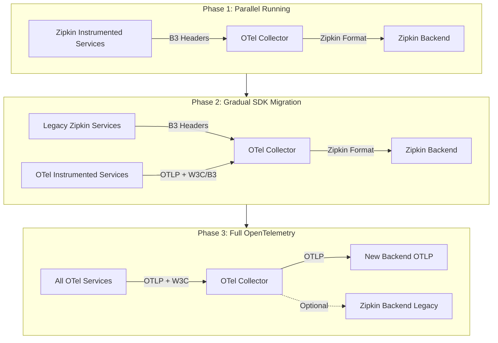
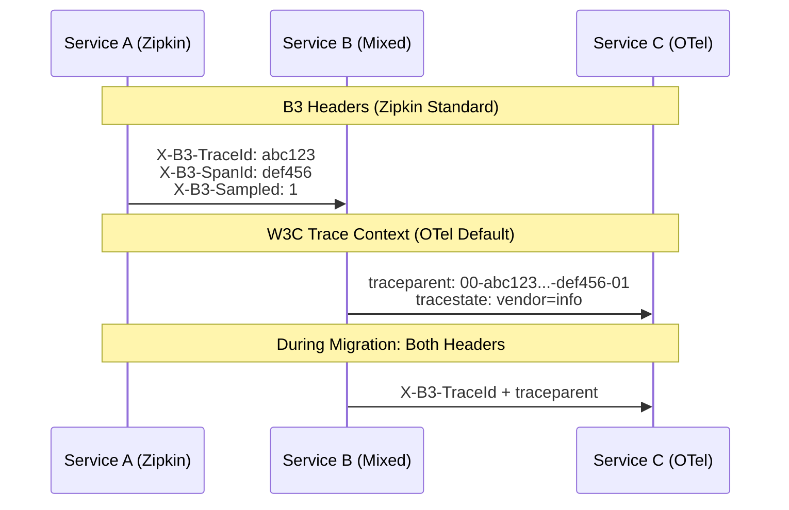
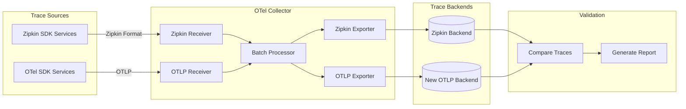
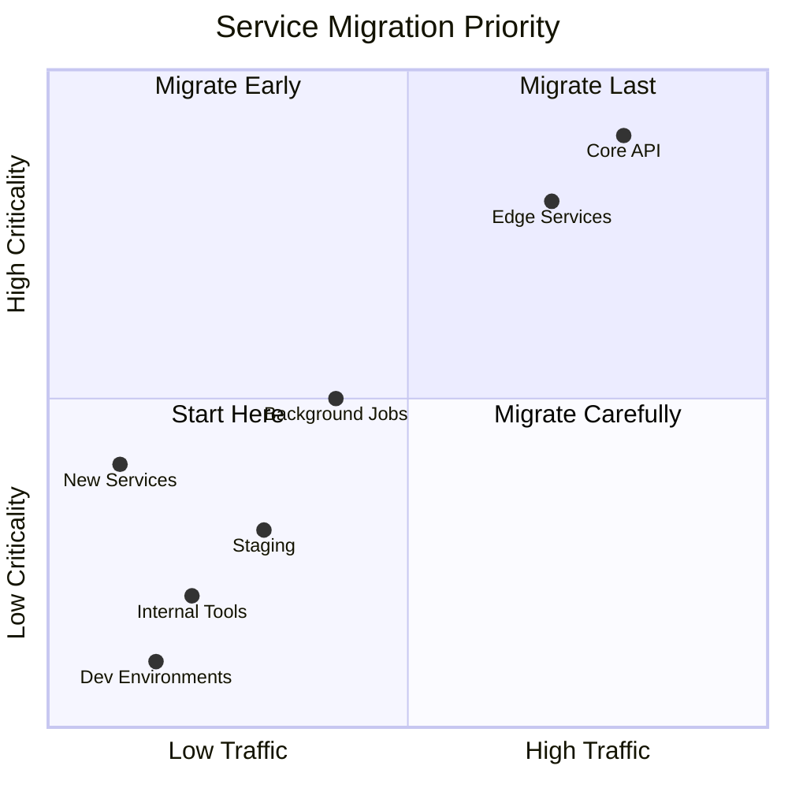

# How to Migrate from Zipkin to OpenTelemetry

Author: [nawazdhandala](https://github.com/nawazdhandala)

Tags: OpenTelemetry, Zipkin, Migration, Tracing, Observability

Description: A comprehensive guide to migrating from Zipkin instrumentation to OpenTelemetry.

---

Zipkin pioneered distributed tracing for many organizations. It introduced concepts like trace IDs, span IDs, and context propagation that became industry standards. However, OpenTelemetry has emerged as the vendor-neutral standard for observability, offering broader instrumentation coverage, multi-signal support (traces, metrics, logs), and a thriving ecosystem.

Migrating from Zipkin to OpenTelemetry does not require a big-bang approach. This guide walks you through a gradual migration strategy that maintains backward compatibility, preserves your existing Zipkin backend investment, and progressively adopts OpenTelemetry instrumentation.

## Why Migrate from Zipkin to OpenTelemetry?

Before diving into the technical details, let us understand why migration makes sense:

- **Multi-signal support**: OpenTelemetry handles traces, metrics, and logs with a unified SDK, while Zipkin focuses primarily on tracing.
- **Broader instrumentation**: Auto-instrumentation libraries cover more frameworks and technologies.
- **Vendor neutrality**: Export to any backend without changing instrumentation code.
- **Active development**: OpenTelemetry has become the CNCF standard with massive community momentum.
- **Semantic conventions**: Standardized attribute names enable better interoperability between tools.

## Migration Architecture Overview

The following diagram illustrates the phased migration approach:



## Phase 1: Deploy OpenTelemetry Collector as a Zipkin Proxy

The first step is deploying the OpenTelemetry Collector to receive Zipkin traces without modifying any application code. This establishes your new observability pipeline while maintaining full backward compatibility.

### Collector Configuration for Zipkin Ingestion

The following configuration sets up the OTel Collector to receive Zipkin-formatted traces and forward them to your existing Zipkin backend:

```yaml
# otel-collector-config.yaml
# This configuration enables the collector to act as a transparent proxy
# for existing Zipkin instrumentation while establishing the OTel pipeline

receivers:
  # The Zipkin receiver accepts traces in Zipkin JSON/Thrift format
  # Compatible with all existing Zipkin client libraries
  zipkin:
    endpoint: 0.0.0.0:9411

  # Also enable OTLP for new services migrating to OpenTelemetry
  # This allows gradual migration without changing the collector
  otlp:
    protocols:
      grpc:
        endpoint: 0.0.0.0:4317
      http:
        endpoint: 0.0.0.0:4318

processors:
  # Batch spans to reduce network overhead and improve throughput
  # The timeout ensures spans are sent even during low-traffic periods
  batch:
    timeout: 1s
    send_batch_size: 1024
    send_batch_max_size: 2048

  # Add resource attributes to identify the collector pipeline
  # Useful for debugging and verifying migration progress
  resource:
    attributes:
      - key: collector.pipeline
        value: zipkin-migration
        action: upsert

exporters:
  # Export to your existing Zipkin backend
  # No changes required to your Zipkin infrastructure
  zipkin:
    endpoint: "http://zipkin-server:9411/api/v2/spans"
    format: json

  # Debug exporter for troubleshooting during migration
  # Remove or reduce verbosity in production
  debug:
    verbosity: detailed
    sampling_initial: 5
    sampling_thereafter: 200

service:
  pipelines:
    traces:
      receivers: [zipkin, otlp]
      processors: [batch, resource]
      exporters: [zipkin, debug]
```

### Deploying the Collector on Kubernetes

The following Kubernetes manifests deploy the collector as a central service that receives traces from all applications:

```yaml
# collector-deployment.yaml
# Deploy the OTel Collector as a centralized trace ingestion point
# This replaces direct connections to Zipkin from applications

apiVersion: apps/v1
kind: Deployment
metadata:
  name: otel-collector
  namespace: observability
  labels:
    app: otel-collector
    component: trace-pipeline
spec:
  replicas: 2
  selector:
    matchLabels:
      app: otel-collector
  template:
    metadata:
      labels:
        app: otel-collector
    spec:
      containers:
        - name: collector
          image: otel/opentelemetry-collector-contrib:0.96.0
          args:
            - --config=/etc/otel/config.yaml
          ports:
            # Zipkin receiver port - existing services connect here
            - containerPort: 9411
              name: zipkin
              protocol: TCP
            # OTLP gRPC - new OTel-instrumented services use this
            - containerPort: 4317
              name: otlp-grpc
              protocol: TCP
            # OTLP HTTP - alternative for environments without gRPC
            - containerPort: 4318
              name: otlp-http
              protocol: TCP
          volumeMounts:
            - name: config
              mountPath: /etc/otel
          resources:
            requests:
              memory: "256Mi"
              cpu: "200m"
            limits:
              memory: "512Mi"
              cpu: "500m"
          # Health checks ensure traffic only routes to healthy collectors
          livenessProbe:
            httpGet:
              path: /
              port: 13133
            initialDelaySeconds: 10
          readinessProbe:
            httpGet:
              path: /
              port: 13133
            initialDelaySeconds: 5
      volumes:
        - name: config
          configMap:
            name: otel-collector-config
---
# Service exposes the collector endpoints to the cluster
apiVersion: v1
kind: Service
metadata:
  name: otel-collector
  namespace: observability
spec:
  selector:
    app: otel-collector
  ports:
    # Applications currently sending to Zipkin redirect here
    - name: zipkin
      port: 9411
      targetPort: 9411
    - name: otlp-grpc
      port: 4317
      targetPort: 4317
    - name: otlp-http
      port: 4318
      targetPort: 4318
```

### Redirecting Existing Zipkin Traffic

Update your application configurations to point to the OTel Collector instead of the Zipkin server:

```yaml
# Before: Direct Zipkin connection
# zipkin.endpoint: http://zipkin-server:9411/api/v2/spans

# After: Route through OTel Collector
# The collector accepts the same Zipkin format, no code changes needed
zipkin.endpoint: http://otel-collector.observability:9411/api/v2/spans
```

## Phase 2: B3 to W3C Trace Context Header Migration

One of the most critical aspects of migration is handling trace context propagation. Zipkin uses B3 headers, while OpenTelemetry defaults to W3C Trace Context. During migration, you need to support both.

### Understanding Header Formats

The following diagram shows how different propagation formats work:



### Java/Spring Boot Migration Example

For Java applications using Spring Cloud Sleuth with Zipkin, here is how to migrate to OpenTelemetry while maintaining B3 compatibility:

```xml
<!-- pom.xml -->
<!-- Remove Zipkin dependencies and add OpenTelemetry -->
<!-- The OTel Spring starter provides auto-instrumentation for Spring Boot -->

<!-- REMOVE these Zipkin dependencies -->
<!--
<dependency>
    <groupId>org.springframework.cloud</groupId>
    <artifactId>spring-cloud-starter-zipkin</artifactId>
</dependency>
<dependency>
    <groupId>org.springframework.cloud</groupId>
    <artifactId>spring-cloud-sleuth-zipkin</artifactId>
</dependency>
-->

<!-- ADD OpenTelemetry dependencies -->
<dependency>
    <!-- Spring Boot starter for OpenTelemetry auto-instrumentation -->
    <groupId>io.opentelemetry.instrumentation</groupId>
    <artifactId>opentelemetry-spring-boot-starter</artifactId>
    <version>2.1.0</version>
</dependency>

<dependency>
    <!-- OTLP exporter sends traces to the OTel Collector -->
    <groupId>io.opentelemetry</groupId>
    <artifactId>opentelemetry-exporter-otlp</artifactId>
    <version>1.35.0</version>
</dependency>

<dependency>
    <!-- B3 propagator maintains compatibility with Zipkin-instrumented services -->
    <groupId>io.opentelemetry</groupId>
    <artifactId>opentelemetry-extension-trace-propagators</artifactId>
    <version>1.35.0</version>
</dependency>
```

```yaml
# application.yaml
# Configure OpenTelemetry for the Spring Boot application
# This setup maintains B3 compatibility while adopting OTel

spring:
  application:
    name: order-service

# OpenTelemetry configuration
otel:
  # Service identification in traces
  resource:
    attributes:
      service.name: order-service
      service.version: 2.1.0
      deployment.environment: production

  # Exporter configuration - send to OTel Collector via OTLP
  exporter:
    otlp:
      endpoint: http://otel-collector.observability:4317
      protocol: grpc

  # CRITICAL: Configure propagators for B3 compatibility
  # This ensures trace context is properly propagated to/from Zipkin services
  propagators:
    # Use composite propagator that handles both W3C and B3
    # Order matters: first match wins for extraction
    - tracecontext   # W3C Trace Context (new standard)
    - baggage        # W3C Baggage
    - b3multi        # B3 multi-header format (X-B3-TraceId, X-B3-SpanId, etc.)
```

```java
// OpenTelemetryConfig.java
// Manual configuration for fine-grained control over propagation
// Use this when you need custom propagator behavior during migration

package com.example.orderservice.config;

import io.opentelemetry.api.OpenTelemetry;
import io.opentelemetry.api.trace.propagation.W3CTraceContextPropagator;
import io.opentelemetry.context.propagation.ContextPropagators;
import io.opentelemetry.context.propagation.TextMapPropagator;
import io.opentelemetry.extension.trace.propagation.B3Propagator;
import io.opentelemetry.sdk.OpenTelemetrySdk;
import io.opentelemetry.sdk.trace.SdkTracerProvider;
import io.opentelemetry.sdk.trace.export.BatchSpanProcessor;
import io.opentelemetry.exporter.otlp.trace.OtlpGrpcSpanExporter;
import org.springframework.context.annotation.Bean;
import org.springframework.context.annotation.Configuration;

@Configuration
public class OpenTelemetryConfig {

    /**
     * Creates a composite propagator that handles both W3C and B3 formats.
     *
     * During migration, services may receive requests with either header format:
     * - New OTel services send W3C traceparent headers
     * - Legacy Zipkin services send X-B3-* headers
     *
     * This propagator extracts context from either format and injects both,
     * ensuring seamless trace continuity across mixed environments.
     */
    @Bean
    public TextMapPropagator compositePropagator() {
        return TextMapPropagator.composite(
            // W3C Trace Context - the new standard, preferred for new services
            W3CTraceContextPropagator.getInstance(),
            // B3 multi-header - compatible with Zipkin instrumentation
            // Includes: X-B3-TraceId, X-B3-SpanId, X-B3-ParentSpanId, X-B3-Sampled
            B3Propagator.injectingMultiHeaders()
        );
    }

    /**
     * Configures the OpenTelemetry SDK with OTLP export and composite propagation.
     *
     * This setup:
     * 1. Exports spans to the OTel Collector via OTLP gRPC
     * 2. Uses batch processing for efficient network usage
     * 3. Propagates context in both W3C and B3 formats
     */
    @Bean
    public OpenTelemetry openTelemetry(TextMapPropagator propagator) {
        // Configure OTLP exporter pointing to the collector
        OtlpGrpcSpanExporter spanExporter = OtlpGrpcSpanExporter.builder()
            .setEndpoint("http://otel-collector.observability:4317")
            .build();

        // Batch processor improves throughput by batching span exports
        BatchSpanProcessor spanProcessor = BatchSpanProcessor.builder(spanExporter)
            .setMaxQueueSize(2048)
            .setMaxExportBatchSize(512)
            .build();

        // Build the tracer provider with the configured processor
        SdkTracerProvider tracerProvider = SdkTracerProvider.builder()
            .addSpanProcessor(spanProcessor)
            .build();

        // Assemble the OpenTelemetry SDK with composite propagators
        return OpenTelemetrySdk.builder()
            .setTracerProvider(tracerProvider)
            .setPropagators(ContextPropagators.create(propagator))
            .buildAndRegisterGlobal();
    }
}
```

### Node.js/JavaScript Migration Example

For Node.js applications, here is the migration path from Zipkin to OpenTelemetry:

```javascript
// Before: Zipkin instrumentation
// This is the legacy setup that we are migrating away from

// const { Tracer } = require('zipkin');
// const { HttpLogger } = require('zipkin-transport-http');
// const { expressMiddleware } = require('zipkin-instrumentation-express');

// After: OpenTelemetry instrumentation
// tracing.js - Initialize this BEFORE importing other modules

const { NodeSDK } = require('@opentelemetry/sdk-node');
const { OTLPTraceExporter } = require('@opentelemetry/exporter-trace-otlp-grpc');
const { getNodeAutoInstrumentations } = require('@opentelemetry/auto-instrumentations-node');
const { Resource } = require('@opentelemetry/resources');
const { SemanticResourceAttributes } = require('@opentelemetry/semantic-conventions');
const {
  CompositePropagator,
  W3CTraceContextPropagator,
  W3CBaggagePropagator
} = require('@opentelemetry/core');
const { B3Propagator, B3InjectEncoding } = require('@opentelemetry/propagator-b3');

/**
 * Configure composite propagator for B3/W3C compatibility
 *
 * This propagator handles both header formats seamlessly:
 * - Extracts trace context from incoming requests (B3 or W3C)
 * - Injects both header formats into outgoing requests
 *
 * This ensures traces remain connected even when requests cross
 * the boundary between Zipkin and OpenTelemetry instrumented services
 */
const propagator = new CompositePropagator({
  propagators: [
    // W3C Trace Context - standard for OpenTelemetry
    new W3CTraceContextPropagator(),
    // W3C Baggage - for propagating custom context
    new W3CBaggagePropagator(),
    // B3 Propagator - compatibility with Zipkin
    // Using MULTI_HEADER encoding matches Zipkin's default format
    new B3Propagator({ injectEncoding: B3InjectEncoding.MULTI_HEADER }),
  ],
});

/**
 * Initialize the OpenTelemetry Node SDK
 *
 * Key configuration points:
 * 1. Resource attributes identify the service in traces
 * 2. OTLP exporter sends traces to the collector
 * 3. Auto-instrumentations cover common libraries automatically
 * 4. Composite propagator handles B3 compatibility
 */
const sdk = new NodeSDK({
  // Resource attributes appear on every span from this service
  resource: new Resource({
    [SemanticResourceAttributes.SERVICE_NAME]: 'user-service',
    [SemanticResourceAttributes.SERVICE_VERSION]: '1.5.0',
    [SemanticResourceAttributes.DEPLOYMENT_ENVIRONMENT]: 'production',
  }),

  // Export traces to OTel Collector via OTLP gRPC
  traceExporter: new OTLPTraceExporter({
    url: 'http://otel-collector.observability:4317',
  }),

  // Auto-instrumentation covers Express, HTTP, database clients, etc.
  // This replaces manual Zipkin instrumentation middleware
  instrumentations: [
    getNodeAutoInstrumentations({
      // Customize specific instrumentations as needed
      '@opentelemetry/instrumentation-http': {
        // Capture request/response headers for debugging
        headersToSpanAttributes: {
          client: { requestHeaders: ['x-request-id'] },
          server: { requestHeaders: ['x-request-id'] },
        },
      },
      '@opentelemetry/instrumentation-express': {
        // Include the full route path in span names
        requestHook: (span, info) => {
          span.updateName(`${info.request.method} ${info.route}`);
        },
      },
    }),
  ],

  // Use our composite propagator for B3 compatibility
  textMapPropagator: propagator,
});

// Start the SDK before the application loads
sdk.start();

// Graceful shutdown ensures all spans are flushed on exit
process.on('SIGTERM', () => {
  sdk.shutdown()
    .then(() => console.log('OpenTelemetry SDK shut down successfully'))
    .catch((error) => console.error('Error shutting down SDK', error))
    .finally(() => process.exit(0));
});

module.exports = sdk;
```

```javascript
// app.js - Main application file
// IMPORTANT: Import tracing.js FIRST before any other modules
// This ensures all subsequent imports are automatically instrumented

require('./tracing'); // Must be first!

const express = require('express');
const axios = require('axios');
const { trace, context, SpanStatusCode } = require('@opentelemetry/api');

const app = express();
const tracer = trace.getTracer('user-service');

/**
 * Example endpoint demonstrating manual span creation
 *
 * While auto-instrumentation handles most cases, you may need
 * manual spans for business-specific operations or custom context
 */
app.get('/users/:id', async (req, res) => {
  // Create a custom span for the database lookup
  // This provides more granular timing than the automatic HTTP span
  const span = tracer.startSpan('fetch-user-from-database', {
    attributes: {
      'user.id': req.params.id,
      'db.system': 'postgresql',
      'db.operation': 'SELECT',
    },
  });

  try {
    // Simulate database operation
    const user = await fetchUserFromDatabase(req.params.id);

    // Add result attributes for debugging
    span.setAttribute('user.found', user !== null);
    span.setStatus({ code: SpanStatusCode.OK });

    res.json(user);
  } catch (error) {
    // Record the error on the span for troubleshooting
    span.recordException(error);
    span.setStatus({
      code: SpanStatusCode.ERROR,
      message: error.message
    });

    res.status(500).json({ error: 'Internal server error' });
  } finally {
    // Always end the span
    span.end();
  }
});

/**
 * Example of propagating context to downstream services
 *
 * When calling other services, the auto-instrumentation for axios/http
 * automatically propagates the trace context using the configured
 * propagators (both W3C and B3 headers are injected)
 */
app.get('/users/:id/orders', async (req, res) => {
  try {
    // Context propagation is automatic - both B3 and W3C headers are sent
    // This works whether the order-service uses Zipkin or OpenTelemetry
    const orders = await axios.get(
      `http://order-service:3000/orders?userId=${req.params.id}`
    );
    res.json(orders.data);
  } catch (error) {
    res.status(500).json({ error: 'Failed to fetch orders' });
  }
});

app.listen(3000, () => {
  console.log('User service listening on port 3000');
});
```

### Python Migration Example

For Python applications using py-zipkin, here is the migration to OpenTelemetry:

```python
# requirements.txt
# Remove py-zipkin and add OpenTelemetry packages

# REMOVE:
# py-zipkin
# pyramid-zipkin  # or flask-zipkin, django-zipkin

# ADD:
opentelemetry-api==1.23.0
opentelemetry-sdk==1.23.0
opentelemetry-exporter-otlp==1.23.0
opentelemetry-instrumentation-flask==0.44b0
opentelemetry-instrumentation-requests==0.44b0
opentelemetry-instrumentation-sqlalchemy==0.44b0
opentelemetry-propagator-b3==1.23.0
```

```python
# tracing.py
# OpenTelemetry initialization with B3 compatibility for Python applications

from opentelemetry import trace
from opentelemetry.sdk.trace import TracerProvider
from opentelemetry.sdk.trace.export import BatchSpanProcessor
from opentelemetry.exporter.otlp.proto.grpc.trace_exporter import OTLPSpanExporter
from opentelemetry.sdk.resources import Resource, SERVICE_NAME, SERVICE_VERSION
from opentelemetry.propagate import set_global_textmap
from opentelemetry.propagators.composite import CompositePropagator
from opentelemetry.trace.propagation.tracecontext import TraceContextTextMapPropagator
from opentelemetry.propagators.b3 import B3MultiFormat
from opentelemetry.baggage.propagation import W3CBaggagePropagator


def configure_opentelemetry(service_name: str, service_version: str = "1.0.0"):
    """
    Configure OpenTelemetry SDK with B3 compatibility for Zipkin migration.

    This function sets up:
    1. Resource attributes for service identification
    2. OTLP exporter to send traces to the collector
    3. Composite propagator for B3/W3C header compatibility

    Call this function at application startup, before importing Flask or
    registering any routes.

    Args:
        service_name: Name of the service as it should appear in traces
        service_version: Version string for the service
    """
    # Define resource attributes that identify this service
    # These attributes are added to every span created by this service
    resource = Resource(attributes={
        SERVICE_NAME: service_name,
        SERVICE_VERSION: service_version,
        "deployment.environment": "production",
        "telemetry.sdk.name": "opentelemetry",
        "telemetry.sdk.language": "python",
    })

    # Create the tracer provider with the resource definition
    provider = TracerProvider(resource=resource)

    # Configure OTLP exporter pointing to the collector
    # The collector handles routing to Zipkin or other backends
    otlp_exporter = OTLPSpanExporter(
        endpoint="http://otel-collector.observability:4317",
        insecure=True,  # Use True for non-TLS connections within the cluster
    )

    # BatchSpanProcessor batches spans before export for efficiency
    # Tune these values based on your traffic patterns
    processor = BatchSpanProcessor(
        otlp_exporter,
        max_queue_size=2048,
        max_export_batch_size=512,
        schedule_delay_millis=5000,
    )

    provider.add_span_processor(processor)

    # Set the global tracer provider
    trace.set_tracer_provider(provider)

    # Configure composite propagator for B3 compatibility
    # This is CRITICAL for maintaining trace continuity during migration
    composite_propagator = CompositePropagator([
        # W3C Trace Context - the OpenTelemetry standard
        TraceContextTextMapPropagator(),
        # W3C Baggage - for custom context propagation
        W3CBaggagePropagator(),
        # B3 Multi-header format - matches Zipkin's default
        # This ensures compatibility with existing Zipkin-instrumented services
        B3MultiFormat(),
    ])

    # Set as the global propagator
    set_global_textmap(composite_propagator)

    return provider
```

```python
# app.py
# Flask application with OpenTelemetry instrumentation

# IMPORTANT: Configure OpenTelemetry BEFORE importing Flask
# This ensures the instrumentation hooks are in place
from tracing import configure_opentelemetry
configure_opentelemetry("payment-service", "2.3.1")

# Now import Flask and enable instrumentation
from flask import Flask, request, jsonify
from opentelemetry.instrumentation.flask import FlaskInstrumentor
from opentelemetry.instrumentation.requests import RequestsInstrumentor
from opentelemetry import trace
import requests

app = Flask(__name__)

# Instrument Flask to automatically create spans for incoming requests
# This replaces the flask-zipkin middleware
FlaskInstrumentor().instrument_app(app)

# Instrument the requests library for outgoing HTTP calls
# This automatically propagates trace context (both B3 and W3C headers)
RequestsInstrumentor().instrument()

# Get a tracer for creating custom spans
tracer = trace.get_tracer(__name__)


@app.route('/payments', methods=['POST'])
def create_payment():
    """
    Example endpoint demonstrating manual span creation.

    Auto-instrumentation creates a span for the HTTP request automatically.
    We create additional spans for specific operations we want to measure.
    """
    payment_data = request.get_json()

    # Create a span for the validation logic
    # This helps identify if validation is a performance bottleneck
    with tracer.start_as_current_span("validate-payment") as span:
        span.set_attribute("payment.amount", payment_data.get("amount"))
        span.set_attribute("payment.currency", payment_data.get("currency"))

        if not validate_payment(payment_data):
            span.set_attribute("validation.passed", False)
            return jsonify({"error": "Invalid payment data"}), 400

        span.set_attribute("validation.passed", True)

    # Create a span for the payment processing
    with tracer.start_as_current_span("process-payment") as span:
        try:
            # Call the payment processor service
            # Context is automatically propagated via both B3 and W3C headers
            response = requests.post(
                "http://payment-processor:8080/process",
                json=payment_data,
                timeout=30,
            )

            span.set_attribute("payment.processor.status", response.status_code)

            if response.status_code == 200:
                return jsonify(response.json()), 200
            else:
                return jsonify({"error": "Payment failed"}), 500

        except requests.Timeout:
            span.record_exception(Exception("Payment processor timeout"))
            return jsonify({"error": "Payment processor timeout"}), 504


def validate_payment(data):
    """Validate payment data."""
    return data.get("amount") and data.get("currency")


if __name__ == '__main__':
    app.run(host='0.0.0.0', port=5000)
```

## Phase 3: Collector Configuration for Dual Export

During migration, you may want to send traces to both your existing Zipkin backend and a new OpenTelemetry-compatible backend. This enables comparison and validation.

### Dual Export Configuration

```yaml
# otel-collector-dual-export.yaml
# This configuration sends traces to both Zipkin and a new OTLP backend
# Enables side-by-side comparison during migration validation

receivers:
  # Accept traces from both legacy Zipkin and new OTel instrumented services
  zipkin:
    endpoint: 0.0.0.0:9411

  otlp:
    protocols:
      grpc:
        endpoint: 0.0.0.0:4317
      http:
        endpoint: 0.0.0.0:4318

processors:
  # Batch spans for efficient export to multiple destinations
  batch:
    timeout: 1s
    send_batch_size: 1024

  # Add migration phase metadata for tracking
  # This helps identify which pipeline processed each span
  attributes:
    actions:
      - key: migration.phase
        value: "dual-write"
        action: upsert

  # Memory limiter prevents OOM during traffic spikes
  # Critical for production stability
  memory_limiter:
    check_interval: 1s
    limit_mib: 512
    spike_limit_mib: 128

exporters:
  # Existing Zipkin backend - maintains continuity during migration
  zipkin:
    endpoint: "http://zipkin-server:9411/api/v2/spans"
    format: json

  # New OTLP-compatible backend (e.g., Jaeger, Tempo, OneUptime)
  # This is where you will eventually migrate all traffic
  otlp:
    endpoint: "http://new-tracing-backend:4317"
    tls:
      insecure: true
    retry_on_failure:
      enabled: true
      initial_interval: 5s
      max_interval: 30s
      max_elapsed_time: 300s

  # Logging exporter for debugging (reduce in production)
  debug:
    verbosity: basic

# Extensions for collector observability
extensions:
  health_check:
    endpoint: 0.0.0.0:13133

  # Expose collector metrics for monitoring the migration
  zpages:
    endpoint: 0.0.0.0:55679

service:
  extensions: [health_check, zpages]

  pipelines:
    traces:
      receivers: [zipkin, otlp]
      processors: [memory_limiter, batch, attributes]
      # Fan-out to both backends simultaneously
      exporters: [zipkin, otlp, debug]
```

### Migration Validation Pipeline

The following diagram shows the validation workflow:



## Gradual Rollout Strategy

A successful migration requires careful planning and incremental progress. Here is a recommended rollout strategy:

### Service Migration Priority Matrix



### Phased Rollout Plan

```yaml
# migration-plan.yaml
# Document your migration phases for tracking and communication

phases:
  # Phase 1: Low-risk validation
  phase_1_validate:
    duration: "2 weeks"
    goals:
      - Deploy OTel Collector as Zipkin proxy
      - Verify trace continuity
      - Establish monitoring baselines
    services:
      - internal-tools
      - dev-environment
    success_criteria:
      - Zero trace data loss
      - No increase in latency
      - Successful dual-write to test backend

  # Phase 2: Non-critical services
  phase_2_expand:
    duration: "4 weeks"
    goals:
      - Migrate SDK for non-critical services
      - Validate B3/W3C propagation
      - Train teams on OTel debugging
    services:
      - background-workers
      - batch-processors
      - internal-apis
    success_criteria:
      - All traces connected across service boundaries
      - Teams comfortable with OTel tooling
      - Performance parity with Zipkin

  # Phase 3: Critical path services
  phase_3_critical:
    duration: "6 weeks"
    goals:
      - Migrate customer-facing services
      - Enable full OTLP pipeline
      - Deprecate Zipkin SDK usage
    services:
      - user-service
      - order-service
      - payment-service
      - api-gateway
    success_criteria:
      - 100% trace coverage in new backend
      - Successful handling of peak traffic
      - Runbook updated for OTel debugging

  # Phase 4: Cleanup
  phase_4_complete:
    duration: "2 weeks"
    goals:
      - Remove Zipkin receivers
      - Disable Zipkin backend export
      - Document lessons learned
    success_criteria:
      - Clean OTel-only pipeline
      - Decommissioned Zipkin infrastructure
      - Updated documentation
```

### Feature Flag Based Rollout

Use feature flags to control the migration at runtime:

```java
// FeatureFlagTracingConfig.java
// Control migration rollout via feature flags

package com.example.config;

import io.opentelemetry.api.trace.Tracer;
import io.opentelemetry.api.trace.TracerProvider;
import io.opentelemetry.sdk.trace.SdkTracerProvider;
import org.springframework.context.annotation.Bean;
import org.springframework.context.annotation.Configuration;

@Configuration
public class FeatureFlagTracingConfig {

    private final FeatureFlagService featureFlags;

    public FeatureFlagTracingConfig(FeatureFlagService featureFlags) {
        this.featureFlags = featureFlags;
    }

    /**
     * Conditional tracer provider based on feature flag.
     *
     * This allows gradual rollout of OpenTelemetry by:
     * 1. Checking a feature flag at startup
     * 2. Using OTel SDK when enabled
     * 3. Falling back to Zipkin when disabled
     *
     * The feature flag can be controlled per-service, per-environment,
     * or even per-percentage of traffic for canary deployments.
     */
    @Bean
    public TracerProvider tracerProvider() {
        // Check if OTel is enabled for this service
        boolean useOpenTelemetry = featureFlags.isEnabled(
            "observability.use-opentelemetry",
            // Default to false for safe rollout
            false
        );

        if (useOpenTelemetry) {
            // Return configured OpenTelemetry tracer provider
            return buildOpenTelemetryProvider();
        } else {
            // Return Zipkin-compatible tracer (bridge or noop)
            return buildZipkinCompatibleProvider();
        }
    }

    /**
     * Percentage-based rollout for gradual migration.
     *
     * Example: Start with 5% of requests using OTel,
     * gradually increase as confidence builds.
     */
    @Bean
    public Tracer tracer(TracerProvider provider) {
        int otelPercentage = featureFlags.getIntValue(
            "observability.otel-percentage",
            0
        );

        // For percentage-based rollout, use request-scoped decision
        // This is handled in the actual request processing
        return provider.get("migration-tracer");
    }

    private SdkTracerProvider buildOpenTelemetryProvider() {
        // ... OpenTelemetry SDK configuration
        return SdkTracerProvider.builder().build();
    }

    private TracerProvider buildZipkinCompatibleProvider() {
        // ... Zipkin tracer configuration
        return TracerProvider.noop();
    }
}
```

## Handling Common Migration Challenges

### Challenge 1: Trace ID Format Differences

Zipkin uses 64-bit or 128-bit trace IDs, while W3C Trace Context uses 128-bit. Handle this in the collector:

```yaml
# trace-id-conversion.yaml
# Processor configuration for trace ID format handling

processors:
  # Transform processor can modify span attributes and IDs
  transform:
    trace_statements:
      - context: span
        statements:
          # Ensure trace IDs are properly formatted
          # The collector handles 64-bit to 128-bit padding automatically
          - set(attributes["trace.id.original"], TraceID())

  # Attributes processor for adding migration metadata
  attributes:
    actions:
      # Track which format the trace originated from
      - key: trace.format.source
        from_attribute: trace.id.original
        action: upsert
```

### Challenge 2: Sampling Rate Alignment

Ensure consistent sampling between Zipkin and OpenTelemetry:

```yaml
# sampling-config.yaml
# Unified sampling configuration for migration

processors:
  # Probabilistic sampler for consistent sampling rates
  probabilistic_sampler:
    # Match your existing Zipkin sampling rate
    sampling_percentage: 10

  # Tail-based sampling for smarter sampling decisions
  # This samples complete traces based on criteria
  tail_sampling:
    decision_wait: 10s
    num_traces: 100000
    policies:
      # Always sample errors
      - name: error-policy
        type: status_code
        status_code: {status_codes: [ERROR]}

      # Always sample slow traces
      - name: latency-policy
        type: latency
        latency: {threshold_ms: 1000}

      # Probabilistic for everything else
      - name: default-policy
        type: probabilistic
        probabilistic: {sampling_percentage: 10}
```

### Challenge 3: Custom Span Data Preservation

Preserve custom data from Zipkin annotations:

```java
// SpanDataMigrator.java
// Utility for converting Zipkin annotations to OTel attributes

package com.example.migration;

import io.opentelemetry.api.common.Attributes;
import io.opentelemetry.api.common.AttributesBuilder;
import io.opentelemetry.api.trace.Span;

/**
 * Utility class for migrating custom Zipkin span data to OpenTelemetry.
 *
 * Zipkin uses annotations and binary annotations for custom data.
 * OpenTelemetry uses attributes and events. This class provides
 * mapping utilities for common patterns.
 */
public class SpanDataMigrator {

    /**
     * Convert Zipkin-style annotations to OTel events.
     *
     * Zipkin annotations are typically used for timestamped events
     * like "cache.hit" or "db.query.start". In OpenTelemetry, these
     * map to span events.
     *
     * @param span The current OpenTelemetry span
     * @param annotationValue The Zipkin annotation value
     */
    public static void addAnnotationAsEvent(Span span, String annotationValue) {
        // Zipkin annotations become OTel events
        // Add timestamp attributes if needed
        span.addEvent(annotationValue, Attributes.builder()
            .put("migration.source", "zipkin-annotation")
            .build());
    }

    /**
     * Convert Zipkin binary annotations to OTel attributes.
     *
     * Binary annotations in Zipkin are key-value pairs attached to spans.
     * These map directly to OpenTelemetry span attributes.
     *
     * @param span The current OpenTelemetry span
     * @param key The binary annotation key
     * @param value The binary annotation value
     */
    public static void addBinaryAnnotation(Span span, String key, String value) {
        // Map common Zipkin keys to OTel semantic conventions
        String otelKey = mapZipkinKeyToOtel(key);
        span.setAttribute(otelKey, value);
    }

    /**
     * Map common Zipkin keys to OpenTelemetry semantic conventions.
     *
     * This ensures consistency with OTel standards while preserving
     * the original Zipkin data semantics.
     */
    private static String mapZipkinKeyToOtel(String zipkinKey) {
        return switch (zipkinKey) {
            case "http.url" -> "url.full";
            case "http.method" -> "http.request.method";
            case "http.status_code" -> "http.response.status_code";
            case "sql.query" -> "db.statement";
            case "peer.service" -> "peer.service";
            case "lc" -> "otel.library.name";
            // Preserve original key with prefix for unmapped keys
            default -> "zipkin." + zipkinKey;
        };
    }

    /**
     * Build OTel attributes from a map of Zipkin tags.
     *
     * @param zipkinTags Map of Zipkin tag key-value pairs
     * @return OpenTelemetry Attributes object
     */
    public static Attributes convertTags(java.util.Map<String, String> zipkinTags) {
        AttributesBuilder builder = Attributes.builder();

        zipkinTags.forEach((key, value) -> {
            String otelKey = mapZipkinKeyToOtel(key);
            builder.put(otelKey, value);
        });

        return builder.build();
    }
}
```

## Backend Compatibility Matrix

The following table shows compatibility between different tracing formats:

| Source Format | Zipkin Backend | Jaeger Backend | Tempo | OneUptime | OTLP Backend |
|--------------|----------------|----------------|-------|-----------|--------------|
| Zipkin Spans | Native | Via Collector | Via Collector | Via Collector | Via Collector |
| OTLP Spans | Via Collector | Native | Native | Native | Native |
| B3 Headers | Native | Supported | Supported | Supported | Supported |
| W3C Headers | Via Collector | Native | Native | Native | Native |

### Collector Exporter Reference

```yaml
# exporter-reference.yaml
# Reference configurations for common backend exporters

exporters:
  # Zipkin backend (existing infrastructure)
  zipkin:
    endpoint: "http://zipkin:9411/api/v2/spans"
    format: json

  # Jaeger via OTLP (recommended for Jaeger 1.35+)
  otlp/jaeger:
    endpoint: "http://jaeger-collector:4317"
    tls:
      insecure: true

  # Grafana Tempo
  otlp/tempo:
    endpoint: "http://tempo:4317"
    tls:
      insecure: true

  # OneUptime OTLP endpoint
  otlp/oneuptime:
    endpoint: "https://otlp.oneuptime.com:4317"
    headers:
      Authorization: "Bearer ${ONEUPTIME_API_KEY}"

  # Generic OTLP backend
  otlp/generic:
    endpoint: "${OTLP_ENDPOINT}"
    headers:
      Authorization: "${OTLP_AUTH_HEADER}"
    compression: gzip
    retry_on_failure:
      enabled: true
      initial_interval: 5s
      max_interval: 30s
```

## Verification and Rollback

### Trace Comparison Script

```python
# verify_migration.py
# Script to verify trace data consistency between Zipkin and new backend

import requests
from datetime import datetime, timedelta
import json

class TraceVerifier:
    """
    Verifies trace data consistency between Zipkin and OTLP backends.

    This script compares:
    1. Trace counts over time periods
    2. Service coverage
    3. Span attribute presence
    4. Trace connectivity (parent-child relationships)
    """

    def __init__(self, zipkin_url: str, otlp_query_url: str):
        """
        Initialize the verifier with backend URLs.

        Args:
            zipkin_url: Zipkin API endpoint (e.g., http://zipkin:9411)
            otlp_query_url: New backend query endpoint (e.g., http://tempo:3200)
        """
        self.zipkin_url = zipkin_url
        self.otlp_query_url = otlp_query_url

    def compare_trace_counts(self, lookback_minutes: int = 60) -> dict:
        """
        Compare trace counts between backends.

        Args:
            lookback_minutes: How far back to look for traces

        Returns:
            Dictionary with comparison results
        """
        end_time = datetime.now()
        start_time = end_time - timedelta(minutes=lookback_minutes)

        # Get Zipkin trace count
        zipkin_response = requests.get(
            f"{self.zipkin_url}/api/v2/traces",
            params={
                "endTs": int(end_time.timestamp() * 1000),
                "lookback": lookback_minutes * 60 * 1000,
                "limit": 10000,
            }
        )
        zipkin_traces = len(zipkin_response.json())

        # Get new backend trace count
        # Adjust query format based on your backend
        otlp_response = requests.get(
            f"{self.otlp_query_url}/api/traces",
            params={
                "start": int(start_time.timestamp()),
                "end": int(end_time.timestamp()),
            }
        )
        otlp_traces = len(otlp_response.json().get("traces", []))

        return {
            "zipkin_count": zipkin_traces,
            "otlp_count": otlp_traces,
            "difference": abs(zipkin_traces - otlp_traces),
            "match_percentage": min(zipkin_traces, otlp_traces) /
                               max(zipkin_traces, otlp_traces) * 100
                               if max(zipkin_traces, otlp_traces) > 0 else 100,
        }

    def verify_service_coverage(self) -> dict:
        """
        Verify that all services are reporting to both backends.

        Returns:
            Dictionary with service coverage comparison
        """
        # Get Zipkin services
        zipkin_services = set(
            requests.get(f"{self.zipkin_url}/api/v2/services").json()
        )

        # Get new backend services
        otlp_response = requests.get(f"{self.otlp_query_url}/api/services")
        otlp_services = set(otlp_response.json().get("services", []))

        return {
            "zipkin_only": list(zipkin_services - otlp_services),
            "otlp_only": list(otlp_services - zipkin_services),
            "both": list(zipkin_services & otlp_services),
            "all_covered": zipkin_services == otlp_services,
        }

    def generate_report(self) -> str:
        """
        Generate a comprehensive migration verification report.

        Returns:
            Formatted report string
        """
        trace_comparison = self.compare_trace_counts()
        service_coverage = self.verify_service_coverage()

        report = f"""
Migration Verification Report
Generated: {datetime.now().isoformat()}

Trace Count Comparison (Last 60 minutes):
- Zipkin traces: {trace_comparison['zipkin_count']}
- OTLP backend traces: {trace_comparison['otlp_count']}
- Match percentage: {trace_comparison['match_percentage']:.2f}%

Service Coverage:
- Services in both: {len(service_coverage['both'])}
- Zipkin only: {service_coverage['zipkin_only']}
- OTLP only: {service_coverage['otlp_only']}
- Full coverage: {'Yes' if service_coverage['all_covered'] else 'No'}

Recommendation:
{self._get_recommendation(trace_comparison, service_coverage)}
"""
        return report

    def _get_recommendation(self, trace_comp: dict, service_cov: dict) -> str:
        """Generate migration recommendation based on verification results."""
        if trace_comp['match_percentage'] < 95:
            return "WARNING: Significant trace count difference. Investigate before proceeding."
        if not service_cov['all_covered']:
            return "WARNING: Some services not reporting to new backend. Check instrumentation."
        if trace_comp['match_percentage'] >= 99:
            return "READY: Migration verified. Safe to proceed with next phase."
        return "CAUTION: Minor discrepancies detected. Review before proceeding."


if __name__ == "__main__":
    verifier = TraceVerifier(
        zipkin_url="http://zipkin:9411",
        otlp_query_url="http://tempo:3200",
    )
    print(verifier.generate_report())
```

### Rollback Procedure

If issues arise, here is the rollback procedure:

```yaml
# rollback-collector-config.yaml
# Emergency rollback configuration - routes all traffic to Zipkin only

receivers:
  # Keep receiving from all sources
  zipkin:
    endpoint: 0.0.0.0:9411
  otlp:
    protocols:
      grpc:
        endpoint: 0.0.0.0:4317
      http:
        endpoint: 0.0.0.0:4318

processors:
  batch:
    timeout: 1s
    send_batch_size: 512

  # Add rollback marker for debugging
  attributes:
    actions:
      - key: rollback.active
        value: "true"
        action: upsert
      - key: rollback.timestamp
        value: "${ROLLBACK_TIMESTAMP}"
        action: upsert

exporters:
  # Only export to Zipkin during rollback
  zipkin:
    endpoint: "http://zipkin-server:9411/api/v2/spans"
    format: json

  # Disable OTLP export during rollback
  # otlp:
  #   endpoint: "http://new-backend:4317"

service:
  pipelines:
    traces:
      receivers: [zipkin, otlp]
      processors: [batch, attributes]
      # Only Zipkin exporter active during rollback
      exporters: [zipkin]
```

## Migration Checklist

Use this checklist to track your migration progress:

- [ ] **Preparation**
  - [ ] Document current Zipkin configuration and sampling rates
  - [ ] Inventory all services using Zipkin instrumentation
  - [ ] Set up OpenTelemetry Collector infrastructure
  - [ ] Configure dual-export pipeline
  - [ ] Establish success metrics and monitoring

- [ ] **Phase 1: Collector Deployment**
  - [ ] Deploy OTel Collector as Zipkin proxy
  - [ ] Redirect Zipkin traffic through collector
  - [ ] Verify trace continuity in Zipkin backend
  - [ ] Monitor collector health and performance

- [ ] **Phase 2: SDK Migration**
  - [ ] Migrate non-critical services first
  - [ ] Configure B3 propagation for compatibility
  - [ ] Verify cross-service trace connectivity
  - [ ] Update team documentation and runbooks

- [ ] **Phase 3: Critical Services**
  - [ ] Migrate customer-facing services
  - [ ] Perform load testing with new instrumentation
  - [ ] Validate sampling consistency
  - [ ] Update alerting and dashboards

- [ ] **Phase 4: Cleanup**
  - [ ] Remove Zipkin SDK dependencies
  - [ ] Switch to W3C-only propagation
  - [ ] Decommission Zipkin backend
  - [ ] Document lessons learned

## Conclusion

Migrating from Zipkin to OpenTelemetry is a strategic investment in your observability platform. The gradual approach outlined in this guide minimizes risk while enabling you to take advantage of OpenTelemetry's broader ecosystem.

Key takeaways:

1. **Start with the collector**: Deploy OTel Collector as a proxy before changing any application code.
2. **Maintain B3 compatibility**: Use composite propagators to ensure trace continuity during migration.
3. **Dual-write for validation**: Send traces to both backends during migration for comparison.
4. **Migrate incrementally**: Start with non-critical services and build confidence before tackling critical paths.
5. **Verify continuously**: Use automated verification to catch issues early.

The OpenTelemetry ecosystem continues to evolve rapidly, and completing this migration positions your organization to leverage new capabilities as they emerge. Whether you are adding metrics correlation, log integration, or switching backends, OpenTelemetry provides the flexibility to adapt.

For production-grade observability with native OpenTelemetry support, consider [OneUptime](https://oneuptime.com) as your monitoring backend. We support OTLP ingestion out of the box, making the final phase of your migration seamless.
