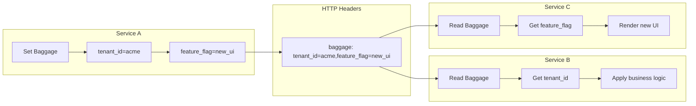
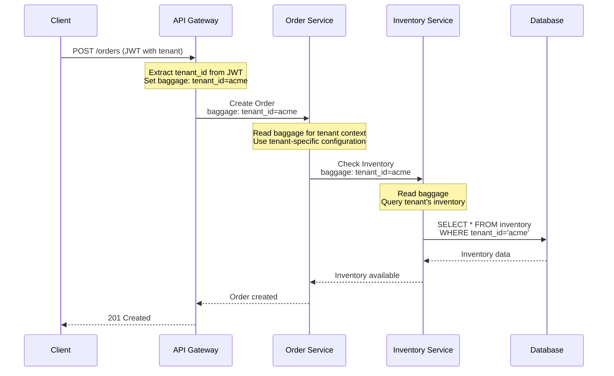
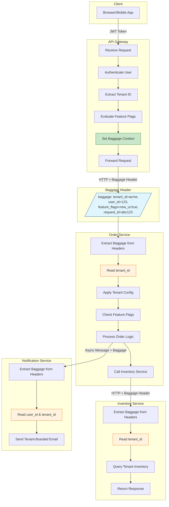

# How to Implement OpenTelemetry Baggage for Cross-Service Context Propagation

Author: [nawazdhandala](https://github.com/nawazdhandala)

Tags: OpenTelemetry, Observability, Baggage, Context Propagation, Distributed Systems, Microservices

Description: Learn how to use OpenTelemetry baggage to propagate business context across service boundaries.

---

In distributed systems, tracking requests as they flow through multiple services is essential for debugging, monitoring, and maintaining observability. While OpenTelemetry's tracing capabilities provide powerful request correlation, sometimes you need to propagate additional business context alongside your traces. This is where **OpenTelemetry Baggage** comes in.

Baggage allows you to attach key-value pairs to your context that automatically propagate across service boundaries. This guide will show you how to implement baggage effectively for cross-service context propagation.

## What is OpenTelemetry Baggage?

OpenTelemetry Baggage is a mechanism for propagating user-defined key-value pairs across service boundaries. Unlike trace context (which carries trace IDs and span IDs), baggage carries arbitrary business context that your application can use for:

- **Multi-tenant identification**: Propagate tenant IDs across all services
- **Feature flags**: Share feature flag states without additional lookups
- **Request metadata**: Pass user IDs, session IDs, or correlation IDs
- **A/B testing**: Propagate experiment variants for consistent behavior
- **Debugging**: Attach debug flags or request identifiers



## W3C Baggage Header Format

OpenTelemetry uses the W3C Baggage specification for propagating baggage across HTTP boundaries. Understanding this format is crucial for debugging and interoperability.

### Header Structure

The W3C Baggage header follows this format:

```
baggage: key1=value1,key2=value2;property1=propertyValue,key3=value3
```

### Format Rules

- **Key-value pairs** are separated by commas (`,`)
- **Keys and values** are separated by equals signs (`=`)
- **Properties** (metadata about a key-value pair) follow a semicolon (`;`)
- **Values** must be URL-encoded if they contain special characters
- **Maximum size** is typically 8KB (implementation-dependent)

Here is an example of a complete baggage header with multiple entries:

```http
GET /api/orders HTTP/1.1
Host: order-service.example.com
baggage: tenant_id=acme-corp,user_id=12345,feature_flags=new_checkout%3Btrue,request_priority=high;level=1
traceparent: 00-0af7651916cd43dd8448eb211c80319c-b7ad6b7169203331-01
```

The decoded baggage contains:
- `tenant_id`: "acme-corp"
- `user_id`: "12345"
- `feature_flags`: "new_checkout;true" (URL-decoded)
- `request_priority`: "high" with property `level=1`

## Setting Up OpenTelemetry with Baggage Support

Before working with baggage, you need to set up OpenTelemetry with proper propagation. Here is how to configure it in different languages.

### Node.js/TypeScript Setup

First, install the required OpenTelemetry packages for Node.js:

```bash
npm install @opentelemetry/api @opentelemetry/sdk-node @opentelemetry/auto-instrumentations-node
```

Now configure the OpenTelemetry SDK with baggage propagation enabled. The key is to include the W3CBaggagePropagator in your composite propagator:

```typescript
// tracing.ts - OpenTelemetry configuration with baggage support
import { NodeSDK } from '@opentelemetry/sdk-node';
import { getNodeAutoInstrumentations } from '@opentelemetry/auto-instrumentations-node';
import { OTLPTraceExporter } from '@opentelemetry/exporter-trace-otlp-http';
import {
  CompositePropagator,
  W3CTraceContextPropagator,
  W3CBaggagePropagator
} from '@opentelemetry/core';

// Create a composite propagator that handles both trace context and baggage
// This ensures both tracing information AND baggage are propagated across services
const propagator = new CompositePropagator({
  propagators: [
    // W3C Trace Context propagator handles the 'traceparent' and 'tracestate' headers
    new W3CTraceContextPropagator(),
    // W3C Baggage propagator handles the 'baggage' header
    new W3CBaggagePropagator(),
  ],
});

// Initialize the OpenTelemetry SDK with our custom propagator
const sdk = new NodeSDK({
  // Configure where traces are sent (e.g., Jaeger, Zipkin, or OTLP collector)
  traceExporter: new OTLPTraceExporter({
    url: 'http://localhost:4318/v1/traces',
  }),
  // Use the composite propagator for context propagation
  textMapPropagator: propagator,
  // Auto-instrument common libraries (Express, HTTP, etc.)
  instrumentations: [getNodeAutoInstrumentations()],
});

// Start the SDK - this must be called before any other OpenTelemetry operations
sdk.start();

// Graceful shutdown handler to ensure all telemetry is flushed on exit
process.on('SIGTERM', () => {
  sdk.shutdown()
    .then(() => console.log('OpenTelemetry SDK shut down successfully'))
    .catch((error) => console.error('Error shutting down SDK', error))
    .finally(() => process.exit(0));
});
```

### Python Setup

Install the OpenTelemetry packages for Python:

```bash
pip install opentelemetry-api opentelemetry-sdk opentelemetry-instrumentation-requests opentelemetry-exporter-otlp
```

Configure Python with baggage propagation. The setup is similar to Node.js but uses Python's SDK:

```python
# tracing.py - OpenTelemetry configuration with baggage support for Python
from opentelemetry import trace
from opentelemetry.sdk.trace import TracerProvider
from opentelemetry.sdk.trace.export import BatchSpanProcessor
from opentelemetry.exporter.otlp.proto.grpc.trace_exporter import OTLPSpanExporter
from opentelemetry.propagate import set_global_textmap
from opentelemetry.propagators.composite import CompositePropagator
from opentelemetry.trace.propagation.tracecontext import TraceContextTextMapPropagator
from opentelemetry.baggage.propagation import W3CBaggagePropagator

def configure_opentelemetry():
    """
    Configure OpenTelemetry with both trace context and baggage propagation.
    Call this function once at application startup, before any tracing occurs.
    """
    # Create and set the tracer provider - this manages all trace operations
    provider = TracerProvider()

    # Configure the OTLP exporter to send traces to your collector
    # Adjust the endpoint based on your infrastructure
    otlp_exporter = OTLPSpanExporter(
        endpoint="http://localhost:4317",
        insecure=True  # Set to False in production with proper TLS
    )

    # Use BatchSpanProcessor for better performance in production
    # It batches spans before sending, reducing network overhead
    provider.add_span_processor(BatchSpanProcessor(otlp_exporter))

    # Register the provider globally so all tracers use it
    trace.set_tracer_provider(provider)

    # Create a composite propagator that handles both trace context and baggage
    # This is critical for cross-service context propagation
    composite_propagator = CompositePropagator([
        TraceContextTextMapPropagator(),  # Handles traceparent header
        W3CBaggagePropagator(),           # Handles baggage header
    ])

    # Set the composite propagator globally
    # All instrumented libraries will now propagate both trace context and baggage
    set_global_textmap(composite_propagator)

    return trace.get_tracer(__name__)
```

### Go Setup

Install the required Go modules:

```bash
go get go.opentelemetry.io/otel
go get go.opentelemetry.io/otel/propagation
go get go.opentelemetry.io/otel/sdk/trace
go get go.opentelemetry.io/otel/exporters/otlp/otlptrace/otlptracehttp
```

Configure Go with baggage propagation:

```go
// tracing.go - OpenTelemetry configuration with baggage support for Go
package main

import (
    "context"
    "log"

    "go.opentelemetry.io/otel"
    "go.opentelemetry.io/otel/exporters/otlp/otlptrace/otlptracehttp"
    "go.opentelemetry.io/otel/propagation"
    "go.opentelemetry.io/otel/sdk/resource"
    sdktrace "go.opentelemetry.io/otel/sdk/trace"
    semconv "go.opentelemetry.io/otel/semconv/v1.21.0"
)

// InitTracer initializes the OpenTelemetry tracer with baggage propagation
// Returns a shutdown function that should be called when the application exits
func InitTracer(ctx context.Context, serviceName string) (func(context.Context) error, error) {
    // Create the OTLP trace exporter
    // This sends traces to an OpenTelemetry Collector or compatible backend
    exporter, err := otlptracehttp.New(ctx,
        otlptracehttp.WithEndpoint("localhost:4318"),
        otlptracehttp.WithInsecure(), // Remove in production
    )
    if err != nil {
        return nil, err
    }

    // Create a resource describing this service
    // Resources provide context about where telemetry comes from
    res, err := resource.Merge(
        resource.Default(),
        resource.NewWithAttributes(
            semconv.SchemaURL,
            semconv.ServiceName(serviceName),
        ),
    )
    if err != nil {
        return nil, err
    }

    // Create the tracer provider with our exporter and resource
    tracerProvider := sdktrace.NewTracerProvider(
        sdktrace.WithBatcher(exporter),
        sdktrace.WithResource(res),
    )

    // Register the tracer provider globally
    otel.SetTracerProvider(tracerProvider)

    // CRITICAL: Set up the composite text map propagator
    // This propagator handles BOTH trace context AND baggage headers
    // Without this, baggage will not be propagated across service boundaries
    otel.SetTextMapPropagator(propagation.NewCompositeTextMapPropagator(
        propagation.TraceContext{}, // Handles 'traceparent' and 'tracestate'
        propagation.Baggage{},      // Handles 'baggage' header
    ))

    // Return the shutdown function for graceful cleanup
    return tracerProvider.Shutdown, nil
}
```

## Working with the Baggage API

Now that OpenTelemetry is configured, let's explore how to create, read, and manipulate baggage.

### Creating and Setting Baggage (Node.js)

Here is how to create baggage entries and attach them to the current context in Node.js:

```typescript
// baggage-utils.ts - Utility functions for working with baggage
import {
  context,
  propagation,
  Context,
  BaggageEntry
} from '@opentelemetry/api';

/**
 * Creates a new context with the specified baggage entries.
 * This function doesn't modify the current context - it returns a new one.
 *
 * @param entries - Object containing key-value pairs to add as baggage
 * @param parentContext - Optional parent context (defaults to current active context)
 * @returns New context with baggage attached
 */
export function createBaggageContext(
  entries: Record<string, string>,
  parentContext?: Context
): Context {
  // Get the parent context or use the currently active context
  const ctx = parentContext ?? context.active();

  // Get any existing baggage from the context
  // This allows us to add to existing baggage rather than replacing it
  const existingBaggage = propagation.getBaggage(ctx);

  // Start with existing baggage or create a new empty baggage
  let baggage = existingBaggage ?? propagation.createBaggage();

  // Add each entry to the baggage
  // Note: setEntry returns a new Baggage instance (immutable pattern)
  for (const [key, value] of Object.entries(entries)) {
    baggage = baggage.setEntry(key, { value });
  }

  // Create and return a new context with the updated baggage
  return propagation.setBaggage(ctx, baggage);
}

/**
 * Retrieves a specific baggage value from the current context.
 * Returns undefined if the key doesn't exist.
 *
 * @param key - The baggage key to look up
 * @param ctx - Optional context (defaults to current active context)
 * @returns The baggage value or undefined
 */
export function getBaggageValue(key: string, ctx?: Context): string | undefined {
  const activeContext = ctx ?? context.active();
  const baggage = propagation.getBaggage(activeContext);

  if (!baggage) {
    return undefined;
  }

  const entry = baggage.getEntry(key);
  return entry?.value;
}

/**
 * Gets all baggage entries from the current context as a plain object.
 * Useful for logging or debugging.
 *
 * @param ctx - Optional context (defaults to current active context)
 * @returns Object containing all baggage key-value pairs
 */
export function getAllBaggage(ctx?: Context): Record<string, string> {
  const activeContext = ctx ?? context.active();
  const baggage = propagation.getBaggage(activeContext);

  if (!baggage) {
    return {};
  }

  const result: Record<string, string> = {};

  // Iterate over all baggage entries
  // getAllEntries returns an array of [key, BaggageEntry] tuples
  for (const [key, entry] of baggage.getAllEntries()) {
    result[key] = entry.value;
  }

  return result;
}
```

### Using Baggage in Express Middleware

Here is a practical example of setting baggage in an Express.js application. The middleware extracts tenant information and sets it as baggage for downstream services:

```typescript
// middleware/baggage.ts - Express middleware for baggage management
import { Request, Response, NextFunction } from 'express';
import { context, propagation, trace } from '@opentelemetry/api';
import { createBaggageContext, getBaggageValue } from './baggage-utils';

/**
 * Middleware that extracts tenant and user information from the request
 * and adds it to the OpenTelemetry baggage for propagation.
 *
 * This ensures all downstream service calls include this context.
 */
export function baggageMiddleware(
  req: Request,
  res: Response,
  next: NextFunction
): void {
  // Extract tenant ID from various sources (header, JWT, subdomain, etc.)
  // Priority: explicit header > JWT claim > subdomain
  const tenantId = extractTenantId(req);
  const userId = extractUserId(req);
  const requestId = req.headers['x-request-id'] as string || generateRequestId();

  // Build the baggage entries object
  // Only include values that are present to avoid empty baggage entries
  const baggageEntries: Record<string, string> = {};

  if (tenantId) {
    baggageEntries['tenant_id'] = tenantId;
  }
  if (userId) {
    baggageEntries['user_id'] = userId;
  }
  baggageEntries['request_id'] = requestId;

  // Get feature flags for this tenant/user (could be from a feature flag service)
  const featureFlags = getActiveFeatureFlags(tenantId, userId);
  if (featureFlags.length > 0) {
    // Encode feature flags as a comma-separated string
    baggageEntries['feature_flags'] = featureFlags.join(',');
  }

  // Create a new context with the baggage attached
  const newContext = createBaggageContext(baggageEntries);

  // Run the rest of the request handling within this new context
  // This ensures all spans and outgoing requests include the baggage
  context.with(newContext, () => {
    // Also add baggage values as span attributes for better trace correlation
    const span = trace.getActiveSpan();
    if (span) {
      span.setAttributes({
        'app.tenant_id': tenantId || 'unknown',
        'app.user_id': userId || 'anonymous',
        'app.request_id': requestId,
      });
    }

    next();
  });
}

/**
 * Middleware that reads baggage and makes it available on the request object.
 * Useful when you need to access baggage values in route handlers.
 */
export function baggageReaderMiddleware(
  req: Request,
  res: Response,
  next: NextFunction
): void {
  // Attach baggage values to the request for easy access in handlers
  (req as any).baggage = {
    tenantId: getBaggageValue('tenant_id'),
    userId: getBaggageValue('user_id'),
    requestId: getBaggageValue('request_id'),
    featureFlags: getBaggageValue('feature_flags')?.split(',') || [],
  };

  next();
}

// Helper functions (implement based on your auth system)
function extractTenantId(req: Request): string | undefined {
  // Check explicit header first
  if (req.headers['x-tenant-id']) {
    return req.headers['x-tenant-id'] as string;
  }
  // Could also extract from JWT, subdomain, etc.
  return undefined;
}

function extractUserId(req: Request): string | undefined {
  return req.headers['x-user-id'] as string;
}

function generateRequestId(): string {
  return `req_${Date.now()}_${Math.random().toString(36).substr(2, 9)}`;
}

function getActiveFeatureFlags(tenantId?: string, userId?: string): string[] {
  // Implement feature flag lookup logic
  return ['new_checkout', 'dark_mode'];
}
```

### Python Baggage Operations

Here is the equivalent Python code for working with baggage:

```python
# baggage_utils.py - Utility functions for working with baggage in Python
from opentelemetry import baggage, context, trace
from opentelemetry.baggage import set_baggage, get_baggage, get_all
from typing import Dict, Optional, Any
from functools import wraps

def set_baggage_entries(entries: Dict[str, str]) -> context.Context:
    """
    Creates a new context with multiple baggage entries.

    This function is useful when you need to set multiple baggage items
    at once, such as at the entry point of your application.

    Args:
        entries: Dictionary of key-value pairs to add as baggage

    Returns:
        A new context with the baggage entries attached
    """
    # Start with the current context
    ctx = context.get_current()

    # Add each entry to the context
    # Each call to set_baggage returns a new context with the entry added
    for key, value in entries.items():
        ctx = set_baggage(key, value, ctx)

    return ctx


def get_baggage_value(key: str) -> Optional[str]:
    """
    Retrieves a specific baggage value from the current context.

    Args:
        key: The baggage key to look up

    Returns:
        The value if found, None otherwise
    """
    return get_baggage(key)


def get_all_baggage() -> Dict[str, str]:
    """
    Gets all baggage entries from the current context.

    Returns:
        Dictionary of all baggage key-value pairs
    """
    return dict(get_all())


def with_baggage(entries: Dict[str, str]):
    """
    Decorator that wraps a function with baggage context.

    All code within the decorated function will have access to the
    specified baggage entries, and any outgoing requests will include them.

    Usage:
        @with_baggage({'tenant_id': 'acme', 'user_id': '123'})
        def process_order(order_id):
            # Baggage is available here and propagated to downstream calls
            pass
    """
    def decorator(func):
        @wraps(func)
        def wrapper(*args, **kwargs):
            # Create context with baggage
            ctx = set_baggage_entries(entries)

            # Attach the context and run the function
            token = context.attach(ctx)
            try:
                return func(*args, **kwargs)
            finally:
                # Always detach the context when done
                context.detach(token)
        return wrapper
    return decorator


# Example: Flask middleware for baggage
from flask import Flask, request, g

def create_baggage_middleware(app: Flask):
    """
    Creates Flask middleware that extracts request context and sets baggage.
    """

    @app.before_request
    def set_request_baggage():
        """
        Before each request, extract context and set baggage.
        This baggage will be propagated to all downstream service calls.
        """
        # Extract tenant and user information from the request
        tenant_id = request.headers.get('X-Tenant-ID')
        user_id = request.headers.get('X-User-ID')
        request_id = request.headers.get('X-Request-ID', generate_request_id())

        # Build baggage entries
        entries = {'request_id': request_id}
        if tenant_id:
            entries['tenant_id'] = tenant_id
        if user_id:
            entries['user_id'] = user_id

        # Create and attach the baggage context
        ctx = set_baggage_entries(entries)
        g.baggage_token = context.attach(ctx)

        # Also set span attributes for correlation
        span = trace.get_current_span()
        if span:
            span.set_attributes({
                'app.tenant_id': tenant_id or 'unknown',
                'app.user_id': user_id or 'anonymous',
                'app.request_id': request_id,
            })

    @app.teardown_request
    def cleanup_baggage_context(exception=None):
        """
        Clean up the baggage context after the request completes.
        """
        token = getattr(g, 'baggage_token', None)
        if token:
            context.detach(token)


def generate_request_id() -> str:
    """Generate a unique request ID."""
    import uuid
    return f"req_{uuid.uuid4().hex[:12]}"
```

### Go Baggage Operations

Here is the Go equivalent for baggage operations:

```go
// baggage_utils.go - Utility functions for working with baggage in Go
package baggage

import (
    "context"
    "net/http"

    "go.opentelemetry.io/otel"
    "go.opentelemetry.io/otel/baggage"
    "go.opentelemetry.io/otel/trace"
)

// SetBaggageEntries creates a new context with multiple baggage entries.
// This is useful when setting multiple values at the entry point of a request.
func SetBaggageEntries(ctx context.Context, entries map[string]string) (context.Context, error) {
    // Create baggage members from the entries map
    var members []baggage.Member
    for key, value := range entries {
        // Create a member for each entry
        // Members can also have properties, but we're using simple key-value pairs
        member, err := baggage.NewMember(key, value)
        if err != nil {
            return ctx, err
        }
        members = append(members, member)
    }

    // Create the baggage from the members
    bag, err := baggage.New(members...)
    if err != nil {
        return ctx, err
    }

    // Return a new context with the baggage attached
    return baggage.ContextWithBaggage(ctx, bag), nil
}

// GetBaggageValue retrieves a specific baggage value from the context.
// Returns an empty string if the key doesn't exist.
func GetBaggageValue(ctx context.Context, key string) string {
    bag := baggage.FromContext(ctx)
    member := bag.Member(key)
    return member.Value()
}

// GetAllBaggage returns all baggage entries from the context as a map.
func GetAllBaggage(ctx context.Context) map[string]string {
    result := make(map[string]string)
    bag := baggage.FromContext(ctx)

    // Iterate over all members in the baggage
    for _, member := range bag.Members() {
        result[member.Key()] = member.Value()
    }

    return result
}

// BaggageMiddleware is an HTTP middleware that extracts context from requests
// and sets baggage entries for propagation to downstream services.
func BaggageMiddleware(next http.Handler) http.Handler {
    return http.HandlerFunc(func(w http.ResponseWriter, r *http.Request) {
        ctx := r.Context()

        // Extract the propagated context (including any incoming baggage)
        // This uses the globally registered propagator
        ctx = otel.GetTextMapPropagator().Extract(ctx, propagation.HeaderCarrier(r.Header))

        // Extract tenant and user information from headers
        tenantID := r.Header.Get("X-Tenant-ID")
        userID := r.Header.Get("X-User-ID")
        requestID := r.Header.Get("X-Request-ID")
        if requestID == "" {
            requestID = generateRequestID()
        }

        // Build baggage entries
        entries := map[string]string{
            "request_id": requestID,
        }
        if tenantID != "" {
            entries["tenant_id"] = tenantID
        }
        if userID != "" {
            entries["user_id"] = userID
        }

        // Add baggage to context
        ctx, err := SetBaggageEntries(ctx, entries)
        if err != nil {
            // Log the error but continue processing
            // Baggage is not critical enough to fail the request
            log.Printf("Failed to set baggage: %v", err)
        }

        // Add baggage values as span attributes for correlation
        span := trace.SpanFromContext(ctx)
        if span.IsRecording() {
            span.SetAttributes(
                attribute.String("app.tenant_id", tenantID),
                attribute.String("app.user_id", userID),
                attribute.String("app.request_id", requestID),
            )
        }

        // Continue with the updated context
        next.ServeHTTP(w, r.WithContext(ctx))
    })
}
```

## Practical Use Cases

Let's explore some real-world scenarios where baggage shines.

### Use Case 1: Multi-Tenant Context Propagation

In a multi-tenant SaaS application, you need to ensure that the tenant context is available in every service for proper data isolation and logging.



Here is a complete implementation for tenant context propagation:

```typescript
// services/tenant-context.ts - Multi-tenant context management
import { context, propagation } from '@opentelemetry/api';
import axios, { AxiosInstance } from 'axios';

/**
 * TenantContext manages tenant-specific configuration and ensures
 * tenant context is propagated across all service calls.
 */
export class TenantContext {
  private static TENANT_ID_KEY = 'tenant_id';
  private static TENANT_TIER_KEY = 'tenant_tier';

  /**
   * Creates a context with tenant information.
   * Call this at the entry point of your application (e.g., API gateway).
   */
  static setTenantContext(tenantId: string, tenantTier: string = 'standard'): void {
    const baggage = propagation.createBaggage({
      [this.TENANT_ID_KEY]: { value: tenantId },
      [this.TENANT_TIER_KEY]: { value: tenantTier },
    });

    const newContext = propagation.setBaggage(context.active(), baggage);
    // Note: You need to use context.with() to run code within this context
  }

  /**
   * Gets the current tenant ID from baggage.
   * This works anywhere in the call chain where baggage has been set.
   */
  static getTenantId(): string | undefined {
    const baggage = propagation.getBaggage(context.active());
    return baggage?.getEntry(this.TENANT_ID_KEY)?.value;
  }

  /**
   * Gets the tenant tier for feature gating and rate limiting.
   */
  static getTenantTier(): string {
    const baggage = propagation.getBaggage(context.active());
    return baggage?.getEntry(this.TENANT_TIER_KEY)?.value ?? 'standard';
  }

  /**
   * Creates an Axios instance that automatically propagates tenant context.
   * Use this for all inter-service HTTP calls.
   */
  static createHttpClient(baseURL: string): AxiosInstance {
    const client = axios.create({ baseURL });

    // Add interceptor to inject baggage headers into outgoing requests
    client.interceptors.request.use((config) => {
      const headers: Record<string, string> = {};

      // Use OpenTelemetry's propagator to inject context into headers
      // This automatically handles both trace context and baggage
      propagation.inject(context.active(), headers);

      // Merge the propagated headers with existing headers
      config.headers = {
        ...config.headers,
        ...headers,
      };

      return config;
    });

    return client;
  }
}

// Example usage in a service
export class OrderService {
  private inventoryClient: AxiosInstance;
  private paymentClient: AxiosInstance;

  constructor() {
    // Create HTTP clients that automatically propagate baggage
    this.inventoryClient = TenantContext.createHttpClient('http://inventory-service');
    this.paymentClient = TenantContext.createHttpClient('http://payment-service');
  }

  async createOrder(orderData: any): Promise<any> {
    // Get tenant context from baggage - no need to pass it explicitly!
    const tenantId = TenantContext.getTenantId();
    const tenantTier = TenantContext.getTenantTier();

    if (!tenantId) {
      throw new Error('Tenant context not found in baggage');
    }

    // Apply tenant-specific business rules
    const maxOrderValue = this.getMaxOrderValue(tenantTier);
    if (orderData.total > maxOrderValue) {
      throw new Error(`Order exceeds maximum value for ${tenantTier} tier`);
    }

    // Check inventory - baggage is automatically propagated
    const inventory = await this.inventoryClient.post('/check', {
      items: orderData.items,
      // Note: We don't need to pass tenantId - it's in the baggage!
    });

    // Process payment - baggage is automatically propagated
    const payment = await this.paymentClient.post('/charge', {
      amount: orderData.total,
      // Tenant context travels with the request via baggage
    });

    return { orderId: 'order_123', status: 'created' };
  }

  private getMaxOrderValue(tier: string): number {
    const limits: Record<string, number> = {
      'enterprise': 1000000,
      'professional': 100000,
      'standard': 10000,
    };
    return limits[tier] ?? limits['standard'];
  }
}
```

### Use Case 2: Feature Flag Propagation

Propagate feature flag states across services to ensure consistent behavior throughout a request:

```typescript
// services/feature-flags.ts - Feature flag management with baggage
import { context, propagation } from '@opentelemetry/api';

/**
 * FeatureFlags manages feature flag state and propagates it via baggage.
 * This ensures all services see the same feature flag state for a request.
 */
export class FeatureFlags {
  private static FLAGS_KEY = 'feature_flags';

  /**
   * Encodes feature flags as a baggage-safe string.
   * Format: flag1:true,flag2:false,flag3:variant_a
   */
  private static encodeFlags(flags: Record<string, string | boolean>): string {
    return Object.entries(flags)
      .map(([key, value]) => `${key}:${value}`)
      .join(',');
  }

  /**
   * Decodes feature flags from baggage string format.
   */
  private static decodeFlags(encoded: string): Record<string, string> {
    const flags: Record<string, string> = {};
    if (!encoded) return flags;

    for (const pair of encoded.split(',')) {
      const [key, value] = pair.split(':');
      if (key && value !== undefined) {
        flags[key] = value;
      }
    }
    return flags;
  }

  /**
   * Evaluates feature flags for the current request and stores them in baggage.
   * Call this once at the entry point (e.g., API gateway).
   *
   * @param userId - User ID for user-targeted flags
   * @param tenantId - Tenant ID for tenant-targeted flags
   */
  static async evaluateAndSetFlags(
    userId?: string,
    tenantId?: string
  ): Promise<Record<string, string>> {
    // Evaluate flags based on user/tenant context
    // In production, this would call your feature flag service (LaunchDarkly, etc.)
    const flags = await this.evaluateFlags(userId, tenantId);

    // Encode and store in baggage
    const encoded = this.encodeFlags(flags);

    const currentBaggage = propagation.getBaggage(context.active());
    const newBaggage = (currentBaggage ?? propagation.createBaggage())
      .setEntry(this.FLAGS_KEY, { value: encoded });

    propagation.setBaggage(context.active(), newBaggage);

    return flags;
  }

  /**
   * Gets all feature flags from the current context.
   * Use this in any service to get consistent flag values.
   */
  static getFlags(): Record<string, string> {
    const baggage = propagation.getBaggage(context.active());
    const encoded = baggage?.getEntry(this.FLAGS_KEY)?.value;
    return this.decodeFlags(encoded ?? '');
  }

  /**
   * Checks if a specific feature is enabled.
   * Returns false if the flag doesn't exist.
   */
  static isEnabled(flagName: string): boolean {
    const flags = this.getFlags();
    return flags[flagName] === 'true';
  }

  /**
   * Gets the variant for an A/B test flag.
   */
  static getVariant(flagName: string): string | undefined {
    const flags = this.getFlags();
    return flags[flagName];
  }

  // Mock implementation - replace with your feature flag service
  private static async evaluateFlags(
    userId?: string,
    tenantId?: string
  ): Promise<Record<string, string | boolean>> {
    return {
      'new_checkout_flow': true,
      'dark_mode': false,
      'pricing_experiment': 'variant_b',
      'beta_features': tenantId === 'enterprise' ? 'true' : 'false',
    };
  }
}

// Example: Using feature flags in different services

// In the API Gateway / Entry point
async function handleRequest(req: Request) {
  const userId = extractUserId(req);
  const tenantId = extractTenantId(req);

  // Evaluate flags once at entry and propagate via baggage
  await FeatureFlags.evaluateAndSetFlags(userId, tenantId);

  // Continue processing...
}

// In the Checkout Service (downstream)
async function processCheckout(cart: Cart) {
  // No need to call the feature flag service again!
  // The flag state is already in the baggage
  if (FeatureFlags.isEnabled('new_checkout_flow')) {
    return newCheckoutProcess(cart);
  } else {
    return legacyCheckoutProcess(cart);
  }
}

// In the Pricing Service (another downstream service)
async function calculatePrice(items: Item[]) {
  const variant = FeatureFlags.getVariant('pricing_experiment');

  switch (variant) {
    case 'variant_a':
      return calculateWithDiscounts(items);
    case 'variant_b':
      return calculateWithDynamicPricing(items);
    default:
      return calculateStandardPrice(items);
  }
}
```

### Use Case 3: Debug Context Propagation

Enable request-level debugging across all services:

```typescript
// services/debug-context.ts - Debug context management
import { context, propagation, trace } from '@opentelemetry/api';

interface DebugOptions {
  // Enable verbose logging across all services
  verboseLogging: boolean;
  // Capture full request/response bodies
  capturePayloads: boolean;
  // Override log level for this request
  logLevel: 'debug' | 'info' | 'warn' | 'error';
  // Trace sampling decision override
  forceSample: boolean;
}

/**
 * DebugContext allows operators to enable debugging for specific requests.
 * The debug state propagates across all services via baggage.
 */
export class DebugContext {
  private static DEBUG_KEY = 'debug_context';

  /**
   * Encodes debug options as a URL-safe string for baggage.
   */
  private static encodeOptions(options: Partial<DebugOptions>): string {
    // Use a compact encoding: v=1,p=1,l=debug,s=1
    const parts: string[] = [];
    if (options.verboseLogging) parts.push('v=1');
    if (options.capturePayloads) parts.push('p=1');
    if (options.logLevel) parts.push(`l=${options.logLevel}`);
    if (options.forceSample) parts.push('s=1');
    return parts.join(',');
  }

  /**
   * Decodes debug options from baggage.
   */
  private static decodeOptions(encoded: string): DebugOptions {
    const options: DebugOptions = {
      verboseLogging: false,
      capturePayloads: false,
      logLevel: 'info',
      forceSample: false,
    };

    if (!encoded) return options;

    for (const part of encoded.split(',')) {
      const [key, value] = part.split('=');
      switch (key) {
        case 'v': options.verboseLogging = value === '1'; break;
        case 'p': options.capturePayloads = value === '1'; break;
        case 'l': options.logLevel = value as any; break;
        case 's': options.forceSample = value === '1'; break;
      }
    }

    return options;
  }

  /**
   * Enables debug mode for the current request.
   * Call this based on a debug header or query parameter.
   */
  static enableDebug(options: Partial<DebugOptions>): void {
    const encoded = this.encodeOptions(options);

    const currentBaggage = propagation.getBaggage(context.active());
    const newBaggage = (currentBaggage ?? propagation.createBaggage())
      .setEntry(this.DEBUG_KEY, { value: encoded });

    propagation.setBaggage(context.active(), newBaggage);

    // Also add to span for visibility in traces
    const span = trace.getActiveSpan();
    if (span) {
      span.setAttribute('debug.enabled', true);
      span.setAttribute('debug.options', encoded);
    }
  }

  /**
   * Gets the current debug options from baggage.
   */
  static getOptions(): DebugOptions {
    const baggage = propagation.getBaggage(context.active());
    const encoded = baggage?.getEntry(this.DEBUG_KEY)?.value;
    return this.decodeOptions(encoded ?? '');
  }

  /**
   * Checks if debug mode is enabled for any option.
   */
  static isDebugEnabled(): boolean {
    const options = this.getOptions();
    return options.verboseLogging || options.capturePayloads || options.forceSample;
  }

  /**
   * Creates a debug-aware logger that respects baggage debug settings.
   */
  static createLogger(serviceName: string) {
    return {
      debug: (message: string, data?: any) => {
        const options = DebugContext.getOptions();
        if (options.verboseLogging || options.logLevel === 'debug') {
          console.log(JSON.stringify({
            level: 'debug',
            service: serviceName,
            message,
            data: options.capturePayloads ? data : undefined,
            timestamp: new Date().toISOString(),
          }));
        }
      },
      info: (message: string, data?: any) => {
        const options = DebugContext.getOptions();
        if (['debug', 'info'].includes(options.logLevel)) {
          console.log(JSON.stringify({
            level: 'info',
            service: serviceName,
            message,
            data: options.capturePayloads ? data : undefined,
            timestamp: new Date().toISOString(),
          }));
        }
      },
      error: (message: string, error?: Error, data?: any) => {
        const options = DebugContext.getOptions();
        console.error(JSON.stringify({
          level: 'error',
          service: serviceName,
          message,
          error: error?.message,
          stack: options.verboseLogging ? error?.stack : undefined,
          data: options.capturePayloads ? data : undefined,
          timestamp: new Date().toISOString(),
        }));
      },
    };
  }
}

// Middleware to enable debug mode from headers
export function debugMiddleware(req: Request, res: Response, next: NextFunction) {
  const debugHeader = req.headers['x-debug-mode'];

  if (debugHeader) {
    // Parse debug options from header
    // Format: X-Debug-Mode: verbose,capture,level=debug
    const options: Partial<DebugOptions> = {};

    for (const part of String(debugHeader).split(',')) {
      if (part === 'verbose') options.verboseLogging = true;
      if (part === 'capture') options.capturePayloads = true;
      if (part === 'sample') options.forceSample = true;
      if (part.startsWith('level=')) {
        options.logLevel = part.split('=')[1] as any;
      }
    }

    DebugContext.enableDebug(options);
  }

  next();
}
```

## Baggage Context Flow Diagram

Here is a comprehensive view of how baggage flows through a distributed system:



## Security Considerations

Baggage propagation comes with important security considerations that you must address.

### 1. Sensitive Data Exposure

**Risk**: Baggage travels in HTTP headers, which can be logged, cached, or exposed.

**Mitigation**: Never put sensitive data directly in baggage:

```typescript
// security/baggage-security.ts - Secure baggage handling

// BAD: Don't put sensitive data in baggage
const badBaggage = {
  'user_password': 'secret123',        // NEVER do this!
  'api_key': 'sk_live_abc123',         // NEVER do this!
  'credit_card': '4111111111111111',   // NEVER do this!
  'ssn': '123-45-6789',                // NEVER do this!
};

// GOOD: Use non-sensitive identifiers that can be resolved server-side
const goodBaggage = {
  'user_id': 'usr_abc123',             // ID only, resolve details server-side
  'tenant_id': 'tenant_xyz',           // Tenant identifier
  'session_id': 'sess_def456',         // Session reference
  'request_id': 'req_789xyz',          // Correlation ID
};

/**
 * Validates baggage entries before setting them.
 * Rejects any entries that might contain sensitive data.
 */
export function validateBaggageEntries(
  entries: Record<string, string>
): Record<string, string> {
  const sensitivePatterns = [
    /password/i,
    /secret/i,
    /api[_-]?key/i,
    /token/i,
    /credential/i,
    /credit[_-]?card/i,
    /ssn/i,
    /social[_-]?security/i,
  ];

  const validated: Record<string, string> = {};

  for (const [key, value] of Object.entries(entries)) {
    // Check if key name suggests sensitive data
    const isSensitiveKey = sensitivePatterns.some(pattern => pattern.test(key));
    if (isSensitiveKey) {
      console.warn(`Rejecting potentially sensitive baggage key: ${key}`);
      continue;
    }

    // Check if value looks like sensitive data
    const isSensitiveValue =
      // Looks like a JWT
      /^eyJ[a-zA-Z0-9_-]+\.eyJ[a-zA-Z0-9_-]+\.[a-zA-Z0-9_-]+$/.test(value) ||
      // Looks like a credit card
      /^\d{13,19}$/.test(value) ||
      // Looks like an API key
      /^(sk_|pk_|api_)[a-zA-Z0-9]+$/.test(value);

    if (isSensitiveValue) {
      console.warn(`Rejecting potentially sensitive baggage value for key: ${key}`);
      continue;
    }

    validated[key] = value;
  }

  return validated;
}
```

### 2. Baggage Size Limits

**Risk**: Unbounded baggage can cause request failures or performance issues.

**Mitigation**: Enforce size limits on baggage:

```typescript
// security/baggage-limits.ts - Baggage size enforcement

/**
 * Maximum total size of baggage header in bytes.
 * Most HTTP servers have header size limits (8KB is common).
 * We use a conservative limit to leave room for other headers.
 */
const MAX_BAGGAGE_SIZE_BYTES = 4096;

/**
 * Maximum number of baggage entries.
 * Prevents abuse through many small entries.
 */
const MAX_BAGGAGE_ENTRIES = 64;

/**
 * Maximum length of a single baggage value.
 */
const MAX_VALUE_LENGTH = 256;

/**
 * Validates and potentially truncates baggage to fit within limits.
 */
export function enforceBaggageLimits(
  entries: Record<string, string>
): Record<string, string> {
  const result: Record<string, string> = {};
  let totalSize = 0;
  let entryCount = 0;

  for (const [key, value] of Object.entries(entries)) {
    // Check entry count limit
    if (entryCount >= MAX_BAGGAGE_ENTRIES) {
      console.warn(`Baggage entry limit reached, dropping: ${key}`);
      continue;
    }

    // Truncate long values
    let truncatedValue = value;
    if (value.length > MAX_VALUE_LENGTH) {
      truncatedValue = value.substring(0, MAX_VALUE_LENGTH);
      console.warn(`Truncated baggage value for key: ${key}`);
    }

    // Calculate size (key=value, format)
    const entrySize = key.length + 1 + truncatedValue.length + 1; // +1 for = and ,

    // Check total size limit
    if (totalSize + entrySize > MAX_BAGGAGE_SIZE_BYTES) {
      console.warn(`Baggage size limit reached, dropping: ${key}`);
      continue;
    }

    result[key] = truncatedValue;
    totalSize += entrySize;
    entryCount++;
  }

  return result;
}
```

### 3. Baggage Injection Attacks

**Risk**: Malicious clients could inject arbitrary baggage to manipulate service behavior.

**Mitigation**: Validate incoming baggage and use allowlists:

```typescript
// security/baggage-validation.ts - Baggage validation and sanitization

/**
 * Allowlist of baggage keys that can be set by clients.
 * Any other keys from incoming requests are stripped.
 */
const CLIENT_ALLOWED_KEYS = new Set([
  'request_id',
  'client_version',
  'device_type',
]);

/**
 * Keys that can only be set by internal services.
 * These are stripped from incoming external requests.
 */
const INTERNAL_ONLY_KEYS = new Set([
  'tenant_id',
  'user_id',
  'feature_flags',
  'debug_context',
  'auth_level',
]);

/**
 * Validates and sanitizes incoming baggage from external requests.
 * Strips unauthorized keys and validates values.
 */
export function sanitizeIncomingBaggage(
  baggage: Record<string, string>,
  isExternalRequest: boolean
): Record<string, string> {
  const sanitized: Record<string, string> = {};

  for (const [key, value] of Object.entries(baggage)) {
    // For external requests, only allow specific keys
    if (isExternalRequest) {
      if (!CLIENT_ALLOWED_KEYS.has(key)) {
        console.warn(`Stripping unauthorized baggage key from external request: ${key}`);
        continue;
      }
    }

    // Validate the key format (alphanumeric and underscores only)
    if (!/^[a-zA-Z][a-zA-Z0-9_]*$/.test(key)) {
      console.warn(`Invalid baggage key format: ${key}`);
      continue;
    }

    // Sanitize the value (URL decode and validate)
    let sanitizedValue: string;
    try {
      sanitizedValue = decodeURIComponent(value);
    } catch {
      console.warn(`Failed to decode baggage value for key: ${key}`);
      continue;
    }

    // Check for potential injection patterns
    if (containsInjectionPatterns(sanitizedValue)) {
      console.warn(`Potential injection detected in baggage value for key: ${key}`);
      continue;
    }

    sanitized[key] = sanitizedValue;
  }

  return sanitized;
}

/**
 * Checks if a value contains potential injection patterns.
 */
function containsInjectionPatterns(value: string): boolean {
  const patterns = [
    /<script/i,           // XSS
    /javascript:/i,       // XSS
    /\$\{/,               // Template injection
    /\{\{/,               // Template injection
    /;.*--/,              // SQL injection
    /UNION\s+SELECT/i,    // SQL injection
  ];

  return patterns.some(pattern => pattern.test(value));
}

/**
 * Middleware that validates incoming baggage.
 */
export function baggageValidationMiddleware(
  req: Request,
  res: Response,
  next: NextFunction
): void {
  const isExternalRequest = !req.headers['x-internal-service'];

  // Get baggage from the propagated context
  const baggage = propagation.getBaggage(context.active());

  if (baggage) {
    const entries: Record<string, string> = {};
    for (const [key, entry] of baggage.getAllEntries()) {
      entries[key] = entry.value;
    }

    // Sanitize the baggage
    const sanitized = sanitizeIncomingBaggage(entries, isExternalRequest);

    // Create new baggage with only sanitized entries
    let newBaggage = propagation.createBaggage();
    for (const [key, value] of Object.entries(sanitized)) {
      newBaggage = newBaggage.setEntry(key, { value });
    }

    // Replace the context with sanitized baggage
    const newContext = propagation.setBaggage(context.active(), newBaggage);
    context.with(newContext, () => next());
  } else {
    next();
  }
}
```

### 4. Baggage Logging Best Practices

When logging baggage, be careful about what you expose:

```typescript
// security/baggage-logging.ts - Safe baggage logging

/**
 * Keys that should never be logged, even partially.
 */
const NEVER_LOG_KEYS = new Set([
  'session_id',
  'auth_token',
]);

/**
 * Keys that should be partially masked when logged.
 */
const MASK_KEYS = new Set([
  'user_id',
  'tenant_id',
]);

/**
 * Prepares baggage for safe logging.
 */
export function prepareBaggageForLogging(
  baggage: Record<string, string>
): Record<string, string> {
  const loggable: Record<string, string> = {};

  for (const [key, value] of Object.entries(baggage)) {
    if (NEVER_LOG_KEYS.has(key)) {
      loggable[key] = '[REDACTED]';
    } else if (MASK_KEYS.has(key)) {
      // Show first and last 2 characters only
      if (value.length > 4) {
        loggable[key] = `${value.slice(0, 2)}...${value.slice(-2)}`;
      } else {
        loggable[key] = '[MASKED]';
      }
    } else {
      loggable[key] = value;
    }
  }

  return loggable;
}

// Usage in logging
const logger = {
  info: (message: string) => {
    const baggage = getAllBaggage();
    const safeBaggage = prepareBaggageForLogging(baggage);

    console.log(JSON.stringify({
      message,
      baggage: safeBaggage,
      timestamp: new Date().toISOString(),
    }));
  },
};
```

## Best Practices Summary

Here are the key best practices for using OpenTelemetry baggage effectively:

### Do's

1. **Use baggage for cross-cutting concerns**: Tenant ID, request ID, feature flags, debug flags
2. **Set baggage early**: Configure baggage at the entry point (API gateway, edge service)
3. **Validate all baggage**: Sanitize incoming baggage and enforce allowlists
4. **Keep values small**: Use IDs and references, not full objects
5. **Add baggage to spans**: Copy important baggage values to span attributes for searchability
6. **Use consistent key names**: Establish naming conventions across your organization
7. **Document your baggage schema**: Make it clear what baggage keys are expected

### Don'ts

1. **Don't store sensitive data**: No passwords, tokens, PII, or secrets
2. **Don't exceed size limits**: Keep total baggage under 4KB
3. **Don't use baggage for service data**: Use proper API calls for business data
4. **Don't trust external baggage**: Always validate and sanitize
5. **Don't create circular dependencies**: Baggage should flow downstream only
6. **Don't overuse baggage**: It's not a replacement for proper service design

## Troubleshooting Common Issues

### Baggage Not Propagating

If baggage isn't reaching downstream services, check:

```typescript
// Debug baggage propagation issues
export function debugBaggagePropagation(req: Request, res: Response): void {
  // 1. Check if baggage header is present
  console.log('Baggage header:', req.headers['baggage']);

  // 2. Check if propagator is configured
  const propagator = propagation.getTextMapPropagator();
  console.log('Propagator type:', propagator.constructor.name);

  // 3. Check current context baggage
  const baggage = propagation.getBaggage(context.active());
  if (baggage) {
    console.log('Current baggage entries:');
    for (const [key, entry] of baggage.getAllEntries()) {
      console.log(`  ${key}: ${entry.value}`);
    }
  } else {
    console.log('No baggage in current context');
  }

  // 4. Test injection
  const headers: Record<string, string> = {};
  propagation.inject(context.active(), headers);
  console.log('Injected headers:', headers);
}
```

### Baggage Size Issues

Monitor baggage size to prevent issues:

```typescript
// Monitor baggage size
export function monitorBaggageSize(): void {
  const baggage = propagation.getBaggage(context.active());
  if (!baggage) return;

  let totalSize = 0;
  const entries: string[] = [];

  for (const [key, entry] of baggage.getAllEntries()) {
    const entrySize = key.length + entry.value.length + 1;
    totalSize += entrySize;
    entries.push(`${key}=${entry.value.length}bytes`);
  }

  if (totalSize > 3000) {
    console.warn(`Large baggage detected: ${totalSize} bytes`, entries);
  }
}
```

## Conclusion

OpenTelemetry Baggage is a powerful mechanism for propagating business context across service boundaries. When implemented correctly, it enables:

- **Simplified multi-tenancy**: Tenant context travels automatically with requests
- **Consistent feature flags**: All services see the same feature state
- **Enhanced debugging**: Request-level debug flags propagate everywhere
- **Better observability**: Correlation IDs and metadata flow through your system

Remember to:
- Configure both trace context and baggage propagators
- Validate and sanitize all baggage data
- Never store sensitive information in baggage
- Monitor baggage size to prevent performance issues
- Document your baggage schema for team alignment

By following the patterns and practices in this guide, you can leverage OpenTelemetry Baggage to build more observable and maintainable distributed systems.

## Further Reading

- [W3C Baggage Specification](https://www.w3.org/TR/baggage/)
- [OpenTelemetry Baggage API Documentation](https://opentelemetry.io/docs/concepts/signals/baggage/)
- [OpenTelemetry Context Propagation](https://opentelemetry.io/docs/concepts/context-propagation/)
- [OpenTelemetry SDK Configuration](https://opentelemetry.io/docs/instrumentation/)
