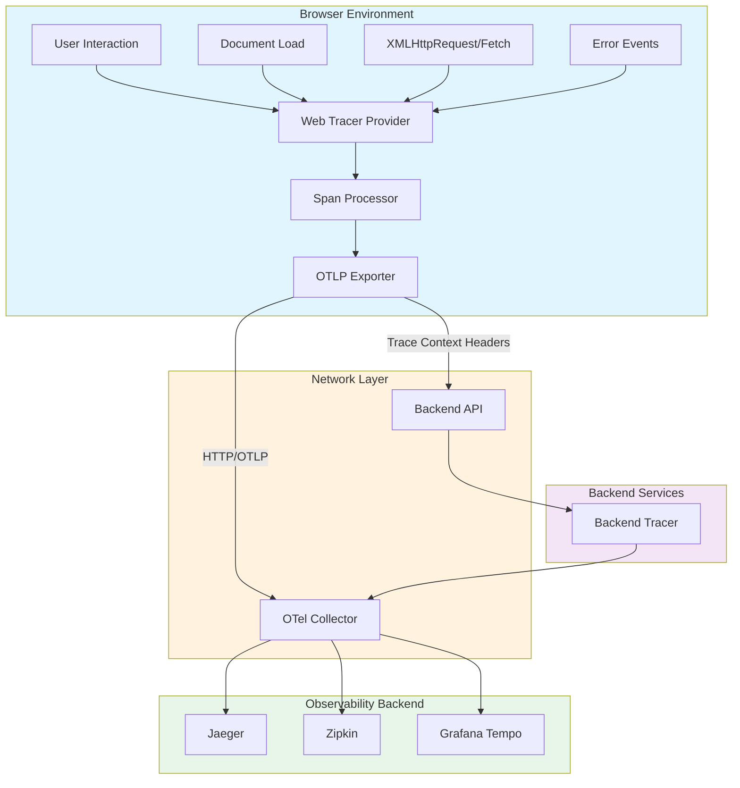
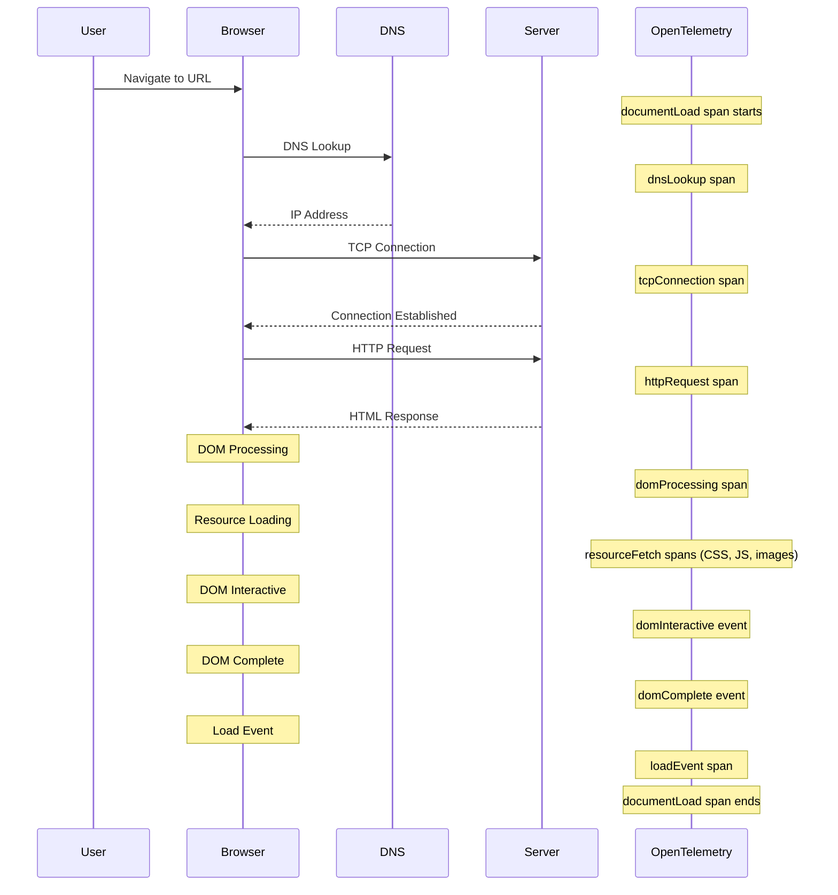
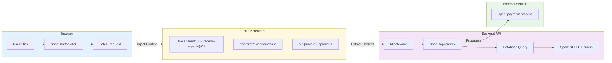
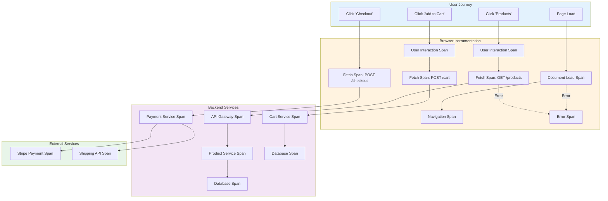

# How to Implement OpenTelemetry Browser Instrumentation for Frontend Observability

Author: [nawazdhandala](https://github.com/nawazdhandala)

Tags: OpenTelemetry, Observability, Frontend, JavaScript, Browser, Web Performance

Description: Learn how to add OpenTelemetry instrumentation to browser applications for end-to-end observability.

---

Frontend observability has become a critical component of modern application monitoring. While backend tracing has been well-established for years, the ability to trace user interactions from the browser through to backend services provides invaluable insights into the complete user experience. OpenTelemetry's browser instrumentation bridges this gap, offering a standardized way to capture frontend telemetry data.

In this comprehensive guide, we'll walk through implementing OpenTelemetry browser instrumentation from scratch, covering everything from basic setup to advanced trace propagation patterns.

## Understanding Browser Tracing Architecture

Before diving into the implementation, let's understand how browser tracing fits into the overall observability picture.

The following diagram illustrates how traces flow from the browser through your infrastructure:



## Prerequisites

Before we begin, ensure you have the following:

- Node.js 16+ and npm/yarn installed
- A modern JavaScript/TypeScript project (React, Vue, Angular, or vanilla JS)
- An OpenTelemetry Collector or compatible backend (Jaeger, Zipkin, etc.)
- Basic understanding of observability concepts (traces, spans, context propagation)

## Installing OpenTelemetry Browser Packages

First, we need to install the necessary OpenTelemetry packages. The browser SDK is modular, allowing you to include only the instrumentation you need.

Run the following command to install the core packages and common instrumentations:

```bash
npm install @opentelemetry/api \
  @opentelemetry/sdk-trace-web \
  @opentelemetry/resources \
  @opentelemetry/semantic-conventions \
  @opentelemetry/exporter-trace-otlp-http \
  @opentelemetry/instrumentation-document-load \
  @opentelemetry/instrumentation-user-interaction \
  @opentelemetry/instrumentation-fetch \
  @opentelemetry/instrumentation-xml-http-request \
  @opentelemetry/context-zone \
  @opentelemetry/propagator-b3
```

## Basic Tracer Configuration

Let's start by creating a comprehensive tracer configuration. This setup initializes the OpenTelemetry SDK with all the necessary components for browser tracing.

Create a new file called `tracing.ts` (or `tracing.js` for vanilla JavaScript):

```typescript
// tracing.ts
// This file configures the OpenTelemetry SDK for browser-based tracing.
// It should be imported and initialized at the very start of your application,
// before any other code runs, to ensure all operations are traced.

import { WebTracerProvider } from '@opentelemetry/sdk-trace-web';
import { BatchSpanProcessor, SimpleSpanProcessor } from '@opentelemetry/sdk-trace-base';
import { OTLPTraceExporter } from '@opentelemetry/exporter-trace-otlp-http';
import { Resource } from '@opentelemetry/resources';
import {
  SEMRESATTRS_SERVICE_NAME,
  SEMRESATTRS_SERVICE_VERSION,
  SEMRESATTRS_DEPLOYMENT_ENVIRONMENT
} from '@opentelemetry/semantic-conventions';
import { ZoneContextManager } from '@opentelemetry/context-zone';
import { registerInstrumentations } from '@opentelemetry/instrumentation';
import { DocumentLoadInstrumentation } from '@opentelemetry/instrumentation-document-load';
import { UserInteractionInstrumentation } from '@opentelemetry/instrumentation-user-interaction';
import { FetchInstrumentation } from '@opentelemetry/instrumentation-fetch';
import { XMLHttpRequestInstrumentation } from '@opentelemetry/instrumentation-xml-http-request';
import { W3CTraceContextPropagator } from '@opentelemetry/core';
import { B3Propagator } from '@opentelemetry/propagator-b3';
import { CompositePropagator } from '@opentelemetry/core';

// Define the configuration interface for type safety.
// This allows consumers to customize the tracer setup.
interface TracingConfig {
  serviceName: string;
  serviceVersion: string;
  environment: string;
  collectorUrl: string;
  // Optional: Enable debug mode to log spans to console
  debug?: boolean;
  // Optional: Sample rate between 0 and 1 (1 = 100% sampling)
  sampleRate?: number;
}

// Initialize and configure the OpenTelemetry tracer.
// This function should be called once at application startup.
export function initializeTracing(config: TracingConfig): WebTracerProvider {
  // Create a Resource that identifies your application.
  // Resources provide metadata that is attached to all telemetry data.
  const resource = new Resource({
    [SEMRESATTRS_SERVICE_NAME]: config.serviceName,
    [SEMRESATTRS_SERVICE_VERSION]: config.serviceVersion,
    [SEMRESATTRS_DEPLOYMENT_ENVIRONMENT]: config.environment,
    // Add custom attributes to help identify browser sessions
    'browser.user_agent': navigator.userAgent,
    'browser.language': navigator.language,
    'browser.platform': navigator.platform,
  });

  // Configure the OTLP exporter to send traces to your collector.
  // The collector URL should point to your OpenTelemetry Collector's HTTP endpoint.
  const exporter = new OTLPTraceExporter({
    url: config.collectorUrl,
    // Include custom headers if your collector requires authentication
    headers: {
      // Add authentication headers if needed
      // 'Authorization': 'Bearer your-token-here'
    },
  });

  // Create the tracer provider with the configured resource.
  // The provider is responsible for creating tracers and managing spans.
  const provider = new WebTracerProvider({
    resource: resource,
    // Configure sampling if provided, otherwise default to always sample
    sampler: config.sampleRate !== undefined
      ? new TraceIdRatioBasedSampler(config.sampleRate)
      : undefined,
  });

  // Use BatchSpanProcessor for production to reduce network overhead.
  // It batches spans and sends them periodically, reducing the number of HTTP requests.
  provider.addSpanProcessor(
    new BatchSpanProcessor(exporter, {
      // Maximum number of spans to batch before sending
      maxQueueSize: 100,
      // Maximum time to wait before sending a batch (in milliseconds)
      scheduledDelayMillis: 500,
      // Maximum number of spans to export in a single batch
      maxExportBatchSize: 50,
    })
  );

  // Optionally add a SimpleSpanProcessor for debugging.
  // This logs spans to the console immediately when they end.
  if (config.debug) {
    provider.addSpanProcessor(
      new SimpleSpanProcessor({
        export: (spans) => {
          spans.forEach(span => {
            console.log('Span:', {
              name: span.name,
              traceId: span.spanContext().traceId,
              spanId: span.spanContext().spanId,
              duration: span.duration,
              attributes: span.attributes,
            });
          });
          return Promise.resolve({ code: 0 });
        },
        shutdown: () => Promise.resolve(),
      })
    );
  }

  // Configure context propagation.
  // This enables trace context to be passed between services via HTTP headers.
  // We use a composite propagator to support multiple formats for compatibility.
  const propagator = new CompositePropagator({
    propagators: [
      // W3C Trace Context is the standard format (traceparent, tracestate headers)
      new W3CTraceContextPropagator(),
      // B3 format is used by Zipkin and some other systems
      new B3Propagator(),
    ],
  });

  // Register the provider globally so it can be accessed throughout the application.
  // The ZoneContextManager is essential for browser environments as it handles
  // asynchronous context propagation using Zone.js.
  provider.register({
    contextManager: new ZoneContextManager(),
    propagator: propagator,
  });

  // Register automatic instrumentations.
  // These will automatically create spans for common browser operations.
  registerInstrumentations({
    instrumentations: [
      // Document Load Instrumentation tracks page load performance
      new DocumentLoadInstrumentation(),
      // User Interaction Instrumentation tracks clicks and other user events
      new UserInteractionInstrumentation({
        // Only track interactions on elements with data-trace attribute
        eventNames: ['click', 'submit'],
        shouldPreventSpanCreation: (eventType, element) => {
          // Skip elements without the data-trace attribute to reduce noise
          return !element.hasAttribute('data-trace');
        },
      }),
      // Fetch Instrumentation tracks all fetch() API calls
      new FetchInstrumentation({
        // Propagate trace context to these domains
        propagateTraceHeaderCorsUrls: [
          // Add your API domains here
          /https:\/\/api\.your-domain\.com\/.*/,
          /https:\/\/.*\.your-domain\.com\/.*/,
        ],
        // Add custom attributes to fetch spans
        applyCustomAttributesOnSpan: (span, request, response) => {
          // Add the request URL as an attribute
          if (request instanceof Request) {
            span.setAttribute('http.request.url', request.url);
          }
        },
      }),
      // XMLHttpRequest Instrumentation for legacy AJAX calls
      new XMLHttpRequestInstrumentation({
        propagateTraceHeaderCorsUrls: [
          /https:\/\/api\.your-domain\.com\/.*/,
        ],
      }),
    ],
  });

  console.log(`OpenTelemetry tracing initialized for ${config.serviceName}`);

  return provider;
}

// Custom sampler for rate-based sampling.
// This is useful for high-traffic applications where you want to sample
// only a percentage of traces to reduce costs and storage requirements.
import { Sampler, SamplingResult, SamplingDecision } from '@opentelemetry/sdk-trace-base';
import { Context, SpanKind, Attributes, Link } from '@opentelemetry/api';

class TraceIdRatioBasedSampler implements Sampler {
  private readonly ratio: number;

  constructor(ratio: number) {
    // Ensure ratio is between 0 and 1
    this.ratio = Math.max(0, Math.min(1, ratio));
  }

  shouldSample(
    context: Context,
    traceId: string,
    spanName: string,
    spanKind: SpanKind,
    attributes: Attributes,
    links: Link[]
  ): SamplingResult {
    // Use the trace ID to make a deterministic sampling decision.
    // This ensures that all spans in a trace are either sampled or not.
    const idUpperBound = this.ratio * 0xffffffff;
    const traceIdNum = parseInt(traceId.substring(0, 8), 16);

    if (traceIdNum < idUpperBound) {
      return { decision: SamplingDecision.RECORD_AND_SAMPLED };
    }
    return { decision: SamplingDecision.NOT_RECORD };
  }

  toString(): string {
    return `TraceIdRatioBasedSampler{${this.ratio}}`;
  }
}
```

## Initializing the Tracer

Now let's see how to initialize the tracer in your application. This should happen as early as possible in your application's lifecycle.

For a React application, create an initialization file that runs before your app mounts:

```typescript
// index.tsx
// Initialize OpenTelemetry tracing before rendering the React application.
// This ensures that all application code, including the initial render, is traced.

import { initializeTracing } from './tracing';

// Initialize tracing before any other imports or code execution.
// This is crucial for capturing the full application lifecycle.
const tracerProvider = initializeTracing({
  serviceName: 'my-frontend-app',
  serviceVersion: '1.0.0',
  environment: process.env.NODE_ENV || 'development',
  collectorUrl: process.env.REACT_APP_OTEL_COLLECTOR_URL || 'http://localhost:4318/v1/traces',
  debug: process.env.NODE_ENV === 'development',
  sampleRate: process.env.NODE_ENV === 'production' ? 0.1 : 1.0, // Sample 10% in production
});

// Now import and render your React application
import React from 'react';
import ReactDOM from 'react-dom/client';
import App from './App';

const root = ReactDOM.createRoot(document.getElementById('root') as HTMLElement);
root.render(
  <React.StrictMode>
    <App />
  </React.StrictMode>
);

// Ensure spans are flushed when the page is unloaded.
// This is important for capturing the final spans before the user navigates away.
window.addEventListener('beforeunload', () => {
  tracerProvider.forceFlush();
});
```

## Document Load Instrumentation

The Document Load Instrumentation automatically captures detailed timing information about how your page loads. Let's understand what it captures and how to enhance it.

The following diagram shows the browser page load lifecycle and what metrics are captured:



To get more detailed document load metrics, you can configure the instrumentation with custom attributes:

```typescript
// document-load-config.ts
// Enhanced Document Load Instrumentation configuration with custom attributes
// and performance metrics extraction.

import { DocumentLoadInstrumentation } from '@opentelemetry/instrumentation-document-load';
import { Span } from '@opentelemetry/api';

// Create a custom Document Load Instrumentation with enhanced metrics.
// This captures additional performance data beyond the defaults.
export const createDocumentLoadInstrumentation = () => {
  return new DocumentLoadInstrumentation({
    // Add custom attributes to the document load span.
    // This function is called when the document load span is created.
    applyCustomAttributesOnSpan: {
      documentLoad: (span: Span) => {
        // Add navigation timing metrics as span attributes.
        // These provide detailed insights into page load performance.
        const navigation = performance.getEntriesByType('navigation')[0] as PerformanceNavigationTiming;

        if (navigation) {
          // Time to First Byte (TTFB) - measures server response time
          span.setAttribute('performance.ttfb', navigation.responseStart - navigation.requestStart);

          // DOM Content Loaded - when HTML is fully parsed
          span.setAttribute('performance.dom_content_loaded', navigation.domContentLoadedEventEnd - navigation.startTime);

          // Full page load time
          span.setAttribute('performance.load_complete', navigation.loadEventEnd - navigation.startTime);

          // Transfer size of the document
          span.setAttribute('performance.transfer_size', navigation.transferSize);

          // Whether the page was served from cache
          span.setAttribute('performance.from_cache', navigation.transferSize === 0 && navigation.decodedBodySize > 0);

          // Navigation type (navigate, reload, back_forward, prerender)
          span.setAttribute('navigation.type', getNavigationType(navigation.type));
        }

        // Add Core Web Vitals if available.
        // These are Google's metrics for measuring user experience.
        addCoreWebVitals(span);
      },

      // Add attributes to resource loading spans (CSS, JS, images, etc.)
      resourceFetch: (span: Span, resource: PerformanceResourceTiming) => {
        // Add resource-specific attributes
        span.setAttribute('resource.initiator_type', resource.initiatorType);
        span.setAttribute('resource.transfer_size', resource.transferSize);
        span.setAttribute('resource.encoded_body_size', resource.encodedBodySize);
        span.setAttribute('resource.decoded_body_size', resource.decodedBodySize);

        // Calculate and add resource load duration
        span.setAttribute('resource.duration', resource.responseEnd - resource.startTime);

        // Check if resource was served from cache
        span.setAttribute('resource.from_cache', resource.transferSize === 0 && resource.decodedBodySize > 0);
      },
    },
  });
};

// Helper function to get human-readable navigation type.
function getNavigationType(type: NavigationTimingType): string {
  switch (type) {
    case 'navigate': return 'navigate';
    case 'reload': return 'reload';
    case 'back_forward': return 'back_forward';
    case 'prerender': return 'prerender';
    default: return 'unknown';
  }
}

// Add Core Web Vitals metrics to the span.
// These metrics require the web-vitals library or PerformanceObserver.
function addCoreWebVitals(span: Span): void {
  // Largest Contentful Paint (LCP) - measures loading performance
  // Good LCP is under 2.5 seconds
  const lcpEntries = performance.getEntriesByType('largest-contentful-paint');
  if (lcpEntries.length > 0) {
    const lcp = lcpEntries[lcpEntries.length - 1] as PerformanceEntry;
    span.setAttribute('web_vitals.lcp', lcp.startTime);
  }

  // First Input Delay (FID) - measures interactivity
  // This requires a PerformanceObserver to capture accurately
  // See the Custom Performance Metrics section for implementation

  // Cumulative Layout Shift (CLS) - measures visual stability
  // This also requires a PerformanceObserver for accurate measurement
}
```

## User Interaction Instrumentation

User interaction instrumentation captures how users interact with your application. This is invaluable for understanding user behavior and identifying UX issues.

Here's how to set up comprehensive user interaction tracking:

```typescript
// user-interaction-config.ts
// Configure User Interaction Instrumentation to capture meaningful user events.
// This helps correlate user actions with backend requests and errors.

import { UserInteractionInstrumentation } from '@opentelemetry/instrumentation-user-interaction';
import { trace, context, SpanStatusCode } from '@opentelemetry/api';

// Create enhanced User Interaction Instrumentation.
// This configuration captures detailed information about user interactions.
export const createUserInteractionInstrumentation = () => {
  return new UserInteractionInstrumentation({
    // Specify which event types to track.
    // Be selective to avoid creating too many spans.
    eventNames: ['click', 'submit', 'change', 'keydown'],

    // Control which elements should create spans.
    // This prevents noisy instrumentation from non-interactive elements.
    shouldPreventSpanCreation: (eventType: string, element: HTMLElement) => {
      // Only create spans for elements with specific data attributes.
      // This gives you fine-grained control over what's tracked.
      const shouldTrace = element.hasAttribute('data-trace') ||
                         element.hasAttribute('data-track');

      // Always track form submissions
      if (eventType === 'submit' && element.tagName === 'FORM') {
        return false; // Don't prevent span creation
      }

      // Track button clicks
      if (eventType === 'click' && (element.tagName === 'BUTTON' || element.tagName === 'A')) {
        return false; // Don't prevent span creation
      }

      // For other elements, check for data-trace attribute
      return !shouldTrace;
    },
  });
};

// Custom hook for React to create user interaction spans with context.
// This provides more control over span attributes and timing.
export function useInteractionTracing() {
  const tracer = trace.getTracer('user-interaction');

  // Wrap an event handler to create a traced interaction span.
  // The span will include the interaction type and element information.
  const traceInteraction = <T extends (...args: any[]) => any>(
    interactionName: string,
    handler: T,
    attributes?: Record<string, string | number | boolean>
  ): T => {
    return ((...args: Parameters<T>) => {
      // Create a new span for this interaction
      const span = tracer.startSpan(`interaction.${interactionName}`, {
        attributes: {
          'interaction.type': interactionName,
          'interaction.timestamp': Date.now(),
          ...attributes,
        },
      });

      // Execute the handler within the span's context.
      // This ensures any async operations or API calls are linked to this span.
      return context.with(trace.setSpan(context.active(), span), () => {
        try {
          const result = handler(...args);

          // Handle async handlers (promises)
          if (result instanceof Promise) {
            return result
              .then((value) => {
                span.setStatus({ code: SpanStatusCode.OK });
                span.end();
                return value;
              })
              .catch((error) => {
                span.setStatus({
                  code: SpanStatusCode.ERROR,
                  message: error.message
                });
                span.recordException(error);
                span.end();
                throw error;
              });
          }

          // Handle sync handlers
          span.setStatus({ code: SpanStatusCode.OK });
          span.end();
          return result;
        } catch (error) {
          span.setStatus({
            code: SpanStatusCode.ERROR,
            message: (error as Error).message
          });
          span.recordException(error as Error);
          span.end();
          throw error;
        }
      });
    }) as T;
  };

  return { traceInteraction };
}

// Example usage in a React component:
//
// function CheckoutButton() {
//   const { traceInteraction } = useInteractionTracing();
//
//   const handleCheckout = traceInteraction('checkout_click', async () => {
//     // This API call will be linked to the interaction span
//     const response = await fetch('/api/checkout', { method: 'POST' });
//     return response.json();
//   }, {
//     'button.name': 'checkout',
//     'page.section': 'cart',
//   });
//
//   return <button onClick={handleCheckout}>Checkout</button>;
// }
```

## Trace Propagation from Browser to Backend

One of the most powerful features of OpenTelemetry is the ability to propagate trace context from the browser to your backend services. This creates a complete picture of a request's journey.

The following diagram illustrates how trace context flows through your system:



Here's how to configure the Fetch instrumentation for proper context propagation:

```typescript
// fetch-instrumentation-config.ts
// Configure Fetch Instrumentation with trace context propagation.
// This ensures that traces flow seamlessly from browser to backend.

import { FetchInstrumentation } from '@opentelemetry/instrumentation-fetch';
import { Span, SpanStatusCode } from '@opentelemetry/api';

// Create Fetch Instrumentation with comprehensive configuration.
// This handles both same-origin and cross-origin requests.
export const createFetchInstrumentation = () => {
  return new FetchInstrumentation({
    // Define which URLs should receive trace context headers.
    // Be specific to avoid leaking trace information to third parties.
    propagateTraceHeaderCorsUrls: [
      // Match your API domains using regex patterns
      /https:\/\/api\.example\.com\/.*/,
      /https:\/\/.*\.internal\.example\.com\/.*/,
      // Also match localhost for development
      /http:\/\/localhost:\d+\/.*/,
    ],

    // Clear timing resources after creating the span.
    // This helps manage browser memory for long-running applications.
    clearTimingResources: true,

    // Add custom attributes to fetch spans based on request/response data.
    // This enriches your traces with application-specific information.
    applyCustomAttributesOnSpan: (
      span: Span,
      request: Request | RequestInfo,
      response: Response | undefined
    ) => {
      // Extract URL information
      const url = request instanceof Request ? request.url : request.toString();
      const parsedUrl = new URL(url, window.location.origin);

      // Add URL components as attributes
      span.setAttribute('http.url.path', parsedUrl.pathname);
      span.setAttribute('http.url.query', parsedUrl.search);
      span.setAttribute('http.url.host', parsedUrl.host);

      // Add request method
      if (request instanceof Request) {
        span.setAttribute('http.request.method', request.method);

        // Add content type if present
        const contentType = request.headers.get('Content-Type');
        if (contentType) {
          span.setAttribute('http.request.content_type', contentType);
        }
      }

      // Add response information if available
      if (response) {
        span.setAttribute('http.response.status_code', response.status);
        span.setAttribute('http.response.status_text', response.statusText);

        // Add response content type
        const responseContentType = response.headers.get('Content-Type');
        if (responseContentType) {
          span.setAttribute('http.response.content_type', responseContentType);
        }

        // Set span status based on HTTP status code
        if (response.status >= 400) {
          span.setStatus({
            code: SpanStatusCode.ERROR,
            message: `HTTP ${response.status}: ${response.statusText}`,
          });
        }
      }
    },

    // Ignore certain URLs to reduce noise.
    // Analytics, monitoring, and third-party scripts often create unnecessary spans.
    ignoreUrls: [
      // Ignore analytics endpoints
      /.*google-analytics\.com.*/,
      /.*googletagmanager\.com.*/,
      /.*analytics\..*\.com.*/,
      // Ignore your own telemetry endpoints to prevent infinite loops
      /.*\/v1\/traces/,
      /.*\/v1\/metrics/,
      // Ignore static assets if desired
      /.*\.(png|jpg|gif|svg|ico|woff|woff2)$/,
    ],
  });
};

// Utility function to make traced fetch requests with custom span names.
// Use this when you want more control over span naming and attributes.
export async function tracedFetch(
  url: string,
  options: RequestInit = {},
  spanConfig: {
    name?: string;
    attributes?: Record<string, string | number | boolean>;
  } = {}
): Promise<Response> {
  const tracer = trace.getTracer('http-client');
  const spanName = spanConfig.name || `HTTP ${options.method || 'GET'} ${new URL(url, window.location.origin).pathname}`;

  // Create a span for this request
  return tracer.startActiveSpan(spanName, async (span) => {
    try {
      // Add custom attributes
      if (spanConfig.attributes) {
        Object.entries(spanConfig.attributes).forEach(([key, value]) => {
          span.setAttribute(key, value);
        });
      }

      // Make the request - trace context will be automatically propagated
      const response = await fetch(url, options);

      // Record response status
      span.setAttribute('http.status_code', response.status);

      if (!response.ok) {
        span.setStatus({
          code: SpanStatusCode.ERROR,
          message: `HTTP ${response.status}`,
        });
      }

      return response;
    } catch (error) {
      // Record the error
      span.setStatus({
        code: SpanStatusCode.ERROR,
        message: (error as Error).message,
      });
      span.recordException(error as Error);
      throw error;
    } finally {
      span.end();
    }
  });
}

// Import statement for trace at the top of the file
import { trace } from '@opentelemetry/api';
```

## Backend Integration for Trace Continuity

For traces to flow end-to-end, your backend must also be instrumented with OpenTelemetry and configured to extract incoming trace context.

Here's an example of a Node.js Express backend configured to receive and continue traces from the browser:

```typescript
// backend-tracing.ts
// Node.js backend OpenTelemetry configuration for trace continuity.
// This ensures traces started in the browser continue through the backend.

import { NodeTracerProvider } from '@opentelemetry/sdk-trace-node';
import { BatchSpanProcessor } from '@opentelemetry/sdk-trace-base';
import { OTLPTraceExporter } from '@opentelemetry/exporter-trace-otlp-http';
import { Resource } from '@opentelemetry/resources';
import { SEMRESATTRS_SERVICE_NAME } from '@opentelemetry/semantic-conventions';
import { W3CTraceContextPropagator } from '@opentelemetry/core';
import { registerInstrumentations } from '@opentelemetry/instrumentation';
import { HttpInstrumentation } from '@opentelemetry/instrumentation-http';
import { ExpressInstrumentation } from '@opentelemetry/instrumentation-express';

// Initialize backend tracing.
// This should be called before your Express app is created.
export function initializeBackendTracing(): void {
  const provider = new NodeTracerProvider({
    resource: new Resource({
      [SEMRESATTRS_SERVICE_NAME]: 'my-backend-api',
    }),
  });

  // Configure the exporter to send traces to the same collector
  const exporter = new OTLPTraceExporter({
    url: process.env.OTEL_EXPORTER_OTLP_ENDPOINT || 'http://localhost:4318/v1/traces',
  });

  provider.addSpanProcessor(new BatchSpanProcessor(exporter));

  // Use W3C Trace Context propagator to extract context from incoming requests.
  // This matches the propagator used in the browser configuration.
  provider.register({
    propagator: new W3CTraceContextPropagator(),
  });

  // Register auto-instrumentations for Express and HTTP
  registerInstrumentations({
    instrumentations: [
      new HttpInstrumentation({
        // Extract trace context from incoming request headers
        requestHook: (span, request) => {
          // Add custom attributes from the request
          span.setAttribute('http.client.ip', request.socket?.remoteAddress || 'unknown');
        },
      }),
      new ExpressInstrumentation({
        // Capture request and response hooks for detailed tracing
        requestHook: (span, info) => {
          // Add route-specific attributes
          span.setAttribute('express.route', info.route);
        },
      }),
    ],
  });
}

// Example Express middleware to add custom span attributes.
// This demonstrates how to enrich traces with application-specific data.
import { trace, context } from '@opentelemetry/api';
import { Request, Response, NextFunction } from 'express';

export function tracingMiddleware(req: Request, res: Response, next: NextFunction): void {
  // Get the current span (created by the HTTP instrumentation)
  const span = trace.getSpan(context.active());

  if (span) {
    // Add user information if authenticated
    if (req.user) {
      span.setAttribute('user.id', (req.user as any).id);
      span.setAttribute('user.role', (req.user as any).role);
    }

    // Add request-specific attributes
    span.setAttribute('request.id', req.headers['x-request-id'] || 'none');

    // Add the full URL for debugging
    span.setAttribute('http.full_url', `${req.protocol}://${req.get('host')}${req.originalUrl}`);
  }

  next();
}
```

## Error Tracking and Exception Recording

Proper error tracking is essential for identifying and debugging issues. OpenTelemetry provides robust mechanisms for recording errors and exceptions.

Here's a comprehensive error tracking implementation:

```typescript
// error-tracking.ts
// Comprehensive error tracking for browser applications using OpenTelemetry.
// This captures JavaScript errors, unhandled promise rejections, and network errors.

import { trace, context, SpanStatusCode, Span } from '@opentelemetry/api';

// Initialize global error handlers.
// Call this function after initializing the tracer provider.
export function initializeErrorTracking(): void {
  const tracer = trace.getTracer('error-tracking');

  // Handle uncaught JavaScript errors.
  // These are synchronous errors that weren't caught by try/catch blocks.
  window.addEventListener('error', (event: ErrorEvent) => {
    const span = tracer.startSpan('error.uncaught', {
      attributes: {
        'error.type': 'uncaught_exception',
        'error.message': event.message,
        'error.filename': event.filename,
        'error.lineno': event.lineno,
        'error.colno': event.colno,
        'error.stack': event.error?.stack || 'No stack trace available',
      },
    });

    // Record the exception on the span
    if (event.error) {
      span.recordException(event.error);
    }

    span.setStatus({
      code: SpanStatusCode.ERROR,
      message: event.message,
    });

    span.end();

    // Log to console for debugging
    console.error('Uncaught error tracked:', event.message);
  });

  // Handle unhandled promise rejections.
  // These occur when a promise rejects without a .catch() handler.
  window.addEventListener('unhandledrejection', (event: PromiseRejectionEvent) => {
    const error = event.reason;
    const errorMessage = error instanceof Error ? error.message : String(error);
    const errorStack = error instanceof Error ? error.stack : undefined;

    const span = tracer.startSpan('error.unhandled_rejection', {
      attributes: {
        'error.type': 'unhandled_promise_rejection',
        'error.message': errorMessage,
        'error.stack': errorStack || 'No stack trace available',
      },
    });

    if (error instanceof Error) {
      span.recordException(error);
    }

    span.setStatus({
      code: SpanStatusCode.ERROR,
      message: errorMessage,
    });

    span.end();

    console.error('Unhandled rejection tracked:', errorMessage);
  });

  // Track console.error calls as errors.
  // This captures errors logged via console.error even if they weren't thrown.
  const originalConsoleError = console.error;
  console.error = (...args: any[]) => {
    // Create a span for the console error
    const span = tracer.startSpan('error.console', {
      attributes: {
        'error.type': 'console_error',
        'error.message': args.map(arg =>
          typeof arg === 'object' ? JSON.stringify(arg) : String(arg)
        ).join(' '),
      },
    });

    // If the first argument is an Error, record it
    if (args[0] instanceof Error) {
      span.recordException(args[0]);
    }

    span.setStatus({
      code: SpanStatusCode.ERROR,
      message: 'Console error',
    });

    span.end();

    // Call the original console.error
    originalConsoleError.apply(console, args);
  };
}

// Create an error boundary span for React error boundaries.
// This captures React component errors with component tree information.
export function createErrorBoundarySpan(
  error: Error,
  errorInfo: { componentStack: string }
): Span {
  const tracer = trace.getTracer('react-error-boundary');

  const span = tracer.startSpan('error.react_boundary', {
    attributes: {
      'error.type': 'react_error_boundary',
      'error.message': error.message,
      'error.name': error.name,
      'error.stack': error.stack || 'No stack trace',
      'react.component_stack': errorInfo.componentStack,
    },
  });

  span.recordException(error);

  span.setStatus({
    code: SpanStatusCode.ERROR,
    message: error.message,
  });

  return span;
}

// React Error Boundary component with OpenTelemetry integration.
// Use this as a wrapper component to catch and trace React errors.
import React, { Component, ReactNode, ErrorInfo } from 'react';

interface ErrorBoundaryProps {
  children: ReactNode;
  fallback: ReactNode;
}

interface ErrorBoundaryState {
  hasError: boolean;
  error: Error | null;
}

export class TracedErrorBoundary extends Component<ErrorBoundaryProps, ErrorBoundaryState> {
  private errorSpan: Span | null = null;

  constructor(props: ErrorBoundaryProps) {
    super(props);
    this.state = { hasError: false, error: null };
  }

  static getDerivedStateFromError(error: Error): ErrorBoundaryState {
    return { hasError: true, error };
  }

  componentDidCatch(error: Error, errorInfo: ErrorInfo): void {
    // Create a span for this error boundary catch
    this.errorSpan = createErrorBoundarySpan(error, {
      componentStack: errorInfo.componentStack || '',
    });

    // End the span after recording the error
    this.errorSpan.end();

    // You could also send to an error reporting service here
    // errorReportingService.captureError(error, errorInfo);
  }

  render(): ReactNode {
    if (this.state.hasError) {
      return this.props.fallback;
    }

    return this.props.children;
  }
}

// Utility to wrap async functions with error tracking.
// This creates a span and records any errors that occur.
export function withErrorTracking<T extends (...args: any[]) => Promise<any>>(
  operationName: string,
  fn: T,
  attributes?: Record<string, string | number | boolean>
): T {
  const tracer = trace.getTracer('error-tracking');

  return (async (...args: Parameters<T>) => {
    const span = tracer.startSpan(operationName, { attributes });

    return context.with(trace.setSpan(context.active(), span), async () => {
      try {
        const result = await fn(...args);
        span.setStatus({ code: SpanStatusCode.OK });
        return result;
      } catch (error) {
        span.setStatus({
          code: SpanStatusCode.ERROR,
          message: (error as Error).message,
        });
        span.recordException(error as Error);
        throw error;
      } finally {
        span.end();
      }
    });
  }) as T;
}
```

## Custom Performance Metrics

Beyond automatic instrumentation, you can capture custom performance metrics that are specific to your application.

Here's how to implement comprehensive performance metric collection:

```typescript
// performance-metrics.ts
// Custom performance metrics collection using OpenTelemetry.
// This captures Core Web Vitals and custom application metrics.

import { trace, context, Span } from '@opentelemetry/api';

// Interface for Web Vitals metrics
interface WebVitalMetric {
  name: string;
  value: number;
  rating: 'good' | 'needs-improvement' | 'poor';
  delta: number;
  id: string;
}

// Initialize Core Web Vitals tracking.
// This uses PerformanceObserver to capture LCP, FID, and CLS.
export function initializeCoreWebVitals(): void {
  const tracer = trace.getTracer('web-vitals');

  // Largest Contentful Paint (LCP)
  // Measures loading performance - should be under 2.5 seconds for "good"
  observeLCP((metric) => {
    const span = tracer.startSpan('web_vital.lcp', {
      attributes: {
        'web_vital.name': 'LCP',
        'web_vital.value': metric.value,
        'web_vital.rating': getRating('LCP', metric.value),
        'web_vital.id': metric.id,
      },
    });
    span.end();
  });

  // First Input Delay (FID)
  // Measures interactivity - should be under 100ms for "good"
  observeFID((metric) => {
    const span = tracer.startSpan('web_vital.fid', {
      attributes: {
        'web_vital.name': 'FID',
        'web_vital.value': metric.value,
        'web_vital.rating': getRating('FID', metric.value),
        'web_vital.id': metric.id,
      },
    });
    span.end();
  });

  // Cumulative Layout Shift (CLS)
  // Measures visual stability - should be under 0.1 for "good"
  observeCLS((metric) => {
    const span = tracer.startSpan('web_vital.cls', {
      attributes: {
        'web_vital.name': 'CLS',
        'web_vital.value': metric.value,
        'web_vital.rating': getRating('CLS', metric.value),
        'web_vital.id': metric.id,
      },
    });
    span.end();
  });

  // Time to First Byte (TTFB)
  // Measures server response time - should be under 800ms for "good"
  observeTTFB((metric) => {
    const span = tracer.startSpan('web_vital.ttfb', {
      attributes: {
        'web_vital.name': 'TTFB',
        'web_vital.value': metric.value,
        'web_vital.rating': getRating('TTFB', metric.value),
        'web_vital.id': metric.id,
      },
    });
    span.end();
  });

  // Interaction to Next Paint (INP)
  // New metric replacing FID - measures overall responsiveness
  observeINP((metric) => {
    const span = tracer.startSpan('web_vital.inp', {
      attributes: {
        'web_vital.name': 'INP',
        'web_vital.value': metric.value,
        'web_vital.rating': getRating('INP', metric.value),
        'web_vital.id': metric.id,
      },
    });
    span.end();
  });
}

// Observe Largest Contentful Paint
function observeLCP(callback: (metric: WebVitalMetric) => void): void {
  if (!('PerformanceObserver' in window)) return;

  const observer = new PerformanceObserver((list) => {
    const entries = list.getEntries();
    const lastEntry = entries[entries.length - 1] as any;

    callback({
      name: 'LCP',
      value: lastEntry.startTime,
      rating: getRating('LCP', lastEntry.startTime),
      delta: lastEntry.startTime,
      id: generateId(),
    });
  });

  observer.observe({ type: 'largest-contentful-paint', buffered: true });
}

// Observe First Input Delay
function observeFID(callback: (metric: WebVitalMetric) => void): void {
  if (!('PerformanceObserver' in window)) return;

  const observer = new PerformanceObserver((list) => {
    const entries = list.getEntries();
    const firstEntry = entries[0] as any;

    callback({
      name: 'FID',
      value: firstEntry.processingStart - firstEntry.startTime,
      rating: getRating('FID', firstEntry.processingStart - firstEntry.startTime),
      delta: firstEntry.processingStart - firstEntry.startTime,
      id: generateId(),
    });
  });

  observer.observe({ type: 'first-input', buffered: true });
}

// Observe Cumulative Layout Shift
function observeCLS(callback: (metric: WebVitalMetric) => void): void {
  if (!('PerformanceObserver' in window)) return;

  let clsValue = 0;
  let clsEntries: PerformanceEntry[] = [];

  const observer = new PerformanceObserver((list) => {
    for (const entry of list.getEntries() as any[]) {
      // Only count layout shifts without recent user input
      if (!entry.hadRecentInput) {
        clsValue += entry.value;
        clsEntries.push(entry);
      }
    }

    callback({
      name: 'CLS',
      value: clsValue,
      rating: getRating('CLS', clsValue),
      delta: clsValue,
      id: generateId(),
    });
  });

  observer.observe({ type: 'layout-shift', buffered: true });
}

// Observe Time to First Byte
function observeTTFB(callback: (metric: WebVitalMetric) => void): void {
  const navigation = performance.getEntriesByType('navigation')[0] as PerformanceNavigationTiming;

  if (navigation) {
    const ttfb = navigation.responseStart - navigation.requestStart;
    callback({
      name: 'TTFB',
      value: ttfb,
      rating: getRating('TTFB', ttfb),
      delta: ttfb,
      id: generateId(),
    });
  }
}

// Observe Interaction to Next Paint
function observeINP(callback: (metric: WebVitalMetric) => void): void {
  if (!('PerformanceObserver' in window)) return;

  let worstInteraction = 0;

  const observer = new PerformanceObserver((list) => {
    for (const entry of list.getEntries() as any[]) {
      const duration = entry.duration;
      if (duration > worstInteraction) {
        worstInteraction = duration;

        callback({
          name: 'INP',
          value: duration,
          rating: getRating('INP', duration),
          delta: duration,
          id: generateId(),
        });
      }
    }
  });

  observer.observe({ type: 'event', buffered: true, durationThreshold: 16 });
}

// Get rating based on Web Vitals thresholds
function getRating(metric: string, value: number): 'good' | 'needs-improvement' | 'poor' {
  const thresholds: Record<string, [number, number]> = {
    LCP: [2500, 4000],      // Good < 2.5s, Poor > 4s
    FID: [100, 300],        // Good < 100ms, Poor > 300ms
    CLS: [0.1, 0.25],       // Good < 0.1, Poor > 0.25
    TTFB: [800, 1800],      // Good < 800ms, Poor > 1.8s
    INP: [200, 500],        // Good < 200ms, Poor > 500ms
  };

  const [good, poor] = thresholds[metric] || [0, 0];

  if (value <= good) return 'good';
  if (value > poor) return 'poor';
  return 'needs-improvement';
}

// Generate unique ID for metrics
function generateId(): string {
  return `v1-${Date.now()}-${Math.random().toString(36).substring(2, 9)}`;
}

// Custom performance measurement utility.
// Use this to measure the duration of specific operations.
export function measurePerformance(name: string): PerformanceMeasurement {
  const tracer = trace.getTracer('performance');
  const startTime = performance.now();
  let span: Span | null = null;

  return {
    // Start the measurement and create a span
    start(attributes?: Record<string, string | number | boolean>): void {
      span = tracer.startSpan(`performance.${name}`, { attributes });
    },

    // Mark a point in the measurement
    mark(markName: string, attributes?: Record<string, string | number | boolean>): void {
      if (span) {
        span.addEvent(markName, {
          'mark.time': performance.now() - startTime,
          ...attributes,
        });
      }
    },

    // End the measurement and record the duration
    end(attributes?: Record<string, string | number | boolean>): number {
      const duration = performance.now() - startTime;

      if (span) {
        if (attributes) {
          Object.entries(attributes).forEach(([key, value]) => {
            span!.setAttribute(key, value);
          });
        }
        span.setAttribute('performance.duration_ms', duration);
        span.end();
      }

      return duration;
    },
  };
}

interface PerformanceMeasurement {
  start(attributes?: Record<string, string | number | boolean>): void;
  mark(markName: string, attributes?: Record<string, string | number | boolean>): void;
  end(attributes?: Record<string, string | number | boolean>): number;
}

// Example usage:
//
// const measure = measurePerformance('checkout-flow');
// measure.start({ 'cart.items': 5 });
//
// // ... perform checkout step 1 ...
// measure.mark('step1_complete', { 'step': 'shipping' });
//
// // ... perform checkout step 2 ...
// measure.mark('step2_complete', { 'step': 'payment' });
//
// const duration = measure.end({ 'checkout.success': true });
// console.log(`Checkout completed in ${duration}ms`);
```

## React Integration Example

Here's a complete example of integrating OpenTelemetry with a React application:

```typescript
// App.tsx
// Complete React application with OpenTelemetry integration.
// This demonstrates tracing for component lifecycle, user interactions, and API calls.

import React, { useEffect, useState, useCallback } from 'react';
import { trace, context, SpanStatusCode } from '@opentelemetry/api';
import { TracedErrorBoundary } from './error-tracking';
import { useInteractionTracing } from './user-interaction-config';

// Custom hook for creating component lifecycle spans
function useComponentTrace(componentName: string) {
  const tracer = trace.getTracer('react-components');

  useEffect(() => {
    // Create a span for the component mount
    const span = tracer.startSpan(`component.mount.${componentName}`);
    span.setAttribute('component.name', componentName);

    // Measure time to interactive
    const startTime = performance.now();

    // Use requestIdleCallback to detect when the component is fully interactive
    const idleCallback = requestIdleCallback(() => {
      const tti = performance.now() - startTime;
      span.setAttribute('component.time_to_interactive', tti);
      span.end();
    });

    return () => {
      cancelIdleCallback(idleCallback);
      // Create a span for component unmount
      const unmountSpan = tracer.startSpan(`component.unmount.${componentName}`);
      unmountSpan.setAttribute('component.name', componentName);
      unmountSpan.end();
    };
  }, [componentName, tracer]);
}

// Custom hook for traced API calls
function useTracedApi() {
  const tracer = trace.getTracer('api-client');

  const fetchWithTrace = useCallback(async <T>(
    url: string,
    options: RequestInit = {},
    spanName?: string
  ): Promise<T> => {
    const name = spanName || `API ${options.method || 'GET'} ${new URL(url, window.location.origin).pathname}`;

    return tracer.startActiveSpan(name, async (span) => {
      span.setAttribute('http.method', options.method || 'GET');
      span.setAttribute('http.url', url);

      try {
        const response = await fetch(url, options);

        span.setAttribute('http.status_code', response.status);

        if (!response.ok) {
          span.setStatus({
            code: SpanStatusCode.ERROR,
            message: `HTTP ${response.status}`,
          });
          throw new Error(`HTTP ${response.status}: ${response.statusText}`);
        }

        const data = await response.json();
        span.setStatus({ code: SpanStatusCode.OK });

        return data as T;
      } catch (error) {
        span.setStatus({
          code: SpanStatusCode.ERROR,
          message: (error as Error).message,
        });
        span.recordException(error as Error);
        throw error;
      } finally {
        span.end();
      }
    });
  }, [tracer]);

  return { fetchWithTrace };
}

// Example product interface
interface Product {
  id: string;
  name: string;
  price: number;
}

// Example ProductList component with full tracing
function ProductList() {
  // Initialize component tracing
  useComponentTrace('ProductList');

  const [products, setProducts] = useState<Product[]>([]);
  const [loading, setLoading] = useState(true);
  const [error, setError] = useState<string | null>(null);

  const { fetchWithTrace } = useTracedApi();
  const { traceInteraction } = useInteractionTracing();

  // Load products on mount
  useEffect(() => {
    async function loadProducts() {
      try {
        const data = await fetchWithTrace<Product[]>(
          '/api/products',
          {},
          'fetch.products'
        );
        setProducts(data);
      } catch (err) {
        setError((err as Error).message);
      } finally {
        setLoading(false);
      }
    }

    loadProducts();
  }, [fetchWithTrace]);

  // Traced click handler for adding to cart
  const handleAddToCart = traceInteraction(
    'add_to_cart',
    async (product: Product) => {
      await fetchWithTrace(
        '/api/cart',
        {
          method: 'POST',
          headers: { 'Content-Type': 'application/json' },
          body: JSON.stringify({ productId: product.id }),
        },
        'cart.add_item'
      );

      // Show success message
      alert(`Added ${product.name} to cart!`);
    },
    { 'interaction.source': 'product_list' }
  );

  if (loading) return <div>Loading products...</div>;
  if (error) return <div>Error: {error}</div>;

  return (
    <div className="product-list">
      <h2>Products</h2>
      {products.map((product) => (
        <div key={product.id} className="product-card">
          <h3>{product.name}</h3>
          <p>${product.price.toFixed(2)}</p>
          <button
            data-trace="add-to-cart"
            onClick={() => handleAddToCart(product)}
          >
            Add to Cart
          </button>
        </div>
      ))}
    </div>
  );
}

// Main App component
function App() {
  // Initialize component tracing for the root component
  useComponentTrace('App');

  return (
    <TracedErrorBoundary
      fallback={<div>Something went wrong. Please refresh the page.</div>}
    >
      <div className="app">
        <header>
          <h1>My Traced E-commerce App</h1>
        </header>
        <main>
          <ProductList />
        </main>
      </div>
    </TracedErrorBoundary>
  );
}

export default App;
```

## OpenTelemetry Collector Configuration

To receive traces from the browser, you need to configure your OpenTelemetry Collector properly. Here's a recommended configuration:

```yaml
# otel-collector-config.yaml
# OpenTelemetry Collector configuration for receiving browser traces.
# This configuration handles CORS and exports to multiple backends.

receivers:
  # OTLP receiver for browser traces (HTTP)
  otlp:
    protocols:
      http:
        # Listen on port 4318 for HTTP/protobuf
        endpoint: 0.0.0.0:4318
        # Enable CORS for browser requests
        cors:
          allowed_origins:
            - "http://localhost:*"
            - "https://your-domain.com"
            - "https://*.your-domain.com"
          allowed_headers:
            - "*"
          max_age: 7200

processors:
  # Batch processor to improve export efficiency
  batch:
    timeout: 1s
    send_batch_size: 512
    send_batch_max_size: 1024

  # Memory limiter to prevent OOM
  memory_limiter:
    check_interval: 1s
    limit_percentage: 75
    spike_limit_percentage: 25

  # Add resource attributes
  resource:
    attributes:
      - key: collector.name
        value: browser-collector
        action: upsert

  # Filter out noisy spans (optional)
  filter:
    spans:
      exclude:
        match_type: regexp
        attributes:
          - key: http.url
            value: ".*\\.png|.*\\.jpg|.*\\.gif|.*\\.css|.*\\.js"

exporters:
  # Export to Jaeger
  otlp/jaeger:
    endpoint: jaeger:4317
    tls:
      insecure: true

  # Export to logging for debugging
  logging:
    verbosity: detailed
    sampling_initial: 5
    sampling_thereafter: 200

extensions:
  # Health check endpoint
  health_check:
    endpoint: 0.0.0.0:13133

  # Performance profiler
  pprof:
    endpoint: 0.0.0.0:1777

  # zPages for debugging
  zpages:
    endpoint: 0.0.0.0:55679

service:
  extensions: [health_check, pprof, zpages]
  pipelines:
    traces:
      receivers: [otlp]
      processors: [memory_limiter, batch, resource]
      exporters: [otlp/jaeger, logging]
```

## Complete Tracing Flow Visualization

Here's a complete visualization of how traces flow through your entire system:



## Production Best Practices

When deploying browser tracing to production, consider these best practices:

### 1. Sampling Strategy

Implement intelligent sampling to reduce costs while maintaining visibility:

```typescript
// production-sampling.ts
// Intelligent sampling strategies for production environments.

import { Sampler, SamplingResult, SamplingDecision } from '@opentelemetry/sdk-trace-base';
import { Context, SpanKind, Attributes, Link } from '@opentelemetry/api';

// Priority-based sampler that always samples errors and important operations
export class PriorityBasedSampler implements Sampler {
  private readonly baseRate: number;
  private readonly highPriorityOperations: RegExp[];

  constructor(
    baseRate: number = 0.1,
    highPriorityOperations: string[] = []
  ) {
    this.baseRate = baseRate;
    this.highPriorityOperations = highPriorityOperations.map(op => new RegExp(op));
  }

  shouldSample(
    context: Context,
    traceId: string,
    spanName: string,
    spanKind: SpanKind,
    attributes: Attributes,
    links: Link[]
  ): SamplingResult {
    // Always sample errors
    if (spanName.startsWith('error.')) {
      return { decision: SamplingDecision.RECORD_AND_SAMPLED };
    }

    // Always sample high-priority operations (checkout, payment, etc.)
    for (const pattern of this.highPriorityOperations) {
      if (pattern.test(spanName)) {
        return { decision: SamplingDecision.RECORD_AND_SAMPLED };
      }
    }

    // Use base rate for other operations
    const idUpperBound = this.baseRate * 0xffffffff;
    const traceIdNum = parseInt(traceId.substring(0, 8), 16);

    if (traceIdNum < idUpperBound) {
      return { decision: SamplingDecision.RECORD_AND_SAMPLED };
    }

    return { decision: SamplingDecision.NOT_RECORD };
  }

  toString(): string {
    return `PriorityBasedSampler{baseRate=${this.baseRate}}`;
  }
}

// Usage:
// const sampler = new PriorityBasedSampler(0.1, [
//   'checkout.*',
//   'payment.*',
//   'cart.add_item',
//   'user.login',
// ]);
```

### 2. Performance Optimization

Ensure tracing doesn't impact your application's performance:

```typescript
// performance-optimization.ts
// Performance optimizations for browser tracing.

// Use web workers for trace export to avoid blocking the main thread
export function createWorkerExporter(collectorUrl: string): SpanExporter {
  // Worker code as a blob URL
  const workerCode = `
    self.onmessage = async function(e) {
      const { spans, url } = e.data;
      try {
        const response = await fetch(url, {
          method: 'POST',
          headers: { 'Content-Type': 'application/json' },
          body: JSON.stringify({ resourceSpans: spans }),
        });
        self.postMessage({ success: response.ok });
      } catch (error) {
        self.postMessage({ success: false, error: error.message });
      }
    };
  `;

  const blob = new Blob([workerCode], { type: 'application/javascript' });
  const worker = new Worker(URL.createObjectURL(blob));

  return {
    export(spans, resultCallback) {
      // Convert spans to exportable format
      const exportableSpans = spans.map(span => ({
        traceId: span.spanContext().traceId,
        spanId: span.spanContext().spanId,
        name: span.name,
        // ... other span data
      }));

      worker.postMessage({ spans: exportableSpans, url: collectorUrl });
      worker.onmessage = (e) => {
        resultCallback({ code: e.data.success ? 0 : 1 });
      };
    },
    shutdown() {
      worker.terminate();
      return Promise.resolve();
    },
  };
}

// Debounce span creation for rapidly firing events
export function createDebouncedSpanCreator(tracer: Tracer, debounceMs: number = 100) {
  const pendingSpans = new Map<string, NodeJS.Timeout>();

  return function debouncedSpan(
    name: string,
    key: string,
    attributes: Attributes
  ): void {
    // Clear any pending span with the same key
    const existing = pendingSpans.get(key);
    if (existing) {
      clearTimeout(existing);
    }

    // Schedule the span creation
    const timeout = setTimeout(() => {
      const span = tracer.startSpan(name, { attributes });
      span.end();
      pendingSpans.delete(key);
    }, debounceMs);

    pendingSpans.set(key, timeout);
  };
}

import { Tracer, SpanExporter, Attributes } from '@opentelemetry/api';
```

### 3. Security Considerations

Protect sensitive information in your traces:

```typescript
// security-sanitization.ts
// Sanitize sensitive data from spans before export.

import { SpanProcessor, ReadableSpan } from '@opentelemetry/sdk-trace-base';

// Custom span processor that sanitizes sensitive data
export class SanitizingSpanProcessor implements SpanProcessor {
  private readonly sensitivePatterns: RegExp[] = [
    // Credit card numbers
    /\b\d{4}[\s-]?\d{4}[\s-]?\d{4}[\s-]?\d{4}\b/g,
    // SSN
    /\b\d{3}-\d{2}-\d{4}\b/g,
    // Email addresses
    /\b[A-Za-z0-9._%+-]+@[A-Za-z0-9.-]+\.[A-Z|a-z]{2,}\b/g,
    // JWT tokens
    /eyJ[A-Za-z0-9-_]+\.eyJ[A-Za-z0-9-_]+\.[A-Za-z0-9-_]*/g,
    // API keys (common patterns)
    /\b(api[_-]?key|apikey|access[_-]?token)[=:]\s*["']?[\w-]+["']?/gi,
  ];

  private readonly sensitiveAttributeKeys: string[] = [
    'password',
    'secret',
    'token',
    'authorization',
    'cookie',
    'credit_card',
    'ssn',
  ];

  onStart(span: ReadableSpan): void {
    // Nothing to do on start
  }

  onEnd(span: ReadableSpan): void {
    // Sanitize span attributes
    const attributes = span.attributes;

    for (const [key, value] of Object.entries(attributes)) {
      // Check if the key is sensitive
      if (this.sensitiveAttributeKeys.some(sensitive =>
        key.toLowerCase().includes(sensitive)
      )) {
        (attributes as any)[key] = '[REDACTED]';
        continue;
      }

      // Check if the value contains sensitive data
      if (typeof value === 'string') {
        let sanitizedValue = value;
        for (const pattern of this.sensitivePatterns) {
          sanitizedValue = sanitizedValue.replace(pattern, '[REDACTED]');
        }
        if (sanitizedValue !== value) {
          (attributes as any)[key] = sanitizedValue;
        }
      }
    }
  }

  shutdown(): Promise<void> {
    return Promise.resolve();
  }

  forceFlush(): Promise<void> {
    return Promise.resolve();
  }
}
```

## Troubleshooting Common Issues

Here are solutions to common issues you might encounter:

### 1. CORS Errors

If you see CORS errors when sending traces to the collector:

```typescript
// Ensure your collector is configured with proper CORS headers.
// Also, verify your propagateTraceHeaderCorsUrls matches your API domains.

// In your browser tracing config:
new FetchInstrumentation({
  propagateTraceHeaderCorsUrls: [
    // Make sure these patterns match your actual API URLs
    new RegExp(`${window.location.origin}.*`),
    /https:\/\/api\.yourdomain\.com.*/,
  ],
}),
```

### 2. Missing Traces

If traces aren't appearing in your backend:

```typescript
// Check that spans are being flushed before page unload
window.addEventListener('beforeunload', () => {
  // Force flush all pending spans
  tracerProvider.forceFlush();
});

// Also consider using sendBeacon for more reliable delivery
window.addEventListener('visibilitychange', () => {
  if (document.visibilityState === 'hidden') {
    tracerProvider.forceFlush();
  }
});
```

### 3. Performance Impact

If tracing is impacting your application's performance:

```typescript
// Reduce sampling rate in production
const sampler = new TraceIdRatioBasedSampler(0.05); // 5% sampling

// Use batch processing with longer intervals
new BatchSpanProcessor(exporter, {
  maxQueueSize: 200,
  scheduledDelayMillis: 2000, // Send every 2 seconds
  maxExportBatchSize: 100,
});

// Limit the attributes and events per span
// Be selective about what you track
```

## Conclusion

Implementing OpenTelemetry browser instrumentation provides invaluable visibility into your frontend application's performance and user experience. By following this guide, you've learned how to:

1. Set up the OpenTelemetry SDK for browser environments
2. Configure automatic instrumentation for document loads, user interactions, and network requests
3. Implement trace propagation from browser to backend services
4. Capture and track errors effectively
5. Collect custom performance metrics including Core Web Vitals
6. Apply production best practices for sampling, performance, and security

With this foundation, you can build a comprehensive observability solution that spans your entire application stack, from the user's browser to your backend services and databases.

## Additional Resources

- [OpenTelemetry JavaScript Documentation](https://opentelemetry.io/docs/languages/js/)
- [OpenTelemetry Browser Instrumentation Packages](https://github.com/open-telemetry/opentelemetry-js/tree/main/packages)
- [W3C Trace Context Specification](https://www.w3.org/TR/trace-context/)
- [Web Vitals](https://web.dev/vitals/)
- [OpenTelemetry Collector Configuration](https://opentelemetry.io/docs/collector/configuration/)

---

*This guide is part of our comprehensive OpenTelemetry series. Check out our other articles on backend instrumentation, collector configuration, and advanced tracing patterns.*
