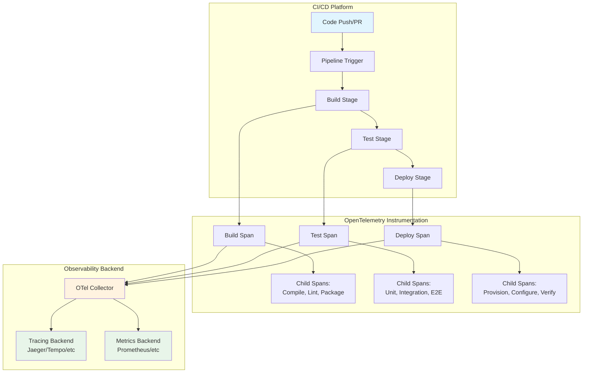
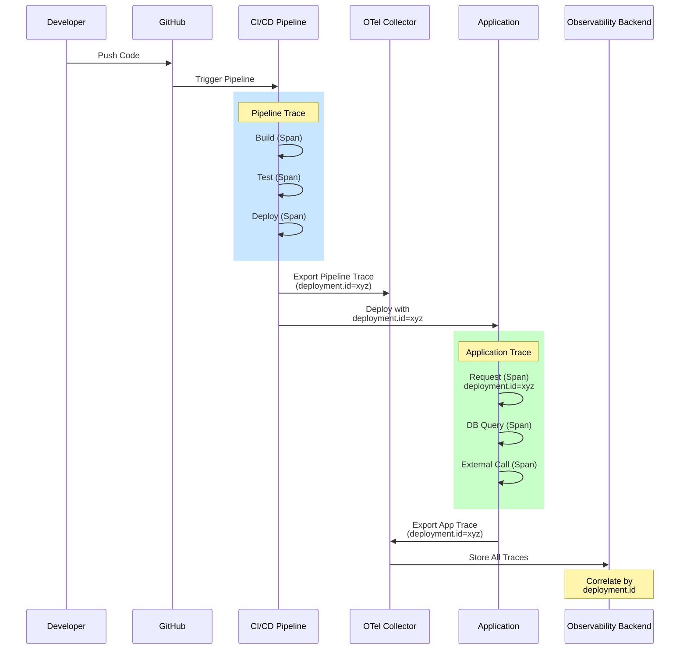
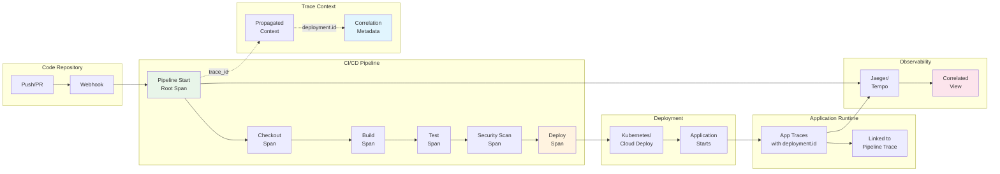

# How to Add OpenTelemetry Observability to CI/CD Pipelines

Author: [nawazdhandala](https://github.com/nawazdhandala)

Tags: OpenTelemetry, CI/CD, DevOps, Observability, GitHub Actions, Jenkins

Description: A guide to instrumenting CI/CD pipelines with OpenTelemetry for build and deployment visibility.

---

## Introduction

Continuous Integration and Continuous Deployment (CI/CD) pipelines are the backbone of modern software delivery. However, as pipelines grow in complexity, understanding their performance characteristics becomes increasingly challenging. OpenTelemetry provides a vendor-neutral way to collect telemetry data from your CI/CD workflows, enabling deep visibility into build times, deployment success rates, and pipeline bottlenecks.

This comprehensive guide covers how to instrument CI/CD pipelines with OpenTelemetry, focusing on GitHub Actions and Jenkins, the two most popular CI/CD platforms.

## Why Instrument CI/CD Pipelines?

Before diving into implementation, let's understand the benefits of adding observability to CI/CD pipelines:

- **Build Performance Tracking**: Identify slow steps and optimize build times
- **Deployment Correlation**: Link deployments to application traces for faster incident resolution
- **Resource Utilization**: Monitor runner and agent resource consumption
- **Failure Analysis**: Quickly identify patterns in build failures
- **Compliance Auditing**: Maintain detailed records of all deployments

## CI/CD Tracing Architecture

The following diagram illustrates how OpenTelemetry integrates with CI/CD pipelines:



## Setting Up the OpenTelemetry Collector

First, we need an OpenTelemetry Collector to receive and process telemetry from our pipelines.

The following Docker Compose configuration sets up an OTel Collector with Jaeger for visualization. We expose the OTLP endpoints (gRPC on 4317, HTTP on 4318) and configure Jaeger for trace storage.

```yaml
# docker-compose.yml
# OpenTelemetry Collector setup for CI/CD observability
version: '3.8'

services:
  # The OTel Collector receives telemetry from CI/CD pipelines
  # and exports to various backends
  otel-collector:
    image: otel/opentelemetry-collector-contrib:latest
    command: ["--config=/etc/otel-collector-config.yaml"]
    volumes:
      - ./otel-collector-config.yaml:/etc/otel-collector-config.yaml
    ports:
      # OTLP gRPC receiver - used by most SDKs
      - "4317:4317"
      # OTLP HTTP receiver - used by browser/lightweight clients
      - "4318:4318"
      # Prometheus metrics endpoint for collector health
      - "8888:8888"
    networks:
      - observability

  # Jaeger provides trace visualization and analysis
  jaeger:
    image: jaegertracing/all-in-one:latest
    ports:
      # Jaeger UI for viewing traces
      - "16686:16686"
      # Jaeger OTLP gRPC endpoint
      - "14250:14250"
    environment:
      - COLLECTOR_OTLP_ENABLED=true
    networks:
      - observability

networks:
  observability:
    driver: bridge
```

The collector configuration defines how telemetry flows through the system. We configure receivers to accept OTLP data, processors for batching, and exporters for Jaeger and logging.

```yaml
# otel-collector-config.yaml
# Configuration for processing CI/CD telemetry data

receivers:
  # OTLP receiver accepts traces, metrics, and logs
  # from instrumented CI/CD pipelines
  otlp:
    protocols:
      grpc:
        endpoint: 0.0.0.0:4317
      http:
        endpoint: 0.0.0.0:4318

processors:
  # Batch processor groups telemetry for efficient export
  # This reduces network overhead and improves throughput
  batch:
    timeout: 5s
    send_batch_size: 1000

  # Resource processor adds common attributes to all telemetry
  # These attributes help identify the source environment
  resource:
    attributes:
      - key: environment
        value: cicd
        action: upsert
      - key: service.namespace
        value: pipeline
        action: upsert

  # Attributes processor enriches spans with CI/CD context
  attributes:
    actions:
      - key: cicd.platform
        action: upsert
        value: "opentelemetry-instrumented"

exporters:
  # Jaeger exporter sends traces for visualization
  otlp/jaeger:
    endpoint: jaeger:4317
    tls:
      insecure: true

  # Debug exporter logs telemetry for troubleshooting
  # Set verbosity to 'detailed' for full span data
  debug:
    verbosity: basic

  # Prometheus exporter exposes metrics for scraping
  prometheus:
    endpoint: "0.0.0.0:8889"
    namespace: cicd

service:
  pipelines:
    # Traces pipeline for build/deploy span data
    traces:
      receivers: [otlp]
      processors: [batch, resource, attributes]
      exporters: [otlp/jaeger, debug]

    # Metrics pipeline for build performance data
    metrics:
      receivers: [otlp]
      processors: [batch, resource]
      exporters: [prometheus, debug]
```

## GitHub Actions Instrumentation

GitHub Actions is one of the most popular CI/CD platforms. We can instrument it using OpenTelemetry to trace each workflow run, job, and step.

### Method 1: Using otel-cli for Shell-Based Instrumentation

The `otel-cli` tool allows you to create spans from shell commands. This is the simplest approach and works well for most use cases.

This workflow demonstrates comprehensive OpenTelemetry instrumentation. Each step creates a span with relevant attributes, and child spans are linked using trace context propagation.

```yaml
# .github/workflows/ci-with-otel.yml
# CI workflow with full OpenTelemetry instrumentation

name: CI Pipeline with OpenTelemetry

on:
  push:
    branches: [main, develop]
  pull_request:
    branches: [main]

# Environment variables for OpenTelemetry configuration
# These are used by otel-cli and other OTEL tools
env:
  # OTLP endpoint - your collector URL
  OTEL_EXPORTER_OTLP_ENDPOINT: ${{ secrets.OTEL_ENDPOINT }}
  # Service name identifies this pipeline in traces
  OTEL_SERVICE_NAME: github-actions-pipeline
  # Resource attributes provide context about the pipeline
  OTEL_RESOURCE_ATTRIBUTES: >-
    service.version=${{ github.sha }},
    deployment.environment=ci,
    vcs.repository.name=${{ github.repository }},
    vcs.ref.name=${{ github.ref_name }}

jobs:
  # Build job with full trace instrumentation
  build:
    runs-on: ubuntu-latest
    outputs:
      # Pass trace context to downstream jobs
      trace_id: ${{ steps.init-trace.outputs.trace_id }}
      parent_span_id: ${{ steps.build.outputs.span_id }}

    steps:
      # Install otel-cli for creating spans from shell
      # This tool wraps commands and automatically creates spans
      - name: Install OpenTelemetry CLI
        run: |
          # Download the latest otel-cli release
          curl -L -o otel-cli.tar.gz \
            https://github.com/equinix-labs/otel-cli/releases/latest/download/otel-cli_Linux_x86_64.tar.gz
          tar -xzf otel-cli.tar.gz
          sudo mv otel-cli /usr/local/bin/
          # Verify installation
          otel-cli version

      - name: Checkout Code
        uses: actions/checkout@v4

      # Initialize the root trace for this workflow run
      # All subsequent spans will be children of this root span
      - name: Initialize Pipeline Trace
        id: init-trace
        run: |
          # Create the root span for the entire pipeline
          # The --background flag starts a span without blocking
          # Store the trace context for propagation to other jobs
          TRACE_OUTPUT=$(otel-cli span \
            --service "$OTEL_SERVICE_NAME" \
            --name "pipeline:${{ github.workflow }}" \
            --attrs "github.run_id=${{ github.run_id }}" \
            --attrs "github.actor=${{ github.actor }}" \
            --attrs "github.event_name=${{ github.event_name }}" \
            --attrs "github.sha=${{ github.sha }}" \
            --tp-print)

          # Extract trace_id for cross-job propagation
          TRACE_ID=$(echo "$TRACE_OUTPUT" | grep -oP 'trace_id=\K[a-f0-9]+')
          echo "trace_id=$TRACE_ID" >> $GITHUB_OUTPUT
          echo "traceparent=$TRACE_OUTPUT" >> $GITHUB_ENV

      # Setup Node.js with tracing
      - name: Setup Node.js
        run: |
          # Wrap the setup step in a span
          otel-cli exec \
            --service "$OTEL_SERVICE_NAME" \
            --name "setup:nodejs" \
            --attrs "node.version=20" \
            --tp-carrier-file /tmp/traceparent \
            -- bash -c '
              curl -fsSL https://deb.nodesource.com/setup_20.x | sudo -E bash -
              sudo apt-get install -y nodejs
              node --version
              npm --version
            '

      # Install dependencies with detailed timing
      - name: Install Dependencies
        run: |
          # Track dependency installation time
          # This often reveals performance issues
          otel-cli exec \
            --service "$OTEL_SERVICE_NAME" \
            --name "install:dependencies" \
            --attrs "package.manager=npm" \
            --kind client \
            -- npm ci

          # Record dependency count as a metric attribute
          DEP_COUNT=$(npm ls --depth=0 --json 2>/dev/null | jq '.dependencies | length')
          echo "Installed $DEP_COUNT direct dependencies"

      # Build step with comprehensive instrumentation
      - name: Build Application
        id: build
        run: |
          # Start the build span and capture its ID
          BUILD_START=$(date +%s%N)

          otel-cli exec \
            --service "$OTEL_SERVICE_NAME" \
            --name "build:application" \
            --attrs "build.tool=npm" \
            --attrs "build.command=npm run build" \
            -- npm run build

          BUILD_END=$(date +%s%N)
          BUILD_DURATION=$(( (BUILD_END - BUILD_START) / 1000000 ))

          # Output build duration for metrics
          echo "Build completed in ${BUILD_DURATION}ms"

          # Store span ID for downstream correlation
          echo "span_id=$(otel-cli span-id)" >> $GITHUB_OUTPUT

      # Lint step with error tracking
      - name: Lint Code
        run: |
          # Run linting and capture any failures
          otel-cli exec \
            --service "$OTEL_SERVICE_NAME" \
            --name "lint:code" \
            --attrs "linter=eslint" \
            -- npm run lint || {
              # If linting fails, record the error in the span
              otel-cli span event \
                --name "lint.failure" \
                --attrs "error.type=lint_error"
              exit 1
            }

      # Upload artifacts with tracing
      - name: Upload Build Artifacts
        run: |
          otel-cli exec \
            --service "$OTEL_SERVICE_NAME" \
            --name "upload:artifacts" \
            --attrs "artifact.type=build" \
            -- tar -czf build-artifacts.tar.gz dist/

      - uses: actions/upload-artifact@v4
        with:
          name: build-output
          path: build-artifacts.tar.gz

  # Test job receives trace context from build job
  test:
    needs: build
    runs-on: ubuntu-latest
    strategy:
      matrix:
        test-type: [unit, integration]

    steps:
      - name: Install OpenTelemetry CLI
        run: |
          curl -L -o otel-cli.tar.gz \
            https://github.com/equinix-labs/otel-cli/releases/latest/download/otel-cli_Linux_x86_64.tar.gz
          tar -xzf otel-cli.tar.gz
          sudo mv otel-cli /usr/local/bin/

      - name: Checkout Code
        uses: actions/checkout@v4

      # Continue the trace from the build job
      # This creates a proper parent-child relationship
      - name: Run ${{ matrix.test-type }} Tests
        env:
          # Propagate trace context from parent job
          TRACEPARENT: "00-${{ needs.build.outputs.trace_id }}-${{ needs.build.outputs.parent_span_id }}-01"
        run: |
          otel-cli exec \
            --service "$OTEL_SERVICE_NAME" \
            --name "test:${{ matrix.test-type }}" \
            --attrs "test.type=${{ matrix.test-type }}" \
            --attrs "test.framework=jest" \
            --tp-required \
            -- npm run test:${{ matrix.test-type }}

  # Deploy job with deployment correlation
  deploy:
    needs: [build, test]
    runs-on: ubuntu-latest
    if: github.ref == 'refs/heads/main'

    steps:
      - name: Install OpenTelemetry CLI
        run: |
          curl -L -o otel-cli.tar.gz \
            https://github.com/equinix-labs/otel-cli/releases/latest/download/otel-cli_Linux_x86_64.tar.gz
          tar -xzf otel-cli.tar.gz
          sudo mv otel-cli /usr/local/bin/

      - name: Checkout Code
        uses: actions/checkout@v4

      - uses: actions/download-artifact@v4
        with:
          name: build-output

      # Deploy with full trace correlation
      # This enables linking deployments to application traces
      - name: Deploy to Production
        env:
          TRACEPARENT: "00-${{ needs.build.outputs.trace_id }}-${{ needs.build.outputs.parent_span_id }}-01"
        run: |
          # Generate a unique deployment ID for correlation
          DEPLOYMENT_ID=$(uuidgen)

          # Create deployment span with correlation attributes
          otel-cli exec \
            --service "$OTEL_SERVICE_NAME" \
            --name "deploy:production" \
            --attrs "deployment.id=$DEPLOYMENT_ID" \
            --attrs "deployment.environment=production" \
            --attrs "deployment.version=${{ github.sha }}" \
            --kind client \
            -- bash -c '
              # Extract artifacts
              tar -xzf build-artifacts.tar.gz

              # Your deployment commands here
              echo "Deploying version ${{ github.sha }}"

              # Example: Deploy to Kubernetes
              # kubectl set image deployment/app app=${{ github.sha }}

              # Example: Deploy to AWS
              # aws s3 sync dist/ s3://my-bucket/
            '

          # Record deployment completion event
          otel-cli span event \
            --name "deployment.completed" \
            --attrs "deployment.id=$DEPLOYMENT_ID" \
            --attrs "deployment.status=success"

          # Output deployment ID for downstream correlation
          echo "Deployment $DEPLOYMENT_ID completed successfully"
          echo "DEPLOYMENT_ID=$DEPLOYMENT_ID" >> $GITHUB_ENV
```

### Method 2: Using the OpenTelemetry GitHub Action

For more advanced instrumentation, use the official OpenTelemetry GitHub Action that automatically traces workflow runs.

This action automatically instruments your workflow without modifying individual steps. It creates spans for jobs and steps and exports them to your configured OTLP endpoint.

```yaml
# .github/workflows/ci-auto-instrumented.yml
# Automatically instrumented CI workflow using otel-export-trace-action

name: Auto-Instrumented CI Pipeline

on:
  push:
    branches: [main]
  pull_request:

jobs:
  build-and-test:
    runs-on: ubuntu-latest
    steps:
      - uses: actions/checkout@v4

      # This action exports workflow traces to OTLP endpoint
      # It runs in the background and captures all step timings
      - name: Export Workflow Traces
        uses: inception-health/otel-export-trace-action@v1
        with:
          # Your OTLP endpoint (gRPC)
          otlpEndpoint: ${{ secrets.OTEL_ENDPOINT }}
          # Service name for this workflow
          otlpHeaders: ${{ secrets.OTEL_HEADERS }}
          serviceName: github-actions
          # Include job and step attributes
          runId: ${{ github.run_id }}

      - name: Setup Node.js
        uses: actions/setup-node@v4
        with:
          node-version: '20'
          cache: 'npm'

      - name: Install Dependencies
        run: npm ci

      - name: Build
        run: npm run build

      - name: Test
        run: npm test
```

## Jenkins Pipeline Tracing

Jenkins pipelines can be instrumented using the OpenTelemetry plugin or manual instrumentation with the OpenTelemetry SDK.

### Method 1: Using the OpenTelemetry Jenkins Plugin

The OpenTelemetry Jenkins plugin automatically instruments pipeline runs. First, install the plugin and configure it.

The following Jenkinsfile demonstrates a pipeline that leverages the OpenTelemetry plugin. The plugin automatically creates spans for stages and steps.

```groovy
// Jenkinsfile
// Jenkins pipeline with OpenTelemetry instrumentation via plugin

// The OpenTelemetry plugin must be installed and configured in Jenkins
// Configure at: Manage Jenkins > Configure System > OpenTelemetry

pipeline {
    agent any

    // Environment variables for OpenTelemetry
    // These supplement the plugin's automatic configuration
    environment {
        // Service name for this pipeline
        OTEL_SERVICE_NAME = 'jenkins-pipeline'
        // Additional resource attributes
        OTEL_RESOURCE_ATTRIBUTES = "service.version=${env.GIT_COMMIT}"
        // Application being built (for correlation)
        APP_NAME = 'my-application'
    }

    // Pipeline options including OpenTelemetry tracing
    options {
        // Enable timestamps for correlation with traces
        timestamps()
        // Enable build discarder to manage storage
        buildDiscarder(logRotator(numToKeepStr: '10'))
    }

    stages {
        // Checkout stage with Git information capture
        stage('Checkout') {
            steps {
                script {
                    // The plugin automatically creates a span for this stage
                    // We add custom attributes for richer context
                    checkout scm

                    // Capture Git information for trace attributes
                    env.GIT_COMMIT = sh(
                        script: 'git rev-parse HEAD',
                        returnStdout: true
                    ).trim()

                    env.GIT_BRANCH = sh(
                        script: 'git rev-parse --abbrev-ref HEAD',
                        returnStdout: true
                    ).trim()

                    echo "Building commit ${env.GIT_COMMIT} on branch ${env.GIT_BRANCH}"
                }
            }
        }

        // Build stage with detailed step tracing
        stage('Build') {
            steps {
                script {
                    // Each sh step becomes a child span
                    sh '''
                        echo "Installing dependencies..."
                        npm ci
                    '''

                    sh '''
                        echo "Building application..."
                        npm run build
                    '''
                }
            }
            post {
                success {
                    // Archive artifacts on successful build
                    archiveArtifacts artifacts: 'dist/**/*', fingerprint: true
                }
                failure {
                    // Record build failure event
                    echo "Build failed for commit ${env.GIT_COMMIT}"
                }
            }
        }

        // Parallel test stages - each becomes a separate span
        stage('Test') {
            parallel {
                // Unit tests stage
                stage('Unit Tests') {
                    steps {
                        sh '''
                            echo "Running unit tests..."
                            npm run test:unit -- --coverage
                        '''
                    }
                    post {
                        always {
                            // Publish test results
                            junit 'test-results/unit/*.xml'
                            // Publish coverage report
                            publishCoverage adapters: [coberturaAdapter('coverage/cobertura-coverage.xml')]
                        }
                    }
                }

                // Integration tests stage
                stage('Integration Tests') {
                    steps {
                        sh '''
                            echo "Running integration tests..."
                            npm run test:integration
                        '''
                    }
                    post {
                        always {
                            junit 'test-results/integration/*.xml'
                        }
                    }
                }

                // E2E tests stage
                stage('E2E Tests') {
                    steps {
                        sh '''
                            echo "Running E2E tests..."
                            npm run test:e2e
                        '''
                    }
                    post {
                        always {
                            junit 'test-results/e2e/*.xml'
                        }
                    }
                }
            }
        }

        // Security scanning stage
        stage('Security Scan') {
            steps {
                script {
                    sh '''
                        echo "Running security scan..."
                        npm audit --json > audit-results.json || true
                    '''

                    // Parse and report vulnerabilities
                    def auditResults = readJSON file: 'audit-results.json'
                    def vulnCount = auditResults.metadata?.vulnerabilities?.total ?: 0
                    echo "Found ${vulnCount} vulnerabilities"
                }
            }
        }

        // Deploy stage with environment-specific configuration
        stage('Deploy') {
            when {
                branch 'main'
            }
            stages {
                // Staging deployment
                stage('Deploy to Staging') {
                    steps {
                        script {
                            // Generate deployment ID for correlation
                            env.DEPLOYMENT_ID = UUID.randomUUID().toString()

                            sh '''
                                echo "Deploying to staging environment..."
                                echo "Deployment ID: ${DEPLOYMENT_ID}"
                                # Your staging deployment commands
                            '''
                        }
                    }
                }

                // Production deployment with approval
                stage('Deploy to Production') {
                    steps {
                        // Manual approval gate
                        timeout(time: 30, unit: 'MINUTES') {
                            input message: 'Deploy to production?', ok: 'Deploy'
                        }

                        script {
                            sh '''
                                echo "Deploying to production environment..."
                                echo "Deployment ID: ${DEPLOYMENT_ID}"
                                # Your production deployment commands
                            '''
                        }
                    }
                }
            }
        }
    }

    // Post-pipeline actions
    post {
        always {
            // Clean workspace
            cleanWs()
        }
        success {
            echo "Pipeline completed successfully"
        }
        failure {
            // Send notification on failure
            echo "Pipeline failed"
        }
    }
}
```

### Method 2: Manual SDK Instrumentation in Jenkins

For more control, you can use the OpenTelemetry SDK directly in your Jenkinsfile.

This approach gives you full control over span creation and attributes. We use the opentelemetry-api and opentelemetry-sdk packages in a Groovy script.

```groovy
// Jenkinsfile with manual OpenTelemetry SDK instrumentation
// This provides fine-grained control over tracing

@Library('opentelemetry-shared-lib') _

import io.opentelemetry.api.GlobalOpenTelemetry
import io.opentelemetry.api.trace.Span
import io.opentelemetry.api.trace.SpanKind
import io.opentelemetry.api.trace.StatusCode
import io.opentelemetry.context.Context
import io.opentelemetry.context.Scope

pipeline {
    agent any

    environment {
        OTEL_EXPORTER_OTLP_ENDPOINT = credentials('otel-endpoint')
        OTEL_SERVICE_NAME = 'jenkins-manual-instrumented'
    }

    stages {
        stage('Initialize Tracing') {
            steps {
                script {
                    // Initialize OpenTelemetry SDK
                    // This is typically done in a shared library
                    initializeOpenTelemetry([
                        serviceName: env.OTEL_SERVICE_NAME,
                        endpoint: env.OTEL_EXPORTER_OTLP_ENDPOINT
                    ])

                    // Create the root span for this pipeline
                    env.TRACE_CONTEXT = createPipelineSpan([
                        pipelineName: env.JOB_NAME,
                        buildNumber: env.BUILD_NUMBER,
                        gitCommit: env.GIT_COMMIT
                    ])
                }
            }
        }

        stage('Build') {
            steps {
                script {
                    // Create a child span for the build stage
                    withSpan('build', [
                        'build.tool': 'npm',
                        'build.node_version': '20'
                    ]) {
                        sh 'npm ci'
                        sh 'npm run build'
                    }
                }
            }
        }

        stage('Test') {
            steps {
                script {
                    // Create a child span for testing
                    withSpan('test', [
                        'test.framework': 'jest'
                    ]) {
                        try {
                            sh 'npm test'
                            setSpanStatus(StatusCode.OK)
                        } catch (Exception e) {
                            // Record exception in span
                            recordException(e)
                            setSpanStatus(StatusCode.ERROR, e.message)
                            throw e
                        }
                    }
                }
            }
        }

        stage('Deploy') {
            when {
                branch 'main'
            }
            steps {
                script {
                    // Create deployment span with deployment-specific attributes
                    def deploymentId = UUID.randomUUID().toString()

                    withSpan('deploy', [
                        'deployment.id': deploymentId,
                        'deployment.environment': 'production',
                        'deployment.version': env.GIT_COMMIT
                    ], SpanKind.CLIENT) {
                        // Add deployment event
                        addSpanEvent('deployment.started', [
                            'deployment.id': deploymentId
                        ])

                        sh '''
                            echo "Deploying to production..."
                            # Deployment commands here
                        '''

                        addSpanEvent('deployment.completed', [
                            'deployment.id': deploymentId,
                            'deployment.status': 'success'
                        ])
                    }
                }
            }
        }
    }

    post {
        always {
            script {
                // End the root span and flush telemetry
                endPipelineSpan()
                flushTelemetry()
            }
        }
    }
}
```

The shared library implementing the tracing utilities provides reusable functions for span management.

```groovy
// vars/opentelemetry-shared-lib/vars/initializeOpenTelemetry.groovy
// Shared library for OpenTelemetry utilities

import io.opentelemetry.sdk.OpenTelemetrySdk
import io.opentelemetry.sdk.trace.SdkTracerProvider
import io.opentelemetry.sdk.trace.export.BatchSpanProcessor
import io.opentelemetry.exporter.otlp.trace.OtlpGrpcSpanExporter
import io.opentelemetry.sdk.resources.Resource
import io.opentelemetry.semconv.resource.attributes.ResourceAttributes

// Thread-local storage for span context
@groovy.transform.Field
static ThreadLocal<Span> currentSpan = new ThreadLocal<>()

@groovy.transform.Field
static ThreadLocal<Scope> currentScope = new ThreadLocal<>()

/**
 * Initialize the OpenTelemetry SDK with OTLP exporter
 * @param config Map containing serviceName and endpoint
 */
def call(Map config) {
    // Build resource with service information
    def resource = Resource.getDefault()
        .merge(Resource.create(
            io.opentelemetry.api.common.Attributes.of(
                ResourceAttributes.SERVICE_NAME, config.serviceName,
                ResourceAttributes.SERVICE_VERSION, config.version ?: 'unknown'
            )
        ))

    // Configure OTLP exporter
    def spanExporter = OtlpGrpcSpanExporter.builder()
        .setEndpoint(config.endpoint)
        .build()

    // Build tracer provider with batch processor
    def tracerProvider = SdkTracerProvider.builder()
        .addSpanProcessor(BatchSpanProcessor.builder(spanExporter).build())
        .setResource(resource)
        .build()

    // Register globally
    def openTelemetry = OpenTelemetrySdk.builder()
        .setTracerProvider(tracerProvider)
        .buildAndRegisterGlobal()

    echo "OpenTelemetry initialized with endpoint: ${config.endpoint}"
}
```

The withSpan closure helper for creating child spans in pipeline stages:

```groovy
// vars/opentelemetry-shared-lib/vars/withSpan.groovy
// Helper for creating traced spans in pipeline stages

import io.opentelemetry.api.GlobalOpenTelemetry
import io.opentelemetry.api.trace.Span
import io.opentelemetry.api.trace.SpanKind
import io.opentelemetry.api.trace.StatusCode
import io.opentelemetry.context.Scope

/**
 * Execute a closure within a traced span
 * @param spanName Name of the span
 * @param attributes Map of attributes to add to the span
 * @param kind SpanKind (default: INTERNAL)
 * @param body Closure to execute
 */
def call(String spanName, Map attributes = [:], SpanKind kind = SpanKind.INTERNAL, Closure body) {
    def tracer = GlobalOpenTelemetry.getTracer('jenkins-pipeline')

    // Build the span with provided attributes
    def spanBuilder = tracer.spanBuilder(spanName)
        .setSpanKind(kind)

    // Add all attributes to the span
    attributes.each { key, value ->
        spanBuilder.setAttribute(key, value.toString())
    }

    // Start the span
    def span = spanBuilder.startSpan()
    def scope = span.makeCurrent()

    try {
        // Execute the body closure
        def result = body.call()
        span.setStatus(StatusCode.OK)
        return result
    } catch (Exception e) {
        // Record exception and set error status
        span.recordException(e)
        span.setStatus(StatusCode.ERROR, e.message)
        throw e
    } finally {
        // Always close scope and end span
        scope.close()
        span.end()
    }
}
```

## Build Performance Tracking

Tracking build performance over time helps identify trends and regressions. The following setup creates metrics from CI/CD traces.

This Collector configuration extracts metrics from trace spans, allowing you to track build duration distributions and success rates.

```yaml
# otel-collector-config-metrics.yaml
# Configuration for extracting metrics from CI/CD traces

receivers:
  otlp:
    protocols:
      grpc:
        endpoint: 0.0.0.0:4317
      http:
        endpoint: 0.0.0.0:4318

processors:
  batch:
    timeout: 5s

  # Span metrics processor creates metrics from spans
  # This enables tracking build performance over time
  spanmetrics:
    metrics_exporter: prometheus
    # Dimensions to include in metrics
    dimensions:
      - name: service.name
      - name: pipeline.name
      - name: stage.name
      - name: build.status
      - name: deployment.environment
    # Histogram buckets for duration tracking
    # Buckets are in seconds
    dimensions_cache_size: 1000
    aggregation_temporality: "AGGREGATION_TEMPORALITY_CUMULATIVE"
    histogram:
      explicit:
        buckets: [5s, 10s, 30s, 60s, 120s, 300s, 600s]

  # Filter processor to focus on CI/CD spans
  filter/cicd:
    spans:
      include:
        match_type: regexp
        services:
          - ".*-pipeline"
          - "github-actions.*"
          - "jenkins.*"

exporters:
  # Prometheus exporter for metrics
  prometheus:
    endpoint: "0.0.0.0:8889"
    namespace: cicd
    # Add constant labels for all metrics
    const_labels:
      source: opentelemetry

  # OTLP exporter for traces
  otlp:
    endpoint: jaeger:4317
    tls:
      insecure: true

service:
  pipelines:
    traces:
      receivers: [otlp]
      processors: [batch, filter/cicd, spanmetrics]
      exporters: [otlp]

    metrics:
      receivers: [otlp]
      processors: [batch]
      exporters: [prometheus]
```

Example Grafana dashboard configuration for visualizing CI/CD metrics:

```json
{
  "dashboard": {
    "title": "CI/CD Pipeline Performance",
    "panels": [
      {
        "title": "Build Duration (p95)",
        "type": "timeseries",
        "targets": [
          {
            "expr": "histogram_quantile(0.95, sum(rate(cicd_span_duration_bucket{span_name=~\"build.*\"}[5m])) by (le, service_name))",
            "legendFormat": "{{service_name}}"
          }
        ]
      },
      {
        "title": "Build Success Rate",
        "type": "stat",
        "targets": [
          {
            "expr": "sum(rate(cicd_span_duration_count{span_status_code=\"OK\", span_name=~\"build.*\"}[1h])) / sum(rate(cicd_span_duration_count{span_name=~\"build.*\"}[1h])) * 100",
            "legendFormat": "Success Rate"
          }
        ]
      },
      {
        "title": "Deployments per Day",
        "type": "stat",
        "targets": [
          {
            "expr": "sum(increase(cicd_span_duration_count{span_name=~\"deploy.*\"}[24h]))",
            "legendFormat": "Deployments"
          }
        ]
      },
      {
        "title": "Pipeline Stage Duration",
        "type": "barchart",
        "targets": [
          {
            "expr": "avg(cicd_span_duration_sum / cicd_span_duration_count) by (span_name)",
            "legendFormat": "{{span_name}}"
          }
        ]
      }
    ]
  }
}
```

## Deployment Correlation

Deployment correlation links CI/CD traces with application traces, enabling end-to-end observability from code commit to production behavior.

The following diagram shows how deployment correlation works:



To implement deployment correlation, inject the deployment context into your application during deployment.

This script demonstrates how to inject deployment metadata into your application's environment during deployment.

```bash
#!/bin/bash
# deploy-with-correlation.sh
# Deployment script that injects OpenTelemetry correlation context

set -euo pipefail

# Configuration
APP_NAME="${APP_NAME:-my-application}"
DEPLOY_ENV="${DEPLOY_ENV:-production}"
OTEL_ENDPOINT="${OTEL_ENDPOINT:-http://otel-collector:4317}"

# Generate deployment identifiers
# These will be used to correlate pipeline traces with application traces
DEPLOYMENT_ID=$(uuidgen)
DEPLOYMENT_TIMESTAMP=$(date -u +"%Y-%m-%dT%H:%M:%SZ")
GIT_COMMIT=${GIT_COMMIT:-$(git rev-parse HEAD 2>/dev/null || echo "unknown")}
GIT_BRANCH=${GIT_BRANCH:-$(git rev-parse --abbrev-ref HEAD 2>/dev/null || echo "unknown")}

echo "Starting deployment..."
echo "  Deployment ID: ${DEPLOYMENT_ID}"
echo "  Environment: ${DEPLOY_ENV}"
echo "  Version: ${GIT_COMMIT}"

# Function to create a deployment span using otel-cli
create_deployment_span() {
    local status=$1

    otel-cli span \
        --service "deployment-service" \
        --name "deploy:${APP_NAME}" \
        --attrs "deployment.id=${DEPLOYMENT_ID}" \
        --attrs "deployment.environment=${DEPLOY_ENV}" \
        --attrs "deployment.timestamp=${DEPLOYMENT_TIMESTAMP}" \
        --attrs "service.name=${APP_NAME}" \
        --attrs "service.version=${GIT_COMMIT}" \
        --attrs "vcs.branch=${GIT_BRANCH}" \
        --attrs "deployment.status=${status}" \
        --kind client \
        --endpoint "${OTEL_ENDPOINT}"
}

# Function to inject deployment metadata into Kubernetes
deploy_to_kubernetes() {
    echo "Deploying to Kubernetes..."

    # Create ConfigMap with deployment metadata
    # This will be mounted as environment variables in the application
    kubectl create configmap deployment-metadata \
        --from-literal=DEPLOYMENT_ID="${DEPLOYMENT_ID}" \
        --from-literal=DEPLOYMENT_TIMESTAMP="${DEPLOYMENT_TIMESTAMP}" \
        --from-literal=SERVICE_VERSION="${GIT_COMMIT}" \
        --from-literal=DEPLOYMENT_ENVIRONMENT="${DEPLOY_ENV}" \
        --dry-run=client -o yaml | kubectl apply -f -

    # Update deployment with new image and metadata
    kubectl set image deployment/${APP_NAME} \
        ${APP_NAME}=${APP_IMAGE}:${GIT_COMMIT}

    # Add deployment annotations for correlation
    kubectl annotate deployment/${APP_NAME} \
        "opentelemetry.io/deployment-id=${DEPLOYMENT_ID}" \
        "opentelemetry.io/deployment-timestamp=${DEPLOYMENT_TIMESTAMP}" \
        --overwrite

    # Wait for rollout to complete
    kubectl rollout status deployment/${APP_NAME} --timeout=5m
}

# Function to inject deployment metadata into Docker/ECS
deploy_to_ecs() {
    echo "Deploying to ECS..."

    # Update task definition with deployment metadata
    aws ecs update-service \
        --cluster ${ECS_CLUSTER} \
        --service ${APP_NAME} \
        --task-definition ${APP_NAME}:${TASK_VERSION} \
        --deployment-configuration "deploymentCircuitBreaker={enable=true,rollback=true}" \
        --enable-execute-command \
        --tags key=deployment.id,value="${DEPLOYMENT_ID}" \
               key=deployment.timestamp,value="${DEPLOYMENT_TIMESTAMP}" \
               key=service.version,value="${GIT_COMMIT}"

    # Wait for deployment to stabilize
    aws ecs wait services-stable \
        --cluster ${ECS_CLUSTER} \
        --services ${APP_NAME}
}

# Main deployment logic with tracing
main() {
    # Record deployment start event
    otel-cli span event \
        --name "deployment.started" \
        --attrs "deployment.id=${DEPLOYMENT_ID}"

    # Perform deployment based on platform
    case "${DEPLOY_PLATFORM:-kubernetes}" in
        kubernetes)
            deploy_to_kubernetes
            ;;
        ecs)
            deploy_to_ecs
            ;;
        *)
            echo "Unknown platform: ${DEPLOY_PLATFORM}"
            create_deployment_span "failed"
            exit 1
            ;;
    esac

    # Record deployment success
    create_deployment_span "success"

    # Record deployment completion event
    otel-cli span event \
        --name "deployment.completed" \
        --attrs "deployment.id=${DEPLOYMENT_ID}" \
        --attrs "deployment.status=success"

    echo "Deployment completed successfully!"
    echo "Deployment ID for correlation: ${DEPLOYMENT_ID}"
}

# Run main function
main "$@"
```

Application-side correlation setup using the Node.js SDK:

```javascript
// src/instrumentation.js
// OpenTelemetry instrumentation with deployment correlation

const { NodeSDK } = require('@opentelemetry/sdk-node');
const { getNodeAutoInstrumentations } = require('@opentelemetry/auto-instrumentations-node');
const { OTLPTraceExporter } = require('@opentelemetry/exporter-trace-otlp-grpc');
const { OTLPMetricExporter } = require('@opentelemetry/exporter-metrics-otlp-grpc');
const { PeriodicExportingMetricReader } = require('@opentelemetry/sdk-metrics');
const { Resource } = require('@opentelemetry/resources');
const { SemanticResourceAttributes } = require('@opentelemetry/semantic-conventions');

// Read deployment metadata from environment
// These are injected during deployment for correlation
const DEPLOYMENT_ID = process.env.DEPLOYMENT_ID || 'unknown';
const DEPLOYMENT_TIMESTAMP = process.env.DEPLOYMENT_TIMESTAMP || new Date().toISOString();
const SERVICE_VERSION = process.env.SERVICE_VERSION || process.env.GIT_COMMIT || 'unknown';
const DEPLOYMENT_ENVIRONMENT = process.env.DEPLOYMENT_ENVIRONMENT || 'development';

// Create resource with deployment correlation attributes
// These attributes appear on every span, enabling correlation with CI/CD traces
const resource = new Resource({
  // Standard semantic conventions
  [SemanticResourceAttributes.SERVICE_NAME]: process.env.OTEL_SERVICE_NAME || 'my-application',
  [SemanticResourceAttributes.SERVICE_VERSION]: SERVICE_VERSION,
  [SemanticResourceAttributes.DEPLOYMENT_ENVIRONMENT]: DEPLOYMENT_ENVIRONMENT,

  // Deployment correlation attributes
  // Match these with your CI/CD pipeline span attributes
  'deployment.id': DEPLOYMENT_ID,
  'deployment.timestamp': DEPLOYMENT_TIMESTAMP,

  // Additional context
  'service.instance.id': process.env.HOSTNAME || require('os').hostname(),
  'host.name': require('os').hostname(),
});

// Configure trace exporter
const traceExporter = new OTLPTraceExporter({
  url: process.env.OTEL_EXPORTER_OTLP_ENDPOINT || 'http://otel-collector:4317',
});

// Configure metric exporter
const metricExporter = new OTLPMetricExporter({
  url: process.env.OTEL_EXPORTER_OTLP_ENDPOINT || 'http://otel-collector:4317',
});

// Initialize OpenTelemetry SDK
const sdk = new NodeSDK({
  resource,
  traceExporter,
  metricReader: new PeriodicExportingMetricReader({
    exporter: metricExporter,
    exportIntervalMillis: 60000, // Export metrics every minute
  }),
  instrumentations: [
    getNodeAutoInstrumentations({
      // Enable all auto-instrumentations
      '@opentelemetry/instrumentation-http': {
        // Add deployment ID to all HTTP spans
        requestHook: (span, request) => {
          span.setAttribute('deployment.id', DEPLOYMENT_ID);
        },
      },
      '@opentelemetry/instrumentation-express': {
        enabled: true,
      },
      '@opentelemetry/instrumentation-pg': {
        enabled: true,
      },
      '@opentelemetry/instrumentation-redis': {
        enabled: true,
      },
    }),
  ],
});

// Start the SDK
sdk.start();

// Handle graceful shutdown
process.on('SIGTERM', () => {
  sdk.shutdown()
    .then(() => console.log('OpenTelemetry SDK shut down successfully'))
    .catch((error) => console.error('Error shutting down OpenTelemetry SDK', error))
    .finally(() => process.exit(0));
});

console.log(`OpenTelemetry initialized with deployment ID: ${DEPLOYMENT_ID}`);
```

## Complete CI/CD Trace Flow

The complete trace flow from code commit to deployment can be visualized as follows:



## Best Practices

### 1. Consistent Naming Conventions

Use consistent span names across your CI/CD pipelines for easier querying and analysis.

```yaml
# Recommended span naming convention
# Format: <action>:<target>

# Good examples:
# - build:application
# - test:unit
# - test:integration
# - deploy:staging
# - deploy:production
# - scan:security
# - publish:artifacts

# Bad examples (avoid):
# - Build Step 1
# - run tests
# - DEPLOY
```

### 2. Essential Attributes

Always include these attributes for comprehensive CI/CD observability:

```yaml
# Pipeline-level attributes
pipeline.name: "my-pipeline"
pipeline.run_id: "12345"
pipeline.status: "success|failure|cancelled"

# Build attributes
build.number: "123"
build.trigger: "push|pull_request|schedule|manual"
build.duration_ms: 45000

# VCS attributes (version control system)
vcs.repository.name: "org/repo"
vcs.ref.name: "main"
vcs.commit.sha: "abc123"
vcs.commit.author: "developer@example.com"

# Deployment attributes
deployment.id: "uuid-here"
deployment.environment: "production"
deployment.version: "v1.2.3"
deployment.status: "success|failure|rollback"
```

### 3. Error Handling and Status

Properly record errors and status in your spans for accurate failure analysis:

```bash
#!/bin/bash
# Example: Proper error handling in traced commands

# Using otel-cli with proper error status
run_with_tracing() {
    local span_name=$1
    shift
    local command="$@"

    # Create a background span
    otel-cli span background \
        --service "$OTEL_SERVICE_NAME" \
        --name "$span_name" \
        --sockdir /tmp/otel &

    SPAN_PID=$!

    # Run the command
    if eval "$command"; then
        # Success - set OK status
        otel-cli span end \
            --sockdir /tmp/otel \
            --status-code Ok
    else
        # Failure - set Error status with message
        otel-cli span end \
            --sockdir /tmp/otel \
            --status-code Error \
            --status-description "Command failed: $command"
        return 1
    fi
}

# Usage
run_with_tracing "build:application" "npm run build"
run_with_tracing "test:unit" "npm test"
```

### 4. Sampling Strategy

Configure appropriate sampling for high-volume pipelines:

```yaml
# otel-collector-sampling.yaml
# Sampling configuration for CI/CD pipelines

processors:
  # Tail-based sampling for intelligent trace selection
  tail_sampling:
    # Wait for complete trace before sampling decision
    decision_wait: 30s
    num_traces: 50000
    expected_new_traces_per_sec: 100
    policies:
      # Always sample failed builds
      - name: errors
        type: status_code
        status_code: {status_codes: [ERROR]}

      # Always sample slow builds (> 5 minutes)
      - name: slow-builds
        type: latency
        latency: {threshold_ms: 300000}

      # Always sample production deployments
      - name: production-deploys
        type: string_attribute
        string_attribute:
          key: deployment.environment
          values: [production]

      # Sample 10% of successful builds
      - name: probabilistic
        type: probabilistic
        probabilistic: {sampling_percentage: 10}
```

## Troubleshooting

### Common Issues and Solutions

**Issue: Traces not appearing in backend**

Check these common causes:

```bash
# 1. Verify collector connectivity
curl -v http://your-collector:4318/v1/traces

# 2. Check otel-cli configuration
otel-cli status --endpoint http://your-collector:4317

# 3. Enable debug logging
export OTEL_LOG_LEVEL=debug
otel-cli span --service test --name "debug-span"

# 4. Verify network connectivity from CI runner
nc -zv your-collector 4317
```

**Issue: Missing trace context between jobs**

Ensure proper context propagation:

```yaml
# GitHub Actions: Pass trace context between jobs
jobs:
  job1:
    outputs:
      trace_context: ${{ steps.trace.outputs.context }}
    steps:
      - id: trace
        run: echo "context=$(otel-cli span --tp-print)" >> $GITHUB_OUTPUT

  job2:
    needs: job1
    env:
      TRACEPARENT: ${{ needs.job1.outputs.trace_context }}
```

**Issue: High cardinality causing performance issues**

Avoid high-cardinality attributes:

```yaml
# Bad: High cardinality
# - commit_sha as attribute (unique per build)
# - timestamp as attribute (always unique)
# - full file paths (many variations)

# Good: Low cardinality
# - branch_name (limited set)
# - environment (dev/staging/prod)
# - build_status (success/failure)
# - stage_name (build/test/deploy)
```

## Conclusion

Adding OpenTelemetry observability to CI/CD pipelines provides invaluable insights into your software delivery process. By following the patterns and practices outlined in this guide, you can:

- **Track build performance** and identify bottlenecks
- **Correlate deployments** with application behavior
- **Debug pipeline failures** more quickly
- **Measure deployment frequency** and lead time

The key is to start simple with basic span instrumentation and gradually add more detailed tracing as you identify areas needing visibility. Use consistent naming conventions, propagate trace context properly between jobs, and leverage deployment correlation to connect your CI/CD traces with application traces.

## Additional Resources

- [OpenTelemetry Documentation](https://opentelemetry.io/docs/)
- [OpenTelemetry Collector Configuration](https://opentelemetry.io/docs/collector/configuration/)
- [GitHub Actions otel-export-trace-action](https://github.com/inception-health/otel-export-trace-action)
- [Jenkins OpenTelemetry Plugin](https://plugins.jenkins.io/opentelemetry/)
- [otel-cli Tool](https://github.com/equinix-labs/otel-cli)
- [Semantic Conventions for CI/CD](https://opentelemetry.io/docs/specs/semconv/cicd/)
