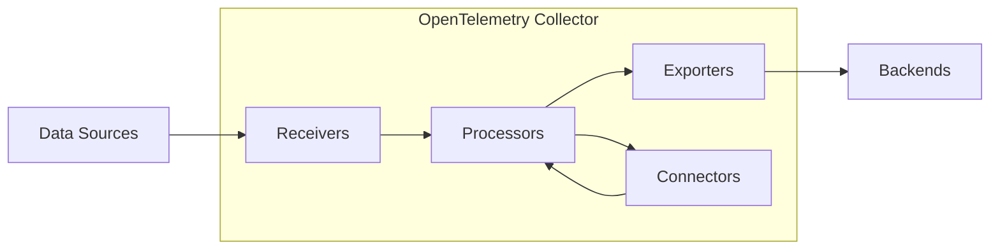
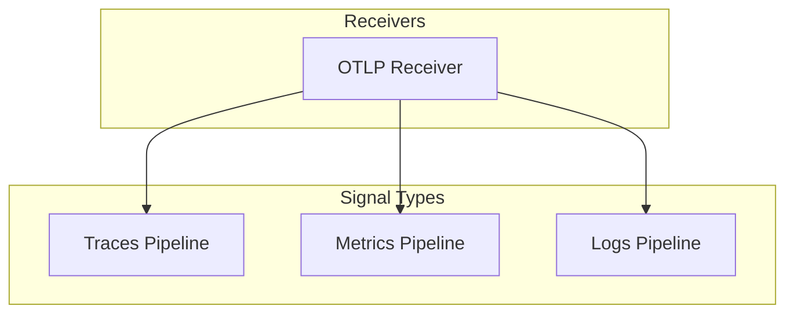
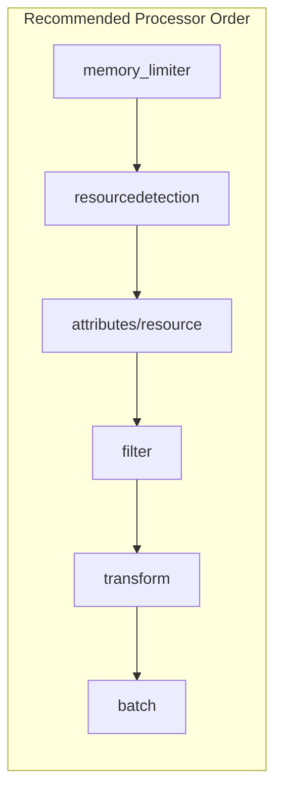
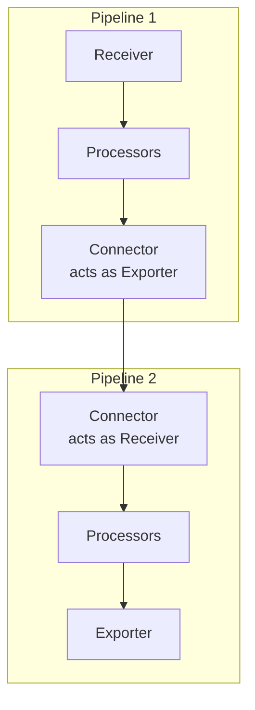
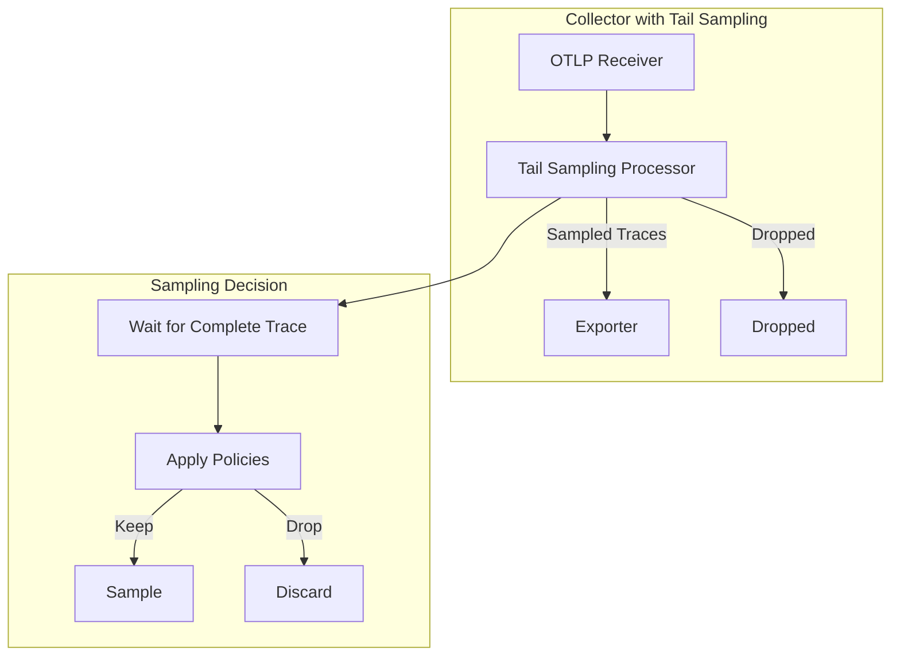
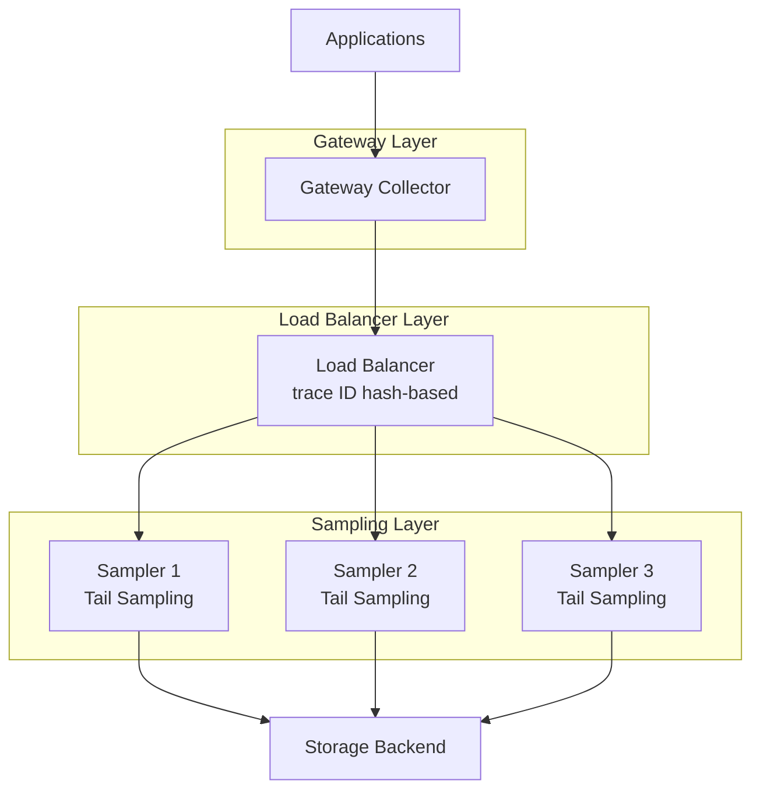
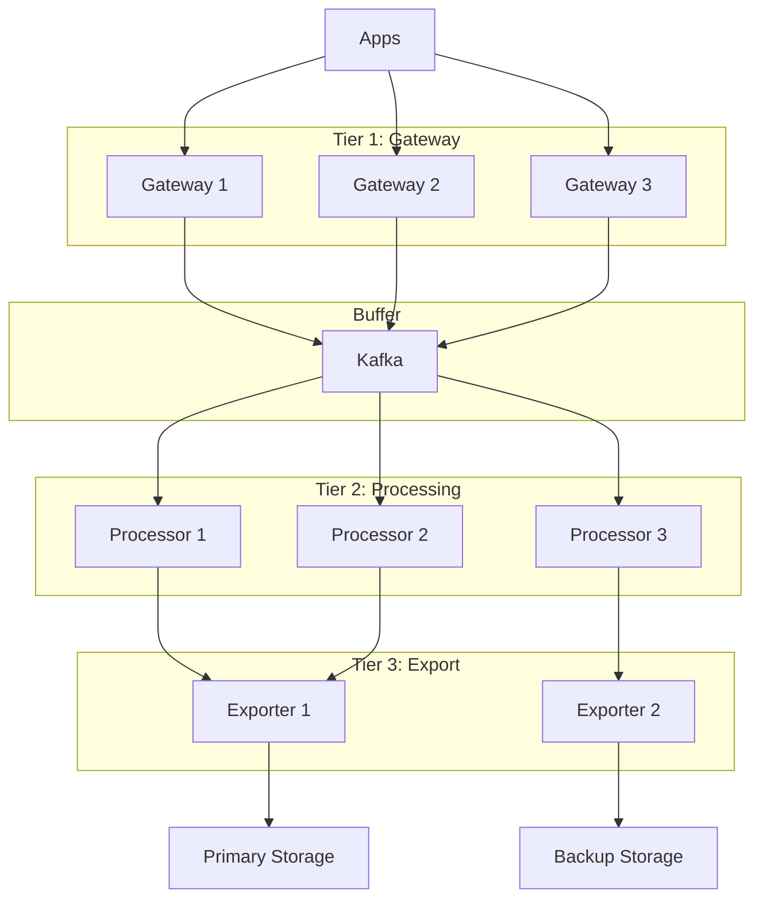

# How to Build Advanced OpenTelemetry Collector Pipelines

Author: [nawazdhandala](https://github.com/nawazdhandala)

Tags: OpenTelemetry, Collector, Telemetry Pipeline, Data Processing, Observability

Description: A deep dive into building complex data processing pipelines with OpenTelemetry Collector.

---

The OpenTelemetry Collector is a powerful, vendor-agnostic component that receives, processes, and exports telemetry data. While basic configurations are straightforward, building advanced pipelines requires understanding multi-pipeline architectures, processor chaining, connectors, and sophisticated sampling strategies. This guide explores these advanced concepts with practical, well-documented examples.

## Table of Contents

1. [Understanding the Collector Architecture](#understanding-the-collector-architecture)
2. [Multi-Pipeline Configurations](#multi-pipeline-configurations)
3. [Processor Chaining Strategies](#processor-chaining-strategies)
4. [Using Connectors for Pipeline Linking](#using-connectors-for-pipeline-linking)
5. [Tail-Based Sampling Pipelines](#tail-based-sampling-pipelines)
6. [Production-Ready Pipeline Patterns](#production-ready-pipeline-patterns)
7. [Performance Optimization](#performance-optimization)
8. [Monitoring Your Collector](#monitoring-your-collector)

## Understanding the Collector Architecture

Before diving into advanced configurations, let's understand the fundamental building blocks of the OpenTelemetry Collector.

### Core Components

The Collector consists of four main component types:



**Component Roles:**
- **Receivers**: Ingest telemetry data from various sources (OTLP, Jaeger, Prometheus, etc.)
- **Processors**: Transform, filter, batch, and enrich data
- **Exporters**: Send processed data to backends (Jaeger, Prometheus, OTLP endpoints, etc.)
- **Connectors**: Bridge between pipelines, allowing data to flow from one pipeline to another

### Pipeline Types

The Collector supports three distinct signal types, each requiring its own pipeline:



## Multi-Pipeline Configurations

Multi-pipeline configurations allow you to process the same data differently based on requirements, route data to multiple destinations, or implement complex data flows.

### Basic Multi-Pipeline Setup

This configuration demonstrates running multiple pipelines for traces, each with different processing requirements.

```yaml
# Multi-pipeline configuration for traces
# This setup routes traces to different backends with different processing needs
receivers:
  # Single OTLP receiver that will feed multiple pipelines
  # Accepts both gRPC and HTTP protocols for maximum compatibility
  otlp:
    protocols:
      grpc:
        endpoint: "0.0.0.0:4317"
      http:
        endpoint: "0.0.0.0:4318"

processors:
  # Batching processor for high-throughput pipeline
  # Groups telemetry data to reduce network overhead
  batch/high-throughput:
    send_batch_size: 10000        # Large batch for efficiency
    timeout: 10s                   # Wait up to 10s to fill batch
    send_batch_max_size: 15000    # Never exceed this size

  # Batching processor for low-latency pipeline
  # Smaller batches for faster delivery
  batch/low-latency:
    send_batch_size: 100          # Small batch for quick delivery
    timeout: 1s                    # Minimal wait time

  # Memory limiter to prevent OOM conditions
  # Essential for production deployments
  memory_limiter:
    check_interval: 1s
    limit_mib: 4000               # Hard limit at 4GB
    spike_limit_mib: 800          # Allow temporary spikes up to 800MB

  # Resource detection adds cloud metadata automatically
  resourcedetection:
    detectors: [env, system, docker, ec2, gcp, azure]
    timeout: 5s

exporters:
  # Primary storage backend (Jaeger)
  # Used for long-term trace storage and analysis
  otlp/jaeger:
    endpoint: "jaeger-collector:4317"
    tls:
      insecure: false
      cert_file: /certs/client.crt
      key_file: /certs/client.key

  # Real-time streaming exporter (Kafka)
  # Used for real-time trace processing and alerting
  kafka:
    brokers:
      - "kafka-1:9092"
      - "kafka-2:9092"
      - "kafka-3:9092"
    topic: "traces-realtime"
    encoding: otlp_proto

  # Debug exporter for development
  # Outputs traces to console for troubleshooting
  debug:
    verbosity: detailed

service:
  pipelines:
    # Pipeline 1: High-throughput storage pipeline
    # Optimized for batch processing and long-term storage
    traces/storage:
      receivers: [otlp]
      processors: [memory_limiter, resourcedetection, batch/high-throughput]
      exporters: [otlp/jaeger]

    # Pipeline 2: Low-latency streaming pipeline
    # Optimized for real-time processing and alerting
    traces/streaming:
      receivers: [otlp]
      processors: [memory_limiter, batch/low-latency]
      exporters: [kafka]

    # Pipeline 3: Debug pipeline (enable only in development)
    # Useful for troubleshooting data flow issues
    traces/debug:
      receivers: [otlp]
      processors: [memory_limiter]
      exporters: [debug]
```

### Environment-Based Pipeline Routing

This advanced configuration routes data to different pipelines based on environment attributes.

```yaml
# Environment-based routing configuration
# Routes production and staging traces to different backends
receivers:
  otlp:
    protocols:
      grpc:
        endpoint: "0.0.0.0:4317"

processors:
  # Filter processor to select only production traces
  # Uses OTTL (OpenTelemetry Transformation Language) for filtering
  filter/production:
    error_mode: ignore
    traces:
      span:
        # Only include spans where deployment.environment equals "production"
        - 'resource.attributes["deployment.environment"] != "production"'

  # Filter processor to select only staging traces
  filter/staging:
    error_mode: ignore
    traces:
      span:
        - 'resource.attributes["deployment.environment"] != "staging"'

  # Transform processor to add pipeline metadata
  # Helps identify which pipeline processed the data
  transform/add-pipeline-info:
    error_mode: ignore
    trace_statements:
      - context: resource
        statements:
          - set(attributes["otel.pipeline"], "production-pipeline")

  batch:
    send_batch_size: 1000
    timeout: 5s

exporters:
  # Production backend with high availability
  otlp/production:
    endpoint: "prod-collector.example.com:4317"
    tls:
      insecure: false

  # Staging backend for testing
  otlp/staging:
    endpoint: "staging-collector.example.com:4317"
    tls:
      insecure: true    # Acceptable for staging

service:
  pipelines:
    # Production traces pipeline
    traces/production:
      receivers: [otlp]
      processors: [filter/production, transform/add-pipeline-info, batch]
      exporters: [otlp/production]

    # Staging traces pipeline
    traces/staging:
      receivers: [otlp]
      processors: [filter/staging, batch]
      exporters: [otlp/staging]
```

## Processor Chaining Strategies

Processor order matters significantly. Understanding how to chain processors effectively is crucial for building efficient pipelines.

### Processor Execution Order



### Comprehensive Processor Chain Example

This configuration demonstrates a production-ready processor chain with detailed comments explaining each stage.

```yaml
# Comprehensive processor chain configuration
# Demonstrates the recommended order and purpose of each processor
receivers:
  otlp:
    protocols:
      grpc:
        endpoint: "0.0.0.0:4317"

processors:
  # Stage 1: Memory Protection
  # ALWAYS place memory_limiter first to prevent OOM conditions
  # This processor will drop data when memory limits are reached
  memory_limiter:
    check_interval: 1s
    limit_mib: 4000
    spike_limit_mib: 800

  # Stage 2: Resource Detection
  # Automatically enriches data with infrastructure metadata
  # Run early so subsequent processors can use this information
  resourcedetection:
    detectors: [env, system, docker, ec2, gcp, azure, k8s_node]
    timeout: 5s
    override: false    # Don't override existing attributes

  # Stage 3: Resource Attribute Manipulation
  # Add, modify, or delete resource-level attributes
  resource:
    attributes:
      # Add static attributes for all telemetry
      - key: service.namespace
        value: "production"
        action: upsert
      # Add cluster identifier
      - key: k8s.cluster.name
        from_attribute: K8S_CLUSTER_NAME
        action: insert
      # Remove sensitive attributes
      - key: host.ip
        action: delete

  # Stage 4: Attribute Processing
  # Manipulate span/metric/log attributes
  attributes:
    actions:
      # Hash PII data for privacy compliance
      - key: user.email
        action: hash
      # Extract useful information from complex attributes
      - key: http.url
        pattern: ^(?P<scheme>https?)://(?P<host>[^/]+)(?P<path>.*)$
        action: extract
      # Delete high-cardinality attributes to reduce storage costs
      - key: http.request.header.x-request-id
        action: delete

  # Stage 5: Filtering
  # Remove unwanted data to reduce volume and costs
  filter:
    error_mode: ignore
    traces:
      span:
        # Exclude health check endpoints
        - 'attributes["http.target"] == "/health"'
        - 'attributes["http.target"] == "/ready"'
        - 'attributes["http.target"] == "/metrics"'
      spanevent:
        # Exclude debug events
        - 'name == "debug"'

  # Stage 6: Transformation
  # Complex transformations using OTTL
  transform:
    error_mode: ignore
    trace_statements:
      - context: span
        statements:
          # Normalize HTTP status codes to categories
          - set(attributes["http.status_class"], "2xx") where attributes["http.status_code"] >= 200 and attributes["http.status_code"] < 300
          - set(attributes["http.status_class"], "4xx") where attributes["http.status_code"] >= 400 and attributes["http.status_code"] < 500
          - set(attributes["http.status_class"], "5xx") where attributes["http.status_code"] >= 500
          # Truncate long attribute values
          - truncate_all(attributes, 1024)
          # Set span status based on error attributes
          - set(status.code, 2) where attributes["error"] == true

  # Stage 7: Span Processing
  # Modify span names and extract attributes from names
  span:
    name:
      # Extract operation from span name
      from_attributes: [http.method, http.route]
      separator: " "

  # Stage 8: Grouping by Attributes
  # Groups spans/metrics by specific attributes for efficient processing
  groupbyattrs:
    keys:
      - service.name
      - deployment.environment

  # Stage 9: Batching
  # ALWAYS place batch processor last (before export)
  # Reduces network overhead and improves throughput
  batch:
    send_batch_size: 8192
    timeout: 5s
    send_batch_max_size: 10000

exporters:
  otlp:
    endpoint: "collector.example.com:4317"

service:
  pipelines:
    traces:
      receivers: [otlp]
      processors:
        - memory_limiter      # 1. Protect memory
        - resourcedetection   # 2. Enrich with metadata
        - resource           # 3. Modify resources
        - attributes         # 4. Modify attributes
        - filter             # 5. Remove unwanted data
        - transform          # 6. Complex transformations
        - span               # 7. Span-specific processing
        - groupbyattrs       # 8. Group by attributes
        - batch              # 9. Batch for export
      exporters: [otlp]
```

### Conditional Processing with Routing

This configuration shows how to implement conditional processing paths.

```yaml
# Conditional processing configuration
# Routes high-priority and normal traces through different processor chains
receivers:
  otlp:
    protocols:
      grpc:
        endpoint: "0.0.0.0:4317"

processors:
  memory_limiter:
    limit_mib: 4000

  # Filter for error traces (high priority)
  filter/errors-only:
    error_mode: ignore
    traces:
      span:
        # Keep only spans with error status
        - 'status.code != 2'    # 2 = ERROR status

  # Filter for successful traces (normal priority)
  filter/success-only:
    error_mode: ignore
    traces:
      span:
        # Keep only successful spans
        - 'status.code == 2'

  # Intensive processing for error traces
  # We can afford more processing for the smaller error subset
  transform/error-enrichment:
    error_mode: ignore
    trace_statements:
      - context: span
        statements:
          - set(attributes["priority"], "high")
          - set(attributes["requires_attention"], true)
          - set(attributes["processed_at"], Time())

  # Light processing for success traces
  # Minimal processing for high-volume successful spans
  transform/success-minimal:
    error_mode: ignore
    trace_statements:
      - context: span
        statements:
          - set(attributes["priority"], "normal")

  # Small batches for errors (faster delivery)
  batch/errors:
    send_batch_size: 100
    timeout: 1s

  # Large batches for success (efficiency)
  batch/success:
    send_batch_size: 5000
    timeout: 10s

exporters:
  # Dedicated error trace storage
  otlp/errors:
    endpoint: "error-collector:4317"
    retry_on_failure:
      enabled: true
      initial_interval: 1s
      max_interval: 30s
      max_elapsed_time: 300s

  # General trace storage
  otlp/general:
    endpoint: "general-collector:4317"

service:
  pipelines:
    # High-priority error traces pipeline
    traces/errors:
      receivers: [otlp]
      processors: [memory_limiter, filter/errors-only, transform/error-enrichment, batch/errors]
      exporters: [otlp/errors]

    # Normal priority success traces pipeline
    traces/success:
      receivers: [otlp]
      processors: [memory_limiter, filter/success-only, transform/success-minimal, batch/success]
      exporters: [otlp/general]
```

## Using Connectors for Pipeline Linking

Connectors are powerful components that act as both an exporter and receiver, enabling complex data flows between pipelines.

### Connector Architecture



### Count Connector Example

The count connector generates metrics from traces, allowing you to monitor trace throughput.

```yaml
# Count connector configuration
# Generates metrics counting spans, useful for monitoring trace volume
receivers:
  otlp:
    protocols:
      grpc:
        endpoint: "0.0.0.0:4317"

connectors:
  # Count connector generates metrics from traces
  # These metrics can be used to monitor pipeline health
  count:
    traces:
      # Count all spans
      spans:
        name: trace.span.count
        description: "Count of spans received"
        conditions:
          - 'true'    # Count all spans
        attributes:
          - key: service.name
          - key: span.kind
          - key: status.code

      # Count spans by specific conditions
      spanevent:
        name: trace.spanevent.count
        description: "Count of span events"

processors:
  batch:
    send_batch_size: 1000
    timeout: 5s

exporters:
  # Export traces to Jaeger
  otlp/traces:
    endpoint: "jaeger:4317"

  # Export generated metrics to Prometheus
  prometheus:
    endpoint: "0.0.0.0:8889"
    namespace: "otelcol"

service:
  pipelines:
    # Traces pipeline - processes and exports traces
    # Also feeds the count connector
    traces:
      receivers: [otlp]
      processors: [batch]
      exporters: [otlp/traces, count]    # count connector as exporter

    # Metrics pipeline - receives counts from connector
    # Exposes trace volume metrics via Prometheus
    metrics:
      receivers: [count]    # count connector as receiver
      processors: [batch]
      exporters: [prometheus]
```

### Span Metrics Connector

The span metrics connector generates RED (Rate, Error, Duration) metrics from traces.

```yaml
# Span metrics connector configuration
# Generates RED metrics from trace data automatically
receivers:
  otlp:
    protocols:
      grpc:
        endpoint: "0.0.0.0:4317"

connectors:
  # Span metrics connector generates latency, call count, and error metrics
  # Essential for implementing SLOs based on trace data
  spanmetrics:
    # Histogram configuration for latency measurements
    histogram:
      explicit:
        buckets: [5ms, 10ms, 25ms, 50ms, 100ms, 250ms, 500ms, 1s, 2.5s, 5s, 10s]

    # Dimensions to include in generated metrics
    # Be careful with high-cardinality dimensions
    dimensions:
      - name: http.method
      - name: http.status_code
      - name: http.route
        default: "unknown"
      - name: deployment.environment

    # Exemplars link metrics back to traces
    exemplars:
      enabled: true

    # Namespace for generated metrics
    namespace: "traces"

    # Resource attributes to promote to metric labels
    dimensions_cache_size: 1000
    aggregation_temporality: "AGGREGATION_TEMPORALITY_CUMULATIVE"

processors:
  batch:
    send_batch_size: 1000
    timeout: 5s

  # Memory limiter to protect against cardinality explosion
  memory_limiter:
    limit_mib: 4000

exporters:
  otlp/traces:
    endpoint: "jaeger:4317"

  # Prometheus for generated metrics
  prometheus:
    endpoint: "0.0.0.0:8889"
    resource_to_telemetry_conversion:
      enabled: true

service:
  pipelines:
    # Traces input pipeline
    traces:
      receivers: [otlp]
      processors: [memory_limiter, batch]
      exporters: [otlp/traces, spanmetrics]

    # Generated metrics pipeline
    metrics:
      receivers: [spanmetrics]
      processors: [batch]
      exporters: [prometheus]
```

### Forward Connector for Pipeline Chaining

The forward connector enables sequential pipeline processing.

```yaml
# Forward connector configuration
# Chains multiple pipelines for staged processing
receivers:
  otlp:
    protocols:
      grpc:
        endpoint: "0.0.0.0:4317"

connectors:
  # Forward connector passes data unchanged between pipelines
  # Useful for staged processing or debugging
  forward/stage1-to-stage2:

  forward/stage2-to-stage3:

processors:
  # Stage 1: Initial validation and enrichment
  transform/stage1:
    error_mode: ignore
    trace_statements:
      - context: span
        statements:
          - set(attributes["pipeline.stage1.processed"], true)
          - set(attributes["pipeline.stage1.timestamp"], Time())

  # Stage 2: Business logic transformations
  transform/stage2:
    error_mode: ignore
    trace_statements:
      - context: span
        statements:
          - set(attributes["pipeline.stage2.processed"], true)
          # Apply business-specific transformations
          - set(attributes["business.region"], "us-east") where attributes["http.host"] =~ ".*\\.us-east\\..*"
          - set(attributes["business.region"], "eu-west") where attributes["http.host"] =~ ".*\\.eu-west\\..*"

  # Stage 3: Final formatting and cleanup
  transform/stage3:
    error_mode: ignore
    trace_statements:
      - context: span
        statements:
          - set(attributes["pipeline.stage3.processed"], true)
          - set(attributes["pipeline.complete"], true)

  batch:
    send_batch_size: 1000

exporters:
  otlp:
    endpoint: "backend:4317"

  # Debug exporter to verify pipeline stages
  debug:
    verbosity: detailed

service:
  pipelines:
    # Stage 1 Pipeline: Initial Processing
    traces/stage1:
      receivers: [otlp]
      processors: [transform/stage1]
      exporters: [forward/stage1-to-stage2]

    # Stage 2 Pipeline: Business Logic
    traces/stage2:
      receivers: [forward/stage1-to-stage2]
      processors: [transform/stage2]
      exporters: [forward/stage2-to-stage3]

    # Stage 3 Pipeline: Final Processing and Export
    traces/stage3:
      receivers: [forward/stage2-to-stage3]
      processors: [transform/stage3, batch]
      exporters: [otlp, debug]
```

### Routing Connector for Dynamic Routing

The routing connector enables sophisticated data routing based on attributes.

```yaml
# Routing connector configuration
# Routes data to different pipelines based on attributes
receivers:
  otlp:
    protocols:
      grpc:
        endpoint: "0.0.0.0:4317"

connectors:
  # Routing connector makes routing decisions based on resource attributes
  # Each route can target a different pipeline
  routing:
    default_pipelines: [traces/default]
    error_mode: ignore
    table:
      # Route by service type
      - statement: route() where attributes["service.type"] == "database"
        pipelines: [traces/database]
      - statement: route() where attributes["service.type"] == "api"
        pipelines: [traces/api]
      - statement: route() where attributes["service.type"] == "frontend"
        pipelines: [traces/frontend]
      # Route errors to dedicated pipeline
      - statement: route() where status.code == 2
        pipelines: [traces/errors]

processors:
  batch:
    send_batch_size: 1000
    timeout: 5s

  # Database-specific processing
  transform/database:
    error_mode: ignore
    trace_statements:
      - context: span
        statements:
          - set(attributes["processing.pipeline"], "database")
          # Extract database query info
          - truncate_all(attributes, 2048)    # Truncate long queries

  # API-specific processing
  transform/api:
    error_mode: ignore
    trace_statements:
      - context: span
        statements:
          - set(attributes["processing.pipeline"], "api")

  # Frontend-specific processing
  transform/frontend:
    error_mode: ignore
    trace_statements:
      - context: span
        statements:
          - set(attributes["processing.pipeline"], "frontend")

  # Error-specific processing
  transform/errors:
    error_mode: ignore
    trace_statements:
      - context: span
        statements:
          - set(attributes["processing.pipeline"], "errors")
          - set(attributes["alert.required"], true)

exporters:
  otlp/database:
    endpoint: "database-traces:4317"
  otlp/api:
    endpoint: "api-traces:4317"
  otlp/frontend:
    endpoint: "frontend-traces:4317"
  otlp/errors:
    endpoint: "error-traces:4317"
  otlp/default:
    endpoint: "default-traces:4317"

service:
  pipelines:
    # Input pipeline that routes to specialized pipelines
    traces/input:
      receivers: [otlp]
      processors: []
      exporters: [routing]

    # Specialized pipeline for database services
    traces/database:
      receivers: [routing]
      processors: [transform/database, batch]
      exporters: [otlp/database]

    # Specialized pipeline for API services
    traces/api:
      receivers: [routing]
      processors: [transform/api, batch]
      exporters: [otlp/api]

    # Specialized pipeline for frontend services
    traces/frontend:
      receivers: [routing]
      processors: [transform/frontend, batch]
      exporters: [otlp/frontend]

    # Specialized pipeline for errors
    traces/errors:
      receivers: [routing]
      processors: [transform/errors, batch]
      exporters: [otlp/errors]

    # Default pipeline for unrouted traces
    traces/default:
      receivers: [routing]
      processors: [batch]
      exporters: [otlp/default]
```

## Tail-Based Sampling Pipelines

Tail-based sampling is crucial for reducing trace storage costs while ensuring important traces are preserved. Unlike head-based sampling (which decides at trace start), tail-based sampling makes decisions after seeing the complete trace.

### Tail-Based Sampling Architecture



### Basic Tail-Based Sampling Configuration

```yaml
# Basic tail-based sampling configuration
# Samples traces based on various policies after collecting complete traces
receivers:
  otlp:
    protocols:
      grpc:
        endpoint: "0.0.0.0:4317"

processors:
  memory_limiter:
    limit_mib: 8000    # Tail sampling requires more memory
    spike_limit_mib: 2000

  # Tail sampling processor configuration
  # Holds traces in memory until decision can be made
  tail_sampling:
    # Time to wait for spans to arrive before making decision
    # Should be longer than your longest expected trace duration
    decision_wait: 10s

    # Number of traces to keep in memory
    # Higher values = more memory, but better sampling accuracy
    num_traces: 100000

    # Expected number of new traces per second
    # Used for memory allocation optimization
    expected_new_traces_per_sec: 1000

    # Sampling policies - evaluated in order
    policies:
      # Policy 1: Always sample traces with errors
      # Errors are valuable for debugging
      - name: errors-policy
        type: status_code
        status_code:
          status_codes: [ERROR]

      # Policy 2: Always sample slow traces
      # Latency outliers often indicate problems
      - name: latency-policy
        type: latency
        latency:
          threshold_ms: 1000    # Traces over 1 second

      # Policy 3: Sample by specific attributes
      # Useful for ensuring coverage of specific services
      - name: important-services-policy
        type: string_attribute
        string_attribute:
          key: service.name
          values: [payment-service, auth-service, order-service]
          enabled_regex_matching: false

      # Policy 4: Probabilistic sampling for remaining traces
      # Provides baseline coverage
      - name: probabilistic-policy
        type: probabilistic
        probabilistic:
          sampling_percentage: 10    # 10% of remaining traces

  batch:
    send_batch_size: 1000
    timeout: 5s

exporters:
  otlp:
    endpoint: "jaeger:4317"

service:
  pipelines:
    traces:
      receivers: [otlp]
      processors: [memory_limiter, tail_sampling, batch]
      exporters: [otlp]
```

### Advanced Multi-Policy Tail Sampling

This configuration demonstrates sophisticated sampling strategies for production environments.

```yaml
# Advanced tail-based sampling with composite policies
# Implements tiered sampling based on trace characteristics
receivers:
  otlp:
    protocols:
      grpc:
        endpoint: "0.0.0.0:4317"

processors:
  memory_limiter:
    limit_mib: 16000
    spike_limit_mib: 4000

  tail_sampling:
    decision_wait: 30s
    num_traces: 500000
    expected_new_traces_per_sec: 5000

    policies:
      # Tier 1: Critical traces - always sample
      # These are non-negotiable for observability

      # Always keep traces with errors
      - name: always-sample-errors
        type: status_code
        status_code:
          status_codes: [ERROR]

      # Always keep traces from critical services
      - name: critical-services
        type: string_attribute
        string_attribute:
          key: service.name
          values:
            - payment-service
            - auth-service
            - checkout-service

      # Always keep traces with specific attributes (e.g., debugging flags)
      - name: debug-flagged
        type: string_attribute
        string_attribute:
          key: debug.sample
          values: ["true", "1"]

      # Tier 2: Important traces - high sampling rate

      # High sampling for slow traces
      - name: slow-traces-high-priority
        type: latency
        latency:
          threshold_ms: 2000

      # High sampling for specific environments
      - name: production-environment
        type: and
        and:
          and_sub_policy:
            - name: is-production
              type: string_attribute
              string_attribute:
                key: deployment.environment
                values: ["production"]
            - name: sample-production
              type: probabilistic
              probabilistic:
                sampling_percentage: 50

      # Tier 3: Standard traces - moderate sampling

      # Moderate sampling for staging
      - name: staging-environment
        type: and
        and:
          and_sub_policy:
            - name: is-staging
              type: string_attribute
              string_attribute:
                key: deployment.environment
                values: ["staging"]
            - name: sample-staging
              type: probabilistic
              probabilistic:
                sampling_percentage: 25

      # Tier 4: Low-priority traces - low sampling

      # Low sampling for development
      - name: development-environment
        type: and
        and:
          and_sub_policy:
            - name: is-development
              type: string_attribute
              string_attribute:
                key: deployment.environment
                values: ["development"]
            - name: sample-development
              type: probabilistic
              probabilistic:
                sampling_percentage: 5

      # Tier 5: Composite policies for complex scenarios

      # Sample API traces based on combination of factors
      - name: api-traces-composite
        type: composite
        composite:
          # Maximum percentage to sample with this policy
          max_total_spans_per_second: 1000
          # Rate allocation across sub-policies
          rate_allocation:
            - policy: api-errors
              percent: 40
            - policy: api-slow
              percent: 30
            - policy: api-success
              percent: 30
          # Sub-policies for composite
          composite_sub_policy:
            - name: api-errors
              type: and
              and:
                and_sub_policy:
                  - name: is-api
                    type: string_attribute
                    string_attribute:
                      key: http.method
                      values: [GET, POST, PUT, DELETE]
                  - name: has-error
                    type: status_code
                    status_code:
                      status_codes: [ERROR]
            - name: api-slow
              type: and
              and:
                and_sub_policy:
                  - name: is-api
                    type: string_attribute
                    string_attribute:
                      key: http.method
                      values: [GET, POST, PUT, DELETE]
                  - name: is-slow
                    type: latency
                    latency:
                      threshold_ms: 500
            - name: api-success
              type: and
              and:
                and_sub_policy:
                  - name: is-api
                    type: string_attribute
                    string_attribute:
                      key: http.method
                      values: [GET, POST, PUT, DELETE]
                  - name: sample-success
                    type: probabilistic
                    probabilistic:
                      sampling_percentage: 5

      # Tier 6: Catch-all for remaining traces
      - name: default-sampling
        type: probabilistic
        probabilistic:
          sampling_percentage: 1

  # Transform to add sampling metadata
  transform/sampling-metadata:
    error_mode: ignore
    trace_statements:
      - context: span
        statements:
          - set(attributes["sampling.tail_sampled"], true)
          - set(attributes["sampling.decision_time"], Time())

  batch:
    send_batch_size: 2000
    timeout: 5s

exporters:
  otlp:
    endpoint: "jaeger:4317"
    sending_queue:
      enabled: true
      num_consumers: 10
      queue_size: 10000

service:
  pipelines:
    traces:
      receivers: [otlp]
      processors: [memory_limiter, tail_sampling, transform/sampling-metadata, batch]
      exporters: [otlp]
```

### Tail Sampling with Load Balancing

For high-volume environments, distribute tail sampling across multiple collector instances.



```yaml
# Gateway collector configuration
# Routes traces to sampler instances using trace ID-based load balancing
receivers:
  otlp:
    protocols:
      grpc:
        endpoint: "0.0.0.0:4317"

processors:
  memory_limiter:
    limit_mib: 4000

exporters:
  # Load balancing exporter distributes traces across sampler instances
  # Uses trace ID for consistent routing (same trace always goes to same sampler)
  loadbalancing:
    protocol:
      otlp:
        timeout: 1s
        tls:
          insecure: true
    resolver:
      dns:
        hostname: sampler-headless.monitoring.svc.cluster.local
        port: 4317

service:
  pipelines:
    traces:
      receivers: [otlp]
      processors: [memory_limiter]
      exporters: [loadbalancing]
---
# Sampler collector configuration (deployed as StatefulSet)
# Each instance handles a subset of traces based on trace ID
receivers:
  otlp:
    protocols:
      grpc:
        endpoint: "0.0.0.0:4317"

processors:
  memory_limiter:
    limit_mib: 8000
    spike_limit_mib: 2000

  tail_sampling:
    decision_wait: 30s
    num_traces: 200000
    expected_new_traces_per_sec: 2000
    policies:
      - name: errors
        type: status_code
        status_code:
          status_codes: [ERROR]
      - name: slow
        type: latency
        latency:
          threshold_ms: 1000
      - name: probabilistic
        type: probabilistic
        probabilistic:
          sampling_percentage: 10

  batch:
    send_batch_size: 1000
    timeout: 5s

exporters:
  otlp:
    endpoint: "storage-backend:4317"

service:
  pipelines:
    traces:
      receivers: [otlp]
      processors: [memory_limiter, tail_sampling, batch]
      exporters: [otlp]
```

## Production-Ready Pipeline Patterns

### Complete Multi-Signal Pipeline

This configuration demonstrates a production-ready setup handling all three signal types.

```yaml
# Complete multi-signal production pipeline
# Handles traces, metrics, and logs with appropriate processing
receivers:
  # OTLP receiver for all signals
  otlp:
    protocols:
      grpc:
        endpoint: "0.0.0.0:4317"
        max_recv_msg_size_mib: 16
      http:
        endpoint: "0.0.0.0:4318"
        cors:
          allowed_origins: ["*"]

  # Prometheus receiver for scraping existing metrics
  prometheus:
    config:
      scrape_configs:
        - job_name: 'kubernetes-pods'
          kubernetes_sd_configs:
            - role: pod
          relabel_configs:
            - source_labels: [__meta_kubernetes_pod_annotation_prometheus_io_scrape]
              action: keep
              regex: true

  # Filelog receiver for Kubernetes container logs
  filelog:
    include:
      - /var/log/pods/*/*/*.log
    operators:
      - type: container
        id: container-parser

connectors:
  # Generate metrics from traces
  spanmetrics:
    histogram:
      explicit:
        buckets: [5ms, 10ms, 25ms, 50ms, 100ms, 250ms, 500ms, 1s, 2.5s, 5s]
    dimensions:
      - name: service.name
      - name: http.method
      - name: http.status_code
    exemplars:
      enabled: true

  # Count spans for monitoring
  count:
    traces:
      spans:
        name: otelcol.traces.span_count
        attributes:
          - key: service.name
          - key: status.code

processors:
  # Memory protection for all pipelines
  memory_limiter:
    check_interval: 1s
    limit_mib: 8000
    spike_limit_mib: 2000

  # Resource detection
  resourcedetection:
    detectors: [env, system, k8s_node]
    timeout: 5s

  # Kubernetes attributes enrichment
  k8sattributes:
    auth_type: serviceAccount
    extract:
      metadata:
        - k8s.namespace.name
        - k8s.deployment.name
        - k8s.pod.name
        - k8s.container.name
      labels:
        - tag_name: app
          key: app
          from: pod

  # Batch processing for traces
  batch/traces:
    send_batch_size: 5000
    timeout: 5s

  # Batch processing for metrics
  batch/metrics:
    send_batch_size: 10000
    timeout: 10s

  # Batch processing for logs
  batch/logs:
    send_batch_size: 5000
    timeout: 5s

  # Filter sensitive data from logs
  filter/logs:
    error_mode: ignore
    logs:
      log_record:
        - 'IsMatch(body, ".*password.*")'
        - 'IsMatch(body, ".*secret.*")'
        - 'IsMatch(body, ".*api[_-]?key.*")'

  # Transform to add standard attributes
  transform/common:
    error_mode: ignore
    trace_statements:
      - context: resource
        statements:
          - set(attributes["collector.version"], "1.0.0")
    metric_statements:
      - context: resource
        statements:
          - set(attributes["collector.version"], "1.0.0")
    log_statements:
      - context: resource
        statements:
          - set(attributes["collector.version"], "1.0.0")

exporters:
  # Traces to Jaeger
  otlp/traces:
    endpoint: "jaeger:4317"
    tls:
      insecure: false
      cert_file: /certs/client.crt
      key_file: /certs/client.key
    sending_queue:
      enabled: true
      num_consumers: 10
      queue_size: 10000
    retry_on_failure:
      enabled: true
      initial_interval: 5s
      max_interval: 30s
      max_elapsed_time: 300s

  # Metrics to Prometheus Remote Write
  prometheusremotewrite:
    endpoint: "http://prometheus:9090/api/v1/write"
    tls:
      insecure: true
    external_labels:
      cluster: production

  # Logs to Loki
  loki:
    endpoint: "http://loki:3100/loki/api/v1/push"
    labels:
      attributes:
        service.name: service
        k8s.namespace.name: namespace
        k8s.pod.name: pod

  # Debug exporter (disable in production)
  debug:
    verbosity: basic

service:
  # Telemetry configuration for the collector itself
  telemetry:
    logs:
      level: info
      encoding: json
    metrics:
      level: detailed
      address: ":8888"

  # Extensions
  extensions: []

  pipelines:
    # Traces pipeline with span metrics generation
    traces:
      receivers: [otlp]
      processors:
        - memory_limiter
        - resourcedetection
        - k8sattributes
        - transform/common
        - batch/traces
      exporters: [otlp/traces, spanmetrics, count]

    # Metrics pipeline (includes span metrics)
    metrics:
      receivers: [otlp, prometheus, spanmetrics, count]
      processors:
        - memory_limiter
        - resourcedetection
        - k8sattributes
        - transform/common
        - batch/metrics
      exporters: [prometheusremotewrite]

    # Logs pipeline
    logs:
      receivers: [otlp, filelog]
      processors:
        - memory_limiter
        - resourcedetection
        - k8sattributes
        - filter/logs
        - transform/common
        - batch/logs
      exporters: [loki]
```

### High-Availability Pipeline Pattern



## Performance Optimization

### Memory Optimization Strategies

```yaml
# Memory-optimized pipeline configuration
# Demonstrates techniques for reducing memory usage
receivers:
  otlp:
    protocols:
      grpc:
        endpoint: "0.0.0.0:4317"
        # Limit message size to prevent memory spikes
        max_recv_msg_size_mib: 4

processors:
  # Aggressive memory limiting
  memory_limiter:
    check_interval: 500ms          # Check more frequently
    limit_mib: 3000                # Leave headroom for OS and other processes
    spike_limit_mib: 500
    # Enable garbage collection when approaching limit
    limit_percentage: 75
    spike_limit_percentage: 25

  # Filter early to reduce data volume
  filter:
    error_mode: ignore
    traces:
      span:
        # Drop debug/verbose spans early
        - 'attributes["log.level"] == "debug"'
        - 'attributes["log.level"] == "trace"'

  # Limit attribute sizes to prevent memory bloat
  transform/limit-attributes:
    error_mode: ignore
    trace_statements:
      - context: span
        statements:
          # Truncate long attribute values
          - truncate_all(attributes, 512)
          # Limit number of attributes
          - limit(attributes, 50)

  # Smaller batch sizes for lower memory usage
  batch:
    send_batch_size: 500           # Smaller batches
    timeout: 2s
    send_batch_max_size: 1000

exporters:
  otlp:
    endpoint: "backend:4317"
    # Configure sending queue carefully
    sending_queue:
      enabled: true
      num_consumers: 4
      queue_size: 1000             # Limit queue size

service:
  pipelines:
    traces:
      receivers: [otlp]
      processors: [memory_limiter, filter, transform/limit-attributes, batch]
      exporters: [otlp]
```

### Throughput Optimization

```yaml
# High-throughput pipeline configuration
# Optimized for maximum data processing speed
receivers:
  otlp:
    protocols:
      grpc:
        endpoint: "0.0.0.0:4317"
        max_recv_msg_size_mib: 16
        max_concurrent_streams: 100
        read_buffer_size: 524288
        write_buffer_size: 524288

processors:
  memory_limiter:
    limit_mib: 16000
    spike_limit_mib: 4000

  # Larger batches for better throughput
  batch:
    send_batch_size: 20000
    timeout: 10s
    send_batch_max_size: 25000

exporters:
  otlp:
    endpoint: "backend:4317"
    compression: zstd              # Better compression for high throughput
    sending_queue:
      enabled: true
      num_consumers: 20            # More consumers
      queue_size: 50000            # Larger queue

    retry_on_failure:
      enabled: true
      initial_interval: 1s
      max_interval: 30s
      max_elapsed_time: 300s

service:
  telemetry:
    metrics:
      level: detailed              # Monitor throughput metrics

  pipelines:
    traces:
      receivers: [otlp]
      processors: [memory_limiter, batch]
      exporters: [otlp]
```

## Monitoring Your Collector

### Self-Monitoring Configuration

```yaml
# Self-monitoring configuration
# The collector exposes its own metrics for observability
receivers:
  otlp:
    protocols:
      grpc:
        endpoint: "0.0.0.0:4317"

  # Collect the collector's own metrics
  prometheus:
    config:
      scrape_configs:
        - job_name: 'otelcol'
          scrape_interval: 10s
          static_configs:
            - targets: ['localhost:8888']

processors:
  batch:
    send_batch_size: 1000

exporters:
  otlp/traces:
    endpoint: "backend:4317"

  prometheusremotewrite:
    endpoint: "http://prometheus:9090/api/v1/write"

service:
  # Enable detailed telemetry for the collector
  telemetry:
    logs:
      level: info
      encoding: json
      output_paths: ["stdout", "/var/log/otelcol/collector.log"]
    metrics:
      level: detailed
      # Expose metrics on this address
      address: ":8888"
      # Additional labels for collector metrics
      readers:
        - periodic:
            interval: 10000
            exporter:
              prometheus:
                host: "0.0.0.0"
                port: 8888

  pipelines:
    traces:
      receivers: [otlp]
      processors: [batch]
      exporters: [otlp/traces]

    # Pipeline for collector's own metrics
    metrics/self:
      receivers: [prometheus]
      processors: [batch]
      exporters: [prometheusremotewrite]
```

### Key Metrics to Monitor

Monitor these critical collector metrics:

| Metric | Description | Alert Threshold |
|--------|-------------|-----------------|
| `otelcol_receiver_accepted_spans` | Spans successfully received | - |
| `otelcol_receiver_refused_spans` | Spans refused (backpressure) | > 0 |
| `otelcol_processor_dropped_spans` | Spans dropped by processors | > 0 |
| `otelcol_exporter_sent_spans` | Spans successfully exported | - |
| `otelcol_exporter_send_failed_spans` | Failed export attempts | > 0 |
| `otelcol_exporter_queue_size` | Current queue size | > 80% capacity |
| `process_runtime_total_alloc_bytes` | Memory allocated | Approaching limit |

## Conclusion

Building advanced OpenTelemetry Collector pipelines requires understanding the interplay between receivers, processors, exporters, and connectors. Key takeaways:

1. **Order matters**: Always place `memory_limiter` first and `batch` last in processor chains
2. **Use connectors**: Connect pipelines for complex data flows and signal correlation
3. **Implement tail sampling**: Reduce storage costs while preserving important traces
4. **Monitor the collector**: The collector itself needs observability
5. **Plan for scale**: Use load balancing and tiered architectures for high-volume deployments

The configurations in this guide provide production-ready templates that you can adapt to your specific requirements. Start with simple configurations and incrementally add complexity as your observability needs grow.

## Additional Resources

- [OpenTelemetry Collector Documentation](https://opentelemetry.io/docs/collector/)
- [OpenTelemetry Collector Contrib Repository](https://github.com/open-telemetry/opentelemetry-collector-contrib)
- [OTTL (OpenTelemetry Transformation Language)](https://github.com/open-telemetry/opentelemetry-collector-contrib/tree/main/pkg/ottl)
- [Tail Sampling Processor](https://github.com/open-telemetry/opentelemetry-collector-contrib/tree/main/processor/tailsamplingprocessor)
